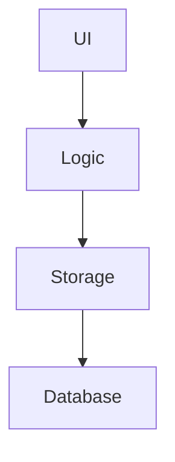
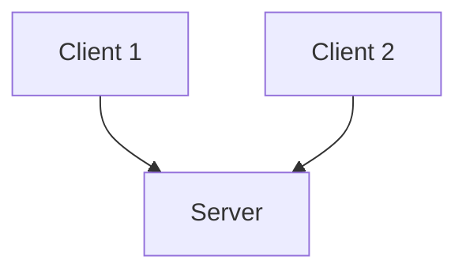
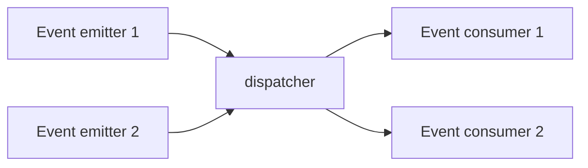
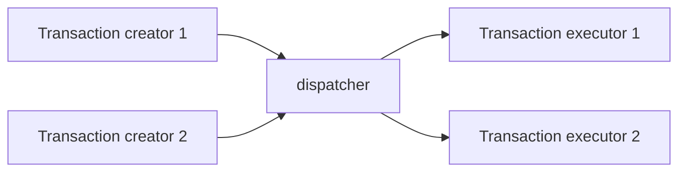

---
{"publish":true,"tags":["CS2103/T","software_engineering"],"title":"Architecture","PassFrontmatter":true}
---

> [!definition] Architecture
> Shows the overall organisation of the system, and can be viewed as a very high-level design.

Typically, it is designed by the software architect who
- provides technical vision for the system
- makes high level technical decisions about the project

> [!note] Diagrams
> Free-form - there are no universally adopted notation

As systems grow bigger, the design of the system cannot be shown in one place, and thus should be done at multiple levels.

# Styles

> [!note] Most applications use a mix of these architectural styles.

## n-Tier Style

Higher layers make use of services provided by lower layers.

For example:

## Client-Server Style

Client-server style has one component playing the role of the server, and one client component accessing the services of the server.

## Event-driven style

Control flow through detection of events from event emitters and communicating those events to interested event conusmers. Used in GUIs.

## Transaction Processing Style

Divides workload of system down to number of transactions which are given to a dispatcher that controls the execution of each transaction.

## Service-Oriented Style

Builds applications by combining functionalities packaged as programatically accessible services.

## Other Styles

- pipes-and-filters
- broker
- peer-to-peer
- message oriented
