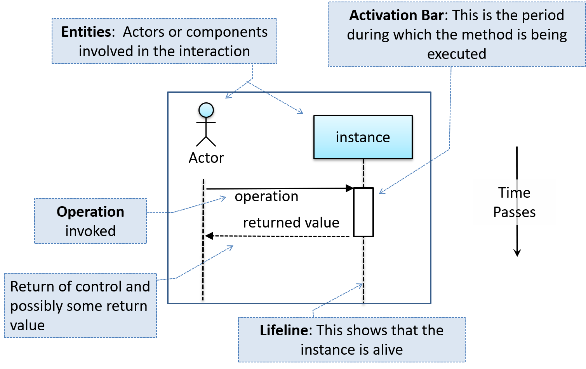
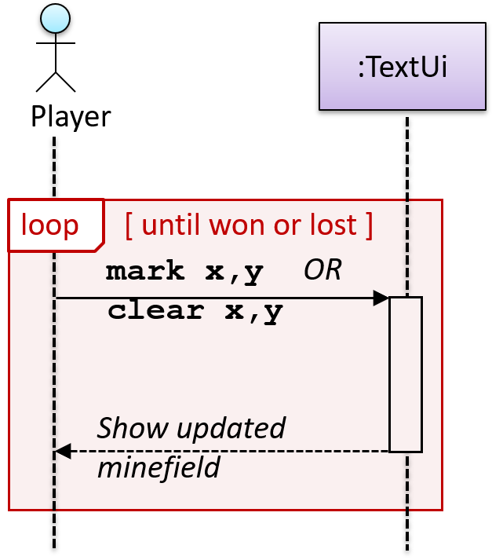
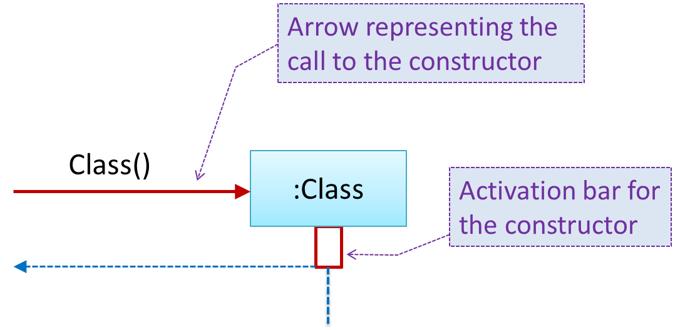
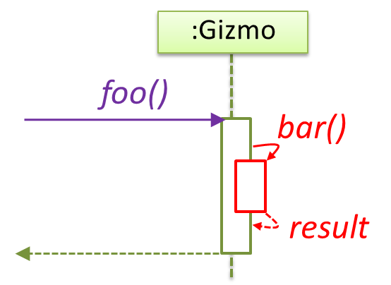
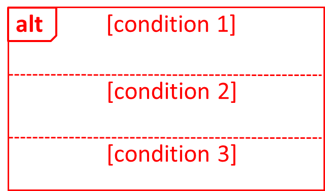
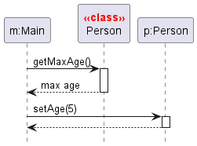
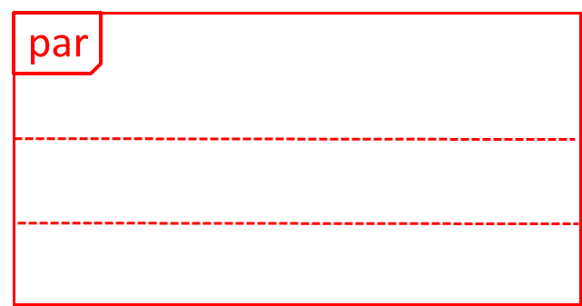
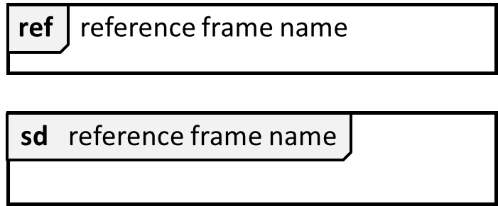
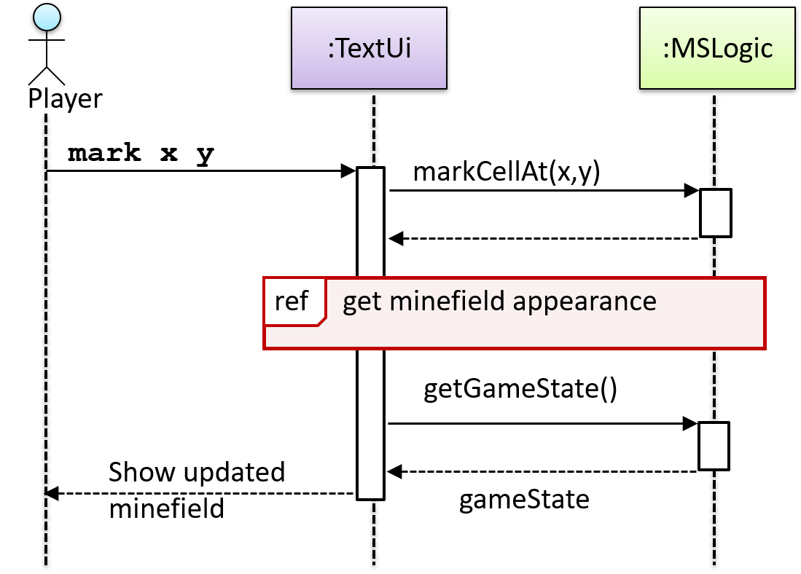

---
{"publish":true,"tags":["CS2103/T","software_engineering","UML"],"title":"Sequence Diagrams","PassFrontmatter":true}
---

> [!info] Sequence diagrams
> Used to model interactions between entities in a system in a specific scenario

> [!note] Method calls, and method returns
> Arrows representing method calls should be **solid** arrows.
> Arrows representing method returns should be **dashed** arrows.

> [!note] Type of method calls
> Synchronous method calls should have **filled** arrowheads
> Asynchronous method calls should have **lined** arrowheads. (out of scope for 2103T)

> [!note] Notation specifications for activation bar
> Activation bar should start at the arrow pointing to it, and end at the line pointing away from it.
> An activation bar should also be unbroken until method returns.

> [!info] Object creation
> 

> [!info] Object creation
> 

> [!info] Object deletion
> 
> 
> For Java, it can be used to indicate when the point ceases to be referenced (garbage-collected).

> [!info] Self-invocation (of methods)
> 

> [!info] Alternative paths
> 

> [!info] Optional paths
> 

> [!info] Calls to static methods
> 

> [!info] Parallel paths
> 

> [!info] Reference frames
> 
> Allows a segment of the interaction to be omitted and shown as a separate sequence diagram
> 
> 
> 
> > [!example]
> > 

