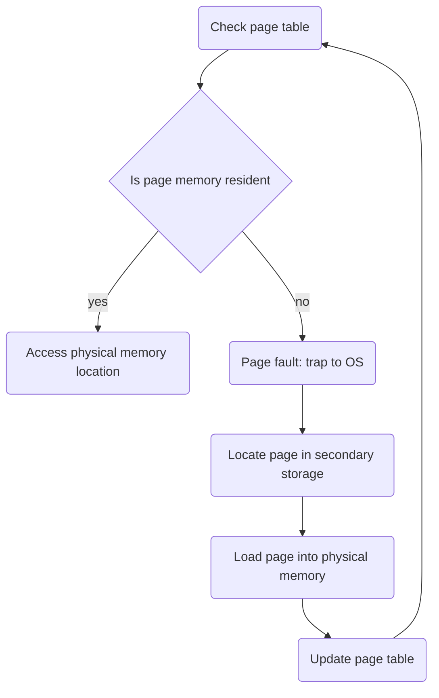
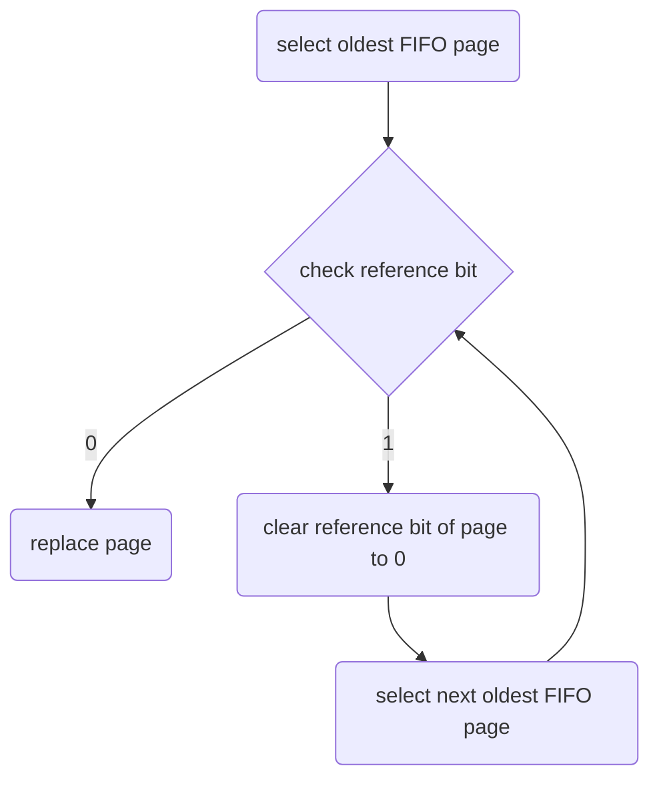

---
{"publish":true,"title":"Virtual Memory Management","tags":["CS2106","memory","operating_systems"],"cssclasses":""}
---

Previously, two assumptions:
- each process occupies a contiguous memory region ❌
- physical memory is large enough to contain one or more processes with complete memory space ❌

Assuming both assumptions are not made, situations can have a few issues
- what if the logical memory space of process is more than physical memory?
- what if same program is executed on computer with lesser physical memory?

# General Idea

Effectively, this is needed when

$$
\text{Secondary Storage Capacity} > \text{Physical Memory Capacity}
$$

Generally - the logical address space is split into small chunks, where some chunks reside in physical memory, and the other is stored on secondary storage.

<svg version="1.1" xmlns="http://www.w3.org/2000/svg" viewBox="0 0 534.8378352597551 472.0493774414062" width="534.8378352597551" height="472.0493774414062" class="excalidraw-svg">
  <!-- svg-source:excalidraw -->
  
  <defs>
    <style class="style-fonts">
      @font-face { font-family: Local Font; src: url(data:font/ttf;charset=utf-8;base64,AAEAAAAQAQAABAAAR0RFRlY3ewEAAAIkAAABzkdQT1P4RdpSAAAmBAAATrZHU1VCg3rIxQAAEJAAAAVkT1MvMnMaboAAAAHEAAAAYFNUQVR5l2rlAAABYAAAACpjbWFwSsV9VgAABzQAAARMZ2FzcAAAABAAAAEUAAAACGdseWa7urtYAAB0vAAAZAxoZWFkKkZaGAAAAYwAAAA2aGhlYRIEDa8AAAE8AAAAJGhtdHiR6DlbAAAV9AAABnhsb2Nh5uzOjAAAA/QAAAM+bWF4cAG2AQMAAAEcAAAAIG5hbWWIMMkxAAALgAAABRBwb3N07oznOgAAHGwAAAmXcHJlcGgGjIUAAAEMAAAAB7gB/4WwBI0AAAEAAf//AA8AAQAAAZ4AtAAOAE0ABgABAAAAAAAAAAAAAAAAAAMAAQABAAAD6P78AAAO1P9+/kAOmwABAAAAAAAAAAAAAAAAAAABngABAAEACAABAAAAFAABAAAAHAACd2dodAEBAAAAAgABAAAAAAEHAlgAAAAAAAEAAAABGZru+BWwXw889QADA+gAAAAA3Nvl/gAAAADgOhcq/37+gg6bA/EAAAAGAAIAAAAAAAAABAIxAlgABQAAAooCWAAAAEsCigJYAAABXgAyASIAAAAAAAAAAAAAAAAAAAABAAAAAAAAAAAAAAAAZnJhZwDAAA37AgPo/vwAAAPoAQQAAAABAAAAAAHjAr8AAAAgAAkAAQACARwAAAAqAAAAEgAAAAAAAQABAAAACAACAAIBfQGBAAABgwGJAAUAHAAMAOoA4gDaANIAygCqAHgARgA+ADYALgAmAAIAAQEBAQwAAAABAAQAAQFYAAEABAABAWsAAQAEAAEBVQABAAQAAQFmAAgALgAqACYAIgAeABoAFgASAAEMpgABCxIAAQl9AAEH6AABBlMAAQS+AAEDKQABAZUACAAuACoAJgAiAB4AGgAWABIAAQ0uAAELiQABCeMAAQg9AAEGmAABBPIAAQNMAAEBpgAFABwAGAAUABAADAABB8cAAQY5AAEEqwABAx0AAQGPAAEABAABATEAAQAEAAEBMwABAAQAAQFUAAEABAABATIAAQAEAAEBZwACAB0AAQALAAEADgAfAAEAIQAkAAEAJwAvAAEAMQA3AAEAOQBHAAEATABUAAEAVgBiAAEAZABoAAEAagByAAEAdgCBAAEAgwCHAAEAjACUAAEAlgCZAAEAnACkAAEApgCtAAEArwC7AAEAvQC+AAEAwgDKAAEAzADYAAEA2gDeAAEA4ADyAAEA9AD1AAEA9wEAAAEBAQEMAAIBWwFbAAEBXwFfAAEBfQGBAAMBgwGMAAMAAAAAACMAPQBJAFUAfACIAJQAoACsALgAxADQAQABOgFtAXkBuQHFAdEB+wItAmQClQK1AsEC7QL5AwUDEQMdAykDNQNPA4gDlAOgA6wDxgPnA/MEAAQMBBgEJAQwBDwEUARbBHoElQShBLMEvwTLBNcE8QUQBS8FOwVmBXIFfgWKBcIFzgXaBeYF8gY4BkQGhQaRBuIHDAc1B3YHpQexB+wH+Ag1CEEIigiWCKII9wkKCSoJNglaCWYJcgl+CYoJlgnJCdUJ4QntCgIKIQotCjkKRQpRCnYKkwqfCqsKtwrDCuIK7gsZCyULRgt6C5QL0AvcC+cMLww6DEUMUQxcDGgMdAx/DIsMyQz4DQQNQA1LDVcNlQ3YDeQOKQ5jDm8Otg7BDswO2A7kDu8O+w8fD20PeA/kD/AQFhBDEF8QaxB2EIEQjBCXEKMQtxDCEPARDhEnETMRPxFLEVcRYhF3EbUR2xHnEhoSJhIxEm4SoBKsErcSwhLOEw4TGRNTE14TahOpE+gUJRRFFFAUfRSIFMQUzxUXFSIVLhV5FYwVmBWjFcYV0hXdFegV8xX+Fi8WOhZGFlEWZBaEFpAWnBaoFrQW1hbxFv0XCBcTFx4XPRdIF3MXfheKF8AXzBgOGBkYJBgwGDwYRxhTGLIYzBjYGQwZLBk4GWUZcRl8GbQZwBnlGfEZ/Ro6GoYaqBrjGwYblhyXHXwdrx3RHfweFh5LHnceqR68HuwfKx9HH4cfwh/XIDEgayCAILIgzCD8ITwhWCGYIdMh6SJDIn0ilCLeIxcjdCOHI7Ij6iQEJAQkBCQEJBokOiRgJJAkoCS9JNslFyVSJVsldyWVJbglxyXWJeIl7iX6JgYmIyZAJnsmtibOJuYm7ib3JzEnbCeMJ6wnxSfeJ+4n/igUKCIoOCimKO8pICmCKeAqNCpeKooqlyqrKv0rUyuJK9csGixaLIUssyzCLNYs4yz7LSctOi1NLWEtei2iLbQtyC3rLkUuYC57LpYusC7LLuUvAC8aLz8vVS9jL3Evhi+mL7kvzC/pMBUwOzBIMGwwkDC2MNgw4DDoMPAw+DENMRUxKDEwMTgxQDFIMVAxWDF4MYMxvjIGAAAAAAACAAAAAwAAABQAAwABAAAAFAAEBDgAAABoAEAABQAoAA0ALwA5AH4ArAEHARMBGwEjAScBKwEzATcBPgFIAU0BWwFhAWUBfgHOAhsCNwK8AscC3QMEAwgDDAMSAygehR6eHvMgFCAaIB4gIiAmIDogRCB0IKwhICEiIZMhmSISIhUnE/sC//8AAAANACAAMAA6AKAArgEKARYBHgEmASoBLgE2ATkBQQFKAVABXgFkAWoBzQIYAjcCvALGAtgDAAMGAwoDEgMmHoAenh7yIBMgGCAcICIgJiA5IEQgdCCsISAhIiGQIZYiEiIVJxP7Af//AR8AAADfAAAAAAAAAAAAAAAAAAAAAAAAAAAAAAAAAAAAAAAAAAAAAAAAAAD+b/7e/swAAAAAAAAAAP53/mQAAOG3AADhLAAAAADhF+EN4Rfg4OC34LjgP+A5AAAAAN9X31LaQQYDAAEAAABmAAAAggEKASIB1AHmAfAB+gH8Af4CCAIKAhQCIgIoAj4CRAJGAm4CcAAAAAAAAAJwAnoCggKGAAAAAAKGAAACjgAAAo4CkgAAAAAAAAAAAAAAAAAAAAAChgKMAAAAAAAAAAAAAAEtATQBUgE7AWMBdAFWAVMBQgFDAToBaAEwAT4BLwE8ATEBMgFuAWwBbQE2AVUAAQANAA4AEwAXACAAIQAlACcAMAAxADMAOAA5AD8ASQBLAEwAUABWAFkAYwBkAGkAagBvAUYBPQFHAXIBQQGPAHYAggCDAIgAjACVAJYAmgCcAKUApwCpAK4ArwC1AL8AwQDCAMYAzADPANkA2gDfAOAA5QFEAV0BRQFwAS4BNQFhAWUBYgFmAV4BWAGNAVkBDQFOAXEBWgGXAVwBbwEpASoBkAFzAVcBOAGYASgBDgFPASYBJQEnATcABwACAAUACwAGAAoADAARAB0AGAAaABsALQApACoAKwAUAD0AQwBAAEEARwBCAWoARgBeAFoAXABdAGsASgDLAHwAdwB6AIAAewB/AIEAhgCSAI0AjwCQAKEAngCfAKAAiQCzALkAtgC3AL0AuAFrALwA1ADQANIA0wDhAMAA4wAIAH0AAwB4AAkAfgAPAIQAEgCHABAAhQAVAIoAFgCLAB4AkwAcAJEAHwCUABkAjgAiAJcAJACZACMAmAAmAJsALgCjAC8ApAAsAJ0AKACiADIAqAA0AKoANgCsADUAqwA3AK0AOgCwADwAsgA7ALEAPgC0AEUAuwBEALoASAC+AE0AwwBPAMUATgDEAFEAxwBTAMkAUgDIAFcAzQBgANYAWwDRAGIA2ABfANUAYQDXAGYA3ABsAOIAbQBwAOYAcgDoAHEA5wAEAHkAVADKAFgAzgGUAY4BlQGZAZYBkQF/AYABgwGHAYgBhQF+AX0BhgGBAYQAaADeAGUA2wBnAN0AbgDkAUwBTQFIAUoBSwFJAXsBdQF3AXkBfAF2AXgBegAAABsBSgADAAEECQAAAKgDHgADAAEECQABAB4DAAADAAEECQACAA4C8gADAAEECQADADQCvgADAAEECQAEAB4DAAADAAEECQAFADoChAADAAEECQAGAB4CZgADAAEECQAIABACVgADAAEECQAJACQCMgADAAEECQALAC4CBAADAAEECQAMACYB3gADAAEECQANASIAvAADAAEECQAOADYAhgADAAEECQAQAAwAegADAAEECQARABAAagADAAEECQAZAAwAegADAAEECQEAAAgAYgADAAEECQEBAAwAVgADAAEECQECAAgATgADAAEECQEDABQAOgADAAEECQEEAAoAMAADAAEECQEFAA4C8gADAAEECQEGAAwAJAADAAEECQEHABAAagADAAEECQEIAAgAHAADAAEECQEJABIACgADAAEECQEKAAoAAABCAGwAYQBjAGsARQB4AHQAcgBhAEIAbwBsAGQAQgBvAGwAZABNAGUAZABpAHUAbQBMAGkAZwBoAHQARQB4AHQAcgBhAEwAaQBnAGgAdABUAGgAaQBuAFcAZQBpAGcAaAB0AHMAcwAwADEAUwBlAG0AaQBCAG8AbABkAE8AdQB0AGYAaQB0AGgAdAB0AHAAcwA6AC8ALwBzAGMAcgBpAHAAdABzAC4AcwBpAGwALgBvAHIAZwAvAE8ARgBMAFQAaABpAHMAIABGAG8AbgB0ACAAUwBvAGYAdAB3AGEAcgBlACAAaQBzACAAbABpAGMAZQBuAHMAZQBkACAAdQBuAGQAZQByACAAdABoAGUAIABTAEkATAAgAE8AcABlAG4AIABGAG8AbgB0ACAATABpAGMAZQBuAHMAZQAsACAAVgBlAHIAcwBpAG8AbgAgADEALgAxAC4AIABUAGgAaQBzACAAbABpAGMAZQBuAHMAZQAgAGkAcwAgAGEAdgBhAGkAbABhAGIAbABlACAAdwBpAHQAaAAgAGEAIABGAEEAUQAgAGEAdAA6ACAAaAB0AHQAcABzADoALwAvAHMAYwByAGkAcAB0AHMALgBzAGkAbAAuAG8AcgBnAC8ATwBGAEwAdwB3AHcALgByAGYAdQBlAG4AegBhAGwAaQBkAGEALgBjAG8AbQB3AHcAdwAuAGYAcgBhAGcAdAB5AHAAZQBmAG8AdQBuAGQAcgB5AC4AeAB5AHoAUgBvAGQAcgBpAGcAbwAgAEYAdQBlAG4AegBhAGwAaQBkAGEAZgByAGEAZwBUAFkAUABFAE8AdQB0AGYAaQB0AC0AUwBlAG0AaQBCAG8AbABkAFYAZQByAHMAaQBvAG4AIAAxAC4AMQAwADAAOwBnAGYAdABvAG8AbABzAFsAMAAuADkALgAyADcAXQAxAC4AMQAwADAAOwBmAHIAYQBnADsATwB1AHQAZgBpAHQALQBTAGUAbQBpAEIAbwBsAGQAUgBlAGcAdQBsAGEAcgBPAHUAdABmAGkAdAAgAFMAZQBtAGkAQgBvAGwAZABDAG8AcAB5AHIAaQBnAGgAdAAgADIAMAAyADEAIABUAGgAZQAgAE8AdQB0AGYAaQB0ACAAUAByAG8AagBlAGMAdAAgAEEAdQB0AGgAbwByAHMAIAAoAGgAdAB0AHAAcwA6AC8ALwBnAGkAdABoAHUAYgAuAGMAbwBtAC8ATwB1AHQAZgBpAHQAaQBvAC8ATwB1AHQAZgBpAHQALQBGAG8AbgB0AHMAKQABAAAACgBcAQYAAkRGTFQAMGxhdG4ADgAEAAAAAP//AAwAAAACAAMABAAFAAYABwAJAAoACwAMAAgABAAAAAD//wAMAAAAAQADAAQABQAGAAcACQAKAAsADAAIAA1hYWx0AKJjY21wAJpjY21wAJBkbGlnAIpmcmFjAIRsaWdhAH5vcmRuAHhwbnVtAHJydnJuAGxzYWx0AGZzczAxAFxzdXBzAFZ0bnVtAFAAAAABAAwAAAABAAcABgABABAAAAEAAAAAAQAPAAAAAQARAAAAAQALAAAAAQAJAAAAAQAOAAAAAQAIAAAAAQANAAAAAwACAAYABgAAAAIAAgAGAAAAAgAAAAEAEgOeA2QC2gLEAsQCqAKCAnQCOAHwAc4BtgGoAUYAvgBEAEQAJgABAAAAAQAIAAIADAADAZsBnAGdAAEAAwAWAWEBYwABAAAAAQAIAAIAOgAaAOkA6gDrAOwA7QDuAO8A8ADxAPIA8wD0APUA9gD3APgA+QD6APsA/AD9AP4A/wEAARkBYAABABoAgQCMAI0AjgCPAJAAkQCSAJMAlACWAKcAqACuAK8AsACxALIAswC0AL4AzADNAM4BEAFWAAQACAABAAgAAQB2AAMAVAAWAAwAAQAEAQwAAgDMAAMAKgAWAAgBBgAGAM8AzACVAJwAzAEIAAkAzwDMAJUAnADMAMwAjADCAQcACQDPAMwAlQCcAMwAzACMAIgABAAcABYAEAAKAQUAAgCpAQIAAgClAQQAAgCcAQEAAgCVAAEAAwCVALUAzAAEAAgAAQAIAAEATgAEADQAKgAYAA4AAQAEAQsAAgCVAAIADAAGAQoAAgDMAQkAAgCVAAEABAEDAAIAzAADABQADgAIAHUAAgCpAHQAAgCaAHMAAgBWAAEABABWAJUAwgDMAAEAAAABAAgAAQB+AAsAAQAAAAEACAABAAb/9QACAAEBGgEjAAAAAQAAAAEACAACAA4ABAENAQ4BDQEOAAEABAABAD8AdgC1AAYAAAACACQACgADAAEANAABABIAAAABAAAACgABAAIAPwC1AAMAAQAaAAEAEgAAAAEAAAAKAAEAAgABAHYAAgABAQ8BGAAAAAQAAAABAAgAAQAsAAIAFgAKAAEABAEnAAMBPAETAAIADgAGASUAAwE8AREBJgADATwBEwABAAIBEAESAAEAAAABAAgAAQD+ABgAAgAAAAEACAABAAoAAgAYABIAAQACAQQBBQACAJUAqQACAJUAnAACAAAAAQAIAAEACAABAA4AAQABAKQAAgCdAYwAAQAAAAEACAABAAYAAQABAAIAnAClAAYAAAABAAgAAgB4AHQAXgBIAAMAAAAkABIAAQAEAAAAAQABAAEAAQAAAAUAAgAWAAYAAAABAAIAAgABAAEAAAAEAAAAAQABAAEAAQAAAAMAAgADAX0BgQABAYMBiQABAYsBjAACAAIAAwCcAJwAAQCkAKQAAgClAKUAAQACAAAAAQADAJwApAClAAMAAAABAAgAAQAOAAQAKgAkAB4AGAACAAEBEAETAAAAAgEeASsAAgEdASoAAgEcASkAAwEZARsBKAABAAAAAQAIAAIAYAAtAQ0BDgENAOkA6gDrAOwA7QDuAO8A8ADxAPIA8wD0APUA9gD3APgA+QD6APsA/AEOAP0A/gD/AQABGgEfASABIQEiASMBDwEQAREBEgETARQBFQEWARcBGAFgAAIADgABAAEAAAA/AD8AAQB2AHYAAgCBAIEAAwCMAJQABACWAJYADQCnAKgADgCuALUAEAC+AL4AGADMAM4AGQEPAQ8AHAEUARgAHQEaASMAIgFWAVYALAKrAEcCywAUAssAFALLABQCywAUAssAFALLABQCywAUAssAFALLABQCywAUAssAFAPcABQCdwBIAq4AJQKuACUCrgAlAq4AJQKuACUC6wBIAv8AFwLrAEgDAgAAAloASAJaAEgCWgBIAloASAJaAEgCWgBIAloASAJaAEgCWgBIAkIASAMKACUDCgAlAwoAJQMKACUC0QBIAtEAAAEYAEgCiQBIARgAGgEY/9QBGP/XARgAQwEYAAkBGP/cARgADwIBABMCsABIArAASAIsAEgCLABIAiwASAIsAEgCZgA6A1IASALXAEgC1wBIAtcASALXAEgC1wBIAtcASAMgACQDIAAkAyAAJAMgACQDIAAkAyAAJAMgACQDIAAiAyAAJASDACQCaABIAmgASAM0ACUCgABIAoAASAKAAEgCgABIAjkAFQI5ABUCOQAVAjkAFQI5ABUC2QBIAnUAFgJ1ABYCdQAWArgAPwK4AD8CuAA/ArgAPwK4AD8CuAA/ArgAPwK4AD8CuAA/ArgAPwLBABQD4AAWA+AAFgPgABYD4AAWA+AAFgLDABQCpwASAqcAEgKnABICpwASAqcAEgJWACACVgAgAlYAIAJWACAEXwAWBFQAFgMZABYCTAAcAkwAHAJMABwCTAAcAkwAHAJMABwCTAAcAkwAHAJMABwCTAAcAkwAHAOfABwCTAA6AewAGgHsABoB7AAaAewAGgHsABoCTAAcAjgAHgMZABwCWAAcAh0AGgIdABoCHQAaAh0AGgIdABoCHQAaAh0AGgIdABoCHQAaAaMACgJDABoCQwAaAkMAGgJDABoCMgA6AjIAAAD4ADIA9wA6APcACQD3/8MA9//GAPf/+AH5ADIA9//LAPj//AEB/34BAf9+AhAAOgIQADoA9wA6APcAIgHEADoA9wAaAYkAOgNjADoCMgA6AjIAOgIyADoCMgA6AjIAOgIyADoCOQAaAjkAGgI5ABoCOQAaAjkAGgI5ABoCOQAaAjkADwI5ABoDpAAaAkwAOgJMADoCTAAcAbIAOgGyADoBsgAmAbIAGgG8AA4BvAAOAbwADgG8AA4BvAAOAkkAOgGFABAB/QAQAYUAEAIQAC0CEAAtAhAALQIQAC0CEAAtAhAALQIQAC0CEAAtAhAALQIQAC0CCwACAwEABgMBAAYDAQAGAwEABgMBAAYCCwAIAg4ACAIOAAgCDgAIAg4ACAIOAAgB0gAYAdIAGAHSABgB0gAYA4oAHAIHABoCBwAaAgcAGgIHABoCBwAaAgcAGgIHABoCBwAaAgcAGgIFAA4CBgA6AgYAOgNNAC4CGQAtAhkALQIZAC0CGQAtAhkALQIZAC0DjgAaAdYAEQHjABEB1gARAs4ACgJkAAoCqQAKAmcACgJiAAoJVgAaDtQAGg47ABoCzAA6AqkAOgLVABACsAAQAWYADgFaAA0ClAAkAW8AFwIpABoCJgAUAlwAGQIpABECOAAeAg0AFwIrACECOAAdAYQAEAJOAAwCTgBMAk4AJwJOACICTgAUAk4AHgJOACYCTgApAk4ALQJOACUCrwAXAq8AFwK0ABcCrwAYAQsAFwFUABgBUAAUAVwAGQJYAAAAwwAAAMMAAAEnAEIBGAA5ARkAOgETADUDJQBCARIANAEWADkB9wAcAeYAJwCkAAABWgA7AeoAJQKMACcBiQAGAYkABgHOADoCMQA6A2AAOgHtAAABMAAkATAAFAFOABYBTgAdAVkARQFZACABGAA5Ae4AOQHXACYB1wAuAQAAJgEBAC4B7QAcAe0AGwEcABwBHAAbAbkAOQD2ADgDMgATAusAKAKoAC0CzwAsAg8AMAMxADMCKAA4As0AGAGKACEBIwBWASMAVgK2ABgCjQAxAgoAKAJYADoCUgAqAs0ACgJxADsCkQAuAYkABgIrADMCKwAzAisANAIrADMCKwAzAisAMwIrADMCKwAzAisAKAIrADMBywAnAkkAVgKfACUCkgBIApIASAKSABYCkgBIApIASAKSAEgCkgAWApIASAAAADoAAABaAAAAKAAAACgAAAAoAAAATwAAACgAAAAoAAAAKAAAACgAAAAoAAAAKAAAACEAAAAhAAAADgAAACgB3gA6AUgAWgE0ACgBNAAoAdkAKAHAACgBwAAoAcAAKAFRACgB6AAoAcwAKAEhAA4BLwAoAQkAIwMCAAACCgAoAlIAKgACAAAAAAAA/5wAMgAAAAAAAAAAAAAAAAAAAAAAAAAAAZ4AAAAkAMkBAgEDAMcAYgCtAQQBBQBjAK4AkAAlACYA/QD/AGQBBgAnAOkBBwEIACgAZQEJAMgAygEKAMsBCwEMACkAKgD4AQ0BDgArAQ8ALAEQAMwAzQDOAPoAzwERARIALQAuARMALwEUARUBFgDiADAAMQEXARgBGQBmARoAMgDQANEAZwDTARsBHACRAK8AsAAzAO0ANAA1AR0BHgEfADYBIADkAPsBIQEiADcBIwEkADgA1AElANUAaADWASYBJwEoASkAOQA6ASoBKwEsAS0AOwA8AOsBLgC7AS8APQEwAOYBMQEyATMBNABEAGkBNQE2AGsAbABqATcBOABuAG0AoABFAEYA/gEAAG8BOQBHAOoBOgEBAEgAcAE7AHIAcwE8AHEBPQE+AEkASgD5AT8BQABLAUEATADXAHQAdgB3AHUBQgFDAUQATQFFAE4BRgBPAUcBSAFJAOMAUABRAUoBSwFMAHgBTQBSAHkAewB8AHoBTgFPAKEAfQCxAFMA7gBUAFUBUAFRAVIAVgFTAOUA/AFUAIkAVwFVAVYAWAB+AVcAgACBAH8BWAFZAVoBWwBZAFoBXAFdAV4BXwBbAFwA7AFgALoBYQBdAWIA5wFjAWQBZQFmAWcBaAFpAWoBawFsAW0BbgFvAXABcQFyAXMBdAF1AXYBdwF4AXkBegF7AXwBfQF+AMAAwQF/AYABgQGCAYMBhAGFAJ0AngATABQAFQAWABcAGAAZABoAGwAcAYYBhwGIAYkBigGLAYwBjQGOAY8BkAC8APQA9QD2AZEBkgGTAZQBlQADAZYAEQAPAB0AHgCrAAQAowAiAKIAwwCHAA0ABgASAD8AEACyALMAQgALAAwAXgBgAD4AQADEAMUAtAC1ALYAtwCpAKoAvgC/AAUACgGXACMACQCIAIYAiwCKAIwAgwBfAOgBmAGZAIQAvQAHAZoAhQCWAZsADgDvAPAAuAAgACEAHwCTAGEApABBAZwACAGdAZ4BnwGgAaEBogGjAaQBpQGmAacBqAGpAaoBqwGsAa0BrgGvAbABsQGyAbMBtACOANwAQwCNAN8A2ADhANsA3QDZANoA3gDgAbUBtgG3AbgGQWJyZXZlB3VuaTAxQ0QHQW1hY3JvbgdBb2dvbmVrCkNkb3RhY2NlbnQGRGNhcm9uBkRjcm9hdAZFY2Fyb24KRWRvdGFjY2VudAdFbWFjcm9uB0VvZ29uZWsHdW5pMDEyMgpHZG90YWNjZW50BEhiYXICSUoHSW1hY3JvbgdJb2dvbmVrB3VuaTAxMzYGTGFjdXRlBkxjYXJvbgd1bmkwMTNCBk5hY3V0ZQZOY2Fyb24HdW5pMDE0NQNFbmcNT2h1bmdhcnVtbGF1dAdPbWFjcm9uBlJhY3V0ZQZSY2Fyb24HdW5pMDE1NgZTYWN1dGUHdW5pMDIxOAd1bmkxRTlFBlRjYXJvbgd1bmkwMjFBBlVicmV2ZQ1VaHVuZ2FydW1sYXV0B1VtYWNyb24HVW9nb25lawVVcmluZwZXYWN1dGULV2NpcmN1bWZsZXgJV2RpZXJlc2lzBldncmF2ZQtZY2lyY3VtZmxleAZZZ3JhdmUGWmFjdXRlClpkb3RhY2NlbnQDVF9UA1RfaANUX2wGYWJyZXZlB3VuaTAxQ0UHYW1hY3Jvbgdhb2dvbmVrCmNkb3RhY2NlbnQGZGNhcm9uBmVjYXJvbgplZG90YWNjZW50B2VtYWNyb24HZW9nb25lawd1bmkwMTIzCmdkb3RhY2NlbnQEaGJhcgJpagdpbWFjcm9uB2lvZ29uZWsHdW5pMDIzNwd1bmkwMTM3BmxhY3V0ZQZsY2Fyb24HdW5pMDEzQwZuYWN1dGUGbmNhcm9uB3VuaTAxNDYDZW5nDW9odW5nYXJ1bWxhdXQHb21hY3JvbgZyYWN1dGUGcmNhcm9uB3VuaTAxNTcGc2FjdXRlB3VuaTAyMTkGdGNhcm9uB3VuaTAyMUIGdWJyZXZlDXVodW5nYXJ1bWxhdXQHdW1hY3Jvbgd1b2dvbmVrBXVyaW5nBndhY3V0ZQt3Y2lyY3VtZmxleAl3ZGllcmVzaXMGd2dyYXZlC3ljaXJjdW1mbGV4BnlncmF2ZQZ6YWN1dGUKemRvdGFjY2VudAdhZS5zczAxBmUuc3MwMQtlYWN1dGUuc3MwMQtlY2Fyb24uc3MwMRBlY2lyY3VtZmxleC5zczAxDmVkaWVyZXNpcy5zczAxD2Vkb3RhY2NlbnQuc3MwMQtlZ3JhdmUuc3MwMQxlbWFjcm9uLnNzMDEMZW9nb25lay5zczAxBmcuc3MwMQZrLnNzMDEMdW5pMDEzNy5zczAxBm0uc3MwMQZuLnNzMDELbmFjdXRlLnNzMDELbmNhcm9uLnNzMDEMdW5pMDE0Ni5zczAxC250aWxkZS5zczAxCGVuZy5zczAxB29lLnNzMDEGdC5zczAxC3RjYXJvbi5zczAxDHVuaTAyMUIuc3MwMQNmX2YDZl9qA2ZfdAtvX3VfdF9mX2lfdBFvX3VfdF9mX2lfdF90X2VfZBFvX3VfdF9mX2lfdF90X2VfcgNyX2YDcl90A3RfZgN0X3QIb25lLnNzMDEHemVyby50ZgZvbmUudGYGdHdvLnRmCHRocmVlLnRmB2ZvdXIudGYHZml2ZS50ZgZzaXgudGYIc2V2ZW4udGYIZWlnaHQudGYHbmluZS50Zgd1bmkwMEI5B3VuaTAwQjIHdW5pMDBCMwd1bmkyMDc0AkNSB3VuaTAwQTAHdW5pMjcxMwd1bmkyMTIwDmFtcGVyc2FuZC5zczAxBEV1cm8HdW5pMjIxNQd1bmkwMEI1B2Fycm93dXAHdW5pMjE5NwphcnJvd3JpZ2h0B3VuaTIxOTgJYXJyb3dkb3duB3VuaTIxOTkJYXJyb3dsZWZ0B3VuaTIxOTYHdW5pMDMwOAd1bmkwMzA3CWdyYXZlY29tYglhY3V0ZWNvbWIHdW5pMDMwQgt1bmkwMzBDLmFsdAd1bmkwMzAyB3VuaTAzMEMHdW5pMDMwNgd1bmkwMzBBCXRpbGRlY29tYgd1bmkwMzA0B3VuaTAzMTIHdW5pMDMyNgd1bmkwMzI3B3VuaTAzMjgKYXBvc3Ryb3BoZRdEY3JvYXQuQlJBQ0tFVC52YXJBbHQwMRVjZW50LkJSQUNLRVQudmFyQWx0MDEXZG9sbGFyLkJSQUNLRVQudmFyQWx0MDEAAAEAAAAKACgAUAACREZMVAAObGF0bgAOAAQAAAAA//8AAwAAAAEAAgADa2VybgAibWFyawAabWttawAUAAAAAQADAAAAAgABAAIAAAABAAAABA7AA3IAvgAKAAYAEAABAAoAAAABAJoAmgABAGgADAAMAFYAUABKAEQAPgA4ADgAMgAsACYAIAAaAAEAfwMQAAEA5gKpAAEA9AK5AAEAqQMOAAEA4ALYAAEA4AL/AAEA5gKYAAEAmwLrAAEArAL7AAEApAK9AAEA7wK+AAwAAA4uAAAOKAAADiIAAA4cAAAOFgAADhAAAA4QAAAOEAAADgoAAA4EAAAN/gAADfgAAgACAX0BgQAAAYMBiQAFAAUAAAABAAgAAQ3qApwAAw1eAAwACQJqAkQBxAEyAKAAegBaADQAFAACDbgAGgAAABQADgAAAAECBAAAAAECBAHjAAEArAAAAAIAIAAaAAAAFAAOAAAAAQIgAAAAAQIgAeMAAQC1AAAAAQC1AeMAAgAaABQAAAAOAfgAAAABAf8B4wABAKsAAAABAKsB4wACACAAGgAAABQADgAAAAECGQAAAAECGQHjAAEAswAAAAEAswHjAAkAjACGAIAAegB0AG4AaABiAFwAVgBQAEoARAA+ADgARAA+ADgARAA+ADgARAA+ADgARAA+ADgAAQzPAAoAAQceAAAAAQceAeMAAQWJAAoAAQWJAAAAAQWJAeMAAQP0AAoAAQP0AAAAAQP0AeMAAQJgAAoAAQJgAAAAAQJgAeMAAQDLAAoAAQDLAAAAAQDLAeMACQCMAIYAgAB6AHQAbgBoAGIAXABWAFAASgBEAD4AOABEAD4AOABEAD4AOABEAD4AOABEAD4AOAABDVgACgABB2oAAAABB2oB4wABBcQACgABBcQAAAABBcQB4wABBB4ACgABBB4AAAABBB4B4wABAnkACgABAnkAAAABAnkB4wABANMACgABANMAAAABANMB4wAGAHoAdABuAGgAYgBcAFYAUABKAEQAPgA4ADIALAAmADIALAAmAAEIZwAKAAEEqwAAAAEEqwHjAAEFcgAKAAEFcgAAAAEFcgHjAAED5AAKAAED5AAAAAED5AHjAAECVgAKAAECVgAAAAECVgHjAAEAxwAKAAEAxwAAAAEAxwHjAAIAIAAaAAAAFAAOAAAAAQH/AAAAAQH/AtMAAQCqAAAAAQCqAtMAAgAgABoAAAAUAA4AAAABAcwAAAABAcwC0wABAJoAAAABAJoC0wACAAIBAgEDAAABBgEMAAIABAAAAAEACAABCzYJ/gADCqoADADaCewJ5gngCdoJ5gngCdQJ5gngCc4J5gngCc4J5gngCcgJ5gngCcIJ5gngCbwJ5gngCewJ5gngCbYJ5gngCbAJ5gngCaoJpAAACZ4JpAAACZgJpAAACaoJpAAACZIJpAAACYwAAAAACYYAAAAACYAAAAAACXoAAAAACXQJbgloCWIJbgloCVwJbgloCVwJbgloCVYJbgloCVAJbgloCUoJbgloCUQJbgloCXQJbgloCT4JOAAACTIJOAAACT4JOAAACSwJOAAACSYJIAkaCRQJDgkICQIJIAkaCPwJIAkaCPYJIAkaCPAJIAkaCOoJIAkaCOQJIAkaCSYJIAkaAAAI3gAAAAAI3gAACNgJbgAACNIJbgAACNgJbgAACNgJbgAACMwIxgAACMAIugAACLQIugAACK4IugAACMAIugAACKgIugAAAAAAAAiiCT4JOAicCJYJOAicCJAJOAicCIoJOAicCIQJOAicCH4JOAicCHgJOAicCT4JOAicCHIJOAicCGwIZgAACGAIZgAACFoIZgAACGwIZgAACFQITgAACEgITgAACEIITgAACFQITgAACFQITgAACDwINgAACDAINgAACDwINgAACCoIJAgeCBgIJAgeCBIIJAgeCAwIJAgeCAYIJAgeCAAIJAgeB/oIJAgeB/QIJAgeCCoIJAgeB+4IJAgeB+gH4gAAB9wH4gAAB9YH4gAAB9AH4gAAB8oH4gAAB8QHvgAAB7gHvgAAB7IHvgAAB6wHvgAAB6YHvgAAB6AAAAAAB5oAAAAAB5QAAAAAB44AAAAAB4gHggd8B3YHggd8B3AHggd8B2oHggd8B2oHggd8B2QHggd8B14Hggd8B1gHggd8B4gHggd8B1IHggd8B0wHggd8B0YHQAAABzoHQAAABzQHQAAAB0YHQAAABy4HQAAABygITgciBxwITgciBxYITgciBxYITgciBxAITgciBwoITgciBwQITgciBv4ITgciBygITgciB4gG+AAAB3AG+AAABvIG+AAABuwG+AAAAAAG5gbgBtoG5gbgBtQG5gbgBs4G5gbgBsgG5gbgBsIG5gbgAAAG5gbgBrwG5gbgAAAG5gbgBrYGsAaqAAAGpAAAAAAGpAAABp4G5gAABpgG5gAABp4G5gAABp4G5gAABpIGjAAABoYGgAAABnoGgAAABnQGgAAABoYGgAAABm4GgAAABoYGgAAABmgGYgZcBlYGYgZcBlAGYgZcBkoGYgZcBkQGYgZcBj4GYgZcBjgGYgZcBjIGYgZcBiwG5gAABiYG5gAABiAG5gAABiwG5gAABhoGFAAABg4GFAAABggGFAAABhoGFAAABhoGFAAABgIF/AAABgIF/AAABgIF/AAABfYF8AXqBeQF8AXqBd4F8AXqBdgF8AXqBdIF8AXqBcwF8AXqBcYF8AXqBcAF8AXqBfYF8AXqBfYF8AXqBboFtAAABa4FtAAABagFtAAABaIFtAAABZwFtAAABZYFkAAABYoFkAAABYQFkAAABX4FkAAABXgFkAAABXIFbAAABWYFbAAABWAFbAAABVoFbAAABygITgVUBxwITgVUBxYITgVUBxYITgVUBxAITgVUBwoITgVUBwQITgVUBv4ITgVUBygITgVUAAAGpAAAAAAGpAAABU4FSAAABUIFSAAABTwFSAAABU4FSAAABTYFSAAABU4FSAAAAAAgygAAAAAgygAAAAAgygAABTAFKgAABSQFHgAAAAEAmgE/AAEApwKfAAEAqwE/AAEAqwKfAAEBDgK5AAEBDgL/AAEBDgLrAAEBDgAAAAEBDgHjAAEBlAAKAAEA9wK9AAEA9wL/AAEA9wLrAAEA9wAAAAEA9wHjAAEBBwL7AAEBBwK+AAEBBwL/AAEBBwLrAAEBBwAAAAEBBwHjAAEBgQL7AAEBgQK+AAEBgQL/AAEBgQLrAAEBgQAAAAEBgQHjAAEBCQKpAAEBCQKvAAEBCQL7AAEBCQK+AAEBCQL/AAEBCQLYAAEBCQLrAAEBawAKAAEBCQAAAAEBCQHjAAEAwgAAAAEAwgK/AAEA5wL/AAEA5wLrAAEA5AAAAAEA5wHjAAEA3gL/AAEA3gLrAAEA3gHjAAEBHQK5AAEBHQKpAAEBHQKvAAEBHQL7AAEBHQK+AAEBHQL/AAEBHQLrAAECAQAKAAEBHQAAAAEBHQHjAAEBGQK5AAEBGQL/AAEBGQLrAAEBGQAAAAEBGQHjAAEAxAAAAAEAqgGYAAEAlAPHAAEAlAK/AAEBFAAAAAEA3wAKAAEAfAAAAAEAfAHjAAEAewKpAAEAewL7AAEAewK+AAEAewL/AAEAewLrAAEAewHjAAEAvQAAAAEAewAAAAEBKAK9AAEBKAMQAAEBHP82AAEBGAKpAAEBGAL7AAEBGAK9AAEBGAK+AAEBGAL/AAEBGALrAAEBiwAKAAEBGAHjAAEBGgK9AAEBGgL/AAEBGgLrAAEBEAAAAAEBGgHjAAEBKAK5AAEBKAMOAAEBKAKpAAEBKAL7AAEBKAK+AAEBKAL/AAEBKALYAAEBKALrAAECEgAAAAEBHAAAAAEBKAHjAAEBKwOZAAEBKwPbAAEBKwPHAAEBKwK/AAEBVAPXAAEBVAOaAAEBVAPbAAEBVAPHAAEBVAAAAAEBVAK/AAEB8APXAAEB8AOaAAEB8APbAAEB8APHAAEB8AAAAAEB8AK/AAEBXAPqAAEBXAOFAAEBXAOLAAEBXAPXAAEBXAOaAAEBXAPbAAEBXAO0AAEBXAPHAAEBzQAKAAEBXAAAAAEBXAK/AAEBOwPbAAEBOwAAAAEBOwK/AAEBMQPbAAEBMQPHAAEBGAAAAAEBMQK/AAEBKgPbAAEBKgPHAAEBNQAAAAEBKgK/AAEBkAOVAAEBkAOFAAEBkAOLAAEBkAPXAAEBkAOaAAEBkAPbAAEBkAPHAAEC0AAKAAECpgAKAAEBbAOVAAEBbAPbAAEBbAPHAAEBbAAAAAEBbAK/AAEBaAAAAAEBaAK/AAEBLQPHAAEBLQK/AAEBQwAAAAEAjAOFAAEAjAPXAAEAjAOZAAEAjAOaAAEAjAPbAAEAjAPHAAEAywDcAAEAigDcAAEAigK/AAEA0AAAAAEAjAAAAAEAjAK/AAEBkAOZAAEBkAO0AAEBkAAAAAEBkAK/AAEBQQOFAAEBQQPXAAEBQQOZAAEBQQOaAAEBQQPbAAEBQQPHAAECMQAAAAEBLQAAAAEBQQK/AAEBcQK/AAEBWgPbAAEBbgK/AAEBWgK/AAEBfQOZAAEBfQPbAAEBfQPHAAEBeAAAAAEBfQK/AAEBZgOVAAEBZgOIAAEBZgOFAAEBZgPXAAEBZgOaAAEBZgPbAAEBZgO0AAEBZgPHAAECuAAAAAEBZgAAAAEBZgK/AAIAHAABAAsAAAAOAB8ACwAhACQAHQAnAC8AIQAxADcAKgA5AEcAMQBMAFQAQABWAGIASQBkAGgAVgBqAHIAWwB2AIAAZACDAIcAbwCMAJQAdACWAJkAfQCcAKQAgQCmAK0AigCvALsAkgC9AL0AnwDCAMoAoADMANgAqQDaAN4AtgDgAOgAuwDqAPIAxAD0APUAzQD3APwAzwD+AQAA1QFbAVsA2AFfAV8A2QAPAAAAhgAAAIAAAAB6AAAAdAAAAG4AAABoAAAAaAAAAGgAAABiAAAAXAAAAFYAAABQAAEASgABAEQAAgA+AAEA6QAAAAEAnQAAAAEAgwAAAAEAfwHjAAEA5gHjAAEA9AHjAAEAqQHjAAEA4AHjAAEA5gHMAAEAmwHjAAEArAHjAAEApAHjAAEA7wHjAAIAAgF9AYEAAAGDAYwABQACAAgAAgXAAAoAAgLgAAQAAATCA4YAFAASAAAAAAAAAAAAAAAAAAAAAAAA//UAAP/4AAAAAP/kAAAAAAAAAAAAAAAAAAAAAAAAAAAAAAAA//oAAAAAAAAAAP/zAAAAAP/iAAAAAAAAAAAAAAAAAAAAAAAA//QAAP/yAAAAAP/PAAD/8v/FAAD/5v/4AAD/0P/u/9oAAP/w/9r/pf+9/6//nf+Z//IAAP+LAAD/+gAAAAD/8wAAAAAAAAAAAAD/6gAAAAAAAAAAAAAAAAAAAAAAAAAAAAAAAAAA/+cAAAAAAAD/+QAAAAD/9AAAAAAAAAAAAAAAAAAAAAAAAAAAAAAAAAAAAAAAAAAAAAAAAAAAAAAAAP/3AAAAAAAAAAAACQAA/9AAAAAAAAD/1wAAAAD/yf/6AAD/3//hAAD/9AAAAAAAAAAAAAAAAAAA//IAAAAAAAAAAAAWAAD/3gAAAAD/9AAAAAD/5AAA/+4AAAAA/+r/9P/eAAAAAAAFAAAAAAAAAAAAAAAAAAAAAAAA/68AAAAAAAAAAAAAAAAAAAAAAAAAAAAAAAD/cP/o/6L/yf+i/53/7QAA/8f/2f+hAAAAAP/w/6r/lgAAAAD/9QAAAAAAAAAAAAAAAAAA//gAAAAAAAAAAP/0AAAAAAAAAAD/iAAA/53/1/+e/6UAAP/5/9D/4P+TAAD/2QAd/63/wwAeAAD/6gAA/+4AAAAAAAAAGAAA/+QAAP/1AAAAAAA7AAD/0ABHAAD/sQAA/93/4v/W/3kAAAAA//oAGP/oAAAAAAAAAAAAAAAAAAD/8gAAAAD/3wAAAAAAAAAA/+H/w//RAAD/lv+tAAAAAAAAAAD/xQAA//H/4f/3/4sAAAAAAAwAHgAAAAAAAAAAAAAAAAAAAAD/zwAAAAAAAAAA/50AAAAAABYAHQAAAAAAAAAAAAAAAAAAAAD/8gAAAAAAAAAAAAAAAAAAAAAAAP/uAAAAAAAAAAD/0QAAAAIAGwABAAwAAAAOABIADAAXAB8AEQAwADAAGgA/AEgAGwBWAGIAJQBkAGgAMgBqAG4ANwBzAHQAPACBAIcAPgCMAJUARQCaAJsATwCuAMAAUQDMAMwAZADOANkAZQDpAOkAcQDrAPIAcgD2AP0AegEBAQEAggEDAQMAgwEGAQYAhAEJAQwAhQEvATAAiQFKAU0AiwFSAVMAjwFVAVUAkQGaAZoAkgACADQAAQAMAAYADQANAAIADgASAAQAEwAgAAIAIQAkAAQAJQAlAAIAJwAnAAIAKQAvAAIAMQA+AAIAPwBIAAQASQBKAAIASwBLAAQATABPAAIAVgBYAAoAWQBiAAgAZABoAAwAagBuAA0AcwB1AAoAdgCBAAEAggCCAAcAgwCIAAEAigCUAAEAlQCVAAkAlgCZAAEAmgCaAAcApwCtAAcArgC0AAMAtQC+AAEAvwDAAAMAwQDBAAEAwgDFAAMAzADOAAkAzwDYAAUA2QDZAAsA4ADkAAsA6QDyAAEA9AD1AAcA9gD8AAMA/QD9AAEA/gD+AAkBAQEFAAkBBgEIAAUBCQEKAAMBLwEwABABMQEyAA8BSwFLAA4BTQFNAA4BUgFTABEBVQFVAAEBXQFdAAIBmgGaAA4BmwGbAAIAAgAoAAEACwADAAwADAAEAA4AEgAJABcAHwAEADAAMAAFAD8ARwAHAEgASAAEAFYAWAANAFkAYgAFAGQAaAAKAGoAbgALAHMAcwANAHQAdAABAIIAggACAIMAhwAMAJUAlQAOAJoAmwABAK4AtAABALUAvQACAL8AwAACAMwAzAAIAM4AzgAIAM8A2AAGANkA2QATAPYA/AABAQEBAQAOAQMBAwAIAQYBBgAIAQkBCQAOAQoBCgAIAQsBCwAOAQwBDAAIAS8BMAAQAUoBSgASAUsBSwAPAUwBTAASAU0BTQAPAVIBUwARAVUBVQACAZoBmgAPAAEBfgAEAAAAujmoOag5qDmoOag5qDmoOag5qDmoOag5hjlAOR45HjkeOR45HjmGOYY5hjmGOYY5hjmGOYY5hjc4NlY2SDZINkg2SDZINkg2SDZINkg2MjMIMNY2SDZINkg2SDZINkg2SDCkMKQwpDCkMKQwpDCkMKQwpDmGLnYtbCpKKFwoGigaKBo2MjYyNjI2MjYyNjI2MjYyNjI2MiVwIvYfTB72HvYe9h72HvYdCCgaHNoczBy6HLAcsBywHLAcsBzMHMwczBzMHMwczBzMHMwczBx+HHgcchxsGpIcuhy6HLocuhy6HLocuhy6HLoczBy6HLoahBhuGGQYUhhSGDQXDhXUE/IS4BzMEtoczBzMHMwczBzMHMwczBzMEdwQ+hzMD/AcfhhSGFIcfhhSHH4YUg/WD9APxg+4D44PgA9mDygPCg7cDnoOTA5MDhIMTAlWB1gG4gbcBoYGfAZmBnwGZgY4BjgcugM2NkgC4ALaAtQCwgKoBmYC2gACADEAAQASAAAAFwAhABIAJQAlAB0AJwAnAB4AKQAxAB8AMwAzACgAOABJACkASwBMADsAUABQAD0AVgBkAD4AaQBvAE0AcwBzAFQAdgB2AFUAgQCHAFYAjACWAF0AnACcAGgApQClAGkApwCnAGoAtQDCAGsAxgDGAHkAzADMAHoAzgDOAHsA2QDaAHwA3wDgAH4A5QDlAIAA6QD0AIEA/QD+AI0BAQEBAI8BAwEDAJABBgEGAJEBCQEMAJIBDwEYAJYBLQEtAKABLwEwAKEBNQE1AKMBNwE3AKQBPAE8AKUBPgE+AKYBQgFCAKcBRAFEAKgBRgFGAKkBSgFNAKoBUgFTAK4BVQFWALABXQFdALIBYAFgALMBYwFmALQBmgGaALgBnQGdALkABgEPAAABEf/uARUAAAEW/+wBFwAAARgAAAAEARP/4AEV/+wBFv/uARj/7gABARP/7gABARb/7gAVAAH/3AAC/9wAA//cAAT/3AAF/9wABv/cAAf/3AAI/9wACf/cAAr/3AAL/9wADP/cADD/0ABj/+4AZP/4AGn/4ABq/+AAa//gAGz/4ABt/+AAbv/gAMAAAf+oAAL/qAAD/6gABP+oAAX/qAAG/6gAB/+oAAj/qAAJ/6gACv+oAAv/qAAM/6gADf/fAA7/tgAP/7YAEP+2ABH/tgAS/7YAE//fABT/3wAV/98AFv/fABf/3wAY/98AGf/fABr/3wAb/98AHP/fAB3/3wAe/98AH//fACD/3wAh/7YAIv+2ACP/tgAk/7YAJf/fACf/3wAp/98AKv/fACv/3wAs/98ALf/fAC7/3wAv/98AMf/fADL/3wAz/98ANP/fADX/3wA2/98AN//fADj/3wA5/98AOv/fADv/3wA8/98APf/fAD7/3wA//7YAQP+2AEH/tgBC/7YAQ/+2AET/tgBF/7YARv+2AEf/tgBI/7YASf/fAEr/3wBL/7YATP/fAE3/3wBO/98AT//fAFD/5wBW/6IAV/+iAFj/ogBZ/9YAWv/WAFv/1gBc/9YAXf/WAF7/1gBf/9YAYP/WAGH/1gBi/9YAY/+vAGT/uQBp/7wAav+gAGv/oABs/6AAbf+gAG7/oABv/8wAc/+iAHT/ogB1/6IAdv/sAHf/7AB4/+wAef/sAHr/7AB7/+wAfP/sAH3/7AB+/+wAf//sAID/7ACB/+wAg//sAIT/7ACF/+wAhv/sAIf/7ACI/+wAiv/sAIv/7ACM/+wAjf/sAI7/7ACP/+wAkP/sAJH/7ACS/+wAk//sAJT/7ACV/9sAlv/sAJf/7ACY/+wAmf/sALX/7AC2/+wAt//sALj/7AC5/+wAuv/sALv/7AC8/+wAvf/sAL7/7ADB/+wAxv/sAMz/2wDN/9sAzv/bAM//8ADQ//AA0f/wANL/8ADT//AA1P/wANX/8ADW//AA1//wANj/8ADZ/8kA2v/eAOD/yQDh/8kA4v/JAOP/yQDk/8kA6f/sAOr/7ADr/+wA7P/sAO3/7ADu/+wA7//sAPD/7ADx/+wA8v/sAP3/7AD+/9sBAf/bAQL/2wED/9sBBP/bAQX/2wEG//ABB//wAQj/8AEt/9oBVf/sAV3/3wGb/98ACwAw/5MAUP/kAMb/2gDaAAAA3wAAAQ//4QET/8EBFf/QARYAHAEX/+wBGAAAAAUAMP+GAFD/4ABp/+4Axv/EAOX/2gACADD/hQDG/9wAFQAO//QAD//0ABD/9AAR//QAEv/0ACH/9AAi//QAI//0ACT/9AA///QAQP/0AEH/9ABC//QAQ//0AET/9ABF//QARv/0AEf/9ABI//QAS//0AKUAUgABAKUAYgAdAA7/9AAP//QAEP/0ABH/9AAS//QAIf/0ACL/9AAj//QAJP/0ADD/8AA///QAQP/0AEH/9ABC//QAQ//0AET/9ABF//QARv/0AEf/9ABI//QAS//0AKUAYgDZ/9wA2v/kAOD/3ADh/9wA4v/cAOP/3ADk/9wAfwAB/+AAAv/gAAP/4AAE/+AABf/gAAb/4AAH/+AACP/gAAn/4AAK/+AAC//gAAz/4AAOABAADwAQABAAEAARABAAEgAQACEAEAAiABAAIwAQACQAEAAw/88APwAQAEAAEABBABAAQgAQAEMAEABEABAARQAQAEYAEABHABAASAAQAEsAEABQ/+kAVv+8AFf/vABY/7wAY//BAGT/0ABp/8sAav+xAGv/sQBs/7EAbf+xAG7/sQBv/+sAc/+8AHT/vAB1/7wAdgAUAHcAFAB4ABQAeQAUAHoAFAB7ABQAfAAUAH0AFAB+ABQAfwAUAIAAFACBABQAgwAUAIQAFACFABQAhgAUAIcAFACIABQAigAUAIsAFACMABQAjQAUAI4AFACPABQAkAAUAJEAFACSABQAkwAUAJQAFACV//IAlgAUAJcAFACYABQAmQAUALUAFAC2ABQAtwAUALgAFAC5ABQAugAUALsAFAC8ABQAvQAUAL4AFADBABQAzP/yAM3/8gDO//IA2f/qAN//5wDg/+oA4f/qAOL/6gDj/+oA5P/qAOX/7gDpABQA6gAUAOsAFADsABQA7QAUAO4AFADvABQA8AAUAPEAFADyABQA/QAUAP7/8gEB//IBAv/yAQP/8gEE//IBBf/yARD/0QER/+sBEv/QARb/uwFVABQAvQAB/8YAAv/GAAP/xgAE/8YABf/GAAb/xgAH/8YACP/GAAn/xgAK/8YAC//GAAz/xgANABIADv/qAA//6gAQ/+oAEf/qABL/6gATABIAFAASABUAEgAWABIAFwASABgAEgAZABIAGgASABsAEgAcABIAHQASAB4AEgAfABIAIAASACH/6gAi/+oAI//qACT/6gAlABIAJwASACkAEgAqABIAKwASACwAEgAtABIALgASAC8AEgAw/7IAMQASADIAEgAzABIANAASADUAEgA2ABIANwASADgAEgA5ABIAOgASADsAEgA8ABIAPQASAD4AEgA//+oAQP/qAEH/6gBC/+oAQ//qAET/6gBF/+oARv/qAEf/6gBI/+oASQASAEoAEgBL/+oATAASAE0AEgBOABIATwASAHb/1AB3/9QAeP/UAHn/1AB6/9QAe//UAHz/1AB9/9QAfv/UAH//1ACA/9QAgf/UAIP/1ACE/9QAhf/UAIb/1ACH/9QAiP/UAIr/1ACL/9QAjP/UAI3/1ACO/9QAj//UAJD/1ACR/9QAkv/UAJP/1ACU/9QAlf/zAJb/1ACX/9QAmP/UAJn/1ACu/94Ar//eALD/3gCx/94Asv/eALP/3gC0/94Atf/UALb/1AC3/9QAuP/UALn/1AC6/9QAu//UALz/1AC9/9QAvv/UAL//3gDA/94Awf/UAML/3gDD/94AxP/eAMX/3gDG/9cAzP/zAM3/8wDO//MAz//oAND/6ADR/+gA0v/oANP/6ADU/+gA1f/oANb/6ADX/+gA2P/oANn/4gDa/+IA4P/iAOH/4gDi/+IA4//iAOT/4gDl/+QA6f/UAOr/1ADr/9QA7P/UAO3/1ADu/9QA7//UAPD/1ADx/9QA8v/UAPb/3gD3/94A+P/eAPn/3gD6/94A+//eAPz/3gD9/9QA/v/zAQH/8wEC//MBA//zAQT/8wEF//MBBv/oAQf/6AEI/+gBCf/eAQr/3gFV/9QBXQASAZsAEgBxAAH/6AAC/+gAA//oAAT/6AAF/+gABv/oAAf/6AAI/+gACf/oAAr/6AAL/+gADP/oAA7/6QAP/+kAEP/pABH/6QAS/+kAIf/pACL/6QAj/+kAJP/pADD/4QA//+kAQP/pAEH/6QBC/+kAQ//pAET/6QBF/+kARv/pAEf/6QBI/+kAS//pAFb/pwBX/6cAWP+nAFn/8gBa//IAW//yAFz/8gBd//IAXv/yAF//8gBg//IAYf/yAGL/8gBj/8cAZP/QAGr/qgBr/6oAbP+qAG3/qgBu/6oAc/+nAHT/pwB1/6cAdv/3AHf/9wB4//cAef/3AHr/9wB7//cAfP/3AH3/9wB+//cAf//3AID/9wCB//cAg//3AIT/9wCF//cAhv/3AIf/9wCI//cAiv/3AIv/9wCM//cAjf/3AI7/9wCP//cAkP/3AJH/9wCS//cAk//3AJT/9wCW//cAl//3AJj/9wCZ//cApQA1ALX/9wC2//cAt//3ALj/9wC5//cAuv/3ALv/9wC8//cAvf/3AL7/9wDB//cA6f/3AOr/9wDr//cA7P/3AO3/9wDu//cA7//3APD/9wDx//cA8v/3AP3/9wFV//cADgBW/+QAV//kAFj/5ABj/+4AZP/uAGr/3ABr/9wAbP/cAG3/3ABu/9wAc//kAHT/5AB1/+QApQBZAAsAY/+3AGT/zQClACQA2v/jAQ//6wEQ/7UBE//pARX/6wEW/8oBGP/TATr/vAAYAAH/5AAC/+QAA//kAAT/5AAF/+QABv/kAAf/5AAI/+QACf/kAAr/5AAL/+QADP/kADD/5ABW//AAV//wAFj/8ABq/+QAa//kAGz/5ABt/+QAbv/kAHP/8AB0//AAdf/wAAsBEP/8ARH/+gES//oBE//yARX/6QEW/+kBF//1AS//wQEw/8EBUgAAAVMAAAAHARD/8gER//oBEv/yARb/7AEY//kBUv/sAVP/7AAPAQ//8gER//oBEv/xARP/3gEV/+IBFv/0ARf/8QEY//MBL//BATD/wQE+/9QBUgAaAVMAGgFh/+4BnP/uAAYBEP/uARL/9QEW/+cBGP/xAVL/0AFT/9AAAwEW/+YBL//rATD/6wAKARD/3gER//UBE//zART/9QEW/9UBGP/rAS//4QEw/+EBUv/JAVP/yQADARb/8AEv/+gBMP/oAAIBFv/uAT7/6QABARYAAAAGAREAAAEW/+EBL//rATD/6wFS/+EBU//hAEIAdv/uAHf/7gB4/+4Aef/uAHr/7gB7/+4AfP/uAH3/7gB+/+4Af//uAID/7gCB/+4Ag//uAIT/7gCF/+4Ahv/uAIf/7gCI/+4Aiv/uAIv/7gCM/+4Ajf/uAI7/7gCP/+4AkP/uAJH/7gCS/+4Ak//uAJT/7gCV/+IAlv/uAJf/7gCY/+4Amf/uALX/7gC2/+4At//uALj/7gC5/+4Auv/uALv/7gC8/+4Avf/uAL7/7gDB/+4AzP/iAM3/4gDO/+IA6f/uAOr/7gDr/+4A7P/uAO3/7gDu/+4A7//uAPD/7gDx/+4A8v/uAP3/7gD+/+IBAf/iAQL/4gED/+IBBP/iAQX/4gFV/+4AOAB2/+oAd//qAHj/6gB5/+oAev/qAHv/6gB8/+oAff/qAH7/6gB//+oAgP/qAIH/6gCD/+oAhP/qAIX/6gCG/+oAh//qAIj/6gCK/+oAi//qAIz/6gCN/+oAjv/qAI//6gCQ/+oAkf/qAJL/6gCT/+oAlP/qAJb/6gCX/+oAmP/qAJn/6gC1/+oAtv/qALf/6gC4/+oAuf/qALr/6gC7/+oAvP/qAL3/6gC+/+oAwf/qAOn/6gDq/+oA6//qAOz/6gDt/+oA7v/qAO//6gDw/+oA8f/qAPL/6gD9/+oBVf/qAD8Adv/4AHf/+AB4//gAef/4AHr/+AB7//gAfP/4AH3/+AB+//gAf//4AID/+ACB//gAg//4AIT/+ACF//gAhv/4AIf/+ACI//gAiv/4AIv/+ACM//gAjf/4AI7/+ACP//gAkP/4AJH/+ACS//gAk//4AJT/+ACW//gAl//4AJj/+ACZ//gApQBSALX/+AC2//gAt//4ALj/+AC5//gAuv/4ALv/+AC8//gAvf/4AL7/+ADB//gA2f/4AOD/+ADh//gA4v/4AOP/+ADk//gA6f/4AOr/+ADr//gA7P/4AO3/+ADu//gA7//4APD/+ADx//gA8v/4AP3/+AFV//gAAQCl//gARAB2//cAd//3AHj/9wB5//cAev/3AHv/9wB8//cAff/3AH7/9wB///cAgP/3AIH/9wCD//cAhP/3AIX/9wCG//cAh//3AIj/9wCK//cAi//3AIz/9wCN//cAjv/3AI//9wCQ//cAkf/3AJL/9wCT//cAlP/3AJX/9ACW//cAl//3AJj/9wCZ//cAtf/yALb/9wC3//cAuP/3ALn/9wC6//cAu//3ALz/9wC9//cAvv/3AMH/9wDM//QAzf/0AM7/9ADp//cA6v/3AOv/9wDs//cA7f/3AO7/9wDv//cA8P/3APH/9wDy//cA/f/3AP7/9AEB//QBAv/0AQP/9AEE//QBBf/0ATwAFgE+/+4BVf/3AHgAdv/rAHf/6wB4/+sAef/rAHr/6wB7/+sAfP/rAH3/6wB+/+sAf//rAID/6wCB/+sAgv/0AIP/6wCE/+sAhf/rAIb/6wCH/+sAiP/rAIr/6wCL/+sAjP/rAI3/6wCO/+sAj//rAJD/6wCR/+sAkv/rAJP/6wCU/+sAlf/4AJb/6wCX/+sAmP/rAJn/6wCa//QAnP/yAKX/8gCn//QAqP/0AKn/9ACq//QAq//0AKz/9ACt//QArv/0AK//9ACw//QAsf/0ALL/9ACz//QAtP/0ALX/6wC2/+sAt//rALj/6wC5/+sAuv/rALv/6wC8/+sAvf/rAL7/6wC///QAwP/0AMH/6wDC//QAw//0AMT/9ADF//QAxv/uAMz/+ADN//gAzv/4ANn/7gDa/+QA3//kAOD/7gDh/+4A4v/uAOP/7gDk/+4A5f/qAOn/6wDq/+sA6//rAOz/6wDt/+sA7v/rAO//6wDw/+sA8f/rAPL/6wDz/9YA9P/0APX/9AD2//QA9//0APj/9AD5//QA+v/0APv/9AD8//QA/f/rAP7/+AEB//gBAv/4AQP/+AEE//gBBf/4AQn/9AEK//QBL/+8ATD/vAEx//IBMv/yAT7/5AFD/9wBRf/uAUf/9gFV/+sATgB2//MAd//zAHj/8wB5//MAev/zAHv/8wB8//MAff/zAH7/8wB///MAgP/zAIH/8wCD//MAhP/zAIX/8wCG//MAh//zAIj/8wCK//MAi//zAIz/8wCN//MAjv/zAI//8wCQ//MAkf/zAJL/8wCT//MAlP/zAJX/8QCW//MAl//zAJj/8wCZ//MAtf/zALb/8wC3//MAuP/zALn/8wC6//MAu//zALz/8wC9//MAvv/zAMH/8wDG//AAzP/xAM3/8QDO//EA2f/sANr/8gDf/+YA4P/sAOH/7ADi/+wA4//sAOT/7ADp//MA6v/zAOv/8wDs//MA7f/zAO7/8wDv//MA8P/zAPH/8wDy//MA/f/zAP7/8QEB//EBAv/xAQP/8QEE//EBBf/xAT7/5wFSAAABUwAAAVX/8wBJAHb/9QB3//UAeP/1AHn/9QB6//UAe//1AHz/9QB9//UAfv/1AH//9QCA//UAgf/1AIP/9QCE//UAhf/1AIb/9QCH//UAiP/1AIr/9QCL//UAjP/1AI3/9QCO//UAj//1AJD/9QCR//UAkv/1AJP/9QCU//UAlv/1AJf/9QCY//UAmf/1AJz/+AC1//UAtv/1ALf/9QC4//UAuf/1ALr/9QC7//UAvP/1AL3/9QC+//UAwf/1AMb/9ADZ//AA2v/qAN//8gDg//AA4f/wAOL/8ADj//AA5P/wAOX/+ADp//UA6v/1AOv/9QDs//UA7f/1AO7/9QDv//UA8P/1APH/9QDy//UA8//uAP3/9QEv/+MBMP/jAUP/5AFSAAABUwAAAVX/9QAHAMb/8gDa//AA3//sAOX/+ADz/+4BPv/qAUP/3AAEAMb/9gDf//kA5f/yAT7/8gACAVL/6gFT/+oAhQB2/+EAd//hAHj/4QB5/+EAev/hAHv/4QB8/+EAff/hAH7/4QB//+EAgP/hAIH/4QCC/+QAg//hAIT/4QCF/+EAhv/hAIf/4QCI/+EAiv/hAIv/4QCM/+EAjf/hAI7/4QCP/+EAkP/hAJH/4QCS/+EAk//hAJT/4QCV//IAlv/hAJf/4QCY/+EAmf/hAJr/7gCc/+4Apf/tAKf/7gCo/+4Aqf/uAKr/7gCr/+4ArP/uAK3/7gCu/+0Ar//tALD/7QCx/+0Asv/tALP/7QC0/+0Atf/hALb/4QC3/+EAuP/hALn/4QC6/+EAu//hALz/4QC9/+EAvv/hAL//7QDA/+0Awf/hAML/7QDD/+0AxP/tAMX/7QDG/+QAzP/yAM3/8gDO//IAz//uAND/7gDR/+4A0v/uANP/7gDU/+4A1f/uANb/7gDX/+4A2P/uANn/6gDa/+sA3//oAOD/6gDh/+oA4v/qAOP/6gDk/+oA5f/kAOn/4QDq/+EA6//hAOz/4QDt/+EA7v/hAO//4QDw/+EA8f/hAPL/4QDz/94A9P/uAPX/7gD2/+0A9//tAPj/7QD5/+0A+v/tAPv/7QD8/+0A/f/hAP7/8gEB//IBAv/yAQP/8gEE//IBBf/yAQb/7gEH/+4BCP/uAQn/7QEK/+0BL/+yATD/sgE8/8MBPv/VAUsAEgFNABIBVf/hAVb/8AGaABIAAwClAFIBUv/xAVP/8QB2AHb/6gB3/+oAeP/qAHn/6gB6/+oAe//qAHz/6gB9/+oAfv/qAH//6gCA/+oAgf/qAIP/6gCE/+oAhf/qAIb/6gCH/+oAiP/qAIr/6gCL/+oAjP/qAI3/6gCO/+oAj//qAJD/6gCR/+oAkv/qAJP/6gCU/+oAlf/jAJb/6gCX/+oAmP/qAJn/6gCc/+4Apf/uAK7/8ACv//AAsP/wALH/8ACy//AAs//wALT/8AC1/+oAtv/qALf/6gC4/+oAuf/qALr/6gC7/+oAvP/qAL3/6gC+/+oAv//wAMD/8ADB/+oAwv/wAMP/8ADE//AAxf/wAMb/5ADM/+MAzf/jAM7/4wDP/+4A0P/uANH/7gDS/+4A0//uANT/7gDV/+4A1v/uANf/7gDY/+4A2f/lANr/5wDf/+EA4P/lAOH/5QDi/+UA4//lAOT/5QDl/+QA6f/qAOr/6gDr/+oA7P/qAO3/6gDu/+oA7//qAPD/6gDx/+oA8v/qAPP/6gD2//AA9//wAPj/8AD5//AA+v/wAPv/8AD8//AA/f/qAP7/4wEB/+MBAv/jAQP/4wEE/+MBBf/jAQb/7gEH/+4BCP/uAQn/8AEK//ABL//wATD/8AE2/+cBPv/PAVX/6gABAKUAPwABANr/+AABAKUANAAMAMb/7gDa//UA3//pAOX/7gDz/+gBNgAxAToAEgE8//EBPv/VAUMAOAFFADYBRwA4AAIA3//7AT7/6gAEANr/9QDf//MA5f/wAT4AFAADANr/+gDf//MBPgAUAAsAlQAAAMwAAADNAAAAzgAAANoAAAD+AAABAQAAAQIAAAEDAAABBAAAAQUAAAB7AAH/5AAC/+QAA//kAAT/5AAF/+QABv/kAAf/5AAI/+QACf/kAAr/5AAL/+QADP/kAA7/6gAP/+oAEP/qABH/6gAS/+oAIf/qACL/6gAj/+oAJP/qADD/6AA//+oAQP/qAEH/6gBC/+oAQ//qAET/6gBF/+oARv/qAEf/6gBI/+oAS//qAFb/6ABX/+gAWP/oAGP/6ABk//QAaf/uAGr/6gBr/+oAbP/qAG3/6gBu/+oAb//kAHP/6AB0/+gAdf/oAHb/5wB3/+cAeP/nAHn/5wB6/+cAe//nAHz/5wB9/+cAfv/nAH//5wCA/+cAgf/nAIP/5wCE/+cAhf/nAIb/5wCH/+cAiP/nAIr/5wCL/+cAjP/nAI3/5wCO/+cAj//nAJD/5wCR/+cAkv/nAJP/5wCU/+cAlf/oAJb/5wCX/+cAmP/nAJn/5wC1/+cAtv/nALf/5wC4/+cAuf/nALr/5wC7/+cAvP/nAL3/5wC+/+cAwf/nAMz/6ADN/+gAzv/oANn/5ADa/+oA4P/kAOH/5ADi/+QA4//kAOT/5ADp/+cA6v/nAOv/5wDs/+cA7f/nAO7/5wDv/+cA8P/nAPH/5wDy/+cA/f/nAP7/6AEB/+gBAv/oAQP/6AEE/+gBBf/oATYACwE+/+sBVf/nABUAMP9zAFD/vgBZ//QAY//gAGT/3ABp/9YAav/WAG//6gCc/9oApf/UAMb/ewDa/60A3/+QAOX/pQDz/4oBLf/kATb/+QE8/7wBPv+xAVb/zAFg/8gA6gAB/9oAAv/aAAP/2gAE/9oABf/aAAb/2gAH/9oACP/aAAn/2gAK/9oAC//aAAz/2gAN//IADv/bAA//2wAQ/9sAEf/bABL/2wAT//IAFP/yABX/8gAW//IAF//yABj/8gAZ//IAGv/yABv/8gAc//IAHf/yAB7/8gAf//IAIP/yACH/2wAi/9sAI//bACT/2wAl//IAJ//yACn/8gAq//IAK//yACz/8gAt//IALv/yAC//8gAw/9oAMf/yADL/8gAz//IANP/yADX/8gA2//IAN//yADj/8gA5//IAOv/yADv/8gA8//IAPf/yAD7/8gA//9sAQP/bAEH/2wBC/9sAQ//bAET/2wBF/9sARv/bAEf/2wBI/9sASf/yAEr/8gBL/9sATP/yAE3/8gBO//IAT//yAFD/3ABW/9YAV//WAFj/1gBZ/+4AWv/uAFv/7gBc/+4AXf/uAF7/7gBf/+4AYP/uAGH/7gBi/+4AY//cAGT/5ABp/9IAav/WAGv/1gBs/9YAbf/WAG7/1gBv/+4Ac//WAHT/1gB1/9YAdv/ZAHf/2QB4/9kAef/ZAHr/2QB7/9kAfP/ZAH3/2QB+/9kAf//ZAID/2QCB/9kAgv/uAIP/2QCE/9kAhf/ZAIb/2QCH/9kAiP/ZAIr/2QCL/9kAjP/ZAI3/2QCO/9kAj//ZAJD/2QCR/9kAkv/ZAJP/2QCU/9kAlf/KAJb/2QCX/9kAmP/ZAJn/2QCa/+4Ap//uAKj/7gCp/+4Aqv/uAKv/7gCs/+4Arf/uAK7/6ACv/+gAsP/oALH/6ACy/+gAs//oALT/6AC1/9kAtv/ZALf/2QC4/9kAuf/ZALr/2QC7/9kAvP/ZAL3/2QC+/9kAv//oAMD/6ADB/9kAwv/oAMP/6ADE/+gAxf/oAMb/6ADM/8oAzf/KAM7/ygDP/+AA0P/gANH/4ADS/+AA0//gANT/4ADV/+AA1v/gANf/4ADY/+AA2f/GANr/zADf/9oA4P/GAOH/xgDi/8YA4//GAOT/xgDl/+gA6f/ZAOr/2QDr/9kA7P/ZAO3/2QDu/9kA7//ZAPD/2QDx/9kA8v/ZAPP/5gD0/+4A9f/uAPb/6AD3/+gA+P/oAPn/6AD6/+gA+//oAPz/6AD9/9kA/v/KAQH/ygEC/8oBA//KAQT/ygEF/8oBBv/gAQf/4AEI/+ABCf/oAQr/6AE+/8sBS//oAU3/6AFV/9kBVv/4AV3/8gFg//IBmv/oAZv/8gCeAA7/5AAP/+QAEP/kABH/5AAS/+QAIf/kACL/5AAj/+QAJP/kADD/lwA//+QAQP/kAEH/5ABC/+QAQ//kAET/5ABF/+QARv/kAEf/5ABI/+QAS//kAFD/4gBW/+cAV//nAFj/5wBj/+QAZP/kAGn/5ABq/9wAa//cAGz/3ABt/9wAbv/cAG//7gBz/+cAdP/nAHX/5wB2/74Ad/++AHj/vgB5/74Aev++AHv/vgB8/74Aff++AH7/vgB//74AgP++AIH/vgCD/74AhP++AIX/vgCG/74Ah/++AIj/vgCK/74Ai/++AIz/vgCN/74Ajv++AI//vgCQ/74Akf++AJL/vgCT/74AlP++AJX/3ACW/74Al/++AJj/vgCZ/74Arv/AAK//wACw/8AAsf/AALL/wACz/8AAtP/AALX/vgC2/74At/++ALj/vgC5/74Auv++ALv/vgC8/74Avf++AL7/vgC//8AAwP/AAMH/vgDC/8AAw//AAMT/wADF/8AAxv+0AMz/3ADN/9wAzv/cAM//zADQ/8wA0f/MANL/zADT/8wA1P/MANX/zADW/8wA1//MANj/zADZ/8sA2v/VAN//wgDg/8sA4f/LAOL/ywDj/8sA5P/LAOX/xgDp/74A6v++AOv/vgDs/74A7f++AO7/vgDv/74A8P++APH/vgDy/74A8/+8APb/wAD3/8AA+P/AAPn/wAD6/8AA+//AAPz/wAD9/74A/v/cAQH/3AEC/9wBA//cAQT/3AEF/9wBBv/MAQf/zAEI/8wBCf/AAQr/wAEv/80BMP/NATH/5QEy/+UBNgAJATz/4AE+/9ABVf++AVb/5AFg/+YAqgAB/6QAAv+kAAP/pAAE/6QABf+kAAb/pAAH/6QACP+kAAn/pAAK/6QAC/+kAAz/pAAO/+AAD//gABD/4AAR/+AAEv/gACH/4AAi/+AAI//gACT/4AAw/4YAP//gAED/4ABB/+AAQv/gAEP/4ABE/+AARf/gAEb/4ABH/+AASP/gAEv/4ABQ/9cAVv/hAFf/4QBY/+EAY//eAGT/5ABp/9wAav/gAGv/4ABs/+AAbf/gAG7/4ABv/+gAc//hAHT/4QB1/+EAdv+jAHf/owB4/6MAef+jAHr/owB7/6MAfP+jAH3/owB+/6MAf/+jAID/owCB/6MAg/+jAIT/owCF/6MAhv+jAIf/owCI/6MAiv+jAIv/owCM/6MAjf+jAI7/owCP/6MAkP+jAJH/owCS/6MAk/+jAJT/owCV/9IAlv+jAJf/owCY/6MAmf+jAK7/uwCv/7sAsP+7ALH/uwCy/7sAs/+7ALT/uwC1/5gAtv+jALf/owC4/6MAuf+jALr/owC7/6MAvP+jAL3/owC+/6MAv/+7AMD/uwDB/6MAwv+7AMP/uwDE/7sAxf+7AMb/oADM/9IAzf/SAM7/0gDP/8AA0P/AANH/wADS/8AA0//AANT/wADV/8AA1v/AANf/wADY/8AA2f/AANr/ygDf/5gA4P/AAOH/wADi/8AA4//AAOT/wADl/7YA6f+jAOr/owDr/6MA7P+jAO3/owDu/6MA7/+jAPD/owDx/6MA8v+jAPP/oAD2/7sA9/+7APj/uwD5/7sA+v+7APv/uwD8/7sA/f+jAP7/0gEB/9IBAv/SAQP/0gEE/9IBBf/SAQb/wAEH/8ABCP/AAQn/uwEK/7sBL/+3ATD/twEx/8YBMv/GATYACQE8/+ABPv/BAVX/owFW/+QBYP/cABAAMP92AFD/2gBj/+EAZP/nAGn/1gBv/98Axv+OANr/nQDf/4cA5f+cAPP/igEt//ABNgAOATz/0AE+/7wBVv/kAHsAAf/rAAL/6wAD/+sABP/rAAX/6wAG/+sAB//rAAj/6wAJ/+sACv/rAAv/6wAM/+sADgAGAA8ABgAQAAYAEQAGABIABgAhAAYAIgAGACMABgAkAAYAMP/dAD8ABgBAAAYAQQAGAEIABgBDAAYARAAGAEUABgBGAAYARwAGAEgABgBLAAYAUP/uAFb/5ABX/+QAWP/kAFkADABaAAwAWwAMAFwADABdAAwAXgAMAF8ADABgAAwAYQAMAGIADABj//EAZP/3AGn/9ABq/9wAa//cAGz/3ABt/9wAbv/cAHP/5AB0/+QAdf/kAHb//AB3//wAeP/8AHn//AB6//wAe//8AHz//AB9//wAfv/8AH///ACA//wAgf/8AIP//ACE//wAhf/8AIb//ACH//wAiP/8AIr//ACL//wAjP/8AI3//ACO//wAj//8AJD//ACR//wAkv/8AJP//ACU//wAlv/8AJf//ACY//wAmf/8ALX//AC2//wAt//8ALj//AC5//wAuv/8ALv//AC8//wAvf/8AL7//ADB//wA2f/zANr/9wDf//IA4P/zAOH/8wDi//MA4//zAOT/8wDp//wA6v/8AOv//ADs//wA7f/8AO7//ADv//wA8P/8APH//ADy//wA/f/8AT4ADAFV//wAyAAB/9wAAv/cAAP/3AAE/9wABf/cAAb/3AAH/9wACP/cAAn/3AAK/9wAC//cAAz/3AAN//IADv/tAA//7QAQ/+0AEf/tABL/7QAT//IAFP/yABX/8gAW//IAF//yABj/8gAZ//IAGv/yABv/8gAc//IAHf/yAB7/8gAf//IAIP/yACH/7QAi/+0AI//tACT/7QAl//IAJ//yACn/8gAq//IAK//yACz/8gAt//IALv/yAC//8gAw/+oAMf/yADL/8gAz//IANP/yADX/8gA2//IAN//yADj/8gA5//IAOv/yADv/8gA8//IAPf/yAD7/8gA//+0AQP/tAEH/7QBC/+0AQ//tAET/7QBF/+0ARv/tAEf/7QBI/+0ASf/yAEr/8gBL/+0ATP/yAE3/8gBO//IAT//yAFD/4ABW/9UAV//VAFj/1QBZ//AAWv/wAFv/8ABc//AAXf/wAF7/8ABf//AAYP/wAGH/8ABi//AAY//dAGT/6ABp/98Aav/OAGv/zgBs/84Abf/OAG7/zgBv/+oAc//VAHT/1QB1/9UAdv/lAHf/5QB4/+UAef/lAHr/5QB7/+UAfP/lAH3/5QB+/+UAf//lAID/5QCB/+UAg//lAIT/5QCF/+UAhv/lAIf/5QCI/+UAiv/lAIv/5QCM/+UAjf/lAI7/5QCP/+UAkP/lAJH/5QCS/+UAk//lAJT/5QCV/+4Alv/lAJf/5QCY/+UAmf/lALX/5QC2/+UAt//lALj/5QC5/+UAuv/lALv/5QC8/+UAvf/lAL7/5QDB/+UAxv/kAMz/7gDN/+4Azv/uAM//9QDQ//UA0f/1ANL/9QDT//UA1P/1ANX/9QDW//UA1//1ANj/9QDZ/+sA2v/vAN//3wDg/+sA4f/rAOL/6wDj/+sA5P/rAOX/7gDp/+UA6v/lAOv/5QDs/+UA7f/lAO7/5QDv/+UA8P/lAPH/5QDy/+UA/f/lAP7/7gEB/+4BAv/uAQP/7gEE/+4BBf/uAQb/9QEH//UBCP/1AT7/yQFL/+gBTf/oAVL/7gFT/+4BVf/lAV3/8gGa/+gBm//yAEIADQADABMAAwAUAAMAFQADABYAAwAXAAMAGAADABkAAwAaAAMAGwADABwAAwAdAAMAHgADAB8AAwAgAAMAJQADACcAAwApAAMAKgADACsAAwAsAAMALQADAC4AAwAvAAMAMQADADIAAwAzAAMANAADADUAAwA2AAMANwADADgAAwA5AAMAOgADADsAAwA8AAMAPQADAD4AAwBJAAMASgADAEwAAwBNAAMATgADAE8AAwBW/9cAV//XAFj/1wBk/+QAaf/3AGr/yQBr/8kAbP/JAG3/yQBu/8kAc//XAHT/1wB1/9cBL//qATD/6gE8ABQBRQAWAUv/5wFN/+cBXQADAZr/5wGbAAMAiwAB/8UAAv/FAAP/xQAE/8UABf/FAAb/xQAH/8UACP/FAAn/xQAK/8UAC//FAAz/xQAN//kAE//5ABT/+QAV//kAFv/5ABf/+QAY//kAGf/5ABr/+QAb//kAHP/5AB3/+QAe//kAH//5ACD/+QAl//kAJ//5ACn/+QAq//kAK//5ACz/+QAt//kALv/5AC//+QAw/4sAMf/5ADL/+QAz//kANP/5ADX/+QA2//kAN//5ADj/+QA5//kAOv/5ADv/+QA8//kAPf/5AD7/+QBJ//kASv/5AEz/+QBN//kATv/5AE//+QBW//EAV//xAFj/8QBj//cAaf/hAGr/6ABr/+gAbP/oAG3/6ABu/+gAb//nAHP/8QB0//EAdf/xAHb/6gB3/+oAeP/qAHn/6gB6/+oAe//qAHz/6gB9/+oAfv/qAH//6gCA/+oAgf/qAIP/6gCE/+oAhf/qAIb/6gCH/+oAiP/qAIr/6gCL/+oAjP/qAI3/6gCO/+oAj//qAJD/6gCR/+oAkv/qAJP/6gCU/+oAlv/qAJf/6gCY/+oAmf/qALX/6gC2/+oAt//qALj/6gC5/+oAuv/qALv/6gC8/+oAvf/qAL7/6gDB/+oAxv/yAOn/6gDq/+oA6//qAOz/6gDt/+oA7v/qAO//6gDw/+oA8f/qAPL/6gDz/9wA/f/qAS3/7gEv/60BMP+tATz/0QE+/9YBSwAaAU0AGgFV/+oBXf/5AZoAGgGb//kADAAw/8oAUP/vAGP/4ABk/+QAaf/bAG//8gClABgA3//3ATz/6gE+ABABQ//0AUf/9ACMAAH/6wAC/+sAA//rAAT/6wAF/+sABv/rAAf/6wAI/+sACf/rAAr/6wAL/+sADP/rAA7/0gAP/9IAEP/SABH/0gAS/9IAIf/SACL/0gAj/9IAJP/SADD/+AA//9IAQP/SAEH/0gBC/9IAQ//SAET/0gBF/9IARv/SAEf/0gBI/9IAS//SAFD/4ABW/7EAV/+xAFj/sQBZ/+gAWv/oAFv/6ABc/+gAXf/oAF7/6ABf/+gAYP/oAGH/6ABi/+gAY/+3AGT/wgBq/6IAa/+iAGz/ogBt/6IAbv+iAHP/sQB0/7EAdf+xAHb/9AB3//QAeP/0AHn/9AB6//QAe//0AHz/9AB9//QAfv/0AH//9ACA//QAgf/0AIP/9ACE//QAhf/0AIb/9ACH//QAiP/0AIr/9ACL//QAjP/0AI3/9ACO//QAj//0AJD/9ACR//QAkv/0AJP/9ACU//QAlf/kAJb/9ACX//QAmP/0AJn/9AC1//QAtv/0ALf/9AC4//QAuf/0ALr/9AC7//QAvP/0AL3/9AC+//QAwf/0AMz/5ADN/+QAzv/kANn/6QDa/+4A3//zAOD/6QDh/+kA4v/pAOP/6QDk/+kA6f/0AOr/9ADr//QA7P/0AO3/9ADu//QA7//0APD/9ADx//QA8v/0AP3/9AD+/+QBAf/kAQL/5AED/+QBBP/kAQX/5AEt//gBNv/oATr/rAE+/+EBS/+0AU3/tAFS/7EBU/+xAVX/9AGa/7QAygAB/9oAAv/aAAP/2gAE/9oABf/aAAb/2gAH/9oACP/aAAn/2gAK/9oAC//aAAz/2gAN/+4ADv/DAA//wwAQ/8MAEf/DABL/wwAT/+4AFP/uABX/7gAW/+4AF//uABj/7gAZ/+4AGv/uABv/7gAc/+4AHf/uAB7/7gAf/+4AIP/uACH/wwAi/8MAI//DACT/wwAl/+4AJ//uACn/7gAq/+4AK//uACz/7gAt/+4ALv/uAC//7gAw/+YAMf/uADL/7gAz/+4ANP/uADX/7gA2/+4AN//uADj/7gA5/+4AOv/uADv/7gA8/+4APf/uAD7/7gA//8MAQP/DAEH/wwBC/8MAQ//DAET/wwBF/8MARv/DAEf/wwBI/8MASf/uAEr/7gBL/8MATP/uAE3/7gBO/+4AT//uAFD/0wBW/8AAV//AAFj/wABZ/+AAWv/gAFv/4ABc/+AAXf/gAF7/4ABf/+AAYP/gAGH/4ABi/+AAY//IAGT/2gBp/8AAav/JAGv/yQBs/8kAbf/JAG7/yQBv/9oAc//AAHT/wAB1/8AAdv/TAHf/0wB4/9MAef/TAHr/0wB7/9MAfP/TAH3/0wB+/9MAf//TAID/0wCB/9MAg//TAIT/0wCF/9MAhv/TAIf/0wCI/9MAiv/TAIv/0wCM/9MAjf/TAI7/0wCP/9MAkP/TAJH/0wCS/9MAk//TAJT/0wCV/9MAlv/TAJf/0wCY/9MAmf/TALX/0wC2/9MAt//TALj/0wC5/9MAuv/TALv/0wC8/9MAvf/TAL7/0wDB/9MAxv/eAMz/0wDN/9MAzv/TAM//0ADQ/9AA0f/QANL/0ADT/9AA1P/QANX/0ADW/9AA1//QANj/0ADZ/60A2v/LAN//3ADg/60A4f+tAOL/rQDj/60A5P+tAOn/0wDq/9MA6//TAOz/0wDt/9MA7v/TAO//0wDw/9MA8f/TAPL/0wD9/9MA/v/TAQH/0wEC/9MBA//TAQT/0wEF/9MBBv/QAQf/0AEI/9ABLf/kATH/9AEy//QBOv/cAT7/vQFL/+gBTf/oAVX/0wFd/+4BYP/cAZr/6AGb/+4ABQAw/9QAUP/4AGn/7gDz//gBPP/xAAMAUP/yAN//9AE8ABIAOAAB/+EAAv/hAAP/4QAE/+EABf/hAAb/4QAH/+EACP/hAAn/4QAK/+EAC//hAAz/4QAOAAkADwAJABAACQARAAkAEgAJACEACQAiAAkAIwAJACQACQAw/94APwAJAEAACQBBAAkAQgAJAEMACQBEAAkARQAJAEYACQBHAAkASAAJAEsACQBQ//IAVv/nAFf/5wBY/+cAY//oAGT/8ABp/+gAav/YAGv/2ABs/9gAbf/YAG7/2ABz/+cAdP/nAHX/5wEv/9YBMP/WAUUADgFL//0BTf/9AVL/4gFT/+IBmv/9AHkAAf/GAAL/xgAD/8YABP/GAAX/xgAG/8YAB//GAAj/xgAJ/8YACv/GAAv/xgAM/8YADv/3AA//9wAQ//cAEf/3ABL/9wAh//cAIv/3ACP/9wAk//cAMP93AD//9wBA//cAQf/3AEL/9wBD//cARP/3AEX/9wBG//cAR//3AEj/9wBL//cAUP/wAFb/6gBX/+oAWP/qAGn/6ABv//cAc//qAHT/6gB1/+oAdv/wAHf/8AB4//AAef/wAHr/8AB7//AAfP/wAH3/8AB+//AAf//wAID/8ACB//AAg//wAIT/8ACF//AAhv/wAIf/8ACI//AAiv/wAIv/8ACM//AAjf/wAI7/8ACP//AAkP/wAJH/8ACS//AAk//wAJT/8ACW//AAl//wAJj/8ACZ//AAtf/wALb/8AC3//AAuP/wALn/8AC6//AAu//wALz/8AC9//AAvv/wAMH/8ADG/+4A2f/0ANr/+gDf/+oA4P/0AOH/9ADi//QA4//0AOT/9ADl/+4A6f/wAOr/8ADr//AA7P/wAO3/8ADu//AA7//wAPD/8ADx//AA8v/wAPP/6AD9//ABLf/2AS//zgEw/84BPP/WAT7/7gFDABwBRQAaAUcAGgFLABIBTQASAVX/8AFW//QBmgASAAgAMP/QAFD/9ABq/+QA2v/eAN//8ADz/+gBPv/wAUUAHQARADD/2gBQ//IAVv/vAFf/7wBY/+8AY//yAGT/+QBp/+sAav/iAGv/4gBs/+IAbf/iAG7/4gBz/+8AdP/vAHX/7wDz//gACAAw/+AAUP/uAGP/8gBq//IBPv/jAUMAGQFFABoBRwAaAA8AMP/uAFD/6gBj/6QAaf/aAG//7gCl//gA2v/JAN//1gDg/8wA8//uAS3/5AE2/8wBOv+EAT7/4AFg/+QAAAAEAEcAAAJjAr8AAwAHAAsADwAAcxEhESUhESEXNxcHExcHJ0cCHP5YATP+zRgz0jQENds1Ar/9QXQB15w00jQBCzXbNQAAAgAUAAACuAK/AAcACwAAcwEzASMDMwM3NSEVFAEbbwEakdoy3QgBegK//UECQf2/g3Jy//8AFAAAArgD1wYmAAEAAAAHAYAAywDc//8AFAAAArgDqAYmAAEAAAAHAYUAhgDcAAMAFAAAArgDygAHAAsAEwAAcwEzASMDMwM3NSEVAxcHIyc3FyMUARtvARqR2jLdCAF6OTKNVY0ytF8Cv/1BAkH9v4NycgNHOpaWOn8A//8AFAAAArgDygYmAAEAAAAHAYMAhgDc//8AFAAAArgDmwYmAAEAAAAHAX0AdwDc//8AFAAAArgD0gYmAAEAAAAHAX8AugDc//8AFAAAArgDgwYmAAEAAAAHAYgAgADc//8AFP8sAtUCvwYmAAEAAAAHAYwBzwAA//8AFAAAArgDjwYmAAEAAAAHAYYAvQB7//8AFAAAArgDlgYmAAEAAAAHAYcAcgDcAAYAFAAAA7MCvwAFAAkADQARABUAGQAAcwEhFSMDNzUhFRc1IRUhETMRAzUhFQE1IRUUARsBC7jgCAFwLgFr/jKIJQFI/rgBZgK/eP2523Jy23h4Ar/9QQEtdHQBGnh4AAIASAAAAlMCvwAkACgAAHM1MzI2NTQmJiMjNTMyNjU0JiMjNTMyFhYVFAYHNxYWFRQGBiMhETMRrLcxNxgvIbeoKjMzKqi4Rl8wSUYGTlU3aUv+4IdvPCkcLhtuKiorKm8zUzE8VxUsFmVHOFs3Ar/9QQAAAQAl//YClwLKACEAAEUiLgI1ND4CMzIWFwcmJiMiDgIVFB4CMzI2NxcGBgGOTYRjNTVjg05UgDFcHVQ4MVE8ICA8UTE7VR1cMYIKN2OETEyEYjg3MFwgJCE/VzQ1Vj8iJCFcMTb//wAl//YClwPXBiYADgAAAAcBgADjANwAAgAl//YClwPKACEAKQAARSIuAjU0PgIzMhYXByYmIyIOAhUUHgIzMjY3FwYGExcHIyc3FyMBjk2EYzU1Y4NOVIAxXB1UODFRPCAgPFExO1UdXDGCHzKNVo0ytV8KN2OETEyEYjg3MFwgJCE/VzQ1Vj8iJCFcMTYD1DqWljp/AP//ACX/LAKXAsoGJgAOAAAABwGLANsAAP//ACX/9gKXA5sGJgAOAAAABwF+ANoA3AACAEgAAALHAr8AFwAbAABzNTMyNjY1NCYmIyM1MzIeAhUUDgIjIREzEaWzRGY5OmZDtrhOhWM3N2KFTf7siHk5aEdFZzl5NF+ATEyBXzQCv/1BAAADABcAAALbAr8AAwAbAB8AAFMhFSETNTMyNjY1NCYmIyM1MzIeAhUUDgIjIREzERcBfv6CorNEZjk6ZkO2uE6FYzc3YoVN/uyIAZhs/tR5OWhHRWc5eTRfgExMgV80Ar/9QQAAAwBIAAACxwPKABcAGwAjAABzNTMyNjY1NCYmIyM1MzIeAhUUDgIjIREzEQEXByMnNxcjpbNEZjk6ZkO2uE6FYzc3YoVN/uyIARAyjVaNMrVfeTloR0VnOXk0X4BMTIFfNAK//UEDyjqWljp/AAADAAAAAALdAr8AAwAbAB8AAFE1IRUBNTMyNjY1NCYmIyM1MzIeAhUUDgIjIREzEQG+/v20RGY5OmZDtrhOhWI3N2KETf7riQEpbW3+13k5aEdFZzl5NF+ATEyBXzQCv/1BAAQASAAAAjECvwADAAcACwAPAABzETMRIzUhFQE1IRUBNSEVSIgkAYX+ewFi/p4BgAK//UF4eAEtdHQBGnh4AP//AEgAAAIxA9cGJgAXAAAABwGAAKcA3AAFAEgAAAIxA8oAAwAHAAsADwAXAABzETMRIzUhFQE1IRUBNSEVAxcHIyc3FyNIiCQBhf57AWL+ngGAZTKNVo0ytV8Cv/1BeHgBLXR0ARp4eAGDOpaWOn///wBIAAACMQPKBiYAFwAAAAcBgwBhANz//wBIAAACMQObBiYAFwAAAAcBfQBTANz//wBIAAACMQObBiYAFwAAAAcBfgCeANz//wBIAAACMQPSBiYAFwAAAAcBfwCWANz//wBIAAACMQODBiYAFwAAAAcBiABbANz//wBI/ywCTwK/BiYAFwAAAAcBjAFIAAAAAwBIAAACHwK/AAMABwALAABzETMRAzUhFQE1IRVIiCQBYv6eAXMCv/1BASB5eQEneHgAAAEAJf/2AuoCygAlAABFIi4CNTQ+AjMyFhcHJiYjIgYGFRQWFjMyNjY1FyU1IRUUBgYBjUuDYzc4ZIZOV5IwXCFiO0NnOjljQEJeMln+zQFmWp0KN2SDTE2DYzdBO1wrLjtpRkZrPDFfRT0DdhN+qVUA//8AJf/2AuoDqAYmACEAAAAHAYUAsADc//8AJf6CAuoCygYmACEAAAAHAYoBDQAA//8AJf/2AuoDmwYmACEAAAAHAX4A7ADcAAMASAAAAokCvwADAAcACwAAcxEzESERMxEBNSEVSIgBMYj+FQGJAr/9QQK//UEBL3h4AAAEAAAAAALRAr8AAwAHAAsADwAAUTUhFQERMxEhETMRATUhFQLR/XeIATGI/hUBiQH9amr+AwK//UECv/1BAS94eAABAEgAAADQAr8AAwAAcxEzEUiIAr/9Qf//AEj/9gJLAr8EJwAwAIkAAAAHAJ0ADgDc//8AGgAAAP4D1wYmACcAAAAHAYD/8gDc////1AAAAUQDygYmACcAAAAHAYP/rADc////1wAAAUIDmwYmACcAAAAHAX3/ngDc//8AQwAAANYDmwYmACcAAAAHAX7/6QDc//8ACQAAAO0D0gYmACcAAAAHAX//4QDcAAL/3AAAAT0DgwADAAcAAEMhFSETETMRJAFh/p9siAODZvzjAr/9Qf//AA//LADuAr8GJgAnAAAABgGM5wAAAQAT//YBwwK/ABEAAFciJic3FhYzMjY2NREzERQGBtRAYSBcEjMfHy8ZiTtrCjEqWBobGjIkAdv+LUpvPQACAEgAAAKeAr8ABgAKAABhAQEzATUBIREzEQHx/s8BKar+tQFW/aqIAW8BUP6TP/5vAr/9Qf//AEj+ggKeAr8GJgAxAAAABwGKAMAAAAACAEgAAAISAr8AAwAHAABzETMRIzUhFUiIJAFmAr/9QXl5AP//AEgAAAISA9cGJgAzAAAABwGAAJMA3P//AEgAAAISAr8GJgAzAAAABwGCAMsA3P//AEj+ggISAr8GJgAzAAAABwGKAKoAAAADADoAAAJMAr8AAwAHAAsAAFMlFQUXETMRIzUhFToBIP7gSYgkAWUBVad2p98Cv/1BeXkAAQBIAAADCgK/AA8AAHMRMwEjATMRIxEXAyMDNxFIYAEdNwEcYIcaxlzGGwK//jgByP1BAdYI/sIBPgj+KgADAEgAAAKQAr8ABAAIAA0AAHMRMxcRIQE3AQcnETMRSF8pAV7+XxoBoRoniQK/iP3JAhyj/eSjhAI7/UEA//8ASAAAApAD1wYmADkAAAAHAYAA0gDcAAQASAAAApADygAEAAgADQAVAABzETMXESEBNwEHJxEzEQMXByMnNxcjSF8pAV7+XxoBoRoniZ8yjVWNMrVfAr+I/ckCHKP95KOEAjv9QQPKOpaWOn///wBI/oICkAK/BiYAOQAAAAcBigDpAAD//wBIAAACkAOWBiYAOQAAAAcBhwB4ANz//wBI/yoCkAK/BiYAOQAAAAcApgHIAAAAAgAk//UC/ALKABMAJQAARSIuAjU0PgIzMh4CFRQOAicyNjY1NC4CIyIGBhUUHgIBkU2FYzg3Y4RNToRjODhjg09EZDkgPFIzQmU5ITtTCzhjhUxMg2M3N2OETEyEYzh/PGpHNFY/IjtqRjVYPiIA//8AJP/1AvwD1wYmAD8AAAAHAYAA9gDc//8AJP/1AvwDygYmAD8AAAAHAYMAsADc//8AJP/1AvwDmwYmAD8AAAAHAX0AoQDc//8AJP/1AvwD0gYmAD8AAAAHAX8A5QDcAAQAJP/1AvwD8QATACUAKQAtAABFIi4CNTQ+AjMyHgIVFA4CJzI2NjU0LgIjIgYGFRQeAgMnNxcXJzcXAZFNhWM4N2OETU6EYzg4Y4NPRGQ5IDxSM0JlOSE7U0RIQHhhSEB4CzhjhUxMg2M3N2OETEyEYzh/PGpHNFY/IjtqRjVYPiICkCLLOrMiyzr//wAk//UC/AODBiYAPwAAAAcBiACqANwAAwAi//EC/gLOAAMAFwApAABBFwEnBSIuAjU0PgIzMh4CFRQOAicyNjY1NC4CIyIGBhUUHgICp1f9e1cBb02FYzg3Y4RNToRjODhjg09EZDkgPFIzQmU5ITtTAs5X/XpYVDhjhUxMg2M3N2OETEyEYzh/PGpHNFY/IjtqRjVYPiIA//8AJP/1AvwDlgYmAD8AAAAHAYcAnADcAAYAJP/1BFkCygATACQAKAAsADAANAAARSIuAjU0PgIzMh4CFRQOAicyNjY1NCYmIyIGBhUUHgIFETMRIzUhFQE1IRUBNSEVAY9MhGM4N2ODTE13UysrUndMRGQ5OWVDQmU5ITtTARKIJAGF/nsBY/6dAYALOGOFTEyDYzc3Y4RMTIRjOH88akdFajw7akY1WD4idAK//UF4eAEtdHQBGnh4AAIASAAAAkkCvwAVABkAAFM1MzI2NjU0JiYjIzUzMhYWFRQGBiMBETMRrKMgNB4eNCCjsUNrPj5rQ/7riAEFbxoxIyIyGm82Y0REYzb++wK//UEAAAIASAAAAkkCvwAVABkAAHc1MzI2NjU0JiYjIzUzMhYWFRQGBiMFETMRrKMgNB4eNCCjsUNrPj5rQ/7riIpvGjEjIjIabzZjRERjNooCv/1BAAADACX/zAMiAsoAEwAXACkAAEUiLgI1ND4CMzIeAhUUDgIXATcBJTI2NjU0LgIjIgYGFRQeAgGSTYVkNzdjhE1NhGQ3N2OE8f6+UgFD/m5DZTkhPFIyQmU5ITtTCzhjhUxMg2M3N2OETEyEYzgpAUJT/r1WPGpHNFY/IjtqRjVYPiIAAwBIAAACbQK/ABMAFwAbAABTNTMyNjU0JiMjNTMyFhYVFAYGIwERMxEzAzcBrKMyNzcyo69EZzk5aEX+74j46H0BEAEmajMtKTdvNVw8Plsz/toCv/1BATAn/qkA//8ASAAAAm0D1wYmAEwAAAAHAYAAjwDcAAQASAAAAm0DygATABcAGwAjAABTNTMyNjU0JiMjNTMyFhYVFAYGIwERMxEzAzcBAxcHIyc3FyOsozI3NzKjr0RnOTloRf7viPjofQEQvjKNVo0ytV8BJmozLSk3bzVcPD5bM/7aAr/9QQEwJ/6pA8o6lpY6f///AEj+ggJtAr8GJgBMAAAABwGKALIAAAABABX/9gIWAsoAKgAARSImJzcWFjMyNjU0LgU1NDY2MzIWFwcmJiMiBhUUHgUVFAYBFFV5MVofUjs1PyQ7R0c7JD5sREh0JVofQSkvNiQ7R0c7JIoKOjpaKS0qJSAoHBceLUc2QFowNitaIiAkIh0kGhgeMEs3YnAA//8AFf/2AhYD1wYmAFAAAAAHAYAAlwDcAAIAFf/2AhYDygAqADIAAEUiJic3FhYzMjY1NC4FNTQ2NjMyFhcHJiYjIgYVFB4FFRQGExcHIyc3FyMBFFV5MVofUjs1PyQ7R0c7JD5sREh0JVofQSkvNiQ7R0c7JIorMo1WjTK1Xwo6OlopLSolICgcFx4tRzZAWjA2K1oiICQiHSQaGB4wSzdicAPUOpaWOn///wAV/ywCFgLKBiYAUAAAAAcBiwB7AAD//wAV/oICFgLKBiYAUAAAAAcBigCVAAAAAwBI//cCtALXAAQAIgA5AABBNxcHBxMiJic1FhYzMjY2NTQmJiMiBgc3NjYzMhYWFRQGBgMyHgIxFTAuAyMiBgYVESMRNDY2AVq0dpWVUjVBFhRLKyc7ISI9LBIoDjwYMRY2VzJCd4EwX00uJ0BIQxg3TiqDUIoBn8Ehokv+pRAPnh4kHTUjJTMdBQVMCAszXUBFajsC4BMZFFgHDAsHKUMo/jAB6ElrOwACABYAAAJfAr8AAwAHAABzETMRATUhFfaJ/pcCSQKw/VACRnl5AAMAFgAAAl8DygADAAcADwAAcxEzEQE1IRUDFwcjJzcXI/aJ/pcCSZ8yjVWNMrRfArD9UAJGeXkBhDqWljp/AP//ABb+ggJfAr8GJgBWAAAABwGKALgAAAABAD//9gJ6Ar8AFQAARSImJjURMxEUFhYzMjY2NREzERQGBgFdU4FKiCdFKitCJ4lKfwpJgFEBr/5NL0QlJUQuAbT+UFF/Sf//AD//9gJ6A9cGJgBZAAAABwGAAMIA3P//AD//9gJ6A6gGJgBZAAAABwGFAHwA3P//AD//9gJ6A8oGJgBZAAAABwGDAHwA3P//AD//9gJ6A5sGJgBZAAAABwF9AG0A3P//AD//9gJ6A9IGJgBZAAAABwF/ALEA3AADAD//9gJ6A/EAFQAZAB0AAEUiJiY1ETMRFBYWMzI2NjURMxEUBgYDJzcXFyc3FwFdU4FKiCdFKitCJ4lKf8tIQHhhSEB4CkmAUQGv/k0vRCUlRC4BtP5QUX9JAw4iyzqzIss6AP//AD//9gJ6A4MGJgBZAAAABwGIAHYA3P//AD//NgJ6Ar8GJgBZAAAABwGMAOQACv//AD//9gJ6A/AGJgBZAAAABwGGALMA3AABABQAAAKtAr8ABwAAYQEzEyMTMwEBKf7rk9Y52JH+6AK//ccCOf1BAAABABYAAAPLAr8ADwAAcwMzEyMTMxMjEzMDIwMzA/rkhqktpmWmLqqG5WWnLKYCv/3jAh394wId/UECHP3k//8AFgAAA8sD1wYmAGQAAAAHAYABVgDc//8AFgAAA8sDygYmAGQAAAAHAYMBEADc//8AFgAAA8sDmwYmAGQAAAAHAX0BAQDc//8AFgAAA8sD0gYmAGQAAAAHAX8BRQDcAAMAFAAAAq8CvwAHAAsADwAAYQMjATMTMwEhARcDEycTMwIQyhT+7qHJFAER/WUBB2TR92TImgE5AYb+2f5oAXhD/ssBTkMBLgAAAgASAAAClgK/AAcACwAAQQEzEyMTMwEDETMRASL+8J3TWtOb/u1ziQEPAbD+pgFa/lD+8QFY/qgA//8AEgAAApYD1wYmAGoAAAAHAYAAuQDc//8AEgAAApYDygYmAGoAAAAHAYMAdADc//8AEgAAApYDmwYmAGoAAAAHAX0AZQDc//8AEgAAApYD0gYmAGoAAAAHAX8AqADcAAMAIAAAAjMCvwADAAgADQAAdwEzAQc1NyEVATUhFQcgAXGi/o+iZgGl/goB/mdfAgH9/19fGXgCR3hfGQD//wAgAAACMwPXBiYAbwAAAAcBgACQANwABAAgAAACMwPKAAMACAANABUAAHcBMwEHNTchFQE1IRUHAxcHIyc3FyMgAXGi/o+iZgGl/goB/mccMo1WjTK1X18CAf3/X18ZeAJHeF8ZAYM6lpY6f///ACAAAAIzA5sGJgBvAAAABwF+AIcA3AAEABYAAARJAr8AAwAHAAsADwAAcxEzEQE1IRUTETMRATUhFfaJ/pcCSYKI/pcCSQKw/VACRnl5/boCsP1QAkZ5eQAEABYAAAQkAr8AAwAHABoAHgAAcxEzEQE1IRUBETQmIyIGBhUnNDY2MzIWFhURIREzEfaJ/pcCZgElNiodLBkzMFY2OFQw/jiDArD9UAJGeXn9ugEVKzYYLB0aOVUwMFQ3/s4Cv/1BAAMAFgAAAt8CvwADAAcACwAAcxEzEQE1IRUDETMR9on+lwJ2MIMCsP1QAkZ5ef26Ar/9QQADABz/9gISAe0AEAAfACYAAEUiJiY1NDY2MzIWFhcVDgInMjY1NCYmIyIGBhUUFhYXNTcnNTMRAQRCajw8akI0UjECAjFSHDdEHzclJDcfHzeYFRWCCkJyR0hyQipLL64wSit5STomOyEhOyYnOyFvgnZ0d/4dAP//ABz/9gISAvsGJgB2AAAABwGAAI4AAP//ABz/9gISAswGJgB2AAAABgGFSAAABAAc//YCEgLuABAAHwAmAC4AAEUiJiY1NDY2MzIWFhcVDgInMjY1NCYmIyIGBhUUFhYXNTcnNTMRAxcHIyc3FyMBBEJqPDxqQjRSMQICMVIcN0QfNyUkNx8fN5gVFYJkMo1WjTK1XwpCckdIckIqSy+uMEoreUk6JjshITsmJzshb4J2dHf+HQLuOpaWOn///wAc//YCEgLuBiYAdgAAAAYBg0gA//8AHP/2AhICvwYmAHYAAAAGAX06AP//ABz/9gISAvYGJgB2AAAABwF/AH0AAP//ABz/9gISAqcGJgB2AAAABgGIQgD//wAc/ywCMAHtBiYAdgAAAAcBjAEpAAD//wAc//YCEgMUBiYAdgAAAAcBhgCAAAD//wAc//YCEgK6BiYAdgAAAAYBhzQA//8AHP/2A4gB7gQnAIwBgwAAAAYAdgAAAAMAOv/2AjAC0wAQABcAJwAARSImJic1PgIzMhYWFRQGBiURMxEHFxU3MjY2NTQmJiMiBgYVFBYWAUY0VDICAjNUM0NqPT1q/rGDFhV0JDcfHzgkJDcfHzgKLEwvrC9LKkJySEdyQgoC0/6ZdHaCbyE7JyY7ISE7Jic7IQABABr/9gHcAe4AHQAARSImJjU0NjYzMhYXByYmIyIGBhUUFhYzMjY3FwYGAR5KdkREd0k5YCNUEzUgJDkhITkkITUTVSVgCkJyR0hyQyonVRUWITknJjshFxZVKCr//wAa//YB3AL7BiYAgwAAAAcBgACAAAAAAgAa//YB3ALuAB0AJQAARSImJjU0NjYzMhYXByYmIyIGBhUUFhYzMjY3FwYGExcHIyc3FyMBHkp2RER3STlgI1QTNSAkOSEhOSQhNRNVJWBIMo1VjTK1XwpCckdIckMqJ1UVFiE5JyY7IRcWVSgqAvg6lpY6fwD//wAa/ywB3AHuBiYAgwAAAAYBi3MA//8AGv/2AdwCvwYmAIMAAAAHAX4AdgAAAAMAHP/2AhIC0wAQACAAJwAARSImJjU0NjYzMhYWFxUOAicyNjY1NCYmIyIGBhUUFhYFIzU3JxEzAQZDaj09aUQ0UzMCAjJUHiU3Hx83JCU3Hx84ARmCFRaDCkJyR0hyQipLL6wvTCx5ITsnJjshIjomJzshb4J2dAFnAAADAB7/9gIbAr8AFQAlACkAAEUiJiY1NDY2MzIWFhcnAzMTFhUUBgYnMjY2NTQmJiMiBgYVFBYWAyclFwEdSHNEPWg+JzAfDDLVm8NBQ3NIIjcfHzciIjggIDeTIAFsIQpCcEVDZzsSIhcOASr+5l5dRG9BeiE5JCQ4ISA5JCQ5IQF2U4ZS//8AHP/2AugC0wQmAIgAAAAHAYIB7ADbAAQAHP/2AlgC0wADABQAJAArAABTNSEVASImJjU0NjYzMhYWFxUOAicyNjY1NCYmIyIGBhUUFhYFIzU3JxEz/gFa/q5Daj09aUQ0UzMCAjJUHiU3Hx83JCU3Hx84ARmCFRaDAh93d/3XQnJHSHJCKksvrC9MLHkhOycmOyEiOiYnOyFvgnZ0AWcAAAEAGv/2AgYB7gAlAABFIiYmNTQ2NjMyFhYVFAYHBTUlBy4CIyIGBhUUFhYzMjY3FwYGASFMdkVDdEdGaz0DBP5qAVk1AhszJSc6HyE+KSU8Fk0jZQpBcklIcUM/bUUNGxEBYgEpKzofIz8rLEEjGRlNKSr//wAa//YCBgL7BiYAjAAAAAcBgAB+AAAAAgAa//YCBgLuACUALQAARSImJjU0NjYzMhYWFRQGBwU1JQcuAiMiBgYVFBYWMzI2NxcGBhMXByMnNxcjASFMdkVDdEdGaz0DBP5qAVk1AhszJSc6HyE+KSU8Fk0jZUEyjVWNMrVfCkFySUhxQz9tRQ0bEQFiASkrOh8jPyssQSMZGU0pKgL4OpaWOn8A//8AGv/2AgYC7gYmAIwAAAAGAYM4AP//ABr/9gIGAr8GJgCMAAAABgF9KQD//wAa//YCBgK/BiYAjAAAAAcBfgB0AAD//wAa//YCBgL2BiYAjAAAAAcBfwBtAAD//wAa//YCBgKnBiYAjAAAAAYBiDIA//8AGv82AgYB7gYmAIwAAAAHAYwAogAKAAIACgAAAdQC3gAQABQAAHMRNDY2MzIWFwcmJiMiBhURAzUhFXoyXD4vRBtTCxoUJCfzAYICFzpZNCAcVAsMJyT95gFwc3MAAAMAGv8qAgoB7QATACQANAAARSImJzcWFjMyNjU1Nyc1MxEUBgYnIiYmNTQ2NjMyFhYXFQ4CJzI2NjU0JiYjIgYGFRQWFgEETXYjUxxFMT1HFhWCQ3ZTQWg7O2hBNlMwAgIxUxskNR4eNSQkNh4eNtY3MlMhIz43eWpqf/42SGs84z9uRERsPypJMZgwSyl3HzcjJDYfHzcjIjcg//8AGv8qAgoCzAYmAJYAAAAGAYVIAAAEABr/KgIKAz0AEwAkADQARwAARSImJzcWFjMyNjU1Nyc1MxEUBgYnIiYmNTQ2NjMyFhYXFQ4CJzI2NjU0JiYjIgYGFRQWFhMHBzY2FxYWBwYGJyYmNzY2NzcBBE12I1McRTE9RxYVgkN2U0FoOztoQTZTMAICMVMbJDUeHjUkJDYeHjaSTyoIFAsaJwMDMyQhLQMBDxNW1jcyUyEjPjd5amp//jZIazzjP25ERGw/KkkxmDBLKXcfNyMkNh8fNyMiNyACj30IDRABAi8hIi8DAzYjDiYch///ABr/KgIKAr8GJgCWAAAABwF+AIUAAAACADoAAAICAtMAEgAWAABhETQmIyIGBhUnNDY2MzIWFhURIREzEQF/NiscLBkzMFU3N1Uw/jiDARUrNhgsHRo5VTAwVDf+zgLT/S0AAwAAAAACAgLTAAMAFgAaAABRNSEVExE0JiMiBgYVJzQ2NjMyFhYVESERMxEBWyQ2KxwsGTMwVTc3VTD+OIMCH3d3/eEBFSs2GCwdGjlVMDBUN/7OAtP9LQAAAgAyAAAAxgLHAAMADwAAcxEzEQMiJjU0NjMyFhUUBjqEQiAqKiAhKSkB4/4dAjErIB8sLB8gKwABADoAAAC9AeMAAwAAcxEzETqDAeP+Hf//AAkAAADtAvsGJgCdAAAABgGA4QD////DAAABMwLuBiYAnQAAAAYBg5sA////xgAAATECvwYmAJ0AAAAGAX2NAP////gAAADcAvYGJgCdAAAABgF/0AD//wAy/yoByQLHBCYAnAAAAAcApQD4AAAAAv/LAAABLAKnAAMABwAAQyEVIRMRMxE1AWH+n2+DAqdm/b8B4/4d/////P8sANsCxwYmAJwAAAAGAYzUAAAC/37/KgDSAscAEAAcAABXIiYnNxYWMzI2NREzERQGBhMiJjU0NjMyFhUUBhM0RRxTDBsSGSKDMVFCICoqICEpKdYiH1MPDR4dAgb9/DlRKwMHKyAfLCwfICsAAAH/fv8qAMgB4wAQAABXIiYnNxYWMzI2NREzERQGBhM0RRxTDBsSGSKDMVHWIh9TDw0eHQIG/fw5USsAAAIAOgAAAg4C0wAGAAoAAGEnNzMDNxMhETMRAW67upfaBd/+LIP56v74QP7lAtP9LQD//wA6/oICDgLTBiYApwAAAAcBigCRAAAAAQA6AAAAvQLTAAMAAHMRMxE6gwLT/S3//wAiAAABBgPXBiYAqQAAAAcBgP/6ANz//wA6AAABkwLTBCYAqQAAAAcBggCXANz//wAa/oIA1gLTBiYAqQAAAAYBivgAAAIAOgAAAU8C0wADAAcAAFMlFQUXETMROgEV/utJgwFVoXah3wLT/S0AAAMAOgAAAzMB7QADABYAKQAAcxEzETMRNCYjIgYGFSc0NjYzMhYWFREzETQmIyIGBhUnPgIzMhYWFRE6g7g1JxoqGDMxVDUyUjC4NScZKxhLBDZYNjZWMgHj/h0BHSovFSgcGThSLS1ROf7KAR0qLxUoHBI6VS8tVDr+zgACADoAAAICAe0AEgAWAABhETQmIyIGBhUnNDY2MzIWFhURIREzEQF/NiscLBkzMVc3NVQw/jiDARUrNhgsHRo5VTA1VTH+zgHj/h3//wA6AAACAgL7BiYArwAAAAcBgAB/AAAAAwA6AAACAgLuABIAFgAeAABhETQmIyIGBhUnNDY2MzIWFhURIREzERMXByMnNxcjAX82KxwsGTMxVzc1VDD+OIPiMo1WjTK1XwEVKzYYLB0aOVUwNVUx/s4B4/4dAu46lpY6fwD//wA6/oICAgHtBiYArwAAAAcBigCWAAD//wA6AAACAgK6BiYArwAAAAYBhyUAAAMAOv8qAgIB7QAQACMAJwAARSImJzcWFjMyNjU1MxUUBgYnETQmIyIGBhUnNDY2MzIWFhURIREzEQFNNEUcUwwbEhkigzFRATYrHCwZMzFXNzVUMP44g9YiH1MPDR4dxsQ5USvWARUrNhgsHRo5VTA1VTH+zgHj/h0AAgAa//YCHwHuAA8AHwAARSImJjU0NjYzMhYWFRQGBicyNjY1NCYmIyIGBhUUFhYBHUl1RUR2SEp1RER1SiU5HyA4JSQ4ICA4CkNzR0dxQ0NxR0dzQ3ohOyYmOiEhOiYmOyEA//8AGv/2Ah8C+wYmALUAAAAHAYAAgwAA//8AGv/2Ah8C7gYmALUAAAAGAYM9AP//ABr/9gIfAr8GJgC1AAAABgF9LgD//wAa//YCHwL2BiYAtQAAAAcBfwByAAAABAAa//YCHwMVAA8AHwAjACcAAEUiJiY1NDY2MzIWFhUUBgYnMjY2NTQmJiMiBgYVFBYWAyc3FxcnNxcBHUl1RUR2SEp1RER1SiU5HyA4JSQ4ICA4UUhAeGFIQHgKQ3NHR3FDQ3FHR3NDeiE7JiY6ISE6JiY7IQG4Iss6syLLOv//ABr/9gIfAqcGJgC1AAAABgGINwAAAwAP/+MCLAIAAAMAEwAjAABXJwEXASImJjU0NjYzMhYWFRQGBicyNjY1NCYmIyIGBhUUFhZXSAHVSP7wSHZERHZISnVERHVKJzwhIjsnJjwhITwdSAHVSP4+Q3NHR3FDQ3FHR3NDciM/KCk9IyM9KSg/I///ABr/9gIfAroGJgC1AAAABgGHKQD//wAa//YDjQHuBCYAtQAAAAcAjAGHAAAAAwA6/zYCMAHtABAAFwAnAABFIiYmJzU+AjMyFhYVFAYGBREzFQcXERMyNjY1NCYmIyIGBhUUFhYBRjRUMgICM1M0Q2o9PWr+sYMWFXMkOB8fOCQjOB8fNworSjCrMEssQnJIR3JCwAKtf3V1/rwBOSE7JyY7ISE7Jic7IQAAAwA6/zYCMALTABAAFwAnAABFIiYmJzU+AjMyFhYVFAYGBREzEQcXERMyNjY1NCYmIyIGBhUUFhYBRjRUMgICM1M0Q2o9PWr+sYMWFXMkNyAfOCQjOB8fNworSjCrMEssQnJIR3JCwAOd/pF1df68ATkhOycmOyEhOyYnOyEAAwAc/zYCEgHtABAAHwAmAABFIiYmNTQ2NjMyFhYXFQ4CJzI2NTQmJiMiBgYVFBYWExE3JzUzEQEEQmo8PGpCNFIxAgIxUhw3RB83JSQ3Hx83mBUVggpCckdIckIqSy+uMEoreUk6JjshITsmJzsh/scBRHV1f/1TAAACADoAAAGsAe0AAwARAABzETMRESc2NjMyFhcHJiYjIgY6gzMJVlEjOBdSCx8UKjUB4/4dAQsiWWcXGl4MDDX//wA6AAABrAL7BiYAwgAAAAYBgEQAAAMAJgAAAawC7gADABEAGQAAcxEzEREnNjYzMhYXByYmIyIGExcHIyc3FyM6gzMJVlEjOBdSCx8UKjWmMo1VjTK1XwHj/h0BCyJZZxcaXgwMNAGsOpaWOn8A//8AGv6CAawB7QYmAMIAAAAGAYr4AAABAA7/9QGkAe8AKQAAVyImJic3FhYzMjY1NC4ENTQ2NjMyFhcHJiYjIgYVFB4EFRQG4ClPQhhOGUIoICEjOD04Iy1UOTxhIE8WNyAdHyM4PTcjZgsWJxxPHBwSEhQWDxMfNywuRCYqKk8bGBIQEhQPEyI4LEdTAP//AA7/9QGkAvsGJgDGAAAABgGATQAAAgAO//UBpALuACkAMQAAVyImJic3FhYzMjY1NC4ENTQ2NjMyFhcHJiYjIgYVFB4EFRQGExcHIyc3FyPgKU9CGE4ZQiggISM4PTgjLVQ5PGEgTxY3IB0fIzg9NyNmNDKNVY0ytV8LFiccTxwcEhIUFg8THzcsLkQmKipPGxgSEBIUDxMiOCxHUwL5OpaWOn///wAO/ywBpAHvBiYAxgAAAAYBi0cA//8ADv6CAaQB7wYmAMYAAAAHAYoAYQAAAAEAOv/2AjEC3AA0AABFIiYnNxYWMzI2NjU0JiYjIzUzMjY2NTQmJiMiBhURIxE0NjYzMhYWFRQGBzceAhUUDgIBTSw3FzoKGxcaKhkdMh80IBknFRcpHCs2gjlnRURhNT02AjRMKSI9VAoUE2MICxguHx4wHW4XKx0bKRgzLP35AgQ8Yjo3WzY7VhMqCjhUNy1OOiIAAAIAEAAAAXUCrAADAAcAAHMRMxEDNSEVgYP0AWUCrP1UAXBzcwD//wAQAAABywM3BCYAzAAAAAcBggDPAVT//wAQ/oIBdQKsBiYAzAAAAAYBij8AAAEALf/2AeIB4wAUAABFIiYmNREzERQWFjMyNjURMxEUBgYBCEBjOIQUKBspLoM3Ywo2YD8BGP7rHisWMi0BFf7oQGA1AP//AC3/9gHiAvsGJgDPAAAABwGAAG4AAP//AC3/9gHiAswGJgDPAAAABgGFKAD//wAt//YB4gLuBiYAzwAAAAYBgygA//8ALf/2AeICvwYmAM8AAAAGAX0aAP//AC3/9gHiAvYGJgDPAAAABgF/XQAAAwAt//YB4gMVABQAGAAcAABFIiYmNREzERQWFjMyNjURMxEUBgYDJzcXFyc3FwEIQGM4hBQoGykugzdjtUhAd2JIQHcKNmA/ARj+6x4rFjItARX+6EBgNQIyIss6syLLOv//AC3/9gHiAqcGJgDPAAAABgGIIwD//wAt/zYB4gHjBiYAzwAAAAcBjACCAAr//wAt//YB4gMUBiYAzwAAAAYBhmAAAAEAAgAAAgkB4wAHAABzAzMTIxMzA9fVkJlHmovUAeP+cgGO/h0AAQAGAAAC+wHjAA8AAHMDMxMHEzMTJxMzAyMDMwO7tYR2KHlfeSh2hLRfeiV6AeP+oQEBYP6gAQFf/h0BTv6y//8ABgAAAvsC+wYmANoAAAAHAYAA5gAA//8ABgAAAvsC7gYmANoAAAAHAYMAoQAA//8ABgAAAvsCvwYmANoAAAAHAX0AkgAA//8ABgAAAvsC9gYmANoAAAAHAX8A1QAAAAMACAAAAgIB4wAHAAsADwAAYScnAzMXFxMhExcHNyc3MwFofxu8m3UZx/4GxUt8pE1zk8QUAQuxE/7hARRZu9lYsgAAAgAI/zYCBgHjAAcACwAAVwMzEyMTMwMHExcH0sqOhjCLj9fjk1BYBAHn/owBdP4ZxgE3ccb//wAI/zYCBgL7BiYA4AAAAAcBgABtAAD//wAI/zYCBgLuBiYA4AAAAAYBgycA//8ACP82AgYCvwYmAOAAAAAGAX0YAP//AAj/NgIGAvYGJgDgAAAABgF/XAAAAwAYAAABtgHjAAMACAANAAB3ATMBBzU3IRUBNSEVBxgBAJ7/AJ5oATD+egGMaUsBTf6zS0sncgFxcksnAP//ABgAAAG2AvsGJgDlAAAABgGAXAAABAAYAAABtgLuAAMACAANABUAAHcBMwEHNTchFQE1IRUHExcHIyc3FyMYAQCe/wCeaAEw/noBjGkvMo1VjTK0X0sBTf6zS0sncgFxcksnAX06lpY6f///ABgAAAG2Ar8GJgDlAAAABgF+UwD//wAc//YDdwHuBCcA6gGDAAAABgB2AAAAAQAa//YB9QHuACAAAEUiJiY1NDY2MzIWFwEnAQcmJiMiBgYVFBYWMzI2NxcGBgEmTnlFRXVKTmof/t9HAQUEDTUsKj4hJEEsJzwXTSVnCkNySEdxQ0VA/uRIAQBcISQjPigrQSQZGU0qKgD//wAa//YB9QL7BiYA6gAAAAcBgAB+AAAAAgAa//YB9QLuACAAKAAARSImJjU0NjYzMhYXAScBByYmIyIGBhUUFhYzMjY3FwYGExcHIyc3FyMBJk55RUV1Sk5qH/7fRwEFBA01LCo+ISRBLCc8F00lZzoyjVWNMrVfCkNySEdxQ0VA/uRIAQBcISQjPigrQSQZGU0qKgL4OpaWOn///wAa//YB9QLuBiYA6gAAAAYBgzgA//8AGv/2AfUCvwYmAOoAAAAGAX0pAP//ABr/9gH1Ar8GJgDqAAAABwF+AHQAAP//ABr/9gH1AvYGJgDqAAAABwF/AG0AAP//ABr/9gH1AqcGJgDqAAAABgGIMgD//wAa/zYB9QHuBiYA6gAAAAcBjACrAAoAAwAO/ysB/AInAC0APQBBAABXIiYmNTQ2NxcGBhUUFjMyNjU0JiYjIiYmNTQ2NjMyFhYVFAYGIyceAhUUBgYDMjY2NTQmJiMiBgYVFBYWNyc3F/NAaD0YGGMKCjcwMzkbMR84WzU2XTs6XDc0WjoEQ2Q5OWk/GiYWFiYaGicWFiepTnJO1S9UNio2GUAJGBIhJzArHCwZM1o5O1o0MlY3NlQvRwE0WTk8WzMBpRUnGBolFhYlGhgnFZdOck8AAAIAOv/vAfkC0wAGAAoAAEUDNxcHNxcFETMRAZfk4lrCBcf+QYMRAQr9TtBG3kAC0/0tAP//ADr+ggH5AtMGJgD0AAAABwGKAJEAAAABAC4AAAMgAe4AIwAAcxE0NjYzMhYXIzY2MzIWFhURIxE0JiMiBhURIxE0JiMiBhURLjZiQT9dGSoZXEBCYTaELiwrLoQuLCsvARg/YDc4NTU4N2A//ugBDjE2NTL+8gEOMjU1Mv7yAAEALQAAAewB7gATAABzETQ2NjMyFhYVESMRNCYjIgYVES05ZENDZTeDLy0tLwESQWM4N2NC/u4BDDA5OTD+9P//AC0AAAHsAvsGJgD3AAAABwGAAHMAAAACAC0AAAHsAu4AEwAbAABzETQ2NjMyFhYVESMRNCYjIgYVERMXByMnNxcjLTlkQ0NlN4MvLS0v4jKNVo0ytV8BEkFjODdjQv7uAQwwOTkw/vQC7jqWljp/AP//AC3+ggHsAe4GJgD3AAAABwGKAIsAAP//AC0AAAHsAroGJgD3AAAABgGHGgAAAgAt/yoB7AHuABAAJAAARSImJzcWFjMyNjU1MxUUBgYlETQ2NjMyFhYVESMRNCYjIgYVEQE3NEUcUwwbEhkigzFR/sM5ZENDZTeDLy0tL9YiH1MPDR4dxsQ5USvWARJBYzg3Y0L+7gEMMDk5MP70//8AGv/2A3wB7gQmALUAAAAHAOoBhwAAAAIAEf/2AcgCrAAQABQAAEUiJiY1ETMRFBYzMjY3FwYGATUhFQE0NFEvhCIXExwMUBxD/qgBmQoqUDkCA/39HR4NDFAgIQF4dXX//wAR//YB1QM3BiYA/gAAAAcBggDZAVT//wAR/oIByAKsBiYA/gAAAAcBigCTAAAAAwAKAAAC/wLeABEAFQAmAABzETQ2NjMyFhYVBzQmIyIGFREDNSEVARE0NjYzMhYXByYmIyIGFRF6M19AQFMpYyspKSvzAq3+7jJcPi9EG1MLGhQkJwICPV43Nlk2CCovLij99gFwc3P+kAIXOVo0IBxUCwwnJP3mAAAEAAr/KgIzAt4AEAAUACUAMQAAcxE0NjYzMhYXByYmIyIGFREDNSEVAyImJzcWFjMyNjURMxEUBgYTIiY1NDYzMhYVFAZ6LlM5JDkaSwkVDhod8wHfcTRFHFMMGxIZIoMxUUAfKSkfICgoAiY0UzEWFVwHBx8b/dUBcHNz/boiH1MPDR4dAgb9/DlRKwLgKh8fKiofHyoAAAMACgAAApkC3gAKAA4AEgAAcxE0NjYzFSIGFREDNSEVAxEzEXoyXT4jJ/MCj/SDAhc6WTR5JyT95gFwc3P+kAKs/VQABAAKAAACMwLeABAAFAAYACQAAHMRNDY2MzIWFwcmJiMiBhURAzUhFQMRMxEDIiY1NDYzMhYVFAZ6LlM5JDkaSwkVDhod8wHfP4NCHykpHyAoKAImNFMxFhVcBwcfG/3VAXBzc/6QAeP+HQIKKh8fKiofHyoAAAMACgAAAigC3gAKAA4AEgAAcxE0NjYzByIGFREDNSEVAxEzEXozYUMBKCvzAdM4gwIQN145eTAi/e0BcHNz/pAC0/0tAAAJABr/9glGAt4ADwAfADQAOAA8AE0AUQBdAGEAAEUiJiY1NDY2MzIWFhUUBgYnMjY2NTQmJiMiBgYVFBYWBSImJjURMxEUFhYzMjY1ETMRFAYGEzUhFQERMxEzETQ2NjMyFhcHJiYjIgYVETMRMxEDIiY1NDYzMhYVFAYTETMRAR1JdUVEdkhKdUREdUolOR8gOCUkOCAgOAJJQGM3gxUnGykugzdiYAVk+2+Epy5VOCQ4GkoKFQ0bHKyEQh4oKB4eKCjLhApDc0dHcUNDcUdHc0N6ITsmJjohITomJjshejZgPwEY/useKxYyLQEV/uhAYDUBenNz/pACrP1UAiY0UzEWFVwHBx8b/dUB4/4dAggqHR4pKR4dKv34Aqz9VAAOABr/9g6bAt4ADwAfADQAOABJAE0AUQBdAGEAZQCLAJwArACzAABFIiYmNTQ2NjMyFhYVFAYGJzI2NjU0JiYjIgYGFRQWFgUiJiY1ETMRFBYWMzI2NREzERQGBiURMxEzETQ2NjMyFhcHJiYjIgYVETMRMxEBNSEVJSImNTQ2MzIWFRQGExEzETMRMxEFIiYmNTQ2NjMyFhYVFAYHBTUlBy4CIyIGBhUUFhYzMjY3FwYGISImJjU0NjYzMhYWFxUOAicyNjY1NCYmIyIGBhUUFhYXNTcnETMRAR1JdUVEdkhKdUREdUolOR8gOCUkOCAgOAJJQGM3gxUnGykugzdiATOEpy5VOCQ4GkoKFQ0bHKyE/E4Gj/zhHigoHh4oKMuEp4QBo0x2RUN0R0ZrPQME/moBWTUCGzMlJzofIT4pJTwWTSNlAcZDaj09akM1UzMCAjJUHiU3Hh43JSQ3ICA3mBUXhApDc0dHcUNDcUdHc0N6ITsmJjohITomJjshejZgPwEY/useKxYyLQEV/uhAYDUKAqz9VAImNFMxFhVcBwcfG/3VAeP+HQFwc3OYKh0eKSkeHSr9+AKs/VQCrP1UCkFySUhxQz9tRQ0bEQFiASkrOh8jPyssQSMZGU0pKkJyR0hyQipLL6wvTCx5ITsnJjshITsmJzshb4J2dAFn/S0ADQAa//YONALeAA8AHwA0ADgASQBNAFEAXQBhAGUAiwCPAJ0AAEUiJiY1NDY2MzIWFhUUBgYnMjY2NTQmJiMiBgYVFBYWBSImJjURMxEUFhYzMjY1ETMRFAYGJREzETMRNDY2MzIWFwcmJiMiBhURMxEzEQE1IRUlIiY1NDYzMhYVFAYTETMRMxEzEQUiJiY1NDY2MzIWFhUUBgcFNSUHLgIjIgYGFRQWFjMyNjcXBgY3ETMRESc2NjMyFhcHJiYjIgYBHUl1RUR2SEp1RER1SiU5HyA4JSQ4ICA4AklAYzeDFScbKS6DN2IBM4SnLlU4JDgaSgoVDRscrIT8TgaP/OEeKCgeHigoy4SnhAGjTHZFQ3RHRms9AwT+agFZNQIbMyUnOh8hPiklPBZNI2X6hDMJVlEjOBZRDB4VKjQKQ3NHR3FDQ3FHR3NDeiE7JiY6ISE6JiY7IXo2YD8BGP7rHisWMi0BFf7oQGA1CgKs/VQCJjRTMRYVXAcHHxv91QHj/h0BcHNzmCodHikpHh0q/fgCrP1UAqz9VApBcklIcUM/bUUNGxEBYgEpKzofIz8rLEEjGRlNKSoKAeP+HQELIllnFxpeDAw0AAADADoAAAL9At4AAwAUAB4AAHMRMxEzETQ2NjMyFhcHJiYjIgYVEQEnNjYzIRUhIgY6g+UzXD0vRBxUChsTJCf+lzMJXGEBZP6BOz0B4/4dAhc6WTQgHFQLDCck/eYBCiFYYHMvAAADADoAAAKZAqwAAwANABEAAHMRMxERJzY2MyEVISIGExEzETqDMwlcYQFJ/pw7PeiEAeP+HQEKIVhgcy/+vwKs/VQAAAMAEAAAAwYC3gADAAcAGAAAcxEzEQM1IRUBETQ2NjMyFhcHJiYjIgYVEYGD9AKu/u4yXD4vRBtTCxoUJCcCrP1UAXBzc/6QAhc6WTQgHFQLDCck/eYAAwAQAAACoAKsAAMABwALAABzETMRAzUhFQMRMxGBg/QCkPSDAqz9VAFwc3P+kAKs/VQAAAMADgGVAUYCxQAOABoAIQAAUyImJjU0NjYzMhYXFQYGJzI2NTQmIyIGFRQWFzU3JzUzEZooPyUkQCgsPAQEOxkcIyQbHCMjVw4OXQGVKEQsLEQoMiSEIzNVJh0eJSYdHSZPTkdHSP7cAAACAA0BkwFOAsUADwAbAABTIiYmNTQ2NjMyFhYVFAYGJzI2NTQmIyIGFRQWrS1JKipILi5IKypJLRwjJBwcIyMBkyhGKyxEKShFLCtFKVclHR4kJR0dJQAAAgAk//YCcALKAA8AHwAARSImJjU0NjYzMhYWFRQGBicyNjY1NCYmIyIGBhUUFhYBTFOGT06FUlSFTk6EVDBGJydHMC9GJydGClqkbW2iWlqjbm2jWXs2ak9PajU1aU9QajYAAAIAFwAAAScCvwADAAcAAHMRMxEBNSEVoYb+8AEGAr/9QQJJdnYAAgAaAAACBgLKABgAHQAAdwE+AjU0JiMiBgcnNjYzMhYWFRQGBg8CNTchFRoBCRwjEDktLkcfXSp9UUVnOBUxK8GrdAF4TgEVHi8rFiwyMDRPR0k2YEArRkUrxU5OKHYAAwAU//YCAgK/AB0AIgAnAABXIiYnNxYWMzI2NjU0JiYjIgYHNzY2MzIWFhUUBgYDNTc3ByU1IRUH+Ud2KFoUSisoOiEhPisTKA48GTEVNlczQneitJy6/v4BvG8KMzBZHiQdNSMlNBwFBUwICzNdP0ZpOwFaTtEC1a12TigAAwAZAAACQwK/AAMACAAMAAB3EzMDBzU3IRUHETMRGfCW9pAyAfjehvgBx/45UFAnd6gBwP5AAAADABH/9gIIAr8AHgAjACcAAFciJic3FhYzMjY2NTQmJiMiBgc3PgIzMhYWFRQGBgMnEzMDJychFfpJeChaFEstKT0jIzokJj0cCBMqNSRNZzZEectBIHskQhUBggozMFkeJB43JSc2HBMVVhQZDT9pP0VsPQFFQAFE/rfTdnYAAAIAHv/2AhsCvwAVACUAAEUiJiY1NDcTMwMHPgIzMhYWFRQGBicyNjY1NCYmIyIGBhUUFhYBHEhzQ0DDnNUyCx8yJj9mPkR0RyM2ICA2IyM3Hx83CkFvRF1eARr+1g4XIhI7Z0NFcEJ6ITkkJDkgITgkJDkhAAACABcAAAH1Ar8AAwAIAABzEzMDAzUhFQd494bw7gHeMwJw/ZACSXZPJwADACH/9gIKAsoAIQAxAD0AAEUiJiY1NDY2NwcuAjU0NjYzMhYWFRQGBgcnHgIVFAYGJzI2NjU0JiYjIgYGFRQWFhMyNjU0JiMiBhUUFgEWS209JkcwAyg4HDdhPz9gNxw3KQMxRiY8bkohNB0dNCEiMx4eMyInMjInJzMzCjReOzFQNwshCjJFJTlWMDBWOSVFMgohCzdQMTteNHcbMB4fLxsbLx8eMBsBOTInKDIyJygyAAACAB0AAAIaAsoAFQAlAABzEzcOAiMiJiY1NDY2MzIWFhUUBwMTMjY2NTQmJiMiBgYVFBYWe9YxDB8wJz5nPkR0R0hzQ0HDBiM2Hx82IyM3Hx84ASoPFyMSO2hDRHFCQm5EXV/+5gFVIDkjJTghITglJDggAAIAEAAAAT8CvwAEAAgAAHMRNzMRAyc3F7ghZuVKyRkCcE/9QQGvTsJ8AAIADP/2AkMCygAPAB8AAEUiJiY1NDY2MzIWFhUUBgYnMjY2NTQmJiMiBgYVFBYWAShQgUtKgU9QgUxMf1EtQiQlQi0sQiQkQwpapGxuolpaom5uo1l7NmpPT2o1NWlPUGo2AAADAEwAAAIMAr8AAwAHAAsAAHMRMxEBNSEVATUhFfqF/s0BJf7bAcACv/1BAkl2dv23dnYAAgAnAAACHgLKABgAHQAAdwE+AjU0JiMiBgcnNjYzMhYWFRQGBg8CNTchFScBEB4kETwvLksgXiuAVEZoOhYzLMesdAGDTgEVHjAqFiwyLjZPR0k2YEAsRkQrxU5OKHYAAwAi//YCHAK/AB0AIgAnAABFIiYnNxYWMzI2NjU0JiYjIgYHNzY2MzIWFhUUBgYDNTc3ByU1IRUHAQ1KdypZFk0tKT0jI0EtEygPPBgyFzhZNUR6pbudwv77AcdvCjMwWR4kHTUjJTQcBQVMCAszXT9GaTsBWk7RAtWtdk4oAAADABQAAAI6Ar8AAwAIAAwAAHcTMwMHNTchFQcRMxEU7ZfzkTIB9N2G+AHH/jlQUCd3qAHA/kAAAAMAHv/2AiACvwAeACMAJwAARSImJzcWFjMyNjY1NCYmIyIGBzc+AjMyFhYVFAYGAycTMwMnJyEVAQ1IfCtaFk0uKz8lJD0mJkAdCBQrOCRNazdGe9FBIXslQRUBigoxMlkeJB43JSc2HBMVVhQZDT9pP0VsPQFFQAFE/rfTdnYAAgAm//YCKQK/ABUAJQAARSImJjU0NxMzAwc+AjMyFhYVFAYGJzI2NjU0JiYjIgYGFRQWFgEnSXVDQceb1zMMIDImQGg+RXVIJDghITgkIzkgIDkKQW9EXV4BGv7WDhciEjtnQ0VwQnohOSQkOSAhOCQkOSEAAAIAKQAAAiMCvwADAAgAAHMBMwMBNSEVB5wBAoX6/wAB+jMCcP2QAkl2TycAAwAt//YCIQLKACEAMQA9AABFIiYmNTQ2NjcHLgI1NDY2MzIWFhUUBgYHJx4CFRQGBicyNjY1NCYmIyIGBhUUFhYTMjY1NCYjIgYVFBYBJktwPidJMAIpOR45Yz9AZDgdOSkDMkgnPnFMJDYfHzYkIzYeHjYjKTY2KSg2Ngo0XjsxUDcLIQoyRCY5VjAwVjkmRDIKIQs3UDE7XjR3GzAeHy8bGy8fHjAbATkyJygyMicoMgAAAgAlAAACKQLKABUAJQAAcxM3DgIjIiYmNTQ2NjMyFhYVFAcDEzI2NjU0JiYjIgYGFRQWFoXYMgwgMSc/aT5FdUhJdURCxwckOCAgOCQjOSAgOQEqDxcjEjtoQ0RxQkJuRF5e/uYBVSA5IyU4ISE4JSQ4IAACABf/8gKLAtEAAwAHAABBFwMnAScTFwEcNNlgAW802WABNzX+8GABOjQBEWAABgAX//ICiwLRAAMABwALAA8AJQAqAABBFwMnAScTFwERMxEDNTMVEzc2NjU0JiMiBgcnNjYzMhYVFAYPAjU3MxUBGjTXYAFvNNlg/gFrrah6kAsIFBIQGxFGF0krP0gZHFiAWbsBNDL+8GABPDIBEWD+6QFl/psBDVhY/c6QCxEJDxQUGD8kI0A4HzQaUTU5H1gAAAcAF//yApIC0QADAAcACwAPABMAGAAcAABBFwMnAScTFwERMxEDNTMVEzczBwc1NyEVBzUzFQEcNNlgAW802WD+AWutqHVpb2puHQEOgmcBNDL+8GABPDIBEWD+6QFl/psBDVhY/g3t7Tk5H1g/z88AAAgAGP/yApQC0QADAAcAIQAmACsALwA0ADgAAEEXAycBJxMXASImJzcWFjMyNjU0JiMiBgc3NjYzMhYVFAYnNTczByc1MxUHEzczBwc1NyEVBzUzFQEKNMZgAY00w2D+GyZDF0MJIxAVHB4ZCxcGMBgZCCg2UnVMcU2l8k5haG9qbRwBDoFnATou/uZgATYuARtg/uIaF0MMDxUSEhQDAjoFBTgwOEWhOlhYOVg5H/4N7e05OR9YP8/PAAIAFwFaAMQCvwADAAcAAFMRMxEDNTMVWWutqAFaAWX+mwENWFgAAgAYAVoBMQLFABUAGgAAUzc2NjU0JiMiBgcnNjYzMhYVFAYPAjU3MxUdkAsIFBIQGxFGF0krP0gZHFiAWroBk5ALEQkPFBQYPyQjQDgfNBpRNTkfWAADABQBUwEsAr8AGQAeACMAAFMiJic3FhYzMjY1NCYjIgYHNzY2MzIWFRQGJzU3MwcnNTMVB5QmQxdDCSMQFRweGQsXBjAYGQgoNlJ1THFNpfJOAVMaF0MMDxUSEhQDAjoFBTgwOEWhOlhYOVg5HwAAAwAZAVoBQwK/AAMACAAMAABTNzMHBzU3IRUHNTMVGWhvam0cAQ6BZwHS7e05OR9YP8/PAAEAQv/2AOUAnAALAABXIiY1NDYzMhYVFAaUJC4uJCMuLgowIyMwMCMjMAAAAQA5/2UA5gCcABIAAFc3NwYGIyImNTQ2MzIWFRQGBwc5RykHEgwZLDAkITIMEE13hAsNEiwhJDIyJA4nHo4AAAIAOv/2AN4BygALABcAAFciJjU0NjMyFhUUBgMiJjU0NjMyFhUUBowkLi4kJC4uJCQuLiQkLi4KMCIkMDAkIjABLjAjJC8vJCMwAAACADX/ZQDhAcoAEgAeAABXNzcGBiMiJjU0NjMyFhUUBgcHEyImNTQ2MzIWFRQGNUYpBhIMGiwxIyEyCxBOEiMvLyMkLi53hAsNEiwhIzMyJA4nHo4BvzAjJC8vJCMwAP//AEL/9gLjAJwEJwEvAP8AAAAnAS8B/gAAAAYBLwAAAAIANP/2ANgC0wADAA8AAHcDMwMHIiY1NDYzMhYVFAZUFIwUMiQuLiQkLi71Ad7+Iv8wIyMwMCMjMAACADn/NgDdAe0AAwAPAABXEzMTAyImNTQ2MzIWFRQGRRRkFEYkLi4kJC4uygG4/kgCETAjJC8vJCMwAAACABz/9gHRAt4AGwAnAAB3JzMyNjY1NCYmIyIGByc2NjMyFhYVFAYGBzcHByImNTQ2MzIWFRQGzwQjHSsYFyodKEATWR5xTEBjNzBUOC8JNyMvLyMkLi70wBUoGhomFS0pTj9HNVs6OFQ2CzaJ/jAjIzAwIyMwAAACACf/KwHYAe0AGgAmAABXIiYmNTQ2NjcHNzMXIyIGFRQWFjMyNjcXBgYDIiY1NDYzMhYVFAb9PmE3MFY4MgpsAyIrNRcoGik/FFkecVYjLy8jJC4u1TNZOjdTNwsxY5owJxonFC0pTz1IAhwwIyQvLyQjMAD//wAAAR0ApAHDBAcBL/+/ASgAAQA7AP8BHgHjAA8AAHciJiY1NDY2MzIWFhUUBgatITQdHTQhITMdHTP/HjUfHzQfHzQfHzUeAAABACUBPgHBAt0ADgAAUycHJzcnNxc3FwcXBycX2QN+M5B4T1syZFicEpQtAT6eWGMzW094kTN/A28ulgAEACcAAAJlAr8AAwAHAAsADwAAYRMzAyU1IRUFEzMDAzUhFQFCcmxx/ngCHf4hcmxxiwIeAr/9Qc5iYs4Cv/1BAZ5iYgAAAQAG/9EBgwLsAAMAAFcBMwEGAQd2/vkvAxv85QAAAQAG/9EBgwLsAAMAAEUBMwEBDf75dgEHLwMb/OUAAQA6AMQBlAE7AAMAAHc1IRU6AVrEd3cAAQA6AMkB9wE2AAMAAHc1IRU6Ab3JbW0AAQA6AMoDIQE0AAMAAHc1IRU6AufKamoAAQAA/20B7f/YAAMAAFU1IRUB7ZNrawAAAQAk/4UBHQLuAA8AAFcuAjU0NjY3FwYGFRQWF9M2TyoqTzZKQUdHQXswiaNYWaOJMEQ+vHd2vD4AAAEAFP+FAQ0C7gAPAABXJzY2NTQmJzceAhUUBgZdSUFGRkFJN04rK057RD68dne8PkQwiaNZWKOJAAABABb/oAEuAtMAJwAAVyImNzc2JiMjNTMyNicnJjYzMxUjIgYXFxYGBgc1HgIHBwYWMzMV9FRUCAsDFBwcHBwUAwsIVFQ6KyocAwkEDzEuLjEPBAkCGyorYFhXfSEdYh4gelZZYyQmaSo6JgwmCiU6KmwnI2QAAQAd/6ABNgLTACcAAFcjNTMyNicnJjY2NxUuAjc3NiYjIzUzMhYHBwYWMzMVIyIGFxcWBlg7KyocAwkDDzAuLjAPAwkEHSorO1RUCAwDFRwcHBwVAwsIU2BkIydsKjolCiYMJjoqaSYkY1lWeiAeYh0hfVdYAAMARf+gATkC0wADAAcACwAAVxEzESM1MxUDNTMVRWw3v7+/YAMz/M1kZALQY2MAAAMAIP+gARQC0wADAAcACwAAVxEzESM1MxUDNTMVqGz0v7+/YAMz/M1kZALQY2MA//8AOf9lAOYAnAYGATAAAP//ADn/ZQG9AJwEBwFLAAz90wACACYBpQGqAtwAEgAlAABTBwc2NjMyFhUUBiMiJjU0Njc3BQcHNjYzMhYVFAYjIiY1NDY3N9NHKQcTCxorMCMiMgwQTQEbRykHEgwaKzEjITIMEE0CuIQLDRIsISMzMiQOJx6OJIQLDRIsISMzMiQOJx6OAAIALgGSAbECyQASACUAAEE3NwYGIyImNTQ2MzIWFRQGBwclNzcGBiMiJjU0NjMyFhUUBgcHAQVGKQYSDBosMSMhMgsQTv7mRioHEgwaKzAjIjIMEE0Bt4MMDhErISQyMiQOJx6OJYMMDhErISQyMiQOJx6OAAABACYBpQDTAtwAEgAAUwcHNjYzMhYVFAYjIiY1NDY3N9NHKQcTCxorMCMiMgwQTQK4hAsNEiwhIzMyJA4nHo4AAQAuAZIA2wLJABIAAFM3NwYGIyImNTQ2MzIWFRQGBwcuRioHEgwaKzAjIjIMEE0Bt4MMDhErISQyMiQOJx6OAAIAHABMAdIBmgAFAAsAAHcnNzMHFzMnNzMHF4NnZ35sbFNnZ35sbEynp6enp6enpwAAAgAbAEwB0QGaAAUACwAAdzcnMxcHITcnMxcH7Gxsfmdn/rFsbH5nZ0ynp6enp6enpwABABwATAEBAZoABQAAdyc3MwcXg2dnfmxsTKenp6cAAAEAGwBMAQABmgAFAAB3NyczFwcbbGx+Z2dMp6enpwAAAgA5AboBgALTAAMABwAAQQMzAyEDMwMBFRqFGv7tGoYbAboBGf7nARn+5wABADgBugC+AtMAAwAAUwMzA1MbhhsBugEZ/ucAAQATAEMDIAKJAAcAAGUnNxcHARcBAQv4U+k2AbNU/jhD9lPpAQHnVP4OAAAFACj/mgLCAjcAKAA3AEMARwBOAABFIi4CNTQ+AjMyFhYVFAYHJz4CNTQmJiMiBgYVFBYWMzI2NxcGBiciJiY1NDY2MzIWFRUUBicyNjU0JiMiBhUUFhc1MxUjNTcnNTMRAXlHe1wzNF59SF+SUhEUaQ8TCjVkRkhtPDpoRTBOH0MtcVQmQSgoQSYwOjkqHCEhHBwiIo3A6QsLVWYyW3lHSHpbM1SVYS5JHgITLjcgS2Y1OmxMSWs5GhpEJyi5J0QpK0QpLDFzMCxTJhweJCUdHCZOTk5NR0VH/uAAAgAt//YCoQLKABcALgAAYQEmJjU0NjYzMhYWFwcmJiMiBhUUFhcBBSImJjU0NjcXBgYVFBYWMzI2NxcOAgIG/rglJDVdPC9KNxFaFTAgIi4YFQF//npIaztFRDsiIxw0Iis6EVgUQFABaClLLTVYNB0uGlQdISgeHCcZ/lMKOGE+QGYgVBA1Jx4tGSQcYBgoGQADACz/nAKoAr8AFQAZAB0AAEEjIiYmNTQ2NjMhFSEiBgYVFBYWMzMTIxEzEyMRMwGGb0JrPj5rQgGR/nYhMx4eMyFoJW1tr21tAQU2Y0REYzZvGjIiIzEa/igDI/zdAyMAAAIAMP+HAd4CyQAjAEcAAGUnMjY1NC4ENTQ2NjMyFhcHJiYjIgYVFB4EFRQGBgMiJic3FhYzMjY1NC4ENTQ2NjMXIgYVFB4EFRQGBgENASUqKD1GPScwWj4/aiFQFz8kIyYnPkU+JzVdTUBpIlAYPyQjJSc9RT4nNV07ASUqJz5FPicwWo1aHRsbHxQWJT81NE4rMTBRIB8cGBkcFhclPzEwRyf++jIvUSAfHRcZHBYXJT8xMUYnWh0bGx8UFiU/NTROKwADADP/9gL/AskAEwAxAEEAAEUiLgI1ND4CMzIeAhUUDgInIiYmNTQ2NjMyFhcHJiYjIgYGFRQWFjMyNjcXBgYHMjY2NTQmJiMiBgYVFBYWAZlOg2E0NF+DT0+EYDQ0YINEO2A4OGE8LU0dSw4mGBsqGBgrGhomDUseTjpbi05Oi1tbi01Oiwo4Y4RMTYJjNjdhhE1MhGM3nzZbOjpcNSAfTBAPGCocHSsYEhBMISFuU49YWIxUU4xZWI9TAAUAOAENAfACyQAPABMAFwAnADkAAEEiJiY1NDY2MzIWFhUUBgYnNTMVMyc3FwcyNjY1NCYmIyIGBhUUFhY3NTMyNjU0JiMjNTMyFhUUBiMBFEBjOThiQUFkODhjiyxPSy9RZzZSLy9SNjVSLi5SCzUQEhIQNTkgKiohAQ07Zj4/ZDo7ZD4/Zjpw4+NjA2ZLMVQ1NFMxMVM0NVQxqiIRDg0SJCUdHiQAAAMAGAE/ArUCnwADAAcAFwAAUxEzEQM1IRUTETMXIzczESM1FwcjJzcViEW1ASUVMJAcjzBEDmQvYw4BPwFY/qgBIz09/t0BYOTk/qDrA6CgA+sAAAIAIQGHAWkCyQAPABsAAFMiJiY1NDY2MzIWFhUUBgYnMjY1NCYjIgYVFBbFMEoqKkowMEoqKkowGiIiGhoiIgGHK0gtLkkrK0kuLUgrYiUZHCQkHBklAAABAFb/fgDNAwUAAwAAVxEzEVZ3ggOH/HkAAAIAVv9+AM0DBQADAAcAAFMRMxEDETMRVnd3dwGMAXn+h/3yAXr+hgACABgBOgKeAqQAKgA6AABTIiYnNxYWMzI2NTQuBTU0NjYzMhYXByYmIyIGFRQeBRUUBjcRMxcjNzMRIzUXByMnNxWYKzwZLRApHRsgEh4kIx4SIDYiJDoSLQ8hFRcbEh0kJB0SRWcwkByPMEQOZC9jDgE6HR0tFRYWEg8VDQwPFyQaIC0YGxUtERASEQ4TDQsRFyUcMTgFAWDk5P6g6wOgoAPrAAIAMf/2AnYCygA3ADsAAEUiJiY1NDY3By4CNTQ2NjMyFhcHJiYjIgYVFBYWMxUiBgYVFBYWMzI2NjU0JiYnNx4CFRQGBgM1IRUBME50PVNKAyg4HDhkQUxnHVoWNCwuMhcnGCAyHR85Jic4HxEfFSkwRydCcxIBDAo0Xj1IZhIgCzFEJjlWMDwrUx8kMSYYJhZrGi4fHjAbGzAeGiccBkwMOFAvO100AUNvbwACACgACgHpArUAHQAhAABlIiYmNTQ2NjMyFhcHJiYjIgYGFRQWFjMyNjcXBgYHETMRAStJdkREdko4YCRVEzQgJTkgIDklITQTVSRgcl9kQnJHSHJDKidVFRYhOScmOyEXFlUoKloCq/1VAAAGADoAbgIdAlEADwATACMAJwArAC8AAGUiJiY1NDY2MzIWFhUUBgYHJzcXNzI2NjU0JiYjIgYGFRQWFhcnNxclJzcXFyc3FwEsPWE5OGE+PWI4OGHsRGNESxknFhYnGRknFhYnx2NDY/6AY0Rj2UNjQ5M2XTo6WzY1XDo6XTYlQ2RENRcoGhsoFhcoGhooF5hjRGT6Y0NjQ0NjQwACACr/nAIeAyQAKgAuAABFIiYnNxYWMzI2NTQuBTU0NjYzMhYXByYmIyIGFRQeBRUUBgcRMxEBHk91MFgfTzU2PiQ7RkY7Iz1rREJwJVkePyQxNiQ7R0c7JImPXwo6OlkpMSwoICgcFx4tRzZAWjA2K1kiJCUmHSQaGB4wSzdicFoDiPx4AAMACv/2AqgCygAfACMAJwAARSIuAjU0PgIzMhYXByYmIyIGBhUUFhYzMjY3FwYGATUhBwU1IQcBq02AXjMyXoBNUHkxXB1PNj5eNDRgQjRPHVwxfP4PAeEb/joBuhoKN2OETEyEYjg3MFwiJDtrR0drPCUiXDE2AY5dXadcXAAAAwA7AAACQgLOABEAFQAZAABzETQ2NjMyFhcHJiYjIgYGFREjNSEVATUhFZc8aUJHYB1XFS4nHS0Y5AH2/goBlwHmR2g5OSpXHyAZLiH+FXl5ASNnZwAFAC4AAAJjAr8ABwALAA8AEwAXAABBAzMTIxMzAwMRMxEDFyM1ETUhFSc3MxUBF+mZqEqolutziKkdvwINsyaNAQgBt/6TAW3+Sf74AUn+twHhXV3+/Fxcp11dAAEABv/RAYMC7AADAABXATMBBgEHdv75LwMb/OUAAAIAMwBiAfgCPQADAAcAAFM1IRUBMxEjMwHF/uR0dAEWcnIBJ/4lAAABADMBFgH4AYgAAwAAUzUhFTMBxQEWcnIAAAIANABtAfgCMQADAAcAAHcnARcDATcBhlIBclJb/p5SAWJtUgFyUv6WAWJS/p4AAAMAMwBWAfgCSQADAA8AGwAAUzUhFSciJjU0NjMyFhUUBgMiJjU0NjMyFhUUBjMBxeIfKSkfICgoIB8pKR8gKCgBFnJynysfHysrHx8r/qErHx8qKh8fKwACADMAnwH4AfwAAwAHAABTNSEVBTUhFTMBxf47AcUBinJy63JyAAEAMwBdAfkCQQAHAABTNQUVBTUlFTMBxv46AV8BxH3EXMR9jjIAAQAzAF0B+QJBAAcAAGUlNSUVBTUFAfn+OgHG/qABYF3EXMR9jjKOAAMAMwBYAfgCQgADAAcACwAAUzUhFSUzESMHNSEVMwHF/uR0dKkBxQFfcXHj/qyWcnIAAQAoAQwCBAGzABcAAEEiLgIjIgYHJzY2MzIeAjMyNjcXBgYBah4sJCMWGCkTRyBKLh4sJCMXGCoTRyBLAQwPFA8VFUcsLA8UDxQWRywsAAACADMArQH4AbwAAwAHAABTNSEVJzMVIzMBxXR0dAFLcXFb+QABACcBxwGjAtMABwAAQSczByMTMxMBO280cGmVUpUBx87OAQz+9AAAAgBW/0ACCwHjAAMAFAAAVxEzETciJjU3FBYzMjY1ETMRFAYGVoRxVVc7NSIkMoQyVsACo/1dtmxUFzIsLDIBFv7YOVkzAAUAJf/2AnsCyQADABMAHwAvADsAAHMBMwEFIiYmNTQ2NjMyFhYVFAYGJzI2NTQmIyIGFRQWASImJjU0NjYzMhYWFRQGBicyNjU0JiMiBhUUFjgBtHz+TAE1KEInJ0EpKUInJ0EqFhwdFRUbG/7hJ0MmJkIoKUMmJ0EqFxobFhUaGgK//UEKJ0EpKUAnJ0ApKUEnXxwWFRwcFRYcAVMnQigpQCcnQCkoQidfHBYWHBwWFhwAAAIASAAfAkoChQADAAkAAEEzESMlAQE1AQEBDnd3ATz+//7/AQEBAQHw/i++AQH+/6cBAf7/AAIASABRAksCUwADAAkAAEEXAScFAyU3IREBt1T+klUBjgH+lXUBbAITVP6SVDIBagF1/pQAAAIAFgBRAnwCUwADAAkAAEEVITUTAQEzAQEB5/4vvgEB/v+nAQH+/wGOd3f+wwEBAQH+//7/AAIASABRAksCUwADAAkAAGUHATcDJRMXESECClP+kVQyAWsBdf6U5VQBblT+cgIBa3X+lAACAEgAHwJKAoUAAwAJAABlIxEzBQEBFQEBAYV3d/7DAQEBAf7//v+0AdG+/v8BAaf+/wEBAAACAEgAUQJLAlMAAwAJAAB3JwEXJRMFByER3FQBblX+cgEBa3X+lJFUAW5UM/6VAXUBbAAAAgAWAFECfAJTAAMACQAAUzUhFQMBASMBAasB0b7+/wEBp/7/AQEBF3d3ATz+//7/AQEBAQAAAgBIAFECSwJTAAMACQAAUzcBBxMFAycRIYhUAW9VM/6VAXUBbAHAU/6TVQGOAf6VdAFsAAIAOgIpAaQCvwALABcAAFMiJjU0NjMyFhUUBjMiJjU0NjMyFhUUBoMfKiofISkpth8qKh8hKSkCKSsgICsrICArKyAgKysgICsAAQBaAikA7gK/AAsAAFMiJjU0NjMyFhUUBqQgKiogISkpAikrICArKyAgKwABACgCHAEMAvYAAwAAUyc3F9qyVY8CHHRmnAAAAQAoAiEBDAL7AAMAAFMnNxdaMpBUAiE+nGYAAAIAKAIRAbEC/gADAAcAAFMnNxcXJzcXcEhAeGFIQHgCESLLOrMiyzoAAAEATwCsAPwB4wASAAB3Jzc3BgYjIiY1NDYzMhYVFAYHk0RHKQcSDBksMCQhMgwQrCWDDA4RKyEkMjIkDiceAAABACgCHgGYAu4ABwAAUyc3MxcHJxdaMo1WjTK1XwIeOpaWOoABAAEAKAIeAZgC7gAHAABBFwcjJzcXIwFmMo1WjTK1XwLuOpaWOn8AAQAoAhcBmALMABAAAEEUBgYjIiYmNTMUFjMyNjY1AZgwUjU1UzFuKSIVIRMCzDJTMDBTMiAsFCMVAAIAKAIXASkDFAAPABsAAFMiJiY1NDY2MzIWFhUUBgYnMjY1NCYjIgYVFBaqJjoiIjolJTkiIjkkEhkZEhUZGQIXIjgkJDohITkkJDohURoUExoaExMbAAABACgCIQHAAroAFQAAQSImJiMiBgcnNjYzMhYWMzI2NxcGBgE9IS4oFxgfDkIdPSkhLigXGR8NQh09AiEYFhITQiYoFxcTEkEmKQAAAQAoAkEBpAKnAAMAAFMhFSEoAXz+hAKnZgABACECBwDdAz0AEgAAUwcHNjYXFhYHBgYnJiY3NjY3N91PKggUCxonAwMzJCEtAwEPE1YDE30IDRABAi8hIi8DAzYjDiYchwABACH+ggDe/7kAEgAAUyc3NwYGJyYmNzY2FxYWBwYGB2FAUCoIFAsaJwMDMyMiLQMBDxP+gip+CA0QAQIvISMuAwM2Iw8lHQABAA7/LAEPAA0AFwAAVyImJzcWFjMyNjU0JiMjNzMHJzYWFRQGiCY4HC8MHxUXFRUXKiFTGSpAS0rUEhE7CQwNCQsPaEghATUpKDUAAQAo/ywBBwAaABMAAFciJjU0NjcXBgYVFBYzMjY3FwYGpzVKPTlLJiwTEw0WCB8RLtQwNS9HExoRLh4RFAkERgoPAP//ADoCKQGkAr8EBgF9AAD//wBaAikA7gK/BAYBfgAA//8AKAIcAQwC9gQGAX8AAP//ACgCIQEMAvsEBgGAAAAAAgAoAhEBsQL+AAMABwAAUyc3FxcnNxdwSEB4YUhAeAIRIss6syLLOgD//wAoAh4BmALuBAYBgwAAAAEAKAIeAZgC7gAHAABBFwcjJzcXIwFmMo1WjTK1XwLuOpaWOn///wAoAhcBmALMBAYBhQAA//8AKAIXASkDFAQGAYYAAP//ACgCIQHAAroEBgGHAAD//wAoAkEBpAKnBAYBiAAA//8ADv8sAQ8ADQQGAYsAAP//ACj/LAEHABoEBgGMAAAAAQAjAaYA5ALdABIAAFM3NwYGIyImNTQ2MzIWFRQGBwcjVy0HEgwaKy8lIzAOE1wBy4QLDhErISQyMCQPKR2O//8AAAAAAt0CvwYmABMXAAAGAT7HYQADACgACgHpArUAHQAhACUAAGUiJiY1NDY2MzIWFwcmJiMiBgYVFBYWMzI2NxcGBiczFSMTIzUzAStJdkREdko4YCRVEzQgJTkgIDklITQTVSRgcl9fX19fZEJyR0hyQyonVRUWITknJjshFxZVKCo7lQIJogAAAwAq/5wCHgMkACoALgAyAABFIiYnNxYWMzI2NTQuBTU0NjYzMhYXByYmIyIGFRQeBRUUBiczFSMTIzUzAR5PdTBYH081Nj4kO0ZGOyM9a0RCcCVZHj8kMTYkO0dHOySJj19fX19fCjo6WSkxLCggKBwXHi1HNkBaMDYrWSIkJSYdJBoYHjBLN2JwPpgC650=); }
    </style>
    
  </defs>
  <g stroke-linecap="round" transform="translate(235.03699297459895 10) rotate(0 144.90042114257812 226.0246887207031)"><path d="M32 0 C93.74 0, 155.49 0, 257.8 0 C279.13 0, 289.8 10.67, 289.8 32 C289.8 173.05, 289.8 314.1, 289.8 420.05 C289.8 441.38, 279.13 452.05, 257.8 452.05 C170.26 452.05, 82.71 452.05, 32 452.05 C10.67 452.05, 0 441.38, 0 420.05 C0 321.56, 0 223.07, 0 32 C0 10.67, 10.67 0, 32 0" stroke="none" stroke-width="0" fill="#e9ecef"></path><path d="M32 0 C107.11 0, 182.23 0, 257.8 0 M32 0 C109.3 0, 186.61 0, 257.8 0 M257.8 0 C279.13 0, 289.8 10.67, 289.8 32 M257.8 0 C279.13 0, 289.8 10.67, 289.8 32 M289.8 32 C289.8 145.03, 289.8 258.07, 289.8 420.05 M289.8 32 C289.8 123.46, 289.8 214.92, 289.8 420.05 M289.8 420.05 C289.8 441.38, 279.13 452.05, 257.8 452.05 M289.8 420.05 C289.8 441.38, 279.13 452.05, 257.8 452.05 M257.8 452.05 C212.14 452.05, 166.49 452.05, 32 452.05 M257.8 452.05 C172.6 452.05, 87.41 452.05, 32 452.05 M32 452.05 C10.67 452.05, 0 441.38, 0 420.05 M32 452.05 C10.67 452.05, 0 441.38, 0 420.05 M0 420.05 C0 326.2, 0 232.36, 0 32 M0 420.05 C0 282.45, 0 144.86, 0 32 M0 32 C0 10.67, 10.67 0, 32 0 M0 32 C0 10.67, 10.67 0, 32 0" stroke="#1e1e1e" stroke-width="4" fill="none"></path></g><g stroke-linecap="round" transform="translate(31.919631958007812 119.55523574871) rotate(0 68.00531005859375 25.94371795654297)"><path d="M0 0 L136.01 0 L136.01 51.89 L0 51.89" stroke="none" stroke-width="0" fill="#e7f5ff"></path><path d="M0 0 C45.55 0, 91.1 0, 136.01 0 M0 0 C47.09 0, 94.19 0, 136.01 0 M136.01 0 C136.01 20.74, 136.01 41.48, 136.01 51.89 M136.01 0 C136.01 15.78, 136.01 31.56, 136.01 51.89 M136.01 51.89 C85.04 51.89, 34.08 51.89, 0 51.89 M136.01 51.89 C83.2 51.89, 30.4 51.89, 0 51.89 M0 51.89 C0 40.3, 0 28.7, 0 0 M0 51.89 C0 33.93, 0 15.97, 0 0" stroke="#1e1e1e" stroke-width="4" fill="none"></path></g><g transform="translate(67.99496203660965 132.89895370525298) rotate(0 31.929979979991913 12.599999999999994)"><text x="31.929979979991913" y="20" font-family="Local Font, Segoe UI Emoji" font-size="20px" fill="#1e1e1e" text-anchor="middle" style="white-space: pre;" direction="ltr" dominant-baseline="alphabetic">Page 0</text></g><g stroke-linecap="round" transform="translate(31.919631958007812 171.27448165935454) rotate(0 68.00531005859375 25.94371795654297)"><path d="M0 0 L136.01 0 L136.01 51.89 L0 51.89" stroke="none" stroke-width="0" fill="#e7f5ff"></path><path d="M0 0 C50.97 0, 101.93 0, 136.01 0 M0 0 C52.81 0, 105.61 0, 136.01 0 M136.01 0 C136.01 11.59, 136.01 23.18, 136.01 51.89 M136.01 0 C136.01 17.96, 136.01 35.92, 136.01 51.89 M136.01 51.89 C98.5 51.89, 60.98 51.89, 0 51.89 M136.01 51.89 C85.75 51.89, 35.49 51.89, 0 51.89 M0 51.89 C0 39.87, 0 27.85, 0 0 M0 51.89 C0 39.36, 0 26.83, 0 0" stroke="#1e1e1e" stroke-width="4" fill="none"></path></g><g transform="translate(71.28496485948563 184.6181996158975) rotate(0 28.639977157115936 12.600000000000001)"><text x="28.639977157115936" y="20" font-family="Local Font, Segoe UI Emoji" font-size="20px" fill="#1e1e1e" text-anchor="middle" style="white-space: pre;" direction="ltr" dominant-baseline="alphabetic">Page 1</text></g><g stroke-linecap="round" transform="translate(31.919631958007812 222.99372756999907) rotate(0 68.00531005859375 25.94371795654297)"><path d="M0 0 L136.01 0 L136.01 51.89 L0 51.89" stroke="none" stroke-width="0" fill="#e7f5ff"></path><path d="M0 0 C45.86 0, 91.72 0, 136.01 0 M0 0 C38.62 0, 77.23 0, 136.01 0 M136.01 0 C136.01 16.11, 136.01 32.22, 136.01 51.89 M136.01 0 C136.01 19.26, 136.01 38.52, 136.01 51.89 M136.01 51.89 C93.46 51.89, 50.9 51.89, 0 51.89 M136.01 51.89 C88.77 51.89, 41.52 51.89, 0 51.89 M0 51.89 C0 38.12, 0 24.36, 0 0 M0 51.89 C0 39.6, 0 27.31, 0 0" stroke="#1e1e1e" stroke-width="4" fill="none"></path></g><g transform="translate(69.05496340990067 236.33744552654204) rotate(0 30.869978606700897 12.599999999999998)"><text x="30.869978606700897" y="20" font-family="Local Font, Segoe UI Emoji" font-size="20px" fill="#1e1e1e" text-anchor="middle" style="white-space: pre;" direction="ltr" dominant-baseline="alphabetic">Page 2</text></g><g stroke-linecap="round" transform="translate(31.919631958007812 274.7129734806436) rotate(0 68.00531005859375 25.94371795654297)"><path d="M0 0 L136.01 0 L136.01 51.89 L0 51.89" stroke="none" stroke-width="0" fill="#e7f5ff"></path><path d="M0 0 C30.89 0, 61.79 0, 136.01 0 M0 0 C48.72 0, 97.45 0, 136.01 0 M136.01 0 C136.01 15.46, 136.01 30.93, 136.01 51.89 M136.01 0 C136.01 17.22, 136.01 34.44, 136.01 51.89 M136.01 51.89 C98.09 51.89, 60.16 51.89, 0 51.89 M136.01 51.89 C98.28 51.89, 60.55 51.89, 0 51.89 M0 51.89 C0 34.74, 0 17.59, 0 0 M0 51.89 C0 35.32, 0 18.76, 0 0" stroke="#1e1e1e" stroke-width="4" fill="none"></path></g><g transform="translate(69.09496241807938 288.05669143718654) rotate(0 30.829979598522186 12.600000000000001)"><text x="30.829979598522186" y="20" font-family="Local Font, Segoe UI Emoji" font-size="20px" fill="#1e1e1e" text-anchor="middle" style="white-space: pre;" direction="ltr" dominant-baseline="alphabetic">Page 3</text></g><g stroke-linecap="round" transform="translate(10 336.4779881290811) rotate(0 91.5206298828125 17.6)"><path d="M8.8 0 C43.21 0, 77.61 0, 174.24 0 C180.11 0, 183.04 2.93, 183.04 8.8 C183.04 13.54, 183.04 18.28, 183.04 26.4 C183.04 32.27, 180.11 35.2, 174.24 35.2 C116.33 35.2, 58.43 35.2, 8.8 35.2 C2.93 35.2, 0 32.27, 0 26.4 C0 22.74, 0 19.08, 0 8.8 C0 2.93, 2.93 0, 8.8 0" stroke="none" stroke-width="0" fill="#a5d8ff"></path><path d="M8.8 0 C54.32 0, 99.84 0, 174.24 0 M8.8 0 C63 0, 117.2 0, 174.24 0 M174.24 0 C180.11 0, 183.04 2.93, 183.04 8.8 M174.24 0 C180.11 0, 183.04 2.93, 183.04 8.8 M183.04 8.8 C183.04 12.78, 183.04 16.77, 183.04 26.4 M183.04 8.8 C183.04 15.2, 183.04 21.59, 183.04 26.4 M183.04 26.4 C183.04 32.27, 180.11 35.2, 174.24 35.2 M183.04 26.4 C183.04 32.27, 180.11 35.2, 174.24 35.2 M174.24 35.2 C136.29 35.2, 98.34 35.2, 8.8 35.2 M174.24 35.2 C123.39 35.2, 72.53 35.2, 8.8 35.2 M8.8 35.2 C2.93 35.2, 0 32.27, 0 26.4 M8.8 35.2 C2.93 35.2, 0 32.27, 0 26.4 M0 26.4 C0 21.71, 0 17.01, 0 8.8 M0 26.4 C0 22.16, 0 17.93, 0 8.8 M0 8.8 C0 2.93, 2.93 0, 8.8 0 M0 8.8 C0 2.93, 2.93 0, 8.8 0" stroke="#1e1e1e" stroke-width="1" fill="none"></path></g><g transform="translate(28.720681488513947 341.4779881290811) rotate(0 72.79994839429855 12.600000000000001)"><text x="72.79994839429855" y="20" font-family="Local Font, Segoe UI Emoji" font-size="20px" fill="#1e1e1e" text-anchor="middle" style="white-space: pre;" direction="ltr" dominant-baseline="alphabetic">Logical Memory</text></g><g stroke-linecap="round" transform="translate(314.86859697850525 26.831507110595737) rotate(0 68.00531005859375 25.94371795654297)"><path d="M0 0 L136.01 0 L136.01 51.89 L0 51.89" stroke="none" stroke-width="0" fill="#fff4e6"></path><path d="M0 0 C32.98 0, 65.96 0, 136.01 0 M0 0 C33.46 0, 66.91 0, 136.01 0 M136.01 0 C136.01 13.22, 136.01 26.45, 136.01 51.89 M136.01 0 C136.01 11.01, 136.01 22.03, 136.01 51.89 M136.01 51.89 C89.48 51.89, 42.96 51.89, 0 51.89 M136.01 51.89 C107.96 51.89, 79.9 51.89, 0 51.89 M0 51.89 C0 33.43, 0 14.97, 0 0 M0 51.89 C0 37.1, 0 22.31, 0 0" stroke="#1e1e1e" stroke-width="4" fill="none"></path></g><g transform="translate(350.9439270571071 40.17522506713871) rotate(0 31.929979979991913 12.599999999999994)"><text x="31.929979979991913" y="20" font-family="Local Font, Segoe UI Emoji" font-size="20px" fill="#1e1e1e" text-anchor="middle" style="white-space: pre;" direction="ltr" dominant-baseline="alphabetic">Page 0</text></g><g stroke-linecap="round" transform="translate(314.86859697850525 78.55075302124027) rotate(0 68.00531005859375 25.94371795654297)"><path d="M0 0 L136.01 0 L136.01 51.89 L0 51.89" stroke="none" stroke-width="0" fill="#fff4e6"></path><path d="M0 0 C33.16 0, 66.31 0, 136.01 0 M0 0 C34.28 0, 68.55 0, 136.01 0 M136.01 0 C136.01 19.18, 136.01 38.37, 136.01 51.89 M136.01 0 C136.01 13.71, 136.01 27.41, 136.01 51.89 M136.01 51.89 C81.81 51.89, 27.6 51.89, 0 51.89 M136.01 51.89 C99.44 51.89, 62.88 51.89, 0 51.89 M0 51.89 C0 39.68, 0 27.48, 0 0 M0 51.89 C0 32.86, 0 13.84, 0 0" stroke="#1e1e1e" stroke-width="4" fill="none"></path></g><g transform="translate(352.0039284303981 91.89447097778324) rotate(0 30.869978606700897 12.599999999999994)"><text x="30.869978606700897" y="20" font-family="Local Font, Segoe UI Emoji" font-size="20px" fill="#1e1e1e" text-anchor="middle" style="white-space: pre;" direction="ltr" dominant-baseline="alphabetic">Page 2</text></g><g stroke-linecap="round" transform="translate(291.3532771542865 141.49492111206055) rotate(0 91.5206298828125 17.6)"><path d="M8.8 0 C56.53 0, 104.27 0, 174.24 0 C180.11 0, 183.04 2.93, 183.04 8.8 C183.04 15.78, 183.04 22.76, 183.04 26.4 C183.04 32.27, 180.11 35.2, 174.24 35.2 C138.4 35.2, 102.55 35.2, 8.8 35.2 C2.93 35.2, 0 32.27, 0 26.4 C0 21.25, 0 16.09, 0 8.8 C0 2.93, 2.93 0, 8.8 0" stroke="none" stroke-width="0" fill="#ffa94d"></path><path d="M8.8 0 C71.71 0, 134.62 0, 174.24 0 M8.8 0 C68.83 0, 128.86 0, 174.24 0 M174.24 0 C180.11 0, 183.04 2.93, 183.04 8.8 M174.24 0 C180.11 0, 183.04 2.93, 183.04 8.8 M183.04 8.8 C183.04 14.43, 183.04 20.05, 183.04 26.4 M183.04 8.8 C183.04 13.16, 183.04 17.52, 183.04 26.4 M183.04 26.4 C183.04 32.27, 180.11 35.2, 174.24 35.2 M183.04 26.4 C183.04 32.27, 180.11 35.2, 174.24 35.2 M174.24 35.2 C120.81 35.2, 67.37 35.2, 8.8 35.2 M174.24 35.2 C135.54 35.2, 96.84 35.2, 8.8 35.2 M8.8 35.2 C2.93 35.2, 0 32.27, 0 26.4 M8.8 35.2 C2.93 35.2, 0 32.27, 0 26.4 M0 26.4 C0 22.09, 0 17.79, 0 8.8 M0 26.4 C0 22.54, 0 18.68, 0 8.8 M0 8.8 C0 2.93, 2.93 0, 8.8 0 M0 8.8 C0 2.93, 2.93 0, 8.8 0" stroke="#1e1e1e" stroke-width="1" fill="none"></path></g><g transform="translate(305.6939613893825 146.49492111206055) rotate(0 77.17994564771652 12.600000000000001)"><text x="77.17994564771652" y="20" font-family="Local Font, Segoe UI Emoji" font-size="20px" fill="#1e1e1e" text-anchor="middle" style="white-space: pre;" direction="ltr" dominant-baseline="alphabetic">Physical Memory</text></g><g stroke-linecap="round" transform="translate(318.08502764256775 193.90997695922852) rotate(0 68.00531005859375 25.94371795654297)"><path d="M0 0 L136.01 0 L136.01 51.89 L0 51.89" stroke="none" stroke-width="0" fill="#96f2d7"></path><path d="M0 0 C50.41 0, 100.81 0, 136.01 0 M0 0 C52.1 0, 104.19 0, 136.01 0 M136.01 0 C136.01 16.65, 136.01 33.3, 136.01 51.89 M136.01 0 C136.01 14.03, 136.01 28.05, 136.01 51.89 M136.01 51.89 C83.31 51.89, 30.61 51.89, 0 51.89 M136.01 51.89 C104.59 51.89, 73.18 51.89, 0 51.89 M0 51.89 C0 32.3, 0 12.71, 0 0 M0 51.89 C0 37.94, 0 24, 0 0" stroke="#1e1e1e" stroke-width="4" fill="none"></path></g><g transform="translate(355.2603581026393 207.2536949157715) rotate(0 30.829979598522186 12.600000000000001)"><text x="30.829979598522186" y="20" font-family="Local Font, Segoe UI Emoji" font-size="20px" fill="#1e1e1e" text-anchor="middle" style="white-space: pre;" direction="ltr" dominant-baseline="alphabetic">Page 3</text></g><g stroke-linecap="round" transform="translate(318.08502764256775 245.62919235229492) rotate(0 68.00531005859375 25.94371795654297)"><path d="M0 0 L136.01 0 L136.01 51.89 L0 51.89" stroke="none" stroke-width="0" fill="#e6fcf5"></path><path d="M0 0 C31.22 0, 62.43 0, 136.01 0 M0 0 C48.29 0, 96.58 0, 136.01 0 M136.01 0 C136.01 15.95, 136.01 31.9, 136.01 51.89 M136.01 0 C136.01 13.35, 136.01 26.7, 136.01 51.89 M136.01 51.89 C95 51.89, 53.98 51.89, 0 51.89 M136.01 51.89 C100.19 51.89, 64.36 51.89, 0 51.89 M0 51.89 C0 34.03, 0 16.17, 0 0 M0 51.89 C0 36.05, 0 20.21, 0 0" stroke="#1e1e1e" stroke-width="4" fill="none"></path></g><g stroke-linecap="round" transform="translate(318.08502764256775 297.9380531311035) rotate(0 68.00531005859375 25.94371795654297)"><path d="M0 0 L136.01 0 L136.01 51.89 L0 51.89" stroke="none" stroke-width="0" fill="#96f2d7"></path><path d="M0 0 C34.26 0, 68.52 0, 136.01 0 M0 0 C37.06 0, 74.12 0, 136.01 0 M136.01 0 C136.01 15.1, 136.01 30.2, 136.01 51.89 M136.01 0 C136.01 20.32, 136.01 40.64, 136.01 51.89 M136.01 51.89 C88.85 51.89, 41.69 51.89, 0 51.89 M136.01 51.89 C98.4 51.89, 60.79 51.89, 0 51.89 M0 51.89 C0 32.7, 0 13.51, 0 0 M0 51.89 C0 38.03, 0 24.18, 0 0" stroke="#1e1e1e" stroke-width="4" fill="none"></path></g><g transform="translate(357.45036054404557 311.28177108764646) rotate(0 28.639977157115936 12.599999999999998)"><text x="28.639977157115936" y="20" font-family="Local Font, Segoe UI Emoji" font-size="20px" fill="#1e1e1e" text-anchor="middle" style="white-space: pre;" direction="ltr" dominant-baseline="alphabetic">Page 1</text></g><g stroke-linecap="round" transform="translate(318.08502764256775 349.6572685241699) rotate(0 68.00531005859375 25.94371795654297)"><path d="M0 0 L136.01 0 L136.01 51.89 L0 51.89" stroke="none" stroke-width="0" fill="#e6fcf5"></path><path d="M0 0 C32.31 0, 64.61 0, 136.01 0 M0 0 C29.71 0, 59.42 0, 136.01 0 M136.01 0 C136.01 19.67, 136.01 39.35, 136.01 51.89 M136.01 0 C136.01 11.22, 136.01 22.45, 136.01 51.89 M136.01 51.89 C106.81 51.89, 77.6 51.89, 0 51.89 M136.01 51.89 C88.57 51.89, 41.12 51.89, 0 51.89 M0 51.89 C0 34.33, 0 16.76, 0 0 M0 51.89 C0 38.12, 0 24.35, 0 0" stroke="#1e1e1e" stroke-width="4" fill="none"></path></g><g stroke-linecap="round" transform="translate(287.4182795956927 408.67639770507816) rotate(0 98.67205810546878 17.599999999999994)"><path d="M8.8 0 C74.68 0, 140.56 0, 188.54 0 C194.41 0, 197.34 2.93, 197.34 8.8 C197.34 12.66, 197.34 16.52, 197.34 26.4 C197.34 32.27, 194.41 35.2, 188.54 35.2 C131.69 35.2, 74.84 35.2, 8.8 35.2 C2.93 35.2, 0 32.27, 0 26.4 C0 20.98, 0 15.57, 0 8.8 C0 2.93, 2.93 0, 8.8 0" stroke="none" stroke-width="0" fill="#96f2d7"></path><path d="M8.8 0 C64.63 0, 120.45 0, 188.54 0 M8.8 0 C63.32 0, 117.84 0, 188.54 0 M188.54 0 C194.41 0, 197.34 2.93, 197.34 8.8 M188.54 0 C194.41 0, 197.34 2.93, 197.34 8.8 M197.34 8.8 C197.34 12.99, 197.34 17.18, 197.34 26.4 M197.34 8.8 C197.34 12.95, 197.34 17.1, 197.34 26.4 M197.34 26.4 C197.34 32.27, 194.41 35.2, 188.54 35.2 M197.34 26.4 C197.34 32.27, 194.41 35.2, 188.54 35.2 M188.54 35.2 C137.26 35.2, 85.98 35.2, 8.8 35.2 M188.54 35.2 C143.32 35.2, 98.1 35.2, 8.8 35.2 M8.8 35.2 C2.93 35.2, 0 32.27, 0 26.4 M8.8 35.2 C2.93 35.2, 0 32.27, 0 26.4 M0 26.4 C0 21.07, 0 15.74, 0 8.8 M0 26.4 C0 19.89, 0 13.37, 0 8.8 M0 8.8 C0 2.93, 2.93 0, 8.8 0 M0 8.8 C0 2.93, 2.93 0, 8.8 0" stroke="#1e1e1e" stroke-width="1" fill="none"></path></g><g transform="translate(299.56040758641535 413.67639770507816) rotate(0 86.5299301147461 12.599999999999994)"><text x="86.5299301147461" y="20" font-family="Local Font, Segoe UI Emoji" font-size="20px" fill="#1e1e1e" text-anchor="middle" style="white-space: pre;" direction="ltr" dominant-baseline="alphabetic">Secondary Storage</text></g></svg>

> [!pros]
> - completely separates logical memory addresses from physical emmory
> - allows for more **efficient** use of physical memory
> - allows more processes to reside in memory, **improving CPU utilisation**
# Extended Paging Scheme

Two page types are added
- memory resident (page is in physical memory)
- non-memory resident (page in secondary storage)
- store a bit to discern whether page is in physical memory or not in page table entry

> [!note] Page fault
> When CPU tries to access a non-memory resident page.

The CPU can only access a memory resident page, and to access a non-memory resident page, the page has to be brought into physical memory.

<u>Steps to access page</u>

1. Check **page table**
2. Access physical memory location if page is memory resident.
3. **Page fault**: Trap to OS
4. Locate the page in secondary storage
5. Load the page into physical memory
6. Update page table
7. Go back to step 1 to try access physical memory.

> [!definition] Thrashing
> If the memory access results in page fault most of the time.

## Locality Principles

> [!question] How do we know that thrashing is unlikely to happen?
> How can we confirm that after a page is loaded, it is likely to be used for future accesses?

Most programs exhibit locality behaviours, where most times are spent on a relatively small part of code, and in a time period, accesses are made to a relatively small part of data only.

> [!definition] Temporal locality
> Memory address likely to be used again

Thus, to exploit this principle, we can consider that after a page is loaded, it will be **likely to be accessed in near future.** Effectively, we keep loaded pages, because we believe that it will be accessed again.

> [!definition] Spatial locality
> Memory addresses closed to a used address is likely to be used

Thus, to exploit this principle, we can consider that after a page is loaded, pages nearby **will be likely to be accessed in near future**. Effectively, we can store the pages contiguous to it, as they would most likely be accessed.
# Demand Paging

> [!question] When a new process is launched, should all text (instruction), data (global vars) pages be allocated in RAM?

The considerations are as follows:
- there is a **large startup cost** if there are a large number of pages to allocate and initialise
	- we need a way to find out which pages to load if we don't load all the pages
- footprint of process in physical memory should be **minimised** to **allow more processes to be memory resident**

## General Idea

The page is only loaded when there is a page fault, and the process starts with no memory resident page.

> [!pros] 
> - fast startup time for new process
> - small memory footprint

> [!cons]
> - process can appear sluggish at start, due to multiple page faults
> - cascading effect of page faults on other processes

# Page Table Structure

Page table information is kept with the process information, and takes up physical memory **space**.  Modern computer systems provided **huge logical space**, which requires a huge number of pages. Each page requries a page table entry, which also results in a huge **page table**.

> [!cons] Problems with huge page table
> - high overhead
> - fragmented page table (as the page table is so big, it will have to occupy multiple memory pages)

## Direct Paging

> [!abstract] Keep all entries in single table

Given $2^{P}$ pages, 
- $p$ bits is needed to specify one unique page
- $2^{P}$ page table entries are needed, with physical frame number and additional information bits.

> [!example] 32-bit system
> If the page size is specified as 4KiB, which is $2^{12}$ bits, 
> - $p = 32 - 12$
> - every page table entry is 4 bytes
> - page table size is $2^{20} \times 4$ bytes = 4MiB

## 2-Level Paging

Note that the process may not use the entire virtual memory space, and thus a full page table is a waste of space.

> [!abstract] Split full page table into regions

In 2-Level paging:
- the full page table is split into regions (similar to splliting logical memory space into pages)
- only a few regions are used, and new regions are allocated dynamically
- a directory is used to keep track of the regions

Thus, it is implemented by splitting page table into smaller page tables with a page table number for identification.

Given a page table with $2^{P}$ entries,
- splitting into $2^{M}$ smaller page tables, $M$ bits are needed to identify one page table
- smaller page tables contain $2^{P-M}$ entries
- single page directory is needed to keep track of smaller page tables, with $2^{M}$ indices

<svg version="1.1" xmlns="http://www.w3.org/2000/svg" viewBox="0 0 1727.9637213519488 692.7035356021645" width="1727.9637213519488" height="692.7035356021645" class="excalidraw-svg">
  <!-- svg-source:excalidraw -->
  
  <defs>
    <style class="style-fonts">
      @font-face { font-family: Local Font; src: url(data:font/ttf;charset=utf-8;base64,AAEAAAAQAQAABAAAR0RFRlY3ewEAAAIkAAABzkdQT1P4RdpSAAAmBAAATrZHU1VCg3rIxQAAEJAAAAVkT1MvMnMaboAAAAHEAAAAYFNUQVR5l2rlAAABYAAAACpjbWFwSsV9VgAABzQAAARMZ2FzcAAAABAAAAEUAAAACGdseWa7urtYAAB0vAAAZAxoZWFkKkZaGAAAAYwAAAA2aGhlYRIEDa8AAAE8AAAAJGhtdHiR6DlbAAAV9AAABnhsb2Nh5uzOjAAAA/QAAAM+bWF4cAG2AQMAAAEcAAAAIG5hbWWIMMkxAAALgAAABRBwb3N07oznOgAAHGwAAAmXcHJlcGgGjIUAAAEMAAAAB7gB/4WwBI0AAAEAAf//AA8AAQAAAZ4AtAAOAE0ABgABAAAAAAAAAAAAAAAAAAMAAQABAAAD6P78AAAO1P9+/kAOmwABAAAAAAAAAAAAAAAAAAABngABAAEACAABAAAAFAABAAAAHAACd2dodAEBAAAAAgABAAAAAAEHAlgAAAAAAAEAAAABGZru+BWwXw889QADA+gAAAAA3Nvl/gAAAADgOhcq/37+gg6bA/EAAAAGAAIAAAAAAAAABAIxAlgABQAAAooCWAAAAEsCigJYAAABXgAyASIAAAAAAAAAAAAAAAAAAAABAAAAAAAAAAAAAAAAZnJhZwDAAA37AgPo/vwAAAPoAQQAAAABAAAAAAHjAr8AAAAgAAkAAQACARwAAAAqAAAAEgAAAAAAAQABAAAACAACAAIBfQGBAAABgwGJAAUAHAAMAOoA4gDaANIAygCqAHgARgA+ADYALgAmAAIAAQEBAQwAAAABAAQAAQFYAAEABAABAWsAAQAEAAEBVQABAAQAAQFmAAgALgAqACYAIgAeABoAFgASAAEMpgABCxIAAQl9AAEH6AABBlMAAQS+AAEDKQABAZUACAAuACoAJgAiAB4AGgAWABIAAQ0uAAELiQABCeMAAQg9AAEGmAABBPIAAQNMAAEBpgAFABwAGAAUABAADAABB8cAAQY5AAEEqwABAx0AAQGPAAEABAABATEAAQAEAAEBMwABAAQAAQFUAAEABAABATIAAQAEAAEBZwACAB0AAQALAAEADgAfAAEAIQAkAAEAJwAvAAEAMQA3AAEAOQBHAAEATABUAAEAVgBiAAEAZABoAAEAagByAAEAdgCBAAEAgwCHAAEAjACUAAEAlgCZAAEAnACkAAEApgCtAAEArwC7AAEAvQC+AAEAwgDKAAEAzADYAAEA2gDeAAEA4ADyAAEA9AD1AAEA9wEAAAEBAQEMAAIBWwFbAAEBXwFfAAEBfQGBAAMBgwGMAAMAAAAAACMAPQBJAFUAfACIAJQAoACsALgAxADQAQABOgFtAXkBuQHFAdEB+wItAmQClQK1AsEC7QL5AwUDEQMdAykDNQNPA4gDlAOgA6wDxgPnA/MEAAQMBBgEJAQwBDwEUARbBHoElQShBLMEvwTLBNcE8QUQBS8FOwVmBXIFfgWKBcIFzgXaBeYF8gY4BkQGhQaRBuIHDAc1B3YHpQexB+wH+Ag1CEEIigiWCKII9wkKCSoJNglaCWYJcgl+CYoJlgnJCdUJ4QntCgIKIQotCjkKRQpRCnYKkwqfCqsKtwrDCuIK7gsZCyULRgt6C5QL0AvcC+cMLww6DEUMUQxcDGgMdAx/DIsMyQz4DQQNQA1LDVcNlQ3YDeQOKQ5jDm8Otg7BDswO2A7kDu8O+w8fD20PeA/kD/AQFhBDEF8QaxB2EIEQjBCXEKMQtxDCEPARDhEnETMRPxFLEVcRYhF3EbUR2xHnEhoSJhIxEm4SoBKsErcSwhLOEw4TGRNTE14TahOpE+gUJRRFFFAUfRSIFMQUzxUXFSIVLhV5FYwVmBWjFcYV0hXdFegV8xX+Fi8WOhZGFlEWZBaEFpAWnBaoFrQW1hbxFv0XCBcTFx4XPRdIF3MXfheKF8AXzBgOGBkYJBgwGDwYRxhTGLIYzBjYGQwZLBk4GWUZcRl8GbQZwBnlGfEZ/Ro6GoYaqBrjGwYblhyXHXwdrx3RHfweFh5LHnceqR68HuwfKx9HH4cfwh/XIDEgayCAILIgzCD8ITwhWCGYIdMh6SJDIn0ilCLeIxcjdCOHI7Ij6iQEJAQkBCQEJBokOiRgJJAkoCS9JNslFyVSJVsldyWVJbglxyXWJeIl7iX6JgYmIyZAJnsmtibOJuYm7ib3JzEnbCeMJ6wnxSfeJ+4n/igUKCIoOCimKO8pICmCKeAqNCpeKooqlyqrKv0rUyuJK9csGixaLIUssyzCLNYs4yz7LSctOi1NLWEtei2iLbQtyC3rLkUuYC57LpYusC7LLuUvAC8aLz8vVS9jL3Evhi+mL7kvzC/pMBUwOzBIMGwwkDC2MNgw4DDoMPAw+DENMRUxKDEwMTgxQDFIMVAxWDF4MYMxvjIGAAAAAAACAAAAAwAAABQAAwABAAAAFAAEBDgAAABoAEAABQAoAA0ALwA5AH4ArAEHARMBGwEjAScBKwEzATcBPgFIAU0BWwFhAWUBfgHOAhsCNwK8AscC3QMEAwgDDAMSAygehR6eHvMgFCAaIB4gIiAmIDogRCB0IKwhICEiIZMhmSISIhUnE/sC//8AAAANACAAMAA6AKAArgEKARYBHgEmASoBLgE2ATkBQQFKAVABXgFkAWoBzQIYAjcCvALGAtgDAAMGAwoDEgMmHoAenh7yIBMgGCAcICIgJiA5IEQgdCCsISAhIiGQIZYiEiIVJxP7Af//AR8AAADfAAAAAAAAAAAAAAAAAAAAAAAAAAAAAAAAAAAAAAAAAAAAAAAAAAD+b/7e/swAAAAAAAAAAP53/mQAAOG3AADhLAAAAADhF+EN4Rfg4OC34LjgP+A5AAAAAN9X31LaQQYDAAEAAABmAAAAggEKASIB1AHmAfAB+gH8Af4CCAIKAhQCIgIoAj4CRAJGAm4CcAAAAAAAAAJwAnoCggKGAAAAAAKGAAACjgAAAo4CkgAAAAAAAAAAAAAAAAAAAAAChgKMAAAAAAAAAAAAAAEtATQBUgE7AWMBdAFWAVMBQgFDAToBaAEwAT4BLwE8ATEBMgFuAWwBbQE2AVUAAQANAA4AEwAXACAAIQAlACcAMAAxADMAOAA5AD8ASQBLAEwAUABWAFkAYwBkAGkAagBvAUYBPQFHAXIBQQGPAHYAggCDAIgAjACVAJYAmgCcAKUApwCpAK4ArwC1AL8AwQDCAMYAzADPANkA2gDfAOAA5QFEAV0BRQFwAS4BNQFhAWUBYgFmAV4BWAGNAVkBDQFOAXEBWgGXAVwBbwEpASoBkAFzAVcBOAGYASgBDgFPASYBJQEnATcABwACAAUACwAGAAoADAARAB0AGAAaABsALQApACoAKwAUAD0AQwBAAEEARwBCAWoARgBeAFoAXABdAGsASgDLAHwAdwB6AIAAewB/AIEAhgCSAI0AjwCQAKEAngCfAKAAiQCzALkAtgC3AL0AuAFrALwA1ADQANIA0wDhAMAA4wAIAH0AAwB4AAkAfgAPAIQAEgCHABAAhQAVAIoAFgCLAB4AkwAcAJEAHwCUABkAjgAiAJcAJACZACMAmAAmAJsALgCjAC8ApAAsAJ0AKACiADIAqAA0AKoANgCsADUAqwA3AK0AOgCwADwAsgA7ALEAPgC0AEUAuwBEALoASAC+AE0AwwBPAMUATgDEAFEAxwBTAMkAUgDIAFcAzQBgANYAWwDRAGIA2ABfANUAYQDXAGYA3ABsAOIAbQBwAOYAcgDoAHEA5wAEAHkAVADKAFgAzgGUAY4BlQGZAZYBkQF/AYABgwGHAYgBhQF+AX0BhgGBAYQAaADeAGUA2wBnAN0AbgDkAUwBTQFIAUoBSwFJAXsBdQF3AXkBfAF2AXgBegAAABsBSgADAAEECQAAAKgDHgADAAEECQABAB4DAAADAAEECQACAA4C8gADAAEECQADADQCvgADAAEECQAEAB4DAAADAAEECQAFADoChAADAAEECQAGAB4CZgADAAEECQAIABACVgADAAEECQAJACQCMgADAAEECQALAC4CBAADAAEECQAMACYB3gADAAEECQANASIAvAADAAEECQAOADYAhgADAAEECQAQAAwAegADAAEECQARABAAagADAAEECQAZAAwAegADAAEECQEAAAgAYgADAAEECQEBAAwAVgADAAEECQECAAgATgADAAEECQEDABQAOgADAAEECQEEAAoAMAADAAEECQEFAA4C8gADAAEECQEGAAwAJAADAAEECQEHABAAagADAAEECQEIAAgAHAADAAEECQEJABIACgADAAEECQEKAAoAAABCAGwAYQBjAGsARQB4AHQAcgBhAEIAbwBsAGQAQgBvAGwAZABNAGUAZABpAHUAbQBMAGkAZwBoAHQARQB4AHQAcgBhAEwAaQBnAGgAdABUAGgAaQBuAFcAZQBpAGcAaAB0AHMAcwAwADEAUwBlAG0AaQBCAG8AbABkAE8AdQB0AGYAaQB0AGgAdAB0AHAAcwA6AC8ALwBzAGMAcgBpAHAAdABzAC4AcwBpAGwALgBvAHIAZwAvAE8ARgBMAFQAaABpAHMAIABGAG8AbgB0ACAAUwBvAGYAdAB3AGEAcgBlACAAaQBzACAAbABpAGMAZQBuAHMAZQBkACAAdQBuAGQAZQByACAAdABoAGUAIABTAEkATAAgAE8AcABlAG4AIABGAG8AbgB0ACAATABpAGMAZQBuAHMAZQAsACAAVgBlAHIAcwBpAG8AbgAgADEALgAxAC4AIABUAGgAaQBzACAAbABpAGMAZQBuAHMAZQAgAGkAcwAgAGEAdgBhAGkAbABhAGIAbABlACAAdwBpAHQAaAAgAGEAIABGAEEAUQAgAGEAdAA6ACAAaAB0AHQAcABzADoALwAvAHMAYwByAGkAcAB0AHMALgBzAGkAbAAuAG8AcgBnAC8ATwBGAEwAdwB3AHcALgByAGYAdQBlAG4AegBhAGwAaQBkAGEALgBjAG8AbQB3AHcAdwAuAGYAcgBhAGcAdAB5AHAAZQBmAG8AdQBuAGQAcgB5AC4AeAB5AHoAUgBvAGQAcgBpAGcAbwAgAEYAdQBlAG4AegBhAGwAaQBkAGEAZgByAGEAZwBUAFkAUABFAE8AdQB0AGYAaQB0AC0AUwBlAG0AaQBCAG8AbABkAFYAZQByAHMAaQBvAG4AIAAxAC4AMQAwADAAOwBnAGYAdABvAG8AbABzAFsAMAAuADkALgAyADcAXQAxAC4AMQAwADAAOwBmAHIAYQBnADsATwB1AHQAZgBpAHQALQBTAGUAbQBpAEIAbwBsAGQAUgBlAGcAdQBsAGEAcgBPAHUAdABmAGkAdAAgAFMAZQBtAGkAQgBvAGwAZABDAG8AcAB5AHIAaQBnAGgAdAAgADIAMAAyADEAIABUAGgAZQAgAE8AdQB0AGYAaQB0ACAAUAByAG8AagBlAGMAdAAgAEEAdQB0AGgAbwByAHMAIAAoAGgAdAB0AHAAcwA6AC8ALwBnAGkAdABoAHUAYgAuAGMAbwBtAC8ATwB1AHQAZgBpAHQAaQBvAC8ATwB1AHQAZgBpAHQALQBGAG8AbgB0AHMAKQABAAAACgBcAQYAAkRGTFQAMGxhdG4ADgAEAAAAAP//AAwAAAACAAMABAAFAAYABwAJAAoACwAMAAgABAAAAAD//wAMAAAAAQADAAQABQAGAAcACQAKAAsADAAIAA1hYWx0AKJjY21wAJpjY21wAJBkbGlnAIpmcmFjAIRsaWdhAH5vcmRuAHhwbnVtAHJydnJuAGxzYWx0AGZzczAxAFxzdXBzAFZ0bnVtAFAAAAABAAwAAAABAAcABgABABAAAAEAAAAAAQAPAAAAAQARAAAAAQALAAAAAQAJAAAAAQAOAAAAAQAIAAAAAQANAAAAAwACAAYABgAAAAIAAgAGAAAAAgAAAAEAEgOeA2QC2gLEAsQCqAKCAnQCOAHwAc4BtgGoAUYAvgBEAEQAJgABAAAAAQAIAAIADAADAZsBnAGdAAEAAwAWAWEBYwABAAAAAQAIAAIAOgAaAOkA6gDrAOwA7QDuAO8A8ADxAPIA8wD0APUA9gD3APgA+QD6APsA/AD9AP4A/wEAARkBYAABABoAgQCMAI0AjgCPAJAAkQCSAJMAlACWAKcAqACuAK8AsACxALIAswC0AL4AzADNAM4BEAFWAAQACAABAAgAAQB2AAMAVAAWAAwAAQAEAQwAAgDMAAMAKgAWAAgBBgAGAM8AzACVAJwAzAEIAAkAzwDMAJUAnADMAMwAjADCAQcACQDPAMwAlQCcAMwAzACMAIgABAAcABYAEAAKAQUAAgCpAQIAAgClAQQAAgCcAQEAAgCVAAEAAwCVALUAzAAEAAgAAQAIAAEATgAEADQAKgAYAA4AAQAEAQsAAgCVAAIADAAGAQoAAgDMAQkAAgCVAAEABAEDAAIAzAADABQADgAIAHUAAgCpAHQAAgCaAHMAAgBWAAEABABWAJUAwgDMAAEAAAABAAgAAQB+AAsAAQAAAAEACAABAAb/9QACAAEBGgEjAAAAAQAAAAEACAACAA4ABAENAQ4BDQEOAAEABAABAD8AdgC1AAYAAAACACQACgADAAEANAABABIAAAABAAAACgABAAIAPwC1AAMAAQAaAAEAEgAAAAEAAAAKAAEAAgABAHYAAgABAQ8BGAAAAAQAAAABAAgAAQAsAAIAFgAKAAEABAEnAAMBPAETAAIADgAGASUAAwE8AREBJgADATwBEwABAAIBEAESAAEAAAABAAgAAQD+ABgAAgAAAAEACAABAAoAAgAYABIAAQACAQQBBQACAJUAqQACAJUAnAACAAAAAQAIAAEACAABAA4AAQABAKQAAgCdAYwAAQAAAAEACAABAAYAAQABAAIAnAClAAYAAAABAAgAAgB4AHQAXgBIAAMAAAAkABIAAQAEAAAAAQABAAEAAQAAAAUAAgAWAAYAAAABAAIAAgABAAEAAAAEAAAAAQABAAEAAQAAAAMAAgADAX0BgQABAYMBiQABAYsBjAACAAIAAwCcAJwAAQCkAKQAAgClAKUAAQACAAAAAQADAJwApAClAAMAAAABAAgAAQAOAAQAKgAkAB4AGAACAAEBEAETAAAAAgEeASsAAgEdASoAAgEcASkAAwEZARsBKAABAAAAAQAIAAIAYAAtAQ0BDgENAOkA6gDrAOwA7QDuAO8A8ADxAPIA8wD0APUA9gD3APgA+QD6APsA/AEOAP0A/gD/AQABGgEfASABIQEiASMBDwEQAREBEgETARQBFQEWARcBGAFgAAIADgABAAEAAAA/AD8AAQB2AHYAAgCBAIEAAwCMAJQABACWAJYADQCnAKgADgCuALUAEAC+AL4AGADMAM4AGQEPAQ8AHAEUARgAHQEaASMAIgFWAVYALAKrAEcCywAUAssAFALLABQCywAUAssAFALLABQCywAUAssAFALLABQCywAUAssAFAPcABQCdwBIAq4AJQKuACUCrgAlAq4AJQKuACUC6wBIAv8AFwLrAEgDAgAAAloASAJaAEgCWgBIAloASAJaAEgCWgBIAloASAJaAEgCWgBIAkIASAMKACUDCgAlAwoAJQMKACUC0QBIAtEAAAEYAEgCiQBIARgAGgEY/9QBGP/XARgAQwEYAAkBGP/cARgADwIBABMCsABIArAASAIsAEgCLABIAiwASAIsAEgCZgA6A1IASALXAEgC1wBIAtcASALXAEgC1wBIAtcASAMgACQDIAAkAyAAJAMgACQDIAAkAyAAJAMgACQDIAAiAyAAJASDACQCaABIAmgASAM0ACUCgABIAoAASAKAAEgCgABIAjkAFQI5ABUCOQAVAjkAFQI5ABUC2QBIAnUAFgJ1ABYCdQAWArgAPwK4AD8CuAA/ArgAPwK4AD8CuAA/ArgAPwK4AD8CuAA/ArgAPwLBABQD4AAWA+AAFgPgABYD4AAWA+AAFgLDABQCpwASAqcAEgKnABICpwASAqcAEgJWACACVgAgAlYAIAJWACAEXwAWBFQAFgMZABYCTAAcAkwAHAJMABwCTAAcAkwAHAJMABwCTAAcAkwAHAJMABwCTAAcAkwAHAOfABwCTAA6AewAGgHsABoB7AAaAewAGgHsABoCTAAcAjgAHgMZABwCWAAcAh0AGgIdABoCHQAaAh0AGgIdABoCHQAaAh0AGgIdABoCHQAaAaMACgJDABoCQwAaAkMAGgJDABoCMgA6AjIAAAD4ADIA9wA6APcACQD3/8MA9//GAPf/+AH5ADIA9//LAPj//AEB/34BAf9+AhAAOgIQADoA9wA6APcAIgHEADoA9wAaAYkAOgNjADoCMgA6AjIAOgIyADoCMgA6AjIAOgIyADoCOQAaAjkAGgI5ABoCOQAaAjkAGgI5ABoCOQAaAjkADwI5ABoDpAAaAkwAOgJMADoCTAAcAbIAOgGyADoBsgAmAbIAGgG8AA4BvAAOAbwADgG8AA4BvAAOAkkAOgGFABAB/QAQAYUAEAIQAC0CEAAtAhAALQIQAC0CEAAtAhAALQIQAC0CEAAtAhAALQIQAC0CCwACAwEABgMBAAYDAQAGAwEABgMBAAYCCwAIAg4ACAIOAAgCDgAIAg4ACAIOAAgB0gAYAdIAGAHSABgB0gAYA4oAHAIHABoCBwAaAgcAGgIHABoCBwAaAgcAGgIHABoCBwAaAgcAGgIFAA4CBgA6AgYAOgNNAC4CGQAtAhkALQIZAC0CGQAtAhkALQIZAC0DjgAaAdYAEQHjABEB1gARAs4ACgJkAAoCqQAKAmcACgJiAAoJVgAaDtQAGg47ABoCzAA6AqkAOgLVABACsAAQAWYADgFaAA0ClAAkAW8AFwIpABoCJgAUAlwAGQIpABECOAAeAg0AFwIrACECOAAdAYQAEAJOAAwCTgBMAk4AJwJOACICTgAUAk4AHgJOACYCTgApAk4ALQJOACUCrwAXAq8AFwK0ABcCrwAYAQsAFwFUABgBUAAUAVwAGQJYAAAAwwAAAMMAAAEnAEIBGAA5ARkAOgETADUDJQBCARIANAEWADkB9wAcAeYAJwCkAAABWgA7AeoAJQKMACcBiQAGAYkABgHOADoCMQA6A2AAOgHtAAABMAAkATAAFAFOABYBTgAdAVkARQFZACABGAA5Ae4AOQHXACYB1wAuAQAAJgEBAC4B7QAcAe0AGwEcABwBHAAbAbkAOQD2ADgDMgATAusAKAKoAC0CzwAsAg8AMAMxADMCKAA4As0AGAGKACEBIwBWASMAVgK2ABgCjQAxAgoAKAJYADoCUgAqAs0ACgJxADsCkQAuAYkABgIrADMCKwAzAisANAIrADMCKwAzAisAMwIrADMCKwAzAisAKAIrADMBywAnAkkAVgKfACUCkgBIApIASAKSABYCkgBIApIASAKSAEgCkgAWApIASAAAADoAAABaAAAAKAAAACgAAAAoAAAATwAAACgAAAAoAAAAKAAAACgAAAAoAAAAKAAAACEAAAAhAAAADgAAACgB3gA6AUgAWgE0ACgBNAAoAdkAKAHAACgBwAAoAcAAKAFRACgB6AAoAcwAKAEhAA4BLwAoAQkAIwMCAAACCgAoAlIAKgACAAAAAAAA/5wAMgAAAAAAAAAAAAAAAAAAAAAAAAAAAZ4AAAAkAMkBAgEDAMcAYgCtAQQBBQBjAK4AkAAlACYA/QD/AGQBBgAnAOkBBwEIACgAZQEJAMgAygEKAMsBCwEMACkAKgD4AQ0BDgArAQ8ALAEQAMwAzQDOAPoAzwERARIALQAuARMALwEUARUBFgDiADAAMQEXARgBGQBmARoAMgDQANEAZwDTARsBHACRAK8AsAAzAO0ANAA1AR0BHgEfADYBIADkAPsBIQEiADcBIwEkADgA1AElANUAaADWASYBJwEoASkAOQA6ASoBKwEsAS0AOwA8AOsBLgC7AS8APQEwAOYBMQEyATMBNABEAGkBNQE2AGsAbABqATcBOABuAG0AoABFAEYA/gEAAG8BOQBHAOoBOgEBAEgAcAE7AHIAcwE8AHEBPQE+AEkASgD5AT8BQABLAUEATADXAHQAdgB3AHUBQgFDAUQATQFFAE4BRgBPAUcBSAFJAOMAUABRAUoBSwFMAHgBTQBSAHkAewB8AHoBTgFPAKEAfQCxAFMA7gBUAFUBUAFRAVIAVgFTAOUA/AFUAIkAVwFVAVYAWAB+AVcAgACBAH8BWAFZAVoBWwBZAFoBXAFdAV4BXwBbAFwA7AFgALoBYQBdAWIA5wFjAWQBZQFmAWcBaAFpAWoBawFsAW0BbgFvAXABcQFyAXMBdAF1AXYBdwF4AXkBegF7AXwBfQF+AMAAwQF/AYABgQGCAYMBhAGFAJ0AngATABQAFQAWABcAGAAZABoAGwAcAYYBhwGIAYkBigGLAYwBjQGOAY8BkAC8APQA9QD2AZEBkgGTAZQBlQADAZYAEQAPAB0AHgCrAAQAowAiAKIAwwCHAA0ABgASAD8AEACyALMAQgALAAwAXgBgAD4AQADEAMUAtAC1ALYAtwCpAKoAvgC/AAUACgGXACMACQCIAIYAiwCKAIwAgwBfAOgBmAGZAIQAvQAHAZoAhQCWAZsADgDvAPAAuAAgACEAHwCTAGEApABBAZwACAGdAZ4BnwGgAaEBogGjAaQBpQGmAacBqAGpAaoBqwGsAa0BrgGvAbABsQGyAbMBtACOANwAQwCNAN8A2ADhANsA3QDZANoA3gDgAbUBtgG3AbgGQWJyZXZlB3VuaTAxQ0QHQW1hY3JvbgdBb2dvbmVrCkNkb3RhY2NlbnQGRGNhcm9uBkRjcm9hdAZFY2Fyb24KRWRvdGFjY2VudAdFbWFjcm9uB0VvZ29uZWsHdW5pMDEyMgpHZG90YWNjZW50BEhiYXICSUoHSW1hY3JvbgdJb2dvbmVrB3VuaTAxMzYGTGFjdXRlBkxjYXJvbgd1bmkwMTNCBk5hY3V0ZQZOY2Fyb24HdW5pMDE0NQNFbmcNT2h1bmdhcnVtbGF1dAdPbWFjcm9uBlJhY3V0ZQZSY2Fyb24HdW5pMDE1NgZTYWN1dGUHdW5pMDIxOAd1bmkxRTlFBlRjYXJvbgd1bmkwMjFBBlVicmV2ZQ1VaHVuZ2FydW1sYXV0B1VtYWNyb24HVW9nb25lawVVcmluZwZXYWN1dGULV2NpcmN1bWZsZXgJV2RpZXJlc2lzBldncmF2ZQtZY2lyY3VtZmxleAZZZ3JhdmUGWmFjdXRlClpkb3RhY2NlbnQDVF9UA1RfaANUX2wGYWJyZXZlB3VuaTAxQ0UHYW1hY3Jvbgdhb2dvbmVrCmNkb3RhY2NlbnQGZGNhcm9uBmVjYXJvbgplZG90YWNjZW50B2VtYWNyb24HZW9nb25lawd1bmkwMTIzCmdkb3RhY2NlbnQEaGJhcgJpagdpbWFjcm9uB2lvZ29uZWsHdW5pMDIzNwd1bmkwMTM3BmxhY3V0ZQZsY2Fyb24HdW5pMDEzQwZuYWN1dGUGbmNhcm9uB3VuaTAxNDYDZW5nDW9odW5nYXJ1bWxhdXQHb21hY3JvbgZyYWN1dGUGcmNhcm9uB3VuaTAxNTcGc2FjdXRlB3VuaTAyMTkGdGNhcm9uB3VuaTAyMUIGdWJyZXZlDXVodW5nYXJ1bWxhdXQHdW1hY3Jvbgd1b2dvbmVrBXVyaW5nBndhY3V0ZQt3Y2lyY3VtZmxleAl3ZGllcmVzaXMGd2dyYXZlC3ljaXJjdW1mbGV4BnlncmF2ZQZ6YWN1dGUKemRvdGFjY2VudAdhZS5zczAxBmUuc3MwMQtlYWN1dGUuc3MwMQtlY2Fyb24uc3MwMRBlY2lyY3VtZmxleC5zczAxDmVkaWVyZXNpcy5zczAxD2Vkb3RhY2NlbnQuc3MwMQtlZ3JhdmUuc3MwMQxlbWFjcm9uLnNzMDEMZW9nb25lay5zczAxBmcuc3MwMQZrLnNzMDEMdW5pMDEzNy5zczAxBm0uc3MwMQZuLnNzMDELbmFjdXRlLnNzMDELbmNhcm9uLnNzMDEMdW5pMDE0Ni5zczAxC250aWxkZS5zczAxCGVuZy5zczAxB29lLnNzMDEGdC5zczAxC3RjYXJvbi5zczAxDHVuaTAyMUIuc3MwMQNmX2YDZl9qA2ZfdAtvX3VfdF9mX2lfdBFvX3VfdF9mX2lfdF90X2VfZBFvX3VfdF9mX2lfdF90X2VfcgNyX2YDcl90A3RfZgN0X3QIb25lLnNzMDEHemVyby50ZgZvbmUudGYGdHdvLnRmCHRocmVlLnRmB2ZvdXIudGYHZml2ZS50ZgZzaXgudGYIc2V2ZW4udGYIZWlnaHQudGYHbmluZS50Zgd1bmkwMEI5B3VuaTAwQjIHdW5pMDBCMwd1bmkyMDc0AkNSB3VuaTAwQTAHdW5pMjcxMwd1bmkyMTIwDmFtcGVyc2FuZC5zczAxBEV1cm8HdW5pMjIxNQd1bmkwMEI1B2Fycm93dXAHdW5pMjE5NwphcnJvd3JpZ2h0B3VuaTIxOTgJYXJyb3dkb3duB3VuaTIxOTkJYXJyb3dsZWZ0B3VuaTIxOTYHdW5pMDMwOAd1bmkwMzA3CWdyYXZlY29tYglhY3V0ZWNvbWIHdW5pMDMwQgt1bmkwMzBDLmFsdAd1bmkwMzAyB3VuaTAzMEMHdW5pMDMwNgd1bmkwMzBBCXRpbGRlY29tYgd1bmkwMzA0B3VuaTAzMTIHdW5pMDMyNgd1bmkwMzI3B3VuaTAzMjgKYXBvc3Ryb3BoZRdEY3JvYXQuQlJBQ0tFVC52YXJBbHQwMRVjZW50LkJSQUNLRVQudmFyQWx0MDEXZG9sbGFyLkJSQUNLRVQudmFyQWx0MDEAAAEAAAAKACgAUAACREZMVAAObGF0bgAOAAQAAAAA//8AAwAAAAEAAgADa2VybgAibWFyawAabWttawAUAAAAAQADAAAAAgABAAIAAAABAAAABA7AA3IAvgAKAAYAEAABAAoAAAABAJoAmgABAGgADAAMAFYAUABKAEQAPgA4ADgAMgAsACYAIAAaAAEAfwMQAAEA5gKpAAEA9AK5AAEAqQMOAAEA4ALYAAEA4AL/AAEA5gKYAAEAmwLrAAEArAL7AAEApAK9AAEA7wK+AAwAAA4uAAAOKAAADiIAAA4cAAAOFgAADhAAAA4QAAAOEAAADgoAAA4EAAAN/gAADfgAAgACAX0BgQAAAYMBiQAFAAUAAAABAAgAAQ3qApwAAw1eAAwACQJqAkQBxAEyAKAAegBaADQAFAACDbgAGgAAABQADgAAAAECBAAAAAECBAHjAAEArAAAAAIAIAAaAAAAFAAOAAAAAQIgAAAAAQIgAeMAAQC1AAAAAQC1AeMAAgAaABQAAAAOAfgAAAABAf8B4wABAKsAAAABAKsB4wACACAAGgAAABQADgAAAAECGQAAAAECGQHjAAEAswAAAAEAswHjAAkAjACGAIAAegB0AG4AaABiAFwAVgBQAEoARAA+ADgARAA+ADgARAA+ADgARAA+ADgARAA+ADgAAQzPAAoAAQceAAAAAQceAeMAAQWJAAoAAQWJAAAAAQWJAeMAAQP0AAoAAQP0AAAAAQP0AeMAAQJgAAoAAQJgAAAAAQJgAeMAAQDLAAoAAQDLAAAAAQDLAeMACQCMAIYAgAB6AHQAbgBoAGIAXABWAFAASgBEAD4AOABEAD4AOABEAD4AOABEAD4AOABEAD4AOAABDVgACgABB2oAAAABB2oB4wABBcQACgABBcQAAAABBcQB4wABBB4ACgABBB4AAAABBB4B4wABAnkACgABAnkAAAABAnkB4wABANMACgABANMAAAABANMB4wAGAHoAdABuAGgAYgBcAFYAUABKAEQAPgA4ADIALAAmADIALAAmAAEIZwAKAAEEqwAAAAEEqwHjAAEFcgAKAAEFcgAAAAEFcgHjAAED5AAKAAED5AAAAAED5AHjAAECVgAKAAECVgAAAAECVgHjAAEAxwAKAAEAxwAAAAEAxwHjAAIAIAAaAAAAFAAOAAAAAQH/AAAAAQH/AtMAAQCqAAAAAQCqAtMAAgAgABoAAAAUAA4AAAABAcwAAAABAcwC0wABAJoAAAABAJoC0wACAAIBAgEDAAABBgEMAAIABAAAAAEACAABCzYJ/gADCqoADADaCewJ5gngCdoJ5gngCdQJ5gngCc4J5gngCc4J5gngCcgJ5gngCcIJ5gngCbwJ5gngCewJ5gngCbYJ5gngCbAJ5gngCaoJpAAACZ4JpAAACZgJpAAACaoJpAAACZIJpAAACYwAAAAACYYAAAAACYAAAAAACXoAAAAACXQJbgloCWIJbgloCVwJbgloCVwJbgloCVYJbgloCVAJbgloCUoJbgloCUQJbgloCXQJbgloCT4JOAAACTIJOAAACT4JOAAACSwJOAAACSYJIAkaCRQJDgkICQIJIAkaCPwJIAkaCPYJIAkaCPAJIAkaCOoJIAkaCOQJIAkaCSYJIAkaAAAI3gAAAAAI3gAACNgJbgAACNIJbgAACNgJbgAACNgJbgAACMwIxgAACMAIugAACLQIugAACK4IugAACMAIugAACKgIugAAAAAAAAiiCT4JOAicCJYJOAicCJAJOAicCIoJOAicCIQJOAicCH4JOAicCHgJOAicCT4JOAicCHIJOAicCGwIZgAACGAIZgAACFoIZgAACGwIZgAACFQITgAACEgITgAACEIITgAACFQITgAACFQITgAACDwINgAACDAINgAACDwINgAACCoIJAgeCBgIJAgeCBIIJAgeCAwIJAgeCAYIJAgeCAAIJAgeB/oIJAgeB/QIJAgeCCoIJAgeB+4IJAgeB+gH4gAAB9wH4gAAB9YH4gAAB9AH4gAAB8oH4gAAB8QHvgAAB7gHvgAAB7IHvgAAB6wHvgAAB6YHvgAAB6AAAAAAB5oAAAAAB5QAAAAAB44AAAAAB4gHggd8B3YHggd8B3AHggd8B2oHggd8B2oHggd8B2QHggd8B14Hggd8B1gHggd8B4gHggd8B1IHggd8B0wHggd8B0YHQAAABzoHQAAABzQHQAAAB0YHQAAABy4HQAAABygITgciBxwITgciBxYITgciBxYITgciBxAITgciBwoITgciBwQITgciBv4ITgciBygITgciB4gG+AAAB3AG+AAABvIG+AAABuwG+AAAAAAG5gbgBtoG5gbgBtQG5gbgBs4G5gbgBsgG5gbgBsIG5gbgAAAG5gbgBrwG5gbgAAAG5gbgBrYGsAaqAAAGpAAAAAAGpAAABp4G5gAABpgG5gAABp4G5gAABp4G5gAABpIGjAAABoYGgAAABnoGgAAABnQGgAAABoYGgAAABm4GgAAABoYGgAAABmgGYgZcBlYGYgZcBlAGYgZcBkoGYgZcBkQGYgZcBj4GYgZcBjgGYgZcBjIGYgZcBiwG5gAABiYG5gAABiAG5gAABiwG5gAABhoGFAAABg4GFAAABggGFAAABhoGFAAABhoGFAAABgIF/AAABgIF/AAABgIF/AAABfYF8AXqBeQF8AXqBd4F8AXqBdgF8AXqBdIF8AXqBcwF8AXqBcYF8AXqBcAF8AXqBfYF8AXqBfYF8AXqBboFtAAABa4FtAAABagFtAAABaIFtAAABZwFtAAABZYFkAAABYoFkAAABYQFkAAABX4FkAAABXgFkAAABXIFbAAABWYFbAAABWAFbAAABVoFbAAABygITgVUBxwITgVUBxYITgVUBxYITgVUBxAITgVUBwoITgVUBwQITgVUBv4ITgVUBygITgVUAAAGpAAAAAAGpAAABU4FSAAABUIFSAAABTwFSAAABU4FSAAABTYFSAAABU4FSAAAAAAgygAAAAAgygAAAAAgygAABTAFKgAABSQFHgAAAAEAmgE/AAEApwKfAAEAqwE/AAEAqwKfAAEBDgK5AAEBDgL/AAEBDgLrAAEBDgAAAAEBDgHjAAEBlAAKAAEA9wK9AAEA9wL/AAEA9wLrAAEA9wAAAAEA9wHjAAEBBwL7AAEBBwK+AAEBBwL/AAEBBwLrAAEBBwAAAAEBBwHjAAEBgQL7AAEBgQK+AAEBgQL/AAEBgQLrAAEBgQAAAAEBgQHjAAEBCQKpAAEBCQKvAAEBCQL7AAEBCQK+AAEBCQL/AAEBCQLYAAEBCQLrAAEBawAKAAEBCQAAAAEBCQHjAAEAwgAAAAEAwgK/AAEA5wL/AAEA5wLrAAEA5AAAAAEA5wHjAAEA3gL/AAEA3gLrAAEA3gHjAAEBHQK5AAEBHQKpAAEBHQKvAAEBHQL7AAEBHQK+AAEBHQL/AAEBHQLrAAECAQAKAAEBHQAAAAEBHQHjAAEBGQK5AAEBGQL/AAEBGQLrAAEBGQAAAAEBGQHjAAEAxAAAAAEAqgGYAAEAlAPHAAEAlAK/AAEBFAAAAAEA3wAKAAEAfAAAAAEAfAHjAAEAewKpAAEAewL7AAEAewK+AAEAewL/AAEAewLrAAEAewHjAAEAvQAAAAEAewAAAAEBKAK9AAEBKAMQAAEBHP82AAEBGAKpAAEBGAL7AAEBGAK9AAEBGAK+AAEBGAL/AAEBGALrAAEBiwAKAAEBGAHjAAEBGgK9AAEBGgL/AAEBGgLrAAEBEAAAAAEBGgHjAAEBKAK5AAEBKAMOAAEBKAKpAAEBKAL7AAEBKAK+AAEBKAL/AAEBKALYAAEBKALrAAECEgAAAAEBHAAAAAEBKAHjAAEBKwOZAAEBKwPbAAEBKwPHAAEBKwK/AAEBVAPXAAEBVAOaAAEBVAPbAAEBVAPHAAEBVAAAAAEBVAK/AAEB8APXAAEB8AOaAAEB8APbAAEB8APHAAEB8AAAAAEB8AK/AAEBXAPqAAEBXAOFAAEBXAOLAAEBXAPXAAEBXAOaAAEBXAPbAAEBXAO0AAEBXAPHAAEBzQAKAAEBXAAAAAEBXAK/AAEBOwPbAAEBOwAAAAEBOwK/AAEBMQPbAAEBMQPHAAEBGAAAAAEBMQK/AAEBKgPbAAEBKgPHAAEBNQAAAAEBKgK/AAEBkAOVAAEBkAOFAAEBkAOLAAEBkAPXAAEBkAOaAAEBkAPbAAEBkAPHAAEC0AAKAAECpgAKAAEBbAOVAAEBbAPbAAEBbAPHAAEBbAAAAAEBbAK/AAEBaAAAAAEBaAK/AAEBLQPHAAEBLQK/AAEBQwAAAAEAjAOFAAEAjAPXAAEAjAOZAAEAjAOaAAEAjAPbAAEAjAPHAAEAywDcAAEAigDcAAEAigK/AAEA0AAAAAEAjAAAAAEAjAK/AAEBkAOZAAEBkAO0AAEBkAAAAAEBkAK/AAEBQQOFAAEBQQPXAAEBQQOZAAEBQQOaAAEBQQPbAAEBQQPHAAECMQAAAAEBLQAAAAEBQQK/AAEBcQK/AAEBWgPbAAEBbgK/AAEBWgK/AAEBfQOZAAEBfQPbAAEBfQPHAAEBeAAAAAEBfQK/AAEBZgOVAAEBZgOIAAEBZgOFAAEBZgPXAAEBZgOaAAEBZgPbAAEBZgO0AAEBZgPHAAECuAAAAAEBZgAAAAEBZgK/AAIAHAABAAsAAAAOAB8ACwAhACQAHQAnAC8AIQAxADcAKgA5AEcAMQBMAFQAQABWAGIASQBkAGgAVgBqAHIAWwB2AIAAZACDAIcAbwCMAJQAdACWAJkAfQCcAKQAgQCmAK0AigCvALsAkgC9AL0AnwDCAMoAoADMANgAqQDaAN4AtgDgAOgAuwDqAPIAxAD0APUAzQD3APwAzwD+AQAA1QFbAVsA2AFfAV8A2QAPAAAAhgAAAIAAAAB6AAAAdAAAAG4AAABoAAAAaAAAAGgAAABiAAAAXAAAAFYAAABQAAEASgABAEQAAgA+AAEA6QAAAAEAnQAAAAEAgwAAAAEAfwHjAAEA5gHjAAEA9AHjAAEAqQHjAAEA4AHjAAEA5gHMAAEAmwHjAAEArAHjAAEApAHjAAEA7wHjAAIAAgF9AYEAAAGDAYwABQACAAgAAgXAAAoAAgLgAAQAAATCA4YAFAASAAAAAAAAAAAAAAAAAAAAAAAA//UAAP/4AAAAAP/kAAAAAAAAAAAAAAAAAAAAAAAAAAAAAAAA//oAAAAAAAAAAP/zAAAAAP/iAAAAAAAAAAAAAAAAAAAAAAAA//QAAP/yAAAAAP/PAAD/8v/FAAD/5v/4AAD/0P/u/9oAAP/w/9r/pf+9/6//nf+Z//IAAP+LAAD/+gAAAAD/8wAAAAAAAAAAAAD/6gAAAAAAAAAAAAAAAAAAAAAAAAAAAAAAAAAA/+cAAAAAAAD/+QAAAAD/9AAAAAAAAAAAAAAAAAAAAAAAAAAAAAAAAAAAAAAAAAAAAAAAAAAAAAAAAP/3AAAAAAAAAAAACQAA/9AAAAAAAAD/1wAAAAD/yf/6AAD/3//hAAD/9AAAAAAAAAAAAAAAAAAA//IAAAAAAAAAAAAWAAD/3gAAAAD/9AAAAAD/5AAA/+4AAAAA/+r/9P/eAAAAAAAFAAAAAAAAAAAAAAAAAAAAAAAA/68AAAAAAAAAAAAAAAAAAAAAAAAAAAAAAAD/cP/o/6L/yf+i/53/7QAA/8f/2f+hAAAAAP/w/6r/lgAAAAD/9QAAAAAAAAAAAAAAAAAA//gAAAAAAAAAAP/0AAAAAAAAAAD/iAAA/53/1/+e/6UAAP/5/9D/4P+TAAD/2QAd/63/wwAeAAD/6gAA/+4AAAAAAAAAGAAA/+QAAP/1AAAAAAA7AAD/0ABHAAD/sQAA/93/4v/W/3kAAAAA//oAGP/oAAAAAAAAAAAAAAAAAAD/8gAAAAD/3wAAAAAAAAAA/+H/w//RAAD/lv+tAAAAAAAAAAD/xQAA//H/4f/3/4sAAAAAAAwAHgAAAAAAAAAAAAAAAAAAAAD/zwAAAAAAAAAA/50AAAAAABYAHQAAAAAAAAAAAAAAAAAAAAD/8gAAAAAAAAAAAAAAAAAAAAAAAP/uAAAAAAAAAAD/0QAAAAIAGwABAAwAAAAOABIADAAXAB8AEQAwADAAGgA/AEgAGwBWAGIAJQBkAGgAMgBqAG4ANwBzAHQAPACBAIcAPgCMAJUARQCaAJsATwCuAMAAUQDMAMwAZADOANkAZQDpAOkAcQDrAPIAcgD2AP0AegEBAQEAggEDAQMAgwEGAQYAhAEJAQwAhQEvATAAiQFKAU0AiwFSAVMAjwFVAVUAkQGaAZoAkgACADQAAQAMAAYADQANAAIADgASAAQAEwAgAAIAIQAkAAQAJQAlAAIAJwAnAAIAKQAvAAIAMQA+AAIAPwBIAAQASQBKAAIASwBLAAQATABPAAIAVgBYAAoAWQBiAAgAZABoAAwAagBuAA0AcwB1AAoAdgCBAAEAggCCAAcAgwCIAAEAigCUAAEAlQCVAAkAlgCZAAEAmgCaAAcApwCtAAcArgC0AAMAtQC+AAEAvwDAAAMAwQDBAAEAwgDFAAMAzADOAAkAzwDYAAUA2QDZAAsA4ADkAAsA6QDyAAEA9AD1AAcA9gD8AAMA/QD9AAEA/gD+AAkBAQEFAAkBBgEIAAUBCQEKAAMBLwEwABABMQEyAA8BSwFLAA4BTQFNAA4BUgFTABEBVQFVAAEBXQFdAAIBmgGaAA4BmwGbAAIAAgAoAAEACwADAAwADAAEAA4AEgAJABcAHwAEADAAMAAFAD8ARwAHAEgASAAEAFYAWAANAFkAYgAFAGQAaAAKAGoAbgALAHMAcwANAHQAdAABAIIAggACAIMAhwAMAJUAlQAOAJoAmwABAK4AtAABALUAvQACAL8AwAACAMwAzAAIAM4AzgAIAM8A2AAGANkA2QATAPYA/AABAQEBAQAOAQMBAwAIAQYBBgAIAQkBCQAOAQoBCgAIAQsBCwAOAQwBDAAIAS8BMAAQAUoBSgASAUsBSwAPAUwBTAASAU0BTQAPAVIBUwARAVUBVQACAZoBmgAPAAEBfgAEAAAAujmoOag5qDmoOag5qDmoOag5qDmoOag5hjlAOR45HjkeOR45HjmGOYY5hjmGOYY5hjmGOYY5hjc4NlY2SDZINkg2SDZINkg2SDZINkg2MjMIMNY2SDZINkg2SDZINkg2SDCkMKQwpDCkMKQwpDCkMKQwpDmGLnYtbCpKKFwoGigaKBo2MjYyNjI2MjYyNjI2MjYyNjI2MiVwIvYfTB72HvYe9h72HvYdCCgaHNoczBy6HLAcsBywHLAcsBzMHMwczBzMHMwczBzMHMwczBx+HHgcchxsGpIcuhy6HLocuhy6HLocuhy6HLoczBy6HLoahBhuGGQYUhhSGDQXDhXUE/IS4BzMEtoczBzMHMwczBzMHMwczBzMEdwQ+hzMD/AcfhhSGFIcfhhSHH4YUg/WD9APxg+4D44PgA9mDygPCg7cDnoOTA5MDhIMTAlWB1gG4gbcBoYGfAZmBnwGZgY4BjgcugM2NkgC4ALaAtQCwgKoBmYC2gACADEAAQASAAAAFwAhABIAJQAlAB0AJwAnAB4AKQAxAB8AMwAzACgAOABJACkASwBMADsAUABQAD0AVgBkAD4AaQBvAE0AcwBzAFQAdgB2AFUAgQCHAFYAjACWAF0AnACcAGgApQClAGkApwCnAGoAtQDCAGsAxgDGAHkAzADMAHoAzgDOAHsA2QDaAHwA3wDgAH4A5QDlAIAA6QD0AIEA/QD+AI0BAQEBAI8BAwEDAJABBgEGAJEBCQEMAJIBDwEYAJYBLQEtAKABLwEwAKEBNQE1AKMBNwE3AKQBPAE8AKUBPgE+AKYBQgFCAKcBRAFEAKgBRgFGAKkBSgFNAKoBUgFTAK4BVQFWALABXQFdALIBYAFgALMBYwFmALQBmgGaALgBnQGdALkABgEPAAABEf/uARUAAAEW/+wBFwAAARgAAAAEARP/4AEV/+wBFv/uARj/7gABARP/7gABARb/7gAVAAH/3AAC/9wAA//cAAT/3AAF/9wABv/cAAf/3AAI/9wACf/cAAr/3AAL/9wADP/cADD/0ABj/+4AZP/4AGn/4ABq/+AAa//gAGz/4ABt/+AAbv/gAMAAAf+oAAL/qAAD/6gABP+oAAX/qAAG/6gAB/+oAAj/qAAJ/6gACv+oAAv/qAAM/6gADf/fAA7/tgAP/7YAEP+2ABH/tgAS/7YAE//fABT/3wAV/98AFv/fABf/3wAY/98AGf/fABr/3wAb/98AHP/fAB3/3wAe/98AH//fACD/3wAh/7YAIv+2ACP/tgAk/7YAJf/fACf/3wAp/98AKv/fACv/3wAs/98ALf/fAC7/3wAv/98AMf/fADL/3wAz/98ANP/fADX/3wA2/98AN//fADj/3wA5/98AOv/fADv/3wA8/98APf/fAD7/3wA//7YAQP+2AEH/tgBC/7YAQ/+2AET/tgBF/7YARv+2AEf/tgBI/7YASf/fAEr/3wBL/7YATP/fAE3/3wBO/98AT//fAFD/5wBW/6IAV/+iAFj/ogBZ/9YAWv/WAFv/1gBc/9YAXf/WAF7/1gBf/9YAYP/WAGH/1gBi/9YAY/+vAGT/uQBp/7wAav+gAGv/oABs/6AAbf+gAG7/oABv/8wAc/+iAHT/ogB1/6IAdv/sAHf/7AB4/+wAef/sAHr/7AB7/+wAfP/sAH3/7AB+/+wAf//sAID/7ACB/+wAg//sAIT/7ACF/+wAhv/sAIf/7ACI/+wAiv/sAIv/7ACM/+wAjf/sAI7/7ACP/+wAkP/sAJH/7ACS/+wAk//sAJT/7ACV/9sAlv/sAJf/7ACY/+wAmf/sALX/7AC2/+wAt//sALj/7AC5/+wAuv/sALv/7AC8/+wAvf/sAL7/7ADB/+wAxv/sAMz/2wDN/9sAzv/bAM//8ADQ//AA0f/wANL/8ADT//AA1P/wANX/8ADW//AA1//wANj/8ADZ/8kA2v/eAOD/yQDh/8kA4v/JAOP/yQDk/8kA6f/sAOr/7ADr/+wA7P/sAO3/7ADu/+wA7//sAPD/7ADx/+wA8v/sAP3/7AD+/9sBAf/bAQL/2wED/9sBBP/bAQX/2wEG//ABB//wAQj/8AEt/9oBVf/sAV3/3wGb/98ACwAw/5MAUP/kAMb/2gDaAAAA3wAAAQ//4QET/8EBFf/QARYAHAEX/+wBGAAAAAUAMP+GAFD/4ABp/+4Axv/EAOX/2gACADD/hQDG/9wAFQAO//QAD//0ABD/9AAR//QAEv/0ACH/9AAi//QAI//0ACT/9AA///QAQP/0AEH/9ABC//QAQ//0AET/9ABF//QARv/0AEf/9ABI//QAS//0AKUAUgABAKUAYgAdAA7/9AAP//QAEP/0ABH/9AAS//QAIf/0ACL/9AAj//QAJP/0ADD/8AA///QAQP/0AEH/9ABC//QAQ//0AET/9ABF//QARv/0AEf/9ABI//QAS//0AKUAYgDZ/9wA2v/kAOD/3ADh/9wA4v/cAOP/3ADk/9wAfwAB/+AAAv/gAAP/4AAE/+AABf/gAAb/4AAH/+AACP/gAAn/4AAK/+AAC//gAAz/4AAOABAADwAQABAAEAARABAAEgAQACEAEAAiABAAIwAQACQAEAAw/88APwAQAEAAEABBABAAQgAQAEMAEABEABAARQAQAEYAEABHABAASAAQAEsAEABQ/+kAVv+8AFf/vABY/7wAY//BAGT/0ABp/8sAav+xAGv/sQBs/7EAbf+xAG7/sQBv/+sAc/+8AHT/vAB1/7wAdgAUAHcAFAB4ABQAeQAUAHoAFAB7ABQAfAAUAH0AFAB+ABQAfwAUAIAAFACBABQAgwAUAIQAFACFABQAhgAUAIcAFACIABQAigAUAIsAFACMABQAjQAUAI4AFACPABQAkAAUAJEAFACSABQAkwAUAJQAFACV//IAlgAUAJcAFACYABQAmQAUALUAFAC2ABQAtwAUALgAFAC5ABQAugAUALsAFAC8ABQAvQAUAL4AFADBABQAzP/yAM3/8gDO//IA2f/qAN//5wDg/+oA4f/qAOL/6gDj/+oA5P/qAOX/7gDpABQA6gAUAOsAFADsABQA7QAUAO4AFADvABQA8AAUAPEAFADyABQA/QAUAP7/8gEB//IBAv/yAQP/8gEE//IBBf/yARD/0QER/+sBEv/QARb/uwFVABQAvQAB/8YAAv/GAAP/xgAE/8YABf/GAAb/xgAH/8YACP/GAAn/xgAK/8YAC//GAAz/xgANABIADv/qAA//6gAQ/+oAEf/qABL/6gATABIAFAASABUAEgAWABIAFwASABgAEgAZABIAGgASABsAEgAcABIAHQASAB4AEgAfABIAIAASACH/6gAi/+oAI//qACT/6gAlABIAJwASACkAEgAqABIAKwASACwAEgAtABIALgASAC8AEgAw/7IAMQASADIAEgAzABIANAASADUAEgA2ABIANwASADgAEgA5ABIAOgASADsAEgA8ABIAPQASAD4AEgA//+oAQP/qAEH/6gBC/+oAQ//qAET/6gBF/+oARv/qAEf/6gBI/+oASQASAEoAEgBL/+oATAASAE0AEgBOABIATwASAHb/1AB3/9QAeP/UAHn/1AB6/9QAe//UAHz/1AB9/9QAfv/UAH//1ACA/9QAgf/UAIP/1ACE/9QAhf/UAIb/1ACH/9QAiP/UAIr/1ACL/9QAjP/UAI3/1ACO/9QAj//UAJD/1ACR/9QAkv/UAJP/1ACU/9QAlf/zAJb/1ACX/9QAmP/UAJn/1ACu/94Ar//eALD/3gCx/94Asv/eALP/3gC0/94Atf/UALb/1AC3/9QAuP/UALn/1AC6/9QAu//UALz/1AC9/9QAvv/UAL//3gDA/94Awf/UAML/3gDD/94AxP/eAMX/3gDG/9cAzP/zAM3/8wDO//MAz//oAND/6ADR/+gA0v/oANP/6ADU/+gA1f/oANb/6ADX/+gA2P/oANn/4gDa/+IA4P/iAOH/4gDi/+IA4//iAOT/4gDl/+QA6f/UAOr/1ADr/9QA7P/UAO3/1ADu/9QA7//UAPD/1ADx/9QA8v/UAPb/3gD3/94A+P/eAPn/3gD6/94A+//eAPz/3gD9/9QA/v/zAQH/8wEC//MBA//zAQT/8wEF//MBBv/oAQf/6AEI/+gBCf/eAQr/3gFV/9QBXQASAZsAEgBxAAH/6AAC/+gAA//oAAT/6AAF/+gABv/oAAf/6AAI/+gACf/oAAr/6AAL/+gADP/oAA7/6QAP/+kAEP/pABH/6QAS/+kAIf/pACL/6QAj/+kAJP/pADD/4QA//+kAQP/pAEH/6QBC/+kAQ//pAET/6QBF/+kARv/pAEf/6QBI/+kAS//pAFb/pwBX/6cAWP+nAFn/8gBa//IAW//yAFz/8gBd//IAXv/yAF//8gBg//IAYf/yAGL/8gBj/8cAZP/QAGr/qgBr/6oAbP+qAG3/qgBu/6oAc/+nAHT/pwB1/6cAdv/3AHf/9wB4//cAef/3AHr/9wB7//cAfP/3AH3/9wB+//cAf//3AID/9wCB//cAg//3AIT/9wCF//cAhv/3AIf/9wCI//cAiv/3AIv/9wCM//cAjf/3AI7/9wCP//cAkP/3AJH/9wCS//cAk//3AJT/9wCW//cAl//3AJj/9wCZ//cApQA1ALX/9wC2//cAt//3ALj/9wC5//cAuv/3ALv/9wC8//cAvf/3AL7/9wDB//cA6f/3AOr/9wDr//cA7P/3AO3/9wDu//cA7//3APD/9wDx//cA8v/3AP3/9wFV//cADgBW/+QAV//kAFj/5ABj/+4AZP/uAGr/3ABr/9wAbP/cAG3/3ABu/9wAc//kAHT/5AB1/+QApQBZAAsAY/+3AGT/zQClACQA2v/jAQ//6wEQ/7UBE//pARX/6wEW/8oBGP/TATr/vAAYAAH/5AAC/+QAA//kAAT/5AAF/+QABv/kAAf/5AAI/+QACf/kAAr/5AAL/+QADP/kADD/5ABW//AAV//wAFj/8ABq/+QAa//kAGz/5ABt/+QAbv/kAHP/8AB0//AAdf/wAAsBEP/8ARH/+gES//oBE//yARX/6QEW/+kBF//1AS//wQEw/8EBUgAAAVMAAAAHARD/8gER//oBEv/yARb/7AEY//kBUv/sAVP/7AAPAQ//8gER//oBEv/xARP/3gEV/+IBFv/0ARf/8QEY//MBL//BATD/wQE+/9QBUgAaAVMAGgFh/+4BnP/uAAYBEP/uARL/9QEW/+cBGP/xAVL/0AFT/9AAAwEW/+YBL//rATD/6wAKARD/3gER//UBE//zART/9QEW/9UBGP/rAS//4QEw/+EBUv/JAVP/yQADARb/8AEv/+gBMP/oAAIBFv/uAT7/6QABARYAAAAGAREAAAEW/+EBL//rATD/6wFS/+EBU//hAEIAdv/uAHf/7gB4/+4Aef/uAHr/7gB7/+4AfP/uAH3/7gB+/+4Af//uAID/7gCB/+4Ag//uAIT/7gCF/+4Ahv/uAIf/7gCI/+4Aiv/uAIv/7gCM/+4Ajf/uAI7/7gCP/+4AkP/uAJH/7gCS/+4Ak//uAJT/7gCV/+IAlv/uAJf/7gCY/+4Amf/uALX/7gC2/+4At//uALj/7gC5/+4Auv/uALv/7gC8/+4Avf/uAL7/7gDB/+4AzP/iAM3/4gDO/+IA6f/uAOr/7gDr/+4A7P/uAO3/7gDu/+4A7//uAPD/7gDx/+4A8v/uAP3/7gD+/+IBAf/iAQL/4gED/+IBBP/iAQX/4gFV/+4AOAB2/+oAd//qAHj/6gB5/+oAev/qAHv/6gB8/+oAff/qAH7/6gB//+oAgP/qAIH/6gCD/+oAhP/qAIX/6gCG/+oAh//qAIj/6gCK/+oAi//qAIz/6gCN/+oAjv/qAI//6gCQ/+oAkf/qAJL/6gCT/+oAlP/qAJb/6gCX/+oAmP/qAJn/6gC1/+oAtv/qALf/6gC4/+oAuf/qALr/6gC7/+oAvP/qAL3/6gC+/+oAwf/qAOn/6gDq/+oA6//qAOz/6gDt/+oA7v/qAO//6gDw/+oA8f/qAPL/6gD9/+oBVf/qAD8Adv/4AHf/+AB4//gAef/4AHr/+AB7//gAfP/4AH3/+AB+//gAf//4AID/+ACB//gAg//4AIT/+ACF//gAhv/4AIf/+ACI//gAiv/4AIv/+ACM//gAjf/4AI7/+ACP//gAkP/4AJH/+ACS//gAk//4AJT/+ACW//gAl//4AJj/+ACZ//gApQBSALX/+AC2//gAt//4ALj/+AC5//gAuv/4ALv/+AC8//gAvf/4AL7/+ADB//gA2f/4AOD/+ADh//gA4v/4AOP/+ADk//gA6f/4AOr/+ADr//gA7P/4AO3/+ADu//gA7//4APD/+ADx//gA8v/4AP3/+AFV//gAAQCl//gARAB2//cAd//3AHj/9wB5//cAev/3AHv/9wB8//cAff/3AH7/9wB///cAgP/3AIH/9wCD//cAhP/3AIX/9wCG//cAh//3AIj/9wCK//cAi//3AIz/9wCN//cAjv/3AI//9wCQ//cAkf/3AJL/9wCT//cAlP/3AJX/9ACW//cAl//3AJj/9wCZ//cAtf/yALb/9wC3//cAuP/3ALn/9wC6//cAu//3ALz/9wC9//cAvv/3AMH/9wDM//QAzf/0AM7/9ADp//cA6v/3AOv/9wDs//cA7f/3AO7/9wDv//cA8P/3APH/9wDy//cA/f/3AP7/9AEB//QBAv/0AQP/9AEE//QBBf/0ATwAFgE+/+4BVf/3AHgAdv/rAHf/6wB4/+sAef/rAHr/6wB7/+sAfP/rAH3/6wB+/+sAf//rAID/6wCB/+sAgv/0AIP/6wCE/+sAhf/rAIb/6wCH/+sAiP/rAIr/6wCL/+sAjP/rAI3/6wCO/+sAj//rAJD/6wCR/+sAkv/rAJP/6wCU/+sAlf/4AJb/6wCX/+sAmP/rAJn/6wCa//QAnP/yAKX/8gCn//QAqP/0AKn/9ACq//QAq//0AKz/9ACt//QArv/0AK//9ACw//QAsf/0ALL/9ACz//QAtP/0ALX/6wC2/+sAt//rALj/6wC5/+sAuv/rALv/6wC8/+sAvf/rAL7/6wC///QAwP/0AMH/6wDC//QAw//0AMT/9ADF//QAxv/uAMz/+ADN//gAzv/4ANn/7gDa/+QA3//kAOD/7gDh/+4A4v/uAOP/7gDk/+4A5f/qAOn/6wDq/+sA6//rAOz/6wDt/+sA7v/rAO//6wDw/+sA8f/rAPL/6wDz/9YA9P/0APX/9AD2//QA9//0APj/9AD5//QA+v/0APv/9AD8//QA/f/rAP7/+AEB//gBAv/4AQP/+AEE//gBBf/4AQn/9AEK//QBL/+8ATD/vAEx//IBMv/yAT7/5AFD/9wBRf/uAUf/9gFV/+sATgB2//MAd//zAHj/8wB5//MAev/zAHv/8wB8//MAff/zAH7/8wB///MAgP/zAIH/8wCD//MAhP/zAIX/8wCG//MAh//zAIj/8wCK//MAi//zAIz/8wCN//MAjv/zAI//8wCQ//MAkf/zAJL/8wCT//MAlP/zAJX/8QCW//MAl//zAJj/8wCZ//MAtf/zALb/8wC3//MAuP/zALn/8wC6//MAu//zALz/8wC9//MAvv/zAMH/8wDG//AAzP/xAM3/8QDO//EA2f/sANr/8gDf/+YA4P/sAOH/7ADi/+wA4//sAOT/7ADp//MA6v/zAOv/8wDs//MA7f/zAO7/8wDv//MA8P/zAPH/8wDy//MA/f/zAP7/8QEB//EBAv/xAQP/8QEE//EBBf/xAT7/5wFSAAABUwAAAVX/8wBJAHb/9QB3//UAeP/1AHn/9QB6//UAe//1AHz/9QB9//UAfv/1AH//9QCA//UAgf/1AIP/9QCE//UAhf/1AIb/9QCH//UAiP/1AIr/9QCL//UAjP/1AI3/9QCO//UAj//1AJD/9QCR//UAkv/1AJP/9QCU//UAlv/1AJf/9QCY//UAmf/1AJz/+AC1//UAtv/1ALf/9QC4//UAuf/1ALr/9QC7//UAvP/1AL3/9QC+//UAwf/1AMb/9ADZ//AA2v/qAN//8gDg//AA4f/wAOL/8ADj//AA5P/wAOX/+ADp//UA6v/1AOv/9QDs//UA7f/1AO7/9QDv//UA8P/1APH/9QDy//UA8//uAP3/9QEv/+MBMP/jAUP/5AFSAAABUwAAAVX/9QAHAMb/8gDa//AA3//sAOX/+ADz/+4BPv/qAUP/3AAEAMb/9gDf//kA5f/yAT7/8gACAVL/6gFT/+oAhQB2/+EAd//hAHj/4QB5/+EAev/hAHv/4QB8/+EAff/hAH7/4QB//+EAgP/hAIH/4QCC/+QAg//hAIT/4QCF/+EAhv/hAIf/4QCI/+EAiv/hAIv/4QCM/+EAjf/hAI7/4QCP/+EAkP/hAJH/4QCS/+EAk//hAJT/4QCV//IAlv/hAJf/4QCY/+EAmf/hAJr/7gCc/+4Apf/tAKf/7gCo/+4Aqf/uAKr/7gCr/+4ArP/uAK3/7gCu/+0Ar//tALD/7QCx/+0Asv/tALP/7QC0/+0Atf/hALb/4QC3/+EAuP/hALn/4QC6/+EAu//hALz/4QC9/+EAvv/hAL//7QDA/+0Awf/hAML/7QDD/+0AxP/tAMX/7QDG/+QAzP/yAM3/8gDO//IAz//uAND/7gDR/+4A0v/uANP/7gDU/+4A1f/uANb/7gDX/+4A2P/uANn/6gDa/+sA3//oAOD/6gDh/+oA4v/qAOP/6gDk/+oA5f/kAOn/4QDq/+EA6//hAOz/4QDt/+EA7v/hAO//4QDw/+EA8f/hAPL/4QDz/94A9P/uAPX/7gD2/+0A9//tAPj/7QD5/+0A+v/tAPv/7QD8/+0A/f/hAP7/8gEB//IBAv/yAQP/8gEE//IBBf/yAQb/7gEH/+4BCP/uAQn/7QEK/+0BL/+yATD/sgE8/8MBPv/VAUsAEgFNABIBVf/hAVb/8AGaABIAAwClAFIBUv/xAVP/8QB2AHb/6gB3/+oAeP/qAHn/6gB6/+oAe//qAHz/6gB9/+oAfv/qAH//6gCA/+oAgf/qAIP/6gCE/+oAhf/qAIb/6gCH/+oAiP/qAIr/6gCL/+oAjP/qAI3/6gCO/+oAj//qAJD/6gCR/+oAkv/qAJP/6gCU/+oAlf/jAJb/6gCX/+oAmP/qAJn/6gCc/+4Apf/uAK7/8ACv//AAsP/wALH/8ACy//AAs//wALT/8AC1/+oAtv/qALf/6gC4/+oAuf/qALr/6gC7/+oAvP/qAL3/6gC+/+oAv//wAMD/8ADB/+oAwv/wAMP/8ADE//AAxf/wAMb/5ADM/+MAzf/jAM7/4wDP/+4A0P/uANH/7gDS/+4A0//uANT/7gDV/+4A1v/uANf/7gDY/+4A2f/lANr/5wDf/+EA4P/lAOH/5QDi/+UA4//lAOT/5QDl/+QA6f/qAOr/6gDr/+oA7P/qAO3/6gDu/+oA7//qAPD/6gDx/+oA8v/qAPP/6gD2//AA9//wAPj/8AD5//AA+v/wAPv/8AD8//AA/f/qAP7/4wEB/+MBAv/jAQP/4wEE/+MBBf/jAQb/7gEH/+4BCP/uAQn/8AEK//ABL//wATD/8AE2/+cBPv/PAVX/6gABAKUAPwABANr/+AABAKUANAAMAMb/7gDa//UA3//pAOX/7gDz/+gBNgAxAToAEgE8//EBPv/VAUMAOAFFADYBRwA4AAIA3//7AT7/6gAEANr/9QDf//MA5f/wAT4AFAADANr/+gDf//MBPgAUAAsAlQAAAMwAAADNAAAAzgAAANoAAAD+AAABAQAAAQIAAAEDAAABBAAAAQUAAAB7AAH/5AAC/+QAA//kAAT/5AAF/+QABv/kAAf/5AAI/+QACf/kAAr/5AAL/+QADP/kAA7/6gAP/+oAEP/qABH/6gAS/+oAIf/qACL/6gAj/+oAJP/qADD/6AA//+oAQP/qAEH/6gBC/+oAQ//qAET/6gBF/+oARv/qAEf/6gBI/+oAS//qAFb/6ABX/+gAWP/oAGP/6ABk//QAaf/uAGr/6gBr/+oAbP/qAG3/6gBu/+oAb//kAHP/6AB0/+gAdf/oAHb/5wB3/+cAeP/nAHn/5wB6/+cAe//nAHz/5wB9/+cAfv/nAH//5wCA/+cAgf/nAIP/5wCE/+cAhf/nAIb/5wCH/+cAiP/nAIr/5wCL/+cAjP/nAI3/5wCO/+cAj//nAJD/5wCR/+cAkv/nAJP/5wCU/+cAlf/oAJb/5wCX/+cAmP/nAJn/5wC1/+cAtv/nALf/5wC4/+cAuf/nALr/5wC7/+cAvP/nAL3/5wC+/+cAwf/nAMz/6ADN/+gAzv/oANn/5ADa/+oA4P/kAOH/5ADi/+QA4//kAOT/5ADp/+cA6v/nAOv/5wDs/+cA7f/nAO7/5wDv/+cA8P/nAPH/5wDy/+cA/f/nAP7/6AEB/+gBAv/oAQP/6AEE/+gBBf/oATYACwE+/+sBVf/nABUAMP9zAFD/vgBZ//QAY//gAGT/3ABp/9YAav/WAG//6gCc/9oApf/UAMb/ewDa/60A3/+QAOX/pQDz/4oBLf/kATb/+QE8/7wBPv+xAVb/zAFg/8gA6gAB/9oAAv/aAAP/2gAE/9oABf/aAAb/2gAH/9oACP/aAAn/2gAK/9oAC//aAAz/2gAN//IADv/bAA//2wAQ/9sAEf/bABL/2wAT//IAFP/yABX/8gAW//IAF//yABj/8gAZ//IAGv/yABv/8gAc//IAHf/yAB7/8gAf//IAIP/yACH/2wAi/9sAI//bACT/2wAl//IAJ//yACn/8gAq//IAK//yACz/8gAt//IALv/yAC//8gAw/9oAMf/yADL/8gAz//IANP/yADX/8gA2//IAN//yADj/8gA5//IAOv/yADv/8gA8//IAPf/yAD7/8gA//9sAQP/bAEH/2wBC/9sAQ//bAET/2wBF/9sARv/bAEf/2wBI/9sASf/yAEr/8gBL/9sATP/yAE3/8gBO//IAT//yAFD/3ABW/9YAV//WAFj/1gBZ/+4AWv/uAFv/7gBc/+4AXf/uAF7/7gBf/+4AYP/uAGH/7gBi/+4AY//cAGT/5ABp/9IAav/WAGv/1gBs/9YAbf/WAG7/1gBv/+4Ac//WAHT/1gB1/9YAdv/ZAHf/2QB4/9kAef/ZAHr/2QB7/9kAfP/ZAH3/2QB+/9kAf//ZAID/2QCB/9kAgv/uAIP/2QCE/9kAhf/ZAIb/2QCH/9kAiP/ZAIr/2QCL/9kAjP/ZAI3/2QCO/9kAj//ZAJD/2QCR/9kAkv/ZAJP/2QCU/9kAlf/KAJb/2QCX/9kAmP/ZAJn/2QCa/+4Ap//uAKj/7gCp/+4Aqv/uAKv/7gCs/+4Arf/uAK7/6ACv/+gAsP/oALH/6ACy/+gAs//oALT/6AC1/9kAtv/ZALf/2QC4/9kAuf/ZALr/2QC7/9kAvP/ZAL3/2QC+/9kAv//oAMD/6ADB/9kAwv/oAMP/6ADE/+gAxf/oAMb/6ADM/8oAzf/KAM7/ygDP/+AA0P/gANH/4ADS/+AA0//gANT/4ADV/+AA1v/gANf/4ADY/+AA2f/GANr/zADf/9oA4P/GAOH/xgDi/8YA4//GAOT/xgDl/+gA6f/ZAOr/2QDr/9kA7P/ZAO3/2QDu/9kA7//ZAPD/2QDx/9kA8v/ZAPP/5gD0/+4A9f/uAPb/6AD3/+gA+P/oAPn/6AD6/+gA+//oAPz/6AD9/9kA/v/KAQH/ygEC/8oBA//KAQT/ygEF/8oBBv/gAQf/4AEI/+ABCf/oAQr/6AE+/8sBS//oAU3/6AFV/9kBVv/4AV3/8gFg//IBmv/oAZv/8gCeAA7/5AAP/+QAEP/kABH/5AAS/+QAIf/kACL/5AAj/+QAJP/kADD/lwA//+QAQP/kAEH/5ABC/+QAQ//kAET/5ABF/+QARv/kAEf/5ABI/+QAS//kAFD/4gBW/+cAV//nAFj/5wBj/+QAZP/kAGn/5ABq/9wAa//cAGz/3ABt/9wAbv/cAG//7gBz/+cAdP/nAHX/5wB2/74Ad/++AHj/vgB5/74Aev++AHv/vgB8/74Aff++AH7/vgB//74AgP++AIH/vgCD/74AhP++AIX/vgCG/74Ah/++AIj/vgCK/74Ai/++AIz/vgCN/74Ajv++AI//vgCQ/74Akf++AJL/vgCT/74AlP++AJX/3ACW/74Al/++AJj/vgCZ/74Arv/AAK//wACw/8AAsf/AALL/wACz/8AAtP/AALX/vgC2/74At/++ALj/vgC5/74Auv++ALv/vgC8/74Avf++AL7/vgC//8AAwP/AAMH/vgDC/8AAw//AAMT/wADF/8AAxv+0AMz/3ADN/9wAzv/cAM//zADQ/8wA0f/MANL/zADT/8wA1P/MANX/zADW/8wA1//MANj/zADZ/8sA2v/VAN//wgDg/8sA4f/LAOL/ywDj/8sA5P/LAOX/xgDp/74A6v++AOv/vgDs/74A7f++AO7/vgDv/74A8P++APH/vgDy/74A8/+8APb/wAD3/8AA+P/AAPn/wAD6/8AA+//AAPz/wAD9/74A/v/cAQH/3AEC/9wBA//cAQT/3AEF/9wBBv/MAQf/zAEI/8wBCf/AAQr/wAEv/80BMP/NATH/5QEy/+UBNgAJATz/4AE+/9ABVf++AVb/5AFg/+YAqgAB/6QAAv+kAAP/pAAE/6QABf+kAAb/pAAH/6QACP+kAAn/pAAK/6QAC/+kAAz/pAAO/+AAD//gABD/4AAR/+AAEv/gACH/4AAi/+AAI//gACT/4AAw/4YAP//gAED/4ABB/+AAQv/gAEP/4ABE/+AARf/gAEb/4ABH/+AASP/gAEv/4ABQ/9cAVv/hAFf/4QBY/+EAY//eAGT/5ABp/9wAav/gAGv/4ABs/+AAbf/gAG7/4ABv/+gAc//hAHT/4QB1/+EAdv+jAHf/owB4/6MAef+jAHr/owB7/6MAfP+jAH3/owB+/6MAf/+jAID/owCB/6MAg/+jAIT/owCF/6MAhv+jAIf/owCI/6MAiv+jAIv/owCM/6MAjf+jAI7/owCP/6MAkP+jAJH/owCS/6MAk/+jAJT/owCV/9IAlv+jAJf/owCY/6MAmf+jAK7/uwCv/7sAsP+7ALH/uwCy/7sAs/+7ALT/uwC1/5gAtv+jALf/owC4/6MAuf+jALr/owC7/6MAvP+jAL3/owC+/6MAv/+7AMD/uwDB/6MAwv+7AMP/uwDE/7sAxf+7AMb/oADM/9IAzf/SAM7/0gDP/8AA0P/AANH/wADS/8AA0//AANT/wADV/8AA1v/AANf/wADY/8AA2f/AANr/ygDf/5gA4P/AAOH/wADi/8AA4//AAOT/wADl/7YA6f+jAOr/owDr/6MA7P+jAO3/owDu/6MA7/+jAPD/owDx/6MA8v+jAPP/oAD2/7sA9/+7APj/uwD5/7sA+v+7APv/uwD8/7sA/f+jAP7/0gEB/9IBAv/SAQP/0gEE/9IBBf/SAQb/wAEH/8ABCP/AAQn/uwEK/7sBL/+3ATD/twEx/8YBMv/GATYACQE8/+ABPv/BAVX/owFW/+QBYP/cABAAMP92AFD/2gBj/+EAZP/nAGn/1gBv/98Axv+OANr/nQDf/4cA5f+cAPP/igEt//ABNgAOATz/0AE+/7wBVv/kAHsAAf/rAAL/6wAD/+sABP/rAAX/6wAG/+sAB//rAAj/6wAJ/+sACv/rAAv/6wAM/+sADgAGAA8ABgAQAAYAEQAGABIABgAhAAYAIgAGACMABgAkAAYAMP/dAD8ABgBAAAYAQQAGAEIABgBDAAYARAAGAEUABgBGAAYARwAGAEgABgBLAAYAUP/uAFb/5ABX/+QAWP/kAFkADABaAAwAWwAMAFwADABdAAwAXgAMAF8ADABgAAwAYQAMAGIADABj//EAZP/3AGn/9ABq/9wAa//cAGz/3ABt/9wAbv/cAHP/5AB0/+QAdf/kAHb//AB3//wAeP/8AHn//AB6//wAe//8AHz//AB9//wAfv/8AH///ACA//wAgf/8AIP//ACE//wAhf/8AIb//ACH//wAiP/8AIr//ACL//wAjP/8AI3//ACO//wAj//8AJD//ACR//wAkv/8AJP//ACU//wAlv/8AJf//ACY//wAmf/8ALX//AC2//wAt//8ALj//AC5//wAuv/8ALv//AC8//wAvf/8AL7//ADB//wA2f/zANr/9wDf//IA4P/zAOH/8wDi//MA4//zAOT/8wDp//wA6v/8AOv//ADs//wA7f/8AO7//ADv//wA8P/8APH//ADy//wA/f/8AT4ADAFV//wAyAAB/9wAAv/cAAP/3AAE/9wABf/cAAb/3AAH/9wACP/cAAn/3AAK/9wAC//cAAz/3AAN//IADv/tAA//7QAQ/+0AEf/tABL/7QAT//IAFP/yABX/8gAW//IAF//yABj/8gAZ//IAGv/yABv/8gAc//IAHf/yAB7/8gAf//IAIP/yACH/7QAi/+0AI//tACT/7QAl//IAJ//yACn/8gAq//IAK//yACz/8gAt//IALv/yAC//8gAw/+oAMf/yADL/8gAz//IANP/yADX/8gA2//IAN//yADj/8gA5//IAOv/yADv/8gA8//IAPf/yAD7/8gA//+0AQP/tAEH/7QBC/+0AQ//tAET/7QBF/+0ARv/tAEf/7QBI/+0ASf/yAEr/8gBL/+0ATP/yAE3/8gBO//IAT//yAFD/4ABW/9UAV//VAFj/1QBZ//AAWv/wAFv/8ABc//AAXf/wAF7/8ABf//AAYP/wAGH/8ABi//AAY//dAGT/6ABp/98Aav/OAGv/zgBs/84Abf/OAG7/zgBv/+oAc//VAHT/1QB1/9UAdv/lAHf/5QB4/+UAef/lAHr/5QB7/+UAfP/lAH3/5QB+/+UAf//lAID/5QCB/+UAg//lAIT/5QCF/+UAhv/lAIf/5QCI/+UAiv/lAIv/5QCM/+UAjf/lAI7/5QCP/+UAkP/lAJH/5QCS/+UAk//lAJT/5QCV/+4Alv/lAJf/5QCY/+UAmf/lALX/5QC2/+UAt//lALj/5QC5/+UAuv/lALv/5QC8/+UAvf/lAL7/5QDB/+UAxv/kAMz/7gDN/+4Azv/uAM//9QDQ//UA0f/1ANL/9QDT//UA1P/1ANX/9QDW//UA1//1ANj/9QDZ/+sA2v/vAN//3wDg/+sA4f/rAOL/6wDj/+sA5P/rAOX/7gDp/+UA6v/lAOv/5QDs/+UA7f/lAO7/5QDv/+UA8P/lAPH/5QDy/+UA/f/lAP7/7gEB/+4BAv/uAQP/7gEE/+4BBf/uAQb/9QEH//UBCP/1AT7/yQFL/+gBTf/oAVL/7gFT/+4BVf/lAV3/8gGa/+gBm//yAEIADQADABMAAwAUAAMAFQADABYAAwAXAAMAGAADABkAAwAaAAMAGwADABwAAwAdAAMAHgADAB8AAwAgAAMAJQADACcAAwApAAMAKgADACsAAwAsAAMALQADAC4AAwAvAAMAMQADADIAAwAzAAMANAADADUAAwA2AAMANwADADgAAwA5AAMAOgADADsAAwA8AAMAPQADAD4AAwBJAAMASgADAEwAAwBNAAMATgADAE8AAwBW/9cAV//XAFj/1wBk/+QAaf/3AGr/yQBr/8kAbP/JAG3/yQBu/8kAc//XAHT/1wB1/9cBL//qATD/6gE8ABQBRQAWAUv/5wFN/+cBXQADAZr/5wGbAAMAiwAB/8UAAv/FAAP/xQAE/8UABf/FAAb/xQAH/8UACP/FAAn/xQAK/8UAC//FAAz/xQAN//kAE//5ABT/+QAV//kAFv/5ABf/+QAY//kAGf/5ABr/+QAb//kAHP/5AB3/+QAe//kAH//5ACD/+QAl//kAJ//5ACn/+QAq//kAK//5ACz/+QAt//kALv/5AC//+QAw/4sAMf/5ADL/+QAz//kANP/5ADX/+QA2//kAN//5ADj/+QA5//kAOv/5ADv/+QA8//kAPf/5AD7/+QBJ//kASv/5AEz/+QBN//kATv/5AE//+QBW//EAV//xAFj/8QBj//cAaf/hAGr/6ABr/+gAbP/oAG3/6ABu/+gAb//nAHP/8QB0//EAdf/xAHb/6gB3/+oAeP/qAHn/6gB6/+oAe//qAHz/6gB9/+oAfv/qAH//6gCA/+oAgf/qAIP/6gCE/+oAhf/qAIb/6gCH/+oAiP/qAIr/6gCL/+oAjP/qAI3/6gCO/+oAj//qAJD/6gCR/+oAkv/qAJP/6gCU/+oAlv/qAJf/6gCY/+oAmf/qALX/6gC2/+oAt//qALj/6gC5/+oAuv/qALv/6gC8/+oAvf/qAL7/6gDB/+oAxv/yAOn/6gDq/+oA6//qAOz/6gDt/+oA7v/qAO//6gDw/+oA8f/qAPL/6gDz/9wA/f/qAS3/7gEv/60BMP+tATz/0QE+/9YBSwAaAU0AGgFV/+oBXf/5AZoAGgGb//kADAAw/8oAUP/vAGP/4ABk/+QAaf/bAG//8gClABgA3//3ATz/6gE+ABABQ//0AUf/9ACMAAH/6wAC/+sAA//rAAT/6wAF/+sABv/rAAf/6wAI/+sACf/rAAr/6wAL/+sADP/rAA7/0gAP/9IAEP/SABH/0gAS/9IAIf/SACL/0gAj/9IAJP/SADD/+AA//9IAQP/SAEH/0gBC/9IAQ//SAET/0gBF/9IARv/SAEf/0gBI/9IAS//SAFD/4ABW/7EAV/+xAFj/sQBZ/+gAWv/oAFv/6ABc/+gAXf/oAF7/6ABf/+gAYP/oAGH/6ABi/+gAY/+3AGT/wgBq/6IAa/+iAGz/ogBt/6IAbv+iAHP/sQB0/7EAdf+xAHb/9AB3//QAeP/0AHn/9AB6//QAe//0AHz/9AB9//QAfv/0AH//9ACA//QAgf/0AIP/9ACE//QAhf/0AIb/9ACH//QAiP/0AIr/9ACL//QAjP/0AI3/9ACO//QAj//0AJD/9ACR//QAkv/0AJP/9ACU//QAlf/kAJb/9ACX//QAmP/0AJn/9AC1//QAtv/0ALf/9AC4//QAuf/0ALr/9AC7//QAvP/0AL3/9AC+//QAwf/0AMz/5ADN/+QAzv/kANn/6QDa/+4A3//zAOD/6QDh/+kA4v/pAOP/6QDk/+kA6f/0AOr/9ADr//QA7P/0AO3/9ADu//QA7//0APD/9ADx//QA8v/0AP3/9AD+/+QBAf/kAQL/5AED/+QBBP/kAQX/5AEt//gBNv/oATr/rAE+/+EBS/+0AU3/tAFS/7EBU/+xAVX/9AGa/7QAygAB/9oAAv/aAAP/2gAE/9oABf/aAAb/2gAH/9oACP/aAAn/2gAK/9oAC//aAAz/2gAN/+4ADv/DAA//wwAQ/8MAEf/DABL/wwAT/+4AFP/uABX/7gAW/+4AF//uABj/7gAZ/+4AGv/uABv/7gAc/+4AHf/uAB7/7gAf/+4AIP/uACH/wwAi/8MAI//DACT/wwAl/+4AJ//uACn/7gAq/+4AK//uACz/7gAt/+4ALv/uAC//7gAw/+YAMf/uADL/7gAz/+4ANP/uADX/7gA2/+4AN//uADj/7gA5/+4AOv/uADv/7gA8/+4APf/uAD7/7gA//8MAQP/DAEH/wwBC/8MAQ//DAET/wwBF/8MARv/DAEf/wwBI/8MASf/uAEr/7gBL/8MATP/uAE3/7gBO/+4AT//uAFD/0wBW/8AAV//AAFj/wABZ/+AAWv/gAFv/4ABc/+AAXf/gAF7/4ABf/+AAYP/gAGH/4ABi/+AAY//IAGT/2gBp/8AAav/JAGv/yQBs/8kAbf/JAG7/yQBv/9oAc//AAHT/wAB1/8AAdv/TAHf/0wB4/9MAef/TAHr/0wB7/9MAfP/TAH3/0wB+/9MAf//TAID/0wCB/9MAg//TAIT/0wCF/9MAhv/TAIf/0wCI/9MAiv/TAIv/0wCM/9MAjf/TAI7/0wCP/9MAkP/TAJH/0wCS/9MAk//TAJT/0wCV/9MAlv/TAJf/0wCY/9MAmf/TALX/0wC2/9MAt//TALj/0wC5/9MAuv/TALv/0wC8/9MAvf/TAL7/0wDB/9MAxv/eAMz/0wDN/9MAzv/TAM//0ADQ/9AA0f/QANL/0ADT/9AA1P/QANX/0ADW/9AA1//QANj/0ADZ/60A2v/LAN//3ADg/60A4f+tAOL/rQDj/60A5P+tAOn/0wDq/9MA6//TAOz/0wDt/9MA7v/TAO//0wDw/9MA8f/TAPL/0wD9/9MA/v/TAQH/0wEC/9MBA//TAQT/0wEF/9MBBv/QAQf/0AEI/9ABLf/kATH/9AEy//QBOv/cAT7/vQFL/+gBTf/oAVX/0wFd/+4BYP/cAZr/6AGb/+4ABQAw/9QAUP/4AGn/7gDz//gBPP/xAAMAUP/yAN//9AE8ABIAOAAB/+EAAv/hAAP/4QAE/+EABf/hAAb/4QAH/+EACP/hAAn/4QAK/+EAC//hAAz/4QAOAAkADwAJABAACQARAAkAEgAJACEACQAiAAkAIwAJACQACQAw/94APwAJAEAACQBBAAkAQgAJAEMACQBEAAkARQAJAEYACQBHAAkASAAJAEsACQBQ//IAVv/nAFf/5wBY/+cAY//oAGT/8ABp/+gAav/YAGv/2ABs/9gAbf/YAG7/2ABz/+cAdP/nAHX/5wEv/9YBMP/WAUUADgFL//0BTf/9AVL/4gFT/+IBmv/9AHkAAf/GAAL/xgAD/8YABP/GAAX/xgAG/8YAB//GAAj/xgAJ/8YACv/GAAv/xgAM/8YADv/3AA//9wAQ//cAEf/3ABL/9wAh//cAIv/3ACP/9wAk//cAMP93AD//9wBA//cAQf/3AEL/9wBD//cARP/3AEX/9wBG//cAR//3AEj/9wBL//cAUP/wAFb/6gBX/+oAWP/qAGn/6ABv//cAc//qAHT/6gB1/+oAdv/wAHf/8AB4//AAef/wAHr/8AB7//AAfP/wAH3/8AB+//AAf//wAID/8ACB//AAg//wAIT/8ACF//AAhv/wAIf/8ACI//AAiv/wAIv/8ACM//AAjf/wAI7/8ACP//AAkP/wAJH/8ACS//AAk//wAJT/8ACW//AAl//wAJj/8ACZ//AAtf/wALb/8AC3//AAuP/wALn/8AC6//AAu//wALz/8AC9//AAvv/wAMH/8ADG/+4A2f/0ANr/+gDf/+oA4P/0AOH/9ADi//QA4//0AOT/9ADl/+4A6f/wAOr/8ADr//AA7P/wAO3/8ADu//AA7//wAPD/8ADx//AA8v/wAPP/6AD9//ABLf/2AS//zgEw/84BPP/WAT7/7gFDABwBRQAaAUcAGgFLABIBTQASAVX/8AFW//QBmgASAAgAMP/QAFD/9ABq/+QA2v/eAN//8ADz/+gBPv/wAUUAHQARADD/2gBQ//IAVv/vAFf/7wBY/+8AY//yAGT/+QBp/+sAav/iAGv/4gBs/+IAbf/iAG7/4gBz/+8AdP/vAHX/7wDz//gACAAw/+AAUP/uAGP/8gBq//IBPv/jAUMAGQFFABoBRwAaAA8AMP/uAFD/6gBj/6QAaf/aAG//7gCl//gA2v/JAN//1gDg/8wA8//uAS3/5AE2/8wBOv+EAT7/4AFg/+QAAAAEAEcAAAJjAr8AAwAHAAsADwAAcxEhESUhESEXNxcHExcHJ0cCHP5YATP+zRgz0jQENds1Ar/9QXQB15w00jQBCzXbNQAAAgAUAAACuAK/AAcACwAAcwEzASMDMwM3NSEVFAEbbwEakdoy3QgBegK//UECQf2/g3Jy//8AFAAAArgD1wYmAAEAAAAHAYAAywDc//8AFAAAArgDqAYmAAEAAAAHAYUAhgDcAAMAFAAAArgDygAHAAsAEwAAcwEzASMDMwM3NSEVAxcHIyc3FyMUARtvARqR2jLdCAF6OTKNVY0ytF8Cv/1BAkH9v4NycgNHOpaWOn8A//8AFAAAArgDygYmAAEAAAAHAYMAhgDc//8AFAAAArgDmwYmAAEAAAAHAX0AdwDc//8AFAAAArgD0gYmAAEAAAAHAX8AugDc//8AFAAAArgDgwYmAAEAAAAHAYgAgADc//8AFP8sAtUCvwYmAAEAAAAHAYwBzwAA//8AFAAAArgDjwYmAAEAAAAHAYYAvQB7//8AFAAAArgDlgYmAAEAAAAHAYcAcgDcAAYAFAAAA7MCvwAFAAkADQARABUAGQAAcwEhFSMDNzUhFRc1IRUhETMRAzUhFQE1IRUUARsBC7jgCAFwLgFr/jKIJQFI/rgBZgK/eP2523Jy23h4Ar/9QQEtdHQBGnh4AAIASAAAAlMCvwAkACgAAHM1MzI2NTQmJiMjNTMyNjU0JiMjNTMyFhYVFAYHNxYWFRQGBiMhETMRrLcxNxgvIbeoKjMzKqi4Rl8wSUYGTlU3aUv+4IdvPCkcLhtuKiorKm8zUzE8VxUsFmVHOFs3Ar/9QQAAAQAl//YClwLKACEAAEUiLgI1ND4CMzIWFwcmJiMiDgIVFB4CMzI2NxcGBgGOTYRjNTVjg05UgDFcHVQ4MVE8ICA8UTE7VR1cMYIKN2OETEyEYjg3MFwgJCE/VzQ1Vj8iJCFcMTb//wAl//YClwPXBiYADgAAAAcBgADjANwAAgAl//YClwPKACEAKQAARSIuAjU0PgIzMhYXByYmIyIOAhUUHgIzMjY3FwYGExcHIyc3FyMBjk2EYzU1Y4NOVIAxXB1UODFRPCAgPFExO1UdXDGCHzKNVo0ytV8KN2OETEyEYjg3MFwgJCE/VzQ1Vj8iJCFcMTYD1DqWljp/AP//ACX/LAKXAsoGJgAOAAAABwGLANsAAP//ACX/9gKXA5sGJgAOAAAABwF+ANoA3AACAEgAAALHAr8AFwAbAABzNTMyNjY1NCYmIyM1MzIeAhUUDgIjIREzEaWzRGY5OmZDtrhOhWM3N2KFTf7siHk5aEdFZzl5NF+ATEyBXzQCv/1BAAADABcAAALbAr8AAwAbAB8AAFMhFSETNTMyNjY1NCYmIyM1MzIeAhUUDgIjIREzERcBfv6CorNEZjk6ZkO2uE6FYzc3YoVN/uyIAZhs/tR5OWhHRWc5eTRfgExMgV80Ar/9QQAAAwBIAAACxwPKABcAGwAjAABzNTMyNjY1NCYmIyM1MzIeAhUUDgIjIREzEQEXByMnNxcjpbNEZjk6ZkO2uE6FYzc3YoVN/uyIARAyjVaNMrVfeTloR0VnOXk0X4BMTIFfNAK//UEDyjqWljp/AAADAAAAAALdAr8AAwAbAB8AAFE1IRUBNTMyNjY1NCYmIyM1MzIeAhUUDgIjIREzEQG+/v20RGY5OmZDtrhOhWI3N2KETf7riQEpbW3+13k5aEdFZzl5NF+ATEyBXzQCv/1BAAQASAAAAjECvwADAAcACwAPAABzETMRIzUhFQE1IRUBNSEVSIgkAYX+ewFi/p4BgAK//UF4eAEtdHQBGnh4AP//AEgAAAIxA9cGJgAXAAAABwGAAKcA3AAFAEgAAAIxA8oAAwAHAAsADwAXAABzETMRIzUhFQE1IRUBNSEVAxcHIyc3FyNIiCQBhf57AWL+ngGAZTKNVo0ytV8Cv/1BeHgBLXR0ARp4eAGDOpaWOn///wBIAAACMQPKBiYAFwAAAAcBgwBhANz//wBIAAACMQObBiYAFwAAAAcBfQBTANz//wBIAAACMQObBiYAFwAAAAcBfgCeANz//wBIAAACMQPSBiYAFwAAAAcBfwCWANz//wBIAAACMQODBiYAFwAAAAcBiABbANz//wBI/ywCTwK/BiYAFwAAAAcBjAFIAAAAAwBIAAACHwK/AAMABwALAABzETMRAzUhFQE1IRVIiCQBYv6eAXMCv/1BASB5eQEneHgAAAEAJf/2AuoCygAlAABFIi4CNTQ+AjMyFhcHJiYjIgYGFRQWFjMyNjY1FyU1IRUUBgYBjUuDYzc4ZIZOV5IwXCFiO0NnOjljQEJeMln+zQFmWp0KN2SDTE2DYzdBO1wrLjtpRkZrPDFfRT0DdhN+qVUA//8AJf/2AuoDqAYmACEAAAAHAYUAsADc//8AJf6CAuoCygYmACEAAAAHAYoBDQAA//8AJf/2AuoDmwYmACEAAAAHAX4A7ADcAAMASAAAAokCvwADAAcACwAAcxEzESERMxEBNSEVSIgBMYj+FQGJAr/9QQK//UEBL3h4AAAEAAAAAALRAr8AAwAHAAsADwAAUTUhFQERMxEhETMRATUhFQLR/XeIATGI/hUBiQH9amr+AwK//UECv/1BAS94eAABAEgAAADQAr8AAwAAcxEzEUiIAr/9Qf//AEj/9gJLAr8EJwAwAIkAAAAHAJ0ADgDc//8AGgAAAP4D1wYmACcAAAAHAYD/8gDc////1AAAAUQDygYmACcAAAAHAYP/rADc////1wAAAUIDmwYmACcAAAAHAX3/ngDc//8AQwAAANYDmwYmACcAAAAHAX7/6QDc//8ACQAAAO0D0gYmACcAAAAHAX//4QDcAAL/3AAAAT0DgwADAAcAAEMhFSETETMRJAFh/p9siAODZvzjAr/9Qf//AA//LADuAr8GJgAnAAAABgGM5wAAAQAT//YBwwK/ABEAAFciJic3FhYzMjY2NREzERQGBtRAYSBcEjMfHy8ZiTtrCjEqWBobGjIkAdv+LUpvPQACAEgAAAKeAr8ABgAKAABhAQEzATUBIREzEQHx/s8BKar+tQFW/aqIAW8BUP6TP/5vAr/9Qf//AEj+ggKeAr8GJgAxAAAABwGKAMAAAAACAEgAAAISAr8AAwAHAABzETMRIzUhFUiIJAFmAr/9QXl5AP//AEgAAAISA9cGJgAzAAAABwGAAJMA3P//AEgAAAISAr8GJgAzAAAABwGCAMsA3P//AEj+ggISAr8GJgAzAAAABwGKAKoAAAADADoAAAJMAr8AAwAHAAsAAFMlFQUXETMRIzUhFToBIP7gSYgkAWUBVad2p98Cv/1BeXkAAQBIAAADCgK/AA8AAHMRMwEjATMRIxEXAyMDNxFIYAEdNwEcYIcaxlzGGwK//jgByP1BAdYI/sIBPgj+KgADAEgAAAKQAr8ABAAIAA0AAHMRMxcRIQE3AQcnETMRSF8pAV7+XxoBoRoniQK/iP3JAhyj/eSjhAI7/UEA//8ASAAAApAD1wYmADkAAAAHAYAA0gDcAAQASAAAApADygAEAAgADQAVAABzETMXESEBNwEHJxEzEQMXByMnNxcjSF8pAV7+XxoBoRoniZ8yjVWNMrVfAr+I/ckCHKP95KOEAjv9QQPKOpaWOn///wBI/oICkAK/BiYAOQAAAAcBigDpAAD//wBIAAACkAOWBiYAOQAAAAcBhwB4ANz//wBI/yoCkAK/BiYAOQAAAAcApgHIAAAAAgAk//UC/ALKABMAJQAARSIuAjU0PgIzMh4CFRQOAicyNjY1NC4CIyIGBhUUHgIBkU2FYzg3Y4RNToRjODhjg09EZDkgPFIzQmU5ITtTCzhjhUxMg2M3N2OETEyEYzh/PGpHNFY/IjtqRjVYPiIA//8AJP/1AvwD1wYmAD8AAAAHAYAA9gDc//8AJP/1AvwDygYmAD8AAAAHAYMAsADc//8AJP/1AvwDmwYmAD8AAAAHAX0AoQDc//8AJP/1AvwD0gYmAD8AAAAHAX8A5QDcAAQAJP/1AvwD8QATACUAKQAtAABFIi4CNTQ+AjMyHgIVFA4CJzI2NjU0LgIjIgYGFRQeAgMnNxcXJzcXAZFNhWM4N2OETU6EYzg4Y4NPRGQ5IDxSM0JlOSE7U0RIQHhhSEB4CzhjhUxMg2M3N2OETEyEYzh/PGpHNFY/IjtqRjVYPiICkCLLOrMiyzr//wAk//UC/AODBiYAPwAAAAcBiACqANwAAwAi//EC/gLOAAMAFwApAABBFwEnBSIuAjU0PgIzMh4CFRQOAicyNjY1NC4CIyIGBhUUHgICp1f9e1cBb02FYzg3Y4RNToRjODhjg09EZDkgPFIzQmU5ITtTAs5X/XpYVDhjhUxMg2M3N2OETEyEYzh/PGpHNFY/IjtqRjVYPiIA//8AJP/1AvwDlgYmAD8AAAAHAYcAnADcAAYAJP/1BFkCygATACQAKAAsADAANAAARSIuAjU0PgIzMh4CFRQOAicyNjY1NCYmIyIGBhUUHgIFETMRIzUhFQE1IRUBNSEVAY9MhGM4N2ODTE13UysrUndMRGQ5OWVDQmU5ITtTARKIJAGF/nsBY/6dAYALOGOFTEyDYzc3Y4RMTIRjOH88akdFajw7akY1WD4idAK//UF4eAEtdHQBGnh4AAIASAAAAkkCvwAVABkAAFM1MzI2NjU0JiYjIzUzMhYWFRQGBiMBETMRrKMgNB4eNCCjsUNrPj5rQ/7riAEFbxoxIyIyGm82Y0REYzb++wK//UEAAAIASAAAAkkCvwAVABkAAHc1MzI2NjU0JiYjIzUzMhYWFRQGBiMFETMRrKMgNB4eNCCjsUNrPj5rQ/7riIpvGjEjIjIabzZjRERjNooCv/1BAAADACX/zAMiAsoAEwAXACkAAEUiLgI1ND4CMzIeAhUUDgIXATcBJTI2NjU0LgIjIgYGFRQeAgGSTYVkNzdjhE1NhGQ3N2OE8f6+UgFD/m5DZTkhPFIyQmU5ITtTCzhjhUxMg2M3N2OETEyEYzgpAUJT/r1WPGpHNFY/IjtqRjVYPiIAAwBIAAACbQK/ABMAFwAbAABTNTMyNjU0JiMjNTMyFhYVFAYGIwERMxEzAzcBrKMyNzcyo69EZzk5aEX+74j46H0BEAEmajMtKTdvNVw8Plsz/toCv/1BATAn/qkA//8ASAAAAm0D1wYmAEwAAAAHAYAAjwDcAAQASAAAAm0DygATABcAGwAjAABTNTMyNjU0JiMjNTMyFhYVFAYGIwERMxEzAzcBAxcHIyc3FyOsozI3NzKjr0RnOTloRf7viPjofQEQvjKNVo0ytV8BJmozLSk3bzVcPD5bM/7aAr/9QQEwJ/6pA8o6lpY6f///AEj+ggJtAr8GJgBMAAAABwGKALIAAAABABX/9gIWAsoAKgAARSImJzcWFjMyNjU0LgU1NDY2MzIWFwcmJiMiBhUUHgUVFAYBFFV5MVofUjs1PyQ7R0c7JD5sREh0JVofQSkvNiQ7R0c7JIoKOjpaKS0qJSAoHBceLUc2QFowNitaIiAkIh0kGhgeMEs3YnAA//8AFf/2AhYD1wYmAFAAAAAHAYAAlwDcAAIAFf/2AhYDygAqADIAAEUiJic3FhYzMjY1NC4FNTQ2NjMyFhcHJiYjIgYVFB4FFRQGExcHIyc3FyMBFFV5MVofUjs1PyQ7R0c7JD5sREh0JVofQSkvNiQ7R0c7JIorMo1WjTK1Xwo6OlopLSolICgcFx4tRzZAWjA2K1oiICQiHSQaGB4wSzdicAPUOpaWOn///wAV/ywCFgLKBiYAUAAAAAcBiwB7AAD//wAV/oICFgLKBiYAUAAAAAcBigCVAAAAAwBI//cCtALXAAQAIgA5AABBNxcHBxMiJic1FhYzMjY2NTQmJiMiBgc3NjYzMhYWFRQGBgMyHgIxFTAuAyMiBgYVESMRNDY2AVq0dpWVUjVBFhRLKyc7ISI9LBIoDjwYMRY2VzJCd4EwX00uJ0BIQxg3TiqDUIoBn8Ehokv+pRAPnh4kHTUjJTMdBQVMCAszXUBFajsC4BMZFFgHDAsHKUMo/jAB6ElrOwACABYAAAJfAr8AAwAHAABzETMRATUhFfaJ/pcCSQKw/VACRnl5AAMAFgAAAl8DygADAAcADwAAcxEzEQE1IRUDFwcjJzcXI/aJ/pcCSZ8yjVWNMrRfArD9UAJGeXkBhDqWljp/AP//ABb+ggJfAr8GJgBWAAAABwGKALgAAAABAD//9gJ6Ar8AFQAARSImJjURMxEUFhYzMjY2NREzERQGBgFdU4FKiCdFKitCJ4lKfwpJgFEBr/5NL0QlJUQuAbT+UFF/Sf//AD//9gJ6A9cGJgBZAAAABwGAAMIA3P//AD//9gJ6A6gGJgBZAAAABwGFAHwA3P//AD//9gJ6A8oGJgBZAAAABwGDAHwA3P//AD//9gJ6A5sGJgBZAAAABwF9AG0A3P//AD//9gJ6A9IGJgBZAAAABwF/ALEA3AADAD//9gJ6A/EAFQAZAB0AAEUiJiY1ETMRFBYWMzI2NjURMxEUBgYDJzcXFyc3FwFdU4FKiCdFKitCJ4lKf8tIQHhhSEB4CkmAUQGv/k0vRCUlRC4BtP5QUX9JAw4iyzqzIss6AP//AD//9gJ6A4MGJgBZAAAABwGIAHYA3P//AD//NgJ6Ar8GJgBZAAAABwGMAOQACv//AD//9gJ6A/AGJgBZAAAABwGGALMA3AABABQAAAKtAr8ABwAAYQEzEyMTMwEBKf7rk9Y52JH+6AK//ccCOf1BAAABABYAAAPLAr8ADwAAcwMzEyMTMxMjEzMDIwMzA/rkhqktpmWmLqqG5WWnLKYCv/3jAh394wId/UECHP3k//8AFgAAA8sD1wYmAGQAAAAHAYABVgDc//8AFgAAA8sDygYmAGQAAAAHAYMBEADc//8AFgAAA8sDmwYmAGQAAAAHAX0BAQDc//8AFgAAA8sD0gYmAGQAAAAHAX8BRQDcAAMAFAAAAq8CvwAHAAsADwAAYQMjATMTMwEhARcDEycTMwIQyhT+7qHJFAER/WUBB2TR92TImgE5AYb+2f5oAXhD/ssBTkMBLgAAAgASAAAClgK/AAcACwAAQQEzEyMTMwEDETMRASL+8J3TWtOb/u1ziQEPAbD+pgFa/lD+8QFY/qgA//8AEgAAApYD1wYmAGoAAAAHAYAAuQDc//8AEgAAApYDygYmAGoAAAAHAYMAdADc//8AEgAAApYDmwYmAGoAAAAHAX0AZQDc//8AEgAAApYD0gYmAGoAAAAHAX8AqADcAAMAIAAAAjMCvwADAAgADQAAdwEzAQc1NyEVATUhFQcgAXGi/o+iZgGl/goB/mdfAgH9/19fGXgCR3hfGQD//wAgAAACMwPXBiYAbwAAAAcBgACQANwABAAgAAACMwPKAAMACAANABUAAHcBMwEHNTchFQE1IRUHAxcHIyc3FyMgAXGi/o+iZgGl/goB/mccMo1WjTK1X18CAf3/X18ZeAJHeF8ZAYM6lpY6f///ACAAAAIzA5sGJgBvAAAABwF+AIcA3AAEABYAAARJAr8AAwAHAAsADwAAcxEzEQE1IRUTETMRATUhFfaJ/pcCSYKI/pcCSQKw/VACRnl5/boCsP1QAkZ5eQAEABYAAAQkAr8AAwAHABoAHgAAcxEzEQE1IRUBETQmIyIGBhUnNDY2MzIWFhURIREzEfaJ/pcCZgElNiodLBkzMFY2OFQw/jiDArD9UAJGeXn9ugEVKzYYLB0aOVUwMFQ3/s4Cv/1BAAMAFgAAAt8CvwADAAcACwAAcxEzEQE1IRUDETMR9on+lwJ2MIMCsP1QAkZ5ef26Ar/9QQADABz/9gISAe0AEAAfACYAAEUiJiY1NDY2MzIWFhcVDgInMjY1NCYmIyIGBhUUFhYXNTcnNTMRAQRCajw8akI0UjECAjFSHDdEHzclJDcfHzeYFRWCCkJyR0hyQipLL64wSit5STomOyEhOyYnOyFvgnZ0d/4dAP//ABz/9gISAvsGJgB2AAAABwGAAI4AAP//ABz/9gISAswGJgB2AAAABgGFSAAABAAc//YCEgLuABAAHwAmAC4AAEUiJiY1NDY2MzIWFhcVDgInMjY1NCYmIyIGBhUUFhYXNTcnNTMRAxcHIyc3FyMBBEJqPDxqQjRSMQICMVIcN0QfNyUkNx8fN5gVFYJkMo1WjTK1XwpCckdIckIqSy+uMEoreUk6JjshITsmJzshb4J2dHf+HQLuOpaWOn///wAc//YCEgLuBiYAdgAAAAYBg0gA//8AHP/2AhICvwYmAHYAAAAGAX06AP//ABz/9gISAvYGJgB2AAAABwF/AH0AAP//ABz/9gISAqcGJgB2AAAABgGIQgD//wAc/ywCMAHtBiYAdgAAAAcBjAEpAAD//wAc//YCEgMUBiYAdgAAAAcBhgCAAAD//wAc//YCEgK6BiYAdgAAAAYBhzQA//8AHP/2A4gB7gQnAIwBgwAAAAYAdgAAAAMAOv/2AjAC0wAQABcAJwAARSImJic1PgIzMhYWFRQGBiURMxEHFxU3MjY2NTQmJiMiBgYVFBYWAUY0VDICAjNUM0NqPT1q/rGDFhV0JDcfHzgkJDcfHzgKLEwvrC9LKkJySEdyQgoC0/6ZdHaCbyE7JyY7ISE7Jic7IQABABr/9gHcAe4AHQAARSImJjU0NjYzMhYXByYmIyIGBhUUFhYzMjY3FwYGAR5KdkREd0k5YCNUEzUgJDkhITkkITUTVSVgCkJyR0hyQyonVRUWITknJjshFxZVKCr//wAa//YB3AL7BiYAgwAAAAcBgACAAAAAAgAa//YB3ALuAB0AJQAARSImJjU0NjYzMhYXByYmIyIGBhUUFhYzMjY3FwYGExcHIyc3FyMBHkp2RER3STlgI1QTNSAkOSEhOSQhNRNVJWBIMo1VjTK1XwpCckdIckMqJ1UVFiE5JyY7IRcWVSgqAvg6lpY6fwD//wAa/ywB3AHuBiYAgwAAAAYBi3MA//8AGv/2AdwCvwYmAIMAAAAHAX4AdgAAAAMAHP/2AhIC0wAQACAAJwAARSImJjU0NjYzMhYWFxUOAicyNjY1NCYmIyIGBhUUFhYFIzU3JxEzAQZDaj09aUQ0UzMCAjJUHiU3Hx83JCU3Hx84ARmCFRaDCkJyR0hyQipLL6wvTCx5ITsnJjshIjomJzshb4J2dAFnAAADAB7/9gIbAr8AFQAlACkAAEUiJiY1NDY2MzIWFhcnAzMTFhUUBgYnMjY2NTQmJiMiBgYVFBYWAyclFwEdSHNEPWg+JzAfDDLVm8NBQ3NIIjcfHzciIjggIDeTIAFsIQpCcEVDZzsSIhcOASr+5l5dRG9BeiE5JCQ4ISA5JCQ5IQF2U4ZS//8AHP/2AugC0wQmAIgAAAAHAYIB7ADbAAQAHP/2AlgC0wADABQAJAArAABTNSEVASImJjU0NjYzMhYWFxUOAicyNjY1NCYmIyIGBhUUFhYFIzU3JxEz/gFa/q5Daj09aUQ0UzMCAjJUHiU3Hx83JCU3Hx84ARmCFRaDAh93d/3XQnJHSHJCKksvrC9MLHkhOycmOyEiOiYnOyFvgnZ0AWcAAAEAGv/2AgYB7gAlAABFIiYmNTQ2NjMyFhYVFAYHBTUlBy4CIyIGBhUUFhYzMjY3FwYGASFMdkVDdEdGaz0DBP5qAVk1AhszJSc6HyE+KSU8Fk0jZQpBcklIcUM/bUUNGxEBYgEpKzofIz8rLEEjGRlNKSr//wAa//YCBgL7BiYAjAAAAAcBgAB+AAAAAgAa//YCBgLuACUALQAARSImJjU0NjYzMhYWFRQGBwU1JQcuAiMiBgYVFBYWMzI2NxcGBhMXByMnNxcjASFMdkVDdEdGaz0DBP5qAVk1AhszJSc6HyE+KSU8Fk0jZUEyjVWNMrVfCkFySUhxQz9tRQ0bEQFiASkrOh8jPyssQSMZGU0pKgL4OpaWOn8A//8AGv/2AgYC7gYmAIwAAAAGAYM4AP//ABr/9gIGAr8GJgCMAAAABgF9KQD//wAa//YCBgK/BiYAjAAAAAcBfgB0AAD//wAa//YCBgL2BiYAjAAAAAcBfwBtAAD//wAa//YCBgKnBiYAjAAAAAYBiDIA//8AGv82AgYB7gYmAIwAAAAHAYwAogAKAAIACgAAAdQC3gAQABQAAHMRNDY2MzIWFwcmJiMiBhURAzUhFXoyXD4vRBtTCxoUJCfzAYICFzpZNCAcVAsMJyT95gFwc3MAAAMAGv8qAgoB7QATACQANAAARSImJzcWFjMyNjU1Nyc1MxEUBgYnIiYmNTQ2NjMyFhYXFQ4CJzI2NjU0JiYjIgYGFRQWFgEETXYjUxxFMT1HFhWCQ3ZTQWg7O2hBNlMwAgIxUxskNR4eNSQkNh4eNtY3MlMhIz43eWpqf/42SGs84z9uRERsPypJMZgwSyl3HzcjJDYfHzcjIjcg//8AGv8qAgoCzAYmAJYAAAAGAYVIAAAEABr/KgIKAz0AEwAkADQARwAARSImJzcWFjMyNjU1Nyc1MxEUBgYnIiYmNTQ2NjMyFhYXFQ4CJzI2NjU0JiYjIgYGFRQWFhMHBzY2FxYWBwYGJyYmNzY2NzcBBE12I1McRTE9RxYVgkN2U0FoOztoQTZTMAICMVMbJDUeHjUkJDYeHjaSTyoIFAsaJwMDMyQhLQMBDxNW1jcyUyEjPjd5amp//jZIazzjP25ERGw/KkkxmDBLKXcfNyMkNh8fNyMiNyACj30IDRABAi8hIi8DAzYjDiYch///ABr/KgIKAr8GJgCWAAAABwF+AIUAAAACADoAAAICAtMAEgAWAABhETQmIyIGBhUnNDY2MzIWFhURIREzEQF/NiscLBkzMFU3N1Uw/jiDARUrNhgsHRo5VTAwVDf+zgLT/S0AAwAAAAACAgLTAAMAFgAaAABRNSEVExE0JiMiBgYVJzQ2NjMyFhYVESERMxEBWyQ2KxwsGTMwVTc3VTD+OIMCH3d3/eEBFSs2GCwdGjlVMDBUN/7OAtP9LQAAAgAyAAAAxgLHAAMADwAAcxEzEQMiJjU0NjMyFhUUBjqEQiAqKiAhKSkB4/4dAjErIB8sLB8gKwABADoAAAC9AeMAAwAAcxEzETqDAeP+Hf//AAkAAADtAvsGJgCdAAAABgGA4QD////DAAABMwLuBiYAnQAAAAYBg5sA////xgAAATECvwYmAJ0AAAAGAX2NAP////gAAADcAvYGJgCdAAAABgF/0AD//wAy/yoByQLHBCYAnAAAAAcApQD4AAAAAv/LAAABLAKnAAMABwAAQyEVIRMRMxE1AWH+n2+DAqdm/b8B4/4d/////P8sANsCxwYmAJwAAAAGAYzUAAAC/37/KgDSAscAEAAcAABXIiYnNxYWMzI2NREzERQGBhMiJjU0NjMyFhUUBhM0RRxTDBsSGSKDMVFCICoqICEpKdYiH1MPDR4dAgb9/DlRKwMHKyAfLCwfICsAAAH/fv8qAMgB4wAQAABXIiYnNxYWMzI2NREzERQGBhM0RRxTDBsSGSKDMVHWIh9TDw0eHQIG/fw5USsAAAIAOgAAAg4C0wAGAAoAAGEnNzMDNxMhETMRAW67upfaBd/+LIP56v74QP7lAtP9LQD//wA6/oICDgLTBiYApwAAAAcBigCRAAAAAQA6AAAAvQLTAAMAAHMRMxE6gwLT/S3//wAiAAABBgPXBiYAqQAAAAcBgP/6ANz//wA6AAABkwLTBCYAqQAAAAcBggCXANz//wAa/oIA1gLTBiYAqQAAAAYBivgAAAIAOgAAAU8C0wADAAcAAFMlFQUXETMROgEV/utJgwFVoXah3wLT/S0AAAMAOgAAAzMB7QADABYAKQAAcxEzETMRNCYjIgYGFSc0NjYzMhYWFREzETQmIyIGBhUnPgIzMhYWFRE6g7g1JxoqGDMxVDUyUjC4NScZKxhLBDZYNjZWMgHj/h0BHSovFSgcGThSLS1ROf7KAR0qLxUoHBI6VS8tVDr+zgACADoAAAICAe0AEgAWAABhETQmIyIGBhUnNDY2MzIWFhURIREzEQF/NiscLBkzMVc3NVQw/jiDARUrNhgsHRo5VTA1VTH+zgHj/h3//wA6AAACAgL7BiYArwAAAAcBgAB/AAAAAwA6AAACAgLuABIAFgAeAABhETQmIyIGBhUnNDY2MzIWFhURIREzERMXByMnNxcjAX82KxwsGTMxVzc1VDD+OIPiMo1WjTK1XwEVKzYYLB0aOVUwNVUx/s4B4/4dAu46lpY6fwD//wA6/oICAgHtBiYArwAAAAcBigCWAAD//wA6AAACAgK6BiYArwAAAAYBhyUAAAMAOv8qAgIB7QAQACMAJwAARSImJzcWFjMyNjU1MxUUBgYnETQmIyIGBhUnNDY2MzIWFhURIREzEQFNNEUcUwwbEhkigzFRATYrHCwZMzFXNzVUMP44g9YiH1MPDR4dxsQ5USvWARUrNhgsHRo5VTA1VTH+zgHj/h0AAgAa//YCHwHuAA8AHwAARSImJjU0NjYzMhYWFRQGBicyNjY1NCYmIyIGBhUUFhYBHUl1RUR2SEp1RER1SiU5HyA4JSQ4ICA4CkNzR0dxQ0NxR0dzQ3ohOyYmOiEhOiYmOyEA//8AGv/2Ah8C+wYmALUAAAAHAYAAgwAA//8AGv/2Ah8C7gYmALUAAAAGAYM9AP//ABr/9gIfAr8GJgC1AAAABgF9LgD//wAa//YCHwL2BiYAtQAAAAcBfwByAAAABAAa//YCHwMVAA8AHwAjACcAAEUiJiY1NDY2MzIWFhUUBgYnMjY2NTQmJiMiBgYVFBYWAyc3FxcnNxcBHUl1RUR2SEp1RER1SiU5HyA4JSQ4ICA4UUhAeGFIQHgKQ3NHR3FDQ3FHR3NDeiE7JiY6ISE6JiY7IQG4Iss6syLLOv//ABr/9gIfAqcGJgC1AAAABgGINwAAAwAP/+MCLAIAAAMAEwAjAABXJwEXASImJjU0NjYzMhYWFRQGBicyNjY1NCYmIyIGBhUUFhZXSAHVSP7wSHZERHZISnVERHVKJzwhIjsnJjwhITwdSAHVSP4+Q3NHR3FDQ3FHR3NDciM/KCk9IyM9KSg/I///ABr/9gIfAroGJgC1AAAABgGHKQD//wAa//YDjQHuBCYAtQAAAAcAjAGHAAAAAwA6/zYCMAHtABAAFwAnAABFIiYmJzU+AjMyFhYVFAYGBREzFQcXERMyNjY1NCYmIyIGBhUUFhYBRjRUMgICM1M0Q2o9PWr+sYMWFXMkOB8fOCQjOB8fNworSjCrMEssQnJIR3JCwAKtf3V1/rwBOSE7JyY7ISE7Jic7IQAAAwA6/zYCMALTABAAFwAnAABFIiYmJzU+AjMyFhYVFAYGBREzEQcXERMyNjY1NCYmIyIGBhUUFhYBRjRUMgICM1M0Q2o9PWr+sYMWFXMkNyAfOCQjOB8fNworSjCrMEssQnJIR3JCwAOd/pF1df68ATkhOycmOyEhOyYnOyEAAwAc/zYCEgHtABAAHwAmAABFIiYmNTQ2NjMyFhYXFQ4CJzI2NTQmJiMiBgYVFBYWExE3JzUzEQEEQmo8PGpCNFIxAgIxUhw3RB83JSQ3Hx83mBUVggpCckdIckIqSy+uMEoreUk6JjshITsmJzsh/scBRHV1f/1TAAACADoAAAGsAe0AAwARAABzETMRESc2NjMyFhcHJiYjIgY6gzMJVlEjOBdSCx8UKjUB4/4dAQsiWWcXGl4MDDX//wA6AAABrAL7BiYAwgAAAAYBgEQAAAMAJgAAAawC7gADABEAGQAAcxEzEREnNjYzMhYXByYmIyIGExcHIyc3FyM6gzMJVlEjOBdSCx8UKjWmMo1VjTK1XwHj/h0BCyJZZxcaXgwMNAGsOpaWOn8A//8AGv6CAawB7QYmAMIAAAAGAYr4AAABAA7/9QGkAe8AKQAAVyImJic3FhYzMjY1NC4ENTQ2NjMyFhcHJiYjIgYVFB4EFRQG4ClPQhhOGUIoICEjOD04Iy1UOTxhIE8WNyAdHyM4PTcjZgsWJxxPHBwSEhQWDxMfNywuRCYqKk8bGBIQEhQPEyI4LEdTAP//AA7/9QGkAvsGJgDGAAAABgGATQAAAgAO//UBpALuACkAMQAAVyImJic3FhYzMjY1NC4ENTQ2NjMyFhcHJiYjIgYVFB4EFRQGExcHIyc3FyPgKU9CGE4ZQiggISM4PTgjLVQ5PGEgTxY3IB0fIzg9NyNmNDKNVY0ytV8LFiccTxwcEhIUFg8THzcsLkQmKipPGxgSEBIUDxMiOCxHUwL5OpaWOn///wAO/ywBpAHvBiYAxgAAAAYBi0cA//8ADv6CAaQB7wYmAMYAAAAHAYoAYQAAAAEAOv/2AjEC3AA0AABFIiYnNxYWMzI2NjU0JiYjIzUzMjY2NTQmJiMiBhURIxE0NjYzMhYWFRQGBzceAhUUDgIBTSw3FzoKGxcaKhkdMh80IBknFRcpHCs2gjlnRURhNT02AjRMKSI9VAoUE2MICxguHx4wHW4XKx0bKRgzLP35AgQ8Yjo3WzY7VhMqCjhUNy1OOiIAAAIAEAAAAXUCrAADAAcAAHMRMxEDNSEVgYP0AWUCrP1UAXBzcwD//wAQAAABywM3BCYAzAAAAAcBggDPAVT//wAQ/oIBdQKsBiYAzAAAAAYBij8AAAEALf/2AeIB4wAUAABFIiYmNREzERQWFjMyNjURMxEUBgYBCEBjOIQUKBspLoM3Ywo2YD8BGP7rHisWMi0BFf7oQGA1AP//AC3/9gHiAvsGJgDPAAAABwGAAG4AAP//AC3/9gHiAswGJgDPAAAABgGFKAD//wAt//YB4gLuBiYAzwAAAAYBgygA//8ALf/2AeICvwYmAM8AAAAGAX0aAP//AC3/9gHiAvYGJgDPAAAABgF/XQAAAwAt//YB4gMVABQAGAAcAABFIiYmNREzERQWFjMyNjURMxEUBgYDJzcXFyc3FwEIQGM4hBQoGykugzdjtUhAd2JIQHcKNmA/ARj+6x4rFjItARX+6EBgNQIyIss6syLLOv//AC3/9gHiAqcGJgDPAAAABgGIIwD//wAt/zYB4gHjBiYAzwAAAAcBjACCAAr//wAt//YB4gMUBiYAzwAAAAYBhmAAAAEAAgAAAgkB4wAHAABzAzMTIxMzA9fVkJlHmovUAeP+cgGO/h0AAQAGAAAC+wHjAA8AAHMDMxMHEzMTJxMzAyMDMwO7tYR2KHlfeSh2hLRfeiV6AeP+oQEBYP6gAQFf/h0BTv6y//8ABgAAAvsC+wYmANoAAAAHAYAA5gAA//8ABgAAAvsC7gYmANoAAAAHAYMAoQAA//8ABgAAAvsCvwYmANoAAAAHAX0AkgAA//8ABgAAAvsC9gYmANoAAAAHAX8A1QAAAAMACAAAAgIB4wAHAAsADwAAYScnAzMXFxMhExcHNyc3MwFofxu8m3UZx/4GxUt8pE1zk8QUAQuxE/7hARRZu9lYsgAAAgAI/zYCBgHjAAcACwAAVwMzEyMTMwMHExcH0sqOhjCLj9fjk1BYBAHn/owBdP4ZxgE3ccb//wAI/zYCBgL7BiYA4AAAAAcBgABtAAD//wAI/zYCBgLuBiYA4AAAAAYBgycA//8ACP82AgYCvwYmAOAAAAAGAX0YAP//AAj/NgIGAvYGJgDgAAAABgF/XAAAAwAYAAABtgHjAAMACAANAAB3ATMBBzU3IRUBNSEVBxgBAJ7/AJ5oATD+egGMaUsBTf6zS0sncgFxcksnAP//ABgAAAG2AvsGJgDlAAAABgGAXAAABAAYAAABtgLuAAMACAANABUAAHcBMwEHNTchFQE1IRUHExcHIyc3FyMYAQCe/wCeaAEw/noBjGkvMo1VjTK0X0sBTf6zS0sncgFxcksnAX06lpY6f///ABgAAAG2Ar8GJgDlAAAABgF+UwD//wAc//YDdwHuBCcA6gGDAAAABgB2AAAAAQAa//YB9QHuACAAAEUiJiY1NDY2MzIWFwEnAQcmJiMiBgYVFBYWMzI2NxcGBgEmTnlFRXVKTmof/t9HAQUEDTUsKj4hJEEsJzwXTSVnCkNySEdxQ0VA/uRIAQBcISQjPigrQSQZGU0qKgD//wAa//YB9QL7BiYA6gAAAAcBgAB+AAAAAgAa//YB9QLuACAAKAAARSImJjU0NjYzMhYXAScBByYmIyIGBhUUFhYzMjY3FwYGExcHIyc3FyMBJk55RUV1Sk5qH/7fRwEFBA01LCo+ISRBLCc8F00lZzoyjVWNMrVfCkNySEdxQ0VA/uRIAQBcISQjPigrQSQZGU0qKgL4OpaWOn///wAa//YB9QLuBiYA6gAAAAYBgzgA//8AGv/2AfUCvwYmAOoAAAAGAX0pAP//ABr/9gH1Ar8GJgDqAAAABwF+AHQAAP//ABr/9gH1AvYGJgDqAAAABwF/AG0AAP//ABr/9gH1AqcGJgDqAAAABgGIMgD//wAa/zYB9QHuBiYA6gAAAAcBjACrAAoAAwAO/ysB/AInAC0APQBBAABXIiYmNTQ2NxcGBhUUFjMyNjU0JiYjIiYmNTQ2NjMyFhYVFAYGIyceAhUUBgYDMjY2NTQmJiMiBgYVFBYWNyc3F/NAaD0YGGMKCjcwMzkbMR84WzU2XTs6XDc0WjoEQ2Q5OWk/GiYWFiYaGicWFiepTnJO1S9UNio2GUAJGBIhJzArHCwZM1o5O1o0MlY3NlQvRwE0WTk8WzMBpRUnGBolFhYlGhgnFZdOck8AAAIAOv/vAfkC0wAGAAoAAEUDNxcHNxcFETMRAZfk4lrCBcf+QYMRAQr9TtBG3kAC0/0tAP//ADr+ggH5AtMGJgD0AAAABwGKAJEAAAABAC4AAAMgAe4AIwAAcxE0NjYzMhYXIzY2MzIWFhURIxE0JiMiBhURIxE0JiMiBhURLjZiQT9dGSoZXEBCYTaELiwrLoQuLCsvARg/YDc4NTU4N2A//ugBDjE2NTL+8gEOMjU1Mv7yAAEALQAAAewB7gATAABzETQ2NjMyFhYVESMRNCYjIgYVES05ZENDZTeDLy0tLwESQWM4N2NC/u4BDDA5OTD+9P//AC0AAAHsAvsGJgD3AAAABwGAAHMAAAACAC0AAAHsAu4AEwAbAABzETQ2NjMyFhYVESMRNCYjIgYVERMXByMnNxcjLTlkQ0NlN4MvLS0v4jKNVo0ytV8BEkFjODdjQv7uAQwwOTkw/vQC7jqWljp/AP//AC3+ggHsAe4GJgD3AAAABwGKAIsAAP//AC0AAAHsAroGJgD3AAAABgGHGgAAAgAt/yoB7AHuABAAJAAARSImJzcWFjMyNjU1MxUUBgYlETQ2NjMyFhYVESMRNCYjIgYVEQE3NEUcUwwbEhkigzFR/sM5ZENDZTeDLy0tL9YiH1MPDR4dxsQ5USvWARJBYzg3Y0L+7gEMMDk5MP70//8AGv/2A3wB7gQmALUAAAAHAOoBhwAAAAIAEf/2AcgCrAAQABQAAEUiJiY1ETMRFBYzMjY3FwYGATUhFQE0NFEvhCIXExwMUBxD/qgBmQoqUDkCA/39HR4NDFAgIQF4dXX//wAR//YB1QM3BiYA/gAAAAcBggDZAVT//wAR/oIByAKsBiYA/gAAAAcBigCTAAAAAwAKAAAC/wLeABEAFQAmAABzETQ2NjMyFhYVBzQmIyIGFREDNSEVARE0NjYzMhYXByYmIyIGFRF6M19AQFMpYyspKSvzAq3+7jJcPi9EG1MLGhQkJwICPV43Nlk2CCovLij99gFwc3P+kAIXOVo0IBxUCwwnJP3mAAAEAAr/KgIzAt4AEAAUACUAMQAAcxE0NjYzMhYXByYmIyIGFREDNSEVAyImJzcWFjMyNjURMxEUBgYTIiY1NDYzMhYVFAZ6LlM5JDkaSwkVDhod8wHfcTRFHFMMGxIZIoMxUUAfKSkfICgoAiY0UzEWFVwHBx8b/dUBcHNz/boiH1MPDR4dAgb9/DlRKwLgKh8fKiofHyoAAAMACgAAApkC3gAKAA4AEgAAcxE0NjYzFSIGFREDNSEVAxEzEXoyXT4jJ/MCj/SDAhc6WTR5JyT95gFwc3P+kAKs/VQABAAKAAACMwLeABAAFAAYACQAAHMRNDY2MzIWFwcmJiMiBhURAzUhFQMRMxEDIiY1NDYzMhYVFAZ6LlM5JDkaSwkVDhod8wHfP4NCHykpHyAoKAImNFMxFhVcBwcfG/3VAXBzc/6QAeP+HQIKKh8fKiofHyoAAAMACgAAAigC3gAKAA4AEgAAcxE0NjYzByIGFREDNSEVAxEzEXozYUMBKCvzAdM4gwIQN145eTAi/e0BcHNz/pAC0/0tAAAJABr/9glGAt4ADwAfADQAOAA8AE0AUQBdAGEAAEUiJiY1NDY2MzIWFhUUBgYnMjY2NTQmJiMiBgYVFBYWBSImJjURMxEUFhYzMjY1ETMRFAYGEzUhFQERMxEzETQ2NjMyFhcHJiYjIgYVETMRMxEDIiY1NDYzMhYVFAYTETMRAR1JdUVEdkhKdUREdUolOR8gOCUkOCAgOAJJQGM3gxUnGykugzdiYAVk+2+Epy5VOCQ4GkoKFQ0bHKyEQh4oKB4eKCjLhApDc0dHcUNDcUdHc0N6ITsmJjohITomJjshejZgPwEY/useKxYyLQEV/uhAYDUBenNz/pACrP1UAiY0UzEWFVwHBx8b/dUB4/4dAggqHR4pKR4dKv34Aqz9VAAOABr/9g6bAt4ADwAfADQAOABJAE0AUQBdAGEAZQCLAJwArACzAABFIiYmNTQ2NjMyFhYVFAYGJzI2NjU0JiYjIgYGFRQWFgUiJiY1ETMRFBYWMzI2NREzERQGBiURMxEzETQ2NjMyFhcHJiYjIgYVETMRMxEBNSEVJSImNTQ2MzIWFRQGExEzETMRMxEFIiYmNTQ2NjMyFhYVFAYHBTUlBy4CIyIGBhUUFhYzMjY3FwYGISImJjU0NjYzMhYWFxUOAicyNjY1NCYmIyIGBhUUFhYXNTcnETMRAR1JdUVEdkhKdUREdUolOR8gOCUkOCAgOAJJQGM3gxUnGykugzdiATOEpy5VOCQ4GkoKFQ0bHKyE/E4Gj/zhHigoHh4oKMuEp4QBo0x2RUN0R0ZrPQME/moBWTUCGzMlJzofIT4pJTwWTSNlAcZDaj09akM1UzMCAjJUHiU3Hh43JSQ3ICA3mBUXhApDc0dHcUNDcUdHc0N6ITsmJjohITomJjshejZgPwEY/useKxYyLQEV/uhAYDUKAqz9VAImNFMxFhVcBwcfG/3VAeP+HQFwc3OYKh0eKSkeHSr9+AKs/VQCrP1UCkFySUhxQz9tRQ0bEQFiASkrOh8jPyssQSMZGU0pKkJyR0hyQipLL6wvTCx5ITsnJjshITsmJzshb4J2dAFn/S0ADQAa//YONALeAA8AHwA0ADgASQBNAFEAXQBhAGUAiwCPAJ0AAEUiJiY1NDY2MzIWFhUUBgYnMjY2NTQmJiMiBgYVFBYWBSImJjURMxEUFhYzMjY1ETMRFAYGJREzETMRNDY2MzIWFwcmJiMiBhURMxEzEQE1IRUlIiY1NDYzMhYVFAYTETMRMxEzEQUiJiY1NDY2MzIWFhUUBgcFNSUHLgIjIgYGFRQWFjMyNjcXBgY3ETMRESc2NjMyFhcHJiYjIgYBHUl1RUR2SEp1RER1SiU5HyA4JSQ4ICA4AklAYzeDFScbKS6DN2IBM4SnLlU4JDgaSgoVDRscrIT8TgaP/OEeKCgeHigoy4SnhAGjTHZFQ3RHRms9AwT+agFZNQIbMyUnOh8hPiklPBZNI2X6hDMJVlEjOBZRDB4VKjQKQ3NHR3FDQ3FHR3NDeiE7JiY6ISE6JiY7IXo2YD8BGP7rHisWMi0BFf7oQGA1CgKs/VQCJjRTMRYVXAcHHxv91QHj/h0BcHNzmCodHikpHh0q/fgCrP1UAqz9VApBcklIcUM/bUUNGxEBYgEpKzofIz8rLEEjGRlNKSoKAeP+HQELIllnFxpeDAw0AAADADoAAAL9At4AAwAUAB4AAHMRMxEzETQ2NjMyFhcHJiYjIgYVEQEnNjYzIRUhIgY6g+UzXD0vRBxUChsTJCf+lzMJXGEBZP6BOz0B4/4dAhc6WTQgHFQLDCck/eYBCiFYYHMvAAADADoAAAKZAqwAAwANABEAAHMRMxERJzY2MyEVISIGExEzETqDMwlcYQFJ/pw7PeiEAeP+HQEKIVhgcy/+vwKs/VQAAAMAEAAAAwYC3gADAAcAGAAAcxEzEQM1IRUBETQ2NjMyFhcHJiYjIgYVEYGD9AKu/u4yXD4vRBtTCxoUJCcCrP1UAXBzc/6QAhc6WTQgHFQLDCck/eYAAwAQAAACoAKsAAMABwALAABzETMRAzUhFQMRMxGBg/QCkPSDAqz9VAFwc3P+kAKs/VQAAAMADgGVAUYCxQAOABoAIQAAUyImJjU0NjYzMhYXFQYGJzI2NTQmIyIGFRQWFzU3JzUzEZooPyUkQCgsPAQEOxkcIyQbHCMjVw4OXQGVKEQsLEQoMiSEIzNVJh0eJSYdHSZPTkdHSP7cAAACAA0BkwFOAsUADwAbAABTIiYmNTQ2NjMyFhYVFAYGJzI2NTQmIyIGFRQWrS1JKipILi5IKypJLRwjJBwcIyMBkyhGKyxEKShFLCtFKVclHR4kJR0dJQAAAgAk//YCcALKAA8AHwAARSImJjU0NjYzMhYWFRQGBicyNjY1NCYmIyIGBhUUFhYBTFOGT06FUlSFTk6EVDBGJydHMC9GJydGClqkbW2iWlqjbm2jWXs2ak9PajU1aU9QajYAAAIAFwAAAScCvwADAAcAAHMRMxEBNSEVoYb+8AEGAr/9QQJJdnYAAgAaAAACBgLKABgAHQAAdwE+AjU0JiMiBgcnNjYzMhYWFRQGBg8CNTchFRoBCRwjEDktLkcfXSp9UUVnOBUxK8GrdAF4TgEVHi8rFiwyMDRPR0k2YEArRkUrxU5OKHYAAwAU//YCAgK/AB0AIgAnAABXIiYnNxYWMzI2NjU0JiYjIgYHNzY2MzIWFhUUBgYDNTc3ByU1IRUH+Ud2KFoUSisoOiEhPisTKA48GTEVNlczQneitJy6/v4BvG8KMzBZHiQdNSMlNBwFBUwICzNdP0ZpOwFaTtEC1a12TigAAwAZAAACQwK/AAMACAAMAAB3EzMDBzU3IRUHETMRGfCW9pAyAfjehvgBx/45UFAnd6gBwP5AAAADABH/9gIIAr8AHgAjACcAAFciJic3FhYzMjY2NTQmJiMiBgc3PgIzMhYWFRQGBgMnEzMDJychFfpJeChaFEstKT0jIzokJj0cCBMqNSRNZzZEectBIHskQhUBggozMFkeJB43JSc2HBMVVhQZDT9pP0VsPQFFQAFE/rfTdnYAAAIAHv/2AhsCvwAVACUAAEUiJiY1NDcTMwMHPgIzMhYWFRQGBicyNjY1NCYmIyIGBhUUFhYBHEhzQ0DDnNUyCx8yJj9mPkR0RyM2ICA2IyM3Hx83CkFvRF1eARr+1g4XIhI7Z0NFcEJ6ITkkJDkgITgkJDkhAAACABcAAAH1Ar8AAwAIAABzEzMDAzUhFQd494bw7gHeMwJw/ZACSXZPJwADACH/9gIKAsoAIQAxAD0AAEUiJiY1NDY2NwcuAjU0NjYzMhYWFRQGBgcnHgIVFAYGJzI2NjU0JiYjIgYGFRQWFhMyNjU0JiMiBhUUFgEWS209JkcwAyg4HDdhPz9gNxw3KQMxRiY8bkohNB0dNCEiMx4eMyInMjInJzMzCjReOzFQNwshCjJFJTlWMDBWOSVFMgohCzdQMTteNHcbMB4fLxsbLx8eMBsBOTInKDIyJygyAAACAB0AAAIaAsoAFQAlAABzEzcOAiMiJiY1NDY2MzIWFhUUBwMTMjY2NTQmJiMiBgYVFBYWe9YxDB8wJz5nPkR0R0hzQ0HDBiM2Hx82IyM3Hx84ASoPFyMSO2hDRHFCQm5EXV/+5gFVIDkjJTghITglJDggAAIAEAAAAT8CvwAEAAgAAHMRNzMRAyc3F7ghZuVKyRkCcE/9QQGvTsJ8AAIADP/2AkMCygAPAB8AAEUiJiY1NDY2MzIWFhUUBgYnMjY2NTQmJiMiBgYVFBYWAShQgUtKgU9QgUxMf1EtQiQlQi0sQiQkQwpapGxuolpaom5uo1l7NmpPT2o1NWlPUGo2AAADAEwAAAIMAr8AAwAHAAsAAHMRMxEBNSEVATUhFfqF/s0BJf7bAcACv/1BAkl2dv23dnYAAgAnAAACHgLKABgAHQAAdwE+AjU0JiMiBgcnNjYzMhYWFRQGBg8CNTchFScBEB4kETwvLksgXiuAVEZoOhYzLMesdAGDTgEVHjAqFiwyLjZPR0k2YEAsRkQrxU5OKHYAAwAi//YCHAK/AB0AIgAnAABFIiYnNxYWMzI2NjU0JiYjIgYHNzY2MzIWFhUUBgYDNTc3ByU1IRUHAQ1KdypZFk0tKT0jI0EtEygPPBgyFzhZNUR6pbudwv77AcdvCjMwWR4kHTUjJTQcBQVMCAszXT9GaTsBWk7RAtWtdk4oAAADABQAAAI6Ar8AAwAIAAwAAHcTMwMHNTchFQcRMxEU7ZfzkTIB9N2G+AHH/jlQUCd3qAHA/kAAAAMAHv/2AiACvwAeACMAJwAARSImJzcWFjMyNjY1NCYmIyIGBzc+AjMyFhYVFAYGAycTMwMnJyEVAQ1IfCtaFk0uKz8lJD0mJkAdCBQrOCRNazdGe9FBIXslQRUBigoxMlkeJB43JSc2HBMVVhQZDT9pP0VsPQFFQAFE/rfTdnYAAgAm//YCKQK/ABUAJQAARSImJjU0NxMzAwc+AjMyFhYVFAYGJzI2NjU0JiYjIgYGFRQWFgEnSXVDQceb1zMMIDImQGg+RXVIJDghITgkIzkgIDkKQW9EXV4BGv7WDhciEjtnQ0VwQnohOSQkOSAhOCQkOSEAAAIAKQAAAiMCvwADAAgAAHMBMwMBNSEVB5wBAoX6/wAB+jMCcP2QAkl2TycAAwAt//YCIQLKACEAMQA9AABFIiYmNTQ2NjcHLgI1NDY2MzIWFhUUBgYHJx4CFRQGBicyNjY1NCYmIyIGBhUUFhYTMjY1NCYjIgYVFBYBJktwPidJMAIpOR45Yz9AZDgdOSkDMkgnPnFMJDYfHzYkIzYeHjYjKTY2KSg2Ngo0XjsxUDcLIQoyRCY5VjAwVjkmRDIKIQs3UDE7XjR3GzAeHy8bGy8fHjAbATkyJygyMicoMgAAAgAlAAACKQLKABUAJQAAcxM3DgIjIiYmNTQ2NjMyFhYVFAcDEzI2NjU0JiYjIgYGFRQWFoXYMgwgMSc/aT5FdUhJdURCxwckOCAgOCQjOSAgOQEqDxcjEjtoQ0RxQkJuRF5e/uYBVSA5IyU4ISE4JSQ4IAACABf/8gKLAtEAAwAHAABBFwMnAScTFwEcNNlgAW802WABNzX+8GABOjQBEWAABgAX//ICiwLRAAMABwALAA8AJQAqAABBFwMnAScTFwERMxEDNTMVEzc2NjU0JiMiBgcnNjYzMhYVFAYPAjU3MxUBGjTXYAFvNNlg/gFrrah6kAsIFBIQGxFGF0krP0gZHFiAWbsBNDL+8GABPDIBEWD+6QFl/psBDVhY/c6QCxEJDxQUGD8kI0A4HzQaUTU5H1gAAAcAF//yApIC0QADAAcACwAPABMAGAAcAABBFwMnAScTFwERMxEDNTMVEzczBwc1NyEVBzUzFQEcNNlgAW802WD+AWutqHVpb2puHQEOgmcBNDL+8GABPDIBEWD+6QFl/psBDVhY/g3t7Tk5H1g/z88AAAgAGP/yApQC0QADAAcAIQAmACsALwA0ADgAAEEXAycBJxMXASImJzcWFjMyNjU0JiMiBgc3NjYzMhYVFAYnNTczByc1MxUHEzczBwc1NyEVBzUzFQEKNMZgAY00w2D+GyZDF0MJIxAVHB4ZCxcGMBgZCCg2UnVMcU2l8k5haG9qbRwBDoFnATou/uZgATYuARtg/uIaF0MMDxUSEhQDAjoFBTgwOEWhOlhYOVg5H/4N7e05OR9YP8/PAAIAFwFaAMQCvwADAAcAAFMRMxEDNTMVWWutqAFaAWX+mwENWFgAAgAYAVoBMQLFABUAGgAAUzc2NjU0JiMiBgcnNjYzMhYVFAYPAjU3MxUdkAsIFBIQGxFGF0krP0gZHFiAWroBk5ALEQkPFBQYPyQjQDgfNBpRNTkfWAADABQBUwEsAr8AGQAeACMAAFMiJic3FhYzMjY1NCYjIgYHNzY2MzIWFRQGJzU3MwcnNTMVB5QmQxdDCSMQFRweGQsXBjAYGQgoNlJ1THFNpfJOAVMaF0MMDxUSEhQDAjoFBTgwOEWhOlhYOVg5HwAAAwAZAVoBQwK/AAMACAAMAABTNzMHBzU3IRUHNTMVGWhvam0cAQ6BZwHS7e05OR9YP8/PAAEAQv/2AOUAnAALAABXIiY1NDYzMhYVFAaUJC4uJCMuLgowIyMwMCMjMAAAAQA5/2UA5gCcABIAAFc3NwYGIyImNTQ2MzIWFRQGBwc5RykHEgwZLDAkITIMEE13hAsNEiwhJDIyJA4nHo4AAAIAOv/2AN4BygALABcAAFciJjU0NjMyFhUUBgMiJjU0NjMyFhUUBowkLi4kJC4uJCQuLiQkLi4KMCIkMDAkIjABLjAjJC8vJCMwAAACADX/ZQDhAcoAEgAeAABXNzcGBiMiJjU0NjMyFhUUBgcHEyImNTQ2MzIWFRQGNUYpBhIMGiwxIyEyCxBOEiMvLyMkLi53hAsNEiwhIzMyJA4nHo4BvzAjJC8vJCMwAP//AEL/9gLjAJwEJwEvAP8AAAAnAS8B/gAAAAYBLwAAAAIANP/2ANgC0wADAA8AAHcDMwMHIiY1NDYzMhYVFAZUFIwUMiQuLiQkLi71Ad7+Iv8wIyMwMCMjMAACADn/NgDdAe0AAwAPAABXEzMTAyImNTQ2MzIWFRQGRRRkFEYkLi4kJC4uygG4/kgCETAjJC8vJCMwAAACABz/9gHRAt4AGwAnAAB3JzMyNjY1NCYmIyIGByc2NjMyFhYVFAYGBzcHByImNTQ2MzIWFRQGzwQjHSsYFyodKEATWR5xTEBjNzBUOC8JNyMvLyMkLi70wBUoGhomFS0pTj9HNVs6OFQ2CzaJ/jAjIzAwIyMwAAACACf/KwHYAe0AGgAmAABXIiYmNTQ2NjcHNzMXIyIGFRQWFjMyNjcXBgYDIiY1NDYzMhYVFAb9PmE3MFY4MgpsAyIrNRcoGik/FFkecVYjLy8jJC4u1TNZOjdTNwsxY5owJxonFC0pTz1IAhwwIyQvLyQjMAD//wAAAR0ApAHDBAcBL/+/ASgAAQA7AP8BHgHjAA8AAHciJiY1NDY2MzIWFhUUBgatITQdHTQhITMdHTP/HjUfHzQfHzQfHzUeAAABACUBPgHBAt0ADgAAUycHJzcnNxc3FwcXBycX2QN+M5B4T1syZFicEpQtAT6eWGMzW094kTN/A28ulgAEACcAAAJlAr8AAwAHAAsADwAAYRMzAyU1IRUFEzMDAzUhFQFCcmxx/ngCHf4hcmxxiwIeAr/9Qc5iYs4Cv/1BAZ5iYgAAAQAG/9EBgwLsAAMAAFcBMwEGAQd2/vkvAxv85QAAAQAG/9EBgwLsAAMAAEUBMwEBDf75dgEHLwMb/OUAAQA6AMQBlAE7AAMAAHc1IRU6AVrEd3cAAQA6AMkB9wE2AAMAAHc1IRU6Ab3JbW0AAQA6AMoDIQE0AAMAAHc1IRU6AufKamoAAQAA/20B7f/YAAMAAFU1IRUB7ZNrawAAAQAk/4UBHQLuAA8AAFcuAjU0NjY3FwYGFRQWF9M2TyoqTzZKQUdHQXswiaNYWaOJMEQ+vHd2vD4AAAEAFP+FAQ0C7gAPAABXJzY2NTQmJzceAhUUBgZdSUFGRkFJN04rK057RD68dne8PkQwiaNZWKOJAAABABb/oAEuAtMAJwAAVyImNzc2JiMjNTMyNicnJjYzMxUjIgYXFxYGBgc1HgIHBwYWMzMV9FRUCAsDFBwcHBwUAwsIVFQ6KyocAwkEDzEuLjEPBAkCGyorYFhXfSEdYh4gelZZYyQmaSo6JgwmCiU6KmwnI2QAAQAd/6ABNgLTACcAAFcjNTMyNicnJjY2NxUuAjc3NiYjIzUzMhYHBwYWMzMVIyIGFxcWBlg7KyocAwkDDzAuLjAPAwkEHSorO1RUCAwDFRwcHBwVAwsIU2BkIydsKjolCiYMJjoqaSYkY1lWeiAeYh0hfVdYAAMARf+gATkC0wADAAcACwAAVxEzESM1MxUDNTMVRWw3v7+/YAMz/M1kZALQY2MAAAMAIP+gARQC0wADAAcACwAAVxEzESM1MxUDNTMVqGz0v7+/YAMz/M1kZALQY2MA//8AOf9lAOYAnAYGATAAAP//ADn/ZQG9AJwEBwFLAAz90wACACYBpQGqAtwAEgAlAABTBwc2NjMyFhUUBiMiJjU0Njc3BQcHNjYzMhYVFAYjIiY1NDY3N9NHKQcTCxorMCMiMgwQTQEbRykHEgwaKzEjITIMEE0CuIQLDRIsISMzMiQOJx6OJIQLDRIsISMzMiQOJx6OAAIALgGSAbECyQASACUAAEE3NwYGIyImNTQ2MzIWFRQGBwclNzcGBiMiJjU0NjMyFhUUBgcHAQVGKQYSDBosMSMhMgsQTv7mRioHEgwaKzAjIjIMEE0Bt4MMDhErISQyMiQOJx6OJYMMDhErISQyMiQOJx6OAAABACYBpQDTAtwAEgAAUwcHNjYzMhYVFAYjIiY1NDY3N9NHKQcTCxorMCMiMgwQTQK4hAsNEiwhIzMyJA4nHo4AAQAuAZIA2wLJABIAAFM3NwYGIyImNTQ2MzIWFRQGBwcuRioHEgwaKzAjIjIMEE0Bt4MMDhErISQyMiQOJx6OAAIAHABMAdIBmgAFAAsAAHcnNzMHFzMnNzMHF4NnZ35sbFNnZ35sbEynp6enp6enpwAAAgAbAEwB0QGaAAUACwAAdzcnMxcHITcnMxcH7Gxsfmdn/rFsbH5nZ0ynp6enp6enpwABABwATAEBAZoABQAAdyc3MwcXg2dnfmxsTKenp6cAAAEAGwBMAQABmgAFAAB3NyczFwcbbGx+Z2dMp6enpwAAAgA5AboBgALTAAMABwAAQQMzAyEDMwMBFRqFGv7tGoYbAboBGf7nARn+5wABADgBugC+AtMAAwAAUwMzA1MbhhsBugEZ/ucAAQATAEMDIAKJAAcAAGUnNxcHARcBAQv4U+k2AbNU/jhD9lPpAQHnVP4OAAAFACj/mgLCAjcAKAA3AEMARwBOAABFIi4CNTQ+AjMyFhYVFAYHJz4CNTQmJiMiBgYVFBYWMzI2NxcGBiciJiY1NDY2MzIWFRUUBicyNjU0JiMiBhUUFhc1MxUjNTcnNTMRAXlHe1wzNF59SF+SUhEUaQ8TCjVkRkhtPDpoRTBOH0MtcVQmQSgoQSYwOjkqHCEhHBwiIo3A6QsLVWYyW3lHSHpbM1SVYS5JHgITLjcgS2Y1OmxMSWs5GhpEJyi5J0QpK0QpLDFzMCxTJhweJCUdHCZOTk5NR0VH/uAAAgAt//YCoQLKABcALgAAYQEmJjU0NjYzMhYWFwcmJiMiBhUUFhcBBSImJjU0NjcXBgYVFBYWMzI2NxcOAgIG/rglJDVdPC9KNxFaFTAgIi4YFQF//npIaztFRDsiIxw0Iis6EVgUQFABaClLLTVYNB0uGlQdISgeHCcZ/lMKOGE+QGYgVBA1Jx4tGSQcYBgoGQADACz/nAKoAr8AFQAZAB0AAEEjIiYmNTQ2NjMhFSEiBgYVFBYWMzMTIxEzEyMRMwGGb0JrPj5rQgGR/nYhMx4eMyFoJW1tr21tAQU2Y0REYzZvGjIiIzEa/igDI/zdAyMAAAIAMP+HAd4CyQAjAEcAAGUnMjY1NC4ENTQ2NjMyFhcHJiYjIgYVFB4EFRQGBgMiJic3FhYzMjY1NC4ENTQ2NjMXIgYVFB4EFRQGBgENASUqKD1GPScwWj4/aiFQFz8kIyYnPkU+JzVdTUBpIlAYPyQjJSc9RT4nNV07ASUqJz5FPicwWo1aHRsbHxQWJT81NE4rMTBRIB8cGBkcFhclPzEwRyf++jIvUSAfHRcZHBYXJT8xMUYnWh0bGx8UFiU/NTROKwADADP/9gL/AskAEwAxAEEAAEUiLgI1ND4CMzIeAhUUDgInIiYmNTQ2NjMyFhcHJiYjIgYGFRQWFjMyNjcXBgYHMjY2NTQmJiMiBgYVFBYWAZlOg2E0NF+DT0+EYDQ0YINEO2A4OGE8LU0dSw4mGBsqGBgrGhomDUseTjpbi05Oi1tbi01Oiwo4Y4RMTYJjNjdhhE1MhGM3nzZbOjpcNSAfTBAPGCocHSsYEhBMISFuU49YWIxUU4xZWI9TAAUAOAENAfACyQAPABMAFwAnADkAAEEiJiY1NDY2MzIWFhUUBgYnNTMVMyc3FwcyNjY1NCYmIyIGBhUUFhY3NTMyNjU0JiMjNTMyFhUUBiMBFEBjOThiQUFkODhjiyxPSy9RZzZSLy9SNjVSLi5SCzUQEhIQNTkgKiohAQ07Zj4/ZDo7ZD4/Zjpw4+NjA2ZLMVQ1NFMxMVM0NVQxqiIRDg0SJCUdHiQAAAMAGAE/ArUCnwADAAcAFwAAUxEzEQM1IRUTETMXIzczESM1FwcjJzcViEW1ASUVMJAcjzBEDmQvYw4BPwFY/qgBIz09/t0BYOTk/qDrA6CgA+sAAAIAIQGHAWkCyQAPABsAAFMiJiY1NDY2MzIWFhUUBgYnMjY1NCYjIgYVFBbFMEoqKkowMEoqKkowGiIiGhoiIgGHK0gtLkkrK0kuLUgrYiUZHCQkHBklAAABAFb/fgDNAwUAAwAAVxEzEVZ3ggOH/HkAAAIAVv9+AM0DBQADAAcAAFMRMxEDETMRVnd3dwGMAXn+h/3yAXr+hgACABgBOgKeAqQAKgA6AABTIiYnNxYWMzI2NTQuBTU0NjYzMhYXByYmIyIGFRQeBRUUBjcRMxcjNzMRIzUXByMnNxWYKzwZLRApHRsgEh4kIx4SIDYiJDoSLQ8hFRcbEh0kJB0SRWcwkByPMEQOZC9jDgE6HR0tFRYWEg8VDQwPFyQaIC0YGxUtERASEQ4TDQsRFyUcMTgFAWDk5P6g6wOgoAPrAAIAMf/2AnYCygA3ADsAAEUiJiY1NDY3By4CNTQ2NjMyFhcHJiYjIgYVFBYWMxUiBgYVFBYWMzI2NjU0JiYnNx4CFRQGBgM1IRUBME50PVNKAyg4HDhkQUxnHVoWNCwuMhcnGCAyHR85Jic4HxEfFSkwRydCcxIBDAo0Xj1IZhIgCzFEJjlWMDwrUx8kMSYYJhZrGi4fHjAbGzAeGiccBkwMOFAvO100AUNvbwACACgACgHpArUAHQAhAABlIiYmNTQ2NjMyFhcHJiYjIgYGFRQWFjMyNjcXBgYHETMRAStJdkREdko4YCRVEzQgJTkgIDklITQTVSRgcl9kQnJHSHJDKidVFRYhOScmOyEXFlUoKloCq/1VAAAGADoAbgIdAlEADwATACMAJwArAC8AAGUiJiY1NDY2MzIWFhUUBgYHJzcXNzI2NjU0JiYjIgYGFRQWFhcnNxclJzcXFyc3FwEsPWE5OGE+PWI4OGHsRGNESxknFhYnGRknFhYnx2NDY/6AY0Rj2UNjQ5M2XTo6WzY1XDo6XTYlQ2RENRcoGhsoFhcoGhooF5hjRGT6Y0NjQ0NjQwACACr/nAIeAyQAKgAuAABFIiYnNxYWMzI2NTQuBTU0NjYzMhYXByYmIyIGFRQeBRUUBgcRMxEBHk91MFgfTzU2PiQ7RkY7Iz1rREJwJVkePyQxNiQ7R0c7JImPXwo6OlkpMSwoICgcFx4tRzZAWjA2K1kiJCUmHSQaGB4wSzdicFoDiPx4AAMACv/2AqgCygAfACMAJwAARSIuAjU0PgIzMhYXByYmIyIGBhUUFhYzMjY3FwYGATUhBwU1IQcBq02AXjMyXoBNUHkxXB1PNj5eNDRgQjRPHVwxfP4PAeEb/joBuhoKN2OETEyEYjg3MFwiJDtrR0drPCUiXDE2AY5dXadcXAAAAwA7AAACQgLOABEAFQAZAABzETQ2NjMyFhcHJiYjIgYGFREjNSEVATUhFZc8aUJHYB1XFS4nHS0Y5AH2/goBlwHmR2g5OSpXHyAZLiH+FXl5ASNnZwAFAC4AAAJjAr8ABwALAA8AEwAXAABBAzMTIxMzAwMRMxEDFyM1ETUhFSc3MxUBF+mZqEqolutziKkdvwINsyaNAQgBt/6TAW3+Sf74AUn+twHhXV3+/Fxcp11dAAEABv/RAYMC7AADAABXATMBBgEHdv75LwMb/OUAAAIAMwBiAfgCPQADAAcAAFM1IRUBMxEjMwHF/uR0dAEWcnIBJ/4lAAABADMBFgH4AYgAAwAAUzUhFTMBxQEWcnIAAAIANABtAfgCMQADAAcAAHcnARcDATcBhlIBclJb/p5SAWJtUgFyUv6WAWJS/p4AAAMAMwBWAfgCSQADAA8AGwAAUzUhFSciJjU0NjMyFhUUBgMiJjU0NjMyFhUUBjMBxeIfKSkfICgoIB8pKR8gKCgBFnJynysfHysrHx8r/qErHx8qKh8fKwACADMAnwH4AfwAAwAHAABTNSEVBTUhFTMBxf47AcUBinJy63JyAAEAMwBdAfkCQQAHAABTNQUVBTUlFTMBxv46AV8BxH3EXMR9jjIAAQAzAF0B+QJBAAcAAGUlNSUVBTUFAfn+OgHG/qABYF3EXMR9jjKOAAMAMwBYAfgCQgADAAcACwAAUzUhFSUzESMHNSEVMwHF/uR0dKkBxQFfcXHj/qyWcnIAAQAoAQwCBAGzABcAAEEiLgIjIgYHJzY2MzIeAjMyNjcXBgYBah4sJCMWGCkTRyBKLh4sJCMXGCoTRyBLAQwPFA8VFUcsLA8UDxQWRywsAAACADMArQH4AbwAAwAHAABTNSEVJzMVIzMBxXR0dAFLcXFb+QABACcBxwGjAtMABwAAQSczByMTMxMBO280cGmVUpUBx87OAQz+9AAAAgBW/0ACCwHjAAMAFAAAVxEzETciJjU3FBYzMjY1ETMRFAYGVoRxVVc7NSIkMoQyVsACo/1dtmxUFzIsLDIBFv7YOVkzAAUAJf/2AnsCyQADABMAHwAvADsAAHMBMwEFIiYmNTQ2NjMyFhYVFAYGJzI2NTQmIyIGFRQWASImJjU0NjYzMhYWFRQGBicyNjU0JiMiBhUUFjgBtHz+TAE1KEInJ0EpKUInJ0EqFhwdFRUbG/7hJ0MmJkIoKUMmJ0EqFxobFhUaGgK//UEKJ0EpKUAnJ0ApKUEnXxwWFRwcFRYcAVMnQigpQCcnQCkoQidfHBYWHBwWFhwAAAIASAAfAkoChQADAAkAAEEzESMlAQE1AQEBDnd3ATz+//7/AQEBAQHw/i++AQH+/6cBAf7/AAIASABRAksCUwADAAkAAEEXAScFAyU3IREBt1T+klUBjgH+lXUBbAITVP6SVDIBagF1/pQAAAIAFgBRAnwCUwADAAkAAEEVITUTAQEzAQEB5/4vvgEB/v+nAQH+/wGOd3f+wwEBAQH+//7/AAIASABRAksCUwADAAkAAGUHATcDJRMXESECClP+kVQyAWsBdf6U5VQBblT+cgIBa3X+lAACAEgAHwJKAoUAAwAJAABlIxEzBQEBFQEBAYV3d/7DAQEBAf7//v+0AdG+/v8BAaf+/wEBAAACAEgAUQJLAlMAAwAJAAB3JwEXJRMFByER3FQBblX+cgEBa3X+lJFUAW5UM/6VAXUBbAAAAgAWAFECfAJTAAMACQAAUzUhFQMBASMBAasB0b7+/wEBp/7/AQEBF3d3ATz+//7/AQEBAQAAAgBIAFECSwJTAAMACQAAUzcBBxMFAycRIYhUAW9VM/6VAXUBbAHAU/6TVQGOAf6VdAFsAAIAOgIpAaQCvwALABcAAFMiJjU0NjMyFhUUBjMiJjU0NjMyFhUUBoMfKiofISkpth8qKh8hKSkCKSsgICsrICArKyAgKysgICsAAQBaAikA7gK/AAsAAFMiJjU0NjMyFhUUBqQgKiogISkpAikrICArKyAgKwABACgCHAEMAvYAAwAAUyc3F9qyVY8CHHRmnAAAAQAoAiEBDAL7AAMAAFMnNxdaMpBUAiE+nGYAAAIAKAIRAbEC/gADAAcAAFMnNxcXJzcXcEhAeGFIQHgCESLLOrMiyzoAAAEATwCsAPwB4wASAAB3Jzc3BgYjIiY1NDYzMhYVFAYHk0RHKQcSDBksMCQhMgwQrCWDDA4RKyEkMjIkDiceAAABACgCHgGYAu4ABwAAUyc3MxcHJxdaMo1WjTK1XwIeOpaWOoABAAEAKAIeAZgC7gAHAABBFwcjJzcXIwFmMo1WjTK1XwLuOpaWOn8AAQAoAhcBmALMABAAAEEUBgYjIiYmNTMUFjMyNjY1AZgwUjU1UzFuKSIVIRMCzDJTMDBTMiAsFCMVAAIAKAIXASkDFAAPABsAAFMiJiY1NDY2MzIWFhUUBgYnMjY1NCYjIgYVFBaqJjoiIjolJTkiIjkkEhkZEhUZGQIXIjgkJDohITkkJDohURoUExoaExMbAAABACgCIQHAAroAFQAAQSImJiMiBgcnNjYzMhYWMzI2NxcGBgE9IS4oFxgfDkIdPSkhLigXGR8NQh09AiEYFhITQiYoFxcTEkEmKQAAAQAoAkEBpAKnAAMAAFMhFSEoAXz+hAKnZgABACECBwDdAz0AEgAAUwcHNjYXFhYHBgYnJiY3NjY3N91PKggUCxonAwMzJCEtAwEPE1YDE30IDRABAi8hIi8DAzYjDiYchwABACH+ggDe/7kAEgAAUyc3NwYGJyYmNzY2FxYWBwYGB2FAUCoIFAsaJwMDMyMiLQMBDxP+gip+CA0QAQIvISMuAwM2Iw8lHQABAA7/LAEPAA0AFwAAVyImJzcWFjMyNjU0JiMjNzMHJzYWFRQGiCY4HC8MHxUXFRUXKiFTGSpAS0rUEhE7CQwNCQsPaEghATUpKDUAAQAo/ywBBwAaABMAAFciJjU0NjcXBgYVFBYzMjY3FwYGpzVKPTlLJiwTEw0WCB8RLtQwNS9HExoRLh4RFAkERgoPAP//ADoCKQGkAr8EBgF9AAD//wBaAikA7gK/BAYBfgAA//8AKAIcAQwC9gQGAX8AAP//ACgCIQEMAvsEBgGAAAAAAgAoAhEBsQL+AAMABwAAUyc3FxcnNxdwSEB4YUhAeAIRIss6syLLOgD//wAoAh4BmALuBAYBgwAAAAEAKAIeAZgC7gAHAABBFwcjJzcXIwFmMo1WjTK1XwLuOpaWOn///wAoAhcBmALMBAYBhQAA//8AKAIXASkDFAQGAYYAAP//ACgCIQHAAroEBgGHAAD//wAoAkEBpAKnBAYBiAAA//8ADv8sAQ8ADQQGAYsAAP//ACj/LAEHABoEBgGMAAAAAQAjAaYA5ALdABIAAFM3NwYGIyImNTQ2MzIWFRQGBwcjVy0HEgwaKy8lIzAOE1wBy4QLDhErISQyMCQPKR2O//8AAAAAAt0CvwYmABMXAAAGAT7HYQADACgACgHpArUAHQAhACUAAGUiJiY1NDY2MzIWFwcmJiMiBgYVFBYWMzI2NxcGBiczFSMTIzUzAStJdkREdko4YCRVEzQgJTkgIDklITQTVSRgcl9fX19fZEJyR0hyQyonVRUWITknJjshFxZVKCo7lQIJogAAAwAq/5wCHgMkACoALgAyAABFIiYnNxYWMzI2NTQuBTU0NjYzMhYXByYmIyIGFRQeBRUUBiczFSMTIzUzAR5PdTBYH081Nj4kO0ZGOyM9a0RCcCVZHj8kMTYkO0dHOySJj19fX19fCjo6WSkxLCggKBwXHi1HNkBaMDYrWSIkJSYdJBoYHjBLN2JwPpgC650=); }
    </style>
    
  </defs>
  <g stroke-linecap="round" transform="translate(10 10) rotate(0 853.9818606759744 336.35176780108225)"><path d="M32 0 C406.19 0, 780.39 0, 1675.96 0 C1697.3 0, 1707.96 10.67, 1707.96 32 C1707.96 184.14, 1707.96 336.27, 1707.96 640.7 C1707.96 662.04, 1697.3 672.7, 1675.96 672.7 C1261.79 672.7, 847.62 672.7, 32 672.7 C10.67 672.7, 0 662.04, 0 640.7 C0 490.15, 0 339.6, 0 32 C0 10.67, 10.67 0, 32 0" stroke="none" stroke-width="0" fill="#ffffff"></path><path d="M32 0 C584.95 0, 1137.9 0, 1675.96 0 M32 0 C543.86 0, 1055.71 0, 1675.96 0 M1675.96 0 C1697.3 0, 1707.96 10.67, 1707.96 32 M1675.96 0 C1697.3 0, 1707.96 10.67, 1707.96 32 M1707.96 32 C1707.96 221.58, 1707.96 411.15, 1707.96 640.7 M1707.96 32 C1707.96 270.93, 1707.96 509.86, 1707.96 640.7 M1707.96 640.7 C1707.96 662.04, 1697.3 672.7, 1675.96 672.7 M1707.96 640.7 C1707.96 662.04, 1697.3 672.7, 1675.96 672.7 M1675.96 672.7 C1046.85 672.7, 417.74 672.7, 32 672.7 M1675.96 672.7 C1066.18 672.7, 456.39 672.7, 32 672.7 M32 672.7 C10.67 672.7, 0 662.04, 0 640.7 M32 672.7 C10.67 672.7, 0 662.04, 0 640.7 M0 640.7 C0 474.36, 0 308.02, 0 32 M0 640.7 C0 480.17, 0 319.63, 0 32 M0 32 C0 10.67, 10.67 0, 32 0 M0 32 C0 10.67, 10.67 0, 32 0" stroke="#1e1e1e" stroke-width="4" fill="none"></path></g><g stroke-linecap="round" transform="translate(469.4963623531902 122.76625811184596) rotate(0 86.85952051194845 27.509638054196117)"><path d="M0 0 L173.72 0 L173.72 55.02 L0 55.02" stroke="none" stroke-width="0" fill="#d0bfff"></path><path d="M0 0 C47.71 0, 95.43 0, 173.72 0 M0 0 C41.5 0, 83 0, 173.72 0 M173.72 0 C173.72 18.87, 173.72 37.74, 173.72 55.02 M173.72 0 C173.72 12.47, 173.72 24.94, 173.72 55.02 M173.72 55.02 C127.91 55.02, 82.11 55.02, 0 55.02 M173.72 55.02 C129.42 55.02, 85.12 55.02, 0 55.02 M0 55.02 C0 41.58, 0 28.14, 0 0 M0 55.02 C0 43.96, 0 32.91, 0 0" stroke="#1e1e1e" stroke-width="4" fill="none"></path></g><g transform="translate(481.3059426962811 137.67589616604207) rotate(0 75.04994016885757 12.599999999999994)"><text x="75.04994016885757" y="20" font-family="Local Font, Segoe UI Emoji" font-size="20px" fill="#1e1e1e" text-anchor="middle" style="white-space: pre;" direction="ltr" dominant-baseline="alphabetic">page directory #</text></g><g stroke-linecap="round" transform="translate(642.4870784549166 122.76625811184596) rotate(0 86.85952051194845 27.509638054196117)"><path d="M0 0 L173.72 0 L173.72 55.02 L0 55.02" stroke="none" stroke-width="0" fill="#b2f2bb"></path><path d="M0 0 C49.99 0, 99.99 0, 173.72 0 M0 0 C51.15 0, 102.31 0, 173.72 0 M173.72 0 C173.72 16.18, 173.72 32.37, 173.72 55.02 M173.72 0 C173.72 14.69, 173.72 29.37, 173.72 55.02 M173.72 55.02 C110.72 55.02, 47.72 55.02, 0 55.02 M173.72 55.02 C130.06 55.02, 86.4 55.02, 0 55.02 M0 55.02 C0 35.31, 0 15.6, 0 0 M0 55.02 C0 39.68, 0 24.34, 0 0" stroke="#1e1e1e" stroke-width="4" fill="none"></path></g><g transform="translate(697.726619048862 137.67589616604207) rotate(0 31.619979918003082 12.599999999999994)"><text x="31.619979918003082" y="20" font-family="Local Font, Segoe UI Emoji" font-size="20px" fill="#1e1e1e" text-anchor="middle" style="white-space: pre;" direction="ltr" dominant-baseline="alphabetic">page #</text></g><g stroke-linecap="round" transform="translate(815.477794556643 122.42243816302135) rotate(0 86.85952051194845 27.509638054196117)"><path d="M0 0 L173.72 0 L173.72 55.02 L0 55.02" stroke="none" stroke-width="0" fill="#ffec99"></path><path d="M0 0 C44.53 0, 89.07 0, 173.72 0 M0 0 C51.35 0, 102.7 0, 173.72 0 M173.72 0 C173.72 11.33, 173.72 22.66, 173.72 55.02 M173.72 0 C173.72 13.39, 173.72 26.78, 173.72 55.02 M173.72 55.02 C121.35 55.02, 68.98 55.02, 0 55.02 M173.72 55.02 C114.55 55.02, 55.39 55.02, 0 55.02 M0 55.02 C0 35.13, 0 15.23, 0 0 M0 55.02 C0 34.58, 0 14.14, 0 0" stroke="#1e1e1e" stroke-width="4" fill="none"></path></g><g transform="translate(876.0373408654816 137.33207621721746) rotate(0 26.29997420310974 12.599999999999994)"><text x="26.29997420310974" y="20" font-family="Local Font, Segoe UI Emoji" font-size="20px" fill="#1e1e1e" text-anchor="middle" style="white-space: pre;" direction="ltr" dominant-baseline="alphabetic">offset</text></g><g stroke-linecap="round" transform="translate(62.41183873599084 445.3946824298909) rotate(0 114.44957056582695 43.46896928579832)"><path d="M21.73 0 C70.31 0, 118.89 0, 207.16 0 C221.65 0, 228.9 7.24, 228.9 21.73 C228.9 31.79, 228.9 41.84, 228.9 65.2 C228.9 79.69, 221.65 86.94, 207.16 86.94 C155.78 86.94, 104.4 86.94, 21.73 86.94 C7.24 86.94, 0 79.69, 0 65.2 C0 51.37, 0 37.54, 0 21.73 C0 7.24, 7.24 0, 21.73 0" stroke="none" stroke-width="0" fill="#fff4e6"></path><path d="M21.73 0 C83.38 0, 145.02 0, 207.16 0 M21.73 0 C89.75 0, 157.76 0, 207.16 0 M207.16 0 C221.65 0, 228.9 7.24, 228.9 21.73 M207.16 0 C221.65 0, 228.9 7.24, 228.9 21.73 M228.9 21.73 C228.9 30.75, 228.9 39.77, 228.9 65.2 M228.9 21.73 C228.9 32.61, 228.9 43.49, 228.9 65.2 M228.9 65.2 C228.9 79.69, 221.65 86.94, 207.16 86.94 M228.9 65.2 C228.9 79.69, 221.65 86.94, 207.16 86.94 M207.16 86.94 C146.9 86.94, 86.63 86.94, 21.73 86.94 M207.16 86.94 C143.05 86.94, 78.94 86.94, 21.73 86.94 M21.73 86.94 C7.24 86.94, 0 79.69, 0 65.2 M21.73 86.94 C7.24 86.94, 0 79.69, 0 65.2 M0 65.2 C0 49.17, 0 33.14, 0 21.73 M0 65.2 C0 50.71, 0 36.22, 0 21.73 M0 21.73 C0 7.24, 7.24 0, 21.73 0 M0 21.73 C0 7.24, 7.24 0, 21.73 0" stroke="#1e1e1e" stroke-width="4" fill="none"></path></g><g transform="translate(102.68146365410121 463.66365171568924) rotate(0 74.17994564771652 25.199999999999996)"><text x="74.17994564771652" y="20" font-family="Local Font, Segoe UI Emoji" font-size="20px" fill="#1e1e1e" text-anchor="middle" style="white-space: pre;" direction="ltr" dominant-baseline="alphabetic">Page Table Base</text><text x="74.17994564771652" y="45.2" font-family="Local Font, Segoe UI Emoji" font-size="20px" fill="#1e1e1e" text-anchor="middle" style="white-space: pre;" direction="ltr" dominant-baseline="alphabetic">Register</text></g><g stroke-linecap="round" transform="translate(528.0333296187155 314.6531050522777) rotate(0 110.88527155368291 28.08314578040043)"><path d="M0 0 L221.77 0 L221.77 56.17 L0 56.17" stroke="none" stroke-width="0" fill="#f3f0ff"></path><path d="M0 0 C60.72 0, 121.43 0, 221.77 0 M0 0 C75.46 0, 150.91 0, 221.77 0 M221.77 0 C221.77 13.97, 221.77 27.94, 221.77 56.17 M221.77 0 C221.77 20.31, 221.77 40.62, 221.77 56.17 M221.77 56.17 C150.88 56.17, 79.98 56.17, 0 56.17 M221.77 56.17 C143.6 56.17, 65.43 56.17, 0 56.17 M0 56.17 C0 40.64, 0 25.12, 0 0 M0 56.17 C0 38.45, 0 20.74, 0 0" stroke="#1e1e1e" stroke-width="4" fill="none"></path></g><g stroke-linecap="round" transform="translate(528.0333296187155 371.56380939636915) rotate(0 110.88527155368291 28.08314578040043)"><path d="M0 0 L221.77 0 L221.77 56.17 L0 56.17" stroke="none" stroke-width="0" fill="#f3f0ff"></path><path d="M0 0 C60.74 0, 121.47 0, 221.77 0 M0 0 C59.24 0, 118.48 0, 221.77 0 M221.77 0 C221.77 19.6, 221.77 39.21, 221.77 56.17 M221.77 0 C221.77 21.44, 221.77 42.87, 221.77 56.17 M221.77 56.17 C174.07 56.17, 126.37 56.17, 0 56.17 M221.77 56.17 C160.87 56.17, 99.96 56.17, 0 56.17 M0 56.17 C0 42.41, 0 28.65, 0 0 M0 56.17 C0 37.41, 0 18.65, 0 0" stroke="#1e1e1e" stroke-width="4" fill="none"></path></g><g stroke-linecap="round" transform="translate(528.0333296187155 428.4745137404606) rotate(0 110.88527155368291 28.08314578040043)"><path d="M0 0 L221.77 0 L221.77 56.17 L0 56.17" stroke="none" stroke-width="0" fill="#f3f0ff"></path><path d="M0 0 C45.89 0, 91.78 0, 221.77 0 M0 0 C64.17 0, 128.33 0, 221.77 0 M221.77 0 C221.77 18.77, 221.77 37.53, 221.77 56.17 M221.77 0 C221.77 20.64, 221.77 41.29, 221.77 56.17 M221.77 56.17 C171.66 56.17, 121.55 56.17, 0 56.17 M221.77 56.17 C162.66 56.17, 103.54 56.17, 0 56.17 M0 56.17 C0 38.38, 0 20.59, 0 0 M0 56.17 C0 34.32, 0 12.48, 0 0" stroke="#1e1e1e" stroke-width="4" fill="none"></path></g><g stroke-linecap="round" transform="translate(528.0333296187155 485.3852180845521) rotate(0 110.88527155368291 28.08314578040043)"><path d="M0 0 L221.77 0 L221.77 56.17 L0 56.17" stroke="none" stroke-width="0" fill="#f3f0ff"></path><path d="M0 0 C52.01 0, 104.01 0, 221.77 0 M0 0 C60.68 0, 121.36 0, 221.77 0 M221.77 0 C221.77 15.76, 221.77 31.53, 221.77 56.17 M221.77 0 C221.77 21.66, 221.77 43.32, 221.77 56.17 M221.77 56.17 C136.54 56.17, 51.31 56.17, 0 56.17 M221.77 56.17 C169.02 56.17, 116.26 56.17, 0 56.17 M0 56.17 C0 38.08, 0 20, 0 0 M0 56.17 C0 37.53, 0 18.9, 0 0" stroke="#1e1e1e" stroke-width="4" fill="none"></path></g><g stroke-linecap="round" transform="translate(359.6198946904395 365.9079277656831) rotate(0 43.779857275163494 43.779857275163494)"><path d="M87.56 43.78 C87.56 45.86, 87.41 47.95, 87.11 50.01 C86.82 52.07, 86.37 54.12, 85.79 56.11 C85.2 58.11, 84.47 60.08, 83.6 61.97 C82.74 63.86, 81.73 65.7, 80.61 67.45 C79.49 69.2, 78.23 70.88, 76.87 72.45 C75.51 74.02, 74.02 75.51, 72.45 76.87 C70.88 78.23, 69.2 79.49, 67.45 80.61 C65.7 81.73, 63.86 82.74, 61.97 83.6 C60.08 84.47, 58.11 85.2, 56.11 85.79 C54.12 86.37, 52.07 86.82, 50.01 87.11 C47.95 87.41, 45.86 87.56, 43.78 87.56 C41.7 87.56, 39.61 87.41, 37.55 87.11 C35.49 86.82, 33.44 86.37, 31.45 85.79 C29.45 85.2, 27.48 84.47, 25.59 83.6 C23.7 82.74, 21.86 81.73, 20.11 80.61 C18.36 79.49, 16.68 78.23, 15.11 76.87 C13.54 75.51, 12.05 74.02, 10.69 72.45 C9.33 70.88, 8.07 69.2, 6.95 67.45 C5.83 65.7, 4.82 63.86, 3.96 61.97 C3.09 60.08, 2.36 58.11, 1.77 56.11 C1.19 54.12, 0.74 52.07, 0.45 50.01 C0.15 47.95, 0 45.86, 0 43.78 C0 41.7, 0.15 39.61, 0.45 37.55 C0.74 35.49, 1.19 33.44, 1.77 31.45 C2.36 29.45, 3.09 27.48, 3.96 25.59 C4.82 23.7, 5.83 21.86, 6.95 20.11 C8.07 18.36, 9.33 16.68, 10.69 15.11 C12.05 13.54, 13.54 12.05, 15.11 10.69 C16.68 9.33, 18.36 8.07, 20.11 6.95 C21.86 5.83, 23.7 4.82, 25.59 3.96 C27.48 3.09, 29.45 2.36, 31.45 1.77 C33.44 1.19, 35.49 0.74, 37.55 0.45 C39.61 0.15, 41.7 0, 43.78 0 C45.86 0, 47.95 0.15, 50.01 0.45 C52.07 0.74, 54.12 1.19, 56.11 1.77 C58.11 2.36, 60.08 3.09, 61.97 3.96 C63.86 4.82, 65.7 5.83, 67.45 6.95 C69.2 8.07, 70.88 9.33, 72.45 10.69 C74.02 12.05, 75.51 13.54, 76.87 15.11 C78.23 16.68, 79.49 18.36, 80.61 20.11 C81.73 21.86, 82.74 23.7, 83.6 25.59 C84.47 27.48, 85.2 29.45, 85.79 31.45 C86.37 33.44, 86.82 35.49, 87.11 37.55 C87.41 39.61, 87.49 42.74, 87.56 43.78 C87.63 44.82, 87.63 42.74, 87.56 43.78" stroke="none" stroke-width="0" fill="#f8f9fa"></path><path d="M87.56 43.78 C87.56 45.86, 87.41 47.95, 87.11 50.01 C86.82 52.07, 86.37 54.12, 85.79 56.11 C85.2 58.11, 84.47 60.08, 83.6 61.97 C82.74 63.86, 81.73 65.7, 80.61 67.45 C79.49 69.2, 78.23 70.88, 76.87 72.45 C75.51 74.02, 74.02 75.51, 72.45 76.87 C70.88 78.23, 69.2 79.49, 67.45 80.61 C65.7 81.73, 63.86 82.74, 61.97 83.6 C60.08 84.47, 58.11 85.2, 56.11 85.79 C54.12 86.37, 52.07 86.82, 50.01 87.11 C47.95 87.41, 45.86 87.56, 43.78 87.56 C41.7 87.56, 39.61 87.41, 37.55 87.11 C35.49 86.82, 33.44 86.37, 31.45 85.79 C29.45 85.2, 27.48 84.47, 25.59 83.6 C23.7 82.74, 21.86 81.73, 20.11 80.61 C18.36 79.49, 16.68 78.23, 15.11 76.87 C13.54 75.51, 12.05 74.02, 10.69 72.45 C9.33 70.88, 8.07 69.2, 6.95 67.45 C5.83 65.7, 4.82 63.86, 3.96 61.97 C3.09 60.08, 2.36 58.11, 1.77 56.11 C1.19 54.12, 0.74 52.07, 0.45 50.01 C0.15 47.95, 0 45.86, 0 43.78 C0 41.7, 0.15 39.61, 0.45 37.55 C0.74 35.49, 1.19 33.44, 1.77 31.45 C2.36 29.45, 3.09 27.48, 3.96 25.59 C4.82 23.7, 5.83 21.86, 6.95 20.11 C8.07 18.36, 9.33 16.68, 10.69 15.11 C12.05 13.54, 13.54 12.05, 15.11 10.69 C16.68 9.33, 18.36 8.07, 20.11 6.95 C21.86 5.83, 23.7 4.82, 25.59 3.96 C27.48 3.09, 29.45 2.36, 31.45 1.77 C33.44 1.19, 35.49 0.74, 37.55 0.45 C39.61 0.15, 41.7 0, 43.78 0 C45.86 0, 47.95 0.15, 50.01 0.45 C52.07 0.74, 54.12 1.19, 56.11 1.77 C58.11 2.36, 60.08 3.09, 61.97 3.96 C63.86 4.82, 65.7 5.83, 67.45 6.95 C69.2 8.07, 70.88 9.33, 72.45 10.69 C74.02 12.05, 75.51 13.54, 76.87 15.11 C78.23 16.68, 79.49 18.36, 80.61 20.11 C81.73 21.86, 82.74 23.7, 83.6 25.59 C84.47 27.48, 85.2 29.45, 85.79 31.45 C86.37 33.44, 86.82 35.49, 87.11 37.55 C87.41 39.61, 87.49 42.74, 87.56 43.78 C87.63 44.82, 87.63 42.74, 87.56 43.78" stroke="#1e1e1e" stroke-width="4" fill="none"></path></g><g stroke-linecap="round"><g transform="translate(359.73286159237824 411.94334580374107) rotate(0 43.826019100178144 0)"><path d="M0 0 C27.22 0, 54.45 0, 87.65 0 M0 0 C29.24 0, 58.47 0, 87.65 0" stroke="#1e1e1e" stroke-width="4" fill="none"></path></g></g><mask></mask><g stroke-linecap="round"><g transform="translate(402.375934514517 367.80170455841045) rotate(0 0 43.00742631834137)"><path d="M0 0 C0 28.23, 0 56.46, 0 86.01 M0 0 C0 30.08, 0 60.16, 0 86.01" stroke="#1e1e1e" stroke-width="4" fill="none"></path></g></g><mask></mask><g stroke-linecap="round"><g transform="translate(296.31097986764473 488.7636517156892) rotate(0 29.278530822624703 -37.080925181158975)"><path d="M0 0 C5.25 0, 10.49 0, 14.58 0 M0 0 C3.77 0, 7.53 0, 14.58 0 M14.58 0 C24.3 0, 29.15 -4.86, 29.15 -14.58 M14.58 0 C24.3 0, 29.15 -4.86, 29.15 -14.58 M29.15 -14.58 C29.15 -31.05, 29.15 -47.52, 29.15 -59.46 M29.15 -14.58 C29.15 -29.45, 29.15 -44.33, 29.15 -59.46 M29.15 -59.46 C29.15 -69.26, 34.05 -74.16, 43.86 -74.16 M29.15 -59.46 C29.15 -69.26, 34.05 -74.16, 43.86 -74.16 M43.86 -74.16 C48.66 -74.16, 53.47 -74.16, 58.56 -74.16 M43.86 -74.16 C49.55 -74.16, 55.24 -74.16, 58.56 -74.16" stroke="#1e1e1e" stroke-width="4" fill="none"></path></g><g transform="translate(296.31097986764473 488.7636517156892) rotate(0 29.278530822624703 -37.080925181158975)"><path d="M44.74 -69.13 C49.71 -70.94, 54.68 -72.75, 58.56 -74.16 M44.74 -69.13 C48.31 -70.43, 51.88 -71.73, 58.56 -74.16" stroke="#1e1e1e" stroke-width="4" fill="none"></path></g><g transform="translate(296.31097986764473 488.7636517156892) rotate(0 29.278530822624703 -37.080925181158975)"><path d="M44.74 -79.19 C49.71 -77.38, 54.68 -75.57, 58.56 -74.16 M44.74 -79.19 C48.31 -77.89, 51.88 -76.59, 58.56 -74.16" stroke="#1e1e1e" stroke-width="4" fill="none"></path></g></g><mask></mask><g stroke-linecap="round"><g transform="translate(556.2558828651387 182.78553422023816) rotate(0 -76.47806544976787 89.06124802343878)"><path d="M0 0 C0 22.71, 0 45.41, 0 73.06 M0 0 C0 20.08, 0 40.16, 0 73.06 M0 73.06 C0 83.73, -5.33 89.06, -16 89.06 M0 73.06 C0 83.73, -5.33 89.06, -16 89.06 M-16 89.06 C-49.81 89.06, -83.63 89.06, -136.96 89.06 M-16 89.06 C-44.7 89.06, -73.41 89.06, -136.96 89.06 M-136.96 89.06 C-147.62 89.06, -152.96 94.39, -152.96 105.06 M-136.96 89.06 C-147.62 89.06, -152.96 94.39, -152.96 105.06 M-152.96 105.06 C-152.96 134.03, -152.96 163, -152.96 178.12 M-152.96 105.06 C-152.96 133.49, -152.96 161.92, -152.96 178.12" stroke="#1e1e1e" stroke-width="4" fill="none"></path></g><g transform="translate(556.2558828651387 182.78553422023816) rotate(0 -76.47806544976787 89.06124802343878)"><path d="M-161.51 154.63 C-158.85 161.93, -156.19 169.23, -152.96 178.12 M-161.51 154.63 C-159.16 161.09, -156.81 167.54, -152.96 178.12" stroke="#1e1e1e" stroke-width="4" fill="none"></path></g><g transform="translate(556.2558828651387 182.78553422023816) rotate(0 -76.47806544976787 89.06124802343878)"><path d="M-144.41 154.63 C-147.06 161.93, -149.72 169.23, -152.96 178.12 M-144.41 154.63 C-146.76 161.09, -149.11 167.54, -152.96 178.12" stroke="#1e1e1e" stroke-width="4" fill="none"></path></g></g><mask></mask><g stroke-linecap="round"><g transform="translate(452.17960924076647 409.5877850408466) rotate(0 35.42686018897453 -10.96490980531399)"><path d="M0 0 C5.44 0, 10.88 0, 24.46 0 M0 0 C9.3 0, 18.6 0, 24.46 0 M24.46 0 C31.77 0, 35.43 -3.65, 35.43 -10.96 M24.46 0 C31.77 0, 35.43 -3.65, 35.43 -10.96 M35.43 -10.96 C35.43 -10.96, 35.43 -10.96, 35.43 -10.96 M35.43 -10.96 C35.43 -10.96, 35.43 -10.96, 35.43 -10.96 M35.43 -10.96 C35.43 -18.27, 39.08 -21.93, 46.39 -21.93 M35.43 -10.96 C35.43 -18.27, 39.08 -21.93, 46.39 -21.93 M46.39 -21.93 C51.36 -21.93, 56.34 -21.93, 70.85 -21.93 M46.39 -21.93 C56.15 -21.93, 65.9 -21.93, 70.85 -21.93" stroke="#1e1e1e" stroke-width="4" fill="none"></path></g><g transform="translate(452.17960924076647 409.5877850408466) rotate(0 35.42686018897453 -10.96490980531399)"><path d="M54.21 -15.87 C57.91 -17.22, 61.61 -18.57, 70.85 -21.93 M54.21 -15.87 C60.54 -18.17, 66.86 -20.48, 70.85 -21.93" stroke="#1e1e1e" stroke-width="4" fill="none"></path></g><g transform="translate(452.17960924076647 409.5877850408466) rotate(0 35.42686018897453 -10.96490980531399)"><path d="M54.21 -27.99 C57.91 -26.64, 61.61 -25.29, 70.85 -21.93 M54.21 -27.99 C60.54 -25.69, 66.86 -23.38, 70.85 -21.93" stroke="#1e1e1e" stroke-width="4" fill="none"></path></g></g><mask></mask><g stroke-linecap="round" transform="translate(838.5190563281355 360.8296673658315) rotate(0 43.779857275163494 43.779857275163494)"><path d="M87.56 43.78 C87.56 45.86, 87.41 47.95, 87.11 50.01 C86.82 52.07, 86.37 54.12, 85.79 56.11 C85.2 58.11, 84.47 60.08, 83.6 61.97 C82.74 63.86, 81.73 65.7, 80.61 67.45 C79.49 69.2, 78.23 70.88, 76.87 72.45 C75.51 74.02, 74.02 75.51, 72.45 76.87 C70.88 78.23, 69.2 79.49, 67.45 80.61 C65.7 81.73, 63.86 82.74, 61.97 83.6 C60.08 84.47, 58.11 85.2, 56.11 85.79 C54.12 86.37, 52.07 86.82, 50.01 87.11 C47.95 87.41, 45.86 87.56, 43.78 87.56 C41.7 87.56, 39.61 87.41, 37.55 87.11 C35.49 86.82, 33.44 86.37, 31.45 85.79 C29.45 85.2, 27.48 84.47, 25.59 83.6 C23.7 82.74, 21.86 81.73, 20.11 80.61 C18.36 79.49, 16.68 78.23, 15.11 76.87 C13.54 75.51, 12.05 74.02, 10.69 72.45 C9.33 70.88, 8.07 69.2, 6.95 67.45 C5.83 65.7, 4.82 63.86, 3.96 61.97 C3.09 60.08, 2.36 58.11, 1.77 56.11 C1.19 54.12, 0.74 52.07, 0.45 50.01 C0.15 47.95, 0 45.86, 0 43.78 C0 41.7, 0.15 39.61, 0.45 37.55 C0.74 35.49, 1.19 33.44, 1.77 31.45 C2.36 29.45, 3.09 27.48, 3.96 25.59 C4.82 23.7, 5.83 21.86, 6.95 20.11 C8.07 18.36, 9.33 16.68, 10.69 15.11 C12.05 13.54, 13.54 12.05, 15.11 10.69 C16.68 9.33, 18.36 8.07, 20.11 6.95 C21.86 5.83, 23.7 4.82, 25.59 3.96 C27.48 3.09, 29.45 2.36, 31.45 1.77 C33.44 1.19, 35.49 0.74, 37.55 0.45 C39.61 0.15, 41.7 0, 43.78 0 C45.86 0, 47.95 0.15, 50.01 0.45 C52.07 0.74, 54.12 1.19, 56.11 1.77 C58.11 2.36, 60.08 3.09, 61.97 3.96 C63.86 4.82, 65.7 5.83, 67.45 6.95 C69.2 8.07, 70.88 9.33, 72.45 10.69 C74.02 12.05, 75.51 13.54, 76.87 15.11 C78.23 16.68, 79.49 18.36, 80.61 20.11 C81.73 21.86, 82.74 23.7, 83.6 25.59 C84.47 27.48, 85.2 29.45, 85.79 31.45 C86.37 33.44, 86.82 35.49, 87.11 37.55 C87.41 39.61, 87.49 42.74, 87.56 43.78 C87.63 44.82, 87.63 42.74, 87.56 43.78" stroke="none" stroke-width="0" fill="#f8f9fa"></path><path d="M87.56 43.78 C87.56 45.86, 87.41 47.95, 87.11 50.01 C86.82 52.07, 86.37 54.12, 85.79 56.11 C85.2 58.11, 84.47 60.08, 83.6 61.97 C82.74 63.86, 81.73 65.7, 80.61 67.45 C79.49 69.2, 78.23 70.88, 76.87 72.45 C75.51 74.02, 74.02 75.51, 72.45 76.87 C70.88 78.23, 69.2 79.49, 67.45 80.61 C65.7 81.73, 63.86 82.74, 61.97 83.6 C60.08 84.47, 58.11 85.2, 56.11 85.79 C54.12 86.37, 52.07 86.82, 50.01 87.11 C47.95 87.41, 45.86 87.56, 43.78 87.56 C41.7 87.56, 39.61 87.41, 37.55 87.11 C35.49 86.82, 33.44 86.37, 31.45 85.79 C29.45 85.2, 27.48 84.47, 25.59 83.6 C23.7 82.74, 21.86 81.73, 20.11 80.61 C18.36 79.49, 16.68 78.23, 15.11 76.87 C13.54 75.51, 12.05 74.02, 10.69 72.45 C9.33 70.88, 8.07 69.2, 6.95 67.45 C5.83 65.7, 4.82 63.86, 3.96 61.97 C3.09 60.08, 2.36 58.11, 1.77 56.11 C1.19 54.12, 0.74 52.07, 0.45 50.01 C0.15 47.95, 0 45.86, 0 43.78 C0 41.7, 0.15 39.61, 0.45 37.55 C0.74 35.49, 1.19 33.44, 1.77 31.45 C2.36 29.45, 3.09 27.48, 3.96 25.59 C4.82 23.7, 5.83 21.86, 6.95 20.11 C8.07 18.36, 9.33 16.68, 10.69 15.11 C12.05 13.54, 13.54 12.05, 15.11 10.69 C16.68 9.33, 18.36 8.07, 20.11 6.95 C21.86 5.83, 23.7 4.82, 25.59 3.96 C27.48 3.09, 29.45 2.36, 31.45 1.77 C33.44 1.19, 35.49 0.74, 37.55 0.45 C39.61 0.15, 41.7 0, 43.78 0 C45.86 0, 47.95 0.15, 50.01 0.45 C52.07 0.74, 54.12 1.19, 56.11 1.77 C58.11 2.36, 60.08 3.09, 61.97 3.96 C63.86 4.82, 65.7 5.83, 67.45 6.95 C69.2 8.07, 70.88 9.33, 72.45 10.69 C74.02 12.05, 75.51 13.54, 76.87 15.11 C78.23 16.68, 79.49 18.36, 80.61 20.11 C81.73 21.86, 82.74 23.7, 83.6 25.59 C84.47 27.48, 85.2 29.45, 85.79 31.45 C86.37 33.44, 86.82 35.49, 87.11 37.55 C87.41 39.61, 87.49 42.74, 87.56 43.78 C87.63 44.82, 87.63 42.74, 87.56 43.78" stroke="#1e1e1e" stroke-width="4" fill="none"></path></g><g stroke-linecap="round"><g transform="translate(838.6320232300743 406.86508540388945) rotate(0 43.826019100178144 0)"><path d="M0 0 C30.11 0, 60.21 0, 87.65 0 M0 0 C29.2 0, 58.4 0, 87.65 0" stroke="#1e1e1e" stroke-width="4" fill="none"></path></g></g><mask></mask><g stroke-linecap="round"><g transform="translate(881.275096152213 362.72344415855883) rotate(0 0 43.00742631834137)"><path d="M0 0 C0 19.47, 0 38.95, 0 86.01 M0 0 C0 26.51, 0 53.03, 0 86.01" stroke="#1e1e1e" stroke-width="4" fill="none"></path></g></g><mask></mask><g stroke-linecap="round"><g transform="translate(754.8038727260813 399.5469551767696) rotate(0 39.35764305174342 2.4812847321126945)"><path d="M0 0 C13.73 0, 27.46 0, 36.88 0 M0 0 C11.21 0, 22.43 0, 36.88 0 M36.88 0 C38.53 0, 39.36 0.83, 39.36 2.48 M36.88 0 C38.53 0, 39.36 0.83, 39.36 2.48 M39.36 2.48 C39.36 2.48, 39.36 2.48, 39.36 2.48 M39.36 2.48 C39.36 2.48, 39.36 2.48, 39.36 2.48 M39.36 2.48 C39.36 4.14, 40.18 4.96, 41.84 4.96 M39.36 2.48 C39.36 4.14, 40.18 4.96, 41.84 4.96 M41.84 4.96 C54.92 4.96, 68 4.96, 78.72 4.96 M41.84 4.96 C50.99 4.96, 60.15 4.96, 78.72 4.96" stroke="#1e1e1e" stroke-width="4" fill="none"></path></g><g transform="translate(754.8038727260813 399.5469551767696) rotate(0 39.35764305174342 2.4812847321126945)"><path d="M60.22 11.69 C67.11 9.19, 73.99 6.68, 78.72 4.96 M60.22 11.69 C65.85 9.65, 71.47 7.6, 78.72 4.96" stroke="#1e1e1e" stroke-width="4" fill="none"></path></g><g transform="translate(754.8038727260813 399.5469551767696) rotate(0 39.35764305174342 2.4812847321126945)"><path d="M60.22 -1.77 C67.11 0.74, 73.99 3.24, 78.72 4.96 M60.22 -1.77 C65.85 0.28, 71.47 2.33, 78.72 4.96" stroke="#1e1e1e" stroke-width="4" fill="none"></path></g></g><mask></mask><g stroke-linecap="round"><g transform="translate(729.246598966865 182.78553422023816) rotate(0 76.47615731821699 86.52211782351297)"><path d="M0 0 C0 16.09, 0 32.19, 0 70.52 M0 0 C0 24.28, 0 48.57, 0 70.52 M0 70.52 C0 81.19, 5.33 86.52, 16 86.52 M0 70.52 C0 81.19, 5.33 86.52, 16 86.52 M16 86.52 C61.56 86.52, 107.12 86.52, 136.95 86.52 M16 86.52 C48.37 86.52, 80.74 86.52, 136.95 86.52 M136.95 86.52 C147.62 86.52, 152.95 91.86, 152.95 102.52 M136.95 86.52 C147.62 86.52, 152.95 91.86, 152.95 102.52 M152.95 102.52 C152.95 126.03, 152.95 149.53, 152.95 173.04 M152.95 102.52 C152.95 125.75, 152.95 148.98, 152.95 173.04" stroke="#1e1e1e" stroke-width="4" fill="none"></path></g><g transform="translate(729.246598966865 182.78553422023816) rotate(0 76.47615731821699 86.52211782351297)"><path d="M144.4 149.55 C146.35 154.91, 148.3 160.28, 152.95 173.04 M144.4 149.55 C147.35 157.64, 150.29 165.73, 152.95 173.04" stroke="#1e1e1e" stroke-width="4" fill="none"></path></g><g transform="translate(729.246598966865 182.78553422023816) rotate(0 76.47615731821699 86.52211782351297)"><path d="M161.5 149.55 C159.55 154.91, 157.6 160.28, 152.95 173.04 M161.5 149.55 C158.56 157.64, 155.61 165.73, 152.95 173.04" stroke="#1e1e1e" stroke-width="4" fill="none"></path></g></g><mask></mask><g stroke-linecap="round" transform="translate(1041.4777379704742 311.64271112762606) rotate(0 110.88527155368291 28.08314578040043)"><path d="M0 0 L221.77 0 L221.77 56.17 L0 56.17" stroke="none" stroke-width="0" fill="#ebfbee"></path><path d="M0 0 C56.06 0, 112.12 0, 221.77 0 M0 0 C78.02 0, 156.04 0, 221.77 0 M221.77 0 C221.77 18.58, 221.77 37.16, 221.77 56.17 M221.77 0 C221.77 18.15, 221.77 36.3, 221.77 56.17 M221.77 56.17 C152.59 56.17, 83.4 56.17, 0 56.17 M221.77 56.17 C173.46 56.17, 125.14 56.17, 0 56.17 M0 56.17 C0 39.93, 0 23.69, 0 0 M0 56.17 C0 40.14, 0 24.12, 0 0" stroke="#1e1e1e" stroke-width="4" fill="none"></path></g><g stroke-linecap="round" transform="translate(1041.4777379704742 368.5534154717175) rotate(0 110.88527155368291 28.08314578040043)"><path d="M0 0 L221.77 0 L221.77 56.17 L0 56.17" stroke="none" stroke-width="0" fill="#ebfbee"></path><path d="M0 0 C78.34 0, 156.68 0, 221.77 0 M0 0 C50.61 0, 101.21 0, 221.77 0 M221.77 0 C221.77 11.43, 221.77 22.86, 221.77 56.17 M221.77 0 C221.77 15.55, 221.77 31.1, 221.77 56.17 M221.77 56.17 C151.79 56.17, 81.8 56.17, 0 56.17 M221.77 56.17 C148.29 56.17, 74.81 56.17, 0 56.17 M0 56.17 C0 34.79, 0 13.42, 0 0 M0 56.17 C0 34.03, 0 11.89, 0 0" stroke="#1e1e1e" stroke-width="4" fill="none"></path></g><g stroke-linecap="round" transform="translate(1041.4777379704742 425.464119815809) rotate(0 110.88527155368291 28.08314578040043)"><path d="M0 0 L221.77 0 L221.77 56.17 L0 56.17" stroke="none" stroke-width="0" fill="#ebfbee"></path><path d="M0 0 C84.48 0, 168.95 0, 221.77 0 M0 0 C57.17 0, 114.34 0, 221.77 0 M221.77 0 C221.77 11.66, 221.77 23.33, 221.77 56.17 M221.77 0 C221.77 15.57, 221.77 31.14, 221.77 56.17 M221.77 56.17 C164.03 56.17, 106.29 56.17, 0 56.17 M221.77 56.17 C140.78 56.17, 59.79 56.17, 0 56.17 M0 56.17 C0 40.35, 0 24.53, 0 0 M0 56.17 C0 35.13, 0 14.09, 0 0" stroke="#1e1e1e" stroke-width="4" fill="none"></path></g><g stroke-linecap="round" transform="translate(1041.4777379704742 482.37482415990047) rotate(0 110.88527155368291 28.08314578040043)"><path d="M0 0 L221.77 0 L221.77 56.17 L0 56.17" stroke="none" stroke-width="0" fill="#ebfbee"></path><path d="M0 0 C68.58 0, 137.15 0, 221.77 0 M0 0 C51.9 0, 103.8 0, 221.77 0 M221.77 0 C221.77 14.09, 221.77 28.18, 221.77 56.17 M221.77 0 C221.77 20.21, 221.77 40.42, 221.77 56.17 M221.77 56.17 C175.16 56.17, 128.55 56.17, 0 56.17 M221.77 56.17 C171.74 56.17, 121.7 56.17, 0 56.17 M0 56.17 C0 37.39, 0 18.62, 0 0 M0 56.17 C0 37.58, 0 18.99, 0 0" stroke="#1e1e1e" stroke-width="4" fill="none"></path></g><g stroke-linecap="round"><g transform="translate(930.8282814306068 409.5466223782474) rotate(0 52.8247282699337 21.950321608981028)"><path d="M0 0 C11.92 0, 23.85 0, 36.95 0 M0 0 C8.36 0, 16.72 0, 36.95 0 M36.95 0 C47.62 0, 52.95 5.33, 52.95 16 M36.95 0 C47.62 0, 52.95 5.33, 52.95 16 M52.95 16 C52.95 20.75, 52.95 25.5, 52.95 27.9 M52.95 16 C52.95 20.03, 52.95 24.05, 52.95 27.9 M52.95 27.9 C52.95 38.57, 58.28 43.9, 68.95 43.9 M52.95 27.9 C52.95 38.57, 58.28 43.9, 68.95 43.9 M68.95 43.9 C78.12 43.9, 87.28 43.9, 105.65 43.9 M68.95 43.9 C77.65 43.9, 86.34 43.9, 105.65 43.9" stroke="#1e1e1e" stroke-width="4" fill="none"></path></g><g transform="translate(930.8282814306068 409.5466223782474) rotate(0 52.8247282699337 21.950321608981028)"><path d="M82.16 52.45 C89.74 49.69, 97.32 46.93, 105.65 43.9 M82.16 52.45 C87.47 50.52, 92.79 48.58, 105.65 43.9" stroke="#1e1e1e" stroke-width="4" fill="none"></path></g><g transform="translate(930.8282814306068 409.5466223782474) rotate(0 52.8247282699337 21.950321608981028)"><path d="M82.16 35.35 C89.74 38.11, 97.32 40.87, 105.65 43.9 M82.16 35.35 C87.47 37.29, 92.79 39.22, 105.65 43.9" stroke="#1e1e1e" stroke-width="4" fill="none"></path></g></g><mask></mask><g stroke-linecap="round" transform="translate(1069.6452280942551 517.2435642939417) rotate(0 86.85952051194846 27.509638054196117)"><path d="M0 0 L173.72 0 L173.72 55.02 L0 55.02" stroke="none" stroke-width="0" fill="#b2f2bb"></path><path d="M0 0 C43.1 0, 86.2 0, 173.72 0 M0 0 C65.8 0, 131.59 0, 173.72 0 M173.72 0 C173.72 18.27, 173.72 36.54, 173.72 55.02 M173.72 0 C173.72 13.7, 173.72 27.41, 173.72 55.02 M173.72 55.02 C108.21 55.02, 42.7 55.02, 0 55.02 M173.72 55.02 C136.37 55.02, 99.03 55.02, 0 55.02 M0 55.02 C0 42.11, 0 29.21, 0 0 M0 55.02 C0 42.38, 0 29.75, 0 0" stroke="#1e1e1e" stroke-width="4" fill="none"></path></g><g transform="translate(1082.4948075051293 532.1532023481378) rotate(0 74.00994110107422 12.599999999999994)"><text x="74.00994110107422" y="20" font-family="Local Font, Segoe UI Emoji" font-size="20px" fill="#1e1e1e" text-anchor="middle" style="white-space: pre;" direction="ltr" dominant-baseline="alphabetic">inner page table</text></g><g stroke-linecap="round" transform="translate(547.5512977463735 516.4839804672972) rotate(0 86.85952051194845 27.509638054196117)"><path d="M0 0 L173.72 0 L173.72 55.02 L0 55.02" stroke="none" stroke-width="0" fill="#d0bfff"></path><path d="M0 0 C54.29 0, 108.57 0, 173.72 0 M0 0 C69.06 0, 138.12 0, 173.72 0 M173.72 0 C173.72 16.26, 173.72 32.52, 173.72 55.02 M173.72 0 C173.72 21.81, 173.72 43.62, 173.72 55.02 M173.72 55.02 C122.08 55.02, 70.45 55.02, 0 55.02 M173.72 55.02 C135.58 55.02, 97.44 55.02, 0 55.02 M0 55.02 C0 39.69, 0 24.37, 0 0 M0 55.02 C0 42.14, 0 29.26, 0 0" stroke="#1e1e1e" stroke-width="4" fill="none"></path></g><g transform="translate(567.5208664927848 531.3936185214934) rotate(0 66.88995176553726 12.599999999999994)"><text x="66.88995176553726" y="20" font-family="Local Font, Segoe UI Emoji" font-size="20px" fill="#1e1e1e" text-anchor="middle" style="white-space: pre;" direction="ltr" dominant-baseline="alphabetic">page directory</text></g><g stroke-linecap="round"><g transform="translate(1268.2482810778401 453.44726559620943) rotate(0 28.183621463039685 -128.25262248567094)"><path d="M0 0 C12.08 0, 24.17 0, 40.37 0 M0 0 C13.56 0, 27.12 0, 40.37 0 M40.37 0 C51.03 0, 56.37 -5.33, 56.37 -16 M40.37 0 C51.03 0, 56.37 -5.33, 56.37 -16 M56.37 -16 C56.37 -95.94, 56.37 -175.89, 56.37 -256.51 M56.37 -16 C56.37 -103.48, 56.37 -190.95, 56.37 -256.51" stroke="#1e1e1e" stroke-width="4" fill="none"></path></g><g transform="translate(1268.2482810778401 453.44726559620943) rotate(0 28.183621463039685 -128.25262248567094)"><path d="M64.92 -233.01 C62.36 -240.05, 59.8 -247.08, 56.37 -256.51 M64.92 -233.01 C62.05 -240.9, 59.17 -248.79, 56.37 -256.51" stroke="#1e1e1e" stroke-width="4" fill="none"></path></g><g transform="translate(1268.2482810778401 453.44726559620943) rotate(0 28.183621463039685 -128.25262248567094)"><path d="M47.82 -233.01 C50.38 -240.05, 52.94 -247.08, 56.37 -256.51 M47.82 -233.01 C50.69 -240.9, 53.56 -248.79, 56.37 -256.51" stroke="#1e1e1e" stroke-width="4" fill="none"></path></g></g><mask></mask><g stroke-linecap="round" transform="translate(1175.4054229099806 136.92274451647535) rotate(0 149.31010109393878 27.509638054196117)"><path d="M0 0 L298.62 0 L298.62 55.02 L0 55.02" stroke="none" stroke-width="0" fill="#ffc9c9"></path><path d="M0 0 C85.08 0, 170.16 0, 298.62 0 M0 0 C61.49 0, 122.98 0, 298.62 0 M298.62 0 C298.62 11.42, 298.62 22.83, 298.62 55.02 M298.62 0 C298.62 12.2, 298.62 24.4, 298.62 55.02 M298.62 55.02 C200.03 55.02, 101.44 55.02, 0 55.02 M298.62 55.02 C202.59 55.02, 106.55 55.02, 0 55.02 M0 55.02 C0 40.62, 0 26.21, 0 0 M0 55.02 C0 41.84, 0 28.65, 0 0" stroke="#1e1e1e" stroke-width="4" fill="none"></path></g><g transform="translate(1249.4455826143587 151.83238257067146) rotate(0 75.2699413895607 12.599999999999994)"><text x="75.2699413895607" y="20" font-family="Local Font, Segoe UI Emoji" font-size="20px" fill="#1e1e1e" text-anchor="middle" style="white-space: pre;" direction="ltr" dominant-baseline="alphabetic">physical frame #</text></g><g stroke-linecap="round" transform="translate(1473.4614799110868 136.41983976250992) rotate(0 86.85952051194846 27.509638054196117)"><path d="M0 0 L173.72 0 L173.72 55.02 L0 55.02" stroke="none" stroke-width="0" fill="#ffec99"></path><path d="M0 0 C43.5 0, 87.01 0, 173.72 0 M0 0 C46.02 0, 92.03 0, 173.72 0 M173.72 0 C173.72 18.62, 173.72 37.24, 173.72 55.02 M173.72 0 C173.72 19.12, 173.72 38.25, 173.72 55.02 M173.72 55.02 C122.77 55.02, 71.83 55.02, 0 55.02 M173.72 55.02 C117.84 55.02, 61.97 55.02, 0 55.02 M0 55.02 C0 37.71, 0 20.4, 0 0 M0 55.02 C0 42.51, 0 30.01, 0 0" stroke="#1e1e1e" stroke-width="4" fill="none"></path></g><g transform="translate(1534.0210262199255 151.32947781670603) rotate(0 26.29997420310974 12.599999999999994)"><text x="26.29997420310974" y="20" font-family="Local Font, Segoe UI Emoji" font-size="20px" fill="#1e1e1e" text-anchor="middle" style="white-space: pre;" direction="ltr" dominant-baseline="alphabetic">offset</text></g><g stroke-linecap="round"><g transform="translate(902.2373150685914 117.42243816302135) rotate(0 333.7233523476717 -10.501299200255716)"><path d="M0 0 C0 -6.29, 0 -12.58, 0 -19 M0 0 C0 -7.08, 0 -14.17, 0 -19 M0 -19 C0 -29.67, 5.33 -35, 16 -35 M0 -19 C0 -29.67, 5.33 -35, 16 -35 M16 -35 C216.01 -35, 416.01 -35, 651.45 -35 M16 -35 C181.94 -35, 347.87 -35, 651.45 -35 M651.45 -35 C662.11 -35, 667.45 -29.67, 667.45 -19 M651.45 -35 C662.11 -35, 667.45 -29.67, 667.45 -19 M667.45 -19 C667.45 -9.34, 667.45 0.32, 667.45 14 M667.45 -19 C667.45 -10.04, 667.45 -1.08, 667.45 14" stroke="#1e1e1e" stroke-width="4" fill="none"></path></g><g transform="translate(902.2373150685914 117.42243816302135) rotate(0 333.7233523476717 -10.501299200255716)"><path d="M659.07 -9.02 C661.84 -1.4, 664.62 6.22, 667.45 14 M659.07 -9.02 C662.19 -0.44, 665.31 8.14, 667.45 14" stroke="#1e1e1e" stroke-width="4" fill="none"></path></g><g transform="translate(902.2373150685914 117.42243816302135) rotate(0 333.7233523476717 -10.501299200255716)"><path d="M675.83 -9.02 C673.05 -1.4, 670.28 6.22, 667.45 14 M675.83 -9.02 C672.7 -0.44, 669.58 8.14, 667.45 14" stroke="#1e1e1e" stroke-width="4" fill="none"></path></g></g><mask></mask></svg>

> [!pros] 
> - there can be empty entries in the page directory
> 	- corresponding pages need not be allocated
> 	- saves space
> - less overhead
> 	- overhead is just the page directory, plus the allocated page tables

> [!example] 32-bit system
> > [!note] Direct paging scheme
> > If the page size is specified as 4KiB, which is $2^{12}$ bits, 
> >  - $p = 32 - 12$
> > - every page table entry is 4 bytes
> > - page table size is $2^{20} \times 4$ bytes = 4MiB
> 
> With the 2-level paging scheme,
> - with the page directory having $2^{9}$ entries,
> 	- the page directory has an overhead of $2^{9} \times 4$ bytes = 2KiB
> - with the page tables having thus $2^{20-9} = 2^{11}$ entries, and only allocating perhaps 3 page tables in use,
> 	- the page tables have a total overhead of $3 \times 2^{11} \times 4$ bytes = 24KiB
> - the total voerhead is 26KiB, significantly lesser.

## Inverted Page Tables

As there is a page table for each processes, there will be $m$ processes in memory for $m$ independent page labels. However, there might be a case where there are more processes than physical memory frames $n$, etc: $m > n$. Thus, out of the $m$ page tables, only $n$ entries can be valid at maximum.

> [!abstract] Keep single mapping of physical frame to `<pid, page #>`

Instead of keeping a page table for each mapping, a single mapping of a physical frame is kept to the process itself - meaning that each physical frame will be uniquely identified by their process, and their page number.

In an inverted page table, the entries are not ordered by page number, but instead frame number, and thus to lookup a page, there is a need to search the **whole table**.

> [!pros] One table for all processes (save overhead)

> [!cons] Slow translation (due to searching whole table)

<svg version="1.1" xmlns="http://www.w3.org/2000/svg" viewBox="0 0 814.3422939348613 419.3046908667654" width="814.3422939348613" height="419.3046908667654" class="excalidraw-svg">
  <!-- svg-source:excalidraw -->
  
  <defs>
    <style class="style-fonts">
      @font-face { font-family: Local Font; src: url(data:font/ttf;charset=utf-8;base64,AAEAAAAQAQAABAAAR0RFRlY3ewEAAAIkAAABzkdQT1P4RdpSAAAmBAAATrZHU1VCg3rIxQAAEJAAAAVkT1MvMnMaboAAAAHEAAAAYFNUQVR5l2rlAAABYAAAACpjbWFwSsV9VgAABzQAAARMZ2FzcAAAABAAAAEUAAAACGdseWa7urtYAAB0vAAAZAxoZWFkKkZaGAAAAYwAAAA2aGhlYRIEDa8AAAE8AAAAJGhtdHiR6DlbAAAV9AAABnhsb2Nh5uzOjAAAA/QAAAM+bWF4cAG2AQMAAAEcAAAAIG5hbWWIMMkxAAALgAAABRBwb3N07oznOgAAHGwAAAmXcHJlcGgGjIUAAAEMAAAAB7gB/4WwBI0AAAEAAf//AA8AAQAAAZ4AtAAOAE0ABgABAAAAAAAAAAAAAAAAAAMAAQABAAAD6P78AAAO1P9+/kAOmwABAAAAAAAAAAAAAAAAAAABngABAAEACAABAAAAFAABAAAAHAACd2dodAEBAAAAAgABAAAAAAEHAlgAAAAAAAEAAAABGZru+BWwXw889QADA+gAAAAA3Nvl/gAAAADgOhcq/37+gg6bA/EAAAAGAAIAAAAAAAAABAIxAlgABQAAAooCWAAAAEsCigJYAAABXgAyASIAAAAAAAAAAAAAAAAAAAABAAAAAAAAAAAAAAAAZnJhZwDAAA37AgPo/vwAAAPoAQQAAAABAAAAAAHjAr8AAAAgAAkAAQACARwAAAAqAAAAEgAAAAAAAQABAAAACAACAAIBfQGBAAABgwGJAAUAHAAMAOoA4gDaANIAygCqAHgARgA+ADYALgAmAAIAAQEBAQwAAAABAAQAAQFYAAEABAABAWsAAQAEAAEBVQABAAQAAQFmAAgALgAqACYAIgAeABoAFgASAAEMpgABCxIAAQl9AAEH6AABBlMAAQS+AAEDKQABAZUACAAuACoAJgAiAB4AGgAWABIAAQ0uAAELiQABCeMAAQg9AAEGmAABBPIAAQNMAAEBpgAFABwAGAAUABAADAABB8cAAQY5AAEEqwABAx0AAQGPAAEABAABATEAAQAEAAEBMwABAAQAAQFUAAEABAABATIAAQAEAAEBZwACAB0AAQALAAEADgAfAAEAIQAkAAEAJwAvAAEAMQA3AAEAOQBHAAEATABUAAEAVgBiAAEAZABoAAEAagByAAEAdgCBAAEAgwCHAAEAjACUAAEAlgCZAAEAnACkAAEApgCtAAEArwC7AAEAvQC+AAEAwgDKAAEAzADYAAEA2gDeAAEA4ADyAAEA9AD1AAEA9wEAAAEBAQEMAAIBWwFbAAEBXwFfAAEBfQGBAAMBgwGMAAMAAAAAACMAPQBJAFUAfACIAJQAoACsALgAxADQAQABOgFtAXkBuQHFAdEB+wItAmQClQK1AsEC7QL5AwUDEQMdAykDNQNPA4gDlAOgA6wDxgPnA/MEAAQMBBgEJAQwBDwEUARbBHoElQShBLMEvwTLBNcE8QUQBS8FOwVmBXIFfgWKBcIFzgXaBeYF8gY4BkQGhQaRBuIHDAc1B3YHpQexB+wH+Ag1CEEIigiWCKII9wkKCSoJNglaCWYJcgl+CYoJlgnJCdUJ4QntCgIKIQotCjkKRQpRCnYKkwqfCqsKtwrDCuIK7gsZCyULRgt6C5QL0AvcC+cMLww6DEUMUQxcDGgMdAx/DIsMyQz4DQQNQA1LDVcNlQ3YDeQOKQ5jDm8Otg7BDswO2A7kDu8O+w8fD20PeA/kD/AQFhBDEF8QaxB2EIEQjBCXEKMQtxDCEPARDhEnETMRPxFLEVcRYhF3EbUR2xHnEhoSJhIxEm4SoBKsErcSwhLOEw4TGRNTE14TahOpE+gUJRRFFFAUfRSIFMQUzxUXFSIVLhV5FYwVmBWjFcYV0hXdFegV8xX+Fi8WOhZGFlEWZBaEFpAWnBaoFrQW1hbxFv0XCBcTFx4XPRdIF3MXfheKF8AXzBgOGBkYJBgwGDwYRxhTGLIYzBjYGQwZLBk4GWUZcRl8GbQZwBnlGfEZ/Ro6GoYaqBrjGwYblhyXHXwdrx3RHfweFh5LHnceqR68HuwfKx9HH4cfwh/XIDEgayCAILIgzCD8ITwhWCGYIdMh6SJDIn0ilCLeIxcjdCOHI7Ij6iQEJAQkBCQEJBokOiRgJJAkoCS9JNslFyVSJVsldyWVJbglxyXWJeIl7iX6JgYmIyZAJnsmtibOJuYm7ib3JzEnbCeMJ6wnxSfeJ+4n/igUKCIoOCimKO8pICmCKeAqNCpeKooqlyqrKv0rUyuJK9csGixaLIUssyzCLNYs4yz7LSctOi1NLWEtei2iLbQtyC3rLkUuYC57LpYusC7LLuUvAC8aLz8vVS9jL3Evhi+mL7kvzC/pMBUwOzBIMGwwkDC2MNgw4DDoMPAw+DENMRUxKDEwMTgxQDFIMVAxWDF4MYMxvjIGAAAAAAACAAAAAwAAABQAAwABAAAAFAAEBDgAAABoAEAABQAoAA0ALwA5AH4ArAEHARMBGwEjAScBKwEzATcBPgFIAU0BWwFhAWUBfgHOAhsCNwK8AscC3QMEAwgDDAMSAygehR6eHvMgFCAaIB4gIiAmIDogRCB0IKwhICEiIZMhmSISIhUnE/sC//8AAAANACAAMAA6AKAArgEKARYBHgEmASoBLgE2ATkBQQFKAVABXgFkAWoBzQIYAjcCvALGAtgDAAMGAwoDEgMmHoAenh7yIBMgGCAcICIgJiA5IEQgdCCsISAhIiGQIZYiEiIVJxP7Af//AR8AAADfAAAAAAAAAAAAAAAAAAAAAAAAAAAAAAAAAAAAAAAAAAAAAAAAAAD+b/7e/swAAAAAAAAAAP53/mQAAOG3AADhLAAAAADhF+EN4Rfg4OC34LjgP+A5AAAAAN9X31LaQQYDAAEAAABmAAAAggEKASIB1AHmAfAB+gH8Af4CCAIKAhQCIgIoAj4CRAJGAm4CcAAAAAAAAAJwAnoCggKGAAAAAAKGAAACjgAAAo4CkgAAAAAAAAAAAAAAAAAAAAAChgKMAAAAAAAAAAAAAAEtATQBUgE7AWMBdAFWAVMBQgFDAToBaAEwAT4BLwE8ATEBMgFuAWwBbQE2AVUAAQANAA4AEwAXACAAIQAlACcAMAAxADMAOAA5AD8ASQBLAEwAUABWAFkAYwBkAGkAagBvAUYBPQFHAXIBQQGPAHYAggCDAIgAjACVAJYAmgCcAKUApwCpAK4ArwC1AL8AwQDCAMYAzADPANkA2gDfAOAA5QFEAV0BRQFwAS4BNQFhAWUBYgFmAV4BWAGNAVkBDQFOAXEBWgGXAVwBbwEpASoBkAFzAVcBOAGYASgBDgFPASYBJQEnATcABwACAAUACwAGAAoADAARAB0AGAAaABsALQApACoAKwAUAD0AQwBAAEEARwBCAWoARgBeAFoAXABdAGsASgDLAHwAdwB6AIAAewB/AIEAhgCSAI0AjwCQAKEAngCfAKAAiQCzALkAtgC3AL0AuAFrALwA1ADQANIA0wDhAMAA4wAIAH0AAwB4AAkAfgAPAIQAEgCHABAAhQAVAIoAFgCLAB4AkwAcAJEAHwCUABkAjgAiAJcAJACZACMAmAAmAJsALgCjAC8ApAAsAJ0AKACiADIAqAA0AKoANgCsADUAqwA3AK0AOgCwADwAsgA7ALEAPgC0AEUAuwBEALoASAC+AE0AwwBPAMUATgDEAFEAxwBTAMkAUgDIAFcAzQBgANYAWwDRAGIA2ABfANUAYQDXAGYA3ABsAOIAbQBwAOYAcgDoAHEA5wAEAHkAVADKAFgAzgGUAY4BlQGZAZYBkQF/AYABgwGHAYgBhQF+AX0BhgGBAYQAaADeAGUA2wBnAN0AbgDkAUwBTQFIAUoBSwFJAXsBdQF3AXkBfAF2AXgBegAAABsBSgADAAEECQAAAKgDHgADAAEECQABAB4DAAADAAEECQACAA4C8gADAAEECQADADQCvgADAAEECQAEAB4DAAADAAEECQAFADoChAADAAEECQAGAB4CZgADAAEECQAIABACVgADAAEECQAJACQCMgADAAEECQALAC4CBAADAAEECQAMACYB3gADAAEECQANASIAvAADAAEECQAOADYAhgADAAEECQAQAAwAegADAAEECQARABAAagADAAEECQAZAAwAegADAAEECQEAAAgAYgADAAEECQEBAAwAVgADAAEECQECAAgATgADAAEECQEDABQAOgADAAEECQEEAAoAMAADAAEECQEFAA4C8gADAAEECQEGAAwAJAADAAEECQEHABAAagADAAEECQEIAAgAHAADAAEECQEJABIACgADAAEECQEKAAoAAABCAGwAYQBjAGsARQB4AHQAcgBhAEIAbwBsAGQAQgBvAGwAZABNAGUAZABpAHUAbQBMAGkAZwBoAHQARQB4AHQAcgBhAEwAaQBnAGgAdABUAGgAaQBuAFcAZQBpAGcAaAB0AHMAcwAwADEAUwBlAG0AaQBCAG8AbABkAE8AdQB0AGYAaQB0AGgAdAB0AHAAcwA6AC8ALwBzAGMAcgBpAHAAdABzAC4AcwBpAGwALgBvAHIAZwAvAE8ARgBMAFQAaABpAHMAIABGAG8AbgB0ACAAUwBvAGYAdAB3AGEAcgBlACAAaQBzACAAbABpAGMAZQBuAHMAZQBkACAAdQBuAGQAZQByACAAdABoAGUAIABTAEkATAAgAE8AcABlAG4AIABGAG8AbgB0ACAATABpAGMAZQBuAHMAZQAsACAAVgBlAHIAcwBpAG8AbgAgADEALgAxAC4AIABUAGgAaQBzACAAbABpAGMAZQBuAHMAZQAgAGkAcwAgAGEAdgBhAGkAbABhAGIAbABlACAAdwBpAHQAaAAgAGEAIABGAEEAUQAgAGEAdAA6ACAAaAB0AHQAcABzADoALwAvAHMAYwByAGkAcAB0AHMALgBzAGkAbAAuAG8AcgBnAC8ATwBGAEwAdwB3AHcALgByAGYAdQBlAG4AegBhAGwAaQBkAGEALgBjAG8AbQB3AHcAdwAuAGYAcgBhAGcAdAB5AHAAZQBmAG8AdQBuAGQAcgB5AC4AeAB5AHoAUgBvAGQAcgBpAGcAbwAgAEYAdQBlAG4AegBhAGwAaQBkAGEAZgByAGEAZwBUAFkAUABFAE8AdQB0AGYAaQB0AC0AUwBlAG0AaQBCAG8AbABkAFYAZQByAHMAaQBvAG4AIAAxAC4AMQAwADAAOwBnAGYAdABvAG8AbABzAFsAMAAuADkALgAyADcAXQAxAC4AMQAwADAAOwBmAHIAYQBnADsATwB1AHQAZgBpAHQALQBTAGUAbQBpAEIAbwBsAGQAUgBlAGcAdQBsAGEAcgBPAHUAdABmAGkAdAAgAFMAZQBtAGkAQgBvAGwAZABDAG8AcAB5AHIAaQBnAGgAdAAgADIAMAAyADEAIABUAGgAZQAgAE8AdQB0AGYAaQB0ACAAUAByAG8AagBlAGMAdAAgAEEAdQB0AGgAbwByAHMAIAAoAGgAdAB0AHAAcwA6AC8ALwBnAGkAdABoAHUAYgAuAGMAbwBtAC8ATwB1AHQAZgBpAHQAaQBvAC8ATwB1AHQAZgBpAHQALQBGAG8AbgB0AHMAKQABAAAACgBcAQYAAkRGTFQAMGxhdG4ADgAEAAAAAP//AAwAAAACAAMABAAFAAYABwAJAAoACwAMAAgABAAAAAD//wAMAAAAAQADAAQABQAGAAcACQAKAAsADAAIAA1hYWx0AKJjY21wAJpjY21wAJBkbGlnAIpmcmFjAIRsaWdhAH5vcmRuAHhwbnVtAHJydnJuAGxzYWx0AGZzczAxAFxzdXBzAFZ0bnVtAFAAAAABAAwAAAABAAcABgABABAAAAEAAAAAAQAPAAAAAQARAAAAAQALAAAAAQAJAAAAAQAOAAAAAQAIAAAAAQANAAAAAwACAAYABgAAAAIAAgAGAAAAAgAAAAEAEgOeA2QC2gLEAsQCqAKCAnQCOAHwAc4BtgGoAUYAvgBEAEQAJgABAAAAAQAIAAIADAADAZsBnAGdAAEAAwAWAWEBYwABAAAAAQAIAAIAOgAaAOkA6gDrAOwA7QDuAO8A8ADxAPIA8wD0APUA9gD3APgA+QD6APsA/AD9AP4A/wEAARkBYAABABoAgQCMAI0AjgCPAJAAkQCSAJMAlACWAKcAqACuAK8AsACxALIAswC0AL4AzADNAM4BEAFWAAQACAABAAgAAQB2AAMAVAAWAAwAAQAEAQwAAgDMAAMAKgAWAAgBBgAGAM8AzACVAJwAzAEIAAkAzwDMAJUAnADMAMwAjADCAQcACQDPAMwAlQCcAMwAzACMAIgABAAcABYAEAAKAQUAAgCpAQIAAgClAQQAAgCcAQEAAgCVAAEAAwCVALUAzAAEAAgAAQAIAAEATgAEADQAKgAYAA4AAQAEAQsAAgCVAAIADAAGAQoAAgDMAQkAAgCVAAEABAEDAAIAzAADABQADgAIAHUAAgCpAHQAAgCaAHMAAgBWAAEABABWAJUAwgDMAAEAAAABAAgAAQB+AAsAAQAAAAEACAABAAb/9QACAAEBGgEjAAAAAQAAAAEACAACAA4ABAENAQ4BDQEOAAEABAABAD8AdgC1AAYAAAACACQACgADAAEANAABABIAAAABAAAACgABAAIAPwC1AAMAAQAaAAEAEgAAAAEAAAAKAAEAAgABAHYAAgABAQ8BGAAAAAQAAAABAAgAAQAsAAIAFgAKAAEABAEnAAMBPAETAAIADgAGASUAAwE8AREBJgADATwBEwABAAIBEAESAAEAAAABAAgAAQD+ABgAAgAAAAEACAABAAoAAgAYABIAAQACAQQBBQACAJUAqQACAJUAnAACAAAAAQAIAAEACAABAA4AAQABAKQAAgCdAYwAAQAAAAEACAABAAYAAQABAAIAnAClAAYAAAABAAgAAgB4AHQAXgBIAAMAAAAkABIAAQAEAAAAAQABAAEAAQAAAAUAAgAWAAYAAAABAAIAAgABAAEAAAAEAAAAAQABAAEAAQAAAAMAAgADAX0BgQABAYMBiQABAYsBjAACAAIAAwCcAJwAAQCkAKQAAgClAKUAAQACAAAAAQADAJwApAClAAMAAAABAAgAAQAOAAQAKgAkAB4AGAACAAEBEAETAAAAAgEeASsAAgEdASoAAgEcASkAAwEZARsBKAABAAAAAQAIAAIAYAAtAQ0BDgENAOkA6gDrAOwA7QDuAO8A8ADxAPIA8wD0APUA9gD3APgA+QD6APsA/AEOAP0A/gD/AQABGgEfASABIQEiASMBDwEQAREBEgETARQBFQEWARcBGAFgAAIADgABAAEAAAA/AD8AAQB2AHYAAgCBAIEAAwCMAJQABACWAJYADQCnAKgADgCuALUAEAC+AL4AGADMAM4AGQEPAQ8AHAEUARgAHQEaASMAIgFWAVYALAKrAEcCywAUAssAFALLABQCywAUAssAFALLABQCywAUAssAFALLABQCywAUAssAFAPcABQCdwBIAq4AJQKuACUCrgAlAq4AJQKuACUC6wBIAv8AFwLrAEgDAgAAAloASAJaAEgCWgBIAloASAJaAEgCWgBIAloASAJaAEgCWgBIAkIASAMKACUDCgAlAwoAJQMKACUC0QBIAtEAAAEYAEgCiQBIARgAGgEY/9QBGP/XARgAQwEYAAkBGP/cARgADwIBABMCsABIArAASAIsAEgCLABIAiwASAIsAEgCZgA6A1IASALXAEgC1wBIAtcASALXAEgC1wBIAtcASAMgACQDIAAkAyAAJAMgACQDIAAkAyAAJAMgACQDIAAiAyAAJASDACQCaABIAmgASAM0ACUCgABIAoAASAKAAEgCgABIAjkAFQI5ABUCOQAVAjkAFQI5ABUC2QBIAnUAFgJ1ABYCdQAWArgAPwK4AD8CuAA/ArgAPwK4AD8CuAA/ArgAPwK4AD8CuAA/ArgAPwLBABQD4AAWA+AAFgPgABYD4AAWA+AAFgLDABQCpwASAqcAEgKnABICpwASAqcAEgJWACACVgAgAlYAIAJWACAEXwAWBFQAFgMZABYCTAAcAkwAHAJMABwCTAAcAkwAHAJMABwCTAAcAkwAHAJMABwCTAAcAkwAHAOfABwCTAA6AewAGgHsABoB7AAaAewAGgHsABoCTAAcAjgAHgMZABwCWAAcAh0AGgIdABoCHQAaAh0AGgIdABoCHQAaAh0AGgIdABoCHQAaAaMACgJDABoCQwAaAkMAGgJDABoCMgA6AjIAAAD4ADIA9wA6APcACQD3/8MA9//GAPf/+AH5ADIA9//LAPj//AEB/34BAf9+AhAAOgIQADoA9wA6APcAIgHEADoA9wAaAYkAOgNjADoCMgA6AjIAOgIyADoCMgA6AjIAOgIyADoCOQAaAjkAGgI5ABoCOQAaAjkAGgI5ABoCOQAaAjkADwI5ABoDpAAaAkwAOgJMADoCTAAcAbIAOgGyADoBsgAmAbIAGgG8AA4BvAAOAbwADgG8AA4BvAAOAkkAOgGFABAB/QAQAYUAEAIQAC0CEAAtAhAALQIQAC0CEAAtAhAALQIQAC0CEAAtAhAALQIQAC0CCwACAwEABgMBAAYDAQAGAwEABgMBAAYCCwAIAg4ACAIOAAgCDgAIAg4ACAIOAAgB0gAYAdIAGAHSABgB0gAYA4oAHAIHABoCBwAaAgcAGgIHABoCBwAaAgcAGgIHABoCBwAaAgcAGgIFAA4CBgA6AgYAOgNNAC4CGQAtAhkALQIZAC0CGQAtAhkALQIZAC0DjgAaAdYAEQHjABEB1gARAs4ACgJkAAoCqQAKAmcACgJiAAoJVgAaDtQAGg47ABoCzAA6AqkAOgLVABACsAAQAWYADgFaAA0ClAAkAW8AFwIpABoCJgAUAlwAGQIpABECOAAeAg0AFwIrACECOAAdAYQAEAJOAAwCTgBMAk4AJwJOACICTgAUAk4AHgJOACYCTgApAk4ALQJOACUCrwAXAq8AFwK0ABcCrwAYAQsAFwFUABgBUAAUAVwAGQJYAAAAwwAAAMMAAAEnAEIBGAA5ARkAOgETADUDJQBCARIANAEWADkB9wAcAeYAJwCkAAABWgA7AeoAJQKMACcBiQAGAYkABgHOADoCMQA6A2AAOgHtAAABMAAkATAAFAFOABYBTgAdAVkARQFZACABGAA5Ae4AOQHXACYB1wAuAQAAJgEBAC4B7QAcAe0AGwEcABwBHAAbAbkAOQD2ADgDMgATAusAKAKoAC0CzwAsAg8AMAMxADMCKAA4As0AGAGKACEBIwBWASMAVgK2ABgCjQAxAgoAKAJYADoCUgAqAs0ACgJxADsCkQAuAYkABgIrADMCKwAzAisANAIrADMCKwAzAisAMwIrADMCKwAzAisAKAIrADMBywAnAkkAVgKfACUCkgBIApIASAKSABYCkgBIApIASAKSAEgCkgAWApIASAAAADoAAABaAAAAKAAAACgAAAAoAAAATwAAACgAAAAoAAAAKAAAACgAAAAoAAAAKAAAACEAAAAhAAAADgAAACgB3gA6AUgAWgE0ACgBNAAoAdkAKAHAACgBwAAoAcAAKAFRACgB6AAoAcwAKAEhAA4BLwAoAQkAIwMCAAACCgAoAlIAKgACAAAAAAAA/5wAMgAAAAAAAAAAAAAAAAAAAAAAAAAAAZ4AAAAkAMkBAgEDAMcAYgCtAQQBBQBjAK4AkAAlACYA/QD/AGQBBgAnAOkBBwEIACgAZQEJAMgAygEKAMsBCwEMACkAKgD4AQ0BDgArAQ8ALAEQAMwAzQDOAPoAzwERARIALQAuARMALwEUARUBFgDiADAAMQEXARgBGQBmARoAMgDQANEAZwDTARsBHACRAK8AsAAzAO0ANAA1AR0BHgEfADYBIADkAPsBIQEiADcBIwEkADgA1AElANUAaADWASYBJwEoASkAOQA6ASoBKwEsAS0AOwA8AOsBLgC7AS8APQEwAOYBMQEyATMBNABEAGkBNQE2AGsAbABqATcBOABuAG0AoABFAEYA/gEAAG8BOQBHAOoBOgEBAEgAcAE7AHIAcwE8AHEBPQE+AEkASgD5AT8BQABLAUEATADXAHQAdgB3AHUBQgFDAUQATQFFAE4BRgBPAUcBSAFJAOMAUABRAUoBSwFMAHgBTQBSAHkAewB8AHoBTgFPAKEAfQCxAFMA7gBUAFUBUAFRAVIAVgFTAOUA/AFUAIkAVwFVAVYAWAB+AVcAgACBAH8BWAFZAVoBWwBZAFoBXAFdAV4BXwBbAFwA7AFgALoBYQBdAWIA5wFjAWQBZQFmAWcBaAFpAWoBawFsAW0BbgFvAXABcQFyAXMBdAF1AXYBdwF4AXkBegF7AXwBfQF+AMAAwQF/AYABgQGCAYMBhAGFAJ0AngATABQAFQAWABcAGAAZABoAGwAcAYYBhwGIAYkBigGLAYwBjQGOAY8BkAC8APQA9QD2AZEBkgGTAZQBlQADAZYAEQAPAB0AHgCrAAQAowAiAKIAwwCHAA0ABgASAD8AEACyALMAQgALAAwAXgBgAD4AQADEAMUAtAC1ALYAtwCpAKoAvgC/AAUACgGXACMACQCIAIYAiwCKAIwAgwBfAOgBmAGZAIQAvQAHAZoAhQCWAZsADgDvAPAAuAAgACEAHwCTAGEApABBAZwACAGdAZ4BnwGgAaEBogGjAaQBpQGmAacBqAGpAaoBqwGsAa0BrgGvAbABsQGyAbMBtACOANwAQwCNAN8A2ADhANsA3QDZANoA3gDgAbUBtgG3AbgGQWJyZXZlB3VuaTAxQ0QHQW1hY3JvbgdBb2dvbmVrCkNkb3RhY2NlbnQGRGNhcm9uBkRjcm9hdAZFY2Fyb24KRWRvdGFjY2VudAdFbWFjcm9uB0VvZ29uZWsHdW5pMDEyMgpHZG90YWNjZW50BEhiYXICSUoHSW1hY3JvbgdJb2dvbmVrB3VuaTAxMzYGTGFjdXRlBkxjYXJvbgd1bmkwMTNCBk5hY3V0ZQZOY2Fyb24HdW5pMDE0NQNFbmcNT2h1bmdhcnVtbGF1dAdPbWFjcm9uBlJhY3V0ZQZSY2Fyb24HdW5pMDE1NgZTYWN1dGUHdW5pMDIxOAd1bmkxRTlFBlRjYXJvbgd1bmkwMjFBBlVicmV2ZQ1VaHVuZ2FydW1sYXV0B1VtYWNyb24HVW9nb25lawVVcmluZwZXYWN1dGULV2NpcmN1bWZsZXgJV2RpZXJlc2lzBldncmF2ZQtZY2lyY3VtZmxleAZZZ3JhdmUGWmFjdXRlClpkb3RhY2NlbnQDVF9UA1RfaANUX2wGYWJyZXZlB3VuaTAxQ0UHYW1hY3Jvbgdhb2dvbmVrCmNkb3RhY2NlbnQGZGNhcm9uBmVjYXJvbgplZG90YWNjZW50B2VtYWNyb24HZW9nb25lawd1bmkwMTIzCmdkb3RhY2NlbnQEaGJhcgJpagdpbWFjcm9uB2lvZ29uZWsHdW5pMDIzNwd1bmkwMTM3BmxhY3V0ZQZsY2Fyb24HdW5pMDEzQwZuYWN1dGUGbmNhcm9uB3VuaTAxNDYDZW5nDW9odW5nYXJ1bWxhdXQHb21hY3JvbgZyYWN1dGUGcmNhcm9uB3VuaTAxNTcGc2FjdXRlB3VuaTAyMTkGdGNhcm9uB3VuaTAyMUIGdWJyZXZlDXVodW5nYXJ1bWxhdXQHdW1hY3Jvbgd1b2dvbmVrBXVyaW5nBndhY3V0ZQt3Y2lyY3VtZmxleAl3ZGllcmVzaXMGd2dyYXZlC3ljaXJjdW1mbGV4BnlncmF2ZQZ6YWN1dGUKemRvdGFjY2VudAdhZS5zczAxBmUuc3MwMQtlYWN1dGUuc3MwMQtlY2Fyb24uc3MwMRBlY2lyY3VtZmxleC5zczAxDmVkaWVyZXNpcy5zczAxD2Vkb3RhY2NlbnQuc3MwMQtlZ3JhdmUuc3MwMQxlbWFjcm9uLnNzMDEMZW9nb25lay5zczAxBmcuc3MwMQZrLnNzMDEMdW5pMDEzNy5zczAxBm0uc3MwMQZuLnNzMDELbmFjdXRlLnNzMDELbmNhcm9uLnNzMDEMdW5pMDE0Ni5zczAxC250aWxkZS5zczAxCGVuZy5zczAxB29lLnNzMDEGdC5zczAxC3RjYXJvbi5zczAxDHVuaTAyMUIuc3MwMQNmX2YDZl9qA2ZfdAtvX3VfdF9mX2lfdBFvX3VfdF9mX2lfdF90X2VfZBFvX3VfdF9mX2lfdF90X2VfcgNyX2YDcl90A3RfZgN0X3QIb25lLnNzMDEHemVyby50ZgZvbmUudGYGdHdvLnRmCHRocmVlLnRmB2ZvdXIudGYHZml2ZS50ZgZzaXgudGYIc2V2ZW4udGYIZWlnaHQudGYHbmluZS50Zgd1bmkwMEI5B3VuaTAwQjIHdW5pMDBCMwd1bmkyMDc0AkNSB3VuaTAwQTAHdW5pMjcxMwd1bmkyMTIwDmFtcGVyc2FuZC5zczAxBEV1cm8HdW5pMjIxNQd1bmkwMEI1B2Fycm93dXAHdW5pMjE5NwphcnJvd3JpZ2h0B3VuaTIxOTgJYXJyb3dkb3duB3VuaTIxOTkJYXJyb3dsZWZ0B3VuaTIxOTYHdW5pMDMwOAd1bmkwMzA3CWdyYXZlY29tYglhY3V0ZWNvbWIHdW5pMDMwQgt1bmkwMzBDLmFsdAd1bmkwMzAyB3VuaTAzMEMHdW5pMDMwNgd1bmkwMzBBCXRpbGRlY29tYgd1bmkwMzA0B3VuaTAzMTIHdW5pMDMyNgd1bmkwMzI3B3VuaTAzMjgKYXBvc3Ryb3BoZRdEY3JvYXQuQlJBQ0tFVC52YXJBbHQwMRVjZW50LkJSQUNLRVQudmFyQWx0MDEXZG9sbGFyLkJSQUNLRVQudmFyQWx0MDEAAAEAAAAKACgAUAACREZMVAAObGF0bgAOAAQAAAAA//8AAwAAAAEAAgADa2VybgAibWFyawAabWttawAUAAAAAQADAAAAAgABAAIAAAABAAAABA7AA3IAvgAKAAYAEAABAAoAAAABAJoAmgABAGgADAAMAFYAUABKAEQAPgA4ADgAMgAsACYAIAAaAAEAfwMQAAEA5gKpAAEA9AK5AAEAqQMOAAEA4ALYAAEA4AL/AAEA5gKYAAEAmwLrAAEArAL7AAEApAK9AAEA7wK+AAwAAA4uAAAOKAAADiIAAA4cAAAOFgAADhAAAA4QAAAOEAAADgoAAA4EAAAN/gAADfgAAgACAX0BgQAAAYMBiQAFAAUAAAABAAgAAQ3qApwAAw1eAAwACQJqAkQBxAEyAKAAegBaADQAFAACDbgAGgAAABQADgAAAAECBAAAAAECBAHjAAEArAAAAAIAIAAaAAAAFAAOAAAAAQIgAAAAAQIgAeMAAQC1AAAAAQC1AeMAAgAaABQAAAAOAfgAAAABAf8B4wABAKsAAAABAKsB4wACACAAGgAAABQADgAAAAECGQAAAAECGQHjAAEAswAAAAEAswHjAAkAjACGAIAAegB0AG4AaABiAFwAVgBQAEoARAA+ADgARAA+ADgARAA+ADgARAA+ADgARAA+ADgAAQzPAAoAAQceAAAAAQceAeMAAQWJAAoAAQWJAAAAAQWJAeMAAQP0AAoAAQP0AAAAAQP0AeMAAQJgAAoAAQJgAAAAAQJgAeMAAQDLAAoAAQDLAAAAAQDLAeMACQCMAIYAgAB6AHQAbgBoAGIAXABWAFAASgBEAD4AOABEAD4AOABEAD4AOABEAD4AOABEAD4AOAABDVgACgABB2oAAAABB2oB4wABBcQACgABBcQAAAABBcQB4wABBB4ACgABBB4AAAABBB4B4wABAnkACgABAnkAAAABAnkB4wABANMACgABANMAAAABANMB4wAGAHoAdABuAGgAYgBcAFYAUABKAEQAPgA4ADIALAAmADIALAAmAAEIZwAKAAEEqwAAAAEEqwHjAAEFcgAKAAEFcgAAAAEFcgHjAAED5AAKAAED5AAAAAED5AHjAAECVgAKAAECVgAAAAECVgHjAAEAxwAKAAEAxwAAAAEAxwHjAAIAIAAaAAAAFAAOAAAAAQH/AAAAAQH/AtMAAQCqAAAAAQCqAtMAAgAgABoAAAAUAA4AAAABAcwAAAABAcwC0wABAJoAAAABAJoC0wACAAIBAgEDAAABBgEMAAIABAAAAAEACAABCzYJ/gADCqoADADaCewJ5gngCdoJ5gngCdQJ5gngCc4J5gngCc4J5gngCcgJ5gngCcIJ5gngCbwJ5gngCewJ5gngCbYJ5gngCbAJ5gngCaoJpAAACZ4JpAAACZgJpAAACaoJpAAACZIJpAAACYwAAAAACYYAAAAACYAAAAAACXoAAAAACXQJbgloCWIJbgloCVwJbgloCVwJbgloCVYJbgloCVAJbgloCUoJbgloCUQJbgloCXQJbgloCT4JOAAACTIJOAAACT4JOAAACSwJOAAACSYJIAkaCRQJDgkICQIJIAkaCPwJIAkaCPYJIAkaCPAJIAkaCOoJIAkaCOQJIAkaCSYJIAkaAAAI3gAAAAAI3gAACNgJbgAACNIJbgAACNgJbgAACNgJbgAACMwIxgAACMAIugAACLQIugAACK4IugAACMAIugAACKgIugAAAAAAAAiiCT4JOAicCJYJOAicCJAJOAicCIoJOAicCIQJOAicCH4JOAicCHgJOAicCT4JOAicCHIJOAicCGwIZgAACGAIZgAACFoIZgAACGwIZgAACFQITgAACEgITgAACEIITgAACFQITgAACFQITgAACDwINgAACDAINgAACDwINgAACCoIJAgeCBgIJAgeCBIIJAgeCAwIJAgeCAYIJAgeCAAIJAgeB/oIJAgeB/QIJAgeCCoIJAgeB+4IJAgeB+gH4gAAB9wH4gAAB9YH4gAAB9AH4gAAB8oH4gAAB8QHvgAAB7gHvgAAB7IHvgAAB6wHvgAAB6YHvgAAB6AAAAAAB5oAAAAAB5QAAAAAB44AAAAAB4gHggd8B3YHggd8B3AHggd8B2oHggd8B2oHggd8B2QHggd8B14Hggd8B1gHggd8B4gHggd8B1IHggd8B0wHggd8B0YHQAAABzoHQAAABzQHQAAAB0YHQAAABy4HQAAABygITgciBxwITgciBxYITgciBxYITgciBxAITgciBwoITgciBwQITgciBv4ITgciBygITgciB4gG+AAAB3AG+AAABvIG+AAABuwG+AAAAAAG5gbgBtoG5gbgBtQG5gbgBs4G5gbgBsgG5gbgBsIG5gbgAAAG5gbgBrwG5gbgAAAG5gbgBrYGsAaqAAAGpAAAAAAGpAAABp4G5gAABpgG5gAABp4G5gAABp4G5gAABpIGjAAABoYGgAAABnoGgAAABnQGgAAABoYGgAAABm4GgAAABoYGgAAABmgGYgZcBlYGYgZcBlAGYgZcBkoGYgZcBkQGYgZcBj4GYgZcBjgGYgZcBjIGYgZcBiwG5gAABiYG5gAABiAG5gAABiwG5gAABhoGFAAABg4GFAAABggGFAAABhoGFAAABhoGFAAABgIF/AAABgIF/AAABgIF/AAABfYF8AXqBeQF8AXqBd4F8AXqBdgF8AXqBdIF8AXqBcwF8AXqBcYF8AXqBcAF8AXqBfYF8AXqBfYF8AXqBboFtAAABa4FtAAABagFtAAABaIFtAAABZwFtAAABZYFkAAABYoFkAAABYQFkAAABX4FkAAABXgFkAAABXIFbAAABWYFbAAABWAFbAAABVoFbAAABygITgVUBxwITgVUBxYITgVUBxYITgVUBxAITgVUBwoITgVUBwQITgVUBv4ITgVUBygITgVUAAAGpAAAAAAGpAAABU4FSAAABUIFSAAABTwFSAAABU4FSAAABTYFSAAABU4FSAAAAAAgygAAAAAgygAAAAAgygAABTAFKgAABSQFHgAAAAEAmgE/AAEApwKfAAEAqwE/AAEAqwKfAAEBDgK5AAEBDgL/AAEBDgLrAAEBDgAAAAEBDgHjAAEBlAAKAAEA9wK9AAEA9wL/AAEA9wLrAAEA9wAAAAEA9wHjAAEBBwL7AAEBBwK+AAEBBwL/AAEBBwLrAAEBBwAAAAEBBwHjAAEBgQL7AAEBgQK+AAEBgQL/AAEBgQLrAAEBgQAAAAEBgQHjAAEBCQKpAAEBCQKvAAEBCQL7AAEBCQK+AAEBCQL/AAEBCQLYAAEBCQLrAAEBawAKAAEBCQAAAAEBCQHjAAEAwgAAAAEAwgK/AAEA5wL/AAEA5wLrAAEA5AAAAAEA5wHjAAEA3gL/AAEA3gLrAAEA3gHjAAEBHQK5AAEBHQKpAAEBHQKvAAEBHQL7AAEBHQK+AAEBHQL/AAEBHQLrAAECAQAKAAEBHQAAAAEBHQHjAAEBGQK5AAEBGQL/AAEBGQLrAAEBGQAAAAEBGQHjAAEAxAAAAAEAqgGYAAEAlAPHAAEAlAK/AAEBFAAAAAEA3wAKAAEAfAAAAAEAfAHjAAEAewKpAAEAewL7AAEAewK+AAEAewL/AAEAewLrAAEAewHjAAEAvQAAAAEAewAAAAEBKAK9AAEBKAMQAAEBHP82AAEBGAKpAAEBGAL7AAEBGAK9AAEBGAK+AAEBGAL/AAEBGALrAAEBiwAKAAEBGAHjAAEBGgK9AAEBGgL/AAEBGgLrAAEBEAAAAAEBGgHjAAEBKAK5AAEBKAMOAAEBKAKpAAEBKAL7AAEBKAK+AAEBKAL/AAEBKALYAAEBKALrAAECEgAAAAEBHAAAAAEBKAHjAAEBKwOZAAEBKwPbAAEBKwPHAAEBKwK/AAEBVAPXAAEBVAOaAAEBVAPbAAEBVAPHAAEBVAAAAAEBVAK/AAEB8APXAAEB8AOaAAEB8APbAAEB8APHAAEB8AAAAAEB8AK/AAEBXAPqAAEBXAOFAAEBXAOLAAEBXAPXAAEBXAOaAAEBXAPbAAEBXAO0AAEBXAPHAAEBzQAKAAEBXAAAAAEBXAK/AAEBOwPbAAEBOwAAAAEBOwK/AAEBMQPbAAEBMQPHAAEBGAAAAAEBMQK/AAEBKgPbAAEBKgPHAAEBNQAAAAEBKgK/AAEBkAOVAAEBkAOFAAEBkAOLAAEBkAPXAAEBkAOaAAEBkAPbAAEBkAPHAAEC0AAKAAECpgAKAAEBbAOVAAEBbAPbAAEBbAPHAAEBbAAAAAEBbAK/AAEBaAAAAAEBaAK/AAEBLQPHAAEBLQK/AAEBQwAAAAEAjAOFAAEAjAPXAAEAjAOZAAEAjAOaAAEAjAPbAAEAjAPHAAEAywDcAAEAigDcAAEAigK/AAEA0AAAAAEAjAAAAAEAjAK/AAEBkAOZAAEBkAO0AAEBkAAAAAEBkAK/AAEBQQOFAAEBQQPXAAEBQQOZAAEBQQOaAAEBQQPbAAEBQQPHAAECMQAAAAEBLQAAAAEBQQK/AAEBcQK/AAEBWgPbAAEBbgK/AAEBWgK/AAEBfQOZAAEBfQPbAAEBfQPHAAEBeAAAAAEBfQK/AAEBZgOVAAEBZgOIAAEBZgOFAAEBZgPXAAEBZgOaAAEBZgPbAAEBZgO0AAEBZgPHAAECuAAAAAEBZgAAAAEBZgK/AAIAHAABAAsAAAAOAB8ACwAhACQAHQAnAC8AIQAxADcAKgA5AEcAMQBMAFQAQABWAGIASQBkAGgAVgBqAHIAWwB2AIAAZACDAIcAbwCMAJQAdACWAJkAfQCcAKQAgQCmAK0AigCvALsAkgC9AL0AnwDCAMoAoADMANgAqQDaAN4AtgDgAOgAuwDqAPIAxAD0APUAzQD3APwAzwD+AQAA1QFbAVsA2AFfAV8A2QAPAAAAhgAAAIAAAAB6AAAAdAAAAG4AAABoAAAAaAAAAGgAAABiAAAAXAAAAFYAAABQAAEASgABAEQAAgA+AAEA6QAAAAEAnQAAAAEAgwAAAAEAfwHjAAEA5gHjAAEA9AHjAAEAqQHjAAEA4AHjAAEA5gHMAAEAmwHjAAEArAHjAAEApAHjAAEA7wHjAAIAAgF9AYEAAAGDAYwABQACAAgAAgXAAAoAAgLgAAQAAATCA4YAFAASAAAAAAAAAAAAAAAAAAAAAAAA//UAAP/4AAAAAP/kAAAAAAAAAAAAAAAAAAAAAAAAAAAAAAAA//oAAAAAAAAAAP/zAAAAAP/iAAAAAAAAAAAAAAAAAAAAAAAA//QAAP/yAAAAAP/PAAD/8v/FAAD/5v/4AAD/0P/u/9oAAP/w/9r/pf+9/6//nf+Z//IAAP+LAAD/+gAAAAD/8wAAAAAAAAAAAAD/6gAAAAAAAAAAAAAAAAAAAAAAAAAAAAAAAAAA/+cAAAAAAAD/+QAAAAD/9AAAAAAAAAAAAAAAAAAAAAAAAAAAAAAAAAAAAAAAAAAAAAAAAAAAAAAAAP/3AAAAAAAAAAAACQAA/9AAAAAAAAD/1wAAAAD/yf/6AAD/3//hAAD/9AAAAAAAAAAAAAAAAAAA//IAAAAAAAAAAAAWAAD/3gAAAAD/9AAAAAD/5AAA/+4AAAAA/+r/9P/eAAAAAAAFAAAAAAAAAAAAAAAAAAAAAAAA/68AAAAAAAAAAAAAAAAAAAAAAAAAAAAAAAD/cP/o/6L/yf+i/53/7QAA/8f/2f+hAAAAAP/w/6r/lgAAAAD/9QAAAAAAAAAAAAAAAAAA//gAAAAAAAAAAP/0AAAAAAAAAAD/iAAA/53/1/+e/6UAAP/5/9D/4P+TAAD/2QAd/63/wwAeAAD/6gAA/+4AAAAAAAAAGAAA/+QAAP/1AAAAAAA7AAD/0ABHAAD/sQAA/93/4v/W/3kAAAAA//oAGP/oAAAAAAAAAAAAAAAAAAD/8gAAAAD/3wAAAAAAAAAA/+H/w//RAAD/lv+tAAAAAAAAAAD/xQAA//H/4f/3/4sAAAAAAAwAHgAAAAAAAAAAAAAAAAAAAAD/zwAAAAAAAAAA/50AAAAAABYAHQAAAAAAAAAAAAAAAAAAAAD/8gAAAAAAAAAAAAAAAAAAAAAAAP/uAAAAAAAAAAD/0QAAAAIAGwABAAwAAAAOABIADAAXAB8AEQAwADAAGgA/AEgAGwBWAGIAJQBkAGgAMgBqAG4ANwBzAHQAPACBAIcAPgCMAJUARQCaAJsATwCuAMAAUQDMAMwAZADOANkAZQDpAOkAcQDrAPIAcgD2AP0AegEBAQEAggEDAQMAgwEGAQYAhAEJAQwAhQEvATAAiQFKAU0AiwFSAVMAjwFVAVUAkQGaAZoAkgACADQAAQAMAAYADQANAAIADgASAAQAEwAgAAIAIQAkAAQAJQAlAAIAJwAnAAIAKQAvAAIAMQA+AAIAPwBIAAQASQBKAAIASwBLAAQATABPAAIAVgBYAAoAWQBiAAgAZABoAAwAagBuAA0AcwB1AAoAdgCBAAEAggCCAAcAgwCIAAEAigCUAAEAlQCVAAkAlgCZAAEAmgCaAAcApwCtAAcArgC0AAMAtQC+AAEAvwDAAAMAwQDBAAEAwgDFAAMAzADOAAkAzwDYAAUA2QDZAAsA4ADkAAsA6QDyAAEA9AD1AAcA9gD8AAMA/QD9AAEA/gD+AAkBAQEFAAkBBgEIAAUBCQEKAAMBLwEwABABMQEyAA8BSwFLAA4BTQFNAA4BUgFTABEBVQFVAAEBXQFdAAIBmgGaAA4BmwGbAAIAAgAoAAEACwADAAwADAAEAA4AEgAJABcAHwAEADAAMAAFAD8ARwAHAEgASAAEAFYAWAANAFkAYgAFAGQAaAAKAGoAbgALAHMAcwANAHQAdAABAIIAggACAIMAhwAMAJUAlQAOAJoAmwABAK4AtAABALUAvQACAL8AwAACAMwAzAAIAM4AzgAIAM8A2AAGANkA2QATAPYA/AABAQEBAQAOAQMBAwAIAQYBBgAIAQkBCQAOAQoBCgAIAQsBCwAOAQwBDAAIAS8BMAAQAUoBSgASAUsBSwAPAUwBTAASAU0BTQAPAVIBUwARAVUBVQACAZoBmgAPAAEBfgAEAAAAujmoOag5qDmoOag5qDmoOag5qDmoOag5hjlAOR45HjkeOR45HjmGOYY5hjmGOYY5hjmGOYY5hjc4NlY2SDZINkg2SDZINkg2SDZINkg2MjMIMNY2SDZINkg2SDZINkg2SDCkMKQwpDCkMKQwpDCkMKQwpDmGLnYtbCpKKFwoGigaKBo2MjYyNjI2MjYyNjI2MjYyNjI2MiVwIvYfTB72HvYe9h72HvYdCCgaHNoczBy6HLAcsBywHLAcsBzMHMwczBzMHMwczBzMHMwczBx+HHgcchxsGpIcuhy6HLocuhy6HLocuhy6HLoczBy6HLoahBhuGGQYUhhSGDQXDhXUE/IS4BzMEtoczBzMHMwczBzMHMwczBzMEdwQ+hzMD/AcfhhSGFIcfhhSHH4YUg/WD9APxg+4D44PgA9mDygPCg7cDnoOTA5MDhIMTAlWB1gG4gbcBoYGfAZmBnwGZgY4BjgcugM2NkgC4ALaAtQCwgKoBmYC2gACADEAAQASAAAAFwAhABIAJQAlAB0AJwAnAB4AKQAxAB8AMwAzACgAOABJACkASwBMADsAUABQAD0AVgBkAD4AaQBvAE0AcwBzAFQAdgB2AFUAgQCHAFYAjACWAF0AnACcAGgApQClAGkApwCnAGoAtQDCAGsAxgDGAHkAzADMAHoAzgDOAHsA2QDaAHwA3wDgAH4A5QDlAIAA6QD0AIEA/QD+AI0BAQEBAI8BAwEDAJABBgEGAJEBCQEMAJIBDwEYAJYBLQEtAKABLwEwAKEBNQE1AKMBNwE3AKQBPAE8AKUBPgE+AKYBQgFCAKcBRAFEAKgBRgFGAKkBSgFNAKoBUgFTAK4BVQFWALABXQFdALIBYAFgALMBYwFmALQBmgGaALgBnQGdALkABgEPAAABEf/uARUAAAEW/+wBFwAAARgAAAAEARP/4AEV/+wBFv/uARj/7gABARP/7gABARb/7gAVAAH/3AAC/9wAA//cAAT/3AAF/9wABv/cAAf/3AAI/9wACf/cAAr/3AAL/9wADP/cADD/0ABj/+4AZP/4AGn/4ABq/+AAa//gAGz/4ABt/+AAbv/gAMAAAf+oAAL/qAAD/6gABP+oAAX/qAAG/6gAB/+oAAj/qAAJ/6gACv+oAAv/qAAM/6gADf/fAA7/tgAP/7YAEP+2ABH/tgAS/7YAE//fABT/3wAV/98AFv/fABf/3wAY/98AGf/fABr/3wAb/98AHP/fAB3/3wAe/98AH//fACD/3wAh/7YAIv+2ACP/tgAk/7YAJf/fACf/3wAp/98AKv/fACv/3wAs/98ALf/fAC7/3wAv/98AMf/fADL/3wAz/98ANP/fADX/3wA2/98AN//fADj/3wA5/98AOv/fADv/3wA8/98APf/fAD7/3wA//7YAQP+2AEH/tgBC/7YAQ/+2AET/tgBF/7YARv+2AEf/tgBI/7YASf/fAEr/3wBL/7YATP/fAE3/3wBO/98AT//fAFD/5wBW/6IAV/+iAFj/ogBZ/9YAWv/WAFv/1gBc/9YAXf/WAF7/1gBf/9YAYP/WAGH/1gBi/9YAY/+vAGT/uQBp/7wAav+gAGv/oABs/6AAbf+gAG7/oABv/8wAc/+iAHT/ogB1/6IAdv/sAHf/7AB4/+wAef/sAHr/7AB7/+wAfP/sAH3/7AB+/+wAf//sAID/7ACB/+wAg//sAIT/7ACF/+wAhv/sAIf/7ACI/+wAiv/sAIv/7ACM/+wAjf/sAI7/7ACP/+wAkP/sAJH/7ACS/+wAk//sAJT/7ACV/9sAlv/sAJf/7ACY/+wAmf/sALX/7AC2/+wAt//sALj/7AC5/+wAuv/sALv/7AC8/+wAvf/sAL7/7ADB/+wAxv/sAMz/2wDN/9sAzv/bAM//8ADQ//AA0f/wANL/8ADT//AA1P/wANX/8ADW//AA1//wANj/8ADZ/8kA2v/eAOD/yQDh/8kA4v/JAOP/yQDk/8kA6f/sAOr/7ADr/+wA7P/sAO3/7ADu/+wA7//sAPD/7ADx/+wA8v/sAP3/7AD+/9sBAf/bAQL/2wED/9sBBP/bAQX/2wEG//ABB//wAQj/8AEt/9oBVf/sAV3/3wGb/98ACwAw/5MAUP/kAMb/2gDaAAAA3wAAAQ//4QET/8EBFf/QARYAHAEX/+wBGAAAAAUAMP+GAFD/4ABp/+4Axv/EAOX/2gACADD/hQDG/9wAFQAO//QAD//0ABD/9AAR//QAEv/0ACH/9AAi//QAI//0ACT/9AA///QAQP/0AEH/9ABC//QAQ//0AET/9ABF//QARv/0AEf/9ABI//QAS//0AKUAUgABAKUAYgAdAA7/9AAP//QAEP/0ABH/9AAS//QAIf/0ACL/9AAj//QAJP/0ADD/8AA///QAQP/0AEH/9ABC//QAQ//0AET/9ABF//QARv/0AEf/9ABI//QAS//0AKUAYgDZ/9wA2v/kAOD/3ADh/9wA4v/cAOP/3ADk/9wAfwAB/+AAAv/gAAP/4AAE/+AABf/gAAb/4AAH/+AACP/gAAn/4AAK/+AAC//gAAz/4AAOABAADwAQABAAEAARABAAEgAQACEAEAAiABAAIwAQACQAEAAw/88APwAQAEAAEABBABAAQgAQAEMAEABEABAARQAQAEYAEABHABAASAAQAEsAEABQ/+kAVv+8AFf/vABY/7wAY//BAGT/0ABp/8sAav+xAGv/sQBs/7EAbf+xAG7/sQBv/+sAc/+8AHT/vAB1/7wAdgAUAHcAFAB4ABQAeQAUAHoAFAB7ABQAfAAUAH0AFAB+ABQAfwAUAIAAFACBABQAgwAUAIQAFACFABQAhgAUAIcAFACIABQAigAUAIsAFACMABQAjQAUAI4AFACPABQAkAAUAJEAFACSABQAkwAUAJQAFACV//IAlgAUAJcAFACYABQAmQAUALUAFAC2ABQAtwAUALgAFAC5ABQAugAUALsAFAC8ABQAvQAUAL4AFADBABQAzP/yAM3/8gDO//IA2f/qAN//5wDg/+oA4f/qAOL/6gDj/+oA5P/qAOX/7gDpABQA6gAUAOsAFADsABQA7QAUAO4AFADvABQA8AAUAPEAFADyABQA/QAUAP7/8gEB//IBAv/yAQP/8gEE//IBBf/yARD/0QER/+sBEv/QARb/uwFVABQAvQAB/8YAAv/GAAP/xgAE/8YABf/GAAb/xgAH/8YACP/GAAn/xgAK/8YAC//GAAz/xgANABIADv/qAA//6gAQ/+oAEf/qABL/6gATABIAFAASABUAEgAWABIAFwASABgAEgAZABIAGgASABsAEgAcABIAHQASAB4AEgAfABIAIAASACH/6gAi/+oAI//qACT/6gAlABIAJwASACkAEgAqABIAKwASACwAEgAtABIALgASAC8AEgAw/7IAMQASADIAEgAzABIANAASADUAEgA2ABIANwASADgAEgA5ABIAOgASADsAEgA8ABIAPQASAD4AEgA//+oAQP/qAEH/6gBC/+oAQ//qAET/6gBF/+oARv/qAEf/6gBI/+oASQASAEoAEgBL/+oATAASAE0AEgBOABIATwASAHb/1AB3/9QAeP/UAHn/1AB6/9QAe//UAHz/1AB9/9QAfv/UAH//1ACA/9QAgf/UAIP/1ACE/9QAhf/UAIb/1ACH/9QAiP/UAIr/1ACL/9QAjP/UAI3/1ACO/9QAj//UAJD/1ACR/9QAkv/UAJP/1ACU/9QAlf/zAJb/1ACX/9QAmP/UAJn/1ACu/94Ar//eALD/3gCx/94Asv/eALP/3gC0/94Atf/UALb/1AC3/9QAuP/UALn/1AC6/9QAu//UALz/1AC9/9QAvv/UAL//3gDA/94Awf/UAML/3gDD/94AxP/eAMX/3gDG/9cAzP/zAM3/8wDO//MAz//oAND/6ADR/+gA0v/oANP/6ADU/+gA1f/oANb/6ADX/+gA2P/oANn/4gDa/+IA4P/iAOH/4gDi/+IA4//iAOT/4gDl/+QA6f/UAOr/1ADr/9QA7P/UAO3/1ADu/9QA7//UAPD/1ADx/9QA8v/UAPb/3gD3/94A+P/eAPn/3gD6/94A+//eAPz/3gD9/9QA/v/zAQH/8wEC//MBA//zAQT/8wEF//MBBv/oAQf/6AEI/+gBCf/eAQr/3gFV/9QBXQASAZsAEgBxAAH/6AAC/+gAA//oAAT/6AAF/+gABv/oAAf/6AAI/+gACf/oAAr/6AAL/+gADP/oAA7/6QAP/+kAEP/pABH/6QAS/+kAIf/pACL/6QAj/+kAJP/pADD/4QA//+kAQP/pAEH/6QBC/+kAQ//pAET/6QBF/+kARv/pAEf/6QBI/+kAS//pAFb/pwBX/6cAWP+nAFn/8gBa//IAW//yAFz/8gBd//IAXv/yAF//8gBg//IAYf/yAGL/8gBj/8cAZP/QAGr/qgBr/6oAbP+qAG3/qgBu/6oAc/+nAHT/pwB1/6cAdv/3AHf/9wB4//cAef/3AHr/9wB7//cAfP/3AH3/9wB+//cAf//3AID/9wCB//cAg//3AIT/9wCF//cAhv/3AIf/9wCI//cAiv/3AIv/9wCM//cAjf/3AI7/9wCP//cAkP/3AJH/9wCS//cAk//3AJT/9wCW//cAl//3AJj/9wCZ//cApQA1ALX/9wC2//cAt//3ALj/9wC5//cAuv/3ALv/9wC8//cAvf/3AL7/9wDB//cA6f/3AOr/9wDr//cA7P/3AO3/9wDu//cA7//3APD/9wDx//cA8v/3AP3/9wFV//cADgBW/+QAV//kAFj/5ABj/+4AZP/uAGr/3ABr/9wAbP/cAG3/3ABu/9wAc//kAHT/5AB1/+QApQBZAAsAY/+3AGT/zQClACQA2v/jAQ//6wEQ/7UBE//pARX/6wEW/8oBGP/TATr/vAAYAAH/5AAC/+QAA//kAAT/5AAF/+QABv/kAAf/5AAI/+QACf/kAAr/5AAL/+QADP/kADD/5ABW//AAV//wAFj/8ABq/+QAa//kAGz/5ABt/+QAbv/kAHP/8AB0//AAdf/wAAsBEP/8ARH/+gES//oBE//yARX/6QEW/+kBF//1AS//wQEw/8EBUgAAAVMAAAAHARD/8gER//oBEv/yARb/7AEY//kBUv/sAVP/7AAPAQ//8gER//oBEv/xARP/3gEV/+IBFv/0ARf/8QEY//MBL//BATD/wQE+/9QBUgAaAVMAGgFh/+4BnP/uAAYBEP/uARL/9QEW/+cBGP/xAVL/0AFT/9AAAwEW/+YBL//rATD/6wAKARD/3gER//UBE//zART/9QEW/9UBGP/rAS//4QEw/+EBUv/JAVP/yQADARb/8AEv/+gBMP/oAAIBFv/uAT7/6QABARYAAAAGAREAAAEW/+EBL//rATD/6wFS/+EBU//hAEIAdv/uAHf/7gB4/+4Aef/uAHr/7gB7/+4AfP/uAH3/7gB+/+4Af//uAID/7gCB/+4Ag//uAIT/7gCF/+4Ahv/uAIf/7gCI/+4Aiv/uAIv/7gCM/+4Ajf/uAI7/7gCP/+4AkP/uAJH/7gCS/+4Ak//uAJT/7gCV/+IAlv/uAJf/7gCY/+4Amf/uALX/7gC2/+4At//uALj/7gC5/+4Auv/uALv/7gC8/+4Avf/uAL7/7gDB/+4AzP/iAM3/4gDO/+IA6f/uAOr/7gDr/+4A7P/uAO3/7gDu/+4A7//uAPD/7gDx/+4A8v/uAP3/7gD+/+IBAf/iAQL/4gED/+IBBP/iAQX/4gFV/+4AOAB2/+oAd//qAHj/6gB5/+oAev/qAHv/6gB8/+oAff/qAH7/6gB//+oAgP/qAIH/6gCD/+oAhP/qAIX/6gCG/+oAh//qAIj/6gCK/+oAi//qAIz/6gCN/+oAjv/qAI//6gCQ/+oAkf/qAJL/6gCT/+oAlP/qAJb/6gCX/+oAmP/qAJn/6gC1/+oAtv/qALf/6gC4/+oAuf/qALr/6gC7/+oAvP/qAL3/6gC+/+oAwf/qAOn/6gDq/+oA6//qAOz/6gDt/+oA7v/qAO//6gDw/+oA8f/qAPL/6gD9/+oBVf/qAD8Adv/4AHf/+AB4//gAef/4AHr/+AB7//gAfP/4AH3/+AB+//gAf//4AID/+ACB//gAg//4AIT/+ACF//gAhv/4AIf/+ACI//gAiv/4AIv/+ACM//gAjf/4AI7/+ACP//gAkP/4AJH/+ACS//gAk//4AJT/+ACW//gAl//4AJj/+ACZ//gApQBSALX/+AC2//gAt//4ALj/+AC5//gAuv/4ALv/+AC8//gAvf/4AL7/+ADB//gA2f/4AOD/+ADh//gA4v/4AOP/+ADk//gA6f/4AOr/+ADr//gA7P/4AO3/+ADu//gA7//4APD/+ADx//gA8v/4AP3/+AFV//gAAQCl//gARAB2//cAd//3AHj/9wB5//cAev/3AHv/9wB8//cAff/3AH7/9wB///cAgP/3AIH/9wCD//cAhP/3AIX/9wCG//cAh//3AIj/9wCK//cAi//3AIz/9wCN//cAjv/3AI//9wCQ//cAkf/3AJL/9wCT//cAlP/3AJX/9ACW//cAl//3AJj/9wCZ//cAtf/yALb/9wC3//cAuP/3ALn/9wC6//cAu//3ALz/9wC9//cAvv/3AMH/9wDM//QAzf/0AM7/9ADp//cA6v/3AOv/9wDs//cA7f/3AO7/9wDv//cA8P/3APH/9wDy//cA/f/3AP7/9AEB//QBAv/0AQP/9AEE//QBBf/0ATwAFgE+/+4BVf/3AHgAdv/rAHf/6wB4/+sAef/rAHr/6wB7/+sAfP/rAH3/6wB+/+sAf//rAID/6wCB/+sAgv/0AIP/6wCE/+sAhf/rAIb/6wCH/+sAiP/rAIr/6wCL/+sAjP/rAI3/6wCO/+sAj//rAJD/6wCR/+sAkv/rAJP/6wCU/+sAlf/4AJb/6wCX/+sAmP/rAJn/6wCa//QAnP/yAKX/8gCn//QAqP/0AKn/9ACq//QAq//0AKz/9ACt//QArv/0AK//9ACw//QAsf/0ALL/9ACz//QAtP/0ALX/6wC2/+sAt//rALj/6wC5/+sAuv/rALv/6wC8/+sAvf/rAL7/6wC///QAwP/0AMH/6wDC//QAw//0AMT/9ADF//QAxv/uAMz/+ADN//gAzv/4ANn/7gDa/+QA3//kAOD/7gDh/+4A4v/uAOP/7gDk/+4A5f/qAOn/6wDq/+sA6//rAOz/6wDt/+sA7v/rAO//6wDw/+sA8f/rAPL/6wDz/9YA9P/0APX/9AD2//QA9//0APj/9AD5//QA+v/0APv/9AD8//QA/f/rAP7/+AEB//gBAv/4AQP/+AEE//gBBf/4AQn/9AEK//QBL/+8ATD/vAEx//IBMv/yAT7/5AFD/9wBRf/uAUf/9gFV/+sATgB2//MAd//zAHj/8wB5//MAev/zAHv/8wB8//MAff/zAH7/8wB///MAgP/zAIH/8wCD//MAhP/zAIX/8wCG//MAh//zAIj/8wCK//MAi//zAIz/8wCN//MAjv/zAI//8wCQ//MAkf/zAJL/8wCT//MAlP/zAJX/8QCW//MAl//zAJj/8wCZ//MAtf/zALb/8wC3//MAuP/zALn/8wC6//MAu//zALz/8wC9//MAvv/zAMH/8wDG//AAzP/xAM3/8QDO//EA2f/sANr/8gDf/+YA4P/sAOH/7ADi/+wA4//sAOT/7ADp//MA6v/zAOv/8wDs//MA7f/zAO7/8wDv//MA8P/zAPH/8wDy//MA/f/zAP7/8QEB//EBAv/xAQP/8QEE//EBBf/xAT7/5wFSAAABUwAAAVX/8wBJAHb/9QB3//UAeP/1AHn/9QB6//UAe//1AHz/9QB9//UAfv/1AH//9QCA//UAgf/1AIP/9QCE//UAhf/1AIb/9QCH//UAiP/1AIr/9QCL//UAjP/1AI3/9QCO//UAj//1AJD/9QCR//UAkv/1AJP/9QCU//UAlv/1AJf/9QCY//UAmf/1AJz/+AC1//UAtv/1ALf/9QC4//UAuf/1ALr/9QC7//UAvP/1AL3/9QC+//UAwf/1AMb/9ADZ//AA2v/qAN//8gDg//AA4f/wAOL/8ADj//AA5P/wAOX/+ADp//UA6v/1AOv/9QDs//UA7f/1AO7/9QDv//UA8P/1APH/9QDy//UA8//uAP3/9QEv/+MBMP/jAUP/5AFSAAABUwAAAVX/9QAHAMb/8gDa//AA3//sAOX/+ADz/+4BPv/qAUP/3AAEAMb/9gDf//kA5f/yAT7/8gACAVL/6gFT/+oAhQB2/+EAd//hAHj/4QB5/+EAev/hAHv/4QB8/+EAff/hAH7/4QB//+EAgP/hAIH/4QCC/+QAg//hAIT/4QCF/+EAhv/hAIf/4QCI/+EAiv/hAIv/4QCM/+EAjf/hAI7/4QCP/+EAkP/hAJH/4QCS/+EAk//hAJT/4QCV//IAlv/hAJf/4QCY/+EAmf/hAJr/7gCc/+4Apf/tAKf/7gCo/+4Aqf/uAKr/7gCr/+4ArP/uAK3/7gCu/+0Ar//tALD/7QCx/+0Asv/tALP/7QC0/+0Atf/hALb/4QC3/+EAuP/hALn/4QC6/+EAu//hALz/4QC9/+EAvv/hAL//7QDA/+0Awf/hAML/7QDD/+0AxP/tAMX/7QDG/+QAzP/yAM3/8gDO//IAz//uAND/7gDR/+4A0v/uANP/7gDU/+4A1f/uANb/7gDX/+4A2P/uANn/6gDa/+sA3//oAOD/6gDh/+oA4v/qAOP/6gDk/+oA5f/kAOn/4QDq/+EA6//hAOz/4QDt/+EA7v/hAO//4QDw/+EA8f/hAPL/4QDz/94A9P/uAPX/7gD2/+0A9//tAPj/7QD5/+0A+v/tAPv/7QD8/+0A/f/hAP7/8gEB//IBAv/yAQP/8gEE//IBBf/yAQb/7gEH/+4BCP/uAQn/7QEK/+0BL/+yATD/sgE8/8MBPv/VAUsAEgFNABIBVf/hAVb/8AGaABIAAwClAFIBUv/xAVP/8QB2AHb/6gB3/+oAeP/qAHn/6gB6/+oAe//qAHz/6gB9/+oAfv/qAH//6gCA/+oAgf/qAIP/6gCE/+oAhf/qAIb/6gCH/+oAiP/qAIr/6gCL/+oAjP/qAI3/6gCO/+oAj//qAJD/6gCR/+oAkv/qAJP/6gCU/+oAlf/jAJb/6gCX/+oAmP/qAJn/6gCc/+4Apf/uAK7/8ACv//AAsP/wALH/8ACy//AAs//wALT/8AC1/+oAtv/qALf/6gC4/+oAuf/qALr/6gC7/+oAvP/qAL3/6gC+/+oAv//wAMD/8ADB/+oAwv/wAMP/8ADE//AAxf/wAMb/5ADM/+MAzf/jAM7/4wDP/+4A0P/uANH/7gDS/+4A0//uANT/7gDV/+4A1v/uANf/7gDY/+4A2f/lANr/5wDf/+EA4P/lAOH/5QDi/+UA4//lAOT/5QDl/+QA6f/qAOr/6gDr/+oA7P/qAO3/6gDu/+oA7//qAPD/6gDx/+oA8v/qAPP/6gD2//AA9//wAPj/8AD5//AA+v/wAPv/8AD8//AA/f/qAP7/4wEB/+MBAv/jAQP/4wEE/+MBBf/jAQb/7gEH/+4BCP/uAQn/8AEK//ABL//wATD/8AE2/+cBPv/PAVX/6gABAKUAPwABANr/+AABAKUANAAMAMb/7gDa//UA3//pAOX/7gDz/+gBNgAxAToAEgE8//EBPv/VAUMAOAFFADYBRwA4AAIA3//7AT7/6gAEANr/9QDf//MA5f/wAT4AFAADANr/+gDf//MBPgAUAAsAlQAAAMwAAADNAAAAzgAAANoAAAD+AAABAQAAAQIAAAEDAAABBAAAAQUAAAB7AAH/5AAC/+QAA//kAAT/5AAF/+QABv/kAAf/5AAI/+QACf/kAAr/5AAL/+QADP/kAA7/6gAP/+oAEP/qABH/6gAS/+oAIf/qACL/6gAj/+oAJP/qADD/6AA//+oAQP/qAEH/6gBC/+oAQ//qAET/6gBF/+oARv/qAEf/6gBI/+oAS//qAFb/6ABX/+gAWP/oAGP/6ABk//QAaf/uAGr/6gBr/+oAbP/qAG3/6gBu/+oAb//kAHP/6AB0/+gAdf/oAHb/5wB3/+cAeP/nAHn/5wB6/+cAe//nAHz/5wB9/+cAfv/nAH//5wCA/+cAgf/nAIP/5wCE/+cAhf/nAIb/5wCH/+cAiP/nAIr/5wCL/+cAjP/nAI3/5wCO/+cAj//nAJD/5wCR/+cAkv/nAJP/5wCU/+cAlf/oAJb/5wCX/+cAmP/nAJn/5wC1/+cAtv/nALf/5wC4/+cAuf/nALr/5wC7/+cAvP/nAL3/5wC+/+cAwf/nAMz/6ADN/+gAzv/oANn/5ADa/+oA4P/kAOH/5ADi/+QA4//kAOT/5ADp/+cA6v/nAOv/5wDs/+cA7f/nAO7/5wDv/+cA8P/nAPH/5wDy/+cA/f/nAP7/6AEB/+gBAv/oAQP/6AEE/+gBBf/oATYACwE+/+sBVf/nABUAMP9zAFD/vgBZ//QAY//gAGT/3ABp/9YAav/WAG//6gCc/9oApf/UAMb/ewDa/60A3/+QAOX/pQDz/4oBLf/kATb/+QE8/7wBPv+xAVb/zAFg/8gA6gAB/9oAAv/aAAP/2gAE/9oABf/aAAb/2gAH/9oACP/aAAn/2gAK/9oAC//aAAz/2gAN//IADv/bAA//2wAQ/9sAEf/bABL/2wAT//IAFP/yABX/8gAW//IAF//yABj/8gAZ//IAGv/yABv/8gAc//IAHf/yAB7/8gAf//IAIP/yACH/2wAi/9sAI//bACT/2wAl//IAJ//yACn/8gAq//IAK//yACz/8gAt//IALv/yAC//8gAw/9oAMf/yADL/8gAz//IANP/yADX/8gA2//IAN//yADj/8gA5//IAOv/yADv/8gA8//IAPf/yAD7/8gA//9sAQP/bAEH/2wBC/9sAQ//bAET/2wBF/9sARv/bAEf/2wBI/9sASf/yAEr/8gBL/9sATP/yAE3/8gBO//IAT//yAFD/3ABW/9YAV//WAFj/1gBZ/+4AWv/uAFv/7gBc/+4AXf/uAF7/7gBf/+4AYP/uAGH/7gBi/+4AY//cAGT/5ABp/9IAav/WAGv/1gBs/9YAbf/WAG7/1gBv/+4Ac//WAHT/1gB1/9YAdv/ZAHf/2QB4/9kAef/ZAHr/2QB7/9kAfP/ZAH3/2QB+/9kAf//ZAID/2QCB/9kAgv/uAIP/2QCE/9kAhf/ZAIb/2QCH/9kAiP/ZAIr/2QCL/9kAjP/ZAI3/2QCO/9kAj//ZAJD/2QCR/9kAkv/ZAJP/2QCU/9kAlf/KAJb/2QCX/9kAmP/ZAJn/2QCa/+4Ap//uAKj/7gCp/+4Aqv/uAKv/7gCs/+4Arf/uAK7/6ACv/+gAsP/oALH/6ACy/+gAs//oALT/6AC1/9kAtv/ZALf/2QC4/9kAuf/ZALr/2QC7/9kAvP/ZAL3/2QC+/9kAv//oAMD/6ADB/9kAwv/oAMP/6ADE/+gAxf/oAMb/6ADM/8oAzf/KAM7/ygDP/+AA0P/gANH/4ADS/+AA0//gANT/4ADV/+AA1v/gANf/4ADY/+AA2f/GANr/zADf/9oA4P/GAOH/xgDi/8YA4//GAOT/xgDl/+gA6f/ZAOr/2QDr/9kA7P/ZAO3/2QDu/9kA7//ZAPD/2QDx/9kA8v/ZAPP/5gD0/+4A9f/uAPb/6AD3/+gA+P/oAPn/6AD6/+gA+//oAPz/6AD9/9kA/v/KAQH/ygEC/8oBA//KAQT/ygEF/8oBBv/gAQf/4AEI/+ABCf/oAQr/6AE+/8sBS//oAU3/6AFV/9kBVv/4AV3/8gFg//IBmv/oAZv/8gCeAA7/5AAP/+QAEP/kABH/5AAS/+QAIf/kACL/5AAj/+QAJP/kADD/lwA//+QAQP/kAEH/5ABC/+QAQ//kAET/5ABF/+QARv/kAEf/5ABI/+QAS//kAFD/4gBW/+cAV//nAFj/5wBj/+QAZP/kAGn/5ABq/9wAa//cAGz/3ABt/9wAbv/cAG//7gBz/+cAdP/nAHX/5wB2/74Ad/++AHj/vgB5/74Aev++AHv/vgB8/74Aff++AH7/vgB//74AgP++AIH/vgCD/74AhP++AIX/vgCG/74Ah/++AIj/vgCK/74Ai/++AIz/vgCN/74Ajv++AI//vgCQ/74Akf++AJL/vgCT/74AlP++AJX/3ACW/74Al/++AJj/vgCZ/74Arv/AAK//wACw/8AAsf/AALL/wACz/8AAtP/AALX/vgC2/74At/++ALj/vgC5/74Auv++ALv/vgC8/74Avf++AL7/vgC//8AAwP/AAMH/vgDC/8AAw//AAMT/wADF/8AAxv+0AMz/3ADN/9wAzv/cAM//zADQ/8wA0f/MANL/zADT/8wA1P/MANX/zADW/8wA1//MANj/zADZ/8sA2v/VAN//wgDg/8sA4f/LAOL/ywDj/8sA5P/LAOX/xgDp/74A6v++AOv/vgDs/74A7f++AO7/vgDv/74A8P++APH/vgDy/74A8/+8APb/wAD3/8AA+P/AAPn/wAD6/8AA+//AAPz/wAD9/74A/v/cAQH/3AEC/9wBA//cAQT/3AEF/9wBBv/MAQf/zAEI/8wBCf/AAQr/wAEv/80BMP/NATH/5QEy/+UBNgAJATz/4AE+/9ABVf++AVb/5AFg/+YAqgAB/6QAAv+kAAP/pAAE/6QABf+kAAb/pAAH/6QACP+kAAn/pAAK/6QAC/+kAAz/pAAO/+AAD//gABD/4AAR/+AAEv/gACH/4AAi/+AAI//gACT/4AAw/4YAP//gAED/4ABB/+AAQv/gAEP/4ABE/+AARf/gAEb/4ABH/+AASP/gAEv/4ABQ/9cAVv/hAFf/4QBY/+EAY//eAGT/5ABp/9wAav/gAGv/4ABs/+AAbf/gAG7/4ABv/+gAc//hAHT/4QB1/+EAdv+jAHf/owB4/6MAef+jAHr/owB7/6MAfP+jAH3/owB+/6MAf/+jAID/owCB/6MAg/+jAIT/owCF/6MAhv+jAIf/owCI/6MAiv+jAIv/owCM/6MAjf+jAI7/owCP/6MAkP+jAJH/owCS/6MAk/+jAJT/owCV/9IAlv+jAJf/owCY/6MAmf+jAK7/uwCv/7sAsP+7ALH/uwCy/7sAs/+7ALT/uwC1/5gAtv+jALf/owC4/6MAuf+jALr/owC7/6MAvP+jAL3/owC+/6MAv/+7AMD/uwDB/6MAwv+7AMP/uwDE/7sAxf+7AMb/oADM/9IAzf/SAM7/0gDP/8AA0P/AANH/wADS/8AA0//AANT/wADV/8AA1v/AANf/wADY/8AA2f/AANr/ygDf/5gA4P/AAOH/wADi/8AA4//AAOT/wADl/7YA6f+jAOr/owDr/6MA7P+jAO3/owDu/6MA7/+jAPD/owDx/6MA8v+jAPP/oAD2/7sA9/+7APj/uwD5/7sA+v+7APv/uwD8/7sA/f+jAP7/0gEB/9IBAv/SAQP/0gEE/9IBBf/SAQb/wAEH/8ABCP/AAQn/uwEK/7sBL/+3ATD/twEx/8YBMv/GATYACQE8/+ABPv/BAVX/owFW/+QBYP/cABAAMP92AFD/2gBj/+EAZP/nAGn/1gBv/98Axv+OANr/nQDf/4cA5f+cAPP/igEt//ABNgAOATz/0AE+/7wBVv/kAHsAAf/rAAL/6wAD/+sABP/rAAX/6wAG/+sAB//rAAj/6wAJ/+sACv/rAAv/6wAM/+sADgAGAA8ABgAQAAYAEQAGABIABgAhAAYAIgAGACMABgAkAAYAMP/dAD8ABgBAAAYAQQAGAEIABgBDAAYARAAGAEUABgBGAAYARwAGAEgABgBLAAYAUP/uAFb/5ABX/+QAWP/kAFkADABaAAwAWwAMAFwADABdAAwAXgAMAF8ADABgAAwAYQAMAGIADABj//EAZP/3AGn/9ABq/9wAa//cAGz/3ABt/9wAbv/cAHP/5AB0/+QAdf/kAHb//AB3//wAeP/8AHn//AB6//wAe//8AHz//AB9//wAfv/8AH///ACA//wAgf/8AIP//ACE//wAhf/8AIb//ACH//wAiP/8AIr//ACL//wAjP/8AI3//ACO//wAj//8AJD//ACR//wAkv/8AJP//ACU//wAlv/8AJf//ACY//wAmf/8ALX//AC2//wAt//8ALj//AC5//wAuv/8ALv//AC8//wAvf/8AL7//ADB//wA2f/zANr/9wDf//IA4P/zAOH/8wDi//MA4//zAOT/8wDp//wA6v/8AOv//ADs//wA7f/8AO7//ADv//wA8P/8APH//ADy//wA/f/8AT4ADAFV//wAyAAB/9wAAv/cAAP/3AAE/9wABf/cAAb/3AAH/9wACP/cAAn/3AAK/9wAC//cAAz/3AAN//IADv/tAA//7QAQ/+0AEf/tABL/7QAT//IAFP/yABX/8gAW//IAF//yABj/8gAZ//IAGv/yABv/8gAc//IAHf/yAB7/8gAf//IAIP/yACH/7QAi/+0AI//tACT/7QAl//IAJ//yACn/8gAq//IAK//yACz/8gAt//IALv/yAC//8gAw/+oAMf/yADL/8gAz//IANP/yADX/8gA2//IAN//yADj/8gA5//IAOv/yADv/8gA8//IAPf/yAD7/8gA//+0AQP/tAEH/7QBC/+0AQ//tAET/7QBF/+0ARv/tAEf/7QBI/+0ASf/yAEr/8gBL/+0ATP/yAE3/8gBO//IAT//yAFD/4ABW/9UAV//VAFj/1QBZ//AAWv/wAFv/8ABc//AAXf/wAF7/8ABf//AAYP/wAGH/8ABi//AAY//dAGT/6ABp/98Aav/OAGv/zgBs/84Abf/OAG7/zgBv/+oAc//VAHT/1QB1/9UAdv/lAHf/5QB4/+UAef/lAHr/5QB7/+UAfP/lAH3/5QB+/+UAf//lAID/5QCB/+UAg//lAIT/5QCF/+UAhv/lAIf/5QCI/+UAiv/lAIv/5QCM/+UAjf/lAI7/5QCP/+UAkP/lAJH/5QCS/+UAk//lAJT/5QCV/+4Alv/lAJf/5QCY/+UAmf/lALX/5QC2/+UAt//lALj/5QC5/+UAuv/lALv/5QC8/+UAvf/lAL7/5QDB/+UAxv/kAMz/7gDN/+4Azv/uAM//9QDQ//UA0f/1ANL/9QDT//UA1P/1ANX/9QDW//UA1//1ANj/9QDZ/+sA2v/vAN//3wDg/+sA4f/rAOL/6wDj/+sA5P/rAOX/7gDp/+UA6v/lAOv/5QDs/+UA7f/lAO7/5QDv/+UA8P/lAPH/5QDy/+UA/f/lAP7/7gEB/+4BAv/uAQP/7gEE/+4BBf/uAQb/9QEH//UBCP/1AT7/yQFL/+gBTf/oAVL/7gFT/+4BVf/lAV3/8gGa/+gBm//yAEIADQADABMAAwAUAAMAFQADABYAAwAXAAMAGAADABkAAwAaAAMAGwADABwAAwAdAAMAHgADAB8AAwAgAAMAJQADACcAAwApAAMAKgADACsAAwAsAAMALQADAC4AAwAvAAMAMQADADIAAwAzAAMANAADADUAAwA2AAMANwADADgAAwA5AAMAOgADADsAAwA8AAMAPQADAD4AAwBJAAMASgADAEwAAwBNAAMATgADAE8AAwBW/9cAV//XAFj/1wBk/+QAaf/3AGr/yQBr/8kAbP/JAG3/yQBu/8kAc//XAHT/1wB1/9cBL//qATD/6gE8ABQBRQAWAUv/5wFN/+cBXQADAZr/5wGbAAMAiwAB/8UAAv/FAAP/xQAE/8UABf/FAAb/xQAH/8UACP/FAAn/xQAK/8UAC//FAAz/xQAN//kAE//5ABT/+QAV//kAFv/5ABf/+QAY//kAGf/5ABr/+QAb//kAHP/5AB3/+QAe//kAH//5ACD/+QAl//kAJ//5ACn/+QAq//kAK//5ACz/+QAt//kALv/5AC//+QAw/4sAMf/5ADL/+QAz//kANP/5ADX/+QA2//kAN//5ADj/+QA5//kAOv/5ADv/+QA8//kAPf/5AD7/+QBJ//kASv/5AEz/+QBN//kATv/5AE//+QBW//EAV//xAFj/8QBj//cAaf/hAGr/6ABr/+gAbP/oAG3/6ABu/+gAb//nAHP/8QB0//EAdf/xAHb/6gB3/+oAeP/qAHn/6gB6/+oAe//qAHz/6gB9/+oAfv/qAH//6gCA/+oAgf/qAIP/6gCE/+oAhf/qAIb/6gCH/+oAiP/qAIr/6gCL/+oAjP/qAI3/6gCO/+oAj//qAJD/6gCR/+oAkv/qAJP/6gCU/+oAlv/qAJf/6gCY/+oAmf/qALX/6gC2/+oAt//qALj/6gC5/+oAuv/qALv/6gC8/+oAvf/qAL7/6gDB/+oAxv/yAOn/6gDq/+oA6//qAOz/6gDt/+oA7v/qAO//6gDw/+oA8f/qAPL/6gDz/9wA/f/qAS3/7gEv/60BMP+tATz/0QE+/9YBSwAaAU0AGgFV/+oBXf/5AZoAGgGb//kADAAw/8oAUP/vAGP/4ABk/+QAaf/bAG//8gClABgA3//3ATz/6gE+ABABQ//0AUf/9ACMAAH/6wAC/+sAA//rAAT/6wAF/+sABv/rAAf/6wAI/+sACf/rAAr/6wAL/+sADP/rAA7/0gAP/9IAEP/SABH/0gAS/9IAIf/SACL/0gAj/9IAJP/SADD/+AA//9IAQP/SAEH/0gBC/9IAQ//SAET/0gBF/9IARv/SAEf/0gBI/9IAS//SAFD/4ABW/7EAV/+xAFj/sQBZ/+gAWv/oAFv/6ABc/+gAXf/oAF7/6ABf/+gAYP/oAGH/6ABi/+gAY/+3AGT/wgBq/6IAa/+iAGz/ogBt/6IAbv+iAHP/sQB0/7EAdf+xAHb/9AB3//QAeP/0AHn/9AB6//QAe//0AHz/9AB9//QAfv/0AH//9ACA//QAgf/0AIP/9ACE//QAhf/0AIb/9ACH//QAiP/0AIr/9ACL//QAjP/0AI3/9ACO//QAj//0AJD/9ACR//QAkv/0AJP/9ACU//QAlf/kAJb/9ACX//QAmP/0AJn/9AC1//QAtv/0ALf/9AC4//QAuf/0ALr/9AC7//QAvP/0AL3/9AC+//QAwf/0AMz/5ADN/+QAzv/kANn/6QDa/+4A3//zAOD/6QDh/+kA4v/pAOP/6QDk/+kA6f/0AOr/9ADr//QA7P/0AO3/9ADu//QA7//0APD/9ADx//QA8v/0AP3/9AD+/+QBAf/kAQL/5AED/+QBBP/kAQX/5AEt//gBNv/oATr/rAE+/+EBS/+0AU3/tAFS/7EBU/+xAVX/9AGa/7QAygAB/9oAAv/aAAP/2gAE/9oABf/aAAb/2gAH/9oACP/aAAn/2gAK/9oAC//aAAz/2gAN/+4ADv/DAA//wwAQ/8MAEf/DABL/wwAT/+4AFP/uABX/7gAW/+4AF//uABj/7gAZ/+4AGv/uABv/7gAc/+4AHf/uAB7/7gAf/+4AIP/uACH/wwAi/8MAI//DACT/wwAl/+4AJ//uACn/7gAq/+4AK//uACz/7gAt/+4ALv/uAC//7gAw/+YAMf/uADL/7gAz/+4ANP/uADX/7gA2/+4AN//uADj/7gA5/+4AOv/uADv/7gA8/+4APf/uAD7/7gA//8MAQP/DAEH/wwBC/8MAQ//DAET/wwBF/8MARv/DAEf/wwBI/8MASf/uAEr/7gBL/8MATP/uAE3/7gBO/+4AT//uAFD/0wBW/8AAV//AAFj/wABZ/+AAWv/gAFv/4ABc/+AAXf/gAF7/4ABf/+AAYP/gAGH/4ABi/+AAY//IAGT/2gBp/8AAav/JAGv/yQBs/8kAbf/JAG7/yQBv/9oAc//AAHT/wAB1/8AAdv/TAHf/0wB4/9MAef/TAHr/0wB7/9MAfP/TAH3/0wB+/9MAf//TAID/0wCB/9MAg//TAIT/0wCF/9MAhv/TAIf/0wCI/9MAiv/TAIv/0wCM/9MAjf/TAI7/0wCP/9MAkP/TAJH/0wCS/9MAk//TAJT/0wCV/9MAlv/TAJf/0wCY/9MAmf/TALX/0wC2/9MAt//TALj/0wC5/9MAuv/TALv/0wC8/9MAvf/TAL7/0wDB/9MAxv/eAMz/0wDN/9MAzv/TAM//0ADQ/9AA0f/QANL/0ADT/9AA1P/QANX/0ADW/9AA1//QANj/0ADZ/60A2v/LAN//3ADg/60A4f+tAOL/rQDj/60A5P+tAOn/0wDq/9MA6//TAOz/0wDt/9MA7v/TAO//0wDw/9MA8f/TAPL/0wD9/9MA/v/TAQH/0wEC/9MBA//TAQT/0wEF/9MBBv/QAQf/0AEI/9ABLf/kATH/9AEy//QBOv/cAT7/vQFL/+gBTf/oAVX/0wFd/+4BYP/cAZr/6AGb/+4ABQAw/9QAUP/4AGn/7gDz//gBPP/xAAMAUP/yAN//9AE8ABIAOAAB/+EAAv/hAAP/4QAE/+EABf/hAAb/4QAH/+EACP/hAAn/4QAK/+EAC//hAAz/4QAOAAkADwAJABAACQARAAkAEgAJACEACQAiAAkAIwAJACQACQAw/94APwAJAEAACQBBAAkAQgAJAEMACQBEAAkARQAJAEYACQBHAAkASAAJAEsACQBQ//IAVv/nAFf/5wBY/+cAY//oAGT/8ABp/+gAav/YAGv/2ABs/9gAbf/YAG7/2ABz/+cAdP/nAHX/5wEv/9YBMP/WAUUADgFL//0BTf/9AVL/4gFT/+IBmv/9AHkAAf/GAAL/xgAD/8YABP/GAAX/xgAG/8YAB//GAAj/xgAJ/8YACv/GAAv/xgAM/8YADv/3AA//9wAQ//cAEf/3ABL/9wAh//cAIv/3ACP/9wAk//cAMP93AD//9wBA//cAQf/3AEL/9wBD//cARP/3AEX/9wBG//cAR//3AEj/9wBL//cAUP/wAFb/6gBX/+oAWP/qAGn/6ABv//cAc//qAHT/6gB1/+oAdv/wAHf/8AB4//AAef/wAHr/8AB7//AAfP/wAH3/8AB+//AAf//wAID/8ACB//AAg//wAIT/8ACF//AAhv/wAIf/8ACI//AAiv/wAIv/8ACM//AAjf/wAI7/8ACP//AAkP/wAJH/8ACS//AAk//wAJT/8ACW//AAl//wAJj/8ACZ//AAtf/wALb/8AC3//AAuP/wALn/8AC6//AAu//wALz/8AC9//AAvv/wAMH/8ADG/+4A2f/0ANr/+gDf/+oA4P/0AOH/9ADi//QA4//0AOT/9ADl/+4A6f/wAOr/8ADr//AA7P/wAO3/8ADu//AA7//wAPD/8ADx//AA8v/wAPP/6AD9//ABLf/2AS//zgEw/84BPP/WAT7/7gFDABwBRQAaAUcAGgFLABIBTQASAVX/8AFW//QBmgASAAgAMP/QAFD/9ABq/+QA2v/eAN//8ADz/+gBPv/wAUUAHQARADD/2gBQ//IAVv/vAFf/7wBY/+8AY//yAGT/+QBp/+sAav/iAGv/4gBs/+IAbf/iAG7/4gBz/+8AdP/vAHX/7wDz//gACAAw/+AAUP/uAGP/8gBq//IBPv/jAUMAGQFFABoBRwAaAA8AMP/uAFD/6gBj/6QAaf/aAG//7gCl//gA2v/JAN//1gDg/8wA8//uAS3/5AE2/8wBOv+EAT7/4AFg/+QAAAAEAEcAAAJjAr8AAwAHAAsADwAAcxEhESUhESEXNxcHExcHJ0cCHP5YATP+zRgz0jQENds1Ar/9QXQB15w00jQBCzXbNQAAAgAUAAACuAK/AAcACwAAcwEzASMDMwM3NSEVFAEbbwEakdoy3QgBegK//UECQf2/g3Jy//8AFAAAArgD1wYmAAEAAAAHAYAAywDc//8AFAAAArgDqAYmAAEAAAAHAYUAhgDcAAMAFAAAArgDygAHAAsAEwAAcwEzASMDMwM3NSEVAxcHIyc3FyMUARtvARqR2jLdCAF6OTKNVY0ytF8Cv/1BAkH9v4NycgNHOpaWOn8A//8AFAAAArgDygYmAAEAAAAHAYMAhgDc//8AFAAAArgDmwYmAAEAAAAHAX0AdwDc//8AFAAAArgD0gYmAAEAAAAHAX8AugDc//8AFAAAArgDgwYmAAEAAAAHAYgAgADc//8AFP8sAtUCvwYmAAEAAAAHAYwBzwAA//8AFAAAArgDjwYmAAEAAAAHAYYAvQB7//8AFAAAArgDlgYmAAEAAAAHAYcAcgDcAAYAFAAAA7MCvwAFAAkADQARABUAGQAAcwEhFSMDNzUhFRc1IRUhETMRAzUhFQE1IRUUARsBC7jgCAFwLgFr/jKIJQFI/rgBZgK/eP2523Jy23h4Ar/9QQEtdHQBGnh4AAIASAAAAlMCvwAkACgAAHM1MzI2NTQmJiMjNTMyNjU0JiMjNTMyFhYVFAYHNxYWFRQGBiMhETMRrLcxNxgvIbeoKjMzKqi4Rl8wSUYGTlU3aUv+4IdvPCkcLhtuKiorKm8zUzE8VxUsFmVHOFs3Ar/9QQAAAQAl//YClwLKACEAAEUiLgI1ND4CMzIWFwcmJiMiDgIVFB4CMzI2NxcGBgGOTYRjNTVjg05UgDFcHVQ4MVE8ICA8UTE7VR1cMYIKN2OETEyEYjg3MFwgJCE/VzQ1Vj8iJCFcMTb//wAl//YClwPXBiYADgAAAAcBgADjANwAAgAl//YClwPKACEAKQAARSIuAjU0PgIzMhYXByYmIyIOAhUUHgIzMjY3FwYGExcHIyc3FyMBjk2EYzU1Y4NOVIAxXB1UODFRPCAgPFExO1UdXDGCHzKNVo0ytV8KN2OETEyEYjg3MFwgJCE/VzQ1Vj8iJCFcMTYD1DqWljp/AP//ACX/LAKXAsoGJgAOAAAABwGLANsAAP//ACX/9gKXA5sGJgAOAAAABwF+ANoA3AACAEgAAALHAr8AFwAbAABzNTMyNjY1NCYmIyM1MzIeAhUUDgIjIREzEaWzRGY5OmZDtrhOhWM3N2KFTf7siHk5aEdFZzl5NF+ATEyBXzQCv/1BAAADABcAAALbAr8AAwAbAB8AAFMhFSETNTMyNjY1NCYmIyM1MzIeAhUUDgIjIREzERcBfv6CorNEZjk6ZkO2uE6FYzc3YoVN/uyIAZhs/tR5OWhHRWc5eTRfgExMgV80Ar/9QQAAAwBIAAACxwPKABcAGwAjAABzNTMyNjY1NCYmIyM1MzIeAhUUDgIjIREzEQEXByMnNxcjpbNEZjk6ZkO2uE6FYzc3YoVN/uyIARAyjVaNMrVfeTloR0VnOXk0X4BMTIFfNAK//UEDyjqWljp/AAADAAAAAALdAr8AAwAbAB8AAFE1IRUBNTMyNjY1NCYmIyM1MzIeAhUUDgIjIREzEQG+/v20RGY5OmZDtrhOhWI3N2KETf7riQEpbW3+13k5aEdFZzl5NF+ATEyBXzQCv/1BAAQASAAAAjECvwADAAcACwAPAABzETMRIzUhFQE1IRUBNSEVSIgkAYX+ewFi/p4BgAK//UF4eAEtdHQBGnh4AP//AEgAAAIxA9cGJgAXAAAABwGAAKcA3AAFAEgAAAIxA8oAAwAHAAsADwAXAABzETMRIzUhFQE1IRUBNSEVAxcHIyc3FyNIiCQBhf57AWL+ngGAZTKNVo0ytV8Cv/1BeHgBLXR0ARp4eAGDOpaWOn///wBIAAACMQPKBiYAFwAAAAcBgwBhANz//wBIAAACMQObBiYAFwAAAAcBfQBTANz//wBIAAACMQObBiYAFwAAAAcBfgCeANz//wBIAAACMQPSBiYAFwAAAAcBfwCWANz//wBIAAACMQODBiYAFwAAAAcBiABbANz//wBI/ywCTwK/BiYAFwAAAAcBjAFIAAAAAwBIAAACHwK/AAMABwALAABzETMRAzUhFQE1IRVIiCQBYv6eAXMCv/1BASB5eQEneHgAAAEAJf/2AuoCygAlAABFIi4CNTQ+AjMyFhcHJiYjIgYGFRQWFjMyNjY1FyU1IRUUBgYBjUuDYzc4ZIZOV5IwXCFiO0NnOjljQEJeMln+zQFmWp0KN2SDTE2DYzdBO1wrLjtpRkZrPDFfRT0DdhN+qVUA//8AJf/2AuoDqAYmACEAAAAHAYUAsADc//8AJf6CAuoCygYmACEAAAAHAYoBDQAA//8AJf/2AuoDmwYmACEAAAAHAX4A7ADcAAMASAAAAokCvwADAAcACwAAcxEzESERMxEBNSEVSIgBMYj+FQGJAr/9QQK//UEBL3h4AAAEAAAAAALRAr8AAwAHAAsADwAAUTUhFQERMxEhETMRATUhFQLR/XeIATGI/hUBiQH9amr+AwK//UECv/1BAS94eAABAEgAAADQAr8AAwAAcxEzEUiIAr/9Qf//AEj/9gJLAr8EJwAwAIkAAAAHAJ0ADgDc//8AGgAAAP4D1wYmACcAAAAHAYD/8gDc////1AAAAUQDygYmACcAAAAHAYP/rADc////1wAAAUIDmwYmACcAAAAHAX3/ngDc//8AQwAAANYDmwYmACcAAAAHAX7/6QDc//8ACQAAAO0D0gYmACcAAAAHAX//4QDcAAL/3AAAAT0DgwADAAcAAEMhFSETETMRJAFh/p9siAODZvzjAr/9Qf//AA//LADuAr8GJgAnAAAABgGM5wAAAQAT//YBwwK/ABEAAFciJic3FhYzMjY2NREzERQGBtRAYSBcEjMfHy8ZiTtrCjEqWBobGjIkAdv+LUpvPQACAEgAAAKeAr8ABgAKAABhAQEzATUBIREzEQHx/s8BKar+tQFW/aqIAW8BUP6TP/5vAr/9Qf//AEj+ggKeAr8GJgAxAAAABwGKAMAAAAACAEgAAAISAr8AAwAHAABzETMRIzUhFUiIJAFmAr/9QXl5AP//AEgAAAISA9cGJgAzAAAABwGAAJMA3P//AEgAAAISAr8GJgAzAAAABwGCAMsA3P//AEj+ggISAr8GJgAzAAAABwGKAKoAAAADADoAAAJMAr8AAwAHAAsAAFMlFQUXETMRIzUhFToBIP7gSYgkAWUBVad2p98Cv/1BeXkAAQBIAAADCgK/AA8AAHMRMwEjATMRIxEXAyMDNxFIYAEdNwEcYIcaxlzGGwK//jgByP1BAdYI/sIBPgj+KgADAEgAAAKQAr8ABAAIAA0AAHMRMxcRIQE3AQcnETMRSF8pAV7+XxoBoRoniQK/iP3JAhyj/eSjhAI7/UEA//8ASAAAApAD1wYmADkAAAAHAYAA0gDcAAQASAAAApADygAEAAgADQAVAABzETMXESEBNwEHJxEzEQMXByMnNxcjSF8pAV7+XxoBoRoniZ8yjVWNMrVfAr+I/ckCHKP95KOEAjv9QQPKOpaWOn///wBI/oICkAK/BiYAOQAAAAcBigDpAAD//wBIAAACkAOWBiYAOQAAAAcBhwB4ANz//wBI/yoCkAK/BiYAOQAAAAcApgHIAAAAAgAk//UC/ALKABMAJQAARSIuAjU0PgIzMh4CFRQOAicyNjY1NC4CIyIGBhUUHgIBkU2FYzg3Y4RNToRjODhjg09EZDkgPFIzQmU5ITtTCzhjhUxMg2M3N2OETEyEYzh/PGpHNFY/IjtqRjVYPiIA//8AJP/1AvwD1wYmAD8AAAAHAYAA9gDc//8AJP/1AvwDygYmAD8AAAAHAYMAsADc//8AJP/1AvwDmwYmAD8AAAAHAX0AoQDc//8AJP/1AvwD0gYmAD8AAAAHAX8A5QDcAAQAJP/1AvwD8QATACUAKQAtAABFIi4CNTQ+AjMyHgIVFA4CJzI2NjU0LgIjIgYGFRQeAgMnNxcXJzcXAZFNhWM4N2OETU6EYzg4Y4NPRGQ5IDxSM0JlOSE7U0RIQHhhSEB4CzhjhUxMg2M3N2OETEyEYzh/PGpHNFY/IjtqRjVYPiICkCLLOrMiyzr//wAk//UC/AODBiYAPwAAAAcBiACqANwAAwAi//EC/gLOAAMAFwApAABBFwEnBSIuAjU0PgIzMh4CFRQOAicyNjY1NC4CIyIGBhUUHgICp1f9e1cBb02FYzg3Y4RNToRjODhjg09EZDkgPFIzQmU5ITtTAs5X/XpYVDhjhUxMg2M3N2OETEyEYzh/PGpHNFY/IjtqRjVYPiIA//8AJP/1AvwDlgYmAD8AAAAHAYcAnADcAAYAJP/1BFkCygATACQAKAAsADAANAAARSIuAjU0PgIzMh4CFRQOAicyNjY1NCYmIyIGBhUUHgIFETMRIzUhFQE1IRUBNSEVAY9MhGM4N2ODTE13UysrUndMRGQ5OWVDQmU5ITtTARKIJAGF/nsBY/6dAYALOGOFTEyDYzc3Y4RMTIRjOH88akdFajw7akY1WD4idAK//UF4eAEtdHQBGnh4AAIASAAAAkkCvwAVABkAAFM1MzI2NjU0JiYjIzUzMhYWFRQGBiMBETMRrKMgNB4eNCCjsUNrPj5rQ/7riAEFbxoxIyIyGm82Y0REYzb++wK//UEAAAIASAAAAkkCvwAVABkAAHc1MzI2NjU0JiYjIzUzMhYWFRQGBiMFETMRrKMgNB4eNCCjsUNrPj5rQ/7riIpvGjEjIjIabzZjRERjNooCv/1BAAADACX/zAMiAsoAEwAXACkAAEUiLgI1ND4CMzIeAhUUDgIXATcBJTI2NjU0LgIjIgYGFRQeAgGSTYVkNzdjhE1NhGQ3N2OE8f6+UgFD/m5DZTkhPFIyQmU5ITtTCzhjhUxMg2M3N2OETEyEYzgpAUJT/r1WPGpHNFY/IjtqRjVYPiIAAwBIAAACbQK/ABMAFwAbAABTNTMyNjU0JiMjNTMyFhYVFAYGIwERMxEzAzcBrKMyNzcyo69EZzk5aEX+74j46H0BEAEmajMtKTdvNVw8Plsz/toCv/1BATAn/qkA//8ASAAAAm0D1wYmAEwAAAAHAYAAjwDcAAQASAAAAm0DygATABcAGwAjAABTNTMyNjU0JiMjNTMyFhYVFAYGIwERMxEzAzcBAxcHIyc3FyOsozI3NzKjr0RnOTloRf7viPjofQEQvjKNVo0ytV8BJmozLSk3bzVcPD5bM/7aAr/9QQEwJ/6pA8o6lpY6f///AEj+ggJtAr8GJgBMAAAABwGKALIAAAABABX/9gIWAsoAKgAARSImJzcWFjMyNjU0LgU1NDY2MzIWFwcmJiMiBhUUHgUVFAYBFFV5MVofUjs1PyQ7R0c7JD5sREh0JVofQSkvNiQ7R0c7JIoKOjpaKS0qJSAoHBceLUc2QFowNitaIiAkIh0kGhgeMEs3YnAA//8AFf/2AhYD1wYmAFAAAAAHAYAAlwDcAAIAFf/2AhYDygAqADIAAEUiJic3FhYzMjY1NC4FNTQ2NjMyFhcHJiYjIgYVFB4FFRQGExcHIyc3FyMBFFV5MVofUjs1PyQ7R0c7JD5sREh0JVofQSkvNiQ7R0c7JIorMo1WjTK1Xwo6OlopLSolICgcFx4tRzZAWjA2K1oiICQiHSQaGB4wSzdicAPUOpaWOn///wAV/ywCFgLKBiYAUAAAAAcBiwB7AAD//wAV/oICFgLKBiYAUAAAAAcBigCVAAAAAwBI//cCtALXAAQAIgA5AABBNxcHBxMiJic1FhYzMjY2NTQmJiMiBgc3NjYzMhYWFRQGBgMyHgIxFTAuAyMiBgYVESMRNDY2AVq0dpWVUjVBFhRLKyc7ISI9LBIoDjwYMRY2VzJCd4EwX00uJ0BIQxg3TiqDUIoBn8Ehokv+pRAPnh4kHTUjJTMdBQVMCAszXUBFajsC4BMZFFgHDAsHKUMo/jAB6ElrOwACABYAAAJfAr8AAwAHAABzETMRATUhFfaJ/pcCSQKw/VACRnl5AAMAFgAAAl8DygADAAcADwAAcxEzEQE1IRUDFwcjJzcXI/aJ/pcCSZ8yjVWNMrRfArD9UAJGeXkBhDqWljp/AP//ABb+ggJfAr8GJgBWAAAABwGKALgAAAABAD//9gJ6Ar8AFQAARSImJjURMxEUFhYzMjY2NREzERQGBgFdU4FKiCdFKitCJ4lKfwpJgFEBr/5NL0QlJUQuAbT+UFF/Sf//AD//9gJ6A9cGJgBZAAAABwGAAMIA3P//AD//9gJ6A6gGJgBZAAAABwGFAHwA3P//AD//9gJ6A8oGJgBZAAAABwGDAHwA3P//AD//9gJ6A5sGJgBZAAAABwF9AG0A3P//AD//9gJ6A9IGJgBZAAAABwF/ALEA3AADAD//9gJ6A/EAFQAZAB0AAEUiJiY1ETMRFBYWMzI2NjURMxEUBgYDJzcXFyc3FwFdU4FKiCdFKitCJ4lKf8tIQHhhSEB4CkmAUQGv/k0vRCUlRC4BtP5QUX9JAw4iyzqzIss6AP//AD//9gJ6A4MGJgBZAAAABwGIAHYA3P//AD//NgJ6Ar8GJgBZAAAABwGMAOQACv//AD//9gJ6A/AGJgBZAAAABwGGALMA3AABABQAAAKtAr8ABwAAYQEzEyMTMwEBKf7rk9Y52JH+6AK//ccCOf1BAAABABYAAAPLAr8ADwAAcwMzEyMTMxMjEzMDIwMzA/rkhqktpmWmLqqG5WWnLKYCv/3jAh394wId/UECHP3k//8AFgAAA8sD1wYmAGQAAAAHAYABVgDc//8AFgAAA8sDygYmAGQAAAAHAYMBEADc//8AFgAAA8sDmwYmAGQAAAAHAX0BAQDc//8AFgAAA8sD0gYmAGQAAAAHAX8BRQDcAAMAFAAAAq8CvwAHAAsADwAAYQMjATMTMwEhARcDEycTMwIQyhT+7qHJFAER/WUBB2TR92TImgE5AYb+2f5oAXhD/ssBTkMBLgAAAgASAAAClgK/AAcACwAAQQEzEyMTMwEDETMRASL+8J3TWtOb/u1ziQEPAbD+pgFa/lD+8QFY/qgA//8AEgAAApYD1wYmAGoAAAAHAYAAuQDc//8AEgAAApYDygYmAGoAAAAHAYMAdADc//8AEgAAApYDmwYmAGoAAAAHAX0AZQDc//8AEgAAApYD0gYmAGoAAAAHAX8AqADcAAMAIAAAAjMCvwADAAgADQAAdwEzAQc1NyEVATUhFQcgAXGi/o+iZgGl/goB/mdfAgH9/19fGXgCR3hfGQD//wAgAAACMwPXBiYAbwAAAAcBgACQANwABAAgAAACMwPKAAMACAANABUAAHcBMwEHNTchFQE1IRUHAxcHIyc3FyMgAXGi/o+iZgGl/goB/mccMo1WjTK1X18CAf3/X18ZeAJHeF8ZAYM6lpY6f///ACAAAAIzA5sGJgBvAAAABwF+AIcA3AAEABYAAARJAr8AAwAHAAsADwAAcxEzEQE1IRUTETMRATUhFfaJ/pcCSYKI/pcCSQKw/VACRnl5/boCsP1QAkZ5eQAEABYAAAQkAr8AAwAHABoAHgAAcxEzEQE1IRUBETQmIyIGBhUnNDY2MzIWFhURIREzEfaJ/pcCZgElNiodLBkzMFY2OFQw/jiDArD9UAJGeXn9ugEVKzYYLB0aOVUwMFQ3/s4Cv/1BAAMAFgAAAt8CvwADAAcACwAAcxEzEQE1IRUDETMR9on+lwJ2MIMCsP1QAkZ5ef26Ar/9QQADABz/9gISAe0AEAAfACYAAEUiJiY1NDY2MzIWFhcVDgInMjY1NCYmIyIGBhUUFhYXNTcnNTMRAQRCajw8akI0UjECAjFSHDdEHzclJDcfHzeYFRWCCkJyR0hyQipLL64wSit5STomOyEhOyYnOyFvgnZ0d/4dAP//ABz/9gISAvsGJgB2AAAABwGAAI4AAP//ABz/9gISAswGJgB2AAAABgGFSAAABAAc//YCEgLuABAAHwAmAC4AAEUiJiY1NDY2MzIWFhcVDgInMjY1NCYmIyIGBhUUFhYXNTcnNTMRAxcHIyc3FyMBBEJqPDxqQjRSMQICMVIcN0QfNyUkNx8fN5gVFYJkMo1WjTK1XwpCckdIckIqSy+uMEoreUk6JjshITsmJzshb4J2dHf+HQLuOpaWOn///wAc//YCEgLuBiYAdgAAAAYBg0gA//8AHP/2AhICvwYmAHYAAAAGAX06AP//ABz/9gISAvYGJgB2AAAABwF/AH0AAP//ABz/9gISAqcGJgB2AAAABgGIQgD//wAc/ywCMAHtBiYAdgAAAAcBjAEpAAD//wAc//YCEgMUBiYAdgAAAAcBhgCAAAD//wAc//YCEgK6BiYAdgAAAAYBhzQA//8AHP/2A4gB7gQnAIwBgwAAAAYAdgAAAAMAOv/2AjAC0wAQABcAJwAARSImJic1PgIzMhYWFRQGBiURMxEHFxU3MjY2NTQmJiMiBgYVFBYWAUY0VDICAjNUM0NqPT1q/rGDFhV0JDcfHzgkJDcfHzgKLEwvrC9LKkJySEdyQgoC0/6ZdHaCbyE7JyY7ISE7Jic7IQABABr/9gHcAe4AHQAARSImJjU0NjYzMhYXByYmIyIGBhUUFhYzMjY3FwYGAR5KdkREd0k5YCNUEzUgJDkhITkkITUTVSVgCkJyR0hyQyonVRUWITknJjshFxZVKCr//wAa//YB3AL7BiYAgwAAAAcBgACAAAAAAgAa//YB3ALuAB0AJQAARSImJjU0NjYzMhYXByYmIyIGBhUUFhYzMjY3FwYGExcHIyc3FyMBHkp2RER3STlgI1QTNSAkOSEhOSQhNRNVJWBIMo1VjTK1XwpCckdIckMqJ1UVFiE5JyY7IRcWVSgqAvg6lpY6fwD//wAa/ywB3AHuBiYAgwAAAAYBi3MA//8AGv/2AdwCvwYmAIMAAAAHAX4AdgAAAAMAHP/2AhIC0wAQACAAJwAARSImJjU0NjYzMhYWFxUOAicyNjY1NCYmIyIGBhUUFhYFIzU3JxEzAQZDaj09aUQ0UzMCAjJUHiU3Hx83JCU3Hx84ARmCFRaDCkJyR0hyQipLL6wvTCx5ITsnJjshIjomJzshb4J2dAFnAAADAB7/9gIbAr8AFQAlACkAAEUiJiY1NDY2MzIWFhcnAzMTFhUUBgYnMjY2NTQmJiMiBgYVFBYWAyclFwEdSHNEPWg+JzAfDDLVm8NBQ3NIIjcfHzciIjggIDeTIAFsIQpCcEVDZzsSIhcOASr+5l5dRG9BeiE5JCQ4ISA5JCQ5IQF2U4ZS//8AHP/2AugC0wQmAIgAAAAHAYIB7ADbAAQAHP/2AlgC0wADABQAJAArAABTNSEVASImJjU0NjYzMhYWFxUOAicyNjY1NCYmIyIGBhUUFhYFIzU3JxEz/gFa/q5Daj09aUQ0UzMCAjJUHiU3Hx83JCU3Hx84ARmCFRaDAh93d/3XQnJHSHJCKksvrC9MLHkhOycmOyEiOiYnOyFvgnZ0AWcAAAEAGv/2AgYB7gAlAABFIiYmNTQ2NjMyFhYVFAYHBTUlBy4CIyIGBhUUFhYzMjY3FwYGASFMdkVDdEdGaz0DBP5qAVk1AhszJSc6HyE+KSU8Fk0jZQpBcklIcUM/bUUNGxEBYgEpKzofIz8rLEEjGRlNKSr//wAa//YCBgL7BiYAjAAAAAcBgAB+AAAAAgAa//YCBgLuACUALQAARSImJjU0NjYzMhYWFRQGBwU1JQcuAiMiBgYVFBYWMzI2NxcGBhMXByMnNxcjASFMdkVDdEdGaz0DBP5qAVk1AhszJSc6HyE+KSU8Fk0jZUEyjVWNMrVfCkFySUhxQz9tRQ0bEQFiASkrOh8jPyssQSMZGU0pKgL4OpaWOn8A//8AGv/2AgYC7gYmAIwAAAAGAYM4AP//ABr/9gIGAr8GJgCMAAAABgF9KQD//wAa//YCBgK/BiYAjAAAAAcBfgB0AAD//wAa//YCBgL2BiYAjAAAAAcBfwBtAAD//wAa//YCBgKnBiYAjAAAAAYBiDIA//8AGv82AgYB7gYmAIwAAAAHAYwAogAKAAIACgAAAdQC3gAQABQAAHMRNDY2MzIWFwcmJiMiBhURAzUhFXoyXD4vRBtTCxoUJCfzAYICFzpZNCAcVAsMJyT95gFwc3MAAAMAGv8qAgoB7QATACQANAAARSImJzcWFjMyNjU1Nyc1MxEUBgYnIiYmNTQ2NjMyFhYXFQ4CJzI2NjU0JiYjIgYGFRQWFgEETXYjUxxFMT1HFhWCQ3ZTQWg7O2hBNlMwAgIxUxskNR4eNSQkNh4eNtY3MlMhIz43eWpqf/42SGs84z9uRERsPypJMZgwSyl3HzcjJDYfHzcjIjcg//8AGv8qAgoCzAYmAJYAAAAGAYVIAAAEABr/KgIKAz0AEwAkADQARwAARSImJzcWFjMyNjU1Nyc1MxEUBgYnIiYmNTQ2NjMyFhYXFQ4CJzI2NjU0JiYjIgYGFRQWFhMHBzY2FxYWBwYGJyYmNzY2NzcBBE12I1McRTE9RxYVgkN2U0FoOztoQTZTMAICMVMbJDUeHjUkJDYeHjaSTyoIFAsaJwMDMyQhLQMBDxNW1jcyUyEjPjd5amp//jZIazzjP25ERGw/KkkxmDBLKXcfNyMkNh8fNyMiNyACj30IDRABAi8hIi8DAzYjDiYch///ABr/KgIKAr8GJgCWAAAABwF+AIUAAAACADoAAAICAtMAEgAWAABhETQmIyIGBhUnNDY2MzIWFhURIREzEQF/NiscLBkzMFU3N1Uw/jiDARUrNhgsHRo5VTAwVDf+zgLT/S0AAwAAAAACAgLTAAMAFgAaAABRNSEVExE0JiMiBgYVJzQ2NjMyFhYVESERMxEBWyQ2KxwsGTMwVTc3VTD+OIMCH3d3/eEBFSs2GCwdGjlVMDBUN/7OAtP9LQAAAgAyAAAAxgLHAAMADwAAcxEzEQMiJjU0NjMyFhUUBjqEQiAqKiAhKSkB4/4dAjErIB8sLB8gKwABADoAAAC9AeMAAwAAcxEzETqDAeP+Hf//AAkAAADtAvsGJgCdAAAABgGA4QD////DAAABMwLuBiYAnQAAAAYBg5sA////xgAAATECvwYmAJ0AAAAGAX2NAP////gAAADcAvYGJgCdAAAABgF/0AD//wAy/yoByQLHBCYAnAAAAAcApQD4AAAAAv/LAAABLAKnAAMABwAAQyEVIRMRMxE1AWH+n2+DAqdm/b8B4/4d/////P8sANsCxwYmAJwAAAAGAYzUAAAC/37/KgDSAscAEAAcAABXIiYnNxYWMzI2NREzERQGBhMiJjU0NjMyFhUUBhM0RRxTDBsSGSKDMVFCICoqICEpKdYiH1MPDR4dAgb9/DlRKwMHKyAfLCwfICsAAAH/fv8qAMgB4wAQAABXIiYnNxYWMzI2NREzERQGBhM0RRxTDBsSGSKDMVHWIh9TDw0eHQIG/fw5USsAAAIAOgAAAg4C0wAGAAoAAGEnNzMDNxMhETMRAW67upfaBd/+LIP56v74QP7lAtP9LQD//wA6/oICDgLTBiYApwAAAAcBigCRAAAAAQA6AAAAvQLTAAMAAHMRMxE6gwLT/S3//wAiAAABBgPXBiYAqQAAAAcBgP/6ANz//wA6AAABkwLTBCYAqQAAAAcBggCXANz//wAa/oIA1gLTBiYAqQAAAAYBivgAAAIAOgAAAU8C0wADAAcAAFMlFQUXETMROgEV/utJgwFVoXah3wLT/S0AAAMAOgAAAzMB7QADABYAKQAAcxEzETMRNCYjIgYGFSc0NjYzMhYWFREzETQmIyIGBhUnPgIzMhYWFRE6g7g1JxoqGDMxVDUyUjC4NScZKxhLBDZYNjZWMgHj/h0BHSovFSgcGThSLS1ROf7KAR0qLxUoHBI6VS8tVDr+zgACADoAAAICAe0AEgAWAABhETQmIyIGBhUnNDY2MzIWFhURIREzEQF/NiscLBkzMVc3NVQw/jiDARUrNhgsHRo5VTA1VTH+zgHj/h3//wA6AAACAgL7BiYArwAAAAcBgAB/AAAAAwA6AAACAgLuABIAFgAeAABhETQmIyIGBhUnNDY2MzIWFhURIREzERMXByMnNxcjAX82KxwsGTMxVzc1VDD+OIPiMo1WjTK1XwEVKzYYLB0aOVUwNVUx/s4B4/4dAu46lpY6fwD//wA6/oICAgHtBiYArwAAAAcBigCWAAD//wA6AAACAgK6BiYArwAAAAYBhyUAAAMAOv8qAgIB7QAQACMAJwAARSImJzcWFjMyNjU1MxUUBgYnETQmIyIGBhUnNDY2MzIWFhURIREzEQFNNEUcUwwbEhkigzFRATYrHCwZMzFXNzVUMP44g9YiH1MPDR4dxsQ5USvWARUrNhgsHRo5VTA1VTH+zgHj/h0AAgAa//YCHwHuAA8AHwAARSImJjU0NjYzMhYWFRQGBicyNjY1NCYmIyIGBhUUFhYBHUl1RUR2SEp1RER1SiU5HyA4JSQ4ICA4CkNzR0dxQ0NxR0dzQ3ohOyYmOiEhOiYmOyEA//8AGv/2Ah8C+wYmALUAAAAHAYAAgwAA//8AGv/2Ah8C7gYmALUAAAAGAYM9AP//ABr/9gIfAr8GJgC1AAAABgF9LgD//wAa//YCHwL2BiYAtQAAAAcBfwByAAAABAAa//YCHwMVAA8AHwAjACcAAEUiJiY1NDY2MzIWFhUUBgYnMjY2NTQmJiMiBgYVFBYWAyc3FxcnNxcBHUl1RUR2SEp1RER1SiU5HyA4JSQ4ICA4UUhAeGFIQHgKQ3NHR3FDQ3FHR3NDeiE7JiY6ISE6JiY7IQG4Iss6syLLOv//ABr/9gIfAqcGJgC1AAAABgGINwAAAwAP/+MCLAIAAAMAEwAjAABXJwEXASImJjU0NjYzMhYWFRQGBicyNjY1NCYmIyIGBhUUFhZXSAHVSP7wSHZERHZISnVERHVKJzwhIjsnJjwhITwdSAHVSP4+Q3NHR3FDQ3FHR3NDciM/KCk9IyM9KSg/I///ABr/9gIfAroGJgC1AAAABgGHKQD//wAa//YDjQHuBCYAtQAAAAcAjAGHAAAAAwA6/zYCMAHtABAAFwAnAABFIiYmJzU+AjMyFhYVFAYGBREzFQcXERMyNjY1NCYmIyIGBhUUFhYBRjRUMgICM1M0Q2o9PWr+sYMWFXMkOB8fOCQjOB8fNworSjCrMEssQnJIR3JCwAKtf3V1/rwBOSE7JyY7ISE7Jic7IQAAAwA6/zYCMALTABAAFwAnAABFIiYmJzU+AjMyFhYVFAYGBREzEQcXERMyNjY1NCYmIyIGBhUUFhYBRjRUMgICM1M0Q2o9PWr+sYMWFXMkNyAfOCQjOB8fNworSjCrMEssQnJIR3JCwAOd/pF1df68ATkhOycmOyEhOyYnOyEAAwAc/zYCEgHtABAAHwAmAABFIiYmNTQ2NjMyFhYXFQ4CJzI2NTQmJiMiBgYVFBYWExE3JzUzEQEEQmo8PGpCNFIxAgIxUhw3RB83JSQ3Hx83mBUVggpCckdIckIqSy+uMEoreUk6JjshITsmJzsh/scBRHV1f/1TAAACADoAAAGsAe0AAwARAABzETMRESc2NjMyFhcHJiYjIgY6gzMJVlEjOBdSCx8UKjUB4/4dAQsiWWcXGl4MDDX//wA6AAABrAL7BiYAwgAAAAYBgEQAAAMAJgAAAawC7gADABEAGQAAcxEzEREnNjYzMhYXByYmIyIGExcHIyc3FyM6gzMJVlEjOBdSCx8UKjWmMo1VjTK1XwHj/h0BCyJZZxcaXgwMNAGsOpaWOn8A//8AGv6CAawB7QYmAMIAAAAGAYr4AAABAA7/9QGkAe8AKQAAVyImJic3FhYzMjY1NC4ENTQ2NjMyFhcHJiYjIgYVFB4EFRQG4ClPQhhOGUIoICEjOD04Iy1UOTxhIE8WNyAdHyM4PTcjZgsWJxxPHBwSEhQWDxMfNywuRCYqKk8bGBIQEhQPEyI4LEdTAP//AA7/9QGkAvsGJgDGAAAABgGATQAAAgAO//UBpALuACkAMQAAVyImJic3FhYzMjY1NC4ENTQ2NjMyFhcHJiYjIgYVFB4EFRQGExcHIyc3FyPgKU9CGE4ZQiggISM4PTgjLVQ5PGEgTxY3IB0fIzg9NyNmNDKNVY0ytV8LFiccTxwcEhIUFg8THzcsLkQmKipPGxgSEBIUDxMiOCxHUwL5OpaWOn///wAO/ywBpAHvBiYAxgAAAAYBi0cA//8ADv6CAaQB7wYmAMYAAAAHAYoAYQAAAAEAOv/2AjEC3AA0AABFIiYnNxYWMzI2NjU0JiYjIzUzMjY2NTQmJiMiBhURIxE0NjYzMhYWFRQGBzceAhUUDgIBTSw3FzoKGxcaKhkdMh80IBknFRcpHCs2gjlnRURhNT02AjRMKSI9VAoUE2MICxguHx4wHW4XKx0bKRgzLP35AgQ8Yjo3WzY7VhMqCjhUNy1OOiIAAAIAEAAAAXUCrAADAAcAAHMRMxEDNSEVgYP0AWUCrP1UAXBzcwD//wAQAAABywM3BCYAzAAAAAcBggDPAVT//wAQ/oIBdQKsBiYAzAAAAAYBij8AAAEALf/2AeIB4wAUAABFIiYmNREzERQWFjMyNjURMxEUBgYBCEBjOIQUKBspLoM3Ywo2YD8BGP7rHisWMi0BFf7oQGA1AP//AC3/9gHiAvsGJgDPAAAABwGAAG4AAP//AC3/9gHiAswGJgDPAAAABgGFKAD//wAt//YB4gLuBiYAzwAAAAYBgygA//8ALf/2AeICvwYmAM8AAAAGAX0aAP//AC3/9gHiAvYGJgDPAAAABgF/XQAAAwAt//YB4gMVABQAGAAcAABFIiYmNREzERQWFjMyNjURMxEUBgYDJzcXFyc3FwEIQGM4hBQoGykugzdjtUhAd2JIQHcKNmA/ARj+6x4rFjItARX+6EBgNQIyIss6syLLOv//AC3/9gHiAqcGJgDPAAAABgGIIwD//wAt/zYB4gHjBiYAzwAAAAcBjACCAAr//wAt//YB4gMUBiYAzwAAAAYBhmAAAAEAAgAAAgkB4wAHAABzAzMTIxMzA9fVkJlHmovUAeP+cgGO/h0AAQAGAAAC+wHjAA8AAHMDMxMHEzMTJxMzAyMDMwO7tYR2KHlfeSh2hLRfeiV6AeP+oQEBYP6gAQFf/h0BTv6y//8ABgAAAvsC+wYmANoAAAAHAYAA5gAA//8ABgAAAvsC7gYmANoAAAAHAYMAoQAA//8ABgAAAvsCvwYmANoAAAAHAX0AkgAA//8ABgAAAvsC9gYmANoAAAAHAX8A1QAAAAMACAAAAgIB4wAHAAsADwAAYScnAzMXFxMhExcHNyc3MwFofxu8m3UZx/4GxUt8pE1zk8QUAQuxE/7hARRZu9lYsgAAAgAI/zYCBgHjAAcACwAAVwMzEyMTMwMHExcH0sqOhjCLj9fjk1BYBAHn/owBdP4ZxgE3ccb//wAI/zYCBgL7BiYA4AAAAAcBgABtAAD//wAI/zYCBgLuBiYA4AAAAAYBgycA//8ACP82AgYCvwYmAOAAAAAGAX0YAP//AAj/NgIGAvYGJgDgAAAABgF/XAAAAwAYAAABtgHjAAMACAANAAB3ATMBBzU3IRUBNSEVBxgBAJ7/AJ5oATD+egGMaUsBTf6zS0sncgFxcksnAP//ABgAAAG2AvsGJgDlAAAABgGAXAAABAAYAAABtgLuAAMACAANABUAAHcBMwEHNTchFQE1IRUHExcHIyc3FyMYAQCe/wCeaAEw/noBjGkvMo1VjTK0X0sBTf6zS0sncgFxcksnAX06lpY6f///ABgAAAG2Ar8GJgDlAAAABgF+UwD//wAc//YDdwHuBCcA6gGDAAAABgB2AAAAAQAa//YB9QHuACAAAEUiJiY1NDY2MzIWFwEnAQcmJiMiBgYVFBYWMzI2NxcGBgEmTnlFRXVKTmof/t9HAQUEDTUsKj4hJEEsJzwXTSVnCkNySEdxQ0VA/uRIAQBcISQjPigrQSQZGU0qKgD//wAa//YB9QL7BiYA6gAAAAcBgAB+AAAAAgAa//YB9QLuACAAKAAARSImJjU0NjYzMhYXAScBByYmIyIGBhUUFhYzMjY3FwYGExcHIyc3FyMBJk55RUV1Sk5qH/7fRwEFBA01LCo+ISRBLCc8F00lZzoyjVWNMrVfCkNySEdxQ0VA/uRIAQBcISQjPigrQSQZGU0qKgL4OpaWOn///wAa//YB9QLuBiYA6gAAAAYBgzgA//8AGv/2AfUCvwYmAOoAAAAGAX0pAP//ABr/9gH1Ar8GJgDqAAAABwF+AHQAAP//ABr/9gH1AvYGJgDqAAAABwF/AG0AAP//ABr/9gH1AqcGJgDqAAAABgGIMgD//wAa/zYB9QHuBiYA6gAAAAcBjACrAAoAAwAO/ysB/AInAC0APQBBAABXIiYmNTQ2NxcGBhUUFjMyNjU0JiYjIiYmNTQ2NjMyFhYVFAYGIyceAhUUBgYDMjY2NTQmJiMiBgYVFBYWNyc3F/NAaD0YGGMKCjcwMzkbMR84WzU2XTs6XDc0WjoEQ2Q5OWk/GiYWFiYaGicWFiepTnJO1S9UNio2GUAJGBIhJzArHCwZM1o5O1o0MlY3NlQvRwE0WTk8WzMBpRUnGBolFhYlGhgnFZdOck8AAAIAOv/vAfkC0wAGAAoAAEUDNxcHNxcFETMRAZfk4lrCBcf+QYMRAQr9TtBG3kAC0/0tAP//ADr+ggH5AtMGJgD0AAAABwGKAJEAAAABAC4AAAMgAe4AIwAAcxE0NjYzMhYXIzY2MzIWFhURIxE0JiMiBhURIxE0JiMiBhURLjZiQT9dGSoZXEBCYTaELiwrLoQuLCsvARg/YDc4NTU4N2A//ugBDjE2NTL+8gEOMjU1Mv7yAAEALQAAAewB7gATAABzETQ2NjMyFhYVESMRNCYjIgYVES05ZENDZTeDLy0tLwESQWM4N2NC/u4BDDA5OTD+9P//AC0AAAHsAvsGJgD3AAAABwGAAHMAAAACAC0AAAHsAu4AEwAbAABzETQ2NjMyFhYVESMRNCYjIgYVERMXByMnNxcjLTlkQ0NlN4MvLS0v4jKNVo0ytV8BEkFjODdjQv7uAQwwOTkw/vQC7jqWljp/AP//AC3+ggHsAe4GJgD3AAAABwGKAIsAAP//AC0AAAHsAroGJgD3AAAABgGHGgAAAgAt/yoB7AHuABAAJAAARSImJzcWFjMyNjU1MxUUBgYlETQ2NjMyFhYVESMRNCYjIgYVEQE3NEUcUwwbEhkigzFR/sM5ZENDZTeDLy0tL9YiH1MPDR4dxsQ5USvWARJBYzg3Y0L+7gEMMDk5MP70//8AGv/2A3wB7gQmALUAAAAHAOoBhwAAAAIAEf/2AcgCrAAQABQAAEUiJiY1ETMRFBYzMjY3FwYGATUhFQE0NFEvhCIXExwMUBxD/qgBmQoqUDkCA/39HR4NDFAgIQF4dXX//wAR//YB1QM3BiYA/gAAAAcBggDZAVT//wAR/oIByAKsBiYA/gAAAAcBigCTAAAAAwAKAAAC/wLeABEAFQAmAABzETQ2NjMyFhYVBzQmIyIGFREDNSEVARE0NjYzMhYXByYmIyIGFRF6M19AQFMpYyspKSvzAq3+7jJcPi9EG1MLGhQkJwICPV43Nlk2CCovLij99gFwc3P+kAIXOVo0IBxUCwwnJP3mAAAEAAr/KgIzAt4AEAAUACUAMQAAcxE0NjYzMhYXByYmIyIGFREDNSEVAyImJzcWFjMyNjURMxEUBgYTIiY1NDYzMhYVFAZ6LlM5JDkaSwkVDhod8wHfcTRFHFMMGxIZIoMxUUAfKSkfICgoAiY0UzEWFVwHBx8b/dUBcHNz/boiH1MPDR4dAgb9/DlRKwLgKh8fKiofHyoAAAMACgAAApkC3gAKAA4AEgAAcxE0NjYzFSIGFREDNSEVAxEzEXoyXT4jJ/MCj/SDAhc6WTR5JyT95gFwc3P+kAKs/VQABAAKAAACMwLeABAAFAAYACQAAHMRNDY2MzIWFwcmJiMiBhURAzUhFQMRMxEDIiY1NDYzMhYVFAZ6LlM5JDkaSwkVDhod8wHfP4NCHykpHyAoKAImNFMxFhVcBwcfG/3VAXBzc/6QAeP+HQIKKh8fKiofHyoAAAMACgAAAigC3gAKAA4AEgAAcxE0NjYzByIGFREDNSEVAxEzEXozYUMBKCvzAdM4gwIQN145eTAi/e0BcHNz/pAC0/0tAAAJABr/9glGAt4ADwAfADQAOAA8AE0AUQBdAGEAAEUiJiY1NDY2MzIWFhUUBgYnMjY2NTQmJiMiBgYVFBYWBSImJjURMxEUFhYzMjY1ETMRFAYGEzUhFQERMxEzETQ2NjMyFhcHJiYjIgYVETMRMxEDIiY1NDYzMhYVFAYTETMRAR1JdUVEdkhKdUREdUolOR8gOCUkOCAgOAJJQGM3gxUnGykugzdiYAVk+2+Epy5VOCQ4GkoKFQ0bHKyEQh4oKB4eKCjLhApDc0dHcUNDcUdHc0N6ITsmJjohITomJjshejZgPwEY/useKxYyLQEV/uhAYDUBenNz/pACrP1UAiY0UzEWFVwHBx8b/dUB4/4dAggqHR4pKR4dKv34Aqz9VAAOABr/9g6bAt4ADwAfADQAOABJAE0AUQBdAGEAZQCLAJwArACzAABFIiYmNTQ2NjMyFhYVFAYGJzI2NjU0JiYjIgYGFRQWFgUiJiY1ETMRFBYWMzI2NREzERQGBiURMxEzETQ2NjMyFhcHJiYjIgYVETMRMxEBNSEVJSImNTQ2MzIWFRQGExEzETMRMxEFIiYmNTQ2NjMyFhYVFAYHBTUlBy4CIyIGBhUUFhYzMjY3FwYGISImJjU0NjYzMhYWFxUOAicyNjY1NCYmIyIGBhUUFhYXNTcnETMRAR1JdUVEdkhKdUREdUolOR8gOCUkOCAgOAJJQGM3gxUnGykugzdiATOEpy5VOCQ4GkoKFQ0bHKyE/E4Gj/zhHigoHh4oKMuEp4QBo0x2RUN0R0ZrPQME/moBWTUCGzMlJzofIT4pJTwWTSNlAcZDaj09akM1UzMCAjJUHiU3Hh43JSQ3ICA3mBUXhApDc0dHcUNDcUdHc0N6ITsmJjohITomJjshejZgPwEY/useKxYyLQEV/uhAYDUKAqz9VAImNFMxFhVcBwcfG/3VAeP+HQFwc3OYKh0eKSkeHSr9+AKs/VQCrP1UCkFySUhxQz9tRQ0bEQFiASkrOh8jPyssQSMZGU0pKkJyR0hyQipLL6wvTCx5ITsnJjshITsmJzshb4J2dAFn/S0ADQAa//YONALeAA8AHwA0ADgASQBNAFEAXQBhAGUAiwCPAJ0AAEUiJiY1NDY2MzIWFhUUBgYnMjY2NTQmJiMiBgYVFBYWBSImJjURMxEUFhYzMjY1ETMRFAYGJREzETMRNDY2MzIWFwcmJiMiBhURMxEzEQE1IRUlIiY1NDYzMhYVFAYTETMRMxEzEQUiJiY1NDY2MzIWFhUUBgcFNSUHLgIjIgYGFRQWFjMyNjcXBgY3ETMRESc2NjMyFhcHJiYjIgYBHUl1RUR2SEp1RER1SiU5HyA4JSQ4ICA4AklAYzeDFScbKS6DN2IBM4SnLlU4JDgaSgoVDRscrIT8TgaP/OEeKCgeHigoy4SnhAGjTHZFQ3RHRms9AwT+agFZNQIbMyUnOh8hPiklPBZNI2X6hDMJVlEjOBZRDB4VKjQKQ3NHR3FDQ3FHR3NDeiE7JiY6ISE6JiY7IXo2YD8BGP7rHisWMi0BFf7oQGA1CgKs/VQCJjRTMRYVXAcHHxv91QHj/h0BcHNzmCodHikpHh0q/fgCrP1UAqz9VApBcklIcUM/bUUNGxEBYgEpKzofIz8rLEEjGRlNKSoKAeP+HQELIllnFxpeDAw0AAADADoAAAL9At4AAwAUAB4AAHMRMxEzETQ2NjMyFhcHJiYjIgYVEQEnNjYzIRUhIgY6g+UzXD0vRBxUChsTJCf+lzMJXGEBZP6BOz0B4/4dAhc6WTQgHFQLDCck/eYBCiFYYHMvAAADADoAAAKZAqwAAwANABEAAHMRMxERJzY2MyEVISIGExEzETqDMwlcYQFJ/pw7PeiEAeP+HQEKIVhgcy/+vwKs/VQAAAMAEAAAAwYC3gADAAcAGAAAcxEzEQM1IRUBETQ2NjMyFhcHJiYjIgYVEYGD9AKu/u4yXD4vRBtTCxoUJCcCrP1UAXBzc/6QAhc6WTQgHFQLDCck/eYAAwAQAAACoAKsAAMABwALAABzETMRAzUhFQMRMxGBg/QCkPSDAqz9VAFwc3P+kAKs/VQAAAMADgGVAUYCxQAOABoAIQAAUyImJjU0NjYzMhYXFQYGJzI2NTQmIyIGFRQWFzU3JzUzEZooPyUkQCgsPAQEOxkcIyQbHCMjVw4OXQGVKEQsLEQoMiSEIzNVJh0eJSYdHSZPTkdHSP7cAAACAA0BkwFOAsUADwAbAABTIiYmNTQ2NjMyFhYVFAYGJzI2NTQmIyIGFRQWrS1JKipILi5IKypJLRwjJBwcIyMBkyhGKyxEKShFLCtFKVclHR4kJR0dJQAAAgAk//YCcALKAA8AHwAARSImJjU0NjYzMhYWFRQGBicyNjY1NCYmIyIGBhUUFhYBTFOGT06FUlSFTk6EVDBGJydHMC9GJydGClqkbW2iWlqjbm2jWXs2ak9PajU1aU9QajYAAAIAFwAAAScCvwADAAcAAHMRMxEBNSEVoYb+8AEGAr/9QQJJdnYAAgAaAAACBgLKABgAHQAAdwE+AjU0JiMiBgcnNjYzMhYWFRQGBg8CNTchFRoBCRwjEDktLkcfXSp9UUVnOBUxK8GrdAF4TgEVHi8rFiwyMDRPR0k2YEArRkUrxU5OKHYAAwAU//YCAgK/AB0AIgAnAABXIiYnNxYWMzI2NjU0JiYjIgYHNzY2MzIWFhUUBgYDNTc3ByU1IRUH+Ud2KFoUSisoOiEhPisTKA48GTEVNlczQneitJy6/v4BvG8KMzBZHiQdNSMlNBwFBUwICzNdP0ZpOwFaTtEC1a12TigAAwAZAAACQwK/AAMACAAMAAB3EzMDBzU3IRUHETMRGfCW9pAyAfjehvgBx/45UFAnd6gBwP5AAAADABH/9gIIAr8AHgAjACcAAFciJic3FhYzMjY2NTQmJiMiBgc3PgIzMhYWFRQGBgMnEzMDJychFfpJeChaFEstKT0jIzokJj0cCBMqNSRNZzZEectBIHskQhUBggozMFkeJB43JSc2HBMVVhQZDT9pP0VsPQFFQAFE/rfTdnYAAAIAHv/2AhsCvwAVACUAAEUiJiY1NDcTMwMHPgIzMhYWFRQGBicyNjY1NCYmIyIGBhUUFhYBHEhzQ0DDnNUyCx8yJj9mPkR0RyM2ICA2IyM3Hx83CkFvRF1eARr+1g4XIhI7Z0NFcEJ6ITkkJDkgITgkJDkhAAACABcAAAH1Ar8AAwAIAABzEzMDAzUhFQd494bw7gHeMwJw/ZACSXZPJwADACH/9gIKAsoAIQAxAD0AAEUiJiY1NDY2NwcuAjU0NjYzMhYWFRQGBgcnHgIVFAYGJzI2NjU0JiYjIgYGFRQWFhMyNjU0JiMiBhUUFgEWS209JkcwAyg4HDdhPz9gNxw3KQMxRiY8bkohNB0dNCEiMx4eMyInMjInJzMzCjReOzFQNwshCjJFJTlWMDBWOSVFMgohCzdQMTteNHcbMB4fLxsbLx8eMBsBOTInKDIyJygyAAACAB0AAAIaAsoAFQAlAABzEzcOAiMiJiY1NDY2MzIWFhUUBwMTMjY2NTQmJiMiBgYVFBYWe9YxDB8wJz5nPkR0R0hzQ0HDBiM2Hx82IyM3Hx84ASoPFyMSO2hDRHFCQm5EXV/+5gFVIDkjJTghITglJDggAAIAEAAAAT8CvwAEAAgAAHMRNzMRAyc3F7ghZuVKyRkCcE/9QQGvTsJ8AAIADP/2AkMCygAPAB8AAEUiJiY1NDY2MzIWFhUUBgYnMjY2NTQmJiMiBgYVFBYWAShQgUtKgU9QgUxMf1EtQiQlQi0sQiQkQwpapGxuolpaom5uo1l7NmpPT2o1NWlPUGo2AAADAEwAAAIMAr8AAwAHAAsAAHMRMxEBNSEVATUhFfqF/s0BJf7bAcACv/1BAkl2dv23dnYAAgAnAAACHgLKABgAHQAAdwE+AjU0JiMiBgcnNjYzMhYWFRQGBg8CNTchFScBEB4kETwvLksgXiuAVEZoOhYzLMesdAGDTgEVHjAqFiwyLjZPR0k2YEAsRkQrxU5OKHYAAwAi//YCHAK/AB0AIgAnAABFIiYnNxYWMzI2NjU0JiYjIgYHNzY2MzIWFhUUBgYDNTc3ByU1IRUHAQ1KdypZFk0tKT0jI0EtEygPPBgyFzhZNUR6pbudwv77AcdvCjMwWR4kHTUjJTQcBQVMCAszXT9GaTsBWk7RAtWtdk4oAAADABQAAAI6Ar8AAwAIAAwAAHcTMwMHNTchFQcRMxEU7ZfzkTIB9N2G+AHH/jlQUCd3qAHA/kAAAAMAHv/2AiACvwAeACMAJwAARSImJzcWFjMyNjY1NCYmIyIGBzc+AjMyFhYVFAYGAycTMwMnJyEVAQ1IfCtaFk0uKz8lJD0mJkAdCBQrOCRNazdGe9FBIXslQRUBigoxMlkeJB43JSc2HBMVVhQZDT9pP0VsPQFFQAFE/rfTdnYAAgAm//YCKQK/ABUAJQAARSImJjU0NxMzAwc+AjMyFhYVFAYGJzI2NjU0JiYjIgYGFRQWFgEnSXVDQceb1zMMIDImQGg+RXVIJDghITgkIzkgIDkKQW9EXV4BGv7WDhciEjtnQ0VwQnohOSQkOSAhOCQkOSEAAAIAKQAAAiMCvwADAAgAAHMBMwMBNSEVB5wBAoX6/wAB+jMCcP2QAkl2TycAAwAt//YCIQLKACEAMQA9AABFIiYmNTQ2NjcHLgI1NDY2MzIWFhUUBgYHJx4CFRQGBicyNjY1NCYmIyIGBhUUFhYTMjY1NCYjIgYVFBYBJktwPidJMAIpOR45Yz9AZDgdOSkDMkgnPnFMJDYfHzYkIzYeHjYjKTY2KSg2Ngo0XjsxUDcLIQoyRCY5VjAwVjkmRDIKIQs3UDE7XjR3GzAeHy8bGy8fHjAbATkyJygyMicoMgAAAgAlAAACKQLKABUAJQAAcxM3DgIjIiYmNTQ2NjMyFhYVFAcDEzI2NjU0JiYjIgYGFRQWFoXYMgwgMSc/aT5FdUhJdURCxwckOCAgOCQjOSAgOQEqDxcjEjtoQ0RxQkJuRF5e/uYBVSA5IyU4ISE4JSQ4IAACABf/8gKLAtEAAwAHAABBFwMnAScTFwEcNNlgAW802WABNzX+8GABOjQBEWAABgAX//ICiwLRAAMABwALAA8AJQAqAABBFwMnAScTFwERMxEDNTMVEzc2NjU0JiMiBgcnNjYzMhYVFAYPAjU3MxUBGjTXYAFvNNlg/gFrrah6kAsIFBIQGxFGF0krP0gZHFiAWbsBNDL+8GABPDIBEWD+6QFl/psBDVhY/c6QCxEJDxQUGD8kI0A4HzQaUTU5H1gAAAcAF//yApIC0QADAAcACwAPABMAGAAcAABBFwMnAScTFwERMxEDNTMVEzczBwc1NyEVBzUzFQEcNNlgAW802WD+AWutqHVpb2puHQEOgmcBNDL+8GABPDIBEWD+6QFl/psBDVhY/g3t7Tk5H1g/z88AAAgAGP/yApQC0QADAAcAIQAmACsALwA0ADgAAEEXAycBJxMXASImJzcWFjMyNjU0JiMiBgc3NjYzMhYVFAYnNTczByc1MxUHEzczBwc1NyEVBzUzFQEKNMZgAY00w2D+GyZDF0MJIxAVHB4ZCxcGMBgZCCg2UnVMcU2l8k5haG9qbRwBDoFnATou/uZgATYuARtg/uIaF0MMDxUSEhQDAjoFBTgwOEWhOlhYOVg5H/4N7e05OR9YP8/PAAIAFwFaAMQCvwADAAcAAFMRMxEDNTMVWWutqAFaAWX+mwENWFgAAgAYAVoBMQLFABUAGgAAUzc2NjU0JiMiBgcnNjYzMhYVFAYPAjU3MxUdkAsIFBIQGxFGF0krP0gZHFiAWroBk5ALEQkPFBQYPyQjQDgfNBpRNTkfWAADABQBUwEsAr8AGQAeACMAAFMiJic3FhYzMjY1NCYjIgYHNzY2MzIWFRQGJzU3MwcnNTMVB5QmQxdDCSMQFRweGQsXBjAYGQgoNlJ1THFNpfJOAVMaF0MMDxUSEhQDAjoFBTgwOEWhOlhYOVg5HwAAAwAZAVoBQwK/AAMACAAMAABTNzMHBzU3IRUHNTMVGWhvam0cAQ6BZwHS7e05OR9YP8/PAAEAQv/2AOUAnAALAABXIiY1NDYzMhYVFAaUJC4uJCMuLgowIyMwMCMjMAAAAQA5/2UA5gCcABIAAFc3NwYGIyImNTQ2MzIWFRQGBwc5RykHEgwZLDAkITIMEE13hAsNEiwhJDIyJA4nHo4AAAIAOv/2AN4BygALABcAAFciJjU0NjMyFhUUBgMiJjU0NjMyFhUUBowkLi4kJC4uJCQuLiQkLi4KMCIkMDAkIjABLjAjJC8vJCMwAAACADX/ZQDhAcoAEgAeAABXNzcGBiMiJjU0NjMyFhUUBgcHEyImNTQ2MzIWFRQGNUYpBhIMGiwxIyEyCxBOEiMvLyMkLi53hAsNEiwhIzMyJA4nHo4BvzAjJC8vJCMwAP//AEL/9gLjAJwEJwEvAP8AAAAnAS8B/gAAAAYBLwAAAAIANP/2ANgC0wADAA8AAHcDMwMHIiY1NDYzMhYVFAZUFIwUMiQuLiQkLi71Ad7+Iv8wIyMwMCMjMAACADn/NgDdAe0AAwAPAABXEzMTAyImNTQ2MzIWFRQGRRRkFEYkLi4kJC4uygG4/kgCETAjJC8vJCMwAAACABz/9gHRAt4AGwAnAAB3JzMyNjY1NCYmIyIGByc2NjMyFhYVFAYGBzcHByImNTQ2MzIWFRQGzwQjHSsYFyodKEATWR5xTEBjNzBUOC8JNyMvLyMkLi70wBUoGhomFS0pTj9HNVs6OFQ2CzaJ/jAjIzAwIyMwAAACACf/KwHYAe0AGgAmAABXIiYmNTQ2NjcHNzMXIyIGFRQWFjMyNjcXBgYDIiY1NDYzMhYVFAb9PmE3MFY4MgpsAyIrNRcoGik/FFkecVYjLy8jJC4u1TNZOjdTNwsxY5owJxonFC0pTz1IAhwwIyQvLyQjMAD//wAAAR0ApAHDBAcBL/+/ASgAAQA7AP8BHgHjAA8AAHciJiY1NDY2MzIWFhUUBgatITQdHTQhITMdHTP/HjUfHzQfHzQfHzUeAAABACUBPgHBAt0ADgAAUycHJzcnNxc3FwcXBycX2QN+M5B4T1syZFicEpQtAT6eWGMzW094kTN/A28ulgAEACcAAAJlAr8AAwAHAAsADwAAYRMzAyU1IRUFEzMDAzUhFQFCcmxx/ngCHf4hcmxxiwIeAr/9Qc5iYs4Cv/1BAZ5iYgAAAQAG/9EBgwLsAAMAAFcBMwEGAQd2/vkvAxv85QAAAQAG/9EBgwLsAAMAAEUBMwEBDf75dgEHLwMb/OUAAQA6AMQBlAE7AAMAAHc1IRU6AVrEd3cAAQA6AMkB9wE2AAMAAHc1IRU6Ab3JbW0AAQA6AMoDIQE0AAMAAHc1IRU6AufKamoAAQAA/20B7f/YAAMAAFU1IRUB7ZNrawAAAQAk/4UBHQLuAA8AAFcuAjU0NjY3FwYGFRQWF9M2TyoqTzZKQUdHQXswiaNYWaOJMEQ+vHd2vD4AAAEAFP+FAQ0C7gAPAABXJzY2NTQmJzceAhUUBgZdSUFGRkFJN04rK057RD68dne8PkQwiaNZWKOJAAABABb/oAEuAtMAJwAAVyImNzc2JiMjNTMyNicnJjYzMxUjIgYXFxYGBgc1HgIHBwYWMzMV9FRUCAsDFBwcHBwUAwsIVFQ6KyocAwkEDzEuLjEPBAkCGyorYFhXfSEdYh4gelZZYyQmaSo6JgwmCiU6KmwnI2QAAQAd/6ABNgLTACcAAFcjNTMyNicnJjY2NxUuAjc3NiYjIzUzMhYHBwYWMzMVIyIGFxcWBlg7KyocAwkDDzAuLjAPAwkEHSorO1RUCAwDFRwcHBwVAwsIU2BkIydsKjolCiYMJjoqaSYkY1lWeiAeYh0hfVdYAAMARf+gATkC0wADAAcACwAAVxEzESM1MxUDNTMVRWw3v7+/YAMz/M1kZALQY2MAAAMAIP+gARQC0wADAAcACwAAVxEzESM1MxUDNTMVqGz0v7+/YAMz/M1kZALQY2MA//8AOf9lAOYAnAYGATAAAP//ADn/ZQG9AJwEBwFLAAz90wACACYBpQGqAtwAEgAlAABTBwc2NjMyFhUUBiMiJjU0Njc3BQcHNjYzMhYVFAYjIiY1NDY3N9NHKQcTCxorMCMiMgwQTQEbRykHEgwaKzEjITIMEE0CuIQLDRIsISMzMiQOJx6OJIQLDRIsISMzMiQOJx6OAAIALgGSAbECyQASACUAAEE3NwYGIyImNTQ2MzIWFRQGBwclNzcGBiMiJjU0NjMyFhUUBgcHAQVGKQYSDBosMSMhMgsQTv7mRioHEgwaKzAjIjIMEE0Bt4MMDhErISQyMiQOJx6OJYMMDhErISQyMiQOJx6OAAABACYBpQDTAtwAEgAAUwcHNjYzMhYVFAYjIiY1NDY3N9NHKQcTCxorMCMiMgwQTQK4hAsNEiwhIzMyJA4nHo4AAQAuAZIA2wLJABIAAFM3NwYGIyImNTQ2MzIWFRQGBwcuRioHEgwaKzAjIjIMEE0Bt4MMDhErISQyMiQOJx6OAAIAHABMAdIBmgAFAAsAAHcnNzMHFzMnNzMHF4NnZ35sbFNnZ35sbEynp6enp6enpwAAAgAbAEwB0QGaAAUACwAAdzcnMxcHITcnMxcH7Gxsfmdn/rFsbH5nZ0ynp6enp6enpwABABwATAEBAZoABQAAdyc3MwcXg2dnfmxsTKenp6cAAAEAGwBMAQABmgAFAAB3NyczFwcbbGx+Z2dMp6enpwAAAgA5AboBgALTAAMABwAAQQMzAyEDMwMBFRqFGv7tGoYbAboBGf7nARn+5wABADgBugC+AtMAAwAAUwMzA1MbhhsBugEZ/ucAAQATAEMDIAKJAAcAAGUnNxcHARcBAQv4U+k2AbNU/jhD9lPpAQHnVP4OAAAFACj/mgLCAjcAKAA3AEMARwBOAABFIi4CNTQ+AjMyFhYVFAYHJz4CNTQmJiMiBgYVFBYWMzI2NxcGBiciJiY1NDY2MzIWFRUUBicyNjU0JiMiBhUUFhc1MxUjNTcnNTMRAXlHe1wzNF59SF+SUhEUaQ8TCjVkRkhtPDpoRTBOH0MtcVQmQSgoQSYwOjkqHCEhHBwiIo3A6QsLVWYyW3lHSHpbM1SVYS5JHgITLjcgS2Y1OmxMSWs5GhpEJyi5J0QpK0QpLDFzMCxTJhweJCUdHCZOTk5NR0VH/uAAAgAt//YCoQLKABcALgAAYQEmJjU0NjYzMhYWFwcmJiMiBhUUFhcBBSImJjU0NjcXBgYVFBYWMzI2NxcOAgIG/rglJDVdPC9KNxFaFTAgIi4YFQF//npIaztFRDsiIxw0Iis6EVgUQFABaClLLTVYNB0uGlQdISgeHCcZ/lMKOGE+QGYgVBA1Jx4tGSQcYBgoGQADACz/nAKoAr8AFQAZAB0AAEEjIiYmNTQ2NjMhFSEiBgYVFBYWMzMTIxEzEyMRMwGGb0JrPj5rQgGR/nYhMx4eMyFoJW1tr21tAQU2Y0REYzZvGjIiIzEa/igDI/zdAyMAAAIAMP+HAd4CyQAjAEcAAGUnMjY1NC4ENTQ2NjMyFhcHJiYjIgYVFB4EFRQGBgMiJic3FhYzMjY1NC4ENTQ2NjMXIgYVFB4EFRQGBgENASUqKD1GPScwWj4/aiFQFz8kIyYnPkU+JzVdTUBpIlAYPyQjJSc9RT4nNV07ASUqJz5FPicwWo1aHRsbHxQWJT81NE4rMTBRIB8cGBkcFhclPzEwRyf++jIvUSAfHRcZHBYXJT8xMUYnWh0bGx8UFiU/NTROKwADADP/9gL/AskAEwAxAEEAAEUiLgI1ND4CMzIeAhUUDgInIiYmNTQ2NjMyFhcHJiYjIgYGFRQWFjMyNjcXBgYHMjY2NTQmJiMiBgYVFBYWAZlOg2E0NF+DT0+EYDQ0YINEO2A4OGE8LU0dSw4mGBsqGBgrGhomDUseTjpbi05Oi1tbi01Oiwo4Y4RMTYJjNjdhhE1MhGM3nzZbOjpcNSAfTBAPGCocHSsYEhBMISFuU49YWIxUU4xZWI9TAAUAOAENAfACyQAPABMAFwAnADkAAEEiJiY1NDY2MzIWFhUUBgYnNTMVMyc3FwcyNjY1NCYmIyIGBhUUFhY3NTMyNjU0JiMjNTMyFhUUBiMBFEBjOThiQUFkODhjiyxPSy9RZzZSLy9SNjVSLi5SCzUQEhIQNTkgKiohAQ07Zj4/ZDo7ZD4/Zjpw4+NjA2ZLMVQ1NFMxMVM0NVQxqiIRDg0SJCUdHiQAAAMAGAE/ArUCnwADAAcAFwAAUxEzEQM1IRUTETMXIzczESM1FwcjJzcViEW1ASUVMJAcjzBEDmQvYw4BPwFY/qgBIz09/t0BYOTk/qDrA6CgA+sAAAIAIQGHAWkCyQAPABsAAFMiJiY1NDY2MzIWFhUUBgYnMjY1NCYjIgYVFBbFMEoqKkowMEoqKkowGiIiGhoiIgGHK0gtLkkrK0kuLUgrYiUZHCQkHBklAAABAFb/fgDNAwUAAwAAVxEzEVZ3ggOH/HkAAAIAVv9+AM0DBQADAAcAAFMRMxEDETMRVnd3dwGMAXn+h/3yAXr+hgACABgBOgKeAqQAKgA6AABTIiYnNxYWMzI2NTQuBTU0NjYzMhYXByYmIyIGFRQeBRUUBjcRMxcjNzMRIzUXByMnNxWYKzwZLRApHRsgEh4kIx4SIDYiJDoSLQ8hFRcbEh0kJB0SRWcwkByPMEQOZC9jDgE6HR0tFRYWEg8VDQwPFyQaIC0YGxUtERASEQ4TDQsRFyUcMTgFAWDk5P6g6wOgoAPrAAIAMf/2AnYCygA3ADsAAEUiJiY1NDY3By4CNTQ2NjMyFhcHJiYjIgYVFBYWMxUiBgYVFBYWMzI2NjU0JiYnNx4CFRQGBgM1IRUBME50PVNKAyg4HDhkQUxnHVoWNCwuMhcnGCAyHR85Jic4HxEfFSkwRydCcxIBDAo0Xj1IZhIgCzFEJjlWMDwrUx8kMSYYJhZrGi4fHjAbGzAeGiccBkwMOFAvO100AUNvbwACACgACgHpArUAHQAhAABlIiYmNTQ2NjMyFhcHJiYjIgYGFRQWFjMyNjcXBgYHETMRAStJdkREdko4YCRVEzQgJTkgIDklITQTVSRgcl9kQnJHSHJDKidVFRYhOScmOyEXFlUoKloCq/1VAAAGADoAbgIdAlEADwATACMAJwArAC8AAGUiJiY1NDY2MzIWFhUUBgYHJzcXNzI2NjU0JiYjIgYGFRQWFhcnNxclJzcXFyc3FwEsPWE5OGE+PWI4OGHsRGNESxknFhYnGRknFhYnx2NDY/6AY0Rj2UNjQ5M2XTo6WzY1XDo6XTYlQ2RENRcoGhsoFhcoGhooF5hjRGT6Y0NjQ0NjQwACACr/nAIeAyQAKgAuAABFIiYnNxYWMzI2NTQuBTU0NjYzMhYXByYmIyIGFRQeBRUUBgcRMxEBHk91MFgfTzU2PiQ7RkY7Iz1rREJwJVkePyQxNiQ7R0c7JImPXwo6OlkpMSwoICgcFx4tRzZAWjA2K1kiJCUmHSQaGB4wSzdicFoDiPx4AAMACv/2AqgCygAfACMAJwAARSIuAjU0PgIzMhYXByYmIyIGBhUUFhYzMjY3FwYGATUhBwU1IQcBq02AXjMyXoBNUHkxXB1PNj5eNDRgQjRPHVwxfP4PAeEb/joBuhoKN2OETEyEYjg3MFwiJDtrR0drPCUiXDE2AY5dXadcXAAAAwA7AAACQgLOABEAFQAZAABzETQ2NjMyFhcHJiYjIgYGFREjNSEVATUhFZc8aUJHYB1XFS4nHS0Y5AH2/goBlwHmR2g5OSpXHyAZLiH+FXl5ASNnZwAFAC4AAAJjAr8ABwALAA8AEwAXAABBAzMTIxMzAwMRMxEDFyM1ETUhFSc3MxUBF+mZqEqolutziKkdvwINsyaNAQgBt/6TAW3+Sf74AUn+twHhXV3+/Fxcp11dAAEABv/RAYMC7AADAABXATMBBgEHdv75LwMb/OUAAAIAMwBiAfgCPQADAAcAAFM1IRUBMxEjMwHF/uR0dAEWcnIBJ/4lAAABADMBFgH4AYgAAwAAUzUhFTMBxQEWcnIAAAIANABtAfgCMQADAAcAAHcnARcDATcBhlIBclJb/p5SAWJtUgFyUv6WAWJS/p4AAAMAMwBWAfgCSQADAA8AGwAAUzUhFSciJjU0NjMyFhUUBgMiJjU0NjMyFhUUBjMBxeIfKSkfICgoIB8pKR8gKCgBFnJynysfHysrHx8r/qErHx8qKh8fKwACADMAnwH4AfwAAwAHAABTNSEVBTUhFTMBxf47AcUBinJy63JyAAEAMwBdAfkCQQAHAABTNQUVBTUlFTMBxv46AV8BxH3EXMR9jjIAAQAzAF0B+QJBAAcAAGUlNSUVBTUFAfn+OgHG/qABYF3EXMR9jjKOAAMAMwBYAfgCQgADAAcACwAAUzUhFSUzESMHNSEVMwHF/uR0dKkBxQFfcXHj/qyWcnIAAQAoAQwCBAGzABcAAEEiLgIjIgYHJzY2MzIeAjMyNjcXBgYBah4sJCMWGCkTRyBKLh4sJCMXGCoTRyBLAQwPFA8VFUcsLA8UDxQWRywsAAACADMArQH4AbwAAwAHAABTNSEVJzMVIzMBxXR0dAFLcXFb+QABACcBxwGjAtMABwAAQSczByMTMxMBO280cGmVUpUBx87OAQz+9AAAAgBW/0ACCwHjAAMAFAAAVxEzETciJjU3FBYzMjY1ETMRFAYGVoRxVVc7NSIkMoQyVsACo/1dtmxUFzIsLDIBFv7YOVkzAAUAJf/2AnsCyQADABMAHwAvADsAAHMBMwEFIiYmNTQ2NjMyFhYVFAYGJzI2NTQmIyIGFRQWASImJjU0NjYzMhYWFRQGBicyNjU0JiMiBhUUFjgBtHz+TAE1KEInJ0EpKUInJ0EqFhwdFRUbG/7hJ0MmJkIoKUMmJ0EqFxobFhUaGgK//UEKJ0EpKUAnJ0ApKUEnXxwWFRwcFRYcAVMnQigpQCcnQCkoQidfHBYWHBwWFhwAAAIASAAfAkoChQADAAkAAEEzESMlAQE1AQEBDnd3ATz+//7/AQEBAQHw/i++AQH+/6cBAf7/AAIASABRAksCUwADAAkAAEEXAScFAyU3IREBt1T+klUBjgH+lXUBbAITVP6SVDIBagF1/pQAAAIAFgBRAnwCUwADAAkAAEEVITUTAQEzAQEB5/4vvgEB/v+nAQH+/wGOd3f+wwEBAQH+//7/AAIASABRAksCUwADAAkAAGUHATcDJRMXESECClP+kVQyAWsBdf6U5VQBblT+cgIBa3X+lAACAEgAHwJKAoUAAwAJAABlIxEzBQEBFQEBAYV3d/7DAQEBAf7//v+0AdG+/v8BAaf+/wEBAAACAEgAUQJLAlMAAwAJAAB3JwEXJRMFByER3FQBblX+cgEBa3X+lJFUAW5UM/6VAXUBbAAAAgAWAFECfAJTAAMACQAAUzUhFQMBASMBAasB0b7+/wEBp/7/AQEBF3d3ATz+//7/AQEBAQAAAgBIAFECSwJTAAMACQAAUzcBBxMFAycRIYhUAW9VM/6VAXUBbAHAU/6TVQGOAf6VdAFsAAIAOgIpAaQCvwALABcAAFMiJjU0NjMyFhUUBjMiJjU0NjMyFhUUBoMfKiofISkpth8qKh8hKSkCKSsgICsrICArKyAgKysgICsAAQBaAikA7gK/AAsAAFMiJjU0NjMyFhUUBqQgKiogISkpAikrICArKyAgKwABACgCHAEMAvYAAwAAUyc3F9qyVY8CHHRmnAAAAQAoAiEBDAL7AAMAAFMnNxdaMpBUAiE+nGYAAAIAKAIRAbEC/gADAAcAAFMnNxcXJzcXcEhAeGFIQHgCESLLOrMiyzoAAAEATwCsAPwB4wASAAB3Jzc3BgYjIiY1NDYzMhYVFAYHk0RHKQcSDBksMCQhMgwQrCWDDA4RKyEkMjIkDiceAAABACgCHgGYAu4ABwAAUyc3MxcHJxdaMo1WjTK1XwIeOpaWOoABAAEAKAIeAZgC7gAHAABBFwcjJzcXIwFmMo1WjTK1XwLuOpaWOn8AAQAoAhcBmALMABAAAEEUBgYjIiYmNTMUFjMyNjY1AZgwUjU1UzFuKSIVIRMCzDJTMDBTMiAsFCMVAAIAKAIXASkDFAAPABsAAFMiJiY1NDY2MzIWFhUUBgYnMjY1NCYjIgYVFBaqJjoiIjolJTkiIjkkEhkZEhUZGQIXIjgkJDohITkkJDohURoUExoaExMbAAABACgCIQHAAroAFQAAQSImJiMiBgcnNjYzMhYWMzI2NxcGBgE9IS4oFxgfDkIdPSkhLigXGR8NQh09AiEYFhITQiYoFxcTEkEmKQAAAQAoAkEBpAKnAAMAAFMhFSEoAXz+hAKnZgABACECBwDdAz0AEgAAUwcHNjYXFhYHBgYnJiY3NjY3N91PKggUCxonAwMzJCEtAwEPE1YDE30IDRABAi8hIi8DAzYjDiYchwABACH+ggDe/7kAEgAAUyc3NwYGJyYmNzY2FxYWBwYGB2FAUCoIFAsaJwMDMyMiLQMBDxP+gip+CA0QAQIvISMuAwM2Iw8lHQABAA7/LAEPAA0AFwAAVyImJzcWFjMyNjU0JiMjNzMHJzYWFRQGiCY4HC8MHxUXFRUXKiFTGSpAS0rUEhE7CQwNCQsPaEghATUpKDUAAQAo/ywBBwAaABMAAFciJjU0NjcXBgYVFBYzMjY3FwYGpzVKPTlLJiwTEw0WCB8RLtQwNS9HExoRLh4RFAkERgoPAP//ADoCKQGkAr8EBgF9AAD//wBaAikA7gK/BAYBfgAA//8AKAIcAQwC9gQGAX8AAP//ACgCIQEMAvsEBgGAAAAAAgAoAhEBsQL+AAMABwAAUyc3FxcnNxdwSEB4YUhAeAIRIss6syLLOgD//wAoAh4BmALuBAYBgwAAAAEAKAIeAZgC7gAHAABBFwcjJzcXIwFmMo1WjTK1XwLuOpaWOn///wAoAhcBmALMBAYBhQAA//8AKAIXASkDFAQGAYYAAP//ACgCIQHAAroEBgGHAAD//wAoAkEBpAKnBAYBiAAA//8ADv8sAQ8ADQQGAYsAAP//ACj/LAEHABoEBgGMAAAAAQAjAaYA5ALdABIAAFM3NwYGIyImNTQ2MzIWFRQGBwcjVy0HEgwaKy8lIzAOE1wBy4QLDhErISQyMCQPKR2O//8AAAAAAt0CvwYmABMXAAAGAT7HYQADACgACgHpArUAHQAhACUAAGUiJiY1NDY2MzIWFwcmJiMiBgYVFBYWMzI2NxcGBiczFSMTIzUzAStJdkREdko4YCRVEzQgJTkgIDklITQTVSRgcl9fX19fZEJyR0hyQyonVRUWITknJjshFxZVKCo7lQIJogAAAwAq/5wCHgMkACoALgAyAABFIiYnNxYWMzI2NTQuBTU0NjYzMhYXByYmIyIGFRQeBRUUBiczFSMTIzUzAR5PdTBYH081Nj4kO0ZGOyM9a0RCcCVZHj8kMTYkO0dHOySJj19fX19fCjo6WSkxLCggKBwXHi1HNkBaMDYrWSIkJSYdJBoYHjBLN2JwPpgC650=); }
    </style>
    
  </defs>
  <g stroke-linecap="round"><g transform="translate(499.8180803144823 260.5290561011404) rotate(0 45.959380851673366 -52.06750052960666)"><path d="M0 0 C25.01 0, 50.01 0, 75.92 0 M0 0 C21.08 0, 42.16 0, 75.92 0 M75.92 0 C86.59 0, 91.92 -5.33, 91.92 -16 M75.92 0 C86.59 0, 91.92 -5.33, 91.92 -16 M91.92 -16 C91.92 -45.32, 91.92 -74.64, 91.92 -104.14 M91.92 -16 C91.92 -40.37, 91.92 -64.74, 91.92 -104.14" stroke="#1e1e1e" stroke-width="4" fill="none"></path></g><g transform="translate(499.8180803144823 260.5290561011404) rotate(0 45.959380851673366 -52.06750052960666)"><path d="M100.47 -80.64 C97.65 -88.38, 94.84 -96.12, 91.92 -104.14 M100.47 -80.64 C98.09 -87.17, 95.72 -93.69, 91.92 -104.14" stroke="#1e1e1e" stroke-width="4" fill="none"></path></g><g transform="translate(499.8180803144823 260.5290561011404) rotate(0 45.959380851673366 -52.06750052960666)"><path d="M83.37 -80.64 C86.18 -88.38, 89 -96.12, 91.92 -104.14 M83.37 -80.64 C85.74 -87.17, 88.12 -93.69, 91.92 -104.14" stroke="#1e1e1e" stroke-width="4" fill="none"></path></g></g><mask></mask><g stroke-linecap="round" transform="translate(195.8392327106306 50) rotate(0 48.747650146484375 17.998886108398438)"><path d="M0 0 L97.5 0 L97.5 36 L0 36" stroke="none" stroke-width="0" fill="#ffd8a8"></path><path d="M0 0 C29.74 0, 59.48 0, 97.5 0 M0 0 C35.89 0, 71.79 0, 97.5 0 M97.5 0 C97.5 10.77, 97.5 21.54, 97.5 36 M97.5 0 C97.5 10.88, 97.5 21.77, 97.5 36 M97.5 36 C68.65 36, 39.81 36, 0 36 M97.5 36 C61.21 36, 24.92 36, 0 36 M0 36 C0 21.83, 0 7.66, 0 0 M0 36 C0 25.17, 0 14.35, 0 0" stroke="#1e1e1e" stroke-width="4" fill="none"></path></g><g transform="translate(230.3468906557867 55.39888610839844) rotate(0 14.239992201328278 12.600000000000001)"><text x="14.239992201328278" y="20" font-family="Local Font, Segoe UI Emoji" font-size="20px" fill="#1e1e1e" text-anchor="middle" style="white-space: pre;" direction="ltr" dominant-baseline="alphabetic">pid</text></g><g stroke-linecap="round" transform="translate(294.3072045123884 50) rotate(0 48.747650146484375 17.998886108398438)"><path d="M0 0 L97.5 0 L97.5 36 L0 36" stroke="none" stroke-width="0" fill="#a5d8ff"></path><path d="M0 0 C28.7 0, 57.4 0, 97.5 0 M0 0 C31.82 0, 63.63 0, 97.5 0 M97.5 0 C97.5 12.11, 97.5 24.21, 97.5 36 M97.5 0 C97.5 7.68, 97.5 15.36, 97.5 36 M97.5 36 C67.67 36, 37.84 36, 0 36 M97.5 36 C69.61 36, 41.72 36, 0 36 M0 36 C0 27.17, 0 18.35, 0 0 M0 36 C0 27.47, 0 18.94, 0 0" stroke="#1e1e1e" stroke-width="4" fill="none"></path></g><g transform="translate(311.4348747408697 55.39888610839844) rotate(0 31.619979918003082 12.600000000000001)"><text x="31.619979918003082" y="20" font-family="Local Font, Segoe UI Emoji" font-size="20px" fill="#1e1e1e" text-anchor="middle" style="white-space: pre;" direction="ltr" dominant-baseline="alphabetic">page #</text></g><g stroke-linecap="round" transform="translate(392.5469658649275 50) rotate(0 48.747650146484375 17.998886108398438)"><path d="M0 0 L97.5 0 L97.5 36 L0 36" stroke="none" stroke-width="0" fill="#ffc9c9"></path><path d="M0 0 C27.89 0, 55.78 0, 97.5 0 M0 0 C25.88 0, 51.76 0, 97.5 0 M97.5 0 C97.5 12.23, 97.5 24.46, 97.5 36 M97.5 0 C97.5 11.24, 97.5 22.49, 97.5 36 M97.5 36 C71.59 36, 45.68 36, 0 36 M97.5 36 C70.04 36, 42.59 36, 0 36 M0 36 C0 24.6, 0 13.2, 0 0 M0 36 C0 24, 0 12.01, 0 0" stroke="#1e1e1e" stroke-width="4" fill="none"></path></g><g transform="translate(414.9946418083021 55.39888610839844) rotate(0 26.29997420310974 12.600000000000001)"><text x="26.29997420310974" y="20" font-family="Local Font, Segoe UI Emoji" font-size="20px" fill="#1e1e1e" text-anchor="middle" style="white-space: pre;" direction="ltr" dominant-baseline="alphabetic">offset</text></g><g stroke-linecap="round" transform="translate(10 109.20757235752302) rotate(0 65.34158325195312 28.666290283203125)"><path d="M14.33 0 C38.34 0, 62.35 0, 116.35 0 C125.91 0, 130.68 4.78, 130.68 14.33 C130.68 23.57, 130.68 32.8, 130.68 43 C130.68 52.55, 125.91 57.33, 116.35 57.33 C94.67 57.33, 72.98 57.33, 14.33 57.33 C4.78 57.33, 0 52.55, 0 43 C0 37.2, 0 31.41, 0 14.33 C0 4.78, 4.78 0, 14.33 0" stroke="none" stroke-width="0" fill="#ffffff"></path><path d="M14.33 0 C41.31 0, 68.29 0, 116.35 0 M14.33 0 C41.19 0, 68.05 0, 116.35 0 M116.35 0 C125.91 0, 130.68 4.78, 130.68 14.33 M116.35 0 C125.91 0, 130.68 4.78, 130.68 14.33 M130.68 14.33 C130.68 24.5, 130.68 34.66, 130.68 43 M130.68 14.33 C130.68 23.38, 130.68 32.44, 130.68 43 M130.68 43 C130.68 52.55, 125.91 57.33, 116.35 57.33 M130.68 43 C130.68 52.55, 125.91 57.33, 116.35 57.33 M116.35 57.33 C93.21 57.33, 70.08 57.33, 14.33 57.33 M116.35 57.33 C79.9 57.33, 43.45 57.33, 14.33 57.33 M14.33 57.33 C4.78 57.33, 0 52.55, 0 43 M14.33 57.33 C4.78 57.33, 0 52.55, 0 43 M0 43 C0 35.16, 0 27.33, 0 14.33 M0 43 C0 33.01, 0 23.02, 0 14.33 M0 14.33 C0 4.78, 4.78 0, 14.33 0 M0 14.33 C0 4.78, 4.78 0, 14.33 0" stroke="#1e1e1e" stroke-width="4" fill="none"></path></g><g transform="translate(55.361595153808594 125.27386264072615) rotate(0 19.97998809814453 12.600000000000001)"><text x="19.97998809814453" y="20" font-family="Local Font, Segoe UI Emoji" font-size="20px" fill="#1e1e1e" text-anchor="middle" style="white-space: pre;" direction="ltr" dominant-baseline="alphabetic">CPU</text></g><g stroke-linecap="round" transform="translate(299.0311158979784 151.2885318091482) rotate(0 97.15478515625 50.61083984375)"><path d="M0 0 L194.31 0 L194.31 101.22 L0 101.22" stroke="none" stroke-width="0" fill="#e9ecef"></path><path d="M0 0 C59.04 0, 118.09 0, 194.31 0 M0 0 C42.31 0, 84.62 0, 194.31 0 M194.31 0 C194.31 33.38, 194.31 66.77, 194.31 101.22 M194.31 0 C194.31 25.36, 194.31 50.71, 194.31 101.22 M194.31 101.22 C122.06 101.22, 49.81 101.22, 0 101.22 M194.31 101.22 C150.75 101.22, 107.2 101.22, 0 101.22 M0 101.22 C0 63.33, 0 25.43, 0 0 M0 101.22 C0 69.69, 0 38.16, 0 0" stroke="#1e1e1e" stroke-width="4" fill="none"></path></g><g stroke-linecap="round" transform="translate(298.96894396194324 252.0812564185232) rotate(0 48.747650146484375 17.998886108398438)"><path d="M0 0 L97.5 0 L97.5 36 L0 36" stroke="none" stroke-width="0" fill="#ffd8a8"></path><path d="M0 0 C27.87 0, 55.75 0, 97.5 0 M0 0 C34.57 0, 69.14 0, 97.5 0 M97.5 0 C97.5 9.81, 97.5 19.62, 97.5 36 M97.5 0 C97.5 12.66, 97.5 25.32, 97.5 36 M97.5 36 C71.35 36, 45.2 36, 0 36 M97.5 36 C73.13 36, 48.76 36, 0 36 M0 36 C0 28.53, 0 21.05, 0 0 M0 36 C0 25.62, 0 15.24, 0 0" stroke="#1e1e1e" stroke-width="4" fill="none"></path></g><g transform="translate(333.47660190709934 257.4801425269216) rotate(0 14.239992201328278 12.599999999999998)"><text x="14.239992201328278" y="20" font-family="Local Font, Segoe UI Emoji" font-size="20px" fill="#1e1e1e" text-anchor="middle" style="white-space: pre;" direction="ltr" dominant-baseline="alphabetic">pid</text></g><g stroke-linecap="round" transform="translate(397.32278002151355 252.0812564185232) rotate(0 48.747650146484375 17.998886108398438)"><path d="M0 0 L97.5 0 L97.5 36 L0 36" stroke="none" stroke-width="0" fill="#a5d8ff"></path><path d="M0 0 C33.21 0, 66.43 0, 97.5 0 M0 0 C35.02 0, 70.04 0, 97.5 0 M97.5 0 C97.5 9, 97.5 18, 97.5 36 M97.5 0 C97.5 12.27, 97.5 24.54, 97.5 36 M97.5 36 C77.87 36, 58.25 36, 0 36 M97.5 36 C68.59 36, 39.69 36, 0 36 M0 36 C0 25.05, 0 14.11, 0 0 M0 36 C0 23.65, 0 11.3, 0 0" stroke="#1e1e1e" stroke-width="4" fill="none"></path></g><g transform="translate(414.45045024999484 257.4801425269216) rotate(0 31.619979918003082 12.599999999999998)"><text x="31.619979918003082" y="20" font-family="Local Font, Segoe UI Emoji" font-size="20px" fill="#1e1e1e" text-anchor="middle" style="white-space: pre;" direction="ltr" dominant-baseline="alphabetic">page #</text></g><g stroke-linecap="round" transform="translate(298.981219657744 287.9514498999685) rotate(0 97.15478515625 50.61083984375)"><path d="M0 0 L194.31 0 L194.31 101.22 L0 101.22" stroke="none" stroke-width="0" fill="#e9ecef"></path><path d="M0 0 C41.32 0, 82.64 0, 194.31 0 M0 0 C41.38 0, 82.76 0, 194.31 0 M194.31 0 C194.31 36.68, 194.31 73.36, 194.31 101.22 M194.31 0 C194.31 30.96, 194.31 61.91, 194.31 101.22 M194.31 101.22 C125.93 101.22, 57.56 101.22, 0 101.22 M194.31 101.22 C150.48 101.22, 106.66 101.22, 0 101.22 M0 101.22 C0 66.81, 0 32.41, 0 0 M0 101.22 C0 68.24, 0 35.26, 0 0" stroke="#1e1e1e" stroke-width="4" fill="none"></path></g><g stroke-linecap="round" transform="translate(335.39448870071277 373.1535678198904) rotate(0 62.806243896484375 18.0755615234375)"><path d="M9.04 0 C42.41 0, 75.79 0, 116.57 0 C122.6 0, 125.61 3.01, 125.61 9.04 C125.61 15.07, 125.61 21.11, 125.61 27.11 C125.61 33.14, 122.6 36.15, 116.57 36.15 C91.77 36.15, 66.96 36.15, 9.04 36.15 C3.01 36.15, 0 33.14, 0 27.11 C0 20.12, 0 13.12, 0 9.04 C0 3.01, 3.01 0, 9.04 0" stroke="none" stroke-width="0" fill="#e9ecef"></path><path d="M9.04 0 C44.03 0, 79.02 0, 116.57 0 M9.04 0 C38.97 0, 68.9 0, 116.57 0 M116.57 0 C122.6 0, 125.61 3.01, 125.61 9.04 M116.57 0 C122.6 0, 125.61 3.01, 125.61 9.04 M125.61 9.04 C125.61 15.35, 125.61 21.66, 125.61 27.11 M125.61 9.04 C125.61 13.41, 125.61 17.78, 125.61 27.11 M125.61 27.11 C125.61 33.14, 122.6 36.15, 116.57 36.15 M125.61 27.11 C125.61 33.14, 122.6 36.15, 116.57 36.15 M116.57 36.15 C76.44 36.15, 36.3 36.15, 9.04 36.15 M116.57 36.15 C74.11 36.15, 31.64 36.15, 9.04 36.15 M9.04 36.15 C3.01 36.15, 0 33.14, 0 27.11 M9.04 36.15 C3.01 36.15, 0 33.14, 0 27.11 M0 27.11 C0 21.61, 0 16.11, 0 9.04 M0 27.11 C0 22.55, 0 17.99, 0 9.04 M0 9.04 C0 3.01, 3.01 0, 9.04 0 M0 9.04 C0 3.01, 3.01 0, 9.04 0" stroke="#1e1e1e" stroke-width="4" fill="none"></path></g><g transform="translate(348.0107695544611 378.6291293433279) rotate(0 50.18996304273605 12.599999999999994)"><text x="50.18996304273605" y="20" font-family="Local Font, Segoe UI Emoji" font-size="20px" fill="#1e1e1e" text-anchor="middle" style="white-space: pre;" direction="ltr" dominant-baseline="alphabetic">Page Table</text></g><g stroke-linecap="round" transform="translate(556.0372458766644 115.39628282513019) rotate(0 48.747650146484375 17.998886108398438)"><path d="M0 0 L97.5 0 L97.5 36 L0 36" stroke="none" stroke-width="0" fill="#ffec99"></path><path d="M0 0 C30.53 0, 61.05 0, 97.5 0 M0 0 C27.9 0, 55.79 0, 97.5 0 M97.5 0 C97.5 14.36, 97.5 28.73, 97.5 36 M97.5 0 C97.5 11.34, 97.5 22.68, 97.5 36 M97.5 36 C67.89 36, 38.29 36, 0 36 M97.5 36 C67.81 36, 38.13 36, 0 36 M0 36 C0 26.5, 0 17.01, 0 0 M0 36 C0 27.47, 0 18.94, 0 0" stroke="#1e1e1e" stroke-width="4" fill="none"></path></g><g transform="translate(568.3149176906293 120.79516893352863) rotate(0 36.46997833251953 12.600000000000001)"><text x="36.46997833251953" y="20" font-family="Local Font, Segoe UI Emoji" font-size="20px" fill="#1e1e1e" text-anchor="middle" style="white-space: pre;" direction="ltr" dominant-baseline="alphabetic">frame #</text></g><g stroke-linecap="round" transform="translate(654.2770072292035 115.39628282513019) rotate(0 48.747650146484375 17.998886108398438)"><path d="M0 0 L97.5 0 L97.5 36 L0 36" stroke="none" stroke-width="0" fill="#ffc9c9"></path><path d="M0 0 C35.02 0, 70.03 0, 97.5 0 M0 0 C30.3 0, 60.6 0, 97.5 0 M97.5 0 C97.5 8.37, 97.5 16.75, 97.5 36 M97.5 0 C97.5 9.39, 97.5 18.79, 97.5 36 M97.5 36 C64.34 36, 31.19 36, 0 36 M97.5 36 C77.78 36, 58.07 36, 0 36 M0 36 C0 28.24, 0 20.48, 0 0 M0 36 C0 28.19, 0 20.38, 0 0" stroke="#1e1e1e" stroke-width="4" fill="none"></path></g><g transform="translate(676.7246831725781 120.79516893352863) rotate(0 26.29997420310974 12.600000000000001)"><text x="26.29997420310974" y="20" font-family="Local Font, Segoe UI Emoji" font-size="20px" fill="#1e1e1e" text-anchor="middle" style="white-space: pre;" direction="ltr" dominant-baseline="alphabetic">offset</text></g><g stroke-linecap="round"><g transform="translate(229.4086921583517 90.99777221679688) rotate(0 32.28012590179577 84.82760965589227)"><path d="M0 0 C0 35.08, 0 70.16, 0 153.66 M0 0 C0 31.24, 0 62.47, 0 153.66 M0 153.66 C0 164.32, 5.33 169.66, 16 169.66 M0 153.66 C0 164.32, 5.33 169.66, 16 169.66 M16 169.66 C30.97 169.66, 45.94 169.66, 64.56 169.66 M16 169.66 C29.86 169.66, 43.71 169.66, 64.56 169.66" stroke="#1e1e1e" stroke-width="4" fill="none"></path></g><g transform="translate(229.4086921583517 90.99777221679688) rotate(0 32.28012590179577 84.82760965589227)"><path d="M41.07 178.21 C46.43 176.25, 51.79 174.3, 64.56 169.66 M41.07 178.21 C45.84 176.47, 50.62 174.73, 64.56 169.66" stroke="#1e1e1e" stroke-width="4" fill="none"></path></g><g transform="translate(229.4086921583517 90.99777221679688) rotate(0 32.28012590179577 84.82760965589227)"><path d="M41.07 161.1 C46.43 163.06, 51.79 165.01, 64.56 169.66 M41.07 161.1 C45.84 162.84, 50.62 164.58, 64.56 169.66" stroke="#1e1e1e" stroke-width="4" fill="none"></path></g></g><mask></mask><g stroke-linecap="round"><g transform="translate(441.1946160114119 45) rotate(0 130.86502068213804 15.198141412565093)"><path d="M0 0 C0 -7.56, 0 -15.13, 0 -19 M0 0 C0 -4.77, 0 -9.53, 0 -19 M0 -19 C0 -29.67, 5.33 -35, 16 -35 M0 -19 C0 -29.67, 5.33 -35, 16 -35 M16 -35 C102.95 -35, 189.9 -35, 245.73 -35 M16 -35 C94.9 -35, 173.81 -35, 245.73 -35 M245.73 -35 C256.4 -35, 261.73 -29.67, 261.73 -19 M245.73 -35 C256.4 -35, 261.73 -29.67, 261.73 -19 M261.73 -19 C261.73 5.65, 261.73 30.3, 261.73 65.4 M261.73 -19 C261.73 0.43, 261.73 19.86, 261.73 65.4" stroke="#1e1e1e" stroke-width="4" fill="none"></path></g><g transform="translate(441.1946160114119 45) rotate(0 130.86502068213804 15.198141412565093)"><path d="M253.18 41.9 C256.58 51.26, 259.99 60.61, 261.73 65.4 M253.18 41.9 C255.32 47.8, 257.47 53.69, 261.73 65.4" stroke="#1e1e1e" stroke-width="4" fill="none"></path></g><g transform="translate(441.1946160114119 45) rotate(0 130.86502068213804 15.198141412565093)"><path d="M270.28 41.9 C266.88 51.26, 263.47 60.61, 261.73 65.4 M270.28 41.9 C268.14 47.8, 265.99 53.69, 261.73 65.4" stroke="#1e1e1e" stroke-width="4" fill="none"></path></g></g><mask></mask><g stroke-linecap="round"><g transform="translate(145.68316650390625 137.77386264072615) rotate(0 22.578033103362174 -34.937488266163854)"><path d="M0 0 C4.17 0, 8.34 0, 11.29 0 M0 0 C4.31 0, 8.63 0, 11.29 0 M11.29 0 C18.82 0, 22.58 -3.76, 22.58 -11.29 M11.29 0 C18.82 0, 22.58 -3.76, 22.58 -11.29 M22.58 -11.29 C22.58 -25.44, 22.58 -39.59, 22.58 -58.59 M22.58 -11.29 C22.58 -28.69, 22.58 -46.09, 22.58 -58.59 M22.58 -58.59 C22.58 -66.11, 26.34 -69.87, 33.87 -69.87 M22.58 -58.59 C22.58 -66.11, 26.34 -69.87, 33.87 -69.87 M33.87 -69.87 C36.99 -69.87, 40.11 -69.87, 45.16 -69.87 M33.87 -69.87 C36.59 -69.87, 39.31 -69.87, 45.16 -69.87" stroke="#1e1e1e" stroke-width="4" fill="none"></path></g><g transform="translate(145.68316650390625 137.77386264072615) rotate(0 22.578033103362174 -34.937488266163854)"><path d="M34.55 -66.01 C38.47 -67.44, 42.38 -68.87, 45.16 -69.87 M34.55 -66.01 C38.6 -67.49, 42.65 -68.96, 45.16 -69.87" stroke="#1e1e1e" stroke-width="4" fill="none"></path></g><g transform="translate(145.68316650390625 137.77386264072615) rotate(0 22.578033103362174 -34.937488266163854)"><path d="M34.55 -73.74 C38.47 -72.31, 42.38 -70.88, 45.16 -69.87 M34.55 -73.74 C38.6 -72.26, 42.65 -70.79, 45.16 -69.87" stroke="#1e1e1e" stroke-width="4" fill="none"></path></g></g><mask></mask><g stroke-linecap="round" transform="translate(529.4540242860385 316.6075525427043) rotate(0 137.44413482441144 44.19123335063898)"><path d="M22.1 0 C113.91 0, 205.72 0, 252.79 0 C267.52 0, 274.89 7.37, 274.89 22.1 C274.89 36, 274.89 49.91, 274.89 66.29 C274.89 81.02, 267.52 88.38, 252.79 88.38 C182.85 88.38, 112.91 88.38, 22.1 88.38 C7.37 88.38, 0 81.02, 0 66.29 C0 50.13, 0 33.98, 0 22.1 C0 7.37, 7.37 0, 22.1 0" stroke="none" stroke-width="0" fill="#e9ecef"></path><path d="M22.1 0 C94.7 0, 167.31 0, 252.79 0 M22.1 0 C104.68 0, 187.26 0, 252.79 0 M252.79 0 C267.52 0, 274.89 7.37, 274.89 22.1 M252.79 0 C267.52 0, 274.89 7.37, 274.89 22.1 M274.89 22.1 C274.89 36.03, 274.89 49.96, 274.89 66.29 M274.89 22.1 C274.89 39.27, 274.89 56.45, 274.89 66.29 M274.89 66.29 C274.89 81.02, 267.52 88.38, 252.79 88.38 M274.89 66.29 C274.89 81.02, 267.52 88.38, 252.79 88.38 M252.79 88.38 C167.58 88.38, 82.36 88.38, 22.1 88.38 M252.79 88.38 C192.6 88.38, 132.42 88.38, 22.1 88.38 M22.1 88.38 C7.37 88.38, 0 81.02, 0 66.29 M22.1 88.38 C7.37 88.38, 0 81.02, 0 66.29 M0 66.29 C0 51.58, 0 36.87, 0 22.1 M0 66.29 C0 50.71, 0 35.13, 0 22.1 M0 22.1 C0 7.37, 7.37 0, 22.1 0 M0 22.1 C0 7.37, 7.37 0, 22.1 0" stroke="#1e1e1e" stroke-width="4" fill="none"></path></g><g transform="translate(556.6582470177643 335.5987858933433) rotate(0 110.2399120926857 25.200000000000003)"><text x="110.2399120926857" y="20" font-family="Local Font, Segoe UI Emoji" font-size="20px" fill="#1e1e1e" text-anchor="middle" style="white-space: pre;" direction="ltr" dominant-baseline="alphabetic">has to search through all</text><text x="110.2399120926857" y="45.2" font-family="Local Font, Segoe UI Emoji" font-size="20px" fill="#1e1e1e" text-anchor="middle" style="white-space: pre;" direction="ltr" dominant-baseline="alphabetic">entries, cannot index</text></g></svg>

# Page Replacement Algorithms

> [!tldr] When there is no more free physical memory frame during a page fault, a memory page needs to be freed before the requested page can be accessed and added to the page table.

When a page is evicted (freed), there are two possibilities:
- if the page is **clean**: it is not modified, and thus, there is no need to write back
- if the page is **dirty**: it is modified, and thus, there is a need to write back

> [!note] For page replacement algorithms
> Only the page number is important, and memory references are modeled as memory reference strings (a sequence of page numbers)

## Evaluation

$$T_{access} = (1-p) \times T_{mem} + p \times T_{page\_fault}$$

where:
- $p$ is the probability of page fault
- $T_{mem}$ is the access time needed for a memory resident page
- $T_{page\_fault}$ is the access time needed if a page fault occurs

As $T_{page\_fault}>T_{mem}$, $p$ is the target of reduction to keep $T_{access}$ reasonable.

> [!important] Thus, to evaluate an algorithm, we want one that reduces the total number of page faults.

## Optimal Page Replacement

> [!abstract] Replace page that will not be used again for the longest period of time

This guarantees the minimum number of page faults.

> [!note] As this needs future knowledge of memory references, this is NOT realizable.

However, this is still useful as base of comparison for other algorithms. The closer the result is to one given by OPT, the better the algorithm.

## FIFO Page Replacement

> [!abstract] Evict oldest memory page

<u>Implementation</u>

- OS maintains a queue of resident page numbers
- Remove the first page in queue if replacement is needed
- Update queue during page fault trap

> [!pros]
> Simple to implement

> [!definition] Belady's anomaly
> Given more physical frames, the amount of page faults increases, instead of decreases.

> [!cons]
> - Belady's anomaly
> 	- does not exploit temporal locality

## Least Recently Used

> [!abstract] Make use of temporal locality, by replacing the page that has not been used in the longest time.

This algorithm expects that if a page is not reused in a short time window, it most likely will not be used again. (This approximates the OPT algorithm)

> [!pros]
> - does not suffer from Belady's anomaly

> [!cons]
> - implementation needs substantial hardware support
> - need to keep track of last access time

### Possible implementation approaches

**Approach A: Counter**

Use a logical time counter, incremented for every memory reference. Page table entry then contains a time-of-use field, which is replaced everytime reference occurs. If a page needs to be freed, the page can be replaced with smallest time-of-use.

> [!cons]
> - Need to search through all pages
> - Time-of-use constantly increasing, with a possible overflow

**Approach B: Stack**

A stack of page numbers is maintained, and when a page is referenced,
- the page is removed from the stack (if existing)
- page is pushed to top of stack

When a page needs to be freed,
- replace page at bottom of stack

> [!cons]
> - Entries can be removed from anywhere in the stack.
> - Hard to implement in hardware

## CLOCK

> [!abstract] Modified FIFO to give a second chance to pages that are accessed

Each Page Table Entry now maintains a reference bit, to determine whether it has been reaccessed again.

<u>Algorithm</u>

1. Select oldest FIFO page
2. If reference bit is 0, page is replaced
3. Otherwise, page is given a 2nd chance, and reference bit is cleared to 0.
4. Repeat Step 1, with the next oldest FIFO page

> [!cons]
> - degenerates into FIFO algorithm when reference bit is 1 for all pages
# Frame Allocation

> [!question] When there are $N$ physical memory frames, with $M$ processes, what is the best way to distribute the frames?

## Simple Approaches

> [!abstract] Equal allocation
> Each process gets $\frac{N}{M}$ frames

> [!abstract] Proportional allocation
> Given that processes are different in size, each process gets
> $$
> \frac{size_{process}}{size_{total}}\times n
> $$

## Implicit Assumptions

Page replacement can affect which frames are replaced, and whether the frames that are replaced are replaced **locally** or **globally**.
### Local replacement

> [!definition] Local replacement
> Victim page selected among pages of process causing page fault

If algorithms follow **local replacement**,

> [!pros]
> - frames allocated to process remain constant, with stable performance

> [!cons]
> - if frame allocation is not enough, process is hindered.

**Thrashing** is limited to one process, but single process can hog I/O and degrade performance of other processes.
### Global replacement

> [!definition] Global replacement
> Victim page can be selected among any page.

If algorithms follow **global replacement**,

> [!pros] 
> - self-adjustment is allowed between process

> [!cons]
> - badly behaved processes can affect others
> - frames allocated to a process is different from run-to-run

**Thrashing** can cause other processes to thrash by stealing pages from other processes (**cascading thrashing**)

## Working Set Model

> [!note] Observation
> The set of pages referenced by a process is relatively constant in a period of time (locality).

Thus, we can consider that:
- in a new locality, a process will cause page fault for set of pages
- with the set of pages in the frame, there will be minimal page faults until process transits to new locality.

> [!abstract] Defines a working set window (interval of time), where enough frames are allocated to reduce possibility of page faults. 

The Working Set Window $\Delta$ is defined, with an interval of time, where

$$
W(t, \Delta) = \text{active pages in interval at time }t
$$

The accuracy of the model is directly affected by the choice of interval $\Delta$,
- if it is **too small**, it misses pages in the current locality
- if it is **too big**, it contains pages from different locality

