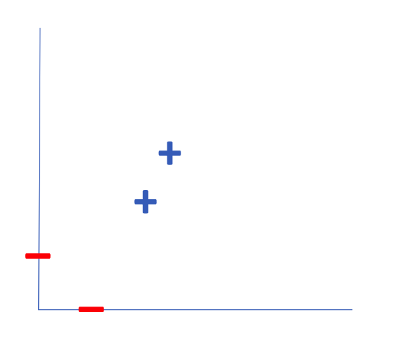
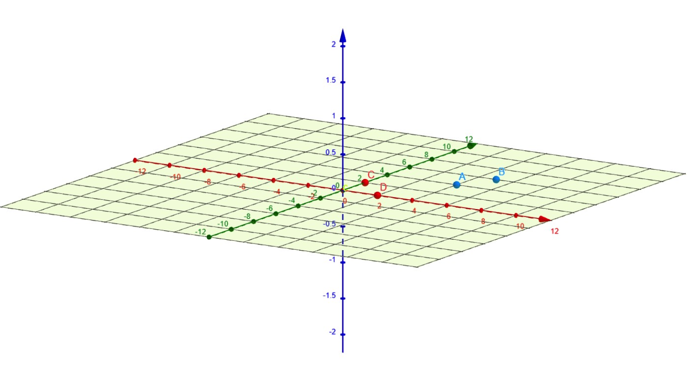
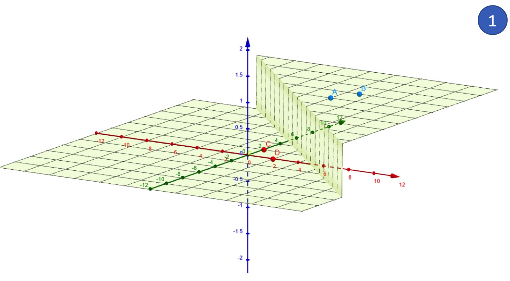
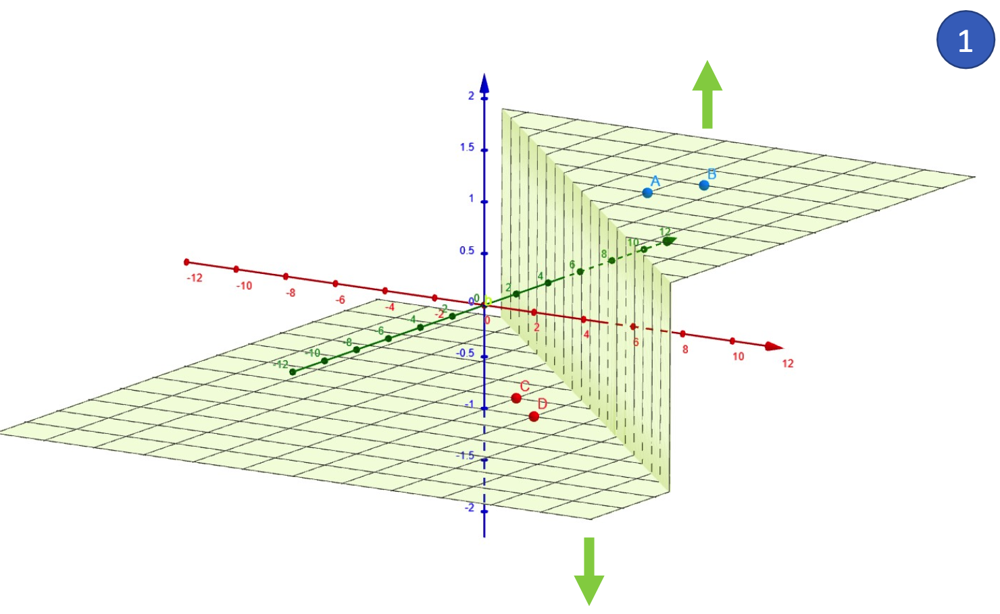
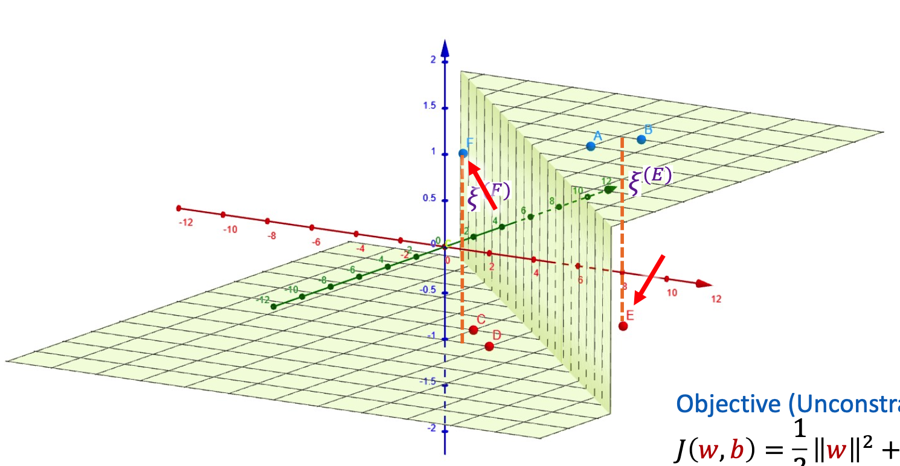

---
{"publish":true,"title":"Support Vector Machines","tags":["machine_learning","CS2109S","supervised_learning","artificial_intelligence"],"PassFrontmatter":true}
---

`# General Idea

SVMs retains three attractive properties:
1. SVMs construct a **maximum margin separator** - a decision boundary with the largest possible distance to example points, helping to generalise well.
2. SVMs create a linear separating hyperplane, allowing data that are not linearly separable in the original input space to be easily separable in the higher dimensional space.
3. SVMs are non-parametric - instead of learning a fixed number of parameters like in logistic regression or neural networks, SVMs define the decision boundary using only a subset of training points (the support vectors). However, it only keeps the examples closes to the separating plane, **generalizing well like parametric models**, and **retaining flexibility like non-parametric models**.

<svg version="1.1" xmlns="http://www.w3.org/2000/svg" viewBox="0 0 812.6993569396003 303.0826721191406" width="812.6993569396003" height="303.0826721191406" class="excalidraw-svg">
  <!-- svg-source:excalidraw -->
  
  <defs>
    <style class="style-fonts">
      @font-face { font-family: Local Font; src: url(data:font/ttf;charset=utf-8;base64,AAEAAAAQAQAABAAAR0RFRlY3ewEAAAIkAAABzkdQT1P4RdpSAAAmBAAATrZHU1VCg3rIxQAAEJAAAAVkT1MvMnMaboAAAAHEAAAAYFNUQVR5l2rlAAABYAAAACpjbWFwSsV9VgAABzQAAARMZ2FzcAAAABAAAAEUAAAACGdseWa7urtYAAB0vAAAZAxoZWFkKkZaGAAAAYwAAAA2aGhlYRIEDa8AAAE8AAAAJGhtdHiR6DlbAAAV9AAABnhsb2Nh5uzOjAAAA/QAAAM+bWF4cAG2AQMAAAEcAAAAIG5hbWWIMMkxAAALgAAABRBwb3N07oznOgAAHGwAAAmXcHJlcGgGjIUAAAEMAAAAB7gB/4WwBI0AAAEAAf//AA8AAQAAAZ4AtAAOAE0ABgABAAAAAAAAAAAAAAAAAAMAAQABAAAD6P78AAAO1P9+/kAOmwABAAAAAAAAAAAAAAAAAAABngABAAEACAABAAAAFAABAAAAHAACd2dodAEBAAAAAgABAAAAAAEHAlgAAAAAAAEAAAABGZru+BWwXw889QADA+gAAAAA3Nvl/gAAAADgOhcq/37+gg6bA/EAAAAGAAIAAAAAAAAABAIxAlgABQAAAooCWAAAAEsCigJYAAABXgAyASIAAAAAAAAAAAAAAAAAAAABAAAAAAAAAAAAAAAAZnJhZwDAAA37AgPo/vwAAAPoAQQAAAABAAAAAAHjAr8AAAAgAAkAAQACARwAAAAqAAAAEgAAAAAAAQABAAAACAACAAIBfQGBAAABgwGJAAUAHAAMAOoA4gDaANIAygCqAHgARgA+ADYALgAmAAIAAQEBAQwAAAABAAQAAQFYAAEABAABAWsAAQAEAAEBVQABAAQAAQFmAAgALgAqACYAIgAeABoAFgASAAEMpgABCxIAAQl9AAEH6AABBlMAAQS+AAEDKQABAZUACAAuACoAJgAiAB4AGgAWABIAAQ0uAAELiQABCeMAAQg9AAEGmAABBPIAAQNMAAEBpgAFABwAGAAUABAADAABB8cAAQY5AAEEqwABAx0AAQGPAAEABAABATEAAQAEAAEBMwABAAQAAQFUAAEABAABATIAAQAEAAEBZwACAB0AAQALAAEADgAfAAEAIQAkAAEAJwAvAAEAMQA3AAEAOQBHAAEATABUAAEAVgBiAAEAZABoAAEAagByAAEAdgCBAAEAgwCHAAEAjACUAAEAlgCZAAEAnACkAAEApgCtAAEArwC7AAEAvQC+AAEAwgDKAAEAzADYAAEA2gDeAAEA4ADyAAEA9AD1AAEA9wEAAAEBAQEMAAIBWwFbAAEBXwFfAAEBfQGBAAMBgwGMAAMAAAAAACMAPQBJAFUAfACIAJQAoACsALgAxADQAQABOgFtAXkBuQHFAdEB+wItAmQClQK1AsEC7QL5AwUDEQMdAykDNQNPA4gDlAOgA6wDxgPnA/MEAAQMBBgEJAQwBDwEUARbBHoElQShBLMEvwTLBNcE8QUQBS8FOwVmBXIFfgWKBcIFzgXaBeYF8gY4BkQGhQaRBuIHDAc1B3YHpQexB+wH+Ag1CEEIigiWCKII9wkKCSoJNglaCWYJcgl+CYoJlgnJCdUJ4QntCgIKIQotCjkKRQpRCnYKkwqfCqsKtwrDCuIK7gsZCyULRgt6C5QL0AvcC+cMLww6DEUMUQxcDGgMdAx/DIsMyQz4DQQNQA1LDVcNlQ3YDeQOKQ5jDm8Otg7BDswO2A7kDu8O+w8fD20PeA/kD/AQFhBDEF8QaxB2EIEQjBCXEKMQtxDCEPARDhEnETMRPxFLEVcRYhF3EbUR2xHnEhoSJhIxEm4SoBKsErcSwhLOEw4TGRNTE14TahOpE+gUJRRFFFAUfRSIFMQUzxUXFSIVLhV5FYwVmBWjFcYV0hXdFegV8xX+Fi8WOhZGFlEWZBaEFpAWnBaoFrQW1hbxFv0XCBcTFx4XPRdIF3MXfheKF8AXzBgOGBkYJBgwGDwYRxhTGLIYzBjYGQwZLBk4GWUZcRl8GbQZwBnlGfEZ/Ro6GoYaqBrjGwYblhyXHXwdrx3RHfweFh5LHnceqR68HuwfKx9HH4cfwh/XIDEgayCAILIgzCD8ITwhWCGYIdMh6SJDIn0ilCLeIxcjdCOHI7Ij6iQEJAQkBCQEJBokOiRgJJAkoCS9JNslFyVSJVsldyWVJbglxyXWJeIl7iX6JgYmIyZAJnsmtibOJuYm7ib3JzEnbCeMJ6wnxSfeJ+4n/igUKCIoOCimKO8pICmCKeAqNCpeKooqlyqrKv0rUyuJK9csGixaLIUssyzCLNYs4yz7LSctOi1NLWEtei2iLbQtyC3rLkUuYC57LpYusC7LLuUvAC8aLz8vVS9jL3Evhi+mL7kvzC/pMBUwOzBIMGwwkDC2MNgw4DDoMPAw+DENMRUxKDEwMTgxQDFIMVAxWDF4MYMxvjIGAAAAAAACAAAAAwAAABQAAwABAAAAFAAEBDgAAABoAEAABQAoAA0ALwA5AH4ArAEHARMBGwEjAScBKwEzATcBPgFIAU0BWwFhAWUBfgHOAhsCNwK8AscC3QMEAwgDDAMSAygehR6eHvMgFCAaIB4gIiAmIDogRCB0IKwhICEiIZMhmSISIhUnE/sC//8AAAANACAAMAA6AKAArgEKARYBHgEmASoBLgE2ATkBQQFKAVABXgFkAWoBzQIYAjcCvALGAtgDAAMGAwoDEgMmHoAenh7yIBMgGCAcICIgJiA5IEQgdCCsISAhIiGQIZYiEiIVJxP7Af//AR8AAADfAAAAAAAAAAAAAAAAAAAAAAAAAAAAAAAAAAAAAAAAAAAAAAAAAAD+b/7e/swAAAAAAAAAAP53/mQAAOG3AADhLAAAAADhF+EN4Rfg4OC34LjgP+A5AAAAAN9X31LaQQYDAAEAAABmAAAAggEKASIB1AHmAfAB+gH8Af4CCAIKAhQCIgIoAj4CRAJGAm4CcAAAAAAAAAJwAnoCggKGAAAAAAKGAAACjgAAAo4CkgAAAAAAAAAAAAAAAAAAAAAChgKMAAAAAAAAAAAAAAEtATQBUgE7AWMBdAFWAVMBQgFDAToBaAEwAT4BLwE8ATEBMgFuAWwBbQE2AVUAAQANAA4AEwAXACAAIQAlACcAMAAxADMAOAA5AD8ASQBLAEwAUABWAFkAYwBkAGkAagBvAUYBPQFHAXIBQQGPAHYAggCDAIgAjACVAJYAmgCcAKUApwCpAK4ArwC1AL8AwQDCAMYAzADPANkA2gDfAOAA5QFEAV0BRQFwAS4BNQFhAWUBYgFmAV4BWAGNAVkBDQFOAXEBWgGXAVwBbwEpASoBkAFzAVcBOAGYASgBDgFPASYBJQEnATcABwACAAUACwAGAAoADAARAB0AGAAaABsALQApACoAKwAUAD0AQwBAAEEARwBCAWoARgBeAFoAXABdAGsASgDLAHwAdwB6AIAAewB/AIEAhgCSAI0AjwCQAKEAngCfAKAAiQCzALkAtgC3AL0AuAFrALwA1ADQANIA0wDhAMAA4wAIAH0AAwB4AAkAfgAPAIQAEgCHABAAhQAVAIoAFgCLAB4AkwAcAJEAHwCUABkAjgAiAJcAJACZACMAmAAmAJsALgCjAC8ApAAsAJ0AKACiADIAqAA0AKoANgCsADUAqwA3AK0AOgCwADwAsgA7ALEAPgC0AEUAuwBEALoASAC+AE0AwwBPAMUATgDEAFEAxwBTAMkAUgDIAFcAzQBgANYAWwDRAGIA2ABfANUAYQDXAGYA3ABsAOIAbQBwAOYAcgDoAHEA5wAEAHkAVADKAFgAzgGUAY4BlQGZAZYBkQF/AYABgwGHAYgBhQF+AX0BhgGBAYQAaADeAGUA2wBnAN0AbgDkAUwBTQFIAUoBSwFJAXsBdQF3AXkBfAF2AXgBegAAABsBSgADAAEECQAAAKgDHgADAAEECQABAB4DAAADAAEECQACAA4C8gADAAEECQADADQCvgADAAEECQAEAB4DAAADAAEECQAFADoChAADAAEECQAGAB4CZgADAAEECQAIABACVgADAAEECQAJACQCMgADAAEECQALAC4CBAADAAEECQAMACYB3gADAAEECQANASIAvAADAAEECQAOADYAhgADAAEECQAQAAwAegADAAEECQARABAAagADAAEECQAZAAwAegADAAEECQEAAAgAYgADAAEECQEBAAwAVgADAAEECQECAAgATgADAAEECQEDABQAOgADAAEECQEEAAoAMAADAAEECQEFAA4C8gADAAEECQEGAAwAJAADAAEECQEHABAAagADAAEECQEIAAgAHAADAAEECQEJABIACgADAAEECQEKAAoAAABCAGwAYQBjAGsARQB4AHQAcgBhAEIAbwBsAGQAQgBvAGwAZABNAGUAZABpAHUAbQBMAGkAZwBoAHQARQB4AHQAcgBhAEwAaQBnAGgAdABUAGgAaQBuAFcAZQBpAGcAaAB0AHMAcwAwADEAUwBlAG0AaQBCAG8AbABkAE8AdQB0AGYAaQB0AGgAdAB0AHAAcwA6AC8ALwBzAGMAcgBpAHAAdABzAC4AcwBpAGwALgBvAHIAZwAvAE8ARgBMAFQAaABpAHMAIABGAG8AbgB0ACAAUwBvAGYAdAB3AGEAcgBlACAAaQBzACAAbABpAGMAZQBuAHMAZQBkACAAdQBuAGQAZQByACAAdABoAGUAIABTAEkATAAgAE8AcABlAG4AIABGAG8AbgB0ACAATABpAGMAZQBuAHMAZQAsACAAVgBlAHIAcwBpAG8AbgAgADEALgAxAC4AIABUAGgAaQBzACAAbABpAGMAZQBuAHMAZQAgAGkAcwAgAGEAdgBhAGkAbABhAGIAbABlACAAdwBpAHQAaAAgAGEAIABGAEEAUQAgAGEAdAA6ACAAaAB0AHQAcABzADoALwAvAHMAYwByAGkAcAB0AHMALgBzAGkAbAAuAG8AcgBnAC8ATwBGAEwAdwB3AHcALgByAGYAdQBlAG4AegBhAGwAaQBkAGEALgBjAG8AbQB3AHcAdwAuAGYAcgBhAGcAdAB5AHAAZQBmAG8AdQBuAGQAcgB5AC4AeAB5AHoAUgBvAGQAcgBpAGcAbwAgAEYAdQBlAG4AegBhAGwAaQBkAGEAZgByAGEAZwBUAFkAUABFAE8AdQB0AGYAaQB0AC0AUwBlAG0AaQBCAG8AbABkAFYAZQByAHMAaQBvAG4AIAAxAC4AMQAwADAAOwBnAGYAdABvAG8AbABzAFsAMAAuADkALgAyADcAXQAxAC4AMQAwADAAOwBmAHIAYQBnADsATwB1AHQAZgBpAHQALQBTAGUAbQBpAEIAbwBsAGQAUgBlAGcAdQBsAGEAcgBPAHUAdABmAGkAdAAgAFMAZQBtAGkAQgBvAGwAZABDAG8AcAB5AHIAaQBnAGgAdAAgADIAMAAyADEAIABUAGgAZQAgAE8AdQB0AGYAaQB0ACAAUAByAG8AagBlAGMAdAAgAEEAdQB0AGgAbwByAHMAIAAoAGgAdAB0AHAAcwA6AC8ALwBnAGkAdABoAHUAYgAuAGMAbwBtAC8ATwB1AHQAZgBpAHQAaQBvAC8ATwB1AHQAZgBpAHQALQBGAG8AbgB0AHMAKQABAAAACgBcAQYAAkRGTFQAMGxhdG4ADgAEAAAAAP//AAwAAAACAAMABAAFAAYABwAJAAoACwAMAAgABAAAAAD//wAMAAAAAQADAAQABQAGAAcACQAKAAsADAAIAA1hYWx0AKJjY21wAJpjY21wAJBkbGlnAIpmcmFjAIRsaWdhAH5vcmRuAHhwbnVtAHJydnJuAGxzYWx0AGZzczAxAFxzdXBzAFZ0bnVtAFAAAAABAAwAAAABAAcABgABABAAAAEAAAAAAQAPAAAAAQARAAAAAQALAAAAAQAJAAAAAQAOAAAAAQAIAAAAAQANAAAAAwACAAYABgAAAAIAAgAGAAAAAgAAAAEAEgOeA2QC2gLEAsQCqAKCAnQCOAHwAc4BtgGoAUYAvgBEAEQAJgABAAAAAQAIAAIADAADAZsBnAGdAAEAAwAWAWEBYwABAAAAAQAIAAIAOgAaAOkA6gDrAOwA7QDuAO8A8ADxAPIA8wD0APUA9gD3APgA+QD6APsA/AD9AP4A/wEAARkBYAABABoAgQCMAI0AjgCPAJAAkQCSAJMAlACWAKcAqACuAK8AsACxALIAswC0AL4AzADNAM4BEAFWAAQACAABAAgAAQB2AAMAVAAWAAwAAQAEAQwAAgDMAAMAKgAWAAgBBgAGAM8AzACVAJwAzAEIAAkAzwDMAJUAnADMAMwAjADCAQcACQDPAMwAlQCcAMwAzACMAIgABAAcABYAEAAKAQUAAgCpAQIAAgClAQQAAgCcAQEAAgCVAAEAAwCVALUAzAAEAAgAAQAIAAEATgAEADQAKgAYAA4AAQAEAQsAAgCVAAIADAAGAQoAAgDMAQkAAgCVAAEABAEDAAIAzAADABQADgAIAHUAAgCpAHQAAgCaAHMAAgBWAAEABABWAJUAwgDMAAEAAAABAAgAAQB+AAsAAQAAAAEACAABAAb/9QACAAEBGgEjAAAAAQAAAAEACAACAA4ABAENAQ4BDQEOAAEABAABAD8AdgC1AAYAAAACACQACgADAAEANAABABIAAAABAAAACgABAAIAPwC1AAMAAQAaAAEAEgAAAAEAAAAKAAEAAgABAHYAAgABAQ8BGAAAAAQAAAABAAgAAQAsAAIAFgAKAAEABAEnAAMBPAETAAIADgAGASUAAwE8AREBJgADATwBEwABAAIBEAESAAEAAAABAAgAAQD+ABgAAgAAAAEACAABAAoAAgAYABIAAQACAQQBBQACAJUAqQACAJUAnAACAAAAAQAIAAEACAABAA4AAQABAKQAAgCdAYwAAQAAAAEACAABAAYAAQABAAIAnAClAAYAAAABAAgAAgB4AHQAXgBIAAMAAAAkABIAAQAEAAAAAQABAAEAAQAAAAUAAgAWAAYAAAABAAIAAgABAAEAAAAEAAAAAQABAAEAAQAAAAMAAgADAX0BgQABAYMBiQABAYsBjAACAAIAAwCcAJwAAQCkAKQAAgClAKUAAQACAAAAAQADAJwApAClAAMAAAABAAgAAQAOAAQAKgAkAB4AGAACAAEBEAETAAAAAgEeASsAAgEdASoAAgEcASkAAwEZARsBKAABAAAAAQAIAAIAYAAtAQ0BDgENAOkA6gDrAOwA7QDuAO8A8ADxAPIA8wD0APUA9gD3APgA+QD6APsA/AEOAP0A/gD/AQABGgEfASABIQEiASMBDwEQAREBEgETARQBFQEWARcBGAFgAAIADgABAAEAAAA/AD8AAQB2AHYAAgCBAIEAAwCMAJQABACWAJYADQCnAKgADgCuALUAEAC+AL4AGADMAM4AGQEPAQ8AHAEUARgAHQEaASMAIgFWAVYALAKrAEcCywAUAssAFALLABQCywAUAssAFALLABQCywAUAssAFALLABQCywAUAssAFAPcABQCdwBIAq4AJQKuACUCrgAlAq4AJQKuACUC6wBIAv8AFwLrAEgDAgAAAloASAJaAEgCWgBIAloASAJaAEgCWgBIAloASAJaAEgCWgBIAkIASAMKACUDCgAlAwoAJQMKACUC0QBIAtEAAAEYAEgCiQBIARgAGgEY/9QBGP/XARgAQwEYAAkBGP/cARgADwIBABMCsABIArAASAIsAEgCLABIAiwASAIsAEgCZgA6A1IASALXAEgC1wBIAtcASALXAEgC1wBIAtcASAMgACQDIAAkAyAAJAMgACQDIAAkAyAAJAMgACQDIAAiAyAAJASDACQCaABIAmgASAM0ACUCgABIAoAASAKAAEgCgABIAjkAFQI5ABUCOQAVAjkAFQI5ABUC2QBIAnUAFgJ1ABYCdQAWArgAPwK4AD8CuAA/ArgAPwK4AD8CuAA/ArgAPwK4AD8CuAA/ArgAPwLBABQD4AAWA+AAFgPgABYD4AAWA+AAFgLDABQCpwASAqcAEgKnABICpwASAqcAEgJWACACVgAgAlYAIAJWACAEXwAWBFQAFgMZABYCTAAcAkwAHAJMABwCTAAcAkwAHAJMABwCTAAcAkwAHAJMABwCTAAcAkwAHAOfABwCTAA6AewAGgHsABoB7AAaAewAGgHsABoCTAAcAjgAHgMZABwCWAAcAh0AGgIdABoCHQAaAh0AGgIdABoCHQAaAh0AGgIdABoCHQAaAaMACgJDABoCQwAaAkMAGgJDABoCMgA6AjIAAAD4ADIA9wA6APcACQD3/8MA9//GAPf/+AH5ADIA9//LAPj//AEB/34BAf9+AhAAOgIQADoA9wA6APcAIgHEADoA9wAaAYkAOgNjADoCMgA6AjIAOgIyADoCMgA6AjIAOgIyADoCOQAaAjkAGgI5ABoCOQAaAjkAGgI5ABoCOQAaAjkADwI5ABoDpAAaAkwAOgJMADoCTAAcAbIAOgGyADoBsgAmAbIAGgG8AA4BvAAOAbwADgG8AA4BvAAOAkkAOgGFABAB/QAQAYUAEAIQAC0CEAAtAhAALQIQAC0CEAAtAhAALQIQAC0CEAAtAhAALQIQAC0CCwACAwEABgMBAAYDAQAGAwEABgMBAAYCCwAIAg4ACAIOAAgCDgAIAg4ACAIOAAgB0gAYAdIAGAHSABgB0gAYA4oAHAIHABoCBwAaAgcAGgIHABoCBwAaAgcAGgIHABoCBwAaAgcAGgIFAA4CBgA6AgYAOgNNAC4CGQAtAhkALQIZAC0CGQAtAhkALQIZAC0DjgAaAdYAEQHjABEB1gARAs4ACgJkAAoCqQAKAmcACgJiAAoJVgAaDtQAGg47ABoCzAA6AqkAOgLVABACsAAQAWYADgFaAA0ClAAkAW8AFwIpABoCJgAUAlwAGQIpABECOAAeAg0AFwIrACECOAAdAYQAEAJOAAwCTgBMAk4AJwJOACICTgAUAk4AHgJOACYCTgApAk4ALQJOACUCrwAXAq8AFwK0ABcCrwAYAQsAFwFUABgBUAAUAVwAGQJYAAAAwwAAAMMAAAEnAEIBGAA5ARkAOgETADUDJQBCARIANAEWADkB9wAcAeYAJwCkAAABWgA7AeoAJQKMACcBiQAGAYkABgHOADoCMQA6A2AAOgHtAAABMAAkATAAFAFOABYBTgAdAVkARQFZACABGAA5Ae4AOQHXACYB1wAuAQAAJgEBAC4B7QAcAe0AGwEcABwBHAAbAbkAOQD2ADgDMgATAusAKAKoAC0CzwAsAg8AMAMxADMCKAA4As0AGAGKACEBIwBWASMAVgK2ABgCjQAxAgoAKAJYADoCUgAqAs0ACgJxADsCkQAuAYkABgIrADMCKwAzAisANAIrADMCKwAzAisAMwIrADMCKwAzAisAKAIrADMBywAnAkkAVgKfACUCkgBIApIASAKSABYCkgBIApIASAKSAEgCkgAWApIASAAAADoAAABaAAAAKAAAACgAAAAoAAAATwAAACgAAAAoAAAAKAAAACgAAAAoAAAAKAAAACEAAAAhAAAADgAAACgB3gA6AUgAWgE0ACgBNAAoAdkAKAHAACgBwAAoAcAAKAFRACgB6AAoAcwAKAEhAA4BLwAoAQkAIwMCAAACCgAoAlIAKgACAAAAAAAA/5wAMgAAAAAAAAAAAAAAAAAAAAAAAAAAAZ4AAAAkAMkBAgEDAMcAYgCtAQQBBQBjAK4AkAAlACYA/QD/AGQBBgAnAOkBBwEIACgAZQEJAMgAygEKAMsBCwEMACkAKgD4AQ0BDgArAQ8ALAEQAMwAzQDOAPoAzwERARIALQAuARMALwEUARUBFgDiADAAMQEXARgBGQBmARoAMgDQANEAZwDTARsBHACRAK8AsAAzAO0ANAA1AR0BHgEfADYBIADkAPsBIQEiADcBIwEkADgA1AElANUAaADWASYBJwEoASkAOQA6ASoBKwEsAS0AOwA8AOsBLgC7AS8APQEwAOYBMQEyATMBNABEAGkBNQE2AGsAbABqATcBOABuAG0AoABFAEYA/gEAAG8BOQBHAOoBOgEBAEgAcAE7AHIAcwE8AHEBPQE+AEkASgD5AT8BQABLAUEATADXAHQAdgB3AHUBQgFDAUQATQFFAE4BRgBPAUcBSAFJAOMAUABRAUoBSwFMAHgBTQBSAHkAewB8AHoBTgFPAKEAfQCxAFMA7gBUAFUBUAFRAVIAVgFTAOUA/AFUAIkAVwFVAVYAWAB+AVcAgACBAH8BWAFZAVoBWwBZAFoBXAFdAV4BXwBbAFwA7AFgALoBYQBdAWIA5wFjAWQBZQFmAWcBaAFpAWoBawFsAW0BbgFvAXABcQFyAXMBdAF1AXYBdwF4AXkBegF7AXwBfQF+AMAAwQF/AYABgQGCAYMBhAGFAJ0AngATABQAFQAWABcAGAAZABoAGwAcAYYBhwGIAYkBigGLAYwBjQGOAY8BkAC8APQA9QD2AZEBkgGTAZQBlQADAZYAEQAPAB0AHgCrAAQAowAiAKIAwwCHAA0ABgASAD8AEACyALMAQgALAAwAXgBgAD4AQADEAMUAtAC1ALYAtwCpAKoAvgC/AAUACgGXACMACQCIAIYAiwCKAIwAgwBfAOgBmAGZAIQAvQAHAZoAhQCWAZsADgDvAPAAuAAgACEAHwCTAGEApABBAZwACAGdAZ4BnwGgAaEBogGjAaQBpQGmAacBqAGpAaoBqwGsAa0BrgGvAbABsQGyAbMBtACOANwAQwCNAN8A2ADhANsA3QDZANoA3gDgAbUBtgG3AbgGQWJyZXZlB3VuaTAxQ0QHQW1hY3JvbgdBb2dvbmVrCkNkb3RhY2NlbnQGRGNhcm9uBkRjcm9hdAZFY2Fyb24KRWRvdGFjY2VudAdFbWFjcm9uB0VvZ29uZWsHdW5pMDEyMgpHZG90YWNjZW50BEhiYXICSUoHSW1hY3JvbgdJb2dvbmVrB3VuaTAxMzYGTGFjdXRlBkxjYXJvbgd1bmkwMTNCBk5hY3V0ZQZOY2Fyb24HdW5pMDE0NQNFbmcNT2h1bmdhcnVtbGF1dAdPbWFjcm9uBlJhY3V0ZQZSY2Fyb24HdW5pMDE1NgZTYWN1dGUHdW5pMDIxOAd1bmkxRTlFBlRjYXJvbgd1bmkwMjFBBlVicmV2ZQ1VaHVuZ2FydW1sYXV0B1VtYWNyb24HVW9nb25lawVVcmluZwZXYWN1dGULV2NpcmN1bWZsZXgJV2RpZXJlc2lzBldncmF2ZQtZY2lyY3VtZmxleAZZZ3JhdmUGWmFjdXRlClpkb3RhY2NlbnQDVF9UA1RfaANUX2wGYWJyZXZlB3VuaTAxQ0UHYW1hY3Jvbgdhb2dvbmVrCmNkb3RhY2NlbnQGZGNhcm9uBmVjYXJvbgplZG90YWNjZW50B2VtYWNyb24HZW9nb25lawd1bmkwMTIzCmdkb3RhY2NlbnQEaGJhcgJpagdpbWFjcm9uB2lvZ29uZWsHdW5pMDIzNwd1bmkwMTM3BmxhY3V0ZQZsY2Fyb24HdW5pMDEzQwZuYWN1dGUGbmNhcm9uB3VuaTAxNDYDZW5nDW9odW5nYXJ1bWxhdXQHb21hY3JvbgZyYWN1dGUGcmNhcm9uB3VuaTAxNTcGc2FjdXRlB3VuaTAyMTkGdGNhcm9uB3VuaTAyMUIGdWJyZXZlDXVodW5nYXJ1bWxhdXQHdW1hY3Jvbgd1b2dvbmVrBXVyaW5nBndhY3V0ZQt3Y2lyY3VtZmxleAl3ZGllcmVzaXMGd2dyYXZlC3ljaXJjdW1mbGV4BnlncmF2ZQZ6YWN1dGUKemRvdGFjY2VudAdhZS5zczAxBmUuc3MwMQtlYWN1dGUuc3MwMQtlY2Fyb24uc3MwMRBlY2lyY3VtZmxleC5zczAxDmVkaWVyZXNpcy5zczAxD2Vkb3RhY2NlbnQuc3MwMQtlZ3JhdmUuc3MwMQxlbWFjcm9uLnNzMDEMZW9nb25lay5zczAxBmcuc3MwMQZrLnNzMDEMdW5pMDEzNy5zczAxBm0uc3MwMQZuLnNzMDELbmFjdXRlLnNzMDELbmNhcm9uLnNzMDEMdW5pMDE0Ni5zczAxC250aWxkZS5zczAxCGVuZy5zczAxB29lLnNzMDEGdC5zczAxC3RjYXJvbi5zczAxDHVuaTAyMUIuc3MwMQNmX2YDZl9qA2ZfdAtvX3VfdF9mX2lfdBFvX3VfdF9mX2lfdF90X2VfZBFvX3VfdF9mX2lfdF90X2VfcgNyX2YDcl90A3RfZgN0X3QIb25lLnNzMDEHemVyby50ZgZvbmUudGYGdHdvLnRmCHRocmVlLnRmB2ZvdXIudGYHZml2ZS50ZgZzaXgudGYIc2V2ZW4udGYIZWlnaHQudGYHbmluZS50Zgd1bmkwMEI5B3VuaTAwQjIHdW5pMDBCMwd1bmkyMDc0AkNSB3VuaTAwQTAHdW5pMjcxMwd1bmkyMTIwDmFtcGVyc2FuZC5zczAxBEV1cm8HdW5pMjIxNQd1bmkwMEI1B2Fycm93dXAHdW5pMjE5NwphcnJvd3JpZ2h0B3VuaTIxOTgJYXJyb3dkb3duB3VuaTIxOTkJYXJyb3dsZWZ0B3VuaTIxOTYHdW5pMDMwOAd1bmkwMzA3CWdyYXZlY29tYglhY3V0ZWNvbWIHdW5pMDMwQgt1bmkwMzBDLmFsdAd1bmkwMzAyB3VuaTAzMEMHdW5pMDMwNgd1bmkwMzBBCXRpbGRlY29tYgd1bmkwMzA0B3VuaTAzMTIHdW5pMDMyNgd1bmkwMzI3B3VuaTAzMjgKYXBvc3Ryb3BoZRdEY3JvYXQuQlJBQ0tFVC52YXJBbHQwMRVjZW50LkJSQUNLRVQudmFyQWx0MDEXZG9sbGFyLkJSQUNLRVQudmFyQWx0MDEAAAEAAAAKACgAUAACREZMVAAObGF0bgAOAAQAAAAA//8AAwAAAAEAAgADa2VybgAibWFyawAabWttawAUAAAAAQADAAAAAgABAAIAAAABAAAABA7AA3IAvgAKAAYAEAABAAoAAAABAJoAmgABAGgADAAMAFYAUABKAEQAPgA4ADgAMgAsACYAIAAaAAEAfwMQAAEA5gKpAAEA9AK5AAEAqQMOAAEA4ALYAAEA4AL/AAEA5gKYAAEAmwLrAAEArAL7AAEApAK9AAEA7wK+AAwAAA4uAAAOKAAADiIAAA4cAAAOFgAADhAAAA4QAAAOEAAADgoAAA4EAAAN/gAADfgAAgACAX0BgQAAAYMBiQAFAAUAAAABAAgAAQ3qApwAAw1eAAwACQJqAkQBxAEyAKAAegBaADQAFAACDbgAGgAAABQADgAAAAECBAAAAAECBAHjAAEArAAAAAIAIAAaAAAAFAAOAAAAAQIgAAAAAQIgAeMAAQC1AAAAAQC1AeMAAgAaABQAAAAOAfgAAAABAf8B4wABAKsAAAABAKsB4wACACAAGgAAABQADgAAAAECGQAAAAECGQHjAAEAswAAAAEAswHjAAkAjACGAIAAegB0AG4AaABiAFwAVgBQAEoARAA+ADgARAA+ADgARAA+ADgARAA+ADgARAA+ADgAAQzPAAoAAQceAAAAAQceAeMAAQWJAAoAAQWJAAAAAQWJAeMAAQP0AAoAAQP0AAAAAQP0AeMAAQJgAAoAAQJgAAAAAQJgAeMAAQDLAAoAAQDLAAAAAQDLAeMACQCMAIYAgAB6AHQAbgBoAGIAXABWAFAASgBEAD4AOABEAD4AOABEAD4AOABEAD4AOABEAD4AOAABDVgACgABB2oAAAABB2oB4wABBcQACgABBcQAAAABBcQB4wABBB4ACgABBB4AAAABBB4B4wABAnkACgABAnkAAAABAnkB4wABANMACgABANMAAAABANMB4wAGAHoAdABuAGgAYgBcAFYAUABKAEQAPgA4ADIALAAmADIALAAmAAEIZwAKAAEEqwAAAAEEqwHjAAEFcgAKAAEFcgAAAAEFcgHjAAED5AAKAAED5AAAAAED5AHjAAECVgAKAAECVgAAAAECVgHjAAEAxwAKAAEAxwAAAAEAxwHjAAIAIAAaAAAAFAAOAAAAAQH/AAAAAQH/AtMAAQCqAAAAAQCqAtMAAgAgABoAAAAUAA4AAAABAcwAAAABAcwC0wABAJoAAAABAJoC0wACAAIBAgEDAAABBgEMAAIABAAAAAEACAABCzYJ/gADCqoADADaCewJ5gngCdoJ5gngCdQJ5gngCc4J5gngCc4J5gngCcgJ5gngCcIJ5gngCbwJ5gngCewJ5gngCbYJ5gngCbAJ5gngCaoJpAAACZ4JpAAACZgJpAAACaoJpAAACZIJpAAACYwAAAAACYYAAAAACYAAAAAACXoAAAAACXQJbgloCWIJbgloCVwJbgloCVwJbgloCVYJbgloCVAJbgloCUoJbgloCUQJbgloCXQJbgloCT4JOAAACTIJOAAACT4JOAAACSwJOAAACSYJIAkaCRQJDgkICQIJIAkaCPwJIAkaCPYJIAkaCPAJIAkaCOoJIAkaCOQJIAkaCSYJIAkaAAAI3gAAAAAI3gAACNgJbgAACNIJbgAACNgJbgAACNgJbgAACMwIxgAACMAIugAACLQIugAACK4IugAACMAIugAACKgIugAAAAAAAAiiCT4JOAicCJYJOAicCJAJOAicCIoJOAicCIQJOAicCH4JOAicCHgJOAicCT4JOAicCHIJOAicCGwIZgAACGAIZgAACFoIZgAACGwIZgAACFQITgAACEgITgAACEIITgAACFQITgAACFQITgAACDwINgAACDAINgAACDwINgAACCoIJAgeCBgIJAgeCBIIJAgeCAwIJAgeCAYIJAgeCAAIJAgeB/oIJAgeB/QIJAgeCCoIJAgeB+4IJAgeB+gH4gAAB9wH4gAAB9YH4gAAB9AH4gAAB8oH4gAAB8QHvgAAB7gHvgAAB7IHvgAAB6wHvgAAB6YHvgAAB6AAAAAAB5oAAAAAB5QAAAAAB44AAAAAB4gHggd8B3YHggd8B3AHggd8B2oHggd8B2oHggd8B2QHggd8B14Hggd8B1gHggd8B4gHggd8B1IHggd8B0wHggd8B0YHQAAABzoHQAAABzQHQAAAB0YHQAAABy4HQAAABygITgciBxwITgciBxYITgciBxYITgciBxAITgciBwoITgciBwQITgciBv4ITgciBygITgciB4gG+AAAB3AG+AAABvIG+AAABuwG+AAAAAAG5gbgBtoG5gbgBtQG5gbgBs4G5gbgBsgG5gbgBsIG5gbgAAAG5gbgBrwG5gbgAAAG5gbgBrYGsAaqAAAGpAAAAAAGpAAABp4G5gAABpgG5gAABp4G5gAABp4G5gAABpIGjAAABoYGgAAABnoGgAAABnQGgAAABoYGgAAABm4GgAAABoYGgAAABmgGYgZcBlYGYgZcBlAGYgZcBkoGYgZcBkQGYgZcBj4GYgZcBjgGYgZcBjIGYgZcBiwG5gAABiYG5gAABiAG5gAABiwG5gAABhoGFAAABg4GFAAABggGFAAABhoGFAAABhoGFAAABgIF/AAABgIF/AAABgIF/AAABfYF8AXqBeQF8AXqBd4F8AXqBdgF8AXqBdIF8AXqBcwF8AXqBcYF8AXqBcAF8AXqBfYF8AXqBfYF8AXqBboFtAAABa4FtAAABagFtAAABaIFtAAABZwFtAAABZYFkAAABYoFkAAABYQFkAAABX4FkAAABXgFkAAABXIFbAAABWYFbAAABWAFbAAABVoFbAAABygITgVUBxwITgVUBxYITgVUBxYITgVUBxAITgVUBwoITgVUBwQITgVUBv4ITgVUBygITgVUAAAGpAAAAAAGpAAABU4FSAAABUIFSAAABTwFSAAABU4FSAAABTYFSAAABU4FSAAAAAAgygAAAAAgygAAAAAgygAABTAFKgAABSQFHgAAAAEAmgE/AAEApwKfAAEAqwE/AAEAqwKfAAEBDgK5AAEBDgL/AAEBDgLrAAEBDgAAAAEBDgHjAAEBlAAKAAEA9wK9AAEA9wL/AAEA9wLrAAEA9wAAAAEA9wHjAAEBBwL7AAEBBwK+AAEBBwL/AAEBBwLrAAEBBwAAAAEBBwHjAAEBgQL7AAEBgQK+AAEBgQL/AAEBgQLrAAEBgQAAAAEBgQHjAAEBCQKpAAEBCQKvAAEBCQL7AAEBCQK+AAEBCQL/AAEBCQLYAAEBCQLrAAEBawAKAAEBCQAAAAEBCQHjAAEAwgAAAAEAwgK/AAEA5wL/AAEA5wLrAAEA5AAAAAEA5wHjAAEA3gL/AAEA3gLrAAEA3gHjAAEBHQK5AAEBHQKpAAEBHQKvAAEBHQL7AAEBHQK+AAEBHQL/AAEBHQLrAAECAQAKAAEBHQAAAAEBHQHjAAEBGQK5AAEBGQL/AAEBGQLrAAEBGQAAAAEBGQHjAAEAxAAAAAEAqgGYAAEAlAPHAAEAlAK/AAEBFAAAAAEA3wAKAAEAfAAAAAEAfAHjAAEAewKpAAEAewL7AAEAewK+AAEAewL/AAEAewLrAAEAewHjAAEAvQAAAAEAewAAAAEBKAK9AAEBKAMQAAEBHP82AAEBGAKpAAEBGAL7AAEBGAK9AAEBGAK+AAEBGAL/AAEBGALrAAEBiwAKAAEBGAHjAAEBGgK9AAEBGgL/AAEBGgLrAAEBEAAAAAEBGgHjAAEBKAK5AAEBKAMOAAEBKAKpAAEBKAL7AAEBKAK+AAEBKAL/AAEBKALYAAEBKALrAAECEgAAAAEBHAAAAAEBKAHjAAEBKwOZAAEBKwPbAAEBKwPHAAEBKwK/AAEBVAPXAAEBVAOaAAEBVAPbAAEBVAPHAAEBVAAAAAEBVAK/AAEB8APXAAEB8AOaAAEB8APbAAEB8APHAAEB8AAAAAEB8AK/AAEBXAPqAAEBXAOFAAEBXAOLAAEBXAPXAAEBXAOaAAEBXAPbAAEBXAO0AAEBXAPHAAEBzQAKAAEBXAAAAAEBXAK/AAEBOwPbAAEBOwAAAAEBOwK/AAEBMQPbAAEBMQPHAAEBGAAAAAEBMQK/AAEBKgPbAAEBKgPHAAEBNQAAAAEBKgK/AAEBkAOVAAEBkAOFAAEBkAOLAAEBkAPXAAEBkAOaAAEBkAPbAAEBkAPHAAEC0AAKAAECpgAKAAEBbAOVAAEBbAPbAAEBbAPHAAEBbAAAAAEBbAK/AAEBaAAAAAEBaAK/AAEBLQPHAAEBLQK/AAEBQwAAAAEAjAOFAAEAjAPXAAEAjAOZAAEAjAOaAAEAjAPbAAEAjAPHAAEAywDcAAEAigDcAAEAigK/AAEA0AAAAAEAjAAAAAEAjAK/AAEBkAOZAAEBkAO0AAEBkAAAAAEBkAK/AAEBQQOFAAEBQQPXAAEBQQOZAAEBQQOaAAEBQQPbAAEBQQPHAAECMQAAAAEBLQAAAAEBQQK/AAEBcQK/AAEBWgPbAAEBbgK/AAEBWgK/AAEBfQOZAAEBfQPbAAEBfQPHAAEBeAAAAAEBfQK/AAEBZgOVAAEBZgOIAAEBZgOFAAEBZgPXAAEBZgOaAAEBZgPbAAEBZgO0AAEBZgPHAAECuAAAAAEBZgAAAAEBZgK/AAIAHAABAAsAAAAOAB8ACwAhACQAHQAnAC8AIQAxADcAKgA5AEcAMQBMAFQAQABWAGIASQBkAGgAVgBqAHIAWwB2AIAAZACDAIcAbwCMAJQAdACWAJkAfQCcAKQAgQCmAK0AigCvALsAkgC9AL0AnwDCAMoAoADMANgAqQDaAN4AtgDgAOgAuwDqAPIAxAD0APUAzQD3APwAzwD+AQAA1QFbAVsA2AFfAV8A2QAPAAAAhgAAAIAAAAB6AAAAdAAAAG4AAABoAAAAaAAAAGgAAABiAAAAXAAAAFYAAABQAAEASgABAEQAAgA+AAEA6QAAAAEAnQAAAAEAgwAAAAEAfwHjAAEA5gHjAAEA9AHjAAEAqQHjAAEA4AHjAAEA5gHMAAEAmwHjAAEArAHjAAEApAHjAAEA7wHjAAIAAgF9AYEAAAGDAYwABQACAAgAAgXAAAoAAgLgAAQAAATCA4YAFAASAAAAAAAAAAAAAAAAAAAAAAAA//UAAP/4AAAAAP/kAAAAAAAAAAAAAAAAAAAAAAAAAAAAAAAA//oAAAAAAAAAAP/zAAAAAP/iAAAAAAAAAAAAAAAAAAAAAAAA//QAAP/yAAAAAP/PAAD/8v/FAAD/5v/4AAD/0P/u/9oAAP/w/9r/pf+9/6//nf+Z//IAAP+LAAD/+gAAAAD/8wAAAAAAAAAAAAD/6gAAAAAAAAAAAAAAAAAAAAAAAAAAAAAAAAAA/+cAAAAAAAD/+QAAAAD/9AAAAAAAAAAAAAAAAAAAAAAAAAAAAAAAAAAAAAAAAAAAAAAAAAAAAAAAAP/3AAAAAAAAAAAACQAA/9AAAAAAAAD/1wAAAAD/yf/6AAD/3//hAAD/9AAAAAAAAAAAAAAAAAAA//IAAAAAAAAAAAAWAAD/3gAAAAD/9AAAAAD/5AAA/+4AAAAA/+r/9P/eAAAAAAAFAAAAAAAAAAAAAAAAAAAAAAAA/68AAAAAAAAAAAAAAAAAAAAAAAAAAAAAAAD/cP/o/6L/yf+i/53/7QAA/8f/2f+hAAAAAP/w/6r/lgAAAAD/9QAAAAAAAAAAAAAAAAAA//gAAAAAAAAAAP/0AAAAAAAAAAD/iAAA/53/1/+e/6UAAP/5/9D/4P+TAAD/2QAd/63/wwAeAAD/6gAA/+4AAAAAAAAAGAAA/+QAAP/1AAAAAAA7AAD/0ABHAAD/sQAA/93/4v/W/3kAAAAA//oAGP/oAAAAAAAAAAAAAAAAAAD/8gAAAAD/3wAAAAAAAAAA/+H/w//RAAD/lv+tAAAAAAAAAAD/xQAA//H/4f/3/4sAAAAAAAwAHgAAAAAAAAAAAAAAAAAAAAD/zwAAAAAAAAAA/50AAAAAABYAHQAAAAAAAAAAAAAAAAAAAAD/8gAAAAAAAAAAAAAAAAAAAAAAAP/uAAAAAAAAAAD/0QAAAAIAGwABAAwAAAAOABIADAAXAB8AEQAwADAAGgA/AEgAGwBWAGIAJQBkAGgAMgBqAG4ANwBzAHQAPACBAIcAPgCMAJUARQCaAJsATwCuAMAAUQDMAMwAZADOANkAZQDpAOkAcQDrAPIAcgD2AP0AegEBAQEAggEDAQMAgwEGAQYAhAEJAQwAhQEvATAAiQFKAU0AiwFSAVMAjwFVAVUAkQGaAZoAkgACADQAAQAMAAYADQANAAIADgASAAQAEwAgAAIAIQAkAAQAJQAlAAIAJwAnAAIAKQAvAAIAMQA+AAIAPwBIAAQASQBKAAIASwBLAAQATABPAAIAVgBYAAoAWQBiAAgAZABoAAwAagBuAA0AcwB1AAoAdgCBAAEAggCCAAcAgwCIAAEAigCUAAEAlQCVAAkAlgCZAAEAmgCaAAcApwCtAAcArgC0AAMAtQC+AAEAvwDAAAMAwQDBAAEAwgDFAAMAzADOAAkAzwDYAAUA2QDZAAsA4ADkAAsA6QDyAAEA9AD1AAcA9gD8AAMA/QD9AAEA/gD+AAkBAQEFAAkBBgEIAAUBCQEKAAMBLwEwABABMQEyAA8BSwFLAA4BTQFNAA4BUgFTABEBVQFVAAEBXQFdAAIBmgGaAA4BmwGbAAIAAgAoAAEACwADAAwADAAEAA4AEgAJABcAHwAEADAAMAAFAD8ARwAHAEgASAAEAFYAWAANAFkAYgAFAGQAaAAKAGoAbgALAHMAcwANAHQAdAABAIIAggACAIMAhwAMAJUAlQAOAJoAmwABAK4AtAABALUAvQACAL8AwAACAMwAzAAIAM4AzgAIAM8A2AAGANkA2QATAPYA/AABAQEBAQAOAQMBAwAIAQYBBgAIAQkBCQAOAQoBCgAIAQsBCwAOAQwBDAAIAS8BMAAQAUoBSgASAUsBSwAPAUwBTAASAU0BTQAPAVIBUwARAVUBVQACAZoBmgAPAAEBfgAEAAAAujmoOag5qDmoOag5qDmoOag5qDmoOag5hjlAOR45HjkeOR45HjmGOYY5hjmGOYY5hjmGOYY5hjc4NlY2SDZINkg2SDZINkg2SDZINkg2MjMIMNY2SDZINkg2SDZINkg2SDCkMKQwpDCkMKQwpDCkMKQwpDmGLnYtbCpKKFwoGigaKBo2MjYyNjI2MjYyNjI2MjYyNjI2MiVwIvYfTB72HvYe9h72HvYdCCgaHNoczBy6HLAcsBywHLAcsBzMHMwczBzMHMwczBzMHMwczBx+HHgcchxsGpIcuhy6HLocuhy6HLocuhy6HLoczBy6HLoahBhuGGQYUhhSGDQXDhXUE/IS4BzMEtoczBzMHMwczBzMHMwczBzMEdwQ+hzMD/AcfhhSGFIcfhhSHH4YUg/WD9APxg+4D44PgA9mDygPCg7cDnoOTA5MDhIMTAlWB1gG4gbcBoYGfAZmBnwGZgY4BjgcugM2NkgC4ALaAtQCwgKoBmYC2gACADEAAQASAAAAFwAhABIAJQAlAB0AJwAnAB4AKQAxAB8AMwAzACgAOABJACkASwBMADsAUABQAD0AVgBkAD4AaQBvAE0AcwBzAFQAdgB2AFUAgQCHAFYAjACWAF0AnACcAGgApQClAGkApwCnAGoAtQDCAGsAxgDGAHkAzADMAHoAzgDOAHsA2QDaAHwA3wDgAH4A5QDlAIAA6QD0AIEA/QD+AI0BAQEBAI8BAwEDAJABBgEGAJEBCQEMAJIBDwEYAJYBLQEtAKABLwEwAKEBNQE1AKMBNwE3AKQBPAE8AKUBPgE+AKYBQgFCAKcBRAFEAKgBRgFGAKkBSgFNAKoBUgFTAK4BVQFWALABXQFdALIBYAFgALMBYwFmALQBmgGaALgBnQGdALkABgEPAAABEf/uARUAAAEW/+wBFwAAARgAAAAEARP/4AEV/+wBFv/uARj/7gABARP/7gABARb/7gAVAAH/3AAC/9wAA//cAAT/3AAF/9wABv/cAAf/3AAI/9wACf/cAAr/3AAL/9wADP/cADD/0ABj/+4AZP/4AGn/4ABq/+AAa//gAGz/4ABt/+AAbv/gAMAAAf+oAAL/qAAD/6gABP+oAAX/qAAG/6gAB/+oAAj/qAAJ/6gACv+oAAv/qAAM/6gADf/fAA7/tgAP/7YAEP+2ABH/tgAS/7YAE//fABT/3wAV/98AFv/fABf/3wAY/98AGf/fABr/3wAb/98AHP/fAB3/3wAe/98AH//fACD/3wAh/7YAIv+2ACP/tgAk/7YAJf/fACf/3wAp/98AKv/fACv/3wAs/98ALf/fAC7/3wAv/98AMf/fADL/3wAz/98ANP/fADX/3wA2/98AN//fADj/3wA5/98AOv/fADv/3wA8/98APf/fAD7/3wA//7YAQP+2AEH/tgBC/7YAQ/+2AET/tgBF/7YARv+2AEf/tgBI/7YASf/fAEr/3wBL/7YATP/fAE3/3wBO/98AT//fAFD/5wBW/6IAV/+iAFj/ogBZ/9YAWv/WAFv/1gBc/9YAXf/WAF7/1gBf/9YAYP/WAGH/1gBi/9YAY/+vAGT/uQBp/7wAav+gAGv/oABs/6AAbf+gAG7/oABv/8wAc/+iAHT/ogB1/6IAdv/sAHf/7AB4/+wAef/sAHr/7AB7/+wAfP/sAH3/7AB+/+wAf//sAID/7ACB/+wAg//sAIT/7ACF/+wAhv/sAIf/7ACI/+wAiv/sAIv/7ACM/+wAjf/sAI7/7ACP/+wAkP/sAJH/7ACS/+wAk//sAJT/7ACV/9sAlv/sAJf/7ACY/+wAmf/sALX/7AC2/+wAt//sALj/7AC5/+wAuv/sALv/7AC8/+wAvf/sAL7/7ADB/+wAxv/sAMz/2wDN/9sAzv/bAM//8ADQ//AA0f/wANL/8ADT//AA1P/wANX/8ADW//AA1//wANj/8ADZ/8kA2v/eAOD/yQDh/8kA4v/JAOP/yQDk/8kA6f/sAOr/7ADr/+wA7P/sAO3/7ADu/+wA7//sAPD/7ADx/+wA8v/sAP3/7AD+/9sBAf/bAQL/2wED/9sBBP/bAQX/2wEG//ABB//wAQj/8AEt/9oBVf/sAV3/3wGb/98ACwAw/5MAUP/kAMb/2gDaAAAA3wAAAQ//4QET/8EBFf/QARYAHAEX/+wBGAAAAAUAMP+GAFD/4ABp/+4Axv/EAOX/2gACADD/hQDG/9wAFQAO//QAD//0ABD/9AAR//QAEv/0ACH/9AAi//QAI//0ACT/9AA///QAQP/0AEH/9ABC//QAQ//0AET/9ABF//QARv/0AEf/9ABI//QAS//0AKUAUgABAKUAYgAdAA7/9AAP//QAEP/0ABH/9AAS//QAIf/0ACL/9AAj//QAJP/0ADD/8AA///QAQP/0AEH/9ABC//QAQ//0AET/9ABF//QARv/0AEf/9ABI//QAS//0AKUAYgDZ/9wA2v/kAOD/3ADh/9wA4v/cAOP/3ADk/9wAfwAB/+AAAv/gAAP/4AAE/+AABf/gAAb/4AAH/+AACP/gAAn/4AAK/+AAC//gAAz/4AAOABAADwAQABAAEAARABAAEgAQACEAEAAiABAAIwAQACQAEAAw/88APwAQAEAAEABBABAAQgAQAEMAEABEABAARQAQAEYAEABHABAASAAQAEsAEABQ/+kAVv+8AFf/vABY/7wAY//BAGT/0ABp/8sAav+xAGv/sQBs/7EAbf+xAG7/sQBv/+sAc/+8AHT/vAB1/7wAdgAUAHcAFAB4ABQAeQAUAHoAFAB7ABQAfAAUAH0AFAB+ABQAfwAUAIAAFACBABQAgwAUAIQAFACFABQAhgAUAIcAFACIABQAigAUAIsAFACMABQAjQAUAI4AFACPABQAkAAUAJEAFACSABQAkwAUAJQAFACV//IAlgAUAJcAFACYABQAmQAUALUAFAC2ABQAtwAUALgAFAC5ABQAugAUALsAFAC8ABQAvQAUAL4AFADBABQAzP/yAM3/8gDO//IA2f/qAN//5wDg/+oA4f/qAOL/6gDj/+oA5P/qAOX/7gDpABQA6gAUAOsAFADsABQA7QAUAO4AFADvABQA8AAUAPEAFADyABQA/QAUAP7/8gEB//IBAv/yAQP/8gEE//IBBf/yARD/0QER/+sBEv/QARb/uwFVABQAvQAB/8YAAv/GAAP/xgAE/8YABf/GAAb/xgAH/8YACP/GAAn/xgAK/8YAC//GAAz/xgANABIADv/qAA//6gAQ/+oAEf/qABL/6gATABIAFAASABUAEgAWABIAFwASABgAEgAZABIAGgASABsAEgAcABIAHQASAB4AEgAfABIAIAASACH/6gAi/+oAI//qACT/6gAlABIAJwASACkAEgAqABIAKwASACwAEgAtABIALgASAC8AEgAw/7IAMQASADIAEgAzABIANAASADUAEgA2ABIANwASADgAEgA5ABIAOgASADsAEgA8ABIAPQASAD4AEgA//+oAQP/qAEH/6gBC/+oAQ//qAET/6gBF/+oARv/qAEf/6gBI/+oASQASAEoAEgBL/+oATAASAE0AEgBOABIATwASAHb/1AB3/9QAeP/UAHn/1AB6/9QAe//UAHz/1AB9/9QAfv/UAH//1ACA/9QAgf/UAIP/1ACE/9QAhf/UAIb/1ACH/9QAiP/UAIr/1ACL/9QAjP/UAI3/1ACO/9QAj//UAJD/1ACR/9QAkv/UAJP/1ACU/9QAlf/zAJb/1ACX/9QAmP/UAJn/1ACu/94Ar//eALD/3gCx/94Asv/eALP/3gC0/94Atf/UALb/1AC3/9QAuP/UALn/1AC6/9QAu//UALz/1AC9/9QAvv/UAL//3gDA/94Awf/UAML/3gDD/94AxP/eAMX/3gDG/9cAzP/zAM3/8wDO//MAz//oAND/6ADR/+gA0v/oANP/6ADU/+gA1f/oANb/6ADX/+gA2P/oANn/4gDa/+IA4P/iAOH/4gDi/+IA4//iAOT/4gDl/+QA6f/UAOr/1ADr/9QA7P/UAO3/1ADu/9QA7//UAPD/1ADx/9QA8v/UAPb/3gD3/94A+P/eAPn/3gD6/94A+//eAPz/3gD9/9QA/v/zAQH/8wEC//MBA//zAQT/8wEF//MBBv/oAQf/6AEI/+gBCf/eAQr/3gFV/9QBXQASAZsAEgBxAAH/6AAC/+gAA//oAAT/6AAF/+gABv/oAAf/6AAI/+gACf/oAAr/6AAL/+gADP/oAA7/6QAP/+kAEP/pABH/6QAS/+kAIf/pACL/6QAj/+kAJP/pADD/4QA//+kAQP/pAEH/6QBC/+kAQ//pAET/6QBF/+kARv/pAEf/6QBI/+kAS//pAFb/pwBX/6cAWP+nAFn/8gBa//IAW//yAFz/8gBd//IAXv/yAF//8gBg//IAYf/yAGL/8gBj/8cAZP/QAGr/qgBr/6oAbP+qAG3/qgBu/6oAc/+nAHT/pwB1/6cAdv/3AHf/9wB4//cAef/3AHr/9wB7//cAfP/3AH3/9wB+//cAf//3AID/9wCB//cAg//3AIT/9wCF//cAhv/3AIf/9wCI//cAiv/3AIv/9wCM//cAjf/3AI7/9wCP//cAkP/3AJH/9wCS//cAk//3AJT/9wCW//cAl//3AJj/9wCZ//cApQA1ALX/9wC2//cAt//3ALj/9wC5//cAuv/3ALv/9wC8//cAvf/3AL7/9wDB//cA6f/3AOr/9wDr//cA7P/3AO3/9wDu//cA7//3APD/9wDx//cA8v/3AP3/9wFV//cADgBW/+QAV//kAFj/5ABj/+4AZP/uAGr/3ABr/9wAbP/cAG3/3ABu/9wAc//kAHT/5AB1/+QApQBZAAsAY/+3AGT/zQClACQA2v/jAQ//6wEQ/7UBE//pARX/6wEW/8oBGP/TATr/vAAYAAH/5AAC/+QAA//kAAT/5AAF/+QABv/kAAf/5AAI/+QACf/kAAr/5AAL/+QADP/kADD/5ABW//AAV//wAFj/8ABq/+QAa//kAGz/5ABt/+QAbv/kAHP/8AB0//AAdf/wAAsBEP/8ARH/+gES//oBE//yARX/6QEW/+kBF//1AS//wQEw/8EBUgAAAVMAAAAHARD/8gER//oBEv/yARb/7AEY//kBUv/sAVP/7AAPAQ//8gER//oBEv/xARP/3gEV/+IBFv/0ARf/8QEY//MBL//BATD/wQE+/9QBUgAaAVMAGgFh/+4BnP/uAAYBEP/uARL/9QEW/+cBGP/xAVL/0AFT/9AAAwEW/+YBL//rATD/6wAKARD/3gER//UBE//zART/9QEW/9UBGP/rAS//4QEw/+EBUv/JAVP/yQADARb/8AEv/+gBMP/oAAIBFv/uAT7/6QABARYAAAAGAREAAAEW/+EBL//rATD/6wFS/+EBU//hAEIAdv/uAHf/7gB4/+4Aef/uAHr/7gB7/+4AfP/uAH3/7gB+/+4Af//uAID/7gCB/+4Ag//uAIT/7gCF/+4Ahv/uAIf/7gCI/+4Aiv/uAIv/7gCM/+4Ajf/uAI7/7gCP/+4AkP/uAJH/7gCS/+4Ak//uAJT/7gCV/+IAlv/uAJf/7gCY/+4Amf/uALX/7gC2/+4At//uALj/7gC5/+4Auv/uALv/7gC8/+4Avf/uAL7/7gDB/+4AzP/iAM3/4gDO/+IA6f/uAOr/7gDr/+4A7P/uAO3/7gDu/+4A7//uAPD/7gDx/+4A8v/uAP3/7gD+/+IBAf/iAQL/4gED/+IBBP/iAQX/4gFV/+4AOAB2/+oAd//qAHj/6gB5/+oAev/qAHv/6gB8/+oAff/qAH7/6gB//+oAgP/qAIH/6gCD/+oAhP/qAIX/6gCG/+oAh//qAIj/6gCK/+oAi//qAIz/6gCN/+oAjv/qAI//6gCQ/+oAkf/qAJL/6gCT/+oAlP/qAJb/6gCX/+oAmP/qAJn/6gC1/+oAtv/qALf/6gC4/+oAuf/qALr/6gC7/+oAvP/qAL3/6gC+/+oAwf/qAOn/6gDq/+oA6//qAOz/6gDt/+oA7v/qAO//6gDw/+oA8f/qAPL/6gD9/+oBVf/qAD8Adv/4AHf/+AB4//gAef/4AHr/+AB7//gAfP/4AH3/+AB+//gAf//4AID/+ACB//gAg//4AIT/+ACF//gAhv/4AIf/+ACI//gAiv/4AIv/+ACM//gAjf/4AI7/+ACP//gAkP/4AJH/+ACS//gAk//4AJT/+ACW//gAl//4AJj/+ACZ//gApQBSALX/+AC2//gAt//4ALj/+AC5//gAuv/4ALv/+AC8//gAvf/4AL7/+ADB//gA2f/4AOD/+ADh//gA4v/4AOP/+ADk//gA6f/4AOr/+ADr//gA7P/4AO3/+ADu//gA7//4APD/+ADx//gA8v/4AP3/+AFV//gAAQCl//gARAB2//cAd//3AHj/9wB5//cAev/3AHv/9wB8//cAff/3AH7/9wB///cAgP/3AIH/9wCD//cAhP/3AIX/9wCG//cAh//3AIj/9wCK//cAi//3AIz/9wCN//cAjv/3AI//9wCQ//cAkf/3AJL/9wCT//cAlP/3AJX/9ACW//cAl//3AJj/9wCZ//cAtf/yALb/9wC3//cAuP/3ALn/9wC6//cAu//3ALz/9wC9//cAvv/3AMH/9wDM//QAzf/0AM7/9ADp//cA6v/3AOv/9wDs//cA7f/3AO7/9wDv//cA8P/3APH/9wDy//cA/f/3AP7/9AEB//QBAv/0AQP/9AEE//QBBf/0ATwAFgE+/+4BVf/3AHgAdv/rAHf/6wB4/+sAef/rAHr/6wB7/+sAfP/rAH3/6wB+/+sAf//rAID/6wCB/+sAgv/0AIP/6wCE/+sAhf/rAIb/6wCH/+sAiP/rAIr/6wCL/+sAjP/rAI3/6wCO/+sAj//rAJD/6wCR/+sAkv/rAJP/6wCU/+sAlf/4AJb/6wCX/+sAmP/rAJn/6wCa//QAnP/yAKX/8gCn//QAqP/0AKn/9ACq//QAq//0AKz/9ACt//QArv/0AK//9ACw//QAsf/0ALL/9ACz//QAtP/0ALX/6wC2/+sAt//rALj/6wC5/+sAuv/rALv/6wC8/+sAvf/rAL7/6wC///QAwP/0AMH/6wDC//QAw//0AMT/9ADF//QAxv/uAMz/+ADN//gAzv/4ANn/7gDa/+QA3//kAOD/7gDh/+4A4v/uAOP/7gDk/+4A5f/qAOn/6wDq/+sA6//rAOz/6wDt/+sA7v/rAO//6wDw/+sA8f/rAPL/6wDz/9YA9P/0APX/9AD2//QA9//0APj/9AD5//QA+v/0APv/9AD8//QA/f/rAP7/+AEB//gBAv/4AQP/+AEE//gBBf/4AQn/9AEK//QBL/+8ATD/vAEx//IBMv/yAT7/5AFD/9wBRf/uAUf/9gFV/+sATgB2//MAd//zAHj/8wB5//MAev/zAHv/8wB8//MAff/zAH7/8wB///MAgP/zAIH/8wCD//MAhP/zAIX/8wCG//MAh//zAIj/8wCK//MAi//zAIz/8wCN//MAjv/zAI//8wCQ//MAkf/zAJL/8wCT//MAlP/zAJX/8QCW//MAl//zAJj/8wCZ//MAtf/zALb/8wC3//MAuP/zALn/8wC6//MAu//zALz/8wC9//MAvv/zAMH/8wDG//AAzP/xAM3/8QDO//EA2f/sANr/8gDf/+YA4P/sAOH/7ADi/+wA4//sAOT/7ADp//MA6v/zAOv/8wDs//MA7f/zAO7/8wDv//MA8P/zAPH/8wDy//MA/f/zAP7/8QEB//EBAv/xAQP/8QEE//EBBf/xAT7/5wFSAAABUwAAAVX/8wBJAHb/9QB3//UAeP/1AHn/9QB6//UAe//1AHz/9QB9//UAfv/1AH//9QCA//UAgf/1AIP/9QCE//UAhf/1AIb/9QCH//UAiP/1AIr/9QCL//UAjP/1AI3/9QCO//UAj//1AJD/9QCR//UAkv/1AJP/9QCU//UAlv/1AJf/9QCY//UAmf/1AJz/+AC1//UAtv/1ALf/9QC4//UAuf/1ALr/9QC7//UAvP/1AL3/9QC+//UAwf/1AMb/9ADZ//AA2v/qAN//8gDg//AA4f/wAOL/8ADj//AA5P/wAOX/+ADp//UA6v/1AOv/9QDs//UA7f/1AO7/9QDv//UA8P/1APH/9QDy//UA8//uAP3/9QEv/+MBMP/jAUP/5AFSAAABUwAAAVX/9QAHAMb/8gDa//AA3//sAOX/+ADz/+4BPv/qAUP/3AAEAMb/9gDf//kA5f/yAT7/8gACAVL/6gFT/+oAhQB2/+EAd//hAHj/4QB5/+EAev/hAHv/4QB8/+EAff/hAH7/4QB//+EAgP/hAIH/4QCC/+QAg//hAIT/4QCF/+EAhv/hAIf/4QCI/+EAiv/hAIv/4QCM/+EAjf/hAI7/4QCP/+EAkP/hAJH/4QCS/+EAk//hAJT/4QCV//IAlv/hAJf/4QCY/+EAmf/hAJr/7gCc/+4Apf/tAKf/7gCo/+4Aqf/uAKr/7gCr/+4ArP/uAK3/7gCu/+0Ar//tALD/7QCx/+0Asv/tALP/7QC0/+0Atf/hALb/4QC3/+EAuP/hALn/4QC6/+EAu//hALz/4QC9/+EAvv/hAL//7QDA/+0Awf/hAML/7QDD/+0AxP/tAMX/7QDG/+QAzP/yAM3/8gDO//IAz//uAND/7gDR/+4A0v/uANP/7gDU/+4A1f/uANb/7gDX/+4A2P/uANn/6gDa/+sA3//oAOD/6gDh/+oA4v/qAOP/6gDk/+oA5f/kAOn/4QDq/+EA6//hAOz/4QDt/+EA7v/hAO//4QDw/+EA8f/hAPL/4QDz/94A9P/uAPX/7gD2/+0A9//tAPj/7QD5/+0A+v/tAPv/7QD8/+0A/f/hAP7/8gEB//IBAv/yAQP/8gEE//IBBf/yAQb/7gEH/+4BCP/uAQn/7QEK/+0BL/+yATD/sgE8/8MBPv/VAUsAEgFNABIBVf/hAVb/8AGaABIAAwClAFIBUv/xAVP/8QB2AHb/6gB3/+oAeP/qAHn/6gB6/+oAe//qAHz/6gB9/+oAfv/qAH//6gCA/+oAgf/qAIP/6gCE/+oAhf/qAIb/6gCH/+oAiP/qAIr/6gCL/+oAjP/qAI3/6gCO/+oAj//qAJD/6gCR/+oAkv/qAJP/6gCU/+oAlf/jAJb/6gCX/+oAmP/qAJn/6gCc/+4Apf/uAK7/8ACv//AAsP/wALH/8ACy//AAs//wALT/8AC1/+oAtv/qALf/6gC4/+oAuf/qALr/6gC7/+oAvP/qAL3/6gC+/+oAv//wAMD/8ADB/+oAwv/wAMP/8ADE//AAxf/wAMb/5ADM/+MAzf/jAM7/4wDP/+4A0P/uANH/7gDS/+4A0//uANT/7gDV/+4A1v/uANf/7gDY/+4A2f/lANr/5wDf/+EA4P/lAOH/5QDi/+UA4//lAOT/5QDl/+QA6f/qAOr/6gDr/+oA7P/qAO3/6gDu/+oA7//qAPD/6gDx/+oA8v/qAPP/6gD2//AA9//wAPj/8AD5//AA+v/wAPv/8AD8//AA/f/qAP7/4wEB/+MBAv/jAQP/4wEE/+MBBf/jAQb/7gEH/+4BCP/uAQn/8AEK//ABL//wATD/8AE2/+cBPv/PAVX/6gABAKUAPwABANr/+AABAKUANAAMAMb/7gDa//UA3//pAOX/7gDz/+gBNgAxAToAEgE8//EBPv/VAUMAOAFFADYBRwA4AAIA3//7AT7/6gAEANr/9QDf//MA5f/wAT4AFAADANr/+gDf//MBPgAUAAsAlQAAAMwAAADNAAAAzgAAANoAAAD+AAABAQAAAQIAAAEDAAABBAAAAQUAAAB7AAH/5AAC/+QAA//kAAT/5AAF/+QABv/kAAf/5AAI/+QACf/kAAr/5AAL/+QADP/kAA7/6gAP/+oAEP/qABH/6gAS/+oAIf/qACL/6gAj/+oAJP/qADD/6AA//+oAQP/qAEH/6gBC/+oAQ//qAET/6gBF/+oARv/qAEf/6gBI/+oAS//qAFb/6ABX/+gAWP/oAGP/6ABk//QAaf/uAGr/6gBr/+oAbP/qAG3/6gBu/+oAb//kAHP/6AB0/+gAdf/oAHb/5wB3/+cAeP/nAHn/5wB6/+cAe//nAHz/5wB9/+cAfv/nAH//5wCA/+cAgf/nAIP/5wCE/+cAhf/nAIb/5wCH/+cAiP/nAIr/5wCL/+cAjP/nAI3/5wCO/+cAj//nAJD/5wCR/+cAkv/nAJP/5wCU/+cAlf/oAJb/5wCX/+cAmP/nAJn/5wC1/+cAtv/nALf/5wC4/+cAuf/nALr/5wC7/+cAvP/nAL3/5wC+/+cAwf/nAMz/6ADN/+gAzv/oANn/5ADa/+oA4P/kAOH/5ADi/+QA4//kAOT/5ADp/+cA6v/nAOv/5wDs/+cA7f/nAO7/5wDv/+cA8P/nAPH/5wDy/+cA/f/nAP7/6AEB/+gBAv/oAQP/6AEE/+gBBf/oATYACwE+/+sBVf/nABUAMP9zAFD/vgBZ//QAY//gAGT/3ABp/9YAav/WAG//6gCc/9oApf/UAMb/ewDa/60A3/+QAOX/pQDz/4oBLf/kATb/+QE8/7wBPv+xAVb/zAFg/8gA6gAB/9oAAv/aAAP/2gAE/9oABf/aAAb/2gAH/9oACP/aAAn/2gAK/9oAC//aAAz/2gAN//IADv/bAA//2wAQ/9sAEf/bABL/2wAT//IAFP/yABX/8gAW//IAF//yABj/8gAZ//IAGv/yABv/8gAc//IAHf/yAB7/8gAf//IAIP/yACH/2wAi/9sAI//bACT/2wAl//IAJ//yACn/8gAq//IAK//yACz/8gAt//IALv/yAC//8gAw/9oAMf/yADL/8gAz//IANP/yADX/8gA2//IAN//yADj/8gA5//IAOv/yADv/8gA8//IAPf/yAD7/8gA//9sAQP/bAEH/2wBC/9sAQ//bAET/2wBF/9sARv/bAEf/2wBI/9sASf/yAEr/8gBL/9sATP/yAE3/8gBO//IAT//yAFD/3ABW/9YAV//WAFj/1gBZ/+4AWv/uAFv/7gBc/+4AXf/uAF7/7gBf/+4AYP/uAGH/7gBi/+4AY//cAGT/5ABp/9IAav/WAGv/1gBs/9YAbf/WAG7/1gBv/+4Ac//WAHT/1gB1/9YAdv/ZAHf/2QB4/9kAef/ZAHr/2QB7/9kAfP/ZAH3/2QB+/9kAf//ZAID/2QCB/9kAgv/uAIP/2QCE/9kAhf/ZAIb/2QCH/9kAiP/ZAIr/2QCL/9kAjP/ZAI3/2QCO/9kAj//ZAJD/2QCR/9kAkv/ZAJP/2QCU/9kAlf/KAJb/2QCX/9kAmP/ZAJn/2QCa/+4Ap//uAKj/7gCp/+4Aqv/uAKv/7gCs/+4Arf/uAK7/6ACv/+gAsP/oALH/6ACy/+gAs//oALT/6AC1/9kAtv/ZALf/2QC4/9kAuf/ZALr/2QC7/9kAvP/ZAL3/2QC+/9kAv//oAMD/6ADB/9kAwv/oAMP/6ADE/+gAxf/oAMb/6ADM/8oAzf/KAM7/ygDP/+AA0P/gANH/4ADS/+AA0//gANT/4ADV/+AA1v/gANf/4ADY/+AA2f/GANr/zADf/9oA4P/GAOH/xgDi/8YA4//GAOT/xgDl/+gA6f/ZAOr/2QDr/9kA7P/ZAO3/2QDu/9kA7//ZAPD/2QDx/9kA8v/ZAPP/5gD0/+4A9f/uAPb/6AD3/+gA+P/oAPn/6AD6/+gA+//oAPz/6AD9/9kA/v/KAQH/ygEC/8oBA//KAQT/ygEF/8oBBv/gAQf/4AEI/+ABCf/oAQr/6AE+/8sBS//oAU3/6AFV/9kBVv/4AV3/8gFg//IBmv/oAZv/8gCeAA7/5AAP/+QAEP/kABH/5AAS/+QAIf/kACL/5AAj/+QAJP/kADD/lwA//+QAQP/kAEH/5ABC/+QAQ//kAET/5ABF/+QARv/kAEf/5ABI/+QAS//kAFD/4gBW/+cAV//nAFj/5wBj/+QAZP/kAGn/5ABq/9wAa//cAGz/3ABt/9wAbv/cAG//7gBz/+cAdP/nAHX/5wB2/74Ad/++AHj/vgB5/74Aev++AHv/vgB8/74Aff++AH7/vgB//74AgP++AIH/vgCD/74AhP++AIX/vgCG/74Ah/++AIj/vgCK/74Ai/++AIz/vgCN/74Ajv++AI//vgCQ/74Akf++AJL/vgCT/74AlP++AJX/3ACW/74Al/++AJj/vgCZ/74Arv/AAK//wACw/8AAsf/AALL/wACz/8AAtP/AALX/vgC2/74At/++ALj/vgC5/74Auv++ALv/vgC8/74Avf++AL7/vgC//8AAwP/AAMH/vgDC/8AAw//AAMT/wADF/8AAxv+0AMz/3ADN/9wAzv/cAM//zADQ/8wA0f/MANL/zADT/8wA1P/MANX/zADW/8wA1//MANj/zADZ/8sA2v/VAN//wgDg/8sA4f/LAOL/ywDj/8sA5P/LAOX/xgDp/74A6v++AOv/vgDs/74A7f++AO7/vgDv/74A8P++APH/vgDy/74A8/+8APb/wAD3/8AA+P/AAPn/wAD6/8AA+//AAPz/wAD9/74A/v/cAQH/3AEC/9wBA//cAQT/3AEF/9wBBv/MAQf/zAEI/8wBCf/AAQr/wAEv/80BMP/NATH/5QEy/+UBNgAJATz/4AE+/9ABVf++AVb/5AFg/+YAqgAB/6QAAv+kAAP/pAAE/6QABf+kAAb/pAAH/6QACP+kAAn/pAAK/6QAC/+kAAz/pAAO/+AAD//gABD/4AAR/+AAEv/gACH/4AAi/+AAI//gACT/4AAw/4YAP//gAED/4ABB/+AAQv/gAEP/4ABE/+AARf/gAEb/4ABH/+AASP/gAEv/4ABQ/9cAVv/hAFf/4QBY/+EAY//eAGT/5ABp/9wAav/gAGv/4ABs/+AAbf/gAG7/4ABv/+gAc//hAHT/4QB1/+EAdv+jAHf/owB4/6MAef+jAHr/owB7/6MAfP+jAH3/owB+/6MAf/+jAID/owCB/6MAg/+jAIT/owCF/6MAhv+jAIf/owCI/6MAiv+jAIv/owCM/6MAjf+jAI7/owCP/6MAkP+jAJH/owCS/6MAk/+jAJT/owCV/9IAlv+jAJf/owCY/6MAmf+jAK7/uwCv/7sAsP+7ALH/uwCy/7sAs/+7ALT/uwC1/5gAtv+jALf/owC4/6MAuf+jALr/owC7/6MAvP+jAL3/owC+/6MAv/+7AMD/uwDB/6MAwv+7AMP/uwDE/7sAxf+7AMb/oADM/9IAzf/SAM7/0gDP/8AA0P/AANH/wADS/8AA0//AANT/wADV/8AA1v/AANf/wADY/8AA2f/AANr/ygDf/5gA4P/AAOH/wADi/8AA4//AAOT/wADl/7YA6f+jAOr/owDr/6MA7P+jAO3/owDu/6MA7/+jAPD/owDx/6MA8v+jAPP/oAD2/7sA9/+7APj/uwD5/7sA+v+7APv/uwD8/7sA/f+jAP7/0gEB/9IBAv/SAQP/0gEE/9IBBf/SAQb/wAEH/8ABCP/AAQn/uwEK/7sBL/+3ATD/twEx/8YBMv/GATYACQE8/+ABPv/BAVX/owFW/+QBYP/cABAAMP92AFD/2gBj/+EAZP/nAGn/1gBv/98Axv+OANr/nQDf/4cA5f+cAPP/igEt//ABNgAOATz/0AE+/7wBVv/kAHsAAf/rAAL/6wAD/+sABP/rAAX/6wAG/+sAB//rAAj/6wAJ/+sACv/rAAv/6wAM/+sADgAGAA8ABgAQAAYAEQAGABIABgAhAAYAIgAGACMABgAkAAYAMP/dAD8ABgBAAAYAQQAGAEIABgBDAAYARAAGAEUABgBGAAYARwAGAEgABgBLAAYAUP/uAFb/5ABX/+QAWP/kAFkADABaAAwAWwAMAFwADABdAAwAXgAMAF8ADABgAAwAYQAMAGIADABj//EAZP/3AGn/9ABq/9wAa//cAGz/3ABt/9wAbv/cAHP/5AB0/+QAdf/kAHb//AB3//wAeP/8AHn//AB6//wAe//8AHz//AB9//wAfv/8AH///ACA//wAgf/8AIP//ACE//wAhf/8AIb//ACH//wAiP/8AIr//ACL//wAjP/8AI3//ACO//wAj//8AJD//ACR//wAkv/8AJP//ACU//wAlv/8AJf//ACY//wAmf/8ALX//AC2//wAt//8ALj//AC5//wAuv/8ALv//AC8//wAvf/8AL7//ADB//wA2f/zANr/9wDf//IA4P/zAOH/8wDi//MA4//zAOT/8wDp//wA6v/8AOv//ADs//wA7f/8AO7//ADv//wA8P/8APH//ADy//wA/f/8AT4ADAFV//wAyAAB/9wAAv/cAAP/3AAE/9wABf/cAAb/3AAH/9wACP/cAAn/3AAK/9wAC//cAAz/3AAN//IADv/tAA//7QAQ/+0AEf/tABL/7QAT//IAFP/yABX/8gAW//IAF//yABj/8gAZ//IAGv/yABv/8gAc//IAHf/yAB7/8gAf//IAIP/yACH/7QAi/+0AI//tACT/7QAl//IAJ//yACn/8gAq//IAK//yACz/8gAt//IALv/yAC//8gAw/+oAMf/yADL/8gAz//IANP/yADX/8gA2//IAN//yADj/8gA5//IAOv/yADv/8gA8//IAPf/yAD7/8gA//+0AQP/tAEH/7QBC/+0AQ//tAET/7QBF/+0ARv/tAEf/7QBI/+0ASf/yAEr/8gBL/+0ATP/yAE3/8gBO//IAT//yAFD/4ABW/9UAV//VAFj/1QBZ//AAWv/wAFv/8ABc//AAXf/wAF7/8ABf//AAYP/wAGH/8ABi//AAY//dAGT/6ABp/98Aav/OAGv/zgBs/84Abf/OAG7/zgBv/+oAc//VAHT/1QB1/9UAdv/lAHf/5QB4/+UAef/lAHr/5QB7/+UAfP/lAH3/5QB+/+UAf//lAID/5QCB/+UAg//lAIT/5QCF/+UAhv/lAIf/5QCI/+UAiv/lAIv/5QCM/+UAjf/lAI7/5QCP/+UAkP/lAJH/5QCS/+UAk//lAJT/5QCV/+4Alv/lAJf/5QCY/+UAmf/lALX/5QC2/+UAt//lALj/5QC5/+UAuv/lALv/5QC8/+UAvf/lAL7/5QDB/+UAxv/kAMz/7gDN/+4Azv/uAM//9QDQ//UA0f/1ANL/9QDT//UA1P/1ANX/9QDW//UA1//1ANj/9QDZ/+sA2v/vAN//3wDg/+sA4f/rAOL/6wDj/+sA5P/rAOX/7gDp/+UA6v/lAOv/5QDs/+UA7f/lAO7/5QDv/+UA8P/lAPH/5QDy/+UA/f/lAP7/7gEB/+4BAv/uAQP/7gEE/+4BBf/uAQb/9QEH//UBCP/1AT7/yQFL/+gBTf/oAVL/7gFT/+4BVf/lAV3/8gGa/+gBm//yAEIADQADABMAAwAUAAMAFQADABYAAwAXAAMAGAADABkAAwAaAAMAGwADABwAAwAdAAMAHgADAB8AAwAgAAMAJQADACcAAwApAAMAKgADACsAAwAsAAMALQADAC4AAwAvAAMAMQADADIAAwAzAAMANAADADUAAwA2AAMANwADADgAAwA5AAMAOgADADsAAwA8AAMAPQADAD4AAwBJAAMASgADAEwAAwBNAAMATgADAE8AAwBW/9cAV//XAFj/1wBk/+QAaf/3AGr/yQBr/8kAbP/JAG3/yQBu/8kAc//XAHT/1wB1/9cBL//qATD/6gE8ABQBRQAWAUv/5wFN/+cBXQADAZr/5wGbAAMAiwAB/8UAAv/FAAP/xQAE/8UABf/FAAb/xQAH/8UACP/FAAn/xQAK/8UAC//FAAz/xQAN//kAE//5ABT/+QAV//kAFv/5ABf/+QAY//kAGf/5ABr/+QAb//kAHP/5AB3/+QAe//kAH//5ACD/+QAl//kAJ//5ACn/+QAq//kAK//5ACz/+QAt//kALv/5AC//+QAw/4sAMf/5ADL/+QAz//kANP/5ADX/+QA2//kAN//5ADj/+QA5//kAOv/5ADv/+QA8//kAPf/5AD7/+QBJ//kASv/5AEz/+QBN//kATv/5AE//+QBW//EAV//xAFj/8QBj//cAaf/hAGr/6ABr/+gAbP/oAG3/6ABu/+gAb//nAHP/8QB0//EAdf/xAHb/6gB3/+oAeP/qAHn/6gB6/+oAe//qAHz/6gB9/+oAfv/qAH//6gCA/+oAgf/qAIP/6gCE/+oAhf/qAIb/6gCH/+oAiP/qAIr/6gCL/+oAjP/qAI3/6gCO/+oAj//qAJD/6gCR/+oAkv/qAJP/6gCU/+oAlv/qAJf/6gCY/+oAmf/qALX/6gC2/+oAt//qALj/6gC5/+oAuv/qALv/6gC8/+oAvf/qAL7/6gDB/+oAxv/yAOn/6gDq/+oA6//qAOz/6gDt/+oA7v/qAO//6gDw/+oA8f/qAPL/6gDz/9wA/f/qAS3/7gEv/60BMP+tATz/0QE+/9YBSwAaAU0AGgFV/+oBXf/5AZoAGgGb//kADAAw/8oAUP/vAGP/4ABk/+QAaf/bAG//8gClABgA3//3ATz/6gE+ABABQ//0AUf/9ACMAAH/6wAC/+sAA//rAAT/6wAF/+sABv/rAAf/6wAI/+sACf/rAAr/6wAL/+sADP/rAA7/0gAP/9IAEP/SABH/0gAS/9IAIf/SACL/0gAj/9IAJP/SADD/+AA//9IAQP/SAEH/0gBC/9IAQ//SAET/0gBF/9IARv/SAEf/0gBI/9IAS//SAFD/4ABW/7EAV/+xAFj/sQBZ/+gAWv/oAFv/6ABc/+gAXf/oAF7/6ABf/+gAYP/oAGH/6ABi/+gAY/+3AGT/wgBq/6IAa/+iAGz/ogBt/6IAbv+iAHP/sQB0/7EAdf+xAHb/9AB3//QAeP/0AHn/9AB6//QAe//0AHz/9AB9//QAfv/0AH//9ACA//QAgf/0AIP/9ACE//QAhf/0AIb/9ACH//QAiP/0AIr/9ACL//QAjP/0AI3/9ACO//QAj//0AJD/9ACR//QAkv/0AJP/9ACU//QAlf/kAJb/9ACX//QAmP/0AJn/9AC1//QAtv/0ALf/9AC4//QAuf/0ALr/9AC7//QAvP/0AL3/9AC+//QAwf/0AMz/5ADN/+QAzv/kANn/6QDa/+4A3//zAOD/6QDh/+kA4v/pAOP/6QDk/+kA6f/0AOr/9ADr//QA7P/0AO3/9ADu//QA7//0APD/9ADx//QA8v/0AP3/9AD+/+QBAf/kAQL/5AED/+QBBP/kAQX/5AEt//gBNv/oATr/rAE+/+EBS/+0AU3/tAFS/7EBU/+xAVX/9AGa/7QAygAB/9oAAv/aAAP/2gAE/9oABf/aAAb/2gAH/9oACP/aAAn/2gAK/9oAC//aAAz/2gAN/+4ADv/DAA//wwAQ/8MAEf/DABL/wwAT/+4AFP/uABX/7gAW/+4AF//uABj/7gAZ/+4AGv/uABv/7gAc/+4AHf/uAB7/7gAf/+4AIP/uACH/wwAi/8MAI//DACT/wwAl/+4AJ//uACn/7gAq/+4AK//uACz/7gAt/+4ALv/uAC//7gAw/+YAMf/uADL/7gAz/+4ANP/uADX/7gA2/+4AN//uADj/7gA5/+4AOv/uADv/7gA8/+4APf/uAD7/7gA//8MAQP/DAEH/wwBC/8MAQ//DAET/wwBF/8MARv/DAEf/wwBI/8MASf/uAEr/7gBL/8MATP/uAE3/7gBO/+4AT//uAFD/0wBW/8AAV//AAFj/wABZ/+AAWv/gAFv/4ABc/+AAXf/gAF7/4ABf/+AAYP/gAGH/4ABi/+AAY//IAGT/2gBp/8AAav/JAGv/yQBs/8kAbf/JAG7/yQBv/9oAc//AAHT/wAB1/8AAdv/TAHf/0wB4/9MAef/TAHr/0wB7/9MAfP/TAH3/0wB+/9MAf//TAID/0wCB/9MAg//TAIT/0wCF/9MAhv/TAIf/0wCI/9MAiv/TAIv/0wCM/9MAjf/TAI7/0wCP/9MAkP/TAJH/0wCS/9MAk//TAJT/0wCV/9MAlv/TAJf/0wCY/9MAmf/TALX/0wC2/9MAt//TALj/0wC5/9MAuv/TALv/0wC8/9MAvf/TAL7/0wDB/9MAxv/eAMz/0wDN/9MAzv/TAM//0ADQ/9AA0f/QANL/0ADT/9AA1P/QANX/0ADW/9AA1//QANj/0ADZ/60A2v/LAN//3ADg/60A4f+tAOL/rQDj/60A5P+tAOn/0wDq/9MA6//TAOz/0wDt/9MA7v/TAO//0wDw/9MA8f/TAPL/0wD9/9MA/v/TAQH/0wEC/9MBA//TAQT/0wEF/9MBBv/QAQf/0AEI/9ABLf/kATH/9AEy//QBOv/cAT7/vQFL/+gBTf/oAVX/0wFd/+4BYP/cAZr/6AGb/+4ABQAw/9QAUP/4AGn/7gDz//gBPP/xAAMAUP/yAN//9AE8ABIAOAAB/+EAAv/hAAP/4QAE/+EABf/hAAb/4QAH/+EACP/hAAn/4QAK/+EAC//hAAz/4QAOAAkADwAJABAACQARAAkAEgAJACEACQAiAAkAIwAJACQACQAw/94APwAJAEAACQBBAAkAQgAJAEMACQBEAAkARQAJAEYACQBHAAkASAAJAEsACQBQ//IAVv/nAFf/5wBY/+cAY//oAGT/8ABp/+gAav/YAGv/2ABs/9gAbf/YAG7/2ABz/+cAdP/nAHX/5wEv/9YBMP/WAUUADgFL//0BTf/9AVL/4gFT/+IBmv/9AHkAAf/GAAL/xgAD/8YABP/GAAX/xgAG/8YAB//GAAj/xgAJ/8YACv/GAAv/xgAM/8YADv/3AA//9wAQ//cAEf/3ABL/9wAh//cAIv/3ACP/9wAk//cAMP93AD//9wBA//cAQf/3AEL/9wBD//cARP/3AEX/9wBG//cAR//3AEj/9wBL//cAUP/wAFb/6gBX/+oAWP/qAGn/6ABv//cAc//qAHT/6gB1/+oAdv/wAHf/8AB4//AAef/wAHr/8AB7//AAfP/wAH3/8AB+//AAf//wAID/8ACB//AAg//wAIT/8ACF//AAhv/wAIf/8ACI//AAiv/wAIv/8ACM//AAjf/wAI7/8ACP//AAkP/wAJH/8ACS//AAk//wAJT/8ACW//AAl//wAJj/8ACZ//AAtf/wALb/8AC3//AAuP/wALn/8AC6//AAu//wALz/8AC9//AAvv/wAMH/8ADG/+4A2f/0ANr/+gDf/+oA4P/0AOH/9ADi//QA4//0AOT/9ADl/+4A6f/wAOr/8ADr//AA7P/wAO3/8ADu//AA7//wAPD/8ADx//AA8v/wAPP/6AD9//ABLf/2AS//zgEw/84BPP/WAT7/7gFDABwBRQAaAUcAGgFLABIBTQASAVX/8AFW//QBmgASAAgAMP/QAFD/9ABq/+QA2v/eAN//8ADz/+gBPv/wAUUAHQARADD/2gBQ//IAVv/vAFf/7wBY/+8AY//yAGT/+QBp/+sAav/iAGv/4gBs/+IAbf/iAG7/4gBz/+8AdP/vAHX/7wDz//gACAAw/+AAUP/uAGP/8gBq//IBPv/jAUMAGQFFABoBRwAaAA8AMP/uAFD/6gBj/6QAaf/aAG//7gCl//gA2v/JAN//1gDg/8wA8//uAS3/5AE2/8wBOv+EAT7/4AFg/+QAAAAEAEcAAAJjAr8AAwAHAAsADwAAcxEhESUhESEXNxcHExcHJ0cCHP5YATP+zRgz0jQENds1Ar/9QXQB15w00jQBCzXbNQAAAgAUAAACuAK/AAcACwAAcwEzASMDMwM3NSEVFAEbbwEakdoy3QgBegK//UECQf2/g3Jy//8AFAAAArgD1wYmAAEAAAAHAYAAywDc//8AFAAAArgDqAYmAAEAAAAHAYUAhgDcAAMAFAAAArgDygAHAAsAEwAAcwEzASMDMwM3NSEVAxcHIyc3FyMUARtvARqR2jLdCAF6OTKNVY0ytF8Cv/1BAkH9v4NycgNHOpaWOn8A//8AFAAAArgDygYmAAEAAAAHAYMAhgDc//8AFAAAArgDmwYmAAEAAAAHAX0AdwDc//8AFAAAArgD0gYmAAEAAAAHAX8AugDc//8AFAAAArgDgwYmAAEAAAAHAYgAgADc//8AFP8sAtUCvwYmAAEAAAAHAYwBzwAA//8AFAAAArgDjwYmAAEAAAAHAYYAvQB7//8AFAAAArgDlgYmAAEAAAAHAYcAcgDcAAYAFAAAA7MCvwAFAAkADQARABUAGQAAcwEhFSMDNzUhFRc1IRUhETMRAzUhFQE1IRUUARsBC7jgCAFwLgFr/jKIJQFI/rgBZgK/eP2523Jy23h4Ar/9QQEtdHQBGnh4AAIASAAAAlMCvwAkACgAAHM1MzI2NTQmJiMjNTMyNjU0JiMjNTMyFhYVFAYHNxYWFRQGBiMhETMRrLcxNxgvIbeoKjMzKqi4Rl8wSUYGTlU3aUv+4IdvPCkcLhtuKiorKm8zUzE8VxUsFmVHOFs3Ar/9QQAAAQAl//YClwLKACEAAEUiLgI1ND4CMzIWFwcmJiMiDgIVFB4CMzI2NxcGBgGOTYRjNTVjg05UgDFcHVQ4MVE8ICA8UTE7VR1cMYIKN2OETEyEYjg3MFwgJCE/VzQ1Vj8iJCFcMTb//wAl//YClwPXBiYADgAAAAcBgADjANwAAgAl//YClwPKACEAKQAARSIuAjU0PgIzMhYXByYmIyIOAhUUHgIzMjY3FwYGExcHIyc3FyMBjk2EYzU1Y4NOVIAxXB1UODFRPCAgPFExO1UdXDGCHzKNVo0ytV8KN2OETEyEYjg3MFwgJCE/VzQ1Vj8iJCFcMTYD1DqWljp/AP//ACX/LAKXAsoGJgAOAAAABwGLANsAAP//ACX/9gKXA5sGJgAOAAAABwF+ANoA3AACAEgAAALHAr8AFwAbAABzNTMyNjY1NCYmIyM1MzIeAhUUDgIjIREzEaWzRGY5OmZDtrhOhWM3N2KFTf7siHk5aEdFZzl5NF+ATEyBXzQCv/1BAAADABcAAALbAr8AAwAbAB8AAFMhFSETNTMyNjY1NCYmIyM1MzIeAhUUDgIjIREzERcBfv6CorNEZjk6ZkO2uE6FYzc3YoVN/uyIAZhs/tR5OWhHRWc5eTRfgExMgV80Ar/9QQAAAwBIAAACxwPKABcAGwAjAABzNTMyNjY1NCYmIyM1MzIeAhUUDgIjIREzEQEXByMnNxcjpbNEZjk6ZkO2uE6FYzc3YoVN/uyIARAyjVaNMrVfeTloR0VnOXk0X4BMTIFfNAK//UEDyjqWljp/AAADAAAAAALdAr8AAwAbAB8AAFE1IRUBNTMyNjY1NCYmIyM1MzIeAhUUDgIjIREzEQG+/v20RGY5OmZDtrhOhWI3N2KETf7riQEpbW3+13k5aEdFZzl5NF+ATEyBXzQCv/1BAAQASAAAAjECvwADAAcACwAPAABzETMRIzUhFQE1IRUBNSEVSIgkAYX+ewFi/p4BgAK//UF4eAEtdHQBGnh4AP//AEgAAAIxA9cGJgAXAAAABwGAAKcA3AAFAEgAAAIxA8oAAwAHAAsADwAXAABzETMRIzUhFQE1IRUBNSEVAxcHIyc3FyNIiCQBhf57AWL+ngGAZTKNVo0ytV8Cv/1BeHgBLXR0ARp4eAGDOpaWOn///wBIAAACMQPKBiYAFwAAAAcBgwBhANz//wBIAAACMQObBiYAFwAAAAcBfQBTANz//wBIAAACMQObBiYAFwAAAAcBfgCeANz//wBIAAACMQPSBiYAFwAAAAcBfwCWANz//wBIAAACMQODBiYAFwAAAAcBiABbANz//wBI/ywCTwK/BiYAFwAAAAcBjAFIAAAAAwBIAAACHwK/AAMABwALAABzETMRAzUhFQE1IRVIiCQBYv6eAXMCv/1BASB5eQEneHgAAAEAJf/2AuoCygAlAABFIi4CNTQ+AjMyFhcHJiYjIgYGFRQWFjMyNjY1FyU1IRUUBgYBjUuDYzc4ZIZOV5IwXCFiO0NnOjljQEJeMln+zQFmWp0KN2SDTE2DYzdBO1wrLjtpRkZrPDFfRT0DdhN+qVUA//8AJf/2AuoDqAYmACEAAAAHAYUAsADc//8AJf6CAuoCygYmACEAAAAHAYoBDQAA//8AJf/2AuoDmwYmACEAAAAHAX4A7ADcAAMASAAAAokCvwADAAcACwAAcxEzESERMxEBNSEVSIgBMYj+FQGJAr/9QQK//UEBL3h4AAAEAAAAAALRAr8AAwAHAAsADwAAUTUhFQERMxEhETMRATUhFQLR/XeIATGI/hUBiQH9amr+AwK//UECv/1BAS94eAABAEgAAADQAr8AAwAAcxEzEUiIAr/9Qf//AEj/9gJLAr8EJwAwAIkAAAAHAJ0ADgDc//8AGgAAAP4D1wYmACcAAAAHAYD/8gDc////1AAAAUQDygYmACcAAAAHAYP/rADc////1wAAAUIDmwYmACcAAAAHAX3/ngDc//8AQwAAANYDmwYmACcAAAAHAX7/6QDc//8ACQAAAO0D0gYmACcAAAAHAX//4QDcAAL/3AAAAT0DgwADAAcAAEMhFSETETMRJAFh/p9siAODZvzjAr/9Qf//AA//LADuAr8GJgAnAAAABgGM5wAAAQAT//YBwwK/ABEAAFciJic3FhYzMjY2NREzERQGBtRAYSBcEjMfHy8ZiTtrCjEqWBobGjIkAdv+LUpvPQACAEgAAAKeAr8ABgAKAABhAQEzATUBIREzEQHx/s8BKar+tQFW/aqIAW8BUP6TP/5vAr/9Qf//AEj+ggKeAr8GJgAxAAAABwGKAMAAAAACAEgAAAISAr8AAwAHAABzETMRIzUhFUiIJAFmAr/9QXl5AP//AEgAAAISA9cGJgAzAAAABwGAAJMA3P//AEgAAAISAr8GJgAzAAAABwGCAMsA3P//AEj+ggISAr8GJgAzAAAABwGKAKoAAAADADoAAAJMAr8AAwAHAAsAAFMlFQUXETMRIzUhFToBIP7gSYgkAWUBVad2p98Cv/1BeXkAAQBIAAADCgK/AA8AAHMRMwEjATMRIxEXAyMDNxFIYAEdNwEcYIcaxlzGGwK//jgByP1BAdYI/sIBPgj+KgADAEgAAAKQAr8ABAAIAA0AAHMRMxcRIQE3AQcnETMRSF8pAV7+XxoBoRoniQK/iP3JAhyj/eSjhAI7/UEA//8ASAAAApAD1wYmADkAAAAHAYAA0gDcAAQASAAAApADygAEAAgADQAVAABzETMXESEBNwEHJxEzEQMXByMnNxcjSF8pAV7+XxoBoRoniZ8yjVWNMrVfAr+I/ckCHKP95KOEAjv9QQPKOpaWOn///wBI/oICkAK/BiYAOQAAAAcBigDpAAD//wBIAAACkAOWBiYAOQAAAAcBhwB4ANz//wBI/yoCkAK/BiYAOQAAAAcApgHIAAAAAgAk//UC/ALKABMAJQAARSIuAjU0PgIzMh4CFRQOAicyNjY1NC4CIyIGBhUUHgIBkU2FYzg3Y4RNToRjODhjg09EZDkgPFIzQmU5ITtTCzhjhUxMg2M3N2OETEyEYzh/PGpHNFY/IjtqRjVYPiIA//8AJP/1AvwD1wYmAD8AAAAHAYAA9gDc//8AJP/1AvwDygYmAD8AAAAHAYMAsADc//8AJP/1AvwDmwYmAD8AAAAHAX0AoQDc//8AJP/1AvwD0gYmAD8AAAAHAX8A5QDcAAQAJP/1AvwD8QATACUAKQAtAABFIi4CNTQ+AjMyHgIVFA4CJzI2NjU0LgIjIgYGFRQeAgMnNxcXJzcXAZFNhWM4N2OETU6EYzg4Y4NPRGQ5IDxSM0JlOSE7U0RIQHhhSEB4CzhjhUxMg2M3N2OETEyEYzh/PGpHNFY/IjtqRjVYPiICkCLLOrMiyzr//wAk//UC/AODBiYAPwAAAAcBiACqANwAAwAi//EC/gLOAAMAFwApAABBFwEnBSIuAjU0PgIzMh4CFRQOAicyNjY1NC4CIyIGBhUUHgICp1f9e1cBb02FYzg3Y4RNToRjODhjg09EZDkgPFIzQmU5ITtTAs5X/XpYVDhjhUxMg2M3N2OETEyEYzh/PGpHNFY/IjtqRjVYPiIA//8AJP/1AvwDlgYmAD8AAAAHAYcAnADcAAYAJP/1BFkCygATACQAKAAsADAANAAARSIuAjU0PgIzMh4CFRQOAicyNjY1NCYmIyIGBhUUHgIFETMRIzUhFQE1IRUBNSEVAY9MhGM4N2ODTE13UysrUndMRGQ5OWVDQmU5ITtTARKIJAGF/nsBY/6dAYALOGOFTEyDYzc3Y4RMTIRjOH88akdFajw7akY1WD4idAK//UF4eAEtdHQBGnh4AAIASAAAAkkCvwAVABkAAFM1MzI2NjU0JiYjIzUzMhYWFRQGBiMBETMRrKMgNB4eNCCjsUNrPj5rQ/7riAEFbxoxIyIyGm82Y0REYzb++wK//UEAAAIASAAAAkkCvwAVABkAAHc1MzI2NjU0JiYjIzUzMhYWFRQGBiMFETMRrKMgNB4eNCCjsUNrPj5rQ/7riIpvGjEjIjIabzZjRERjNooCv/1BAAADACX/zAMiAsoAEwAXACkAAEUiLgI1ND4CMzIeAhUUDgIXATcBJTI2NjU0LgIjIgYGFRQeAgGSTYVkNzdjhE1NhGQ3N2OE8f6+UgFD/m5DZTkhPFIyQmU5ITtTCzhjhUxMg2M3N2OETEyEYzgpAUJT/r1WPGpHNFY/IjtqRjVYPiIAAwBIAAACbQK/ABMAFwAbAABTNTMyNjU0JiMjNTMyFhYVFAYGIwERMxEzAzcBrKMyNzcyo69EZzk5aEX+74j46H0BEAEmajMtKTdvNVw8Plsz/toCv/1BATAn/qkA//8ASAAAAm0D1wYmAEwAAAAHAYAAjwDcAAQASAAAAm0DygATABcAGwAjAABTNTMyNjU0JiMjNTMyFhYVFAYGIwERMxEzAzcBAxcHIyc3FyOsozI3NzKjr0RnOTloRf7viPjofQEQvjKNVo0ytV8BJmozLSk3bzVcPD5bM/7aAr/9QQEwJ/6pA8o6lpY6f///AEj+ggJtAr8GJgBMAAAABwGKALIAAAABABX/9gIWAsoAKgAARSImJzcWFjMyNjU0LgU1NDY2MzIWFwcmJiMiBhUUHgUVFAYBFFV5MVofUjs1PyQ7R0c7JD5sREh0JVofQSkvNiQ7R0c7JIoKOjpaKS0qJSAoHBceLUc2QFowNitaIiAkIh0kGhgeMEs3YnAA//8AFf/2AhYD1wYmAFAAAAAHAYAAlwDcAAIAFf/2AhYDygAqADIAAEUiJic3FhYzMjY1NC4FNTQ2NjMyFhcHJiYjIgYVFB4FFRQGExcHIyc3FyMBFFV5MVofUjs1PyQ7R0c7JD5sREh0JVofQSkvNiQ7R0c7JIorMo1WjTK1Xwo6OlopLSolICgcFx4tRzZAWjA2K1oiICQiHSQaGB4wSzdicAPUOpaWOn///wAV/ywCFgLKBiYAUAAAAAcBiwB7AAD//wAV/oICFgLKBiYAUAAAAAcBigCVAAAAAwBI//cCtALXAAQAIgA5AABBNxcHBxMiJic1FhYzMjY2NTQmJiMiBgc3NjYzMhYWFRQGBgMyHgIxFTAuAyMiBgYVESMRNDY2AVq0dpWVUjVBFhRLKyc7ISI9LBIoDjwYMRY2VzJCd4EwX00uJ0BIQxg3TiqDUIoBn8Ehokv+pRAPnh4kHTUjJTMdBQVMCAszXUBFajsC4BMZFFgHDAsHKUMo/jAB6ElrOwACABYAAAJfAr8AAwAHAABzETMRATUhFfaJ/pcCSQKw/VACRnl5AAMAFgAAAl8DygADAAcADwAAcxEzEQE1IRUDFwcjJzcXI/aJ/pcCSZ8yjVWNMrRfArD9UAJGeXkBhDqWljp/AP//ABb+ggJfAr8GJgBWAAAABwGKALgAAAABAD//9gJ6Ar8AFQAARSImJjURMxEUFhYzMjY2NREzERQGBgFdU4FKiCdFKitCJ4lKfwpJgFEBr/5NL0QlJUQuAbT+UFF/Sf//AD//9gJ6A9cGJgBZAAAABwGAAMIA3P//AD//9gJ6A6gGJgBZAAAABwGFAHwA3P//AD//9gJ6A8oGJgBZAAAABwGDAHwA3P//AD//9gJ6A5sGJgBZAAAABwF9AG0A3P//AD//9gJ6A9IGJgBZAAAABwF/ALEA3AADAD//9gJ6A/EAFQAZAB0AAEUiJiY1ETMRFBYWMzI2NjURMxEUBgYDJzcXFyc3FwFdU4FKiCdFKitCJ4lKf8tIQHhhSEB4CkmAUQGv/k0vRCUlRC4BtP5QUX9JAw4iyzqzIss6AP//AD//9gJ6A4MGJgBZAAAABwGIAHYA3P//AD//NgJ6Ar8GJgBZAAAABwGMAOQACv//AD//9gJ6A/AGJgBZAAAABwGGALMA3AABABQAAAKtAr8ABwAAYQEzEyMTMwEBKf7rk9Y52JH+6AK//ccCOf1BAAABABYAAAPLAr8ADwAAcwMzEyMTMxMjEzMDIwMzA/rkhqktpmWmLqqG5WWnLKYCv/3jAh394wId/UECHP3k//8AFgAAA8sD1wYmAGQAAAAHAYABVgDc//8AFgAAA8sDygYmAGQAAAAHAYMBEADc//8AFgAAA8sDmwYmAGQAAAAHAX0BAQDc//8AFgAAA8sD0gYmAGQAAAAHAX8BRQDcAAMAFAAAAq8CvwAHAAsADwAAYQMjATMTMwEhARcDEycTMwIQyhT+7qHJFAER/WUBB2TR92TImgE5AYb+2f5oAXhD/ssBTkMBLgAAAgASAAAClgK/AAcACwAAQQEzEyMTMwEDETMRASL+8J3TWtOb/u1ziQEPAbD+pgFa/lD+8QFY/qgA//8AEgAAApYD1wYmAGoAAAAHAYAAuQDc//8AEgAAApYDygYmAGoAAAAHAYMAdADc//8AEgAAApYDmwYmAGoAAAAHAX0AZQDc//8AEgAAApYD0gYmAGoAAAAHAX8AqADcAAMAIAAAAjMCvwADAAgADQAAdwEzAQc1NyEVATUhFQcgAXGi/o+iZgGl/goB/mdfAgH9/19fGXgCR3hfGQD//wAgAAACMwPXBiYAbwAAAAcBgACQANwABAAgAAACMwPKAAMACAANABUAAHcBMwEHNTchFQE1IRUHAxcHIyc3FyMgAXGi/o+iZgGl/goB/mccMo1WjTK1X18CAf3/X18ZeAJHeF8ZAYM6lpY6f///ACAAAAIzA5sGJgBvAAAABwF+AIcA3AAEABYAAARJAr8AAwAHAAsADwAAcxEzEQE1IRUTETMRATUhFfaJ/pcCSYKI/pcCSQKw/VACRnl5/boCsP1QAkZ5eQAEABYAAAQkAr8AAwAHABoAHgAAcxEzEQE1IRUBETQmIyIGBhUnNDY2MzIWFhURIREzEfaJ/pcCZgElNiodLBkzMFY2OFQw/jiDArD9UAJGeXn9ugEVKzYYLB0aOVUwMFQ3/s4Cv/1BAAMAFgAAAt8CvwADAAcACwAAcxEzEQE1IRUDETMR9on+lwJ2MIMCsP1QAkZ5ef26Ar/9QQADABz/9gISAe0AEAAfACYAAEUiJiY1NDY2MzIWFhcVDgInMjY1NCYmIyIGBhUUFhYXNTcnNTMRAQRCajw8akI0UjECAjFSHDdEHzclJDcfHzeYFRWCCkJyR0hyQipLL64wSit5STomOyEhOyYnOyFvgnZ0d/4dAP//ABz/9gISAvsGJgB2AAAABwGAAI4AAP//ABz/9gISAswGJgB2AAAABgGFSAAABAAc//YCEgLuABAAHwAmAC4AAEUiJiY1NDY2MzIWFhcVDgInMjY1NCYmIyIGBhUUFhYXNTcnNTMRAxcHIyc3FyMBBEJqPDxqQjRSMQICMVIcN0QfNyUkNx8fN5gVFYJkMo1WjTK1XwpCckdIckIqSy+uMEoreUk6JjshITsmJzshb4J2dHf+HQLuOpaWOn///wAc//YCEgLuBiYAdgAAAAYBg0gA//8AHP/2AhICvwYmAHYAAAAGAX06AP//ABz/9gISAvYGJgB2AAAABwF/AH0AAP//ABz/9gISAqcGJgB2AAAABgGIQgD//wAc/ywCMAHtBiYAdgAAAAcBjAEpAAD//wAc//YCEgMUBiYAdgAAAAcBhgCAAAD//wAc//YCEgK6BiYAdgAAAAYBhzQA//8AHP/2A4gB7gQnAIwBgwAAAAYAdgAAAAMAOv/2AjAC0wAQABcAJwAARSImJic1PgIzMhYWFRQGBiURMxEHFxU3MjY2NTQmJiMiBgYVFBYWAUY0VDICAjNUM0NqPT1q/rGDFhV0JDcfHzgkJDcfHzgKLEwvrC9LKkJySEdyQgoC0/6ZdHaCbyE7JyY7ISE7Jic7IQABABr/9gHcAe4AHQAARSImJjU0NjYzMhYXByYmIyIGBhUUFhYzMjY3FwYGAR5KdkREd0k5YCNUEzUgJDkhITkkITUTVSVgCkJyR0hyQyonVRUWITknJjshFxZVKCr//wAa//YB3AL7BiYAgwAAAAcBgACAAAAAAgAa//YB3ALuAB0AJQAARSImJjU0NjYzMhYXByYmIyIGBhUUFhYzMjY3FwYGExcHIyc3FyMBHkp2RER3STlgI1QTNSAkOSEhOSQhNRNVJWBIMo1VjTK1XwpCckdIckMqJ1UVFiE5JyY7IRcWVSgqAvg6lpY6fwD//wAa/ywB3AHuBiYAgwAAAAYBi3MA//8AGv/2AdwCvwYmAIMAAAAHAX4AdgAAAAMAHP/2AhIC0wAQACAAJwAARSImJjU0NjYzMhYWFxUOAicyNjY1NCYmIyIGBhUUFhYFIzU3JxEzAQZDaj09aUQ0UzMCAjJUHiU3Hx83JCU3Hx84ARmCFRaDCkJyR0hyQipLL6wvTCx5ITsnJjshIjomJzshb4J2dAFnAAADAB7/9gIbAr8AFQAlACkAAEUiJiY1NDY2MzIWFhcnAzMTFhUUBgYnMjY2NTQmJiMiBgYVFBYWAyclFwEdSHNEPWg+JzAfDDLVm8NBQ3NIIjcfHzciIjggIDeTIAFsIQpCcEVDZzsSIhcOASr+5l5dRG9BeiE5JCQ4ISA5JCQ5IQF2U4ZS//8AHP/2AugC0wQmAIgAAAAHAYIB7ADbAAQAHP/2AlgC0wADABQAJAArAABTNSEVASImJjU0NjYzMhYWFxUOAicyNjY1NCYmIyIGBhUUFhYFIzU3JxEz/gFa/q5Daj09aUQ0UzMCAjJUHiU3Hx83JCU3Hx84ARmCFRaDAh93d/3XQnJHSHJCKksvrC9MLHkhOycmOyEiOiYnOyFvgnZ0AWcAAAEAGv/2AgYB7gAlAABFIiYmNTQ2NjMyFhYVFAYHBTUlBy4CIyIGBhUUFhYzMjY3FwYGASFMdkVDdEdGaz0DBP5qAVk1AhszJSc6HyE+KSU8Fk0jZQpBcklIcUM/bUUNGxEBYgEpKzofIz8rLEEjGRlNKSr//wAa//YCBgL7BiYAjAAAAAcBgAB+AAAAAgAa//YCBgLuACUALQAARSImJjU0NjYzMhYWFRQGBwU1JQcuAiMiBgYVFBYWMzI2NxcGBhMXByMnNxcjASFMdkVDdEdGaz0DBP5qAVk1AhszJSc6HyE+KSU8Fk0jZUEyjVWNMrVfCkFySUhxQz9tRQ0bEQFiASkrOh8jPyssQSMZGU0pKgL4OpaWOn8A//8AGv/2AgYC7gYmAIwAAAAGAYM4AP//ABr/9gIGAr8GJgCMAAAABgF9KQD//wAa//YCBgK/BiYAjAAAAAcBfgB0AAD//wAa//YCBgL2BiYAjAAAAAcBfwBtAAD//wAa//YCBgKnBiYAjAAAAAYBiDIA//8AGv82AgYB7gYmAIwAAAAHAYwAogAKAAIACgAAAdQC3gAQABQAAHMRNDY2MzIWFwcmJiMiBhURAzUhFXoyXD4vRBtTCxoUJCfzAYICFzpZNCAcVAsMJyT95gFwc3MAAAMAGv8qAgoB7QATACQANAAARSImJzcWFjMyNjU1Nyc1MxEUBgYnIiYmNTQ2NjMyFhYXFQ4CJzI2NjU0JiYjIgYGFRQWFgEETXYjUxxFMT1HFhWCQ3ZTQWg7O2hBNlMwAgIxUxskNR4eNSQkNh4eNtY3MlMhIz43eWpqf/42SGs84z9uRERsPypJMZgwSyl3HzcjJDYfHzcjIjcg//8AGv8qAgoCzAYmAJYAAAAGAYVIAAAEABr/KgIKAz0AEwAkADQARwAARSImJzcWFjMyNjU1Nyc1MxEUBgYnIiYmNTQ2NjMyFhYXFQ4CJzI2NjU0JiYjIgYGFRQWFhMHBzY2FxYWBwYGJyYmNzY2NzcBBE12I1McRTE9RxYVgkN2U0FoOztoQTZTMAICMVMbJDUeHjUkJDYeHjaSTyoIFAsaJwMDMyQhLQMBDxNW1jcyUyEjPjd5amp//jZIazzjP25ERGw/KkkxmDBLKXcfNyMkNh8fNyMiNyACj30IDRABAi8hIi8DAzYjDiYch///ABr/KgIKAr8GJgCWAAAABwF+AIUAAAACADoAAAICAtMAEgAWAABhETQmIyIGBhUnNDY2MzIWFhURIREzEQF/NiscLBkzMFU3N1Uw/jiDARUrNhgsHRo5VTAwVDf+zgLT/S0AAwAAAAACAgLTAAMAFgAaAABRNSEVExE0JiMiBgYVJzQ2NjMyFhYVESERMxEBWyQ2KxwsGTMwVTc3VTD+OIMCH3d3/eEBFSs2GCwdGjlVMDBUN/7OAtP9LQAAAgAyAAAAxgLHAAMADwAAcxEzEQMiJjU0NjMyFhUUBjqEQiAqKiAhKSkB4/4dAjErIB8sLB8gKwABADoAAAC9AeMAAwAAcxEzETqDAeP+Hf//AAkAAADtAvsGJgCdAAAABgGA4QD////DAAABMwLuBiYAnQAAAAYBg5sA////xgAAATECvwYmAJ0AAAAGAX2NAP////gAAADcAvYGJgCdAAAABgF/0AD//wAy/yoByQLHBCYAnAAAAAcApQD4AAAAAv/LAAABLAKnAAMABwAAQyEVIRMRMxE1AWH+n2+DAqdm/b8B4/4d/////P8sANsCxwYmAJwAAAAGAYzUAAAC/37/KgDSAscAEAAcAABXIiYnNxYWMzI2NREzERQGBhMiJjU0NjMyFhUUBhM0RRxTDBsSGSKDMVFCICoqICEpKdYiH1MPDR4dAgb9/DlRKwMHKyAfLCwfICsAAAH/fv8qAMgB4wAQAABXIiYnNxYWMzI2NREzERQGBhM0RRxTDBsSGSKDMVHWIh9TDw0eHQIG/fw5USsAAAIAOgAAAg4C0wAGAAoAAGEnNzMDNxMhETMRAW67upfaBd/+LIP56v74QP7lAtP9LQD//wA6/oICDgLTBiYApwAAAAcBigCRAAAAAQA6AAAAvQLTAAMAAHMRMxE6gwLT/S3//wAiAAABBgPXBiYAqQAAAAcBgP/6ANz//wA6AAABkwLTBCYAqQAAAAcBggCXANz//wAa/oIA1gLTBiYAqQAAAAYBivgAAAIAOgAAAU8C0wADAAcAAFMlFQUXETMROgEV/utJgwFVoXah3wLT/S0AAAMAOgAAAzMB7QADABYAKQAAcxEzETMRNCYjIgYGFSc0NjYzMhYWFREzETQmIyIGBhUnPgIzMhYWFRE6g7g1JxoqGDMxVDUyUjC4NScZKxhLBDZYNjZWMgHj/h0BHSovFSgcGThSLS1ROf7KAR0qLxUoHBI6VS8tVDr+zgACADoAAAICAe0AEgAWAABhETQmIyIGBhUnNDY2MzIWFhURIREzEQF/NiscLBkzMVc3NVQw/jiDARUrNhgsHRo5VTA1VTH+zgHj/h3//wA6AAACAgL7BiYArwAAAAcBgAB/AAAAAwA6AAACAgLuABIAFgAeAABhETQmIyIGBhUnNDY2MzIWFhURIREzERMXByMnNxcjAX82KxwsGTMxVzc1VDD+OIPiMo1WjTK1XwEVKzYYLB0aOVUwNVUx/s4B4/4dAu46lpY6fwD//wA6/oICAgHtBiYArwAAAAcBigCWAAD//wA6AAACAgK6BiYArwAAAAYBhyUAAAMAOv8qAgIB7QAQACMAJwAARSImJzcWFjMyNjU1MxUUBgYnETQmIyIGBhUnNDY2MzIWFhURIREzEQFNNEUcUwwbEhkigzFRATYrHCwZMzFXNzVUMP44g9YiH1MPDR4dxsQ5USvWARUrNhgsHRo5VTA1VTH+zgHj/h0AAgAa//YCHwHuAA8AHwAARSImJjU0NjYzMhYWFRQGBicyNjY1NCYmIyIGBhUUFhYBHUl1RUR2SEp1RER1SiU5HyA4JSQ4ICA4CkNzR0dxQ0NxR0dzQ3ohOyYmOiEhOiYmOyEA//8AGv/2Ah8C+wYmALUAAAAHAYAAgwAA//8AGv/2Ah8C7gYmALUAAAAGAYM9AP//ABr/9gIfAr8GJgC1AAAABgF9LgD//wAa//YCHwL2BiYAtQAAAAcBfwByAAAABAAa//YCHwMVAA8AHwAjACcAAEUiJiY1NDY2MzIWFhUUBgYnMjY2NTQmJiMiBgYVFBYWAyc3FxcnNxcBHUl1RUR2SEp1RER1SiU5HyA4JSQ4ICA4UUhAeGFIQHgKQ3NHR3FDQ3FHR3NDeiE7JiY6ISE6JiY7IQG4Iss6syLLOv//ABr/9gIfAqcGJgC1AAAABgGINwAAAwAP/+MCLAIAAAMAEwAjAABXJwEXASImJjU0NjYzMhYWFRQGBicyNjY1NCYmIyIGBhUUFhZXSAHVSP7wSHZERHZISnVERHVKJzwhIjsnJjwhITwdSAHVSP4+Q3NHR3FDQ3FHR3NDciM/KCk9IyM9KSg/I///ABr/9gIfAroGJgC1AAAABgGHKQD//wAa//YDjQHuBCYAtQAAAAcAjAGHAAAAAwA6/zYCMAHtABAAFwAnAABFIiYmJzU+AjMyFhYVFAYGBREzFQcXERMyNjY1NCYmIyIGBhUUFhYBRjRUMgICM1M0Q2o9PWr+sYMWFXMkOB8fOCQjOB8fNworSjCrMEssQnJIR3JCwAKtf3V1/rwBOSE7JyY7ISE7Jic7IQAAAwA6/zYCMALTABAAFwAnAABFIiYmJzU+AjMyFhYVFAYGBREzEQcXERMyNjY1NCYmIyIGBhUUFhYBRjRUMgICM1M0Q2o9PWr+sYMWFXMkNyAfOCQjOB8fNworSjCrMEssQnJIR3JCwAOd/pF1df68ATkhOycmOyEhOyYnOyEAAwAc/zYCEgHtABAAHwAmAABFIiYmNTQ2NjMyFhYXFQ4CJzI2NTQmJiMiBgYVFBYWExE3JzUzEQEEQmo8PGpCNFIxAgIxUhw3RB83JSQ3Hx83mBUVggpCckdIckIqSy+uMEoreUk6JjshITsmJzsh/scBRHV1f/1TAAACADoAAAGsAe0AAwARAABzETMRESc2NjMyFhcHJiYjIgY6gzMJVlEjOBdSCx8UKjUB4/4dAQsiWWcXGl4MDDX//wA6AAABrAL7BiYAwgAAAAYBgEQAAAMAJgAAAawC7gADABEAGQAAcxEzEREnNjYzMhYXByYmIyIGExcHIyc3FyM6gzMJVlEjOBdSCx8UKjWmMo1VjTK1XwHj/h0BCyJZZxcaXgwMNAGsOpaWOn8A//8AGv6CAawB7QYmAMIAAAAGAYr4AAABAA7/9QGkAe8AKQAAVyImJic3FhYzMjY1NC4ENTQ2NjMyFhcHJiYjIgYVFB4EFRQG4ClPQhhOGUIoICEjOD04Iy1UOTxhIE8WNyAdHyM4PTcjZgsWJxxPHBwSEhQWDxMfNywuRCYqKk8bGBIQEhQPEyI4LEdTAP//AA7/9QGkAvsGJgDGAAAABgGATQAAAgAO//UBpALuACkAMQAAVyImJic3FhYzMjY1NC4ENTQ2NjMyFhcHJiYjIgYVFB4EFRQGExcHIyc3FyPgKU9CGE4ZQiggISM4PTgjLVQ5PGEgTxY3IB0fIzg9NyNmNDKNVY0ytV8LFiccTxwcEhIUFg8THzcsLkQmKipPGxgSEBIUDxMiOCxHUwL5OpaWOn///wAO/ywBpAHvBiYAxgAAAAYBi0cA//8ADv6CAaQB7wYmAMYAAAAHAYoAYQAAAAEAOv/2AjEC3AA0AABFIiYnNxYWMzI2NjU0JiYjIzUzMjY2NTQmJiMiBhURIxE0NjYzMhYWFRQGBzceAhUUDgIBTSw3FzoKGxcaKhkdMh80IBknFRcpHCs2gjlnRURhNT02AjRMKSI9VAoUE2MICxguHx4wHW4XKx0bKRgzLP35AgQ8Yjo3WzY7VhMqCjhUNy1OOiIAAAIAEAAAAXUCrAADAAcAAHMRMxEDNSEVgYP0AWUCrP1UAXBzcwD//wAQAAABywM3BCYAzAAAAAcBggDPAVT//wAQ/oIBdQKsBiYAzAAAAAYBij8AAAEALf/2AeIB4wAUAABFIiYmNREzERQWFjMyNjURMxEUBgYBCEBjOIQUKBspLoM3Ywo2YD8BGP7rHisWMi0BFf7oQGA1AP//AC3/9gHiAvsGJgDPAAAABwGAAG4AAP//AC3/9gHiAswGJgDPAAAABgGFKAD//wAt//YB4gLuBiYAzwAAAAYBgygA//8ALf/2AeICvwYmAM8AAAAGAX0aAP//AC3/9gHiAvYGJgDPAAAABgF/XQAAAwAt//YB4gMVABQAGAAcAABFIiYmNREzERQWFjMyNjURMxEUBgYDJzcXFyc3FwEIQGM4hBQoGykugzdjtUhAd2JIQHcKNmA/ARj+6x4rFjItARX+6EBgNQIyIss6syLLOv//AC3/9gHiAqcGJgDPAAAABgGIIwD//wAt/zYB4gHjBiYAzwAAAAcBjACCAAr//wAt//YB4gMUBiYAzwAAAAYBhmAAAAEAAgAAAgkB4wAHAABzAzMTIxMzA9fVkJlHmovUAeP+cgGO/h0AAQAGAAAC+wHjAA8AAHMDMxMHEzMTJxMzAyMDMwO7tYR2KHlfeSh2hLRfeiV6AeP+oQEBYP6gAQFf/h0BTv6y//8ABgAAAvsC+wYmANoAAAAHAYAA5gAA//8ABgAAAvsC7gYmANoAAAAHAYMAoQAA//8ABgAAAvsCvwYmANoAAAAHAX0AkgAA//8ABgAAAvsC9gYmANoAAAAHAX8A1QAAAAMACAAAAgIB4wAHAAsADwAAYScnAzMXFxMhExcHNyc3MwFofxu8m3UZx/4GxUt8pE1zk8QUAQuxE/7hARRZu9lYsgAAAgAI/zYCBgHjAAcACwAAVwMzEyMTMwMHExcH0sqOhjCLj9fjk1BYBAHn/owBdP4ZxgE3ccb//wAI/zYCBgL7BiYA4AAAAAcBgABtAAD//wAI/zYCBgLuBiYA4AAAAAYBgycA//8ACP82AgYCvwYmAOAAAAAGAX0YAP//AAj/NgIGAvYGJgDgAAAABgF/XAAAAwAYAAABtgHjAAMACAANAAB3ATMBBzU3IRUBNSEVBxgBAJ7/AJ5oATD+egGMaUsBTf6zS0sncgFxcksnAP//ABgAAAG2AvsGJgDlAAAABgGAXAAABAAYAAABtgLuAAMACAANABUAAHcBMwEHNTchFQE1IRUHExcHIyc3FyMYAQCe/wCeaAEw/noBjGkvMo1VjTK0X0sBTf6zS0sncgFxcksnAX06lpY6f///ABgAAAG2Ar8GJgDlAAAABgF+UwD//wAc//YDdwHuBCcA6gGDAAAABgB2AAAAAQAa//YB9QHuACAAAEUiJiY1NDY2MzIWFwEnAQcmJiMiBgYVFBYWMzI2NxcGBgEmTnlFRXVKTmof/t9HAQUEDTUsKj4hJEEsJzwXTSVnCkNySEdxQ0VA/uRIAQBcISQjPigrQSQZGU0qKgD//wAa//YB9QL7BiYA6gAAAAcBgAB+AAAAAgAa//YB9QLuACAAKAAARSImJjU0NjYzMhYXAScBByYmIyIGBhUUFhYzMjY3FwYGExcHIyc3FyMBJk55RUV1Sk5qH/7fRwEFBA01LCo+ISRBLCc8F00lZzoyjVWNMrVfCkNySEdxQ0VA/uRIAQBcISQjPigrQSQZGU0qKgL4OpaWOn///wAa//YB9QLuBiYA6gAAAAYBgzgA//8AGv/2AfUCvwYmAOoAAAAGAX0pAP//ABr/9gH1Ar8GJgDqAAAABwF+AHQAAP//ABr/9gH1AvYGJgDqAAAABwF/AG0AAP//ABr/9gH1AqcGJgDqAAAABgGIMgD//wAa/zYB9QHuBiYA6gAAAAcBjACrAAoAAwAO/ysB/AInAC0APQBBAABXIiYmNTQ2NxcGBhUUFjMyNjU0JiYjIiYmNTQ2NjMyFhYVFAYGIyceAhUUBgYDMjY2NTQmJiMiBgYVFBYWNyc3F/NAaD0YGGMKCjcwMzkbMR84WzU2XTs6XDc0WjoEQ2Q5OWk/GiYWFiYaGicWFiepTnJO1S9UNio2GUAJGBIhJzArHCwZM1o5O1o0MlY3NlQvRwE0WTk8WzMBpRUnGBolFhYlGhgnFZdOck8AAAIAOv/vAfkC0wAGAAoAAEUDNxcHNxcFETMRAZfk4lrCBcf+QYMRAQr9TtBG3kAC0/0tAP//ADr+ggH5AtMGJgD0AAAABwGKAJEAAAABAC4AAAMgAe4AIwAAcxE0NjYzMhYXIzY2MzIWFhURIxE0JiMiBhURIxE0JiMiBhURLjZiQT9dGSoZXEBCYTaELiwrLoQuLCsvARg/YDc4NTU4N2A//ugBDjE2NTL+8gEOMjU1Mv7yAAEALQAAAewB7gATAABzETQ2NjMyFhYVESMRNCYjIgYVES05ZENDZTeDLy0tLwESQWM4N2NC/u4BDDA5OTD+9P//AC0AAAHsAvsGJgD3AAAABwGAAHMAAAACAC0AAAHsAu4AEwAbAABzETQ2NjMyFhYVESMRNCYjIgYVERMXByMnNxcjLTlkQ0NlN4MvLS0v4jKNVo0ytV8BEkFjODdjQv7uAQwwOTkw/vQC7jqWljp/AP//AC3+ggHsAe4GJgD3AAAABwGKAIsAAP//AC0AAAHsAroGJgD3AAAABgGHGgAAAgAt/yoB7AHuABAAJAAARSImJzcWFjMyNjU1MxUUBgYlETQ2NjMyFhYVESMRNCYjIgYVEQE3NEUcUwwbEhkigzFR/sM5ZENDZTeDLy0tL9YiH1MPDR4dxsQ5USvWARJBYzg3Y0L+7gEMMDk5MP70//8AGv/2A3wB7gQmALUAAAAHAOoBhwAAAAIAEf/2AcgCrAAQABQAAEUiJiY1ETMRFBYzMjY3FwYGATUhFQE0NFEvhCIXExwMUBxD/qgBmQoqUDkCA/39HR4NDFAgIQF4dXX//wAR//YB1QM3BiYA/gAAAAcBggDZAVT//wAR/oIByAKsBiYA/gAAAAcBigCTAAAAAwAKAAAC/wLeABEAFQAmAABzETQ2NjMyFhYVBzQmIyIGFREDNSEVARE0NjYzMhYXByYmIyIGFRF6M19AQFMpYyspKSvzAq3+7jJcPi9EG1MLGhQkJwICPV43Nlk2CCovLij99gFwc3P+kAIXOVo0IBxUCwwnJP3mAAAEAAr/KgIzAt4AEAAUACUAMQAAcxE0NjYzMhYXByYmIyIGFREDNSEVAyImJzcWFjMyNjURMxEUBgYTIiY1NDYzMhYVFAZ6LlM5JDkaSwkVDhod8wHfcTRFHFMMGxIZIoMxUUAfKSkfICgoAiY0UzEWFVwHBx8b/dUBcHNz/boiH1MPDR4dAgb9/DlRKwLgKh8fKiofHyoAAAMACgAAApkC3gAKAA4AEgAAcxE0NjYzFSIGFREDNSEVAxEzEXoyXT4jJ/MCj/SDAhc6WTR5JyT95gFwc3P+kAKs/VQABAAKAAACMwLeABAAFAAYACQAAHMRNDY2MzIWFwcmJiMiBhURAzUhFQMRMxEDIiY1NDYzMhYVFAZ6LlM5JDkaSwkVDhod8wHfP4NCHykpHyAoKAImNFMxFhVcBwcfG/3VAXBzc/6QAeP+HQIKKh8fKiofHyoAAAMACgAAAigC3gAKAA4AEgAAcxE0NjYzByIGFREDNSEVAxEzEXozYUMBKCvzAdM4gwIQN145eTAi/e0BcHNz/pAC0/0tAAAJABr/9glGAt4ADwAfADQAOAA8AE0AUQBdAGEAAEUiJiY1NDY2MzIWFhUUBgYnMjY2NTQmJiMiBgYVFBYWBSImJjURMxEUFhYzMjY1ETMRFAYGEzUhFQERMxEzETQ2NjMyFhcHJiYjIgYVETMRMxEDIiY1NDYzMhYVFAYTETMRAR1JdUVEdkhKdUREdUolOR8gOCUkOCAgOAJJQGM3gxUnGykugzdiYAVk+2+Epy5VOCQ4GkoKFQ0bHKyEQh4oKB4eKCjLhApDc0dHcUNDcUdHc0N6ITsmJjohITomJjshejZgPwEY/useKxYyLQEV/uhAYDUBenNz/pACrP1UAiY0UzEWFVwHBx8b/dUB4/4dAggqHR4pKR4dKv34Aqz9VAAOABr/9g6bAt4ADwAfADQAOABJAE0AUQBdAGEAZQCLAJwArACzAABFIiYmNTQ2NjMyFhYVFAYGJzI2NjU0JiYjIgYGFRQWFgUiJiY1ETMRFBYWMzI2NREzERQGBiURMxEzETQ2NjMyFhcHJiYjIgYVETMRMxEBNSEVJSImNTQ2MzIWFRQGExEzETMRMxEFIiYmNTQ2NjMyFhYVFAYHBTUlBy4CIyIGBhUUFhYzMjY3FwYGISImJjU0NjYzMhYWFxUOAicyNjY1NCYmIyIGBhUUFhYXNTcnETMRAR1JdUVEdkhKdUREdUolOR8gOCUkOCAgOAJJQGM3gxUnGykugzdiATOEpy5VOCQ4GkoKFQ0bHKyE/E4Gj/zhHigoHh4oKMuEp4QBo0x2RUN0R0ZrPQME/moBWTUCGzMlJzofIT4pJTwWTSNlAcZDaj09akM1UzMCAjJUHiU3Hh43JSQ3ICA3mBUXhApDc0dHcUNDcUdHc0N6ITsmJjohITomJjshejZgPwEY/useKxYyLQEV/uhAYDUKAqz9VAImNFMxFhVcBwcfG/3VAeP+HQFwc3OYKh0eKSkeHSr9+AKs/VQCrP1UCkFySUhxQz9tRQ0bEQFiASkrOh8jPyssQSMZGU0pKkJyR0hyQipLL6wvTCx5ITsnJjshITsmJzshb4J2dAFn/S0ADQAa//YONALeAA8AHwA0ADgASQBNAFEAXQBhAGUAiwCPAJ0AAEUiJiY1NDY2MzIWFhUUBgYnMjY2NTQmJiMiBgYVFBYWBSImJjURMxEUFhYzMjY1ETMRFAYGJREzETMRNDY2MzIWFwcmJiMiBhURMxEzEQE1IRUlIiY1NDYzMhYVFAYTETMRMxEzEQUiJiY1NDY2MzIWFhUUBgcFNSUHLgIjIgYGFRQWFjMyNjcXBgY3ETMRESc2NjMyFhcHJiYjIgYBHUl1RUR2SEp1RER1SiU5HyA4JSQ4ICA4AklAYzeDFScbKS6DN2IBM4SnLlU4JDgaSgoVDRscrIT8TgaP/OEeKCgeHigoy4SnhAGjTHZFQ3RHRms9AwT+agFZNQIbMyUnOh8hPiklPBZNI2X6hDMJVlEjOBZRDB4VKjQKQ3NHR3FDQ3FHR3NDeiE7JiY6ISE6JiY7IXo2YD8BGP7rHisWMi0BFf7oQGA1CgKs/VQCJjRTMRYVXAcHHxv91QHj/h0BcHNzmCodHikpHh0q/fgCrP1UAqz9VApBcklIcUM/bUUNGxEBYgEpKzofIz8rLEEjGRlNKSoKAeP+HQELIllnFxpeDAw0AAADADoAAAL9At4AAwAUAB4AAHMRMxEzETQ2NjMyFhcHJiYjIgYVEQEnNjYzIRUhIgY6g+UzXD0vRBxUChsTJCf+lzMJXGEBZP6BOz0B4/4dAhc6WTQgHFQLDCck/eYBCiFYYHMvAAADADoAAAKZAqwAAwANABEAAHMRMxERJzY2MyEVISIGExEzETqDMwlcYQFJ/pw7PeiEAeP+HQEKIVhgcy/+vwKs/VQAAAMAEAAAAwYC3gADAAcAGAAAcxEzEQM1IRUBETQ2NjMyFhcHJiYjIgYVEYGD9AKu/u4yXD4vRBtTCxoUJCcCrP1UAXBzc/6QAhc6WTQgHFQLDCck/eYAAwAQAAACoAKsAAMABwALAABzETMRAzUhFQMRMxGBg/QCkPSDAqz9VAFwc3P+kAKs/VQAAAMADgGVAUYCxQAOABoAIQAAUyImJjU0NjYzMhYXFQYGJzI2NTQmIyIGFRQWFzU3JzUzEZooPyUkQCgsPAQEOxkcIyQbHCMjVw4OXQGVKEQsLEQoMiSEIzNVJh0eJSYdHSZPTkdHSP7cAAACAA0BkwFOAsUADwAbAABTIiYmNTQ2NjMyFhYVFAYGJzI2NTQmIyIGFRQWrS1JKipILi5IKypJLRwjJBwcIyMBkyhGKyxEKShFLCtFKVclHR4kJR0dJQAAAgAk//YCcALKAA8AHwAARSImJjU0NjYzMhYWFRQGBicyNjY1NCYmIyIGBhUUFhYBTFOGT06FUlSFTk6EVDBGJydHMC9GJydGClqkbW2iWlqjbm2jWXs2ak9PajU1aU9QajYAAAIAFwAAAScCvwADAAcAAHMRMxEBNSEVoYb+8AEGAr/9QQJJdnYAAgAaAAACBgLKABgAHQAAdwE+AjU0JiMiBgcnNjYzMhYWFRQGBg8CNTchFRoBCRwjEDktLkcfXSp9UUVnOBUxK8GrdAF4TgEVHi8rFiwyMDRPR0k2YEArRkUrxU5OKHYAAwAU//YCAgK/AB0AIgAnAABXIiYnNxYWMzI2NjU0JiYjIgYHNzY2MzIWFhUUBgYDNTc3ByU1IRUH+Ud2KFoUSisoOiEhPisTKA48GTEVNlczQneitJy6/v4BvG8KMzBZHiQdNSMlNBwFBUwICzNdP0ZpOwFaTtEC1a12TigAAwAZAAACQwK/AAMACAAMAAB3EzMDBzU3IRUHETMRGfCW9pAyAfjehvgBx/45UFAnd6gBwP5AAAADABH/9gIIAr8AHgAjACcAAFciJic3FhYzMjY2NTQmJiMiBgc3PgIzMhYWFRQGBgMnEzMDJychFfpJeChaFEstKT0jIzokJj0cCBMqNSRNZzZEectBIHskQhUBggozMFkeJB43JSc2HBMVVhQZDT9pP0VsPQFFQAFE/rfTdnYAAAIAHv/2AhsCvwAVACUAAEUiJiY1NDcTMwMHPgIzMhYWFRQGBicyNjY1NCYmIyIGBhUUFhYBHEhzQ0DDnNUyCx8yJj9mPkR0RyM2ICA2IyM3Hx83CkFvRF1eARr+1g4XIhI7Z0NFcEJ6ITkkJDkgITgkJDkhAAACABcAAAH1Ar8AAwAIAABzEzMDAzUhFQd494bw7gHeMwJw/ZACSXZPJwADACH/9gIKAsoAIQAxAD0AAEUiJiY1NDY2NwcuAjU0NjYzMhYWFRQGBgcnHgIVFAYGJzI2NjU0JiYjIgYGFRQWFhMyNjU0JiMiBhUUFgEWS209JkcwAyg4HDdhPz9gNxw3KQMxRiY8bkohNB0dNCEiMx4eMyInMjInJzMzCjReOzFQNwshCjJFJTlWMDBWOSVFMgohCzdQMTteNHcbMB4fLxsbLx8eMBsBOTInKDIyJygyAAACAB0AAAIaAsoAFQAlAABzEzcOAiMiJiY1NDY2MzIWFhUUBwMTMjY2NTQmJiMiBgYVFBYWe9YxDB8wJz5nPkR0R0hzQ0HDBiM2Hx82IyM3Hx84ASoPFyMSO2hDRHFCQm5EXV/+5gFVIDkjJTghITglJDggAAIAEAAAAT8CvwAEAAgAAHMRNzMRAyc3F7ghZuVKyRkCcE/9QQGvTsJ8AAIADP/2AkMCygAPAB8AAEUiJiY1NDY2MzIWFhUUBgYnMjY2NTQmJiMiBgYVFBYWAShQgUtKgU9QgUxMf1EtQiQlQi0sQiQkQwpapGxuolpaom5uo1l7NmpPT2o1NWlPUGo2AAADAEwAAAIMAr8AAwAHAAsAAHMRMxEBNSEVATUhFfqF/s0BJf7bAcACv/1BAkl2dv23dnYAAgAnAAACHgLKABgAHQAAdwE+AjU0JiMiBgcnNjYzMhYWFRQGBg8CNTchFScBEB4kETwvLksgXiuAVEZoOhYzLMesdAGDTgEVHjAqFiwyLjZPR0k2YEAsRkQrxU5OKHYAAwAi//YCHAK/AB0AIgAnAABFIiYnNxYWMzI2NjU0JiYjIgYHNzY2MzIWFhUUBgYDNTc3ByU1IRUHAQ1KdypZFk0tKT0jI0EtEygPPBgyFzhZNUR6pbudwv77AcdvCjMwWR4kHTUjJTQcBQVMCAszXT9GaTsBWk7RAtWtdk4oAAADABQAAAI6Ar8AAwAIAAwAAHcTMwMHNTchFQcRMxEU7ZfzkTIB9N2G+AHH/jlQUCd3qAHA/kAAAAMAHv/2AiACvwAeACMAJwAARSImJzcWFjMyNjY1NCYmIyIGBzc+AjMyFhYVFAYGAycTMwMnJyEVAQ1IfCtaFk0uKz8lJD0mJkAdCBQrOCRNazdGe9FBIXslQRUBigoxMlkeJB43JSc2HBMVVhQZDT9pP0VsPQFFQAFE/rfTdnYAAgAm//YCKQK/ABUAJQAARSImJjU0NxMzAwc+AjMyFhYVFAYGJzI2NjU0JiYjIgYGFRQWFgEnSXVDQceb1zMMIDImQGg+RXVIJDghITgkIzkgIDkKQW9EXV4BGv7WDhciEjtnQ0VwQnohOSQkOSAhOCQkOSEAAAIAKQAAAiMCvwADAAgAAHMBMwMBNSEVB5wBAoX6/wAB+jMCcP2QAkl2TycAAwAt//YCIQLKACEAMQA9AABFIiYmNTQ2NjcHLgI1NDY2MzIWFhUUBgYHJx4CFRQGBicyNjY1NCYmIyIGBhUUFhYTMjY1NCYjIgYVFBYBJktwPidJMAIpOR45Yz9AZDgdOSkDMkgnPnFMJDYfHzYkIzYeHjYjKTY2KSg2Ngo0XjsxUDcLIQoyRCY5VjAwVjkmRDIKIQs3UDE7XjR3GzAeHy8bGy8fHjAbATkyJygyMicoMgAAAgAlAAACKQLKABUAJQAAcxM3DgIjIiYmNTQ2NjMyFhYVFAcDEzI2NjU0JiYjIgYGFRQWFoXYMgwgMSc/aT5FdUhJdURCxwckOCAgOCQjOSAgOQEqDxcjEjtoQ0RxQkJuRF5e/uYBVSA5IyU4ISE4JSQ4IAACABf/8gKLAtEAAwAHAABBFwMnAScTFwEcNNlgAW802WABNzX+8GABOjQBEWAABgAX//ICiwLRAAMABwALAA8AJQAqAABBFwMnAScTFwERMxEDNTMVEzc2NjU0JiMiBgcnNjYzMhYVFAYPAjU3MxUBGjTXYAFvNNlg/gFrrah6kAsIFBIQGxFGF0krP0gZHFiAWbsBNDL+8GABPDIBEWD+6QFl/psBDVhY/c6QCxEJDxQUGD8kI0A4HzQaUTU5H1gAAAcAF//yApIC0QADAAcACwAPABMAGAAcAABBFwMnAScTFwERMxEDNTMVEzczBwc1NyEVBzUzFQEcNNlgAW802WD+AWutqHVpb2puHQEOgmcBNDL+8GABPDIBEWD+6QFl/psBDVhY/g3t7Tk5H1g/z88AAAgAGP/yApQC0QADAAcAIQAmACsALwA0ADgAAEEXAycBJxMXASImJzcWFjMyNjU0JiMiBgc3NjYzMhYVFAYnNTczByc1MxUHEzczBwc1NyEVBzUzFQEKNMZgAY00w2D+GyZDF0MJIxAVHB4ZCxcGMBgZCCg2UnVMcU2l8k5haG9qbRwBDoFnATou/uZgATYuARtg/uIaF0MMDxUSEhQDAjoFBTgwOEWhOlhYOVg5H/4N7e05OR9YP8/PAAIAFwFaAMQCvwADAAcAAFMRMxEDNTMVWWutqAFaAWX+mwENWFgAAgAYAVoBMQLFABUAGgAAUzc2NjU0JiMiBgcnNjYzMhYVFAYPAjU3MxUdkAsIFBIQGxFGF0krP0gZHFiAWroBk5ALEQkPFBQYPyQjQDgfNBpRNTkfWAADABQBUwEsAr8AGQAeACMAAFMiJic3FhYzMjY1NCYjIgYHNzY2MzIWFRQGJzU3MwcnNTMVB5QmQxdDCSMQFRweGQsXBjAYGQgoNlJ1THFNpfJOAVMaF0MMDxUSEhQDAjoFBTgwOEWhOlhYOVg5HwAAAwAZAVoBQwK/AAMACAAMAABTNzMHBzU3IRUHNTMVGWhvam0cAQ6BZwHS7e05OR9YP8/PAAEAQv/2AOUAnAALAABXIiY1NDYzMhYVFAaUJC4uJCMuLgowIyMwMCMjMAAAAQA5/2UA5gCcABIAAFc3NwYGIyImNTQ2MzIWFRQGBwc5RykHEgwZLDAkITIMEE13hAsNEiwhJDIyJA4nHo4AAAIAOv/2AN4BygALABcAAFciJjU0NjMyFhUUBgMiJjU0NjMyFhUUBowkLi4kJC4uJCQuLiQkLi4KMCIkMDAkIjABLjAjJC8vJCMwAAACADX/ZQDhAcoAEgAeAABXNzcGBiMiJjU0NjMyFhUUBgcHEyImNTQ2MzIWFRQGNUYpBhIMGiwxIyEyCxBOEiMvLyMkLi53hAsNEiwhIzMyJA4nHo4BvzAjJC8vJCMwAP//AEL/9gLjAJwEJwEvAP8AAAAnAS8B/gAAAAYBLwAAAAIANP/2ANgC0wADAA8AAHcDMwMHIiY1NDYzMhYVFAZUFIwUMiQuLiQkLi71Ad7+Iv8wIyMwMCMjMAACADn/NgDdAe0AAwAPAABXEzMTAyImNTQ2MzIWFRQGRRRkFEYkLi4kJC4uygG4/kgCETAjJC8vJCMwAAACABz/9gHRAt4AGwAnAAB3JzMyNjY1NCYmIyIGByc2NjMyFhYVFAYGBzcHByImNTQ2MzIWFRQGzwQjHSsYFyodKEATWR5xTEBjNzBUOC8JNyMvLyMkLi70wBUoGhomFS0pTj9HNVs6OFQ2CzaJ/jAjIzAwIyMwAAACACf/KwHYAe0AGgAmAABXIiYmNTQ2NjcHNzMXIyIGFRQWFjMyNjcXBgYDIiY1NDYzMhYVFAb9PmE3MFY4MgpsAyIrNRcoGik/FFkecVYjLy8jJC4u1TNZOjdTNwsxY5owJxonFC0pTz1IAhwwIyQvLyQjMAD//wAAAR0ApAHDBAcBL/+/ASgAAQA7AP8BHgHjAA8AAHciJiY1NDY2MzIWFhUUBgatITQdHTQhITMdHTP/HjUfHzQfHzQfHzUeAAABACUBPgHBAt0ADgAAUycHJzcnNxc3FwcXBycX2QN+M5B4T1syZFicEpQtAT6eWGMzW094kTN/A28ulgAEACcAAAJlAr8AAwAHAAsADwAAYRMzAyU1IRUFEzMDAzUhFQFCcmxx/ngCHf4hcmxxiwIeAr/9Qc5iYs4Cv/1BAZ5iYgAAAQAG/9EBgwLsAAMAAFcBMwEGAQd2/vkvAxv85QAAAQAG/9EBgwLsAAMAAEUBMwEBDf75dgEHLwMb/OUAAQA6AMQBlAE7AAMAAHc1IRU6AVrEd3cAAQA6AMkB9wE2AAMAAHc1IRU6Ab3JbW0AAQA6AMoDIQE0AAMAAHc1IRU6AufKamoAAQAA/20B7f/YAAMAAFU1IRUB7ZNrawAAAQAk/4UBHQLuAA8AAFcuAjU0NjY3FwYGFRQWF9M2TyoqTzZKQUdHQXswiaNYWaOJMEQ+vHd2vD4AAAEAFP+FAQ0C7gAPAABXJzY2NTQmJzceAhUUBgZdSUFGRkFJN04rK057RD68dne8PkQwiaNZWKOJAAABABb/oAEuAtMAJwAAVyImNzc2JiMjNTMyNicnJjYzMxUjIgYXFxYGBgc1HgIHBwYWMzMV9FRUCAsDFBwcHBwUAwsIVFQ6KyocAwkEDzEuLjEPBAkCGyorYFhXfSEdYh4gelZZYyQmaSo6JgwmCiU6KmwnI2QAAQAd/6ABNgLTACcAAFcjNTMyNicnJjY2NxUuAjc3NiYjIzUzMhYHBwYWMzMVIyIGFxcWBlg7KyocAwkDDzAuLjAPAwkEHSorO1RUCAwDFRwcHBwVAwsIU2BkIydsKjolCiYMJjoqaSYkY1lWeiAeYh0hfVdYAAMARf+gATkC0wADAAcACwAAVxEzESM1MxUDNTMVRWw3v7+/YAMz/M1kZALQY2MAAAMAIP+gARQC0wADAAcACwAAVxEzESM1MxUDNTMVqGz0v7+/YAMz/M1kZALQY2MA//8AOf9lAOYAnAYGATAAAP//ADn/ZQG9AJwEBwFLAAz90wACACYBpQGqAtwAEgAlAABTBwc2NjMyFhUUBiMiJjU0Njc3BQcHNjYzMhYVFAYjIiY1NDY3N9NHKQcTCxorMCMiMgwQTQEbRykHEgwaKzEjITIMEE0CuIQLDRIsISMzMiQOJx6OJIQLDRIsISMzMiQOJx6OAAIALgGSAbECyQASACUAAEE3NwYGIyImNTQ2MzIWFRQGBwclNzcGBiMiJjU0NjMyFhUUBgcHAQVGKQYSDBosMSMhMgsQTv7mRioHEgwaKzAjIjIMEE0Bt4MMDhErISQyMiQOJx6OJYMMDhErISQyMiQOJx6OAAABACYBpQDTAtwAEgAAUwcHNjYzMhYVFAYjIiY1NDY3N9NHKQcTCxorMCMiMgwQTQK4hAsNEiwhIzMyJA4nHo4AAQAuAZIA2wLJABIAAFM3NwYGIyImNTQ2MzIWFRQGBwcuRioHEgwaKzAjIjIMEE0Bt4MMDhErISQyMiQOJx6OAAIAHABMAdIBmgAFAAsAAHcnNzMHFzMnNzMHF4NnZ35sbFNnZ35sbEynp6enp6enpwAAAgAbAEwB0QGaAAUACwAAdzcnMxcHITcnMxcH7Gxsfmdn/rFsbH5nZ0ynp6enp6enpwABABwATAEBAZoABQAAdyc3MwcXg2dnfmxsTKenp6cAAAEAGwBMAQABmgAFAAB3NyczFwcbbGx+Z2dMp6enpwAAAgA5AboBgALTAAMABwAAQQMzAyEDMwMBFRqFGv7tGoYbAboBGf7nARn+5wABADgBugC+AtMAAwAAUwMzA1MbhhsBugEZ/ucAAQATAEMDIAKJAAcAAGUnNxcHARcBAQv4U+k2AbNU/jhD9lPpAQHnVP4OAAAFACj/mgLCAjcAKAA3AEMARwBOAABFIi4CNTQ+AjMyFhYVFAYHJz4CNTQmJiMiBgYVFBYWMzI2NxcGBiciJiY1NDY2MzIWFRUUBicyNjU0JiMiBhUUFhc1MxUjNTcnNTMRAXlHe1wzNF59SF+SUhEUaQ8TCjVkRkhtPDpoRTBOH0MtcVQmQSgoQSYwOjkqHCEhHBwiIo3A6QsLVWYyW3lHSHpbM1SVYS5JHgITLjcgS2Y1OmxMSWs5GhpEJyi5J0QpK0QpLDFzMCxTJhweJCUdHCZOTk5NR0VH/uAAAgAt//YCoQLKABcALgAAYQEmJjU0NjYzMhYWFwcmJiMiBhUUFhcBBSImJjU0NjcXBgYVFBYWMzI2NxcOAgIG/rglJDVdPC9KNxFaFTAgIi4YFQF//npIaztFRDsiIxw0Iis6EVgUQFABaClLLTVYNB0uGlQdISgeHCcZ/lMKOGE+QGYgVBA1Jx4tGSQcYBgoGQADACz/nAKoAr8AFQAZAB0AAEEjIiYmNTQ2NjMhFSEiBgYVFBYWMzMTIxEzEyMRMwGGb0JrPj5rQgGR/nYhMx4eMyFoJW1tr21tAQU2Y0REYzZvGjIiIzEa/igDI/zdAyMAAAIAMP+HAd4CyQAjAEcAAGUnMjY1NC4ENTQ2NjMyFhcHJiYjIgYVFB4EFRQGBgMiJic3FhYzMjY1NC4ENTQ2NjMXIgYVFB4EFRQGBgENASUqKD1GPScwWj4/aiFQFz8kIyYnPkU+JzVdTUBpIlAYPyQjJSc9RT4nNV07ASUqJz5FPicwWo1aHRsbHxQWJT81NE4rMTBRIB8cGBkcFhclPzEwRyf++jIvUSAfHRcZHBYXJT8xMUYnWh0bGx8UFiU/NTROKwADADP/9gL/AskAEwAxAEEAAEUiLgI1ND4CMzIeAhUUDgInIiYmNTQ2NjMyFhcHJiYjIgYGFRQWFjMyNjcXBgYHMjY2NTQmJiMiBgYVFBYWAZlOg2E0NF+DT0+EYDQ0YINEO2A4OGE8LU0dSw4mGBsqGBgrGhomDUseTjpbi05Oi1tbi01Oiwo4Y4RMTYJjNjdhhE1MhGM3nzZbOjpcNSAfTBAPGCocHSsYEhBMISFuU49YWIxUU4xZWI9TAAUAOAENAfACyQAPABMAFwAnADkAAEEiJiY1NDY2MzIWFhUUBgYnNTMVMyc3FwcyNjY1NCYmIyIGBhUUFhY3NTMyNjU0JiMjNTMyFhUUBiMBFEBjOThiQUFkODhjiyxPSy9RZzZSLy9SNjVSLi5SCzUQEhIQNTkgKiohAQ07Zj4/ZDo7ZD4/Zjpw4+NjA2ZLMVQ1NFMxMVM0NVQxqiIRDg0SJCUdHiQAAAMAGAE/ArUCnwADAAcAFwAAUxEzEQM1IRUTETMXIzczESM1FwcjJzcViEW1ASUVMJAcjzBEDmQvYw4BPwFY/qgBIz09/t0BYOTk/qDrA6CgA+sAAAIAIQGHAWkCyQAPABsAAFMiJiY1NDY2MzIWFhUUBgYnMjY1NCYjIgYVFBbFMEoqKkowMEoqKkowGiIiGhoiIgGHK0gtLkkrK0kuLUgrYiUZHCQkHBklAAABAFb/fgDNAwUAAwAAVxEzEVZ3ggOH/HkAAAIAVv9+AM0DBQADAAcAAFMRMxEDETMRVnd3dwGMAXn+h/3yAXr+hgACABgBOgKeAqQAKgA6AABTIiYnNxYWMzI2NTQuBTU0NjYzMhYXByYmIyIGFRQeBRUUBjcRMxcjNzMRIzUXByMnNxWYKzwZLRApHRsgEh4kIx4SIDYiJDoSLQ8hFRcbEh0kJB0SRWcwkByPMEQOZC9jDgE6HR0tFRYWEg8VDQwPFyQaIC0YGxUtERASEQ4TDQsRFyUcMTgFAWDk5P6g6wOgoAPrAAIAMf/2AnYCygA3ADsAAEUiJiY1NDY3By4CNTQ2NjMyFhcHJiYjIgYVFBYWMxUiBgYVFBYWMzI2NjU0JiYnNx4CFRQGBgM1IRUBME50PVNKAyg4HDhkQUxnHVoWNCwuMhcnGCAyHR85Jic4HxEfFSkwRydCcxIBDAo0Xj1IZhIgCzFEJjlWMDwrUx8kMSYYJhZrGi4fHjAbGzAeGiccBkwMOFAvO100AUNvbwACACgACgHpArUAHQAhAABlIiYmNTQ2NjMyFhcHJiYjIgYGFRQWFjMyNjcXBgYHETMRAStJdkREdko4YCRVEzQgJTkgIDklITQTVSRgcl9kQnJHSHJDKidVFRYhOScmOyEXFlUoKloCq/1VAAAGADoAbgIdAlEADwATACMAJwArAC8AAGUiJiY1NDY2MzIWFhUUBgYHJzcXNzI2NjU0JiYjIgYGFRQWFhcnNxclJzcXFyc3FwEsPWE5OGE+PWI4OGHsRGNESxknFhYnGRknFhYnx2NDY/6AY0Rj2UNjQ5M2XTo6WzY1XDo6XTYlQ2RENRcoGhsoFhcoGhooF5hjRGT6Y0NjQ0NjQwACACr/nAIeAyQAKgAuAABFIiYnNxYWMzI2NTQuBTU0NjYzMhYXByYmIyIGFRQeBRUUBgcRMxEBHk91MFgfTzU2PiQ7RkY7Iz1rREJwJVkePyQxNiQ7R0c7JImPXwo6OlkpMSwoICgcFx4tRzZAWjA2K1kiJCUmHSQaGB4wSzdicFoDiPx4AAMACv/2AqgCygAfACMAJwAARSIuAjU0PgIzMhYXByYmIyIGBhUUFhYzMjY3FwYGATUhBwU1IQcBq02AXjMyXoBNUHkxXB1PNj5eNDRgQjRPHVwxfP4PAeEb/joBuhoKN2OETEyEYjg3MFwiJDtrR0drPCUiXDE2AY5dXadcXAAAAwA7AAACQgLOABEAFQAZAABzETQ2NjMyFhcHJiYjIgYGFREjNSEVATUhFZc8aUJHYB1XFS4nHS0Y5AH2/goBlwHmR2g5OSpXHyAZLiH+FXl5ASNnZwAFAC4AAAJjAr8ABwALAA8AEwAXAABBAzMTIxMzAwMRMxEDFyM1ETUhFSc3MxUBF+mZqEqolutziKkdvwINsyaNAQgBt/6TAW3+Sf74AUn+twHhXV3+/Fxcp11dAAEABv/RAYMC7AADAABXATMBBgEHdv75LwMb/OUAAAIAMwBiAfgCPQADAAcAAFM1IRUBMxEjMwHF/uR0dAEWcnIBJ/4lAAABADMBFgH4AYgAAwAAUzUhFTMBxQEWcnIAAAIANABtAfgCMQADAAcAAHcnARcDATcBhlIBclJb/p5SAWJtUgFyUv6WAWJS/p4AAAMAMwBWAfgCSQADAA8AGwAAUzUhFSciJjU0NjMyFhUUBgMiJjU0NjMyFhUUBjMBxeIfKSkfICgoIB8pKR8gKCgBFnJynysfHysrHx8r/qErHx8qKh8fKwACADMAnwH4AfwAAwAHAABTNSEVBTUhFTMBxf47AcUBinJy63JyAAEAMwBdAfkCQQAHAABTNQUVBTUlFTMBxv46AV8BxH3EXMR9jjIAAQAzAF0B+QJBAAcAAGUlNSUVBTUFAfn+OgHG/qABYF3EXMR9jjKOAAMAMwBYAfgCQgADAAcACwAAUzUhFSUzESMHNSEVMwHF/uR0dKkBxQFfcXHj/qyWcnIAAQAoAQwCBAGzABcAAEEiLgIjIgYHJzY2MzIeAjMyNjcXBgYBah4sJCMWGCkTRyBKLh4sJCMXGCoTRyBLAQwPFA8VFUcsLA8UDxQWRywsAAACADMArQH4AbwAAwAHAABTNSEVJzMVIzMBxXR0dAFLcXFb+QABACcBxwGjAtMABwAAQSczByMTMxMBO280cGmVUpUBx87OAQz+9AAAAgBW/0ACCwHjAAMAFAAAVxEzETciJjU3FBYzMjY1ETMRFAYGVoRxVVc7NSIkMoQyVsACo/1dtmxUFzIsLDIBFv7YOVkzAAUAJf/2AnsCyQADABMAHwAvADsAAHMBMwEFIiYmNTQ2NjMyFhYVFAYGJzI2NTQmIyIGFRQWASImJjU0NjYzMhYWFRQGBicyNjU0JiMiBhUUFjgBtHz+TAE1KEInJ0EpKUInJ0EqFhwdFRUbG/7hJ0MmJkIoKUMmJ0EqFxobFhUaGgK//UEKJ0EpKUAnJ0ApKUEnXxwWFRwcFRYcAVMnQigpQCcnQCkoQidfHBYWHBwWFhwAAAIASAAfAkoChQADAAkAAEEzESMlAQE1AQEBDnd3ATz+//7/AQEBAQHw/i++AQH+/6cBAf7/AAIASABRAksCUwADAAkAAEEXAScFAyU3IREBt1T+klUBjgH+lXUBbAITVP6SVDIBagF1/pQAAAIAFgBRAnwCUwADAAkAAEEVITUTAQEzAQEB5/4vvgEB/v+nAQH+/wGOd3f+wwEBAQH+//7/AAIASABRAksCUwADAAkAAGUHATcDJRMXESECClP+kVQyAWsBdf6U5VQBblT+cgIBa3X+lAACAEgAHwJKAoUAAwAJAABlIxEzBQEBFQEBAYV3d/7DAQEBAf7//v+0AdG+/v8BAaf+/wEBAAACAEgAUQJLAlMAAwAJAAB3JwEXJRMFByER3FQBblX+cgEBa3X+lJFUAW5UM/6VAXUBbAAAAgAWAFECfAJTAAMACQAAUzUhFQMBASMBAasB0b7+/wEBp/7/AQEBF3d3ATz+//7/AQEBAQAAAgBIAFECSwJTAAMACQAAUzcBBxMFAycRIYhUAW9VM/6VAXUBbAHAU/6TVQGOAf6VdAFsAAIAOgIpAaQCvwALABcAAFMiJjU0NjMyFhUUBjMiJjU0NjMyFhUUBoMfKiofISkpth8qKh8hKSkCKSsgICsrICArKyAgKysgICsAAQBaAikA7gK/AAsAAFMiJjU0NjMyFhUUBqQgKiogISkpAikrICArKyAgKwABACgCHAEMAvYAAwAAUyc3F9qyVY8CHHRmnAAAAQAoAiEBDAL7AAMAAFMnNxdaMpBUAiE+nGYAAAIAKAIRAbEC/gADAAcAAFMnNxcXJzcXcEhAeGFIQHgCESLLOrMiyzoAAAEATwCsAPwB4wASAAB3Jzc3BgYjIiY1NDYzMhYVFAYHk0RHKQcSDBksMCQhMgwQrCWDDA4RKyEkMjIkDiceAAABACgCHgGYAu4ABwAAUyc3MxcHJxdaMo1WjTK1XwIeOpaWOoABAAEAKAIeAZgC7gAHAABBFwcjJzcXIwFmMo1WjTK1XwLuOpaWOn8AAQAoAhcBmALMABAAAEEUBgYjIiYmNTMUFjMyNjY1AZgwUjU1UzFuKSIVIRMCzDJTMDBTMiAsFCMVAAIAKAIXASkDFAAPABsAAFMiJiY1NDY2MzIWFhUUBgYnMjY1NCYjIgYVFBaqJjoiIjolJTkiIjkkEhkZEhUZGQIXIjgkJDohITkkJDohURoUExoaExMbAAABACgCIQHAAroAFQAAQSImJiMiBgcnNjYzMhYWMzI2NxcGBgE9IS4oFxgfDkIdPSkhLigXGR8NQh09AiEYFhITQiYoFxcTEkEmKQAAAQAoAkEBpAKnAAMAAFMhFSEoAXz+hAKnZgABACECBwDdAz0AEgAAUwcHNjYXFhYHBgYnJiY3NjY3N91PKggUCxonAwMzJCEtAwEPE1YDE30IDRABAi8hIi8DAzYjDiYchwABACH+ggDe/7kAEgAAUyc3NwYGJyYmNzY2FxYWBwYGB2FAUCoIFAsaJwMDMyMiLQMBDxP+gip+CA0QAQIvISMuAwM2Iw8lHQABAA7/LAEPAA0AFwAAVyImJzcWFjMyNjU0JiMjNzMHJzYWFRQGiCY4HC8MHxUXFRUXKiFTGSpAS0rUEhE7CQwNCQsPaEghATUpKDUAAQAo/ywBBwAaABMAAFciJjU0NjcXBgYVFBYzMjY3FwYGpzVKPTlLJiwTEw0WCB8RLtQwNS9HExoRLh4RFAkERgoPAP//ADoCKQGkAr8EBgF9AAD//wBaAikA7gK/BAYBfgAA//8AKAIcAQwC9gQGAX8AAP//ACgCIQEMAvsEBgGAAAAAAgAoAhEBsQL+AAMABwAAUyc3FxcnNxdwSEB4YUhAeAIRIss6syLLOgD//wAoAh4BmALuBAYBgwAAAAEAKAIeAZgC7gAHAABBFwcjJzcXIwFmMo1WjTK1XwLuOpaWOn///wAoAhcBmALMBAYBhQAA//8AKAIXASkDFAQGAYYAAP//ACgCIQHAAroEBgGHAAD//wAoAkEBpAKnBAYBiAAA//8ADv8sAQ8ADQQGAYsAAP//ACj/LAEHABoEBgGMAAAAAQAjAaYA5ALdABIAAFM3NwYGIyImNTQ2MzIWFRQGBwcjVy0HEgwaKy8lIzAOE1wBy4QLDhErISQyMCQPKR2O//8AAAAAAt0CvwYmABMXAAAGAT7HYQADACgACgHpArUAHQAhACUAAGUiJiY1NDY2MzIWFwcmJiMiBgYVFBYWMzI2NxcGBiczFSMTIzUzAStJdkREdko4YCRVEzQgJTkgIDklITQTVSRgcl9fX19fZEJyR0hyQyonVRUWITknJjshFxZVKCo7lQIJogAAAwAq/5wCHgMkACoALgAyAABFIiYnNxYWMzI2NTQuBTU0NjYzMhYXByYmIyIGFRQeBRUUBiczFSMTIzUzAR5PdTBYH081Nj4kO0ZGOyM9a0RCcCVZHj8kMTYkO0dHOySJj19fX19fCjo6WSkxLCggKBwXHi1HNkBaMDYrWSIkJSYdJBoYHjBLN2JwPpgC650=); }
    </style>
    
  </defs>
  <g stroke-linecap="round" transform="translate(10 31.7626953125) rotate(0 192.88497924804688 130.6599884033203)"><path d="M32 0 C158.15 0, 284.3 0, 353.77 0 C375.1 0, 385.77 10.67, 385.77 32 C385.77 93.73, 385.77 155.47, 385.77 229.32 C385.77 250.65, 375.1 261.32, 353.77 261.32 C253.11 261.32, 152.45 261.32, 32 261.32 C10.67 261.32, 0 250.65, 0 229.32 C0 175.12, 0 120.92, 0 32 C0 10.67, 10.67 0, 32 0" stroke="none" stroke-width="0" fill="#ebfbee"></path><path d="M32 0 C143.85 0, 255.71 0, 353.77 0 M32 0 C133.76 0, 235.52 0, 353.77 0 M353.77 0 C375.1 0, 385.77 10.67, 385.77 32 M353.77 0 C375.1 0, 385.77 10.67, 385.77 32 M385.77 32 C385.77 86.16, 385.77 140.33, 385.77 229.32 M385.77 32 C385.77 94.92, 385.77 157.85, 385.77 229.32 M385.77 229.32 C385.77 250.65, 375.1 261.32, 353.77 261.32 M385.77 229.32 C385.77 250.65, 375.1 261.32, 353.77 261.32 M353.77 261.32 C251.98 261.32, 150.19 261.32, 32 261.32 M353.77 261.32 C252.66 261.32, 151.54 261.32, 32 261.32 M32 261.32 C10.67 261.32, 0 250.65, 0 229.32 M32 261.32 C10.67 261.32, 0 250.65, 0 229.32 M0 229.32 C0 179.16, 0 128.99, 0 32 M0 229.32 C0 159.48, 0 89.64, 0 32 M0 32 C0 10.67, 10.67 0, 32 0 M0 32 C0 10.67, 10.67 0, 32 0" stroke="#1e1e1e" stroke-width="4" fill="none"></path></g><g stroke-linecap="round"><g transform="translate(72.8917236328125 249.96023559570312) rotate(0 147.87619018554688 -1.021636962890625)"><path d="M0 0 C49.29 -0.34, 246.46 -1.7, 295.75 -2.04 M0 0 C49.29 -0.34, 246.46 -1.7, 295.75 -2.04" stroke="#1e1e1e" stroke-width="4" fill="none"></path></g><g transform="translate(72.8917236328125 249.96023559570312) rotate(0 147.87619018554688 -1.021636962890625)"><path d="M272.32 6.67 C281.51 3.25, 290.69 -0.16, 295.75 -2.04 M272.32 6.67 C280.55 3.61, 288.78 0.55, 295.75 -2.04" stroke="#1e1e1e" stroke-width="4" fill="none"></path></g><g transform="translate(72.8917236328125 249.96023559570312) rotate(0 147.87619018554688 -1.021636962890625)"><path d="M272.2 -10.43 C281.43 -7.14, 290.67 -3.85, 295.75 -2.04 M272.2 -10.43 C280.47 -7.49, 288.74 -4.54, 295.75 -2.04" stroke="#1e1e1e" stroke-width="4" fill="none"></path></g></g><mask></mask><g stroke-linecap="round"><g transform="translate(73.42333984375 249.8621826171875) rotate(0 0 -88.63851928710938)"><path d="M0 0 C0 -29.55, 0 -147.73, 0 -177.28 M0 0 C0 -29.55, 0 -147.73, 0 -177.28" stroke="#1e1e1e" stroke-width="4" fill="none"></path></g><g transform="translate(73.42333984375 249.8621826171875) rotate(0 0 -88.63851928710938)"><path d="M8.55 -153.78 C5.79 -161.37, 3.03 -168.95, 0 -177.28 M8.55 -153.78 C6.17 -160.33, 3.79 -166.87, 0 -177.28" stroke="#1e1e1e" stroke-width="4" fill="none"></path></g><g transform="translate(73.42333984375 249.8621826171875) rotate(0 0 -88.63851928710938)"><path d="M-8.55 -153.78 C-5.79 -161.37, -3.03 -168.95, 0 -177.28 M-8.55 -153.78 C-6.17 -160.33, -3.79 -166.87, 0 -177.28" stroke="#1e1e1e" stroke-width="4" fill="none"></path></g></g><mask></mask><g stroke-linecap="round" transform="translate(86.524169921875 199.80938720703125) rotate(0 11.227249145507812 11.227249145507812)"><path d="M15 3 C16.71 5.3, 18.41 7.6, 19.45 9 C22.45 12, 22.45 12, 19.45 15 C18.54 15.91, 17.63 16.82, 15 19.45 C12 22.45, 12 22.45, 9 19.45 C6.68 17.73, 4.36 16.01, 3 15 C0 12, 0 12, 3 9 C4.36 7.64, 5.72 6.28, 9 3 C12 0, 12 0, 15 3" stroke="none" stroke-width="0" fill="#ffc9c9"></path><path d="M15 3 C16.48 4.99, 17.95 6.98, 19.45 9 M15 3 C16.45 4.96, 17.9 6.91, 19.45 9 M19.45 9 C22.45 12, 22.45 12, 19.45 15 M19.45 9 C22.45 12, 22.45 12, 19.45 15 M19.45 15 C17.89 16.57, 16.32 18.13, 15 19.45 M19.45 15 C17.77 16.68, 16.09 18.36, 15 19.45 M15 19.45 C12 22.45, 12 22.45, 9 19.45 M15 19.45 C12 22.45, 12 22.45, 9 19.45 M9 19.45 C7.28 18.18, 5.56 16.9, 3 15 M9 19.45 C7.5 18.34, 6 17.23, 3 15 M3 15 C0 12, 0 12, 3 9 M3 15 C0 12, 0 12, 3 9 M3 9 C4.39 7.61, 5.79 6.21, 9 3 M3 9 C4.46 7.54, 5.92 6.08, 9 3 M9 3 C12 0, 12 0, 15 3 M9 3 C12 0, 12 0, 15 3" stroke="#1e1e1e" stroke-width="2" fill="none"></path></g><g stroke-linecap="round" transform="translate(131.4385223388672 207.13905334472656) rotate(0 11.227249145507812 11.227249145507812)"><path d="M15 3 C16.34 4.81, 17.68 6.61, 19.45 9 C22.45 12, 22.45 12, 19.45 15 C18.21 16.24, 16.96 17.49, 15 19.45 C12 22.45, 12 22.45, 9 19.45 C6.76 17.79, 4.52 16.13, 3 15 C0 12, 0 12, 3 9 C4.69 7.31, 6.38 5.62, 9 3 C12 0, 12 0, 15 3" stroke="none" stroke-width="0" fill="#ffc9c9"></path><path d="M15 3 C16.23 4.66, 17.46 6.32, 19.45 9 M15 3 C16.1 4.48, 17.19 5.95, 19.45 9 M19.45 9 C22.45 12, 22.45 12, 19.45 15 M19.45 9 C22.45 12, 22.45 12, 19.45 15 M19.45 15 C18.54 15.92, 17.62 16.83, 15 19.45 M19.45 15 C18.54 15.91, 17.63 16.83, 15 19.45 M15 19.45 C12 22.45, 12 22.45, 9 19.45 M15 19.45 C12 22.45, 12 22.45, 9 19.45 M9 19.45 C7.33 18.21, 5.65 16.97, 3 15 M9 19.45 C7.5 18.34, 6.01 17.23, 3 15 M3 15 C0 12, 0 12, 3 9 M3 15 C0 12, 0 12, 3 9 M3 9 C4.63 7.37, 6.26 5.74, 9 3 M3 9 C5.07 6.93, 7.13 4.87, 9 3 M9 3 C12 0, 12 0, 15 3 M9 3 C12 0, 12 0, 15 3" stroke="#1e1e1e" stroke-width="2" fill="none"></path></g><g stroke-linecap="round" transform="translate(195.2806396484375 128.84078979492188) rotate(0 9.301666259765625 9.301666259765625)"><path d="M18.6 9.3 C18.6 9.84, 18.56 10.39, 18.46 10.92 C18.37 11.45, 18.23 11.98, 18.04 12.48 C17.86 12.99, 17.63 13.49, 17.36 13.95 C17.09 14.42, 16.77 14.87, 16.43 15.28 C16.08 15.69, 15.69 16.08, 15.28 16.43 C14.87 16.77, 14.42 17.09, 13.95 17.36 C13.49 17.63, 12.99 17.86, 12.48 18.04 C11.98 18.23, 11.45 18.37, 10.92 18.46 C10.39 18.56, 9.84 18.6, 9.3 18.6 C8.76 18.6, 8.22 18.56, 7.69 18.46 C7.16 18.37, 6.63 18.23, 6.12 18.04 C5.61 17.86, 5.12 17.63, 4.65 17.36 C4.18 17.09, 3.74 16.77, 3.32 16.43 C2.91 16.08, 2.52 15.69, 2.18 15.28 C1.83 14.87, 1.52 14.42, 1.25 13.95 C0.98 13.49, 0.75 12.99, 0.56 12.48 C0.38 11.98, 0.23 11.45, 0.14 10.92 C0.05 10.39, 0 9.84, 0 9.3 C0 8.76, 0.05 8.22, 0.14 7.69 C0.23 7.16, 0.38 6.63, 0.56 6.12 C0.75 5.61, 0.98 5.12, 1.25 4.65 C1.52 4.18, 1.83 3.74, 2.18 3.32 C2.52 2.91, 2.91 2.52, 3.32 2.18 C3.74 1.83, 4.18 1.52, 4.65 1.25 C5.12 0.98, 5.61 0.75, 6.12 0.56 C6.63 0.38, 7.16 0.23, 7.69 0.14 C8.22 0.05, 8.76 0, 9.3 0 C9.84 0, 10.39 0.05, 10.92 0.14 C11.45 0.23, 11.98 0.38, 12.48 0.56 C12.99 0.75, 13.49 0.98, 13.95 1.25 C14.42 1.52, 14.87 1.83, 15.28 2.18 C15.69 2.52, 16.08 2.91, 16.43 3.32 C16.77 3.74, 17.09 4.18, 17.36 4.65 C17.63 5.12, 17.86 5.61, 18.04 6.12 C18.23 6.63, 18.37 7.16, 18.46 7.69 C18.56 8.22, 18.58 9.03, 18.6 9.3 C18.63 9.57, 18.63 9.03, 18.6 9.3" stroke="none" stroke-width="0" fill="#b2f2bb"></path><path d="M18.6 9.3 C18.6 9.84, 18.56 10.39, 18.46 10.92 C18.37 11.45, 18.23 11.98, 18.04 12.48 C17.86 12.99, 17.63 13.49, 17.36 13.95 C17.09 14.42, 16.77 14.87, 16.43 15.28 C16.08 15.69, 15.69 16.08, 15.28 16.43 C14.87 16.77, 14.42 17.09, 13.95 17.36 C13.49 17.63, 12.99 17.86, 12.48 18.04 C11.98 18.23, 11.45 18.37, 10.92 18.46 C10.39 18.56, 9.84 18.6, 9.3 18.6 C8.76 18.6, 8.22 18.56, 7.69 18.46 C7.16 18.37, 6.63 18.23, 6.12 18.04 C5.61 17.86, 5.12 17.63, 4.65 17.36 C4.18 17.09, 3.74 16.77, 3.32 16.43 C2.91 16.08, 2.52 15.69, 2.18 15.28 C1.83 14.87, 1.52 14.42, 1.25 13.95 C0.98 13.49, 0.75 12.99, 0.56 12.48 C0.38 11.98, 0.23 11.45, 0.14 10.92 C0.05 10.39, 0 9.84, 0 9.3 C0 8.76, 0.05 8.22, 0.14 7.69 C0.23 7.16, 0.38 6.63, 0.56 6.12 C0.75 5.61, 0.98 5.12, 1.25 4.65 C1.52 4.18, 1.83 3.74, 2.18 3.32 C2.52 2.91, 2.91 2.52, 3.32 2.18 C3.74 1.83, 4.18 1.52, 4.65 1.25 C5.12 0.98, 5.61 0.75, 6.12 0.56 C6.63 0.38, 7.16 0.23, 7.69 0.14 C8.22 0.05, 8.76 0, 9.3 0 C9.84 0, 10.39 0.05, 10.92 0.14 C11.45 0.23, 11.98 0.38, 12.48 0.56 C12.99 0.75, 13.49 0.98, 13.95 1.25 C14.42 1.52, 14.87 1.83, 15.28 2.18 C15.69 2.52, 16.08 2.91, 16.43 3.32 C16.77 3.74, 17.09 4.18, 17.36 4.65 C17.63 5.12, 17.86 5.61, 18.04 6.12 C18.23 6.63, 18.37 7.16, 18.46 7.69 C18.56 8.22, 18.58 9.03, 18.6 9.3 C18.63 9.57, 18.63 9.03, 18.6 9.3" stroke="#1e1e1e" stroke-width="2" fill="none"></path></g><g stroke-linecap="round" transform="translate(222.22280883789062 86.72927856445312) rotate(0 9.301666259765625 9.301666259765625)"><path d="M18.6 9.3 C18.6 9.84, 18.56 10.39, 18.46 10.92 C18.37 11.45, 18.23 11.98, 18.04 12.48 C17.86 12.99, 17.63 13.49, 17.36 13.95 C17.09 14.42, 16.77 14.87, 16.43 15.28 C16.08 15.69, 15.69 16.08, 15.28 16.43 C14.87 16.77, 14.42 17.09, 13.95 17.36 C13.49 17.63, 12.99 17.86, 12.48 18.04 C11.98 18.23, 11.45 18.37, 10.92 18.46 C10.39 18.56, 9.84 18.6, 9.3 18.6 C8.76 18.6, 8.22 18.56, 7.69 18.46 C7.16 18.37, 6.63 18.23, 6.12 18.04 C5.61 17.86, 5.12 17.63, 4.65 17.36 C4.18 17.09, 3.74 16.77, 3.32 16.43 C2.91 16.08, 2.52 15.69, 2.18 15.28 C1.83 14.87, 1.52 14.42, 1.25 13.95 C0.98 13.49, 0.75 12.99, 0.56 12.48 C0.38 11.98, 0.23 11.45, 0.14 10.92 C0.05 10.39, 0 9.84, 0 9.3 C0 8.76, 0.05 8.22, 0.14 7.69 C0.23 7.16, 0.38 6.63, 0.56 6.12 C0.75 5.61, 0.98 5.12, 1.25 4.65 C1.52 4.18, 1.83 3.74, 2.18 3.32 C2.52 2.91, 2.91 2.52, 3.32 2.18 C3.74 1.83, 4.18 1.52, 4.65 1.25 C5.12 0.98, 5.61 0.75, 6.12 0.56 C6.63 0.38, 7.16 0.23, 7.69 0.14 C8.22 0.05, 8.76 0, 9.3 0 C9.84 0, 10.39 0.05, 10.92 0.14 C11.45 0.23, 11.98 0.38, 12.48 0.56 C12.99 0.75, 13.49 0.98, 13.95 1.25 C14.42 1.52, 14.87 1.83, 15.28 2.18 C15.69 2.52, 16.08 2.91, 16.43 3.32 C16.77 3.74, 17.09 4.18, 17.36 4.65 C17.63 5.12, 17.86 5.61, 18.04 6.12 C18.23 6.63, 18.37 7.16, 18.46 7.69 C18.56 8.22, 18.58 9.03, 18.6 9.3 C18.63 9.57, 18.63 9.03, 18.6 9.3" stroke="none" stroke-width="0" fill="#b2f2bb"></path><path d="M18.6 9.3 C18.6 9.84, 18.56 10.39, 18.46 10.92 C18.37 11.45, 18.23 11.98, 18.04 12.48 C17.86 12.99, 17.63 13.49, 17.36 13.95 C17.09 14.42, 16.77 14.87, 16.43 15.28 C16.08 15.69, 15.69 16.08, 15.28 16.43 C14.87 16.77, 14.42 17.09, 13.95 17.36 C13.49 17.63, 12.99 17.86, 12.48 18.04 C11.98 18.23, 11.45 18.37, 10.92 18.46 C10.39 18.56, 9.84 18.6, 9.3 18.6 C8.76 18.6, 8.22 18.56, 7.69 18.46 C7.16 18.37, 6.63 18.23, 6.12 18.04 C5.61 17.86, 5.12 17.63, 4.65 17.36 C4.18 17.09, 3.74 16.77, 3.32 16.43 C2.91 16.08, 2.52 15.69, 2.18 15.28 C1.83 14.87, 1.52 14.42, 1.25 13.95 C0.98 13.49, 0.75 12.99, 0.56 12.48 C0.38 11.98, 0.23 11.45, 0.14 10.92 C0.05 10.39, 0 9.84, 0 9.3 C0 8.76, 0.05 8.22, 0.14 7.69 C0.23 7.16, 0.38 6.63, 0.56 6.12 C0.75 5.61, 0.98 5.12, 1.25 4.65 C1.52 4.18, 1.83 3.74, 2.18 3.32 C2.52 2.91, 2.91 2.52, 3.32 2.18 C3.74 1.83, 4.18 1.52, 4.65 1.25 C5.12 0.98, 5.61 0.75, 6.12 0.56 C6.63 0.38, 7.16 0.23, 7.69 0.14 C8.22 0.05, 8.76 0, 9.3 0 C9.84 0, 10.39 0.05, 10.92 0.14 C11.45 0.23, 11.98 0.38, 12.48 0.56 C12.99 0.75, 13.49 0.98, 13.95 1.25 C14.42 1.52, 14.87 1.83, 15.28 2.18 C15.69 2.52, 16.08 2.91, 16.43 3.32 C16.77 3.74, 17.09 4.18, 17.36 4.65 C17.63 5.12, 17.86 5.61, 18.04 6.12 C18.23 6.63, 18.37 7.16, 18.46 7.69 C18.56 8.22, 18.58 9.03, 18.6 9.3 C18.63 9.57, 18.63 9.03, 18.6 9.3" stroke="#1e1e1e" stroke-width="2" fill="none"></path></g><g stroke-linecap="round"><g transform="translate(75.86572265625 170.38711547851562) rotate(0 67.32781982421875 37.85383605957031)"><path d="M0 0 C22.44 12.62, 112.21 63.09, 134.66 75.71" stroke="#1971c2" stroke-width="2.5" fill="none" stroke-dasharray="8 10"></path></g></g><mask></mask><g stroke-linecap="round"><g transform="translate(83.17578125 81.91532897949219) rotate(0 136.01068115234375 79.39659118652344)"><path d="M0 0 C45.34 26.47, 226.68 132.33, 272.02 158.79" stroke="#1971c2" stroke-width="2.5" fill="none" stroke-dasharray="8 10"></path></g></g><mask></mask><g stroke-linecap="round"><g transform="translate(124.88616943359375 197.45944213867188) rotate(0 20.1473388671875 -32.86512756347656)"><path d="M0 0 C12.33 -20.11, 24.66 -40.22, 40.29 -65.73" stroke="#f08c00" stroke-width="2.5" fill="none" stroke-dasharray="8 10"></path></g><g transform="translate(124.88616943359375 197.45944213867188) rotate(0 20.1473388671875 -32.86512756347656)"><path d="M4.99 -24.5 C3.46 -17, 1.94 -9.51, 0 0" stroke="#f08c00" stroke-width="2.5" fill="none"></path></g><g transform="translate(124.88616943359375 197.45944213867188) rotate(0 20.1473388671875 -32.86512756347656)"><path d="M19.57 -15.56 C13.58 -10.8, 7.59 -6.04, 0 0" stroke="#f08c00" stroke-width="2.5" fill="none"></path></g><g transform="translate(124.88616943359375 197.45944213867188) rotate(0 20.1473388671875 -32.86512756347656)"><path d="M35.31 -41.23 C36.83 -48.73, 38.36 -56.22, 40.29 -65.73" stroke="#f08c00" stroke-width="2.5" fill="none"></path></g><g transform="translate(124.88616943359375 197.45944213867188) rotate(0 20.1473388671875 -32.86512756347656)"><path d="M20.73 -50.17 C26.71 -54.93, 32.7 -59.69, 40.29 -65.73" stroke="#f08c00" stroke-width="2.5" fill="none"></path></g></g><mask></mask><g transform="translate(154.0838623046875 186.54067993164062) rotate(0 30.217498421669006 4.90008344816437)"><text x="0" y="7.77791023518154" font-family="Local Font, Segoe UI Emoji" font-size="7.77791023518154px" fill="#f08c00" text-anchor="start" style="white-space: pre;" direction="ltr" dominant-baseline="alphabetic">maximise margin</text></g><g stroke-linecap="round" transform="translate(135.86907958984375 10) rotate(0 64.27896118164062 20.191925048828125)"><path d="M10.1 0 C33.01 0, 55.92 0, 118.46 0 C125.19 0, 128.56 3.37, 128.56 10.1 C128.56 17.48, 128.56 24.87, 128.56 30.29 C128.56 37.02, 125.19 40.38, 118.46 40.38 C76.96 40.38, 35.45 40.38, 10.1 40.38 C3.37 40.38, 0 37.02, 0 30.29 C0 23.77, 0 17.26, 0 10.1 C0 3.37, 3.37 0, 10.1 0" stroke="none" stroke-width="0" fill="#ebfbee"></path><path d="M10.1 0 C40.75 0, 71.4 0, 118.46 0 M10.1 0 C49.09 0, 88.09 0, 118.46 0 M118.46 0 C125.19 0, 128.56 3.37, 128.56 10.1 M118.46 0 C125.19 0, 128.56 3.37, 128.56 10.1 M128.56 10.1 C128.56 16.53, 128.56 22.96, 128.56 30.29 M128.56 10.1 C128.56 15.18, 128.56 20.26, 128.56 30.29 M128.56 30.29 C128.56 37.02, 125.19 40.38, 118.46 40.38 M128.56 30.29 C128.56 37.02, 125.19 40.38, 118.46 40.38 M118.46 40.38 C84.14 40.38, 49.83 40.38, 10.1 40.38 M118.46 40.38 C82.62 40.38, 46.78 40.38, 10.1 40.38 M10.1 40.38 C3.37 40.38, 0 37.02, 0 30.29 M10.1 40.38 C3.37 40.38, 0 37.02, 0 30.29 M0 30.29 C0 23.27, 0 16.25, 0 10.1 M0 30.29 C0 25.26, 0 20.24, 0 10.1 M0 10.1 C0 3.37, 3.37 0, 10.1 0 M0 10.1 C0 3.37, 3.37 0, 10.1 0" stroke="#1e1e1e" stroke-width="2" fill="none"></path></g><g transform="translate(179.53805285692215 17.59192504882813) rotate(0 20.609987914562225 12.599999999999994)"><text x="20.609987914562225" y="20" font-family="Local Font, Segoe UI Emoji" font-size="20px" fill="#1e1e1e" text-anchor="middle" style="white-space: pre;" direction="ltr" dominant-baseline="alphabetic">Best</text></g><g stroke-linecap="round" transform="translate(416.92939844350656 31.50637285649458) rotate(0 192.88497924804688 130.6599884033203)"><path d="M32 0 C134.62 0, 237.23 0, 353.77 0 C375.1 0, 385.77 10.67, 385.77 32 C385.77 80.2, 385.77 128.39, 385.77 229.32 C385.77 250.65, 375.1 261.32, 353.77 261.32 C236.61 261.32, 119.44 261.32, 32 261.32 C10.67 261.32, 0 250.65, 0 229.32 C0 159.57, 0 89.83, 0 32 C0 10.67, 10.67 0, 32 0" stroke="none" stroke-width="0" fill="#fff5f5"></path><path d="M32 0 C146.65 0, 261.3 0, 353.77 0 M32 0 C110.19 0, 188.38 0, 353.77 0 M353.77 0 C375.1 0, 385.77 10.67, 385.77 32 M353.77 0 C375.1 0, 385.77 10.67, 385.77 32 M385.77 32 C385.77 99.9, 385.77 167.79, 385.77 229.32 M385.77 32 C385.77 89.19, 385.77 146.37, 385.77 229.32 M385.77 229.32 C385.77 250.65, 375.1 261.32, 353.77 261.32 M385.77 229.32 C385.77 250.65, 375.1 261.32, 353.77 261.32 M353.77 261.32 C236.66 261.32, 119.54 261.32, 32 261.32 M353.77 261.32 C233.31 261.32, 112.86 261.32, 32 261.32 M32 261.32 C10.67 261.32, 0 250.65, 0 229.32 M32 261.32 C10.67 261.32, 0 250.65, 0 229.32 M0 229.32 C0 153.36, 0 77.4, 0 32 M0 229.32 C0 156.65, 0 83.97, 0 32 M0 32 C0 10.67, 10.67 0, 32 0 M0 32 C0 10.67, 10.67 0, 32 0" stroke="#1e1e1e" stroke-width="4" fill="none"></path></g><g stroke-linecap="round"><g transform="translate(479.63521300530147 249.7039131396977) rotate(0 128.3940923678611 -0.8863981728633092)"><path d="M0 0 C42.8 -0.3, 213.99 -1.48, 256.79 -1.77 M0 0 C42.8 -0.3, 213.99 -1.48, 256.79 -1.77" stroke="#1e1e1e" stroke-width="4" fill="none"></path></g><g transform="translate(479.63521300530147 249.7039131396977) rotate(0 128.3940923678611 -0.8863981728633092)"><path d="M233.36 6.94 C240.6 4.25, 247.84 1.55, 256.79 -1.77 M233.36 6.94 C240.74 4.2, 248.12 1.45, 256.79 -1.77" stroke="#1e1e1e" stroke-width="4" fill="none"></path></g><g transform="translate(479.63521300530147 249.7039131396977) rotate(0 128.3940923678611 -0.8863981728633092)"><path d="M233.24 -10.16 C240.52 -7.57, 247.8 -4.97, 256.79 -1.77 M233.24 -10.16 C240.66 -7.52, 248.07 -4.88, 256.79 -1.77" stroke="#1e1e1e" stroke-width="4" fill="none"></path></g></g><mask></mask><g stroke-linecap="round"><g transform="translate(480.16682921623897 249.60586016118208) rotate(0 0 -88.63851928710938)"><path d="M0 0 C0 -29.55, 0 -147.73, 0 -177.28 M0 0 C0 -29.55, 0 -147.73, 0 -177.28" stroke="#1e1e1e" stroke-width="4" fill="none"></path></g><g transform="translate(480.16682921623897 249.60586016118208) rotate(0 0 -88.63851928710938)"><path d="M8.55 -153.78 C6.75 -158.74, 4.95 -163.69, 0 -177.28 M8.55 -153.78 C5.81 -161.31, 3.07 -168.84, 0 -177.28" stroke="#1e1e1e" stroke-width="4" fill="none"></path></g><g transform="translate(480.16682921623897 249.60586016118208) rotate(0 0 -88.63851928710938)"><path d="M-8.55 -153.78 C-6.75 -158.74, -4.95 -163.69, 0 -177.28 M-8.55 -153.78 C-5.81 -161.31, -3.07 -168.84, 0 -177.28" stroke="#1e1e1e" stroke-width="4" fill="none"></path></g></g><mask></mask><g stroke-linecap="round" transform="translate(493.26765929436397 199.55306475102583) rotate(0 11.227249145507812 11.227249145507812)"><path d="M15 3 C15.94 4.27, 16.88 5.53, 19.45 9 C22.45 12, 22.45 12, 19.45 15 C18.46 16, 17.46 16.99, 15 19.45 C12 22.45, 12 22.45, 9 19.45 C7.15 18.08, 5.3 16.71, 3 15 C0 12, 0 12, 3 9 C4.53 7.47, 6.06 5.94, 9 3 C12 0, 12 0, 15 3" stroke="none" stroke-width="0" fill="#ffc9c9"></path><path d="M15 3 C16.56 5.1, 18.11 7.19, 19.45 9 M15 3 C16.26 4.7, 17.52 6.4, 19.45 9 M19.45 9 C22.45 12, 22.45 12, 19.45 15 M19.45 9 C22.45 12, 22.45 12, 19.45 15 M19.45 15 C18.5 15.96, 17.54 16.92, 15 19.45 M19.45 15 C18.44 16.02, 17.42 17.04, 15 19.45 M15 19.45 C12 22.45, 12 22.45, 9 19.45 M15 19.45 C12 22.45, 12 22.45, 9 19.45 M9 19.45 C7.79 18.56, 6.58 17.66, 3 15 M9 19.45 C6.75 17.79, 4.51 16.12, 3 15 M3 15 C0 12, 0 12, 3 9 M3 15 C0 12, 0 12, 3 9 M3 9 C4.91 7.09, 6.81 5.19, 9 3 M3 9 C5.05 6.95, 7.1 4.9, 9 3 M9 3 C12 0, 12 0, 15 3 M9 3 C12 0, 12 0, 15 3" stroke="#1e1e1e" stroke-width="2" fill="none"></path></g><g stroke-linecap="round" transform="translate(538.1820117113562 206.88273088872114) rotate(0 11.227249145507812 11.227249145507812)"><path d="M15 3 C16.75 5.36, 18.51 7.73, 19.45 9 C22.45 12, 22.45 12, 19.45 15 C18.16 16.3, 16.86 17.59, 15 19.45 C12 22.45, 12 22.45, 9 19.45 C6.99 17.96, 4.98 16.47, 3 15 C0 12, 0 12, 3 9 C4.7 7.3, 6.41 5.59, 9 3 C12 0, 12 0, 15 3" stroke="none" stroke-width="0" fill="#ffc9c9"></path><path d="M15 3 C16.24 4.67, 17.47 6.33, 19.45 9 M15 3 C16.68 5.27, 18.37 7.54, 19.45 9 M19.45 9 C22.45 12, 22.45 12, 19.45 15 M19.45 9 C22.45 12, 22.45 12, 19.45 15 M19.45 15 C17.71 16.74, 15.97 18.48, 15 19.45 M19.45 15 C18.52 15.93, 17.59 16.87, 15 19.45 M15 19.45 C12 22.45, 12 22.45, 9 19.45 M15 19.45 C12 22.45, 12 22.45, 9 19.45 M9 19.45 C6.96 17.94, 4.92 16.42, 3 15 M9 19.45 C7.46 18.31, 5.91 17.16, 3 15 M3 15 C0 12, 0 12, 3 9 M3 15 C0 12, 0 12, 3 9 M3 9 C4.62 7.38, 6.25 5.75, 9 3 M3 9 C4.23 7.77, 5.46 6.54, 9 3 M9 3 C12 0, 12 0, 15 3 M9 3 C12 0, 12 0, 15 3" stroke="#1e1e1e" stroke-width="2" fill="none"></path></g><g stroke-linecap="round" transform="translate(602.0241290209265 128.58446733891645) rotate(0 9.301666259765625 9.301666259765625)"><path d="M18.6 9.3 C18.6 9.84, 18.56 10.39, 18.46 10.92 C18.37 11.45, 18.23 11.98, 18.04 12.48 C17.86 12.99, 17.63 13.49, 17.36 13.95 C17.09 14.42, 16.77 14.87, 16.43 15.28 C16.08 15.69, 15.69 16.08, 15.28 16.43 C14.87 16.77, 14.42 17.09, 13.95 17.36 C13.49 17.63, 12.99 17.86, 12.48 18.04 C11.98 18.23, 11.45 18.37, 10.92 18.46 C10.39 18.56, 9.84 18.6, 9.3 18.6 C8.76 18.6, 8.22 18.56, 7.69 18.46 C7.16 18.37, 6.63 18.23, 6.12 18.04 C5.61 17.86, 5.12 17.63, 4.65 17.36 C4.18 17.09, 3.74 16.77, 3.32 16.43 C2.91 16.08, 2.52 15.69, 2.18 15.28 C1.83 14.87, 1.52 14.42, 1.25 13.95 C0.98 13.49, 0.75 12.99, 0.56 12.48 C0.38 11.98, 0.23 11.45, 0.14 10.92 C0.05 10.39, 0 9.84, 0 9.3 C0 8.76, 0.05 8.22, 0.14 7.69 C0.23 7.16, 0.38 6.63, 0.56 6.12 C0.75 5.61, 0.98 5.12, 1.25 4.65 C1.52 4.18, 1.83 3.74, 2.18 3.32 C2.52 2.91, 2.91 2.52, 3.32 2.18 C3.74 1.83, 4.18 1.52, 4.65 1.25 C5.12 0.98, 5.61 0.75, 6.12 0.56 C6.63 0.38, 7.16 0.23, 7.69 0.14 C8.22 0.05, 8.76 0, 9.3 0 C9.84 0, 10.39 0.05, 10.92 0.14 C11.45 0.23, 11.98 0.38, 12.48 0.56 C12.99 0.75, 13.49 0.98, 13.95 1.25 C14.42 1.52, 14.87 1.83, 15.28 2.18 C15.69 2.52, 16.08 2.91, 16.43 3.32 C16.77 3.74, 17.09 4.18, 17.36 4.65 C17.63 5.12, 17.86 5.61, 18.04 6.12 C18.23 6.63, 18.37 7.16, 18.46 7.69 C18.56 8.22, 18.58 9.03, 18.6 9.3 C18.63 9.57, 18.63 9.03, 18.6 9.3" stroke="none" stroke-width="0" fill="#b2f2bb"></path><path d="M18.6 9.3 C18.6 9.84, 18.56 10.39, 18.46 10.92 C18.37 11.45, 18.23 11.98, 18.04 12.48 C17.86 12.99, 17.63 13.49, 17.36 13.95 C17.09 14.42, 16.77 14.87, 16.43 15.28 C16.08 15.69, 15.69 16.08, 15.28 16.43 C14.87 16.77, 14.42 17.09, 13.95 17.36 C13.49 17.63, 12.99 17.86, 12.48 18.04 C11.98 18.23, 11.45 18.37, 10.92 18.46 C10.39 18.56, 9.84 18.6, 9.3 18.6 C8.76 18.6, 8.22 18.56, 7.69 18.46 C7.16 18.37, 6.63 18.23, 6.12 18.04 C5.61 17.86, 5.12 17.63, 4.65 17.36 C4.18 17.09, 3.74 16.77, 3.32 16.43 C2.91 16.08, 2.52 15.69, 2.18 15.28 C1.83 14.87, 1.52 14.42, 1.25 13.95 C0.98 13.49, 0.75 12.99, 0.56 12.48 C0.38 11.98, 0.23 11.45, 0.14 10.92 C0.05 10.39, 0 9.84, 0 9.3 C0 8.76, 0.05 8.22, 0.14 7.69 C0.23 7.16, 0.38 6.63, 0.56 6.12 C0.75 5.61, 0.98 5.12, 1.25 4.65 C1.52 4.18, 1.83 3.74, 2.18 3.32 C2.52 2.91, 2.91 2.52, 3.32 2.18 C3.74 1.83, 4.18 1.52, 4.65 1.25 C5.12 0.98, 5.61 0.75, 6.12 0.56 C6.63 0.38, 7.16 0.23, 7.69 0.14 C8.22 0.05, 8.76 0, 9.3 0 C9.84 0, 10.39 0.05, 10.92 0.14 C11.45 0.23, 11.98 0.38, 12.48 0.56 C12.99 0.75, 13.49 0.98, 13.95 1.25 C14.42 1.52, 14.87 1.83, 15.28 2.18 C15.69 2.52, 16.08 2.91, 16.43 3.32 C16.77 3.74, 17.09 4.18, 17.36 4.65 C17.63 5.12, 17.86 5.61, 18.04 6.12 C18.23 6.63, 18.37 7.16, 18.46 7.69 C18.56 8.22, 18.58 9.03, 18.6 9.3 C18.63 9.57, 18.63 9.03, 18.6 9.3" stroke="#1e1e1e" stroke-width="2" fill="none"></path></g><g stroke-linecap="round" transform="translate(628.9662982103796 86.4729561084477) rotate(0 9.301666259765625 9.301666259765625)"><path d="M18.6 9.3 C18.6 9.84, 18.56 10.39, 18.46 10.92 C18.37 11.45, 18.23 11.98, 18.04 12.48 C17.86 12.99, 17.63 13.49, 17.36 13.95 C17.09 14.42, 16.77 14.87, 16.43 15.28 C16.08 15.69, 15.69 16.08, 15.28 16.43 C14.87 16.77, 14.42 17.09, 13.95 17.36 C13.49 17.63, 12.99 17.86, 12.48 18.04 C11.98 18.23, 11.45 18.37, 10.92 18.46 C10.39 18.56, 9.84 18.6, 9.3 18.6 C8.76 18.6, 8.22 18.56, 7.69 18.46 C7.16 18.37, 6.63 18.23, 6.12 18.04 C5.61 17.86, 5.12 17.63, 4.65 17.36 C4.18 17.09, 3.74 16.77, 3.32 16.43 C2.91 16.08, 2.52 15.69, 2.18 15.28 C1.83 14.87, 1.52 14.42, 1.25 13.95 C0.98 13.49, 0.75 12.99, 0.56 12.48 C0.38 11.98, 0.23 11.45, 0.14 10.92 C0.05 10.39, 0 9.84, 0 9.3 C0 8.76, 0.05 8.22, 0.14 7.69 C0.23 7.16, 0.38 6.63, 0.56 6.12 C0.75 5.61, 0.98 5.12, 1.25 4.65 C1.52 4.18, 1.83 3.74, 2.18 3.32 C2.52 2.91, 2.91 2.52, 3.32 2.18 C3.74 1.83, 4.18 1.52, 4.65 1.25 C5.12 0.98, 5.61 0.75, 6.12 0.56 C6.63 0.38, 7.16 0.23, 7.69 0.14 C8.22 0.05, 8.76 0, 9.3 0 C9.84 0, 10.39 0.05, 10.92 0.14 C11.45 0.23, 11.98 0.38, 12.48 0.56 C12.99 0.75, 13.49 0.98, 13.95 1.25 C14.42 1.52, 14.87 1.83, 15.28 2.18 C15.69 2.52, 16.08 2.91, 16.43 3.32 C16.77 3.74, 17.09 4.18, 17.36 4.65 C17.63 5.12, 17.86 5.61, 18.04 6.12 C18.23 6.63, 18.37 7.16, 18.46 7.69 C18.56 8.22, 18.58 9.03, 18.6 9.3 C18.63 9.57, 18.63 9.03, 18.6 9.3" stroke="none" stroke-width="0" fill="#b2f2bb"></path><path d="M18.6 9.3 C18.6 9.84, 18.56 10.39, 18.46 10.92 C18.37 11.45, 18.23 11.98, 18.04 12.48 C17.86 12.99, 17.63 13.49, 17.36 13.95 C17.09 14.42, 16.77 14.87, 16.43 15.28 C16.08 15.69, 15.69 16.08, 15.28 16.43 C14.87 16.77, 14.42 17.09, 13.95 17.36 C13.49 17.63, 12.99 17.86, 12.48 18.04 C11.98 18.23, 11.45 18.37, 10.92 18.46 C10.39 18.56, 9.84 18.6, 9.3 18.6 C8.76 18.6, 8.22 18.56, 7.69 18.46 C7.16 18.37, 6.63 18.23, 6.12 18.04 C5.61 17.86, 5.12 17.63, 4.65 17.36 C4.18 17.09, 3.74 16.77, 3.32 16.43 C2.91 16.08, 2.52 15.69, 2.18 15.28 C1.83 14.87, 1.52 14.42, 1.25 13.95 C0.98 13.49, 0.75 12.99, 0.56 12.48 C0.38 11.98, 0.23 11.45, 0.14 10.92 C0.05 10.39, 0 9.84, 0 9.3 C0 8.76, 0.05 8.22, 0.14 7.69 C0.23 7.16, 0.38 6.63, 0.56 6.12 C0.75 5.61, 0.98 5.12, 1.25 4.65 C1.52 4.18, 1.83 3.74, 2.18 3.32 C2.52 2.91, 2.91 2.52, 3.32 2.18 C3.74 1.83, 4.18 1.52, 4.65 1.25 C5.12 0.98, 5.61 0.75, 6.12 0.56 C6.63 0.38, 7.16 0.23, 7.69 0.14 C8.22 0.05, 8.76 0, 9.3 0 C9.84 0, 10.39 0.05, 10.92 0.14 C11.45 0.23, 11.98 0.38, 12.48 0.56 C12.99 0.75, 13.49 0.98, 13.95 1.25 C14.42 1.52, 14.87 1.83, 15.28 2.18 C15.69 2.52, 16.08 2.91, 16.43 3.32 C16.77 3.74, 17.09 4.18, 17.36 4.65 C17.63 5.12, 17.86 5.61, 18.04 6.12 C18.23 6.63, 18.37 7.16, 18.46 7.69 C18.56 8.22, 18.58 9.03, 18.6 9.3 C18.63 9.57, 18.63 9.03, 18.6 9.3" stroke="#1e1e1e" stroke-width="2" fill="none"></path></g><g stroke-linecap="round"><g transform="translate(626.4754363934583 84.49661985625687) rotate(0 -38.94437339308135 82.28607917196533)"><path d="M0 0 C-12.98 27.43, -64.91 137.14, -77.89 164.57" stroke="#1971c2" stroke-width="2.5" fill="none" stroke-dasharray="8 10"></path></g></g><mask></mask></svg>

To **maximise** the margin,
1. define the appropriate decision rule
2. define margin, and find equation for it
3. derive optimisation problem that maximises margin while being consistent with data

**Step 1:** Decision rule, given weights $w$, vector $x$, and bias $b$:
$$
w \cdot x + b \geq 0 \text{ then } +
$$

**Step 2:** Equation for the margin

$$
margin = \frac{2}{||w||}
$$

The margin is the distance between the support vectors, which represent the closest points to the decision boundary. The margin is **inversely proportional** to the norm of $w$, thus maximising the margin would mean minimising $w$.

**Step 3**: Constrained optimization problem

$$
\max\limits_{w}\frac{2}{||w||} s.t. y^{(i)}(w \cdot x^{(i)}+b) - 1 \geq 0
$$

The optimisation problem **maximises the margin** - $\max\limits_{w} \frac{2}{||w||}$ while ensuring all points are classified correctly with the constraint $y^{(i)}(w \cdot x^{(i)}+ b - 1) \geq 0$.

> [!summary]
> - Classifier with optimal decision boundary
## Hyperplanes

> [!definition] Hyperplane
> The zero-offset hyperplane is defined by a **normal vector** $w$ and contains all vectors $u$ for which $w^{T}u = 0$

With the sign of $w^{T}u$, we can find the side a point $u$ is with respect to the zero-offset hyperplane. 

For example, given the weights $\begin{bmatrix}2 \\ 2\end{bmatrix}$  and the point $\begin{bmatrix}0 \\ 2 \end{bmatrix}$,

$$
\begin{bmatrix} 2, 2 \end{bmatrix}\begin{bmatrix} 0  \\ 4 \end{bmatrix} = 4
$$

we can find that
- the point lies on the positive side of the hyperplane ($4 > 0$)
- the distance from the point to the hyperplane:

$$
\frac{4}{\sqrt{2^{2}+2^{2}}}
$$

## Objective

<svg version="1.1" xmlns="http://www.w3.org/2000/svg" viewBox="0 0 608.4629821777344 471.08656311035156" width="608.4629821777344" height="471.08656311035156" class="excalidraw-svg">
  <!-- svg-source:excalidraw -->
  
  <defs>
    <style class="style-fonts">
      @font-face { font-family: Local Font; src: url(data:font/ttf;charset=utf-8;base64,AAEAAAAQAQAABAAAR0RFRlY3ewEAAAIkAAABzkdQT1P4RdpSAAAmBAAATrZHU1VCg3rIxQAAEJAAAAVkT1MvMnMaboAAAAHEAAAAYFNUQVR5l2rlAAABYAAAACpjbWFwSsV9VgAABzQAAARMZ2FzcAAAABAAAAEUAAAACGdseWa7urtYAAB0vAAAZAxoZWFkKkZaGAAAAYwAAAA2aGhlYRIEDa8AAAE8AAAAJGhtdHiR6DlbAAAV9AAABnhsb2Nh5uzOjAAAA/QAAAM+bWF4cAG2AQMAAAEcAAAAIG5hbWWIMMkxAAALgAAABRBwb3N07oznOgAAHGwAAAmXcHJlcGgGjIUAAAEMAAAAB7gB/4WwBI0AAAEAAf//AA8AAQAAAZ4AtAAOAE0ABgABAAAAAAAAAAAAAAAAAAMAAQABAAAD6P78AAAO1P9+/kAOmwABAAAAAAAAAAAAAAAAAAABngABAAEACAABAAAAFAABAAAAHAACd2dodAEBAAAAAgABAAAAAAEHAlgAAAAAAAEAAAABGZru+BWwXw889QADA+gAAAAA3Nvl/gAAAADgOhcq/37+gg6bA/EAAAAGAAIAAAAAAAAABAIxAlgABQAAAooCWAAAAEsCigJYAAABXgAyASIAAAAAAAAAAAAAAAAAAAABAAAAAAAAAAAAAAAAZnJhZwDAAA37AgPo/vwAAAPoAQQAAAABAAAAAAHjAr8AAAAgAAkAAQACARwAAAAqAAAAEgAAAAAAAQABAAAACAACAAIBfQGBAAABgwGJAAUAHAAMAOoA4gDaANIAygCqAHgARgA+ADYALgAmAAIAAQEBAQwAAAABAAQAAQFYAAEABAABAWsAAQAEAAEBVQABAAQAAQFmAAgALgAqACYAIgAeABoAFgASAAEMpgABCxIAAQl9AAEH6AABBlMAAQS+AAEDKQABAZUACAAuACoAJgAiAB4AGgAWABIAAQ0uAAELiQABCeMAAQg9AAEGmAABBPIAAQNMAAEBpgAFABwAGAAUABAADAABB8cAAQY5AAEEqwABAx0AAQGPAAEABAABATEAAQAEAAEBMwABAAQAAQFUAAEABAABATIAAQAEAAEBZwACAB0AAQALAAEADgAfAAEAIQAkAAEAJwAvAAEAMQA3AAEAOQBHAAEATABUAAEAVgBiAAEAZABoAAEAagByAAEAdgCBAAEAgwCHAAEAjACUAAEAlgCZAAEAnACkAAEApgCtAAEArwC7AAEAvQC+AAEAwgDKAAEAzADYAAEA2gDeAAEA4ADyAAEA9AD1AAEA9wEAAAEBAQEMAAIBWwFbAAEBXwFfAAEBfQGBAAMBgwGMAAMAAAAAACMAPQBJAFUAfACIAJQAoACsALgAxADQAQABOgFtAXkBuQHFAdEB+wItAmQClQK1AsEC7QL5AwUDEQMdAykDNQNPA4gDlAOgA6wDxgPnA/MEAAQMBBgEJAQwBDwEUARbBHoElQShBLMEvwTLBNcE8QUQBS8FOwVmBXIFfgWKBcIFzgXaBeYF8gY4BkQGhQaRBuIHDAc1B3YHpQexB+wH+Ag1CEEIigiWCKII9wkKCSoJNglaCWYJcgl+CYoJlgnJCdUJ4QntCgIKIQotCjkKRQpRCnYKkwqfCqsKtwrDCuIK7gsZCyULRgt6C5QL0AvcC+cMLww6DEUMUQxcDGgMdAx/DIsMyQz4DQQNQA1LDVcNlQ3YDeQOKQ5jDm8Otg7BDswO2A7kDu8O+w8fD20PeA/kD/AQFhBDEF8QaxB2EIEQjBCXEKMQtxDCEPARDhEnETMRPxFLEVcRYhF3EbUR2xHnEhoSJhIxEm4SoBKsErcSwhLOEw4TGRNTE14TahOpE+gUJRRFFFAUfRSIFMQUzxUXFSIVLhV5FYwVmBWjFcYV0hXdFegV8xX+Fi8WOhZGFlEWZBaEFpAWnBaoFrQW1hbxFv0XCBcTFx4XPRdIF3MXfheKF8AXzBgOGBkYJBgwGDwYRxhTGLIYzBjYGQwZLBk4GWUZcRl8GbQZwBnlGfEZ/Ro6GoYaqBrjGwYblhyXHXwdrx3RHfweFh5LHnceqR68HuwfKx9HH4cfwh/XIDEgayCAILIgzCD8ITwhWCGYIdMh6SJDIn0ilCLeIxcjdCOHI7Ij6iQEJAQkBCQEJBokOiRgJJAkoCS9JNslFyVSJVsldyWVJbglxyXWJeIl7iX6JgYmIyZAJnsmtibOJuYm7ib3JzEnbCeMJ6wnxSfeJ+4n/igUKCIoOCimKO8pICmCKeAqNCpeKooqlyqrKv0rUyuJK9csGixaLIUssyzCLNYs4yz7LSctOi1NLWEtei2iLbQtyC3rLkUuYC57LpYusC7LLuUvAC8aLz8vVS9jL3Evhi+mL7kvzC/pMBUwOzBIMGwwkDC2MNgw4DDoMPAw+DENMRUxKDEwMTgxQDFIMVAxWDF4MYMxvjIGAAAAAAACAAAAAwAAABQAAwABAAAAFAAEBDgAAABoAEAABQAoAA0ALwA5AH4ArAEHARMBGwEjAScBKwEzATcBPgFIAU0BWwFhAWUBfgHOAhsCNwK8AscC3QMEAwgDDAMSAygehR6eHvMgFCAaIB4gIiAmIDogRCB0IKwhICEiIZMhmSISIhUnE/sC//8AAAANACAAMAA6AKAArgEKARYBHgEmASoBLgE2ATkBQQFKAVABXgFkAWoBzQIYAjcCvALGAtgDAAMGAwoDEgMmHoAenh7yIBMgGCAcICIgJiA5IEQgdCCsISAhIiGQIZYiEiIVJxP7Af//AR8AAADfAAAAAAAAAAAAAAAAAAAAAAAAAAAAAAAAAAAAAAAAAAAAAAAAAAD+b/7e/swAAAAAAAAAAP53/mQAAOG3AADhLAAAAADhF+EN4Rfg4OC34LjgP+A5AAAAAN9X31LaQQYDAAEAAABmAAAAggEKASIB1AHmAfAB+gH8Af4CCAIKAhQCIgIoAj4CRAJGAm4CcAAAAAAAAAJwAnoCggKGAAAAAAKGAAACjgAAAo4CkgAAAAAAAAAAAAAAAAAAAAAChgKMAAAAAAAAAAAAAAEtATQBUgE7AWMBdAFWAVMBQgFDAToBaAEwAT4BLwE8ATEBMgFuAWwBbQE2AVUAAQANAA4AEwAXACAAIQAlACcAMAAxADMAOAA5AD8ASQBLAEwAUABWAFkAYwBkAGkAagBvAUYBPQFHAXIBQQGPAHYAggCDAIgAjACVAJYAmgCcAKUApwCpAK4ArwC1AL8AwQDCAMYAzADPANkA2gDfAOAA5QFEAV0BRQFwAS4BNQFhAWUBYgFmAV4BWAGNAVkBDQFOAXEBWgGXAVwBbwEpASoBkAFzAVcBOAGYASgBDgFPASYBJQEnATcABwACAAUACwAGAAoADAARAB0AGAAaABsALQApACoAKwAUAD0AQwBAAEEARwBCAWoARgBeAFoAXABdAGsASgDLAHwAdwB6AIAAewB/AIEAhgCSAI0AjwCQAKEAngCfAKAAiQCzALkAtgC3AL0AuAFrALwA1ADQANIA0wDhAMAA4wAIAH0AAwB4AAkAfgAPAIQAEgCHABAAhQAVAIoAFgCLAB4AkwAcAJEAHwCUABkAjgAiAJcAJACZACMAmAAmAJsALgCjAC8ApAAsAJ0AKACiADIAqAA0AKoANgCsADUAqwA3AK0AOgCwADwAsgA7ALEAPgC0AEUAuwBEALoASAC+AE0AwwBPAMUATgDEAFEAxwBTAMkAUgDIAFcAzQBgANYAWwDRAGIA2ABfANUAYQDXAGYA3ABsAOIAbQBwAOYAcgDoAHEA5wAEAHkAVADKAFgAzgGUAY4BlQGZAZYBkQF/AYABgwGHAYgBhQF+AX0BhgGBAYQAaADeAGUA2wBnAN0AbgDkAUwBTQFIAUoBSwFJAXsBdQF3AXkBfAF2AXgBegAAABsBSgADAAEECQAAAKgDHgADAAEECQABAB4DAAADAAEECQACAA4C8gADAAEECQADADQCvgADAAEECQAEAB4DAAADAAEECQAFADoChAADAAEECQAGAB4CZgADAAEECQAIABACVgADAAEECQAJACQCMgADAAEECQALAC4CBAADAAEECQAMACYB3gADAAEECQANASIAvAADAAEECQAOADYAhgADAAEECQAQAAwAegADAAEECQARABAAagADAAEECQAZAAwAegADAAEECQEAAAgAYgADAAEECQEBAAwAVgADAAEECQECAAgATgADAAEECQEDABQAOgADAAEECQEEAAoAMAADAAEECQEFAA4C8gADAAEECQEGAAwAJAADAAEECQEHABAAagADAAEECQEIAAgAHAADAAEECQEJABIACgADAAEECQEKAAoAAABCAGwAYQBjAGsARQB4AHQAcgBhAEIAbwBsAGQAQgBvAGwAZABNAGUAZABpAHUAbQBMAGkAZwBoAHQARQB4AHQAcgBhAEwAaQBnAGgAdABUAGgAaQBuAFcAZQBpAGcAaAB0AHMAcwAwADEAUwBlAG0AaQBCAG8AbABkAE8AdQB0AGYAaQB0AGgAdAB0AHAAcwA6AC8ALwBzAGMAcgBpAHAAdABzAC4AcwBpAGwALgBvAHIAZwAvAE8ARgBMAFQAaABpAHMAIABGAG8AbgB0ACAAUwBvAGYAdAB3AGEAcgBlACAAaQBzACAAbABpAGMAZQBuAHMAZQBkACAAdQBuAGQAZQByACAAdABoAGUAIABTAEkATAAgAE8AcABlAG4AIABGAG8AbgB0ACAATABpAGMAZQBuAHMAZQAsACAAVgBlAHIAcwBpAG8AbgAgADEALgAxAC4AIABUAGgAaQBzACAAbABpAGMAZQBuAHMAZQAgAGkAcwAgAGEAdgBhAGkAbABhAGIAbABlACAAdwBpAHQAaAAgAGEAIABGAEEAUQAgAGEAdAA6ACAAaAB0AHQAcABzADoALwAvAHMAYwByAGkAcAB0AHMALgBzAGkAbAAuAG8AcgBnAC8ATwBGAEwAdwB3AHcALgByAGYAdQBlAG4AegBhAGwAaQBkAGEALgBjAG8AbQB3AHcAdwAuAGYAcgBhAGcAdAB5AHAAZQBmAG8AdQBuAGQAcgB5AC4AeAB5AHoAUgBvAGQAcgBpAGcAbwAgAEYAdQBlAG4AegBhAGwAaQBkAGEAZgByAGEAZwBUAFkAUABFAE8AdQB0AGYAaQB0AC0AUwBlAG0AaQBCAG8AbABkAFYAZQByAHMAaQBvAG4AIAAxAC4AMQAwADAAOwBnAGYAdABvAG8AbABzAFsAMAAuADkALgAyADcAXQAxAC4AMQAwADAAOwBmAHIAYQBnADsATwB1AHQAZgBpAHQALQBTAGUAbQBpAEIAbwBsAGQAUgBlAGcAdQBsAGEAcgBPAHUAdABmAGkAdAAgAFMAZQBtAGkAQgBvAGwAZABDAG8AcAB5AHIAaQBnAGgAdAAgADIAMAAyADEAIABUAGgAZQAgAE8AdQB0AGYAaQB0ACAAUAByAG8AagBlAGMAdAAgAEEAdQB0AGgAbwByAHMAIAAoAGgAdAB0AHAAcwA6AC8ALwBnAGkAdABoAHUAYgAuAGMAbwBtAC8ATwB1AHQAZgBpAHQAaQBvAC8ATwB1AHQAZgBpAHQALQBGAG8AbgB0AHMAKQABAAAACgBcAQYAAkRGTFQAMGxhdG4ADgAEAAAAAP//AAwAAAACAAMABAAFAAYABwAJAAoACwAMAAgABAAAAAD//wAMAAAAAQADAAQABQAGAAcACQAKAAsADAAIAA1hYWx0AKJjY21wAJpjY21wAJBkbGlnAIpmcmFjAIRsaWdhAH5vcmRuAHhwbnVtAHJydnJuAGxzYWx0AGZzczAxAFxzdXBzAFZ0bnVtAFAAAAABAAwAAAABAAcABgABABAAAAEAAAAAAQAPAAAAAQARAAAAAQALAAAAAQAJAAAAAQAOAAAAAQAIAAAAAQANAAAAAwACAAYABgAAAAIAAgAGAAAAAgAAAAEAEgOeA2QC2gLEAsQCqAKCAnQCOAHwAc4BtgGoAUYAvgBEAEQAJgABAAAAAQAIAAIADAADAZsBnAGdAAEAAwAWAWEBYwABAAAAAQAIAAIAOgAaAOkA6gDrAOwA7QDuAO8A8ADxAPIA8wD0APUA9gD3APgA+QD6APsA/AD9AP4A/wEAARkBYAABABoAgQCMAI0AjgCPAJAAkQCSAJMAlACWAKcAqACuAK8AsACxALIAswC0AL4AzADNAM4BEAFWAAQACAABAAgAAQB2AAMAVAAWAAwAAQAEAQwAAgDMAAMAKgAWAAgBBgAGAM8AzACVAJwAzAEIAAkAzwDMAJUAnADMAMwAjADCAQcACQDPAMwAlQCcAMwAzACMAIgABAAcABYAEAAKAQUAAgCpAQIAAgClAQQAAgCcAQEAAgCVAAEAAwCVALUAzAAEAAgAAQAIAAEATgAEADQAKgAYAA4AAQAEAQsAAgCVAAIADAAGAQoAAgDMAQkAAgCVAAEABAEDAAIAzAADABQADgAIAHUAAgCpAHQAAgCaAHMAAgBWAAEABABWAJUAwgDMAAEAAAABAAgAAQB+AAsAAQAAAAEACAABAAb/9QACAAEBGgEjAAAAAQAAAAEACAACAA4ABAENAQ4BDQEOAAEABAABAD8AdgC1AAYAAAACACQACgADAAEANAABABIAAAABAAAACgABAAIAPwC1AAMAAQAaAAEAEgAAAAEAAAAKAAEAAgABAHYAAgABAQ8BGAAAAAQAAAABAAgAAQAsAAIAFgAKAAEABAEnAAMBPAETAAIADgAGASUAAwE8AREBJgADATwBEwABAAIBEAESAAEAAAABAAgAAQD+ABgAAgAAAAEACAABAAoAAgAYABIAAQACAQQBBQACAJUAqQACAJUAnAACAAAAAQAIAAEACAABAA4AAQABAKQAAgCdAYwAAQAAAAEACAABAAYAAQABAAIAnAClAAYAAAABAAgAAgB4AHQAXgBIAAMAAAAkABIAAQAEAAAAAQABAAEAAQAAAAUAAgAWAAYAAAABAAIAAgABAAEAAAAEAAAAAQABAAEAAQAAAAMAAgADAX0BgQABAYMBiQABAYsBjAACAAIAAwCcAJwAAQCkAKQAAgClAKUAAQACAAAAAQADAJwApAClAAMAAAABAAgAAQAOAAQAKgAkAB4AGAACAAEBEAETAAAAAgEeASsAAgEdASoAAgEcASkAAwEZARsBKAABAAAAAQAIAAIAYAAtAQ0BDgENAOkA6gDrAOwA7QDuAO8A8ADxAPIA8wD0APUA9gD3APgA+QD6APsA/AEOAP0A/gD/AQABGgEfASABIQEiASMBDwEQAREBEgETARQBFQEWARcBGAFgAAIADgABAAEAAAA/AD8AAQB2AHYAAgCBAIEAAwCMAJQABACWAJYADQCnAKgADgCuALUAEAC+AL4AGADMAM4AGQEPAQ8AHAEUARgAHQEaASMAIgFWAVYALAKrAEcCywAUAssAFALLABQCywAUAssAFALLABQCywAUAssAFALLABQCywAUAssAFAPcABQCdwBIAq4AJQKuACUCrgAlAq4AJQKuACUC6wBIAv8AFwLrAEgDAgAAAloASAJaAEgCWgBIAloASAJaAEgCWgBIAloASAJaAEgCWgBIAkIASAMKACUDCgAlAwoAJQMKACUC0QBIAtEAAAEYAEgCiQBIARgAGgEY/9QBGP/XARgAQwEYAAkBGP/cARgADwIBABMCsABIArAASAIsAEgCLABIAiwASAIsAEgCZgA6A1IASALXAEgC1wBIAtcASALXAEgC1wBIAtcASAMgACQDIAAkAyAAJAMgACQDIAAkAyAAJAMgACQDIAAiAyAAJASDACQCaABIAmgASAM0ACUCgABIAoAASAKAAEgCgABIAjkAFQI5ABUCOQAVAjkAFQI5ABUC2QBIAnUAFgJ1ABYCdQAWArgAPwK4AD8CuAA/ArgAPwK4AD8CuAA/ArgAPwK4AD8CuAA/ArgAPwLBABQD4AAWA+AAFgPgABYD4AAWA+AAFgLDABQCpwASAqcAEgKnABICpwASAqcAEgJWACACVgAgAlYAIAJWACAEXwAWBFQAFgMZABYCTAAcAkwAHAJMABwCTAAcAkwAHAJMABwCTAAcAkwAHAJMABwCTAAcAkwAHAOfABwCTAA6AewAGgHsABoB7AAaAewAGgHsABoCTAAcAjgAHgMZABwCWAAcAh0AGgIdABoCHQAaAh0AGgIdABoCHQAaAh0AGgIdABoCHQAaAaMACgJDABoCQwAaAkMAGgJDABoCMgA6AjIAAAD4ADIA9wA6APcACQD3/8MA9//GAPf/+AH5ADIA9//LAPj//AEB/34BAf9+AhAAOgIQADoA9wA6APcAIgHEADoA9wAaAYkAOgNjADoCMgA6AjIAOgIyADoCMgA6AjIAOgIyADoCOQAaAjkAGgI5ABoCOQAaAjkAGgI5ABoCOQAaAjkADwI5ABoDpAAaAkwAOgJMADoCTAAcAbIAOgGyADoBsgAmAbIAGgG8AA4BvAAOAbwADgG8AA4BvAAOAkkAOgGFABAB/QAQAYUAEAIQAC0CEAAtAhAALQIQAC0CEAAtAhAALQIQAC0CEAAtAhAALQIQAC0CCwACAwEABgMBAAYDAQAGAwEABgMBAAYCCwAIAg4ACAIOAAgCDgAIAg4ACAIOAAgB0gAYAdIAGAHSABgB0gAYA4oAHAIHABoCBwAaAgcAGgIHABoCBwAaAgcAGgIHABoCBwAaAgcAGgIFAA4CBgA6AgYAOgNNAC4CGQAtAhkALQIZAC0CGQAtAhkALQIZAC0DjgAaAdYAEQHjABEB1gARAs4ACgJkAAoCqQAKAmcACgJiAAoJVgAaDtQAGg47ABoCzAA6AqkAOgLVABACsAAQAWYADgFaAA0ClAAkAW8AFwIpABoCJgAUAlwAGQIpABECOAAeAg0AFwIrACECOAAdAYQAEAJOAAwCTgBMAk4AJwJOACICTgAUAk4AHgJOACYCTgApAk4ALQJOACUCrwAXAq8AFwK0ABcCrwAYAQsAFwFUABgBUAAUAVwAGQJYAAAAwwAAAMMAAAEnAEIBGAA5ARkAOgETADUDJQBCARIANAEWADkB9wAcAeYAJwCkAAABWgA7AeoAJQKMACcBiQAGAYkABgHOADoCMQA6A2AAOgHtAAABMAAkATAAFAFOABYBTgAdAVkARQFZACABGAA5Ae4AOQHXACYB1wAuAQAAJgEBAC4B7QAcAe0AGwEcABwBHAAbAbkAOQD2ADgDMgATAusAKAKoAC0CzwAsAg8AMAMxADMCKAA4As0AGAGKACEBIwBWASMAVgK2ABgCjQAxAgoAKAJYADoCUgAqAs0ACgJxADsCkQAuAYkABgIrADMCKwAzAisANAIrADMCKwAzAisAMwIrADMCKwAzAisAKAIrADMBywAnAkkAVgKfACUCkgBIApIASAKSABYCkgBIApIASAKSAEgCkgAWApIASAAAADoAAABaAAAAKAAAACgAAAAoAAAATwAAACgAAAAoAAAAKAAAACgAAAAoAAAAKAAAACEAAAAhAAAADgAAACgB3gA6AUgAWgE0ACgBNAAoAdkAKAHAACgBwAAoAcAAKAFRACgB6AAoAcwAKAEhAA4BLwAoAQkAIwMCAAACCgAoAlIAKgACAAAAAAAA/5wAMgAAAAAAAAAAAAAAAAAAAAAAAAAAAZ4AAAAkAMkBAgEDAMcAYgCtAQQBBQBjAK4AkAAlACYA/QD/AGQBBgAnAOkBBwEIACgAZQEJAMgAygEKAMsBCwEMACkAKgD4AQ0BDgArAQ8ALAEQAMwAzQDOAPoAzwERARIALQAuARMALwEUARUBFgDiADAAMQEXARgBGQBmARoAMgDQANEAZwDTARsBHACRAK8AsAAzAO0ANAA1AR0BHgEfADYBIADkAPsBIQEiADcBIwEkADgA1AElANUAaADWASYBJwEoASkAOQA6ASoBKwEsAS0AOwA8AOsBLgC7AS8APQEwAOYBMQEyATMBNABEAGkBNQE2AGsAbABqATcBOABuAG0AoABFAEYA/gEAAG8BOQBHAOoBOgEBAEgAcAE7AHIAcwE8AHEBPQE+AEkASgD5AT8BQABLAUEATADXAHQAdgB3AHUBQgFDAUQATQFFAE4BRgBPAUcBSAFJAOMAUABRAUoBSwFMAHgBTQBSAHkAewB8AHoBTgFPAKEAfQCxAFMA7gBUAFUBUAFRAVIAVgFTAOUA/AFUAIkAVwFVAVYAWAB+AVcAgACBAH8BWAFZAVoBWwBZAFoBXAFdAV4BXwBbAFwA7AFgALoBYQBdAWIA5wFjAWQBZQFmAWcBaAFpAWoBawFsAW0BbgFvAXABcQFyAXMBdAF1AXYBdwF4AXkBegF7AXwBfQF+AMAAwQF/AYABgQGCAYMBhAGFAJ0AngATABQAFQAWABcAGAAZABoAGwAcAYYBhwGIAYkBigGLAYwBjQGOAY8BkAC8APQA9QD2AZEBkgGTAZQBlQADAZYAEQAPAB0AHgCrAAQAowAiAKIAwwCHAA0ABgASAD8AEACyALMAQgALAAwAXgBgAD4AQADEAMUAtAC1ALYAtwCpAKoAvgC/AAUACgGXACMACQCIAIYAiwCKAIwAgwBfAOgBmAGZAIQAvQAHAZoAhQCWAZsADgDvAPAAuAAgACEAHwCTAGEApABBAZwACAGdAZ4BnwGgAaEBogGjAaQBpQGmAacBqAGpAaoBqwGsAa0BrgGvAbABsQGyAbMBtACOANwAQwCNAN8A2ADhANsA3QDZANoA3gDgAbUBtgG3AbgGQWJyZXZlB3VuaTAxQ0QHQW1hY3JvbgdBb2dvbmVrCkNkb3RhY2NlbnQGRGNhcm9uBkRjcm9hdAZFY2Fyb24KRWRvdGFjY2VudAdFbWFjcm9uB0VvZ29uZWsHdW5pMDEyMgpHZG90YWNjZW50BEhiYXICSUoHSW1hY3JvbgdJb2dvbmVrB3VuaTAxMzYGTGFjdXRlBkxjYXJvbgd1bmkwMTNCBk5hY3V0ZQZOY2Fyb24HdW5pMDE0NQNFbmcNT2h1bmdhcnVtbGF1dAdPbWFjcm9uBlJhY3V0ZQZSY2Fyb24HdW5pMDE1NgZTYWN1dGUHdW5pMDIxOAd1bmkxRTlFBlRjYXJvbgd1bmkwMjFBBlVicmV2ZQ1VaHVuZ2FydW1sYXV0B1VtYWNyb24HVW9nb25lawVVcmluZwZXYWN1dGULV2NpcmN1bWZsZXgJV2RpZXJlc2lzBldncmF2ZQtZY2lyY3VtZmxleAZZZ3JhdmUGWmFjdXRlClpkb3RhY2NlbnQDVF9UA1RfaANUX2wGYWJyZXZlB3VuaTAxQ0UHYW1hY3Jvbgdhb2dvbmVrCmNkb3RhY2NlbnQGZGNhcm9uBmVjYXJvbgplZG90YWNjZW50B2VtYWNyb24HZW9nb25lawd1bmkwMTIzCmdkb3RhY2NlbnQEaGJhcgJpagdpbWFjcm9uB2lvZ29uZWsHdW5pMDIzNwd1bmkwMTM3BmxhY3V0ZQZsY2Fyb24HdW5pMDEzQwZuYWN1dGUGbmNhcm9uB3VuaTAxNDYDZW5nDW9odW5nYXJ1bWxhdXQHb21hY3JvbgZyYWN1dGUGcmNhcm9uB3VuaTAxNTcGc2FjdXRlB3VuaTAyMTkGdGNhcm9uB3VuaTAyMUIGdWJyZXZlDXVodW5nYXJ1bWxhdXQHdW1hY3Jvbgd1b2dvbmVrBXVyaW5nBndhY3V0ZQt3Y2lyY3VtZmxleAl3ZGllcmVzaXMGd2dyYXZlC3ljaXJjdW1mbGV4BnlncmF2ZQZ6YWN1dGUKemRvdGFjY2VudAdhZS5zczAxBmUuc3MwMQtlYWN1dGUuc3MwMQtlY2Fyb24uc3MwMRBlY2lyY3VtZmxleC5zczAxDmVkaWVyZXNpcy5zczAxD2Vkb3RhY2NlbnQuc3MwMQtlZ3JhdmUuc3MwMQxlbWFjcm9uLnNzMDEMZW9nb25lay5zczAxBmcuc3MwMQZrLnNzMDEMdW5pMDEzNy5zczAxBm0uc3MwMQZuLnNzMDELbmFjdXRlLnNzMDELbmNhcm9uLnNzMDEMdW5pMDE0Ni5zczAxC250aWxkZS5zczAxCGVuZy5zczAxB29lLnNzMDEGdC5zczAxC3RjYXJvbi5zczAxDHVuaTAyMUIuc3MwMQNmX2YDZl9qA2ZfdAtvX3VfdF9mX2lfdBFvX3VfdF9mX2lfdF90X2VfZBFvX3VfdF9mX2lfdF90X2VfcgNyX2YDcl90A3RfZgN0X3QIb25lLnNzMDEHemVyby50ZgZvbmUudGYGdHdvLnRmCHRocmVlLnRmB2ZvdXIudGYHZml2ZS50ZgZzaXgudGYIc2V2ZW4udGYIZWlnaHQudGYHbmluZS50Zgd1bmkwMEI5B3VuaTAwQjIHdW5pMDBCMwd1bmkyMDc0AkNSB3VuaTAwQTAHdW5pMjcxMwd1bmkyMTIwDmFtcGVyc2FuZC5zczAxBEV1cm8HdW5pMjIxNQd1bmkwMEI1B2Fycm93dXAHdW5pMjE5NwphcnJvd3JpZ2h0B3VuaTIxOTgJYXJyb3dkb3duB3VuaTIxOTkJYXJyb3dsZWZ0B3VuaTIxOTYHdW5pMDMwOAd1bmkwMzA3CWdyYXZlY29tYglhY3V0ZWNvbWIHdW5pMDMwQgt1bmkwMzBDLmFsdAd1bmkwMzAyB3VuaTAzMEMHdW5pMDMwNgd1bmkwMzBBCXRpbGRlY29tYgd1bmkwMzA0B3VuaTAzMTIHdW5pMDMyNgd1bmkwMzI3B3VuaTAzMjgKYXBvc3Ryb3BoZRdEY3JvYXQuQlJBQ0tFVC52YXJBbHQwMRVjZW50LkJSQUNLRVQudmFyQWx0MDEXZG9sbGFyLkJSQUNLRVQudmFyQWx0MDEAAAEAAAAKACgAUAACREZMVAAObGF0bgAOAAQAAAAA//8AAwAAAAEAAgADa2VybgAibWFyawAabWttawAUAAAAAQADAAAAAgABAAIAAAABAAAABA7AA3IAvgAKAAYAEAABAAoAAAABAJoAmgABAGgADAAMAFYAUABKAEQAPgA4ADgAMgAsACYAIAAaAAEAfwMQAAEA5gKpAAEA9AK5AAEAqQMOAAEA4ALYAAEA4AL/AAEA5gKYAAEAmwLrAAEArAL7AAEApAK9AAEA7wK+AAwAAA4uAAAOKAAADiIAAA4cAAAOFgAADhAAAA4QAAAOEAAADgoAAA4EAAAN/gAADfgAAgACAX0BgQAAAYMBiQAFAAUAAAABAAgAAQ3qApwAAw1eAAwACQJqAkQBxAEyAKAAegBaADQAFAACDbgAGgAAABQADgAAAAECBAAAAAECBAHjAAEArAAAAAIAIAAaAAAAFAAOAAAAAQIgAAAAAQIgAeMAAQC1AAAAAQC1AeMAAgAaABQAAAAOAfgAAAABAf8B4wABAKsAAAABAKsB4wACACAAGgAAABQADgAAAAECGQAAAAECGQHjAAEAswAAAAEAswHjAAkAjACGAIAAegB0AG4AaABiAFwAVgBQAEoARAA+ADgARAA+ADgARAA+ADgARAA+ADgARAA+ADgAAQzPAAoAAQceAAAAAQceAeMAAQWJAAoAAQWJAAAAAQWJAeMAAQP0AAoAAQP0AAAAAQP0AeMAAQJgAAoAAQJgAAAAAQJgAeMAAQDLAAoAAQDLAAAAAQDLAeMACQCMAIYAgAB6AHQAbgBoAGIAXABWAFAASgBEAD4AOABEAD4AOABEAD4AOABEAD4AOABEAD4AOAABDVgACgABB2oAAAABB2oB4wABBcQACgABBcQAAAABBcQB4wABBB4ACgABBB4AAAABBB4B4wABAnkACgABAnkAAAABAnkB4wABANMACgABANMAAAABANMB4wAGAHoAdABuAGgAYgBcAFYAUABKAEQAPgA4ADIALAAmADIALAAmAAEIZwAKAAEEqwAAAAEEqwHjAAEFcgAKAAEFcgAAAAEFcgHjAAED5AAKAAED5AAAAAED5AHjAAECVgAKAAECVgAAAAECVgHjAAEAxwAKAAEAxwAAAAEAxwHjAAIAIAAaAAAAFAAOAAAAAQH/AAAAAQH/AtMAAQCqAAAAAQCqAtMAAgAgABoAAAAUAA4AAAABAcwAAAABAcwC0wABAJoAAAABAJoC0wACAAIBAgEDAAABBgEMAAIABAAAAAEACAABCzYJ/gADCqoADADaCewJ5gngCdoJ5gngCdQJ5gngCc4J5gngCc4J5gngCcgJ5gngCcIJ5gngCbwJ5gngCewJ5gngCbYJ5gngCbAJ5gngCaoJpAAACZ4JpAAACZgJpAAACaoJpAAACZIJpAAACYwAAAAACYYAAAAACYAAAAAACXoAAAAACXQJbgloCWIJbgloCVwJbgloCVwJbgloCVYJbgloCVAJbgloCUoJbgloCUQJbgloCXQJbgloCT4JOAAACTIJOAAACT4JOAAACSwJOAAACSYJIAkaCRQJDgkICQIJIAkaCPwJIAkaCPYJIAkaCPAJIAkaCOoJIAkaCOQJIAkaCSYJIAkaAAAI3gAAAAAI3gAACNgJbgAACNIJbgAACNgJbgAACNgJbgAACMwIxgAACMAIugAACLQIugAACK4IugAACMAIugAACKgIugAAAAAAAAiiCT4JOAicCJYJOAicCJAJOAicCIoJOAicCIQJOAicCH4JOAicCHgJOAicCT4JOAicCHIJOAicCGwIZgAACGAIZgAACFoIZgAACGwIZgAACFQITgAACEgITgAACEIITgAACFQITgAACFQITgAACDwINgAACDAINgAACDwINgAACCoIJAgeCBgIJAgeCBIIJAgeCAwIJAgeCAYIJAgeCAAIJAgeB/oIJAgeB/QIJAgeCCoIJAgeB+4IJAgeB+gH4gAAB9wH4gAAB9YH4gAAB9AH4gAAB8oH4gAAB8QHvgAAB7gHvgAAB7IHvgAAB6wHvgAAB6YHvgAAB6AAAAAAB5oAAAAAB5QAAAAAB44AAAAAB4gHggd8B3YHggd8B3AHggd8B2oHggd8B2oHggd8B2QHggd8B14Hggd8B1gHggd8B4gHggd8B1IHggd8B0wHggd8B0YHQAAABzoHQAAABzQHQAAAB0YHQAAABy4HQAAABygITgciBxwITgciBxYITgciBxYITgciBxAITgciBwoITgciBwQITgciBv4ITgciBygITgciB4gG+AAAB3AG+AAABvIG+AAABuwG+AAAAAAG5gbgBtoG5gbgBtQG5gbgBs4G5gbgBsgG5gbgBsIG5gbgAAAG5gbgBrwG5gbgAAAG5gbgBrYGsAaqAAAGpAAAAAAGpAAABp4G5gAABpgG5gAABp4G5gAABp4G5gAABpIGjAAABoYGgAAABnoGgAAABnQGgAAABoYGgAAABm4GgAAABoYGgAAABmgGYgZcBlYGYgZcBlAGYgZcBkoGYgZcBkQGYgZcBj4GYgZcBjgGYgZcBjIGYgZcBiwG5gAABiYG5gAABiAG5gAABiwG5gAABhoGFAAABg4GFAAABggGFAAABhoGFAAABhoGFAAABgIF/AAABgIF/AAABgIF/AAABfYF8AXqBeQF8AXqBd4F8AXqBdgF8AXqBdIF8AXqBcwF8AXqBcYF8AXqBcAF8AXqBfYF8AXqBfYF8AXqBboFtAAABa4FtAAABagFtAAABaIFtAAABZwFtAAABZYFkAAABYoFkAAABYQFkAAABX4FkAAABXgFkAAABXIFbAAABWYFbAAABWAFbAAABVoFbAAABygITgVUBxwITgVUBxYITgVUBxYITgVUBxAITgVUBwoITgVUBwQITgVUBv4ITgVUBygITgVUAAAGpAAAAAAGpAAABU4FSAAABUIFSAAABTwFSAAABU4FSAAABTYFSAAABU4FSAAAAAAgygAAAAAgygAAAAAgygAABTAFKgAABSQFHgAAAAEAmgE/AAEApwKfAAEAqwE/AAEAqwKfAAEBDgK5AAEBDgL/AAEBDgLrAAEBDgAAAAEBDgHjAAEBlAAKAAEA9wK9AAEA9wL/AAEA9wLrAAEA9wAAAAEA9wHjAAEBBwL7AAEBBwK+AAEBBwL/AAEBBwLrAAEBBwAAAAEBBwHjAAEBgQL7AAEBgQK+AAEBgQL/AAEBgQLrAAEBgQAAAAEBgQHjAAEBCQKpAAEBCQKvAAEBCQL7AAEBCQK+AAEBCQL/AAEBCQLYAAEBCQLrAAEBawAKAAEBCQAAAAEBCQHjAAEAwgAAAAEAwgK/AAEA5wL/AAEA5wLrAAEA5AAAAAEA5wHjAAEA3gL/AAEA3gLrAAEA3gHjAAEBHQK5AAEBHQKpAAEBHQKvAAEBHQL7AAEBHQK+AAEBHQL/AAEBHQLrAAECAQAKAAEBHQAAAAEBHQHjAAEBGQK5AAEBGQL/AAEBGQLrAAEBGQAAAAEBGQHjAAEAxAAAAAEAqgGYAAEAlAPHAAEAlAK/AAEBFAAAAAEA3wAKAAEAfAAAAAEAfAHjAAEAewKpAAEAewL7AAEAewK+AAEAewL/AAEAewLrAAEAewHjAAEAvQAAAAEAewAAAAEBKAK9AAEBKAMQAAEBHP82AAEBGAKpAAEBGAL7AAEBGAK9AAEBGAK+AAEBGAL/AAEBGALrAAEBiwAKAAEBGAHjAAEBGgK9AAEBGgL/AAEBGgLrAAEBEAAAAAEBGgHjAAEBKAK5AAEBKAMOAAEBKAKpAAEBKAL7AAEBKAK+AAEBKAL/AAEBKALYAAEBKALrAAECEgAAAAEBHAAAAAEBKAHjAAEBKwOZAAEBKwPbAAEBKwPHAAEBKwK/AAEBVAPXAAEBVAOaAAEBVAPbAAEBVAPHAAEBVAAAAAEBVAK/AAEB8APXAAEB8AOaAAEB8APbAAEB8APHAAEB8AAAAAEB8AK/AAEBXAPqAAEBXAOFAAEBXAOLAAEBXAPXAAEBXAOaAAEBXAPbAAEBXAO0AAEBXAPHAAEBzQAKAAEBXAAAAAEBXAK/AAEBOwPbAAEBOwAAAAEBOwK/AAEBMQPbAAEBMQPHAAEBGAAAAAEBMQK/AAEBKgPbAAEBKgPHAAEBNQAAAAEBKgK/AAEBkAOVAAEBkAOFAAEBkAOLAAEBkAPXAAEBkAOaAAEBkAPbAAEBkAPHAAEC0AAKAAECpgAKAAEBbAOVAAEBbAPbAAEBbAPHAAEBbAAAAAEBbAK/AAEBaAAAAAEBaAK/AAEBLQPHAAEBLQK/AAEBQwAAAAEAjAOFAAEAjAPXAAEAjAOZAAEAjAOaAAEAjAPbAAEAjAPHAAEAywDcAAEAigDcAAEAigK/AAEA0AAAAAEAjAAAAAEAjAK/AAEBkAOZAAEBkAO0AAEBkAAAAAEBkAK/AAEBQQOFAAEBQQPXAAEBQQOZAAEBQQOaAAEBQQPbAAEBQQPHAAECMQAAAAEBLQAAAAEBQQK/AAEBcQK/AAEBWgPbAAEBbgK/AAEBWgK/AAEBfQOZAAEBfQPbAAEBfQPHAAEBeAAAAAEBfQK/AAEBZgOVAAEBZgOIAAEBZgOFAAEBZgPXAAEBZgOaAAEBZgPbAAEBZgO0AAEBZgPHAAECuAAAAAEBZgAAAAEBZgK/AAIAHAABAAsAAAAOAB8ACwAhACQAHQAnAC8AIQAxADcAKgA5AEcAMQBMAFQAQABWAGIASQBkAGgAVgBqAHIAWwB2AIAAZACDAIcAbwCMAJQAdACWAJkAfQCcAKQAgQCmAK0AigCvALsAkgC9AL0AnwDCAMoAoADMANgAqQDaAN4AtgDgAOgAuwDqAPIAxAD0APUAzQD3APwAzwD+AQAA1QFbAVsA2AFfAV8A2QAPAAAAhgAAAIAAAAB6AAAAdAAAAG4AAABoAAAAaAAAAGgAAABiAAAAXAAAAFYAAABQAAEASgABAEQAAgA+AAEA6QAAAAEAnQAAAAEAgwAAAAEAfwHjAAEA5gHjAAEA9AHjAAEAqQHjAAEA4AHjAAEA5gHMAAEAmwHjAAEArAHjAAEApAHjAAEA7wHjAAIAAgF9AYEAAAGDAYwABQACAAgAAgXAAAoAAgLgAAQAAATCA4YAFAASAAAAAAAAAAAAAAAAAAAAAAAA//UAAP/4AAAAAP/kAAAAAAAAAAAAAAAAAAAAAAAAAAAAAAAA//oAAAAAAAAAAP/zAAAAAP/iAAAAAAAAAAAAAAAAAAAAAAAA//QAAP/yAAAAAP/PAAD/8v/FAAD/5v/4AAD/0P/u/9oAAP/w/9r/pf+9/6//nf+Z//IAAP+LAAD/+gAAAAD/8wAAAAAAAAAAAAD/6gAAAAAAAAAAAAAAAAAAAAAAAAAAAAAAAAAA/+cAAAAAAAD/+QAAAAD/9AAAAAAAAAAAAAAAAAAAAAAAAAAAAAAAAAAAAAAAAAAAAAAAAAAAAAAAAP/3AAAAAAAAAAAACQAA/9AAAAAAAAD/1wAAAAD/yf/6AAD/3//hAAD/9AAAAAAAAAAAAAAAAAAA//IAAAAAAAAAAAAWAAD/3gAAAAD/9AAAAAD/5AAA/+4AAAAA/+r/9P/eAAAAAAAFAAAAAAAAAAAAAAAAAAAAAAAA/68AAAAAAAAAAAAAAAAAAAAAAAAAAAAAAAD/cP/o/6L/yf+i/53/7QAA/8f/2f+hAAAAAP/w/6r/lgAAAAD/9QAAAAAAAAAAAAAAAAAA//gAAAAAAAAAAP/0AAAAAAAAAAD/iAAA/53/1/+e/6UAAP/5/9D/4P+TAAD/2QAd/63/wwAeAAD/6gAA/+4AAAAAAAAAGAAA/+QAAP/1AAAAAAA7AAD/0ABHAAD/sQAA/93/4v/W/3kAAAAA//oAGP/oAAAAAAAAAAAAAAAAAAD/8gAAAAD/3wAAAAAAAAAA/+H/w//RAAD/lv+tAAAAAAAAAAD/xQAA//H/4f/3/4sAAAAAAAwAHgAAAAAAAAAAAAAAAAAAAAD/zwAAAAAAAAAA/50AAAAAABYAHQAAAAAAAAAAAAAAAAAAAAD/8gAAAAAAAAAAAAAAAAAAAAAAAP/uAAAAAAAAAAD/0QAAAAIAGwABAAwAAAAOABIADAAXAB8AEQAwADAAGgA/AEgAGwBWAGIAJQBkAGgAMgBqAG4ANwBzAHQAPACBAIcAPgCMAJUARQCaAJsATwCuAMAAUQDMAMwAZADOANkAZQDpAOkAcQDrAPIAcgD2AP0AegEBAQEAggEDAQMAgwEGAQYAhAEJAQwAhQEvATAAiQFKAU0AiwFSAVMAjwFVAVUAkQGaAZoAkgACADQAAQAMAAYADQANAAIADgASAAQAEwAgAAIAIQAkAAQAJQAlAAIAJwAnAAIAKQAvAAIAMQA+AAIAPwBIAAQASQBKAAIASwBLAAQATABPAAIAVgBYAAoAWQBiAAgAZABoAAwAagBuAA0AcwB1AAoAdgCBAAEAggCCAAcAgwCIAAEAigCUAAEAlQCVAAkAlgCZAAEAmgCaAAcApwCtAAcArgC0AAMAtQC+AAEAvwDAAAMAwQDBAAEAwgDFAAMAzADOAAkAzwDYAAUA2QDZAAsA4ADkAAsA6QDyAAEA9AD1AAcA9gD8AAMA/QD9AAEA/gD+AAkBAQEFAAkBBgEIAAUBCQEKAAMBLwEwABABMQEyAA8BSwFLAA4BTQFNAA4BUgFTABEBVQFVAAEBXQFdAAIBmgGaAA4BmwGbAAIAAgAoAAEACwADAAwADAAEAA4AEgAJABcAHwAEADAAMAAFAD8ARwAHAEgASAAEAFYAWAANAFkAYgAFAGQAaAAKAGoAbgALAHMAcwANAHQAdAABAIIAggACAIMAhwAMAJUAlQAOAJoAmwABAK4AtAABALUAvQACAL8AwAACAMwAzAAIAM4AzgAIAM8A2AAGANkA2QATAPYA/AABAQEBAQAOAQMBAwAIAQYBBgAIAQkBCQAOAQoBCgAIAQsBCwAOAQwBDAAIAS8BMAAQAUoBSgASAUsBSwAPAUwBTAASAU0BTQAPAVIBUwARAVUBVQACAZoBmgAPAAEBfgAEAAAAujmoOag5qDmoOag5qDmoOag5qDmoOag5hjlAOR45HjkeOR45HjmGOYY5hjmGOYY5hjmGOYY5hjc4NlY2SDZINkg2SDZINkg2SDZINkg2MjMIMNY2SDZINkg2SDZINkg2SDCkMKQwpDCkMKQwpDCkMKQwpDmGLnYtbCpKKFwoGigaKBo2MjYyNjI2MjYyNjI2MjYyNjI2MiVwIvYfTB72HvYe9h72HvYdCCgaHNoczBy6HLAcsBywHLAcsBzMHMwczBzMHMwczBzMHMwczBx+HHgcchxsGpIcuhy6HLocuhy6HLocuhy6HLoczBy6HLoahBhuGGQYUhhSGDQXDhXUE/IS4BzMEtoczBzMHMwczBzMHMwczBzMEdwQ+hzMD/AcfhhSGFIcfhhSHH4YUg/WD9APxg+4D44PgA9mDygPCg7cDnoOTA5MDhIMTAlWB1gG4gbcBoYGfAZmBnwGZgY4BjgcugM2NkgC4ALaAtQCwgKoBmYC2gACADEAAQASAAAAFwAhABIAJQAlAB0AJwAnAB4AKQAxAB8AMwAzACgAOABJACkASwBMADsAUABQAD0AVgBkAD4AaQBvAE0AcwBzAFQAdgB2AFUAgQCHAFYAjACWAF0AnACcAGgApQClAGkApwCnAGoAtQDCAGsAxgDGAHkAzADMAHoAzgDOAHsA2QDaAHwA3wDgAH4A5QDlAIAA6QD0AIEA/QD+AI0BAQEBAI8BAwEDAJABBgEGAJEBCQEMAJIBDwEYAJYBLQEtAKABLwEwAKEBNQE1AKMBNwE3AKQBPAE8AKUBPgE+AKYBQgFCAKcBRAFEAKgBRgFGAKkBSgFNAKoBUgFTAK4BVQFWALABXQFdALIBYAFgALMBYwFmALQBmgGaALgBnQGdALkABgEPAAABEf/uARUAAAEW/+wBFwAAARgAAAAEARP/4AEV/+wBFv/uARj/7gABARP/7gABARb/7gAVAAH/3AAC/9wAA//cAAT/3AAF/9wABv/cAAf/3AAI/9wACf/cAAr/3AAL/9wADP/cADD/0ABj/+4AZP/4AGn/4ABq/+AAa//gAGz/4ABt/+AAbv/gAMAAAf+oAAL/qAAD/6gABP+oAAX/qAAG/6gAB/+oAAj/qAAJ/6gACv+oAAv/qAAM/6gADf/fAA7/tgAP/7YAEP+2ABH/tgAS/7YAE//fABT/3wAV/98AFv/fABf/3wAY/98AGf/fABr/3wAb/98AHP/fAB3/3wAe/98AH//fACD/3wAh/7YAIv+2ACP/tgAk/7YAJf/fACf/3wAp/98AKv/fACv/3wAs/98ALf/fAC7/3wAv/98AMf/fADL/3wAz/98ANP/fADX/3wA2/98AN//fADj/3wA5/98AOv/fADv/3wA8/98APf/fAD7/3wA//7YAQP+2AEH/tgBC/7YAQ/+2AET/tgBF/7YARv+2AEf/tgBI/7YASf/fAEr/3wBL/7YATP/fAE3/3wBO/98AT//fAFD/5wBW/6IAV/+iAFj/ogBZ/9YAWv/WAFv/1gBc/9YAXf/WAF7/1gBf/9YAYP/WAGH/1gBi/9YAY/+vAGT/uQBp/7wAav+gAGv/oABs/6AAbf+gAG7/oABv/8wAc/+iAHT/ogB1/6IAdv/sAHf/7AB4/+wAef/sAHr/7AB7/+wAfP/sAH3/7AB+/+wAf//sAID/7ACB/+wAg//sAIT/7ACF/+wAhv/sAIf/7ACI/+wAiv/sAIv/7ACM/+wAjf/sAI7/7ACP/+wAkP/sAJH/7ACS/+wAk//sAJT/7ACV/9sAlv/sAJf/7ACY/+wAmf/sALX/7AC2/+wAt//sALj/7AC5/+wAuv/sALv/7AC8/+wAvf/sAL7/7ADB/+wAxv/sAMz/2wDN/9sAzv/bAM//8ADQ//AA0f/wANL/8ADT//AA1P/wANX/8ADW//AA1//wANj/8ADZ/8kA2v/eAOD/yQDh/8kA4v/JAOP/yQDk/8kA6f/sAOr/7ADr/+wA7P/sAO3/7ADu/+wA7//sAPD/7ADx/+wA8v/sAP3/7AD+/9sBAf/bAQL/2wED/9sBBP/bAQX/2wEG//ABB//wAQj/8AEt/9oBVf/sAV3/3wGb/98ACwAw/5MAUP/kAMb/2gDaAAAA3wAAAQ//4QET/8EBFf/QARYAHAEX/+wBGAAAAAUAMP+GAFD/4ABp/+4Axv/EAOX/2gACADD/hQDG/9wAFQAO//QAD//0ABD/9AAR//QAEv/0ACH/9AAi//QAI//0ACT/9AA///QAQP/0AEH/9ABC//QAQ//0AET/9ABF//QARv/0AEf/9ABI//QAS//0AKUAUgABAKUAYgAdAA7/9AAP//QAEP/0ABH/9AAS//QAIf/0ACL/9AAj//QAJP/0ADD/8AA///QAQP/0AEH/9ABC//QAQ//0AET/9ABF//QARv/0AEf/9ABI//QAS//0AKUAYgDZ/9wA2v/kAOD/3ADh/9wA4v/cAOP/3ADk/9wAfwAB/+AAAv/gAAP/4AAE/+AABf/gAAb/4AAH/+AACP/gAAn/4AAK/+AAC//gAAz/4AAOABAADwAQABAAEAARABAAEgAQACEAEAAiABAAIwAQACQAEAAw/88APwAQAEAAEABBABAAQgAQAEMAEABEABAARQAQAEYAEABHABAASAAQAEsAEABQ/+kAVv+8AFf/vABY/7wAY//BAGT/0ABp/8sAav+xAGv/sQBs/7EAbf+xAG7/sQBv/+sAc/+8AHT/vAB1/7wAdgAUAHcAFAB4ABQAeQAUAHoAFAB7ABQAfAAUAH0AFAB+ABQAfwAUAIAAFACBABQAgwAUAIQAFACFABQAhgAUAIcAFACIABQAigAUAIsAFACMABQAjQAUAI4AFACPABQAkAAUAJEAFACSABQAkwAUAJQAFACV//IAlgAUAJcAFACYABQAmQAUALUAFAC2ABQAtwAUALgAFAC5ABQAugAUALsAFAC8ABQAvQAUAL4AFADBABQAzP/yAM3/8gDO//IA2f/qAN//5wDg/+oA4f/qAOL/6gDj/+oA5P/qAOX/7gDpABQA6gAUAOsAFADsABQA7QAUAO4AFADvABQA8AAUAPEAFADyABQA/QAUAP7/8gEB//IBAv/yAQP/8gEE//IBBf/yARD/0QER/+sBEv/QARb/uwFVABQAvQAB/8YAAv/GAAP/xgAE/8YABf/GAAb/xgAH/8YACP/GAAn/xgAK/8YAC//GAAz/xgANABIADv/qAA//6gAQ/+oAEf/qABL/6gATABIAFAASABUAEgAWABIAFwASABgAEgAZABIAGgASABsAEgAcABIAHQASAB4AEgAfABIAIAASACH/6gAi/+oAI//qACT/6gAlABIAJwASACkAEgAqABIAKwASACwAEgAtABIALgASAC8AEgAw/7IAMQASADIAEgAzABIANAASADUAEgA2ABIANwASADgAEgA5ABIAOgASADsAEgA8ABIAPQASAD4AEgA//+oAQP/qAEH/6gBC/+oAQ//qAET/6gBF/+oARv/qAEf/6gBI/+oASQASAEoAEgBL/+oATAASAE0AEgBOABIATwASAHb/1AB3/9QAeP/UAHn/1AB6/9QAe//UAHz/1AB9/9QAfv/UAH//1ACA/9QAgf/UAIP/1ACE/9QAhf/UAIb/1ACH/9QAiP/UAIr/1ACL/9QAjP/UAI3/1ACO/9QAj//UAJD/1ACR/9QAkv/UAJP/1ACU/9QAlf/zAJb/1ACX/9QAmP/UAJn/1ACu/94Ar//eALD/3gCx/94Asv/eALP/3gC0/94Atf/UALb/1AC3/9QAuP/UALn/1AC6/9QAu//UALz/1AC9/9QAvv/UAL//3gDA/94Awf/UAML/3gDD/94AxP/eAMX/3gDG/9cAzP/zAM3/8wDO//MAz//oAND/6ADR/+gA0v/oANP/6ADU/+gA1f/oANb/6ADX/+gA2P/oANn/4gDa/+IA4P/iAOH/4gDi/+IA4//iAOT/4gDl/+QA6f/UAOr/1ADr/9QA7P/UAO3/1ADu/9QA7//UAPD/1ADx/9QA8v/UAPb/3gD3/94A+P/eAPn/3gD6/94A+//eAPz/3gD9/9QA/v/zAQH/8wEC//MBA//zAQT/8wEF//MBBv/oAQf/6AEI/+gBCf/eAQr/3gFV/9QBXQASAZsAEgBxAAH/6AAC/+gAA//oAAT/6AAF/+gABv/oAAf/6AAI/+gACf/oAAr/6AAL/+gADP/oAA7/6QAP/+kAEP/pABH/6QAS/+kAIf/pACL/6QAj/+kAJP/pADD/4QA//+kAQP/pAEH/6QBC/+kAQ//pAET/6QBF/+kARv/pAEf/6QBI/+kAS//pAFb/pwBX/6cAWP+nAFn/8gBa//IAW//yAFz/8gBd//IAXv/yAF//8gBg//IAYf/yAGL/8gBj/8cAZP/QAGr/qgBr/6oAbP+qAG3/qgBu/6oAc/+nAHT/pwB1/6cAdv/3AHf/9wB4//cAef/3AHr/9wB7//cAfP/3AH3/9wB+//cAf//3AID/9wCB//cAg//3AIT/9wCF//cAhv/3AIf/9wCI//cAiv/3AIv/9wCM//cAjf/3AI7/9wCP//cAkP/3AJH/9wCS//cAk//3AJT/9wCW//cAl//3AJj/9wCZ//cApQA1ALX/9wC2//cAt//3ALj/9wC5//cAuv/3ALv/9wC8//cAvf/3AL7/9wDB//cA6f/3AOr/9wDr//cA7P/3AO3/9wDu//cA7//3APD/9wDx//cA8v/3AP3/9wFV//cADgBW/+QAV//kAFj/5ABj/+4AZP/uAGr/3ABr/9wAbP/cAG3/3ABu/9wAc//kAHT/5AB1/+QApQBZAAsAY/+3AGT/zQClACQA2v/jAQ//6wEQ/7UBE//pARX/6wEW/8oBGP/TATr/vAAYAAH/5AAC/+QAA//kAAT/5AAF/+QABv/kAAf/5AAI/+QACf/kAAr/5AAL/+QADP/kADD/5ABW//AAV//wAFj/8ABq/+QAa//kAGz/5ABt/+QAbv/kAHP/8AB0//AAdf/wAAsBEP/8ARH/+gES//oBE//yARX/6QEW/+kBF//1AS//wQEw/8EBUgAAAVMAAAAHARD/8gER//oBEv/yARb/7AEY//kBUv/sAVP/7AAPAQ//8gER//oBEv/xARP/3gEV/+IBFv/0ARf/8QEY//MBL//BATD/wQE+/9QBUgAaAVMAGgFh/+4BnP/uAAYBEP/uARL/9QEW/+cBGP/xAVL/0AFT/9AAAwEW/+YBL//rATD/6wAKARD/3gER//UBE//zART/9QEW/9UBGP/rAS//4QEw/+EBUv/JAVP/yQADARb/8AEv/+gBMP/oAAIBFv/uAT7/6QABARYAAAAGAREAAAEW/+EBL//rATD/6wFS/+EBU//hAEIAdv/uAHf/7gB4/+4Aef/uAHr/7gB7/+4AfP/uAH3/7gB+/+4Af//uAID/7gCB/+4Ag//uAIT/7gCF/+4Ahv/uAIf/7gCI/+4Aiv/uAIv/7gCM/+4Ajf/uAI7/7gCP/+4AkP/uAJH/7gCS/+4Ak//uAJT/7gCV/+IAlv/uAJf/7gCY/+4Amf/uALX/7gC2/+4At//uALj/7gC5/+4Auv/uALv/7gC8/+4Avf/uAL7/7gDB/+4AzP/iAM3/4gDO/+IA6f/uAOr/7gDr/+4A7P/uAO3/7gDu/+4A7//uAPD/7gDx/+4A8v/uAP3/7gD+/+IBAf/iAQL/4gED/+IBBP/iAQX/4gFV/+4AOAB2/+oAd//qAHj/6gB5/+oAev/qAHv/6gB8/+oAff/qAH7/6gB//+oAgP/qAIH/6gCD/+oAhP/qAIX/6gCG/+oAh//qAIj/6gCK/+oAi//qAIz/6gCN/+oAjv/qAI//6gCQ/+oAkf/qAJL/6gCT/+oAlP/qAJb/6gCX/+oAmP/qAJn/6gC1/+oAtv/qALf/6gC4/+oAuf/qALr/6gC7/+oAvP/qAL3/6gC+/+oAwf/qAOn/6gDq/+oA6//qAOz/6gDt/+oA7v/qAO//6gDw/+oA8f/qAPL/6gD9/+oBVf/qAD8Adv/4AHf/+AB4//gAef/4AHr/+AB7//gAfP/4AH3/+AB+//gAf//4AID/+ACB//gAg//4AIT/+ACF//gAhv/4AIf/+ACI//gAiv/4AIv/+ACM//gAjf/4AI7/+ACP//gAkP/4AJH/+ACS//gAk//4AJT/+ACW//gAl//4AJj/+ACZ//gApQBSALX/+AC2//gAt//4ALj/+AC5//gAuv/4ALv/+AC8//gAvf/4AL7/+ADB//gA2f/4AOD/+ADh//gA4v/4AOP/+ADk//gA6f/4AOr/+ADr//gA7P/4AO3/+ADu//gA7//4APD/+ADx//gA8v/4AP3/+AFV//gAAQCl//gARAB2//cAd//3AHj/9wB5//cAev/3AHv/9wB8//cAff/3AH7/9wB///cAgP/3AIH/9wCD//cAhP/3AIX/9wCG//cAh//3AIj/9wCK//cAi//3AIz/9wCN//cAjv/3AI//9wCQ//cAkf/3AJL/9wCT//cAlP/3AJX/9ACW//cAl//3AJj/9wCZ//cAtf/yALb/9wC3//cAuP/3ALn/9wC6//cAu//3ALz/9wC9//cAvv/3AMH/9wDM//QAzf/0AM7/9ADp//cA6v/3AOv/9wDs//cA7f/3AO7/9wDv//cA8P/3APH/9wDy//cA/f/3AP7/9AEB//QBAv/0AQP/9AEE//QBBf/0ATwAFgE+/+4BVf/3AHgAdv/rAHf/6wB4/+sAef/rAHr/6wB7/+sAfP/rAH3/6wB+/+sAf//rAID/6wCB/+sAgv/0AIP/6wCE/+sAhf/rAIb/6wCH/+sAiP/rAIr/6wCL/+sAjP/rAI3/6wCO/+sAj//rAJD/6wCR/+sAkv/rAJP/6wCU/+sAlf/4AJb/6wCX/+sAmP/rAJn/6wCa//QAnP/yAKX/8gCn//QAqP/0AKn/9ACq//QAq//0AKz/9ACt//QArv/0AK//9ACw//QAsf/0ALL/9ACz//QAtP/0ALX/6wC2/+sAt//rALj/6wC5/+sAuv/rALv/6wC8/+sAvf/rAL7/6wC///QAwP/0AMH/6wDC//QAw//0AMT/9ADF//QAxv/uAMz/+ADN//gAzv/4ANn/7gDa/+QA3//kAOD/7gDh/+4A4v/uAOP/7gDk/+4A5f/qAOn/6wDq/+sA6//rAOz/6wDt/+sA7v/rAO//6wDw/+sA8f/rAPL/6wDz/9YA9P/0APX/9AD2//QA9//0APj/9AD5//QA+v/0APv/9AD8//QA/f/rAP7/+AEB//gBAv/4AQP/+AEE//gBBf/4AQn/9AEK//QBL/+8ATD/vAEx//IBMv/yAT7/5AFD/9wBRf/uAUf/9gFV/+sATgB2//MAd//zAHj/8wB5//MAev/zAHv/8wB8//MAff/zAH7/8wB///MAgP/zAIH/8wCD//MAhP/zAIX/8wCG//MAh//zAIj/8wCK//MAi//zAIz/8wCN//MAjv/zAI//8wCQ//MAkf/zAJL/8wCT//MAlP/zAJX/8QCW//MAl//zAJj/8wCZ//MAtf/zALb/8wC3//MAuP/zALn/8wC6//MAu//zALz/8wC9//MAvv/zAMH/8wDG//AAzP/xAM3/8QDO//EA2f/sANr/8gDf/+YA4P/sAOH/7ADi/+wA4//sAOT/7ADp//MA6v/zAOv/8wDs//MA7f/zAO7/8wDv//MA8P/zAPH/8wDy//MA/f/zAP7/8QEB//EBAv/xAQP/8QEE//EBBf/xAT7/5wFSAAABUwAAAVX/8wBJAHb/9QB3//UAeP/1AHn/9QB6//UAe//1AHz/9QB9//UAfv/1AH//9QCA//UAgf/1AIP/9QCE//UAhf/1AIb/9QCH//UAiP/1AIr/9QCL//UAjP/1AI3/9QCO//UAj//1AJD/9QCR//UAkv/1AJP/9QCU//UAlv/1AJf/9QCY//UAmf/1AJz/+AC1//UAtv/1ALf/9QC4//UAuf/1ALr/9QC7//UAvP/1AL3/9QC+//UAwf/1AMb/9ADZ//AA2v/qAN//8gDg//AA4f/wAOL/8ADj//AA5P/wAOX/+ADp//UA6v/1AOv/9QDs//UA7f/1AO7/9QDv//UA8P/1APH/9QDy//UA8//uAP3/9QEv/+MBMP/jAUP/5AFSAAABUwAAAVX/9QAHAMb/8gDa//AA3//sAOX/+ADz/+4BPv/qAUP/3AAEAMb/9gDf//kA5f/yAT7/8gACAVL/6gFT/+oAhQB2/+EAd//hAHj/4QB5/+EAev/hAHv/4QB8/+EAff/hAH7/4QB//+EAgP/hAIH/4QCC/+QAg//hAIT/4QCF/+EAhv/hAIf/4QCI/+EAiv/hAIv/4QCM/+EAjf/hAI7/4QCP/+EAkP/hAJH/4QCS/+EAk//hAJT/4QCV//IAlv/hAJf/4QCY/+EAmf/hAJr/7gCc/+4Apf/tAKf/7gCo/+4Aqf/uAKr/7gCr/+4ArP/uAK3/7gCu/+0Ar//tALD/7QCx/+0Asv/tALP/7QC0/+0Atf/hALb/4QC3/+EAuP/hALn/4QC6/+EAu//hALz/4QC9/+EAvv/hAL//7QDA/+0Awf/hAML/7QDD/+0AxP/tAMX/7QDG/+QAzP/yAM3/8gDO//IAz//uAND/7gDR/+4A0v/uANP/7gDU/+4A1f/uANb/7gDX/+4A2P/uANn/6gDa/+sA3//oAOD/6gDh/+oA4v/qAOP/6gDk/+oA5f/kAOn/4QDq/+EA6//hAOz/4QDt/+EA7v/hAO//4QDw/+EA8f/hAPL/4QDz/94A9P/uAPX/7gD2/+0A9//tAPj/7QD5/+0A+v/tAPv/7QD8/+0A/f/hAP7/8gEB//IBAv/yAQP/8gEE//IBBf/yAQb/7gEH/+4BCP/uAQn/7QEK/+0BL/+yATD/sgE8/8MBPv/VAUsAEgFNABIBVf/hAVb/8AGaABIAAwClAFIBUv/xAVP/8QB2AHb/6gB3/+oAeP/qAHn/6gB6/+oAe//qAHz/6gB9/+oAfv/qAH//6gCA/+oAgf/qAIP/6gCE/+oAhf/qAIb/6gCH/+oAiP/qAIr/6gCL/+oAjP/qAI3/6gCO/+oAj//qAJD/6gCR/+oAkv/qAJP/6gCU/+oAlf/jAJb/6gCX/+oAmP/qAJn/6gCc/+4Apf/uAK7/8ACv//AAsP/wALH/8ACy//AAs//wALT/8AC1/+oAtv/qALf/6gC4/+oAuf/qALr/6gC7/+oAvP/qAL3/6gC+/+oAv//wAMD/8ADB/+oAwv/wAMP/8ADE//AAxf/wAMb/5ADM/+MAzf/jAM7/4wDP/+4A0P/uANH/7gDS/+4A0//uANT/7gDV/+4A1v/uANf/7gDY/+4A2f/lANr/5wDf/+EA4P/lAOH/5QDi/+UA4//lAOT/5QDl/+QA6f/qAOr/6gDr/+oA7P/qAO3/6gDu/+oA7//qAPD/6gDx/+oA8v/qAPP/6gD2//AA9//wAPj/8AD5//AA+v/wAPv/8AD8//AA/f/qAP7/4wEB/+MBAv/jAQP/4wEE/+MBBf/jAQb/7gEH/+4BCP/uAQn/8AEK//ABL//wATD/8AE2/+cBPv/PAVX/6gABAKUAPwABANr/+AABAKUANAAMAMb/7gDa//UA3//pAOX/7gDz/+gBNgAxAToAEgE8//EBPv/VAUMAOAFFADYBRwA4AAIA3//7AT7/6gAEANr/9QDf//MA5f/wAT4AFAADANr/+gDf//MBPgAUAAsAlQAAAMwAAADNAAAAzgAAANoAAAD+AAABAQAAAQIAAAEDAAABBAAAAQUAAAB7AAH/5AAC/+QAA//kAAT/5AAF/+QABv/kAAf/5AAI/+QACf/kAAr/5AAL/+QADP/kAA7/6gAP/+oAEP/qABH/6gAS/+oAIf/qACL/6gAj/+oAJP/qADD/6AA//+oAQP/qAEH/6gBC/+oAQ//qAET/6gBF/+oARv/qAEf/6gBI/+oAS//qAFb/6ABX/+gAWP/oAGP/6ABk//QAaf/uAGr/6gBr/+oAbP/qAG3/6gBu/+oAb//kAHP/6AB0/+gAdf/oAHb/5wB3/+cAeP/nAHn/5wB6/+cAe//nAHz/5wB9/+cAfv/nAH//5wCA/+cAgf/nAIP/5wCE/+cAhf/nAIb/5wCH/+cAiP/nAIr/5wCL/+cAjP/nAI3/5wCO/+cAj//nAJD/5wCR/+cAkv/nAJP/5wCU/+cAlf/oAJb/5wCX/+cAmP/nAJn/5wC1/+cAtv/nALf/5wC4/+cAuf/nALr/5wC7/+cAvP/nAL3/5wC+/+cAwf/nAMz/6ADN/+gAzv/oANn/5ADa/+oA4P/kAOH/5ADi/+QA4//kAOT/5ADp/+cA6v/nAOv/5wDs/+cA7f/nAO7/5wDv/+cA8P/nAPH/5wDy/+cA/f/nAP7/6AEB/+gBAv/oAQP/6AEE/+gBBf/oATYACwE+/+sBVf/nABUAMP9zAFD/vgBZ//QAY//gAGT/3ABp/9YAav/WAG//6gCc/9oApf/UAMb/ewDa/60A3/+QAOX/pQDz/4oBLf/kATb/+QE8/7wBPv+xAVb/zAFg/8gA6gAB/9oAAv/aAAP/2gAE/9oABf/aAAb/2gAH/9oACP/aAAn/2gAK/9oAC//aAAz/2gAN//IADv/bAA//2wAQ/9sAEf/bABL/2wAT//IAFP/yABX/8gAW//IAF//yABj/8gAZ//IAGv/yABv/8gAc//IAHf/yAB7/8gAf//IAIP/yACH/2wAi/9sAI//bACT/2wAl//IAJ//yACn/8gAq//IAK//yACz/8gAt//IALv/yAC//8gAw/9oAMf/yADL/8gAz//IANP/yADX/8gA2//IAN//yADj/8gA5//IAOv/yADv/8gA8//IAPf/yAD7/8gA//9sAQP/bAEH/2wBC/9sAQ//bAET/2wBF/9sARv/bAEf/2wBI/9sASf/yAEr/8gBL/9sATP/yAE3/8gBO//IAT//yAFD/3ABW/9YAV//WAFj/1gBZ/+4AWv/uAFv/7gBc/+4AXf/uAF7/7gBf/+4AYP/uAGH/7gBi/+4AY//cAGT/5ABp/9IAav/WAGv/1gBs/9YAbf/WAG7/1gBv/+4Ac//WAHT/1gB1/9YAdv/ZAHf/2QB4/9kAef/ZAHr/2QB7/9kAfP/ZAH3/2QB+/9kAf//ZAID/2QCB/9kAgv/uAIP/2QCE/9kAhf/ZAIb/2QCH/9kAiP/ZAIr/2QCL/9kAjP/ZAI3/2QCO/9kAj//ZAJD/2QCR/9kAkv/ZAJP/2QCU/9kAlf/KAJb/2QCX/9kAmP/ZAJn/2QCa/+4Ap//uAKj/7gCp/+4Aqv/uAKv/7gCs/+4Arf/uAK7/6ACv/+gAsP/oALH/6ACy/+gAs//oALT/6AC1/9kAtv/ZALf/2QC4/9kAuf/ZALr/2QC7/9kAvP/ZAL3/2QC+/9kAv//oAMD/6ADB/9kAwv/oAMP/6ADE/+gAxf/oAMb/6ADM/8oAzf/KAM7/ygDP/+AA0P/gANH/4ADS/+AA0//gANT/4ADV/+AA1v/gANf/4ADY/+AA2f/GANr/zADf/9oA4P/GAOH/xgDi/8YA4//GAOT/xgDl/+gA6f/ZAOr/2QDr/9kA7P/ZAO3/2QDu/9kA7//ZAPD/2QDx/9kA8v/ZAPP/5gD0/+4A9f/uAPb/6AD3/+gA+P/oAPn/6AD6/+gA+//oAPz/6AD9/9kA/v/KAQH/ygEC/8oBA//KAQT/ygEF/8oBBv/gAQf/4AEI/+ABCf/oAQr/6AE+/8sBS//oAU3/6AFV/9kBVv/4AV3/8gFg//IBmv/oAZv/8gCeAA7/5AAP/+QAEP/kABH/5AAS/+QAIf/kACL/5AAj/+QAJP/kADD/lwA//+QAQP/kAEH/5ABC/+QAQ//kAET/5ABF/+QARv/kAEf/5ABI/+QAS//kAFD/4gBW/+cAV//nAFj/5wBj/+QAZP/kAGn/5ABq/9wAa//cAGz/3ABt/9wAbv/cAG//7gBz/+cAdP/nAHX/5wB2/74Ad/++AHj/vgB5/74Aev++AHv/vgB8/74Aff++AH7/vgB//74AgP++AIH/vgCD/74AhP++AIX/vgCG/74Ah/++AIj/vgCK/74Ai/++AIz/vgCN/74Ajv++AI//vgCQ/74Akf++AJL/vgCT/74AlP++AJX/3ACW/74Al/++AJj/vgCZ/74Arv/AAK//wACw/8AAsf/AALL/wACz/8AAtP/AALX/vgC2/74At/++ALj/vgC5/74Auv++ALv/vgC8/74Avf++AL7/vgC//8AAwP/AAMH/vgDC/8AAw//AAMT/wADF/8AAxv+0AMz/3ADN/9wAzv/cAM//zADQ/8wA0f/MANL/zADT/8wA1P/MANX/zADW/8wA1//MANj/zADZ/8sA2v/VAN//wgDg/8sA4f/LAOL/ywDj/8sA5P/LAOX/xgDp/74A6v++AOv/vgDs/74A7f++AO7/vgDv/74A8P++APH/vgDy/74A8/+8APb/wAD3/8AA+P/AAPn/wAD6/8AA+//AAPz/wAD9/74A/v/cAQH/3AEC/9wBA//cAQT/3AEF/9wBBv/MAQf/zAEI/8wBCf/AAQr/wAEv/80BMP/NATH/5QEy/+UBNgAJATz/4AE+/9ABVf++AVb/5AFg/+YAqgAB/6QAAv+kAAP/pAAE/6QABf+kAAb/pAAH/6QACP+kAAn/pAAK/6QAC/+kAAz/pAAO/+AAD//gABD/4AAR/+AAEv/gACH/4AAi/+AAI//gACT/4AAw/4YAP//gAED/4ABB/+AAQv/gAEP/4ABE/+AARf/gAEb/4ABH/+AASP/gAEv/4ABQ/9cAVv/hAFf/4QBY/+EAY//eAGT/5ABp/9wAav/gAGv/4ABs/+AAbf/gAG7/4ABv/+gAc//hAHT/4QB1/+EAdv+jAHf/owB4/6MAef+jAHr/owB7/6MAfP+jAH3/owB+/6MAf/+jAID/owCB/6MAg/+jAIT/owCF/6MAhv+jAIf/owCI/6MAiv+jAIv/owCM/6MAjf+jAI7/owCP/6MAkP+jAJH/owCS/6MAk/+jAJT/owCV/9IAlv+jAJf/owCY/6MAmf+jAK7/uwCv/7sAsP+7ALH/uwCy/7sAs/+7ALT/uwC1/5gAtv+jALf/owC4/6MAuf+jALr/owC7/6MAvP+jAL3/owC+/6MAv/+7AMD/uwDB/6MAwv+7AMP/uwDE/7sAxf+7AMb/oADM/9IAzf/SAM7/0gDP/8AA0P/AANH/wADS/8AA0//AANT/wADV/8AA1v/AANf/wADY/8AA2f/AANr/ygDf/5gA4P/AAOH/wADi/8AA4//AAOT/wADl/7YA6f+jAOr/owDr/6MA7P+jAO3/owDu/6MA7/+jAPD/owDx/6MA8v+jAPP/oAD2/7sA9/+7APj/uwD5/7sA+v+7APv/uwD8/7sA/f+jAP7/0gEB/9IBAv/SAQP/0gEE/9IBBf/SAQb/wAEH/8ABCP/AAQn/uwEK/7sBL/+3ATD/twEx/8YBMv/GATYACQE8/+ABPv/BAVX/owFW/+QBYP/cABAAMP92AFD/2gBj/+EAZP/nAGn/1gBv/98Axv+OANr/nQDf/4cA5f+cAPP/igEt//ABNgAOATz/0AE+/7wBVv/kAHsAAf/rAAL/6wAD/+sABP/rAAX/6wAG/+sAB//rAAj/6wAJ/+sACv/rAAv/6wAM/+sADgAGAA8ABgAQAAYAEQAGABIABgAhAAYAIgAGACMABgAkAAYAMP/dAD8ABgBAAAYAQQAGAEIABgBDAAYARAAGAEUABgBGAAYARwAGAEgABgBLAAYAUP/uAFb/5ABX/+QAWP/kAFkADABaAAwAWwAMAFwADABdAAwAXgAMAF8ADABgAAwAYQAMAGIADABj//EAZP/3AGn/9ABq/9wAa//cAGz/3ABt/9wAbv/cAHP/5AB0/+QAdf/kAHb//AB3//wAeP/8AHn//AB6//wAe//8AHz//AB9//wAfv/8AH///ACA//wAgf/8AIP//ACE//wAhf/8AIb//ACH//wAiP/8AIr//ACL//wAjP/8AI3//ACO//wAj//8AJD//ACR//wAkv/8AJP//ACU//wAlv/8AJf//ACY//wAmf/8ALX//AC2//wAt//8ALj//AC5//wAuv/8ALv//AC8//wAvf/8AL7//ADB//wA2f/zANr/9wDf//IA4P/zAOH/8wDi//MA4//zAOT/8wDp//wA6v/8AOv//ADs//wA7f/8AO7//ADv//wA8P/8APH//ADy//wA/f/8AT4ADAFV//wAyAAB/9wAAv/cAAP/3AAE/9wABf/cAAb/3AAH/9wACP/cAAn/3AAK/9wAC//cAAz/3AAN//IADv/tAA//7QAQ/+0AEf/tABL/7QAT//IAFP/yABX/8gAW//IAF//yABj/8gAZ//IAGv/yABv/8gAc//IAHf/yAB7/8gAf//IAIP/yACH/7QAi/+0AI//tACT/7QAl//IAJ//yACn/8gAq//IAK//yACz/8gAt//IALv/yAC//8gAw/+oAMf/yADL/8gAz//IANP/yADX/8gA2//IAN//yADj/8gA5//IAOv/yADv/8gA8//IAPf/yAD7/8gA//+0AQP/tAEH/7QBC/+0AQ//tAET/7QBF/+0ARv/tAEf/7QBI/+0ASf/yAEr/8gBL/+0ATP/yAE3/8gBO//IAT//yAFD/4ABW/9UAV//VAFj/1QBZ//AAWv/wAFv/8ABc//AAXf/wAF7/8ABf//AAYP/wAGH/8ABi//AAY//dAGT/6ABp/98Aav/OAGv/zgBs/84Abf/OAG7/zgBv/+oAc//VAHT/1QB1/9UAdv/lAHf/5QB4/+UAef/lAHr/5QB7/+UAfP/lAH3/5QB+/+UAf//lAID/5QCB/+UAg//lAIT/5QCF/+UAhv/lAIf/5QCI/+UAiv/lAIv/5QCM/+UAjf/lAI7/5QCP/+UAkP/lAJH/5QCS/+UAk//lAJT/5QCV/+4Alv/lAJf/5QCY/+UAmf/lALX/5QC2/+UAt//lALj/5QC5/+UAuv/lALv/5QC8/+UAvf/lAL7/5QDB/+UAxv/kAMz/7gDN/+4Azv/uAM//9QDQ//UA0f/1ANL/9QDT//UA1P/1ANX/9QDW//UA1//1ANj/9QDZ/+sA2v/vAN//3wDg/+sA4f/rAOL/6wDj/+sA5P/rAOX/7gDp/+UA6v/lAOv/5QDs/+UA7f/lAO7/5QDv/+UA8P/lAPH/5QDy/+UA/f/lAP7/7gEB/+4BAv/uAQP/7gEE/+4BBf/uAQb/9QEH//UBCP/1AT7/yQFL/+gBTf/oAVL/7gFT/+4BVf/lAV3/8gGa/+gBm//yAEIADQADABMAAwAUAAMAFQADABYAAwAXAAMAGAADABkAAwAaAAMAGwADABwAAwAdAAMAHgADAB8AAwAgAAMAJQADACcAAwApAAMAKgADACsAAwAsAAMALQADAC4AAwAvAAMAMQADADIAAwAzAAMANAADADUAAwA2AAMANwADADgAAwA5AAMAOgADADsAAwA8AAMAPQADAD4AAwBJAAMASgADAEwAAwBNAAMATgADAE8AAwBW/9cAV//XAFj/1wBk/+QAaf/3AGr/yQBr/8kAbP/JAG3/yQBu/8kAc//XAHT/1wB1/9cBL//qATD/6gE8ABQBRQAWAUv/5wFN/+cBXQADAZr/5wGbAAMAiwAB/8UAAv/FAAP/xQAE/8UABf/FAAb/xQAH/8UACP/FAAn/xQAK/8UAC//FAAz/xQAN//kAE//5ABT/+QAV//kAFv/5ABf/+QAY//kAGf/5ABr/+QAb//kAHP/5AB3/+QAe//kAH//5ACD/+QAl//kAJ//5ACn/+QAq//kAK//5ACz/+QAt//kALv/5AC//+QAw/4sAMf/5ADL/+QAz//kANP/5ADX/+QA2//kAN//5ADj/+QA5//kAOv/5ADv/+QA8//kAPf/5AD7/+QBJ//kASv/5AEz/+QBN//kATv/5AE//+QBW//EAV//xAFj/8QBj//cAaf/hAGr/6ABr/+gAbP/oAG3/6ABu/+gAb//nAHP/8QB0//EAdf/xAHb/6gB3/+oAeP/qAHn/6gB6/+oAe//qAHz/6gB9/+oAfv/qAH//6gCA/+oAgf/qAIP/6gCE/+oAhf/qAIb/6gCH/+oAiP/qAIr/6gCL/+oAjP/qAI3/6gCO/+oAj//qAJD/6gCR/+oAkv/qAJP/6gCU/+oAlv/qAJf/6gCY/+oAmf/qALX/6gC2/+oAt//qALj/6gC5/+oAuv/qALv/6gC8/+oAvf/qAL7/6gDB/+oAxv/yAOn/6gDq/+oA6//qAOz/6gDt/+oA7v/qAO//6gDw/+oA8f/qAPL/6gDz/9wA/f/qAS3/7gEv/60BMP+tATz/0QE+/9YBSwAaAU0AGgFV/+oBXf/5AZoAGgGb//kADAAw/8oAUP/vAGP/4ABk/+QAaf/bAG//8gClABgA3//3ATz/6gE+ABABQ//0AUf/9ACMAAH/6wAC/+sAA//rAAT/6wAF/+sABv/rAAf/6wAI/+sACf/rAAr/6wAL/+sADP/rAA7/0gAP/9IAEP/SABH/0gAS/9IAIf/SACL/0gAj/9IAJP/SADD/+AA//9IAQP/SAEH/0gBC/9IAQ//SAET/0gBF/9IARv/SAEf/0gBI/9IAS//SAFD/4ABW/7EAV/+xAFj/sQBZ/+gAWv/oAFv/6ABc/+gAXf/oAF7/6ABf/+gAYP/oAGH/6ABi/+gAY/+3AGT/wgBq/6IAa/+iAGz/ogBt/6IAbv+iAHP/sQB0/7EAdf+xAHb/9AB3//QAeP/0AHn/9AB6//QAe//0AHz/9AB9//QAfv/0AH//9ACA//QAgf/0AIP/9ACE//QAhf/0AIb/9ACH//QAiP/0AIr/9ACL//QAjP/0AI3/9ACO//QAj//0AJD/9ACR//QAkv/0AJP/9ACU//QAlf/kAJb/9ACX//QAmP/0AJn/9AC1//QAtv/0ALf/9AC4//QAuf/0ALr/9AC7//QAvP/0AL3/9AC+//QAwf/0AMz/5ADN/+QAzv/kANn/6QDa/+4A3//zAOD/6QDh/+kA4v/pAOP/6QDk/+kA6f/0AOr/9ADr//QA7P/0AO3/9ADu//QA7//0APD/9ADx//QA8v/0AP3/9AD+/+QBAf/kAQL/5AED/+QBBP/kAQX/5AEt//gBNv/oATr/rAE+/+EBS/+0AU3/tAFS/7EBU/+xAVX/9AGa/7QAygAB/9oAAv/aAAP/2gAE/9oABf/aAAb/2gAH/9oACP/aAAn/2gAK/9oAC//aAAz/2gAN/+4ADv/DAA//wwAQ/8MAEf/DABL/wwAT/+4AFP/uABX/7gAW/+4AF//uABj/7gAZ/+4AGv/uABv/7gAc/+4AHf/uAB7/7gAf/+4AIP/uACH/wwAi/8MAI//DACT/wwAl/+4AJ//uACn/7gAq/+4AK//uACz/7gAt/+4ALv/uAC//7gAw/+YAMf/uADL/7gAz/+4ANP/uADX/7gA2/+4AN//uADj/7gA5/+4AOv/uADv/7gA8/+4APf/uAD7/7gA//8MAQP/DAEH/wwBC/8MAQ//DAET/wwBF/8MARv/DAEf/wwBI/8MASf/uAEr/7gBL/8MATP/uAE3/7gBO/+4AT//uAFD/0wBW/8AAV//AAFj/wABZ/+AAWv/gAFv/4ABc/+AAXf/gAF7/4ABf/+AAYP/gAGH/4ABi/+AAY//IAGT/2gBp/8AAav/JAGv/yQBs/8kAbf/JAG7/yQBv/9oAc//AAHT/wAB1/8AAdv/TAHf/0wB4/9MAef/TAHr/0wB7/9MAfP/TAH3/0wB+/9MAf//TAID/0wCB/9MAg//TAIT/0wCF/9MAhv/TAIf/0wCI/9MAiv/TAIv/0wCM/9MAjf/TAI7/0wCP/9MAkP/TAJH/0wCS/9MAk//TAJT/0wCV/9MAlv/TAJf/0wCY/9MAmf/TALX/0wC2/9MAt//TALj/0wC5/9MAuv/TALv/0wC8/9MAvf/TAL7/0wDB/9MAxv/eAMz/0wDN/9MAzv/TAM//0ADQ/9AA0f/QANL/0ADT/9AA1P/QANX/0ADW/9AA1//QANj/0ADZ/60A2v/LAN//3ADg/60A4f+tAOL/rQDj/60A5P+tAOn/0wDq/9MA6//TAOz/0wDt/9MA7v/TAO//0wDw/9MA8f/TAPL/0wD9/9MA/v/TAQH/0wEC/9MBA//TAQT/0wEF/9MBBv/QAQf/0AEI/9ABLf/kATH/9AEy//QBOv/cAT7/vQFL/+gBTf/oAVX/0wFd/+4BYP/cAZr/6AGb/+4ABQAw/9QAUP/4AGn/7gDz//gBPP/xAAMAUP/yAN//9AE8ABIAOAAB/+EAAv/hAAP/4QAE/+EABf/hAAb/4QAH/+EACP/hAAn/4QAK/+EAC//hAAz/4QAOAAkADwAJABAACQARAAkAEgAJACEACQAiAAkAIwAJACQACQAw/94APwAJAEAACQBBAAkAQgAJAEMACQBEAAkARQAJAEYACQBHAAkASAAJAEsACQBQ//IAVv/nAFf/5wBY/+cAY//oAGT/8ABp/+gAav/YAGv/2ABs/9gAbf/YAG7/2ABz/+cAdP/nAHX/5wEv/9YBMP/WAUUADgFL//0BTf/9AVL/4gFT/+IBmv/9AHkAAf/GAAL/xgAD/8YABP/GAAX/xgAG/8YAB//GAAj/xgAJ/8YACv/GAAv/xgAM/8YADv/3AA//9wAQ//cAEf/3ABL/9wAh//cAIv/3ACP/9wAk//cAMP93AD//9wBA//cAQf/3AEL/9wBD//cARP/3AEX/9wBG//cAR//3AEj/9wBL//cAUP/wAFb/6gBX/+oAWP/qAGn/6ABv//cAc//qAHT/6gB1/+oAdv/wAHf/8AB4//AAef/wAHr/8AB7//AAfP/wAH3/8AB+//AAf//wAID/8ACB//AAg//wAIT/8ACF//AAhv/wAIf/8ACI//AAiv/wAIv/8ACM//AAjf/wAI7/8ACP//AAkP/wAJH/8ACS//AAk//wAJT/8ACW//AAl//wAJj/8ACZ//AAtf/wALb/8AC3//AAuP/wALn/8AC6//AAu//wALz/8AC9//AAvv/wAMH/8ADG/+4A2f/0ANr/+gDf/+oA4P/0AOH/9ADi//QA4//0AOT/9ADl/+4A6f/wAOr/8ADr//AA7P/wAO3/8ADu//AA7//wAPD/8ADx//AA8v/wAPP/6AD9//ABLf/2AS//zgEw/84BPP/WAT7/7gFDABwBRQAaAUcAGgFLABIBTQASAVX/8AFW//QBmgASAAgAMP/QAFD/9ABq/+QA2v/eAN//8ADz/+gBPv/wAUUAHQARADD/2gBQ//IAVv/vAFf/7wBY/+8AY//yAGT/+QBp/+sAav/iAGv/4gBs/+IAbf/iAG7/4gBz/+8AdP/vAHX/7wDz//gACAAw/+AAUP/uAGP/8gBq//IBPv/jAUMAGQFFABoBRwAaAA8AMP/uAFD/6gBj/6QAaf/aAG//7gCl//gA2v/JAN//1gDg/8wA8//uAS3/5AE2/8wBOv+EAT7/4AFg/+QAAAAEAEcAAAJjAr8AAwAHAAsADwAAcxEhESUhESEXNxcHExcHJ0cCHP5YATP+zRgz0jQENds1Ar/9QXQB15w00jQBCzXbNQAAAgAUAAACuAK/AAcACwAAcwEzASMDMwM3NSEVFAEbbwEakdoy3QgBegK//UECQf2/g3Jy//8AFAAAArgD1wYmAAEAAAAHAYAAywDc//8AFAAAArgDqAYmAAEAAAAHAYUAhgDcAAMAFAAAArgDygAHAAsAEwAAcwEzASMDMwM3NSEVAxcHIyc3FyMUARtvARqR2jLdCAF6OTKNVY0ytF8Cv/1BAkH9v4NycgNHOpaWOn8A//8AFAAAArgDygYmAAEAAAAHAYMAhgDc//8AFAAAArgDmwYmAAEAAAAHAX0AdwDc//8AFAAAArgD0gYmAAEAAAAHAX8AugDc//8AFAAAArgDgwYmAAEAAAAHAYgAgADc//8AFP8sAtUCvwYmAAEAAAAHAYwBzwAA//8AFAAAArgDjwYmAAEAAAAHAYYAvQB7//8AFAAAArgDlgYmAAEAAAAHAYcAcgDcAAYAFAAAA7MCvwAFAAkADQARABUAGQAAcwEhFSMDNzUhFRc1IRUhETMRAzUhFQE1IRUUARsBC7jgCAFwLgFr/jKIJQFI/rgBZgK/eP2523Jy23h4Ar/9QQEtdHQBGnh4AAIASAAAAlMCvwAkACgAAHM1MzI2NTQmJiMjNTMyNjU0JiMjNTMyFhYVFAYHNxYWFRQGBiMhETMRrLcxNxgvIbeoKjMzKqi4Rl8wSUYGTlU3aUv+4IdvPCkcLhtuKiorKm8zUzE8VxUsFmVHOFs3Ar/9QQAAAQAl//YClwLKACEAAEUiLgI1ND4CMzIWFwcmJiMiDgIVFB4CMzI2NxcGBgGOTYRjNTVjg05UgDFcHVQ4MVE8ICA8UTE7VR1cMYIKN2OETEyEYjg3MFwgJCE/VzQ1Vj8iJCFcMTb//wAl//YClwPXBiYADgAAAAcBgADjANwAAgAl//YClwPKACEAKQAARSIuAjU0PgIzMhYXByYmIyIOAhUUHgIzMjY3FwYGExcHIyc3FyMBjk2EYzU1Y4NOVIAxXB1UODFRPCAgPFExO1UdXDGCHzKNVo0ytV8KN2OETEyEYjg3MFwgJCE/VzQ1Vj8iJCFcMTYD1DqWljp/AP//ACX/LAKXAsoGJgAOAAAABwGLANsAAP//ACX/9gKXA5sGJgAOAAAABwF+ANoA3AACAEgAAALHAr8AFwAbAABzNTMyNjY1NCYmIyM1MzIeAhUUDgIjIREzEaWzRGY5OmZDtrhOhWM3N2KFTf7siHk5aEdFZzl5NF+ATEyBXzQCv/1BAAADABcAAALbAr8AAwAbAB8AAFMhFSETNTMyNjY1NCYmIyM1MzIeAhUUDgIjIREzERcBfv6CorNEZjk6ZkO2uE6FYzc3YoVN/uyIAZhs/tR5OWhHRWc5eTRfgExMgV80Ar/9QQAAAwBIAAACxwPKABcAGwAjAABzNTMyNjY1NCYmIyM1MzIeAhUUDgIjIREzEQEXByMnNxcjpbNEZjk6ZkO2uE6FYzc3YoVN/uyIARAyjVaNMrVfeTloR0VnOXk0X4BMTIFfNAK//UEDyjqWljp/AAADAAAAAALdAr8AAwAbAB8AAFE1IRUBNTMyNjY1NCYmIyM1MzIeAhUUDgIjIREzEQG+/v20RGY5OmZDtrhOhWI3N2KETf7riQEpbW3+13k5aEdFZzl5NF+ATEyBXzQCv/1BAAQASAAAAjECvwADAAcACwAPAABzETMRIzUhFQE1IRUBNSEVSIgkAYX+ewFi/p4BgAK//UF4eAEtdHQBGnh4AP//AEgAAAIxA9cGJgAXAAAABwGAAKcA3AAFAEgAAAIxA8oAAwAHAAsADwAXAABzETMRIzUhFQE1IRUBNSEVAxcHIyc3FyNIiCQBhf57AWL+ngGAZTKNVo0ytV8Cv/1BeHgBLXR0ARp4eAGDOpaWOn///wBIAAACMQPKBiYAFwAAAAcBgwBhANz//wBIAAACMQObBiYAFwAAAAcBfQBTANz//wBIAAACMQObBiYAFwAAAAcBfgCeANz//wBIAAACMQPSBiYAFwAAAAcBfwCWANz//wBIAAACMQODBiYAFwAAAAcBiABbANz//wBI/ywCTwK/BiYAFwAAAAcBjAFIAAAAAwBIAAACHwK/AAMABwALAABzETMRAzUhFQE1IRVIiCQBYv6eAXMCv/1BASB5eQEneHgAAAEAJf/2AuoCygAlAABFIi4CNTQ+AjMyFhcHJiYjIgYGFRQWFjMyNjY1FyU1IRUUBgYBjUuDYzc4ZIZOV5IwXCFiO0NnOjljQEJeMln+zQFmWp0KN2SDTE2DYzdBO1wrLjtpRkZrPDFfRT0DdhN+qVUA//8AJf/2AuoDqAYmACEAAAAHAYUAsADc//8AJf6CAuoCygYmACEAAAAHAYoBDQAA//8AJf/2AuoDmwYmACEAAAAHAX4A7ADcAAMASAAAAokCvwADAAcACwAAcxEzESERMxEBNSEVSIgBMYj+FQGJAr/9QQK//UEBL3h4AAAEAAAAAALRAr8AAwAHAAsADwAAUTUhFQERMxEhETMRATUhFQLR/XeIATGI/hUBiQH9amr+AwK//UECv/1BAS94eAABAEgAAADQAr8AAwAAcxEzEUiIAr/9Qf//AEj/9gJLAr8EJwAwAIkAAAAHAJ0ADgDc//8AGgAAAP4D1wYmACcAAAAHAYD/8gDc////1AAAAUQDygYmACcAAAAHAYP/rADc////1wAAAUIDmwYmACcAAAAHAX3/ngDc//8AQwAAANYDmwYmACcAAAAHAX7/6QDc//8ACQAAAO0D0gYmACcAAAAHAX//4QDcAAL/3AAAAT0DgwADAAcAAEMhFSETETMRJAFh/p9siAODZvzjAr/9Qf//AA//LADuAr8GJgAnAAAABgGM5wAAAQAT//YBwwK/ABEAAFciJic3FhYzMjY2NREzERQGBtRAYSBcEjMfHy8ZiTtrCjEqWBobGjIkAdv+LUpvPQACAEgAAAKeAr8ABgAKAABhAQEzATUBIREzEQHx/s8BKar+tQFW/aqIAW8BUP6TP/5vAr/9Qf//AEj+ggKeAr8GJgAxAAAABwGKAMAAAAACAEgAAAISAr8AAwAHAABzETMRIzUhFUiIJAFmAr/9QXl5AP//AEgAAAISA9cGJgAzAAAABwGAAJMA3P//AEgAAAISAr8GJgAzAAAABwGCAMsA3P//AEj+ggISAr8GJgAzAAAABwGKAKoAAAADADoAAAJMAr8AAwAHAAsAAFMlFQUXETMRIzUhFToBIP7gSYgkAWUBVad2p98Cv/1BeXkAAQBIAAADCgK/AA8AAHMRMwEjATMRIxEXAyMDNxFIYAEdNwEcYIcaxlzGGwK//jgByP1BAdYI/sIBPgj+KgADAEgAAAKQAr8ABAAIAA0AAHMRMxcRIQE3AQcnETMRSF8pAV7+XxoBoRoniQK/iP3JAhyj/eSjhAI7/UEA//8ASAAAApAD1wYmADkAAAAHAYAA0gDcAAQASAAAApADygAEAAgADQAVAABzETMXESEBNwEHJxEzEQMXByMnNxcjSF8pAV7+XxoBoRoniZ8yjVWNMrVfAr+I/ckCHKP95KOEAjv9QQPKOpaWOn///wBI/oICkAK/BiYAOQAAAAcBigDpAAD//wBIAAACkAOWBiYAOQAAAAcBhwB4ANz//wBI/yoCkAK/BiYAOQAAAAcApgHIAAAAAgAk//UC/ALKABMAJQAARSIuAjU0PgIzMh4CFRQOAicyNjY1NC4CIyIGBhUUHgIBkU2FYzg3Y4RNToRjODhjg09EZDkgPFIzQmU5ITtTCzhjhUxMg2M3N2OETEyEYzh/PGpHNFY/IjtqRjVYPiIA//8AJP/1AvwD1wYmAD8AAAAHAYAA9gDc//8AJP/1AvwDygYmAD8AAAAHAYMAsADc//8AJP/1AvwDmwYmAD8AAAAHAX0AoQDc//8AJP/1AvwD0gYmAD8AAAAHAX8A5QDcAAQAJP/1AvwD8QATACUAKQAtAABFIi4CNTQ+AjMyHgIVFA4CJzI2NjU0LgIjIgYGFRQeAgMnNxcXJzcXAZFNhWM4N2OETU6EYzg4Y4NPRGQ5IDxSM0JlOSE7U0RIQHhhSEB4CzhjhUxMg2M3N2OETEyEYzh/PGpHNFY/IjtqRjVYPiICkCLLOrMiyzr//wAk//UC/AODBiYAPwAAAAcBiACqANwAAwAi//EC/gLOAAMAFwApAABBFwEnBSIuAjU0PgIzMh4CFRQOAicyNjY1NC4CIyIGBhUUHgICp1f9e1cBb02FYzg3Y4RNToRjODhjg09EZDkgPFIzQmU5ITtTAs5X/XpYVDhjhUxMg2M3N2OETEyEYzh/PGpHNFY/IjtqRjVYPiIA//8AJP/1AvwDlgYmAD8AAAAHAYcAnADcAAYAJP/1BFkCygATACQAKAAsADAANAAARSIuAjU0PgIzMh4CFRQOAicyNjY1NCYmIyIGBhUUHgIFETMRIzUhFQE1IRUBNSEVAY9MhGM4N2ODTE13UysrUndMRGQ5OWVDQmU5ITtTARKIJAGF/nsBY/6dAYALOGOFTEyDYzc3Y4RMTIRjOH88akdFajw7akY1WD4idAK//UF4eAEtdHQBGnh4AAIASAAAAkkCvwAVABkAAFM1MzI2NjU0JiYjIzUzMhYWFRQGBiMBETMRrKMgNB4eNCCjsUNrPj5rQ/7riAEFbxoxIyIyGm82Y0REYzb++wK//UEAAAIASAAAAkkCvwAVABkAAHc1MzI2NjU0JiYjIzUzMhYWFRQGBiMFETMRrKMgNB4eNCCjsUNrPj5rQ/7riIpvGjEjIjIabzZjRERjNooCv/1BAAADACX/zAMiAsoAEwAXACkAAEUiLgI1ND4CMzIeAhUUDgIXATcBJTI2NjU0LgIjIgYGFRQeAgGSTYVkNzdjhE1NhGQ3N2OE8f6+UgFD/m5DZTkhPFIyQmU5ITtTCzhjhUxMg2M3N2OETEyEYzgpAUJT/r1WPGpHNFY/IjtqRjVYPiIAAwBIAAACbQK/ABMAFwAbAABTNTMyNjU0JiMjNTMyFhYVFAYGIwERMxEzAzcBrKMyNzcyo69EZzk5aEX+74j46H0BEAEmajMtKTdvNVw8Plsz/toCv/1BATAn/qkA//8ASAAAAm0D1wYmAEwAAAAHAYAAjwDcAAQASAAAAm0DygATABcAGwAjAABTNTMyNjU0JiMjNTMyFhYVFAYGIwERMxEzAzcBAxcHIyc3FyOsozI3NzKjr0RnOTloRf7viPjofQEQvjKNVo0ytV8BJmozLSk3bzVcPD5bM/7aAr/9QQEwJ/6pA8o6lpY6f///AEj+ggJtAr8GJgBMAAAABwGKALIAAAABABX/9gIWAsoAKgAARSImJzcWFjMyNjU0LgU1NDY2MzIWFwcmJiMiBhUUHgUVFAYBFFV5MVofUjs1PyQ7R0c7JD5sREh0JVofQSkvNiQ7R0c7JIoKOjpaKS0qJSAoHBceLUc2QFowNitaIiAkIh0kGhgeMEs3YnAA//8AFf/2AhYD1wYmAFAAAAAHAYAAlwDcAAIAFf/2AhYDygAqADIAAEUiJic3FhYzMjY1NC4FNTQ2NjMyFhcHJiYjIgYVFB4FFRQGExcHIyc3FyMBFFV5MVofUjs1PyQ7R0c7JD5sREh0JVofQSkvNiQ7R0c7JIorMo1WjTK1Xwo6OlopLSolICgcFx4tRzZAWjA2K1oiICQiHSQaGB4wSzdicAPUOpaWOn///wAV/ywCFgLKBiYAUAAAAAcBiwB7AAD//wAV/oICFgLKBiYAUAAAAAcBigCVAAAAAwBI//cCtALXAAQAIgA5AABBNxcHBxMiJic1FhYzMjY2NTQmJiMiBgc3NjYzMhYWFRQGBgMyHgIxFTAuAyMiBgYVESMRNDY2AVq0dpWVUjVBFhRLKyc7ISI9LBIoDjwYMRY2VzJCd4EwX00uJ0BIQxg3TiqDUIoBn8Ehokv+pRAPnh4kHTUjJTMdBQVMCAszXUBFajsC4BMZFFgHDAsHKUMo/jAB6ElrOwACABYAAAJfAr8AAwAHAABzETMRATUhFfaJ/pcCSQKw/VACRnl5AAMAFgAAAl8DygADAAcADwAAcxEzEQE1IRUDFwcjJzcXI/aJ/pcCSZ8yjVWNMrRfArD9UAJGeXkBhDqWljp/AP//ABb+ggJfAr8GJgBWAAAABwGKALgAAAABAD//9gJ6Ar8AFQAARSImJjURMxEUFhYzMjY2NREzERQGBgFdU4FKiCdFKitCJ4lKfwpJgFEBr/5NL0QlJUQuAbT+UFF/Sf//AD//9gJ6A9cGJgBZAAAABwGAAMIA3P//AD//9gJ6A6gGJgBZAAAABwGFAHwA3P//AD//9gJ6A8oGJgBZAAAABwGDAHwA3P//AD//9gJ6A5sGJgBZAAAABwF9AG0A3P//AD//9gJ6A9IGJgBZAAAABwF/ALEA3AADAD//9gJ6A/EAFQAZAB0AAEUiJiY1ETMRFBYWMzI2NjURMxEUBgYDJzcXFyc3FwFdU4FKiCdFKitCJ4lKf8tIQHhhSEB4CkmAUQGv/k0vRCUlRC4BtP5QUX9JAw4iyzqzIss6AP//AD//9gJ6A4MGJgBZAAAABwGIAHYA3P//AD//NgJ6Ar8GJgBZAAAABwGMAOQACv//AD//9gJ6A/AGJgBZAAAABwGGALMA3AABABQAAAKtAr8ABwAAYQEzEyMTMwEBKf7rk9Y52JH+6AK//ccCOf1BAAABABYAAAPLAr8ADwAAcwMzEyMTMxMjEzMDIwMzA/rkhqktpmWmLqqG5WWnLKYCv/3jAh394wId/UECHP3k//8AFgAAA8sD1wYmAGQAAAAHAYABVgDc//8AFgAAA8sDygYmAGQAAAAHAYMBEADc//8AFgAAA8sDmwYmAGQAAAAHAX0BAQDc//8AFgAAA8sD0gYmAGQAAAAHAX8BRQDcAAMAFAAAAq8CvwAHAAsADwAAYQMjATMTMwEhARcDEycTMwIQyhT+7qHJFAER/WUBB2TR92TImgE5AYb+2f5oAXhD/ssBTkMBLgAAAgASAAAClgK/AAcACwAAQQEzEyMTMwEDETMRASL+8J3TWtOb/u1ziQEPAbD+pgFa/lD+8QFY/qgA//8AEgAAApYD1wYmAGoAAAAHAYAAuQDc//8AEgAAApYDygYmAGoAAAAHAYMAdADc//8AEgAAApYDmwYmAGoAAAAHAX0AZQDc//8AEgAAApYD0gYmAGoAAAAHAX8AqADcAAMAIAAAAjMCvwADAAgADQAAdwEzAQc1NyEVATUhFQcgAXGi/o+iZgGl/goB/mdfAgH9/19fGXgCR3hfGQD//wAgAAACMwPXBiYAbwAAAAcBgACQANwABAAgAAACMwPKAAMACAANABUAAHcBMwEHNTchFQE1IRUHAxcHIyc3FyMgAXGi/o+iZgGl/goB/mccMo1WjTK1X18CAf3/X18ZeAJHeF8ZAYM6lpY6f///ACAAAAIzA5sGJgBvAAAABwF+AIcA3AAEABYAAARJAr8AAwAHAAsADwAAcxEzEQE1IRUTETMRATUhFfaJ/pcCSYKI/pcCSQKw/VACRnl5/boCsP1QAkZ5eQAEABYAAAQkAr8AAwAHABoAHgAAcxEzEQE1IRUBETQmIyIGBhUnNDY2MzIWFhURIREzEfaJ/pcCZgElNiodLBkzMFY2OFQw/jiDArD9UAJGeXn9ugEVKzYYLB0aOVUwMFQ3/s4Cv/1BAAMAFgAAAt8CvwADAAcACwAAcxEzEQE1IRUDETMR9on+lwJ2MIMCsP1QAkZ5ef26Ar/9QQADABz/9gISAe0AEAAfACYAAEUiJiY1NDY2MzIWFhcVDgInMjY1NCYmIyIGBhUUFhYXNTcnNTMRAQRCajw8akI0UjECAjFSHDdEHzclJDcfHzeYFRWCCkJyR0hyQipLL64wSit5STomOyEhOyYnOyFvgnZ0d/4dAP//ABz/9gISAvsGJgB2AAAABwGAAI4AAP//ABz/9gISAswGJgB2AAAABgGFSAAABAAc//YCEgLuABAAHwAmAC4AAEUiJiY1NDY2MzIWFhcVDgInMjY1NCYmIyIGBhUUFhYXNTcnNTMRAxcHIyc3FyMBBEJqPDxqQjRSMQICMVIcN0QfNyUkNx8fN5gVFYJkMo1WjTK1XwpCckdIckIqSy+uMEoreUk6JjshITsmJzshb4J2dHf+HQLuOpaWOn///wAc//YCEgLuBiYAdgAAAAYBg0gA//8AHP/2AhICvwYmAHYAAAAGAX06AP//ABz/9gISAvYGJgB2AAAABwF/AH0AAP//ABz/9gISAqcGJgB2AAAABgGIQgD//wAc/ywCMAHtBiYAdgAAAAcBjAEpAAD//wAc//YCEgMUBiYAdgAAAAcBhgCAAAD//wAc//YCEgK6BiYAdgAAAAYBhzQA//8AHP/2A4gB7gQnAIwBgwAAAAYAdgAAAAMAOv/2AjAC0wAQABcAJwAARSImJic1PgIzMhYWFRQGBiURMxEHFxU3MjY2NTQmJiMiBgYVFBYWAUY0VDICAjNUM0NqPT1q/rGDFhV0JDcfHzgkJDcfHzgKLEwvrC9LKkJySEdyQgoC0/6ZdHaCbyE7JyY7ISE7Jic7IQABABr/9gHcAe4AHQAARSImJjU0NjYzMhYXByYmIyIGBhUUFhYzMjY3FwYGAR5KdkREd0k5YCNUEzUgJDkhITkkITUTVSVgCkJyR0hyQyonVRUWITknJjshFxZVKCr//wAa//YB3AL7BiYAgwAAAAcBgACAAAAAAgAa//YB3ALuAB0AJQAARSImJjU0NjYzMhYXByYmIyIGBhUUFhYzMjY3FwYGExcHIyc3FyMBHkp2RER3STlgI1QTNSAkOSEhOSQhNRNVJWBIMo1VjTK1XwpCckdIckMqJ1UVFiE5JyY7IRcWVSgqAvg6lpY6fwD//wAa/ywB3AHuBiYAgwAAAAYBi3MA//8AGv/2AdwCvwYmAIMAAAAHAX4AdgAAAAMAHP/2AhIC0wAQACAAJwAARSImJjU0NjYzMhYWFxUOAicyNjY1NCYmIyIGBhUUFhYFIzU3JxEzAQZDaj09aUQ0UzMCAjJUHiU3Hx83JCU3Hx84ARmCFRaDCkJyR0hyQipLL6wvTCx5ITsnJjshIjomJzshb4J2dAFnAAADAB7/9gIbAr8AFQAlACkAAEUiJiY1NDY2MzIWFhcnAzMTFhUUBgYnMjY2NTQmJiMiBgYVFBYWAyclFwEdSHNEPWg+JzAfDDLVm8NBQ3NIIjcfHzciIjggIDeTIAFsIQpCcEVDZzsSIhcOASr+5l5dRG9BeiE5JCQ4ISA5JCQ5IQF2U4ZS//8AHP/2AugC0wQmAIgAAAAHAYIB7ADbAAQAHP/2AlgC0wADABQAJAArAABTNSEVASImJjU0NjYzMhYWFxUOAicyNjY1NCYmIyIGBhUUFhYFIzU3JxEz/gFa/q5Daj09aUQ0UzMCAjJUHiU3Hx83JCU3Hx84ARmCFRaDAh93d/3XQnJHSHJCKksvrC9MLHkhOycmOyEiOiYnOyFvgnZ0AWcAAAEAGv/2AgYB7gAlAABFIiYmNTQ2NjMyFhYVFAYHBTUlBy4CIyIGBhUUFhYzMjY3FwYGASFMdkVDdEdGaz0DBP5qAVk1AhszJSc6HyE+KSU8Fk0jZQpBcklIcUM/bUUNGxEBYgEpKzofIz8rLEEjGRlNKSr//wAa//YCBgL7BiYAjAAAAAcBgAB+AAAAAgAa//YCBgLuACUALQAARSImJjU0NjYzMhYWFRQGBwU1JQcuAiMiBgYVFBYWMzI2NxcGBhMXByMnNxcjASFMdkVDdEdGaz0DBP5qAVk1AhszJSc6HyE+KSU8Fk0jZUEyjVWNMrVfCkFySUhxQz9tRQ0bEQFiASkrOh8jPyssQSMZGU0pKgL4OpaWOn8A//8AGv/2AgYC7gYmAIwAAAAGAYM4AP//ABr/9gIGAr8GJgCMAAAABgF9KQD//wAa//YCBgK/BiYAjAAAAAcBfgB0AAD//wAa//YCBgL2BiYAjAAAAAcBfwBtAAD//wAa//YCBgKnBiYAjAAAAAYBiDIA//8AGv82AgYB7gYmAIwAAAAHAYwAogAKAAIACgAAAdQC3gAQABQAAHMRNDY2MzIWFwcmJiMiBhURAzUhFXoyXD4vRBtTCxoUJCfzAYICFzpZNCAcVAsMJyT95gFwc3MAAAMAGv8qAgoB7QATACQANAAARSImJzcWFjMyNjU1Nyc1MxEUBgYnIiYmNTQ2NjMyFhYXFQ4CJzI2NjU0JiYjIgYGFRQWFgEETXYjUxxFMT1HFhWCQ3ZTQWg7O2hBNlMwAgIxUxskNR4eNSQkNh4eNtY3MlMhIz43eWpqf/42SGs84z9uRERsPypJMZgwSyl3HzcjJDYfHzcjIjcg//8AGv8qAgoCzAYmAJYAAAAGAYVIAAAEABr/KgIKAz0AEwAkADQARwAARSImJzcWFjMyNjU1Nyc1MxEUBgYnIiYmNTQ2NjMyFhYXFQ4CJzI2NjU0JiYjIgYGFRQWFhMHBzY2FxYWBwYGJyYmNzY2NzcBBE12I1McRTE9RxYVgkN2U0FoOztoQTZTMAICMVMbJDUeHjUkJDYeHjaSTyoIFAsaJwMDMyQhLQMBDxNW1jcyUyEjPjd5amp//jZIazzjP25ERGw/KkkxmDBLKXcfNyMkNh8fNyMiNyACj30IDRABAi8hIi8DAzYjDiYch///ABr/KgIKAr8GJgCWAAAABwF+AIUAAAACADoAAAICAtMAEgAWAABhETQmIyIGBhUnNDY2MzIWFhURIREzEQF/NiscLBkzMFU3N1Uw/jiDARUrNhgsHRo5VTAwVDf+zgLT/S0AAwAAAAACAgLTAAMAFgAaAABRNSEVExE0JiMiBgYVJzQ2NjMyFhYVESERMxEBWyQ2KxwsGTMwVTc3VTD+OIMCH3d3/eEBFSs2GCwdGjlVMDBUN/7OAtP9LQAAAgAyAAAAxgLHAAMADwAAcxEzEQMiJjU0NjMyFhUUBjqEQiAqKiAhKSkB4/4dAjErIB8sLB8gKwABADoAAAC9AeMAAwAAcxEzETqDAeP+Hf//AAkAAADtAvsGJgCdAAAABgGA4QD////DAAABMwLuBiYAnQAAAAYBg5sA////xgAAATECvwYmAJ0AAAAGAX2NAP////gAAADcAvYGJgCdAAAABgF/0AD//wAy/yoByQLHBCYAnAAAAAcApQD4AAAAAv/LAAABLAKnAAMABwAAQyEVIRMRMxE1AWH+n2+DAqdm/b8B4/4d/////P8sANsCxwYmAJwAAAAGAYzUAAAC/37/KgDSAscAEAAcAABXIiYnNxYWMzI2NREzERQGBhMiJjU0NjMyFhUUBhM0RRxTDBsSGSKDMVFCICoqICEpKdYiH1MPDR4dAgb9/DlRKwMHKyAfLCwfICsAAAH/fv8qAMgB4wAQAABXIiYnNxYWMzI2NREzERQGBhM0RRxTDBsSGSKDMVHWIh9TDw0eHQIG/fw5USsAAAIAOgAAAg4C0wAGAAoAAGEnNzMDNxMhETMRAW67upfaBd/+LIP56v74QP7lAtP9LQD//wA6/oICDgLTBiYApwAAAAcBigCRAAAAAQA6AAAAvQLTAAMAAHMRMxE6gwLT/S3//wAiAAABBgPXBiYAqQAAAAcBgP/6ANz//wA6AAABkwLTBCYAqQAAAAcBggCXANz//wAa/oIA1gLTBiYAqQAAAAYBivgAAAIAOgAAAU8C0wADAAcAAFMlFQUXETMROgEV/utJgwFVoXah3wLT/S0AAAMAOgAAAzMB7QADABYAKQAAcxEzETMRNCYjIgYGFSc0NjYzMhYWFREzETQmIyIGBhUnPgIzMhYWFRE6g7g1JxoqGDMxVDUyUjC4NScZKxhLBDZYNjZWMgHj/h0BHSovFSgcGThSLS1ROf7KAR0qLxUoHBI6VS8tVDr+zgACADoAAAICAe0AEgAWAABhETQmIyIGBhUnNDY2MzIWFhURIREzEQF/NiscLBkzMVc3NVQw/jiDARUrNhgsHRo5VTA1VTH+zgHj/h3//wA6AAACAgL7BiYArwAAAAcBgAB/AAAAAwA6AAACAgLuABIAFgAeAABhETQmIyIGBhUnNDY2MzIWFhURIREzERMXByMnNxcjAX82KxwsGTMxVzc1VDD+OIPiMo1WjTK1XwEVKzYYLB0aOVUwNVUx/s4B4/4dAu46lpY6fwD//wA6/oICAgHtBiYArwAAAAcBigCWAAD//wA6AAACAgK6BiYArwAAAAYBhyUAAAMAOv8qAgIB7QAQACMAJwAARSImJzcWFjMyNjU1MxUUBgYnETQmIyIGBhUnNDY2MzIWFhURIREzEQFNNEUcUwwbEhkigzFRATYrHCwZMzFXNzVUMP44g9YiH1MPDR4dxsQ5USvWARUrNhgsHRo5VTA1VTH+zgHj/h0AAgAa//YCHwHuAA8AHwAARSImJjU0NjYzMhYWFRQGBicyNjY1NCYmIyIGBhUUFhYBHUl1RUR2SEp1RER1SiU5HyA4JSQ4ICA4CkNzR0dxQ0NxR0dzQ3ohOyYmOiEhOiYmOyEA//8AGv/2Ah8C+wYmALUAAAAHAYAAgwAA//8AGv/2Ah8C7gYmALUAAAAGAYM9AP//ABr/9gIfAr8GJgC1AAAABgF9LgD//wAa//YCHwL2BiYAtQAAAAcBfwByAAAABAAa//YCHwMVAA8AHwAjACcAAEUiJiY1NDY2MzIWFhUUBgYnMjY2NTQmJiMiBgYVFBYWAyc3FxcnNxcBHUl1RUR2SEp1RER1SiU5HyA4JSQ4ICA4UUhAeGFIQHgKQ3NHR3FDQ3FHR3NDeiE7JiY6ISE6JiY7IQG4Iss6syLLOv//ABr/9gIfAqcGJgC1AAAABgGINwAAAwAP/+MCLAIAAAMAEwAjAABXJwEXASImJjU0NjYzMhYWFRQGBicyNjY1NCYmIyIGBhUUFhZXSAHVSP7wSHZERHZISnVERHVKJzwhIjsnJjwhITwdSAHVSP4+Q3NHR3FDQ3FHR3NDciM/KCk9IyM9KSg/I///ABr/9gIfAroGJgC1AAAABgGHKQD//wAa//YDjQHuBCYAtQAAAAcAjAGHAAAAAwA6/zYCMAHtABAAFwAnAABFIiYmJzU+AjMyFhYVFAYGBREzFQcXERMyNjY1NCYmIyIGBhUUFhYBRjRUMgICM1M0Q2o9PWr+sYMWFXMkOB8fOCQjOB8fNworSjCrMEssQnJIR3JCwAKtf3V1/rwBOSE7JyY7ISE7Jic7IQAAAwA6/zYCMALTABAAFwAnAABFIiYmJzU+AjMyFhYVFAYGBREzEQcXERMyNjY1NCYmIyIGBhUUFhYBRjRUMgICM1M0Q2o9PWr+sYMWFXMkNyAfOCQjOB8fNworSjCrMEssQnJIR3JCwAOd/pF1df68ATkhOycmOyEhOyYnOyEAAwAc/zYCEgHtABAAHwAmAABFIiYmNTQ2NjMyFhYXFQ4CJzI2NTQmJiMiBgYVFBYWExE3JzUzEQEEQmo8PGpCNFIxAgIxUhw3RB83JSQ3Hx83mBUVggpCckdIckIqSy+uMEoreUk6JjshITsmJzsh/scBRHV1f/1TAAACADoAAAGsAe0AAwARAABzETMRESc2NjMyFhcHJiYjIgY6gzMJVlEjOBdSCx8UKjUB4/4dAQsiWWcXGl4MDDX//wA6AAABrAL7BiYAwgAAAAYBgEQAAAMAJgAAAawC7gADABEAGQAAcxEzEREnNjYzMhYXByYmIyIGExcHIyc3FyM6gzMJVlEjOBdSCx8UKjWmMo1VjTK1XwHj/h0BCyJZZxcaXgwMNAGsOpaWOn8A//8AGv6CAawB7QYmAMIAAAAGAYr4AAABAA7/9QGkAe8AKQAAVyImJic3FhYzMjY1NC4ENTQ2NjMyFhcHJiYjIgYVFB4EFRQG4ClPQhhOGUIoICEjOD04Iy1UOTxhIE8WNyAdHyM4PTcjZgsWJxxPHBwSEhQWDxMfNywuRCYqKk8bGBIQEhQPEyI4LEdTAP//AA7/9QGkAvsGJgDGAAAABgGATQAAAgAO//UBpALuACkAMQAAVyImJic3FhYzMjY1NC4ENTQ2NjMyFhcHJiYjIgYVFB4EFRQGExcHIyc3FyPgKU9CGE4ZQiggISM4PTgjLVQ5PGEgTxY3IB0fIzg9NyNmNDKNVY0ytV8LFiccTxwcEhIUFg8THzcsLkQmKipPGxgSEBIUDxMiOCxHUwL5OpaWOn///wAO/ywBpAHvBiYAxgAAAAYBi0cA//8ADv6CAaQB7wYmAMYAAAAHAYoAYQAAAAEAOv/2AjEC3AA0AABFIiYnNxYWMzI2NjU0JiYjIzUzMjY2NTQmJiMiBhURIxE0NjYzMhYWFRQGBzceAhUUDgIBTSw3FzoKGxcaKhkdMh80IBknFRcpHCs2gjlnRURhNT02AjRMKSI9VAoUE2MICxguHx4wHW4XKx0bKRgzLP35AgQ8Yjo3WzY7VhMqCjhUNy1OOiIAAAIAEAAAAXUCrAADAAcAAHMRMxEDNSEVgYP0AWUCrP1UAXBzcwD//wAQAAABywM3BCYAzAAAAAcBggDPAVT//wAQ/oIBdQKsBiYAzAAAAAYBij8AAAEALf/2AeIB4wAUAABFIiYmNREzERQWFjMyNjURMxEUBgYBCEBjOIQUKBspLoM3Ywo2YD8BGP7rHisWMi0BFf7oQGA1AP//AC3/9gHiAvsGJgDPAAAABwGAAG4AAP//AC3/9gHiAswGJgDPAAAABgGFKAD//wAt//YB4gLuBiYAzwAAAAYBgygA//8ALf/2AeICvwYmAM8AAAAGAX0aAP//AC3/9gHiAvYGJgDPAAAABgF/XQAAAwAt//YB4gMVABQAGAAcAABFIiYmNREzERQWFjMyNjURMxEUBgYDJzcXFyc3FwEIQGM4hBQoGykugzdjtUhAd2JIQHcKNmA/ARj+6x4rFjItARX+6EBgNQIyIss6syLLOv//AC3/9gHiAqcGJgDPAAAABgGIIwD//wAt/zYB4gHjBiYAzwAAAAcBjACCAAr//wAt//YB4gMUBiYAzwAAAAYBhmAAAAEAAgAAAgkB4wAHAABzAzMTIxMzA9fVkJlHmovUAeP+cgGO/h0AAQAGAAAC+wHjAA8AAHMDMxMHEzMTJxMzAyMDMwO7tYR2KHlfeSh2hLRfeiV6AeP+oQEBYP6gAQFf/h0BTv6y//8ABgAAAvsC+wYmANoAAAAHAYAA5gAA//8ABgAAAvsC7gYmANoAAAAHAYMAoQAA//8ABgAAAvsCvwYmANoAAAAHAX0AkgAA//8ABgAAAvsC9gYmANoAAAAHAX8A1QAAAAMACAAAAgIB4wAHAAsADwAAYScnAzMXFxMhExcHNyc3MwFofxu8m3UZx/4GxUt8pE1zk8QUAQuxE/7hARRZu9lYsgAAAgAI/zYCBgHjAAcACwAAVwMzEyMTMwMHExcH0sqOhjCLj9fjk1BYBAHn/owBdP4ZxgE3ccb//wAI/zYCBgL7BiYA4AAAAAcBgABtAAD//wAI/zYCBgLuBiYA4AAAAAYBgycA//8ACP82AgYCvwYmAOAAAAAGAX0YAP//AAj/NgIGAvYGJgDgAAAABgF/XAAAAwAYAAABtgHjAAMACAANAAB3ATMBBzU3IRUBNSEVBxgBAJ7/AJ5oATD+egGMaUsBTf6zS0sncgFxcksnAP//ABgAAAG2AvsGJgDlAAAABgGAXAAABAAYAAABtgLuAAMACAANABUAAHcBMwEHNTchFQE1IRUHExcHIyc3FyMYAQCe/wCeaAEw/noBjGkvMo1VjTK0X0sBTf6zS0sncgFxcksnAX06lpY6f///ABgAAAG2Ar8GJgDlAAAABgF+UwD//wAc//YDdwHuBCcA6gGDAAAABgB2AAAAAQAa//YB9QHuACAAAEUiJiY1NDY2MzIWFwEnAQcmJiMiBgYVFBYWMzI2NxcGBgEmTnlFRXVKTmof/t9HAQUEDTUsKj4hJEEsJzwXTSVnCkNySEdxQ0VA/uRIAQBcISQjPigrQSQZGU0qKgD//wAa//YB9QL7BiYA6gAAAAcBgAB+AAAAAgAa//YB9QLuACAAKAAARSImJjU0NjYzMhYXAScBByYmIyIGBhUUFhYzMjY3FwYGExcHIyc3FyMBJk55RUV1Sk5qH/7fRwEFBA01LCo+ISRBLCc8F00lZzoyjVWNMrVfCkNySEdxQ0VA/uRIAQBcISQjPigrQSQZGU0qKgL4OpaWOn///wAa//YB9QLuBiYA6gAAAAYBgzgA//8AGv/2AfUCvwYmAOoAAAAGAX0pAP//ABr/9gH1Ar8GJgDqAAAABwF+AHQAAP//ABr/9gH1AvYGJgDqAAAABwF/AG0AAP//ABr/9gH1AqcGJgDqAAAABgGIMgD//wAa/zYB9QHuBiYA6gAAAAcBjACrAAoAAwAO/ysB/AInAC0APQBBAABXIiYmNTQ2NxcGBhUUFjMyNjU0JiYjIiYmNTQ2NjMyFhYVFAYGIyceAhUUBgYDMjY2NTQmJiMiBgYVFBYWNyc3F/NAaD0YGGMKCjcwMzkbMR84WzU2XTs6XDc0WjoEQ2Q5OWk/GiYWFiYaGicWFiepTnJO1S9UNio2GUAJGBIhJzArHCwZM1o5O1o0MlY3NlQvRwE0WTk8WzMBpRUnGBolFhYlGhgnFZdOck8AAAIAOv/vAfkC0wAGAAoAAEUDNxcHNxcFETMRAZfk4lrCBcf+QYMRAQr9TtBG3kAC0/0tAP//ADr+ggH5AtMGJgD0AAAABwGKAJEAAAABAC4AAAMgAe4AIwAAcxE0NjYzMhYXIzY2MzIWFhURIxE0JiMiBhURIxE0JiMiBhURLjZiQT9dGSoZXEBCYTaELiwrLoQuLCsvARg/YDc4NTU4N2A//ugBDjE2NTL+8gEOMjU1Mv7yAAEALQAAAewB7gATAABzETQ2NjMyFhYVESMRNCYjIgYVES05ZENDZTeDLy0tLwESQWM4N2NC/u4BDDA5OTD+9P//AC0AAAHsAvsGJgD3AAAABwGAAHMAAAACAC0AAAHsAu4AEwAbAABzETQ2NjMyFhYVESMRNCYjIgYVERMXByMnNxcjLTlkQ0NlN4MvLS0v4jKNVo0ytV8BEkFjODdjQv7uAQwwOTkw/vQC7jqWljp/AP//AC3+ggHsAe4GJgD3AAAABwGKAIsAAP//AC0AAAHsAroGJgD3AAAABgGHGgAAAgAt/yoB7AHuABAAJAAARSImJzcWFjMyNjU1MxUUBgYlETQ2NjMyFhYVESMRNCYjIgYVEQE3NEUcUwwbEhkigzFR/sM5ZENDZTeDLy0tL9YiH1MPDR4dxsQ5USvWARJBYzg3Y0L+7gEMMDk5MP70//8AGv/2A3wB7gQmALUAAAAHAOoBhwAAAAIAEf/2AcgCrAAQABQAAEUiJiY1ETMRFBYzMjY3FwYGATUhFQE0NFEvhCIXExwMUBxD/qgBmQoqUDkCA/39HR4NDFAgIQF4dXX//wAR//YB1QM3BiYA/gAAAAcBggDZAVT//wAR/oIByAKsBiYA/gAAAAcBigCTAAAAAwAKAAAC/wLeABEAFQAmAABzETQ2NjMyFhYVBzQmIyIGFREDNSEVARE0NjYzMhYXByYmIyIGFRF6M19AQFMpYyspKSvzAq3+7jJcPi9EG1MLGhQkJwICPV43Nlk2CCovLij99gFwc3P+kAIXOVo0IBxUCwwnJP3mAAAEAAr/KgIzAt4AEAAUACUAMQAAcxE0NjYzMhYXByYmIyIGFREDNSEVAyImJzcWFjMyNjURMxEUBgYTIiY1NDYzMhYVFAZ6LlM5JDkaSwkVDhod8wHfcTRFHFMMGxIZIoMxUUAfKSkfICgoAiY0UzEWFVwHBx8b/dUBcHNz/boiH1MPDR4dAgb9/DlRKwLgKh8fKiofHyoAAAMACgAAApkC3gAKAA4AEgAAcxE0NjYzFSIGFREDNSEVAxEzEXoyXT4jJ/MCj/SDAhc6WTR5JyT95gFwc3P+kAKs/VQABAAKAAACMwLeABAAFAAYACQAAHMRNDY2MzIWFwcmJiMiBhURAzUhFQMRMxEDIiY1NDYzMhYVFAZ6LlM5JDkaSwkVDhod8wHfP4NCHykpHyAoKAImNFMxFhVcBwcfG/3VAXBzc/6QAeP+HQIKKh8fKiofHyoAAAMACgAAAigC3gAKAA4AEgAAcxE0NjYzByIGFREDNSEVAxEzEXozYUMBKCvzAdM4gwIQN145eTAi/e0BcHNz/pAC0/0tAAAJABr/9glGAt4ADwAfADQAOAA8AE0AUQBdAGEAAEUiJiY1NDY2MzIWFhUUBgYnMjY2NTQmJiMiBgYVFBYWBSImJjURMxEUFhYzMjY1ETMRFAYGEzUhFQERMxEzETQ2NjMyFhcHJiYjIgYVETMRMxEDIiY1NDYzMhYVFAYTETMRAR1JdUVEdkhKdUREdUolOR8gOCUkOCAgOAJJQGM3gxUnGykugzdiYAVk+2+Epy5VOCQ4GkoKFQ0bHKyEQh4oKB4eKCjLhApDc0dHcUNDcUdHc0N6ITsmJjohITomJjshejZgPwEY/useKxYyLQEV/uhAYDUBenNz/pACrP1UAiY0UzEWFVwHBx8b/dUB4/4dAggqHR4pKR4dKv34Aqz9VAAOABr/9g6bAt4ADwAfADQAOABJAE0AUQBdAGEAZQCLAJwArACzAABFIiYmNTQ2NjMyFhYVFAYGJzI2NjU0JiYjIgYGFRQWFgUiJiY1ETMRFBYWMzI2NREzERQGBiURMxEzETQ2NjMyFhcHJiYjIgYVETMRMxEBNSEVJSImNTQ2MzIWFRQGExEzETMRMxEFIiYmNTQ2NjMyFhYVFAYHBTUlBy4CIyIGBhUUFhYzMjY3FwYGISImJjU0NjYzMhYWFxUOAicyNjY1NCYmIyIGBhUUFhYXNTcnETMRAR1JdUVEdkhKdUREdUolOR8gOCUkOCAgOAJJQGM3gxUnGykugzdiATOEpy5VOCQ4GkoKFQ0bHKyE/E4Gj/zhHigoHh4oKMuEp4QBo0x2RUN0R0ZrPQME/moBWTUCGzMlJzofIT4pJTwWTSNlAcZDaj09akM1UzMCAjJUHiU3Hh43JSQ3ICA3mBUXhApDc0dHcUNDcUdHc0N6ITsmJjohITomJjshejZgPwEY/useKxYyLQEV/uhAYDUKAqz9VAImNFMxFhVcBwcfG/3VAeP+HQFwc3OYKh0eKSkeHSr9+AKs/VQCrP1UCkFySUhxQz9tRQ0bEQFiASkrOh8jPyssQSMZGU0pKkJyR0hyQipLL6wvTCx5ITsnJjshITsmJzshb4J2dAFn/S0ADQAa//YONALeAA8AHwA0ADgASQBNAFEAXQBhAGUAiwCPAJ0AAEUiJiY1NDY2MzIWFhUUBgYnMjY2NTQmJiMiBgYVFBYWBSImJjURMxEUFhYzMjY1ETMRFAYGJREzETMRNDY2MzIWFwcmJiMiBhURMxEzEQE1IRUlIiY1NDYzMhYVFAYTETMRMxEzEQUiJiY1NDY2MzIWFhUUBgcFNSUHLgIjIgYGFRQWFjMyNjcXBgY3ETMRESc2NjMyFhcHJiYjIgYBHUl1RUR2SEp1RER1SiU5HyA4JSQ4ICA4AklAYzeDFScbKS6DN2IBM4SnLlU4JDgaSgoVDRscrIT8TgaP/OEeKCgeHigoy4SnhAGjTHZFQ3RHRms9AwT+agFZNQIbMyUnOh8hPiklPBZNI2X6hDMJVlEjOBZRDB4VKjQKQ3NHR3FDQ3FHR3NDeiE7JiY6ISE6JiY7IXo2YD8BGP7rHisWMi0BFf7oQGA1CgKs/VQCJjRTMRYVXAcHHxv91QHj/h0BcHNzmCodHikpHh0q/fgCrP1UAqz9VApBcklIcUM/bUUNGxEBYgEpKzofIz8rLEEjGRlNKSoKAeP+HQELIllnFxpeDAw0AAADADoAAAL9At4AAwAUAB4AAHMRMxEzETQ2NjMyFhcHJiYjIgYVEQEnNjYzIRUhIgY6g+UzXD0vRBxUChsTJCf+lzMJXGEBZP6BOz0B4/4dAhc6WTQgHFQLDCck/eYBCiFYYHMvAAADADoAAAKZAqwAAwANABEAAHMRMxERJzY2MyEVISIGExEzETqDMwlcYQFJ/pw7PeiEAeP+HQEKIVhgcy/+vwKs/VQAAAMAEAAAAwYC3gADAAcAGAAAcxEzEQM1IRUBETQ2NjMyFhcHJiYjIgYVEYGD9AKu/u4yXD4vRBtTCxoUJCcCrP1UAXBzc/6QAhc6WTQgHFQLDCck/eYAAwAQAAACoAKsAAMABwALAABzETMRAzUhFQMRMxGBg/QCkPSDAqz9VAFwc3P+kAKs/VQAAAMADgGVAUYCxQAOABoAIQAAUyImJjU0NjYzMhYXFQYGJzI2NTQmIyIGFRQWFzU3JzUzEZooPyUkQCgsPAQEOxkcIyQbHCMjVw4OXQGVKEQsLEQoMiSEIzNVJh0eJSYdHSZPTkdHSP7cAAACAA0BkwFOAsUADwAbAABTIiYmNTQ2NjMyFhYVFAYGJzI2NTQmIyIGFRQWrS1JKipILi5IKypJLRwjJBwcIyMBkyhGKyxEKShFLCtFKVclHR4kJR0dJQAAAgAk//YCcALKAA8AHwAARSImJjU0NjYzMhYWFRQGBicyNjY1NCYmIyIGBhUUFhYBTFOGT06FUlSFTk6EVDBGJydHMC9GJydGClqkbW2iWlqjbm2jWXs2ak9PajU1aU9QajYAAAIAFwAAAScCvwADAAcAAHMRMxEBNSEVoYb+8AEGAr/9QQJJdnYAAgAaAAACBgLKABgAHQAAdwE+AjU0JiMiBgcnNjYzMhYWFRQGBg8CNTchFRoBCRwjEDktLkcfXSp9UUVnOBUxK8GrdAF4TgEVHi8rFiwyMDRPR0k2YEArRkUrxU5OKHYAAwAU//YCAgK/AB0AIgAnAABXIiYnNxYWMzI2NjU0JiYjIgYHNzY2MzIWFhUUBgYDNTc3ByU1IRUH+Ud2KFoUSisoOiEhPisTKA48GTEVNlczQneitJy6/v4BvG8KMzBZHiQdNSMlNBwFBUwICzNdP0ZpOwFaTtEC1a12TigAAwAZAAACQwK/AAMACAAMAAB3EzMDBzU3IRUHETMRGfCW9pAyAfjehvgBx/45UFAnd6gBwP5AAAADABH/9gIIAr8AHgAjACcAAFciJic3FhYzMjY2NTQmJiMiBgc3PgIzMhYWFRQGBgMnEzMDJychFfpJeChaFEstKT0jIzokJj0cCBMqNSRNZzZEectBIHskQhUBggozMFkeJB43JSc2HBMVVhQZDT9pP0VsPQFFQAFE/rfTdnYAAAIAHv/2AhsCvwAVACUAAEUiJiY1NDcTMwMHPgIzMhYWFRQGBicyNjY1NCYmIyIGBhUUFhYBHEhzQ0DDnNUyCx8yJj9mPkR0RyM2ICA2IyM3Hx83CkFvRF1eARr+1g4XIhI7Z0NFcEJ6ITkkJDkgITgkJDkhAAACABcAAAH1Ar8AAwAIAABzEzMDAzUhFQd494bw7gHeMwJw/ZACSXZPJwADACH/9gIKAsoAIQAxAD0AAEUiJiY1NDY2NwcuAjU0NjYzMhYWFRQGBgcnHgIVFAYGJzI2NjU0JiYjIgYGFRQWFhMyNjU0JiMiBhUUFgEWS209JkcwAyg4HDdhPz9gNxw3KQMxRiY8bkohNB0dNCEiMx4eMyInMjInJzMzCjReOzFQNwshCjJFJTlWMDBWOSVFMgohCzdQMTteNHcbMB4fLxsbLx8eMBsBOTInKDIyJygyAAACAB0AAAIaAsoAFQAlAABzEzcOAiMiJiY1NDY2MzIWFhUUBwMTMjY2NTQmJiMiBgYVFBYWe9YxDB8wJz5nPkR0R0hzQ0HDBiM2Hx82IyM3Hx84ASoPFyMSO2hDRHFCQm5EXV/+5gFVIDkjJTghITglJDggAAIAEAAAAT8CvwAEAAgAAHMRNzMRAyc3F7ghZuVKyRkCcE/9QQGvTsJ8AAIADP/2AkMCygAPAB8AAEUiJiY1NDY2MzIWFhUUBgYnMjY2NTQmJiMiBgYVFBYWAShQgUtKgU9QgUxMf1EtQiQlQi0sQiQkQwpapGxuolpaom5uo1l7NmpPT2o1NWlPUGo2AAADAEwAAAIMAr8AAwAHAAsAAHMRMxEBNSEVATUhFfqF/s0BJf7bAcACv/1BAkl2dv23dnYAAgAnAAACHgLKABgAHQAAdwE+AjU0JiMiBgcnNjYzMhYWFRQGBg8CNTchFScBEB4kETwvLksgXiuAVEZoOhYzLMesdAGDTgEVHjAqFiwyLjZPR0k2YEAsRkQrxU5OKHYAAwAi//YCHAK/AB0AIgAnAABFIiYnNxYWMzI2NjU0JiYjIgYHNzY2MzIWFhUUBgYDNTc3ByU1IRUHAQ1KdypZFk0tKT0jI0EtEygPPBgyFzhZNUR6pbudwv77AcdvCjMwWR4kHTUjJTQcBQVMCAszXT9GaTsBWk7RAtWtdk4oAAADABQAAAI6Ar8AAwAIAAwAAHcTMwMHNTchFQcRMxEU7ZfzkTIB9N2G+AHH/jlQUCd3qAHA/kAAAAMAHv/2AiACvwAeACMAJwAARSImJzcWFjMyNjY1NCYmIyIGBzc+AjMyFhYVFAYGAycTMwMnJyEVAQ1IfCtaFk0uKz8lJD0mJkAdCBQrOCRNazdGe9FBIXslQRUBigoxMlkeJB43JSc2HBMVVhQZDT9pP0VsPQFFQAFE/rfTdnYAAgAm//YCKQK/ABUAJQAARSImJjU0NxMzAwc+AjMyFhYVFAYGJzI2NjU0JiYjIgYGFRQWFgEnSXVDQceb1zMMIDImQGg+RXVIJDghITgkIzkgIDkKQW9EXV4BGv7WDhciEjtnQ0VwQnohOSQkOSAhOCQkOSEAAAIAKQAAAiMCvwADAAgAAHMBMwMBNSEVB5wBAoX6/wAB+jMCcP2QAkl2TycAAwAt//YCIQLKACEAMQA9AABFIiYmNTQ2NjcHLgI1NDY2MzIWFhUUBgYHJx4CFRQGBicyNjY1NCYmIyIGBhUUFhYTMjY1NCYjIgYVFBYBJktwPidJMAIpOR45Yz9AZDgdOSkDMkgnPnFMJDYfHzYkIzYeHjYjKTY2KSg2Ngo0XjsxUDcLIQoyRCY5VjAwVjkmRDIKIQs3UDE7XjR3GzAeHy8bGy8fHjAbATkyJygyMicoMgAAAgAlAAACKQLKABUAJQAAcxM3DgIjIiYmNTQ2NjMyFhYVFAcDEzI2NjU0JiYjIgYGFRQWFoXYMgwgMSc/aT5FdUhJdURCxwckOCAgOCQjOSAgOQEqDxcjEjtoQ0RxQkJuRF5e/uYBVSA5IyU4ISE4JSQ4IAACABf/8gKLAtEAAwAHAABBFwMnAScTFwEcNNlgAW802WABNzX+8GABOjQBEWAABgAX//ICiwLRAAMABwALAA8AJQAqAABBFwMnAScTFwERMxEDNTMVEzc2NjU0JiMiBgcnNjYzMhYVFAYPAjU3MxUBGjTXYAFvNNlg/gFrrah6kAsIFBIQGxFGF0krP0gZHFiAWbsBNDL+8GABPDIBEWD+6QFl/psBDVhY/c6QCxEJDxQUGD8kI0A4HzQaUTU5H1gAAAcAF//yApIC0QADAAcACwAPABMAGAAcAABBFwMnAScTFwERMxEDNTMVEzczBwc1NyEVBzUzFQEcNNlgAW802WD+AWutqHVpb2puHQEOgmcBNDL+8GABPDIBEWD+6QFl/psBDVhY/g3t7Tk5H1g/z88AAAgAGP/yApQC0QADAAcAIQAmACsALwA0ADgAAEEXAycBJxMXASImJzcWFjMyNjU0JiMiBgc3NjYzMhYVFAYnNTczByc1MxUHEzczBwc1NyEVBzUzFQEKNMZgAY00w2D+GyZDF0MJIxAVHB4ZCxcGMBgZCCg2UnVMcU2l8k5haG9qbRwBDoFnATou/uZgATYuARtg/uIaF0MMDxUSEhQDAjoFBTgwOEWhOlhYOVg5H/4N7e05OR9YP8/PAAIAFwFaAMQCvwADAAcAAFMRMxEDNTMVWWutqAFaAWX+mwENWFgAAgAYAVoBMQLFABUAGgAAUzc2NjU0JiMiBgcnNjYzMhYVFAYPAjU3MxUdkAsIFBIQGxFGF0krP0gZHFiAWroBk5ALEQkPFBQYPyQjQDgfNBpRNTkfWAADABQBUwEsAr8AGQAeACMAAFMiJic3FhYzMjY1NCYjIgYHNzY2MzIWFRQGJzU3MwcnNTMVB5QmQxdDCSMQFRweGQsXBjAYGQgoNlJ1THFNpfJOAVMaF0MMDxUSEhQDAjoFBTgwOEWhOlhYOVg5HwAAAwAZAVoBQwK/AAMACAAMAABTNzMHBzU3IRUHNTMVGWhvam0cAQ6BZwHS7e05OR9YP8/PAAEAQv/2AOUAnAALAABXIiY1NDYzMhYVFAaUJC4uJCMuLgowIyMwMCMjMAAAAQA5/2UA5gCcABIAAFc3NwYGIyImNTQ2MzIWFRQGBwc5RykHEgwZLDAkITIMEE13hAsNEiwhJDIyJA4nHo4AAAIAOv/2AN4BygALABcAAFciJjU0NjMyFhUUBgMiJjU0NjMyFhUUBowkLi4kJC4uJCQuLiQkLi4KMCIkMDAkIjABLjAjJC8vJCMwAAACADX/ZQDhAcoAEgAeAABXNzcGBiMiJjU0NjMyFhUUBgcHEyImNTQ2MzIWFRQGNUYpBhIMGiwxIyEyCxBOEiMvLyMkLi53hAsNEiwhIzMyJA4nHo4BvzAjJC8vJCMwAP//AEL/9gLjAJwEJwEvAP8AAAAnAS8B/gAAAAYBLwAAAAIANP/2ANgC0wADAA8AAHcDMwMHIiY1NDYzMhYVFAZUFIwUMiQuLiQkLi71Ad7+Iv8wIyMwMCMjMAACADn/NgDdAe0AAwAPAABXEzMTAyImNTQ2MzIWFRQGRRRkFEYkLi4kJC4uygG4/kgCETAjJC8vJCMwAAACABz/9gHRAt4AGwAnAAB3JzMyNjY1NCYmIyIGByc2NjMyFhYVFAYGBzcHByImNTQ2MzIWFRQGzwQjHSsYFyodKEATWR5xTEBjNzBUOC8JNyMvLyMkLi70wBUoGhomFS0pTj9HNVs6OFQ2CzaJ/jAjIzAwIyMwAAACACf/KwHYAe0AGgAmAABXIiYmNTQ2NjcHNzMXIyIGFRQWFjMyNjcXBgYDIiY1NDYzMhYVFAb9PmE3MFY4MgpsAyIrNRcoGik/FFkecVYjLy8jJC4u1TNZOjdTNwsxY5owJxonFC0pTz1IAhwwIyQvLyQjMAD//wAAAR0ApAHDBAcBL/+/ASgAAQA7AP8BHgHjAA8AAHciJiY1NDY2MzIWFhUUBgatITQdHTQhITMdHTP/HjUfHzQfHzQfHzUeAAABACUBPgHBAt0ADgAAUycHJzcnNxc3FwcXBycX2QN+M5B4T1syZFicEpQtAT6eWGMzW094kTN/A28ulgAEACcAAAJlAr8AAwAHAAsADwAAYRMzAyU1IRUFEzMDAzUhFQFCcmxx/ngCHf4hcmxxiwIeAr/9Qc5iYs4Cv/1BAZ5iYgAAAQAG/9EBgwLsAAMAAFcBMwEGAQd2/vkvAxv85QAAAQAG/9EBgwLsAAMAAEUBMwEBDf75dgEHLwMb/OUAAQA6AMQBlAE7AAMAAHc1IRU6AVrEd3cAAQA6AMkB9wE2AAMAAHc1IRU6Ab3JbW0AAQA6AMoDIQE0AAMAAHc1IRU6AufKamoAAQAA/20B7f/YAAMAAFU1IRUB7ZNrawAAAQAk/4UBHQLuAA8AAFcuAjU0NjY3FwYGFRQWF9M2TyoqTzZKQUdHQXswiaNYWaOJMEQ+vHd2vD4AAAEAFP+FAQ0C7gAPAABXJzY2NTQmJzceAhUUBgZdSUFGRkFJN04rK057RD68dne8PkQwiaNZWKOJAAABABb/oAEuAtMAJwAAVyImNzc2JiMjNTMyNicnJjYzMxUjIgYXFxYGBgc1HgIHBwYWMzMV9FRUCAsDFBwcHBwUAwsIVFQ6KyocAwkEDzEuLjEPBAkCGyorYFhXfSEdYh4gelZZYyQmaSo6JgwmCiU6KmwnI2QAAQAd/6ABNgLTACcAAFcjNTMyNicnJjY2NxUuAjc3NiYjIzUzMhYHBwYWMzMVIyIGFxcWBlg7KyocAwkDDzAuLjAPAwkEHSorO1RUCAwDFRwcHBwVAwsIU2BkIydsKjolCiYMJjoqaSYkY1lWeiAeYh0hfVdYAAMARf+gATkC0wADAAcACwAAVxEzESM1MxUDNTMVRWw3v7+/YAMz/M1kZALQY2MAAAMAIP+gARQC0wADAAcACwAAVxEzESM1MxUDNTMVqGz0v7+/YAMz/M1kZALQY2MA//8AOf9lAOYAnAYGATAAAP//ADn/ZQG9AJwEBwFLAAz90wACACYBpQGqAtwAEgAlAABTBwc2NjMyFhUUBiMiJjU0Njc3BQcHNjYzMhYVFAYjIiY1NDY3N9NHKQcTCxorMCMiMgwQTQEbRykHEgwaKzEjITIMEE0CuIQLDRIsISMzMiQOJx6OJIQLDRIsISMzMiQOJx6OAAIALgGSAbECyQASACUAAEE3NwYGIyImNTQ2MzIWFRQGBwclNzcGBiMiJjU0NjMyFhUUBgcHAQVGKQYSDBosMSMhMgsQTv7mRioHEgwaKzAjIjIMEE0Bt4MMDhErISQyMiQOJx6OJYMMDhErISQyMiQOJx6OAAABACYBpQDTAtwAEgAAUwcHNjYzMhYVFAYjIiY1NDY3N9NHKQcTCxorMCMiMgwQTQK4hAsNEiwhIzMyJA4nHo4AAQAuAZIA2wLJABIAAFM3NwYGIyImNTQ2MzIWFRQGBwcuRioHEgwaKzAjIjIMEE0Bt4MMDhErISQyMiQOJx6OAAIAHABMAdIBmgAFAAsAAHcnNzMHFzMnNzMHF4NnZ35sbFNnZ35sbEynp6enp6enpwAAAgAbAEwB0QGaAAUACwAAdzcnMxcHITcnMxcH7Gxsfmdn/rFsbH5nZ0ynp6enp6enpwABABwATAEBAZoABQAAdyc3MwcXg2dnfmxsTKenp6cAAAEAGwBMAQABmgAFAAB3NyczFwcbbGx+Z2dMp6enpwAAAgA5AboBgALTAAMABwAAQQMzAyEDMwMBFRqFGv7tGoYbAboBGf7nARn+5wABADgBugC+AtMAAwAAUwMzA1MbhhsBugEZ/ucAAQATAEMDIAKJAAcAAGUnNxcHARcBAQv4U+k2AbNU/jhD9lPpAQHnVP4OAAAFACj/mgLCAjcAKAA3AEMARwBOAABFIi4CNTQ+AjMyFhYVFAYHJz4CNTQmJiMiBgYVFBYWMzI2NxcGBiciJiY1NDY2MzIWFRUUBicyNjU0JiMiBhUUFhc1MxUjNTcnNTMRAXlHe1wzNF59SF+SUhEUaQ8TCjVkRkhtPDpoRTBOH0MtcVQmQSgoQSYwOjkqHCEhHBwiIo3A6QsLVWYyW3lHSHpbM1SVYS5JHgITLjcgS2Y1OmxMSWs5GhpEJyi5J0QpK0QpLDFzMCxTJhweJCUdHCZOTk5NR0VH/uAAAgAt//YCoQLKABcALgAAYQEmJjU0NjYzMhYWFwcmJiMiBhUUFhcBBSImJjU0NjcXBgYVFBYWMzI2NxcOAgIG/rglJDVdPC9KNxFaFTAgIi4YFQF//npIaztFRDsiIxw0Iis6EVgUQFABaClLLTVYNB0uGlQdISgeHCcZ/lMKOGE+QGYgVBA1Jx4tGSQcYBgoGQADACz/nAKoAr8AFQAZAB0AAEEjIiYmNTQ2NjMhFSEiBgYVFBYWMzMTIxEzEyMRMwGGb0JrPj5rQgGR/nYhMx4eMyFoJW1tr21tAQU2Y0REYzZvGjIiIzEa/igDI/zdAyMAAAIAMP+HAd4CyQAjAEcAAGUnMjY1NC4ENTQ2NjMyFhcHJiYjIgYVFB4EFRQGBgMiJic3FhYzMjY1NC4ENTQ2NjMXIgYVFB4EFRQGBgENASUqKD1GPScwWj4/aiFQFz8kIyYnPkU+JzVdTUBpIlAYPyQjJSc9RT4nNV07ASUqJz5FPicwWo1aHRsbHxQWJT81NE4rMTBRIB8cGBkcFhclPzEwRyf++jIvUSAfHRcZHBYXJT8xMUYnWh0bGx8UFiU/NTROKwADADP/9gL/AskAEwAxAEEAAEUiLgI1ND4CMzIeAhUUDgInIiYmNTQ2NjMyFhcHJiYjIgYGFRQWFjMyNjcXBgYHMjY2NTQmJiMiBgYVFBYWAZlOg2E0NF+DT0+EYDQ0YINEO2A4OGE8LU0dSw4mGBsqGBgrGhomDUseTjpbi05Oi1tbi01Oiwo4Y4RMTYJjNjdhhE1MhGM3nzZbOjpcNSAfTBAPGCocHSsYEhBMISFuU49YWIxUU4xZWI9TAAUAOAENAfACyQAPABMAFwAnADkAAEEiJiY1NDY2MzIWFhUUBgYnNTMVMyc3FwcyNjY1NCYmIyIGBhUUFhY3NTMyNjU0JiMjNTMyFhUUBiMBFEBjOThiQUFkODhjiyxPSy9RZzZSLy9SNjVSLi5SCzUQEhIQNTkgKiohAQ07Zj4/ZDo7ZD4/Zjpw4+NjA2ZLMVQ1NFMxMVM0NVQxqiIRDg0SJCUdHiQAAAMAGAE/ArUCnwADAAcAFwAAUxEzEQM1IRUTETMXIzczESM1FwcjJzcViEW1ASUVMJAcjzBEDmQvYw4BPwFY/qgBIz09/t0BYOTk/qDrA6CgA+sAAAIAIQGHAWkCyQAPABsAAFMiJiY1NDY2MzIWFhUUBgYnMjY1NCYjIgYVFBbFMEoqKkowMEoqKkowGiIiGhoiIgGHK0gtLkkrK0kuLUgrYiUZHCQkHBklAAABAFb/fgDNAwUAAwAAVxEzEVZ3ggOH/HkAAAIAVv9+AM0DBQADAAcAAFMRMxEDETMRVnd3dwGMAXn+h/3yAXr+hgACABgBOgKeAqQAKgA6AABTIiYnNxYWMzI2NTQuBTU0NjYzMhYXByYmIyIGFRQeBRUUBjcRMxcjNzMRIzUXByMnNxWYKzwZLRApHRsgEh4kIx4SIDYiJDoSLQ8hFRcbEh0kJB0SRWcwkByPMEQOZC9jDgE6HR0tFRYWEg8VDQwPFyQaIC0YGxUtERASEQ4TDQsRFyUcMTgFAWDk5P6g6wOgoAPrAAIAMf/2AnYCygA3ADsAAEUiJiY1NDY3By4CNTQ2NjMyFhcHJiYjIgYVFBYWMxUiBgYVFBYWMzI2NjU0JiYnNx4CFRQGBgM1IRUBME50PVNKAyg4HDhkQUxnHVoWNCwuMhcnGCAyHR85Jic4HxEfFSkwRydCcxIBDAo0Xj1IZhIgCzFEJjlWMDwrUx8kMSYYJhZrGi4fHjAbGzAeGiccBkwMOFAvO100AUNvbwACACgACgHpArUAHQAhAABlIiYmNTQ2NjMyFhcHJiYjIgYGFRQWFjMyNjcXBgYHETMRAStJdkREdko4YCRVEzQgJTkgIDklITQTVSRgcl9kQnJHSHJDKidVFRYhOScmOyEXFlUoKloCq/1VAAAGADoAbgIdAlEADwATACMAJwArAC8AAGUiJiY1NDY2MzIWFhUUBgYHJzcXNzI2NjU0JiYjIgYGFRQWFhcnNxclJzcXFyc3FwEsPWE5OGE+PWI4OGHsRGNESxknFhYnGRknFhYnx2NDY/6AY0Rj2UNjQ5M2XTo6WzY1XDo6XTYlQ2RENRcoGhsoFhcoGhooF5hjRGT6Y0NjQ0NjQwACACr/nAIeAyQAKgAuAABFIiYnNxYWMzI2NTQuBTU0NjYzMhYXByYmIyIGFRQeBRUUBgcRMxEBHk91MFgfTzU2PiQ7RkY7Iz1rREJwJVkePyQxNiQ7R0c7JImPXwo6OlkpMSwoICgcFx4tRzZAWjA2K1kiJCUmHSQaGB4wSzdicFoDiPx4AAMACv/2AqgCygAfACMAJwAARSIuAjU0PgIzMhYXByYmIyIGBhUUFhYzMjY3FwYGATUhBwU1IQcBq02AXjMyXoBNUHkxXB1PNj5eNDRgQjRPHVwxfP4PAeEb/joBuhoKN2OETEyEYjg3MFwiJDtrR0drPCUiXDE2AY5dXadcXAAAAwA7AAACQgLOABEAFQAZAABzETQ2NjMyFhcHJiYjIgYGFREjNSEVATUhFZc8aUJHYB1XFS4nHS0Y5AH2/goBlwHmR2g5OSpXHyAZLiH+FXl5ASNnZwAFAC4AAAJjAr8ABwALAA8AEwAXAABBAzMTIxMzAwMRMxEDFyM1ETUhFSc3MxUBF+mZqEqolutziKkdvwINsyaNAQgBt/6TAW3+Sf74AUn+twHhXV3+/Fxcp11dAAEABv/RAYMC7AADAABXATMBBgEHdv75LwMb/OUAAAIAMwBiAfgCPQADAAcAAFM1IRUBMxEjMwHF/uR0dAEWcnIBJ/4lAAABADMBFgH4AYgAAwAAUzUhFTMBxQEWcnIAAAIANABtAfgCMQADAAcAAHcnARcDATcBhlIBclJb/p5SAWJtUgFyUv6WAWJS/p4AAAMAMwBWAfgCSQADAA8AGwAAUzUhFSciJjU0NjMyFhUUBgMiJjU0NjMyFhUUBjMBxeIfKSkfICgoIB8pKR8gKCgBFnJynysfHysrHx8r/qErHx8qKh8fKwACADMAnwH4AfwAAwAHAABTNSEVBTUhFTMBxf47AcUBinJy63JyAAEAMwBdAfkCQQAHAABTNQUVBTUlFTMBxv46AV8BxH3EXMR9jjIAAQAzAF0B+QJBAAcAAGUlNSUVBTUFAfn+OgHG/qABYF3EXMR9jjKOAAMAMwBYAfgCQgADAAcACwAAUzUhFSUzESMHNSEVMwHF/uR0dKkBxQFfcXHj/qyWcnIAAQAoAQwCBAGzABcAAEEiLgIjIgYHJzY2MzIeAjMyNjcXBgYBah4sJCMWGCkTRyBKLh4sJCMXGCoTRyBLAQwPFA8VFUcsLA8UDxQWRywsAAACADMArQH4AbwAAwAHAABTNSEVJzMVIzMBxXR0dAFLcXFb+QABACcBxwGjAtMABwAAQSczByMTMxMBO280cGmVUpUBx87OAQz+9AAAAgBW/0ACCwHjAAMAFAAAVxEzETciJjU3FBYzMjY1ETMRFAYGVoRxVVc7NSIkMoQyVsACo/1dtmxUFzIsLDIBFv7YOVkzAAUAJf/2AnsCyQADABMAHwAvADsAAHMBMwEFIiYmNTQ2NjMyFhYVFAYGJzI2NTQmIyIGFRQWASImJjU0NjYzMhYWFRQGBicyNjU0JiMiBhUUFjgBtHz+TAE1KEInJ0EpKUInJ0EqFhwdFRUbG/7hJ0MmJkIoKUMmJ0EqFxobFhUaGgK//UEKJ0EpKUAnJ0ApKUEnXxwWFRwcFRYcAVMnQigpQCcnQCkoQidfHBYWHBwWFhwAAAIASAAfAkoChQADAAkAAEEzESMlAQE1AQEBDnd3ATz+//7/AQEBAQHw/i++AQH+/6cBAf7/AAIASABRAksCUwADAAkAAEEXAScFAyU3IREBt1T+klUBjgH+lXUBbAITVP6SVDIBagF1/pQAAAIAFgBRAnwCUwADAAkAAEEVITUTAQEzAQEB5/4vvgEB/v+nAQH+/wGOd3f+wwEBAQH+//7/AAIASABRAksCUwADAAkAAGUHATcDJRMXESECClP+kVQyAWsBdf6U5VQBblT+cgIBa3X+lAACAEgAHwJKAoUAAwAJAABlIxEzBQEBFQEBAYV3d/7DAQEBAf7//v+0AdG+/v8BAaf+/wEBAAACAEgAUQJLAlMAAwAJAAB3JwEXJRMFByER3FQBblX+cgEBa3X+lJFUAW5UM/6VAXUBbAAAAgAWAFECfAJTAAMACQAAUzUhFQMBASMBAasB0b7+/wEBp/7/AQEBF3d3ATz+//7/AQEBAQAAAgBIAFECSwJTAAMACQAAUzcBBxMFAycRIYhUAW9VM/6VAXUBbAHAU/6TVQGOAf6VdAFsAAIAOgIpAaQCvwALABcAAFMiJjU0NjMyFhUUBjMiJjU0NjMyFhUUBoMfKiofISkpth8qKh8hKSkCKSsgICsrICArKyAgKysgICsAAQBaAikA7gK/AAsAAFMiJjU0NjMyFhUUBqQgKiogISkpAikrICArKyAgKwABACgCHAEMAvYAAwAAUyc3F9qyVY8CHHRmnAAAAQAoAiEBDAL7AAMAAFMnNxdaMpBUAiE+nGYAAAIAKAIRAbEC/gADAAcAAFMnNxcXJzcXcEhAeGFIQHgCESLLOrMiyzoAAAEATwCsAPwB4wASAAB3Jzc3BgYjIiY1NDYzMhYVFAYHk0RHKQcSDBksMCQhMgwQrCWDDA4RKyEkMjIkDiceAAABACgCHgGYAu4ABwAAUyc3MxcHJxdaMo1WjTK1XwIeOpaWOoABAAEAKAIeAZgC7gAHAABBFwcjJzcXIwFmMo1WjTK1XwLuOpaWOn8AAQAoAhcBmALMABAAAEEUBgYjIiYmNTMUFjMyNjY1AZgwUjU1UzFuKSIVIRMCzDJTMDBTMiAsFCMVAAIAKAIXASkDFAAPABsAAFMiJiY1NDY2MzIWFhUUBgYnMjY1NCYjIgYVFBaqJjoiIjolJTkiIjkkEhkZEhUZGQIXIjgkJDohITkkJDohURoUExoaExMbAAABACgCIQHAAroAFQAAQSImJiMiBgcnNjYzMhYWMzI2NxcGBgE9IS4oFxgfDkIdPSkhLigXGR8NQh09AiEYFhITQiYoFxcTEkEmKQAAAQAoAkEBpAKnAAMAAFMhFSEoAXz+hAKnZgABACECBwDdAz0AEgAAUwcHNjYXFhYHBgYnJiY3NjY3N91PKggUCxonAwMzJCEtAwEPE1YDE30IDRABAi8hIi8DAzYjDiYchwABACH+ggDe/7kAEgAAUyc3NwYGJyYmNzY2FxYWBwYGB2FAUCoIFAsaJwMDMyMiLQMBDxP+gip+CA0QAQIvISMuAwM2Iw8lHQABAA7/LAEPAA0AFwAAVyImJzcWFjMyNjU0JiMjNzMHJzYWFRQGiCY4HC8MHxUXFRUXKiFTGSpAS0rUEhE7CQwNCQsPaEghATUpKDUAAQAo/ywBBwAaABMAAFciJjU0NjcXBgYVFBYzMjY3FwYGpzVKPTlLJiwTEw0WCB8RLtQwNS9HExoRLh4RFAkERgoPAP//ADoCKQGkAr8EBgF9AAD//wBaAikA7gK/BAYBfgAA//8AKAIcAQwC9gQGAX8AAP//ACgCIQEMAvsEBgGAAAAAAgAoAhEBsQL+AAMABwAAUyc3FxcnNxdwSEB4YUhAeAIRIss6syLLOgD//wAoAh4BmALuBAYBgwAAAAEAKAIeAZgC7gAHAABBFwcjJzcXIwFmMo1WjTK1XwLuOpaWOn///wAoAhcBmALMBAYBhQAA//8AKAIXASkDFAQGAYYAAP//ACgCIQHAAroEBgGHAAD//wAoAkEBpAKnBAYBiAAA//8ADv8sAQ8ADQQGAYsAAP//ACj/LAEHABoEBgGMAAAAAQAjAaYA5ALdABIAAFM3NwYGIyImNTQ2MzIWFRQGBwcjVy0HEgwaKy8lIzAOE1wBy4QLDhErISQyMCQPKR2O//8AAAAAAt0CvwYmABMXAAAGAT7HYQADACgACgHpArUAHQAhACUAAGUiJiY1NDY2MzIWFwcmJiMiBgYVFBYWMzI2NxcGBiczFSMTIzUzAStJdkREdko4YCRVEzQgJTkgIDklITQTVSRgcl9fX19fZEJyR0hyQyonVRUWITknJjshFxZVKCo7lQIJogAAAwAq/5wCHgMkACoALgAyAABFIiYnNxYWMzI2NTQuBTU0NjYzMhYXByYmIyIGFRQeBRUUBiczFSMTIzUzAR5PdTBYH081Nj4kO0ZGOyM9a0RCcCVZHj8kMTYkO0dHOySJj19fX19fCjo6WSkxLCggKBwXHi1HNkBaMDYrWSIkJSYdJBoYHjBLN2JwPpgC650=); }
    </style>
    
  </defs>
  <g stroke-linecap="round" transform="translate(10 10) rotate(0 294.2314910888672 225.54328155517578)"><path d="M32 0 C224.03 2.65, 418.99 0.53, 556.46 0 C576.67 -0.15, 589.68 12.73, 588.46 32 C588.87 179.43, 588.66 331.49, 588.46 419.09 C590.76 443.81, 581.26 450.81, 556.46 451.09 C375.5 455.53, 196.31 455.82, 32 451.09 C9.83 449.47, -3.47 438.84, 0 419.09 C2.1 339.85, 2.17 261.13, 0 32 C2.36 12.03, 11.76 2.63, 32 0" stroke="none" stroke-width="0" fill="#ffffff"></path><path d="M32 0 C207.93 0.94, 383.29 0.89, 556.46 0 M32 0 C204.48 -2.14, 376.58 -2.09, 556.46 0 M556.46 0 C576.97 -0.34, 586.74 11.83, 588.46 32 M556.46 0 C578.2 0.16, 590.76 11.68, 588.46 32 M588.46 32 C585.92 132.66, 587.5 232.48, 588.46 419.09 M588.46 32 C589.8 178.17, 590.02 323.92, 588.46 419.09 M588.46 419.09 C587.4 439.96, 575.95 452, 556.46 451.09 M588.46 419.09 C589.68 442.67, 577.18 451.55, 556.46 451.09 M556.46 451.09 C354.05 450.14, 150.96 449.1, 32 451.09 M556.46 451.09 C434.11 449.04, 311.12 448.78, 32 451.09 M32 451.09 C12.02 450.39, 1.21 439.62, 0 419.09 M32 451.09 C10.81 449.41, 0.21 438.61, 0 419.09 M0 419.09 C-0.94 317.73, -1.29 215.38, 0 32 M0 419.09 C-1.58 283.54, -1.76 148.83, 0 32 M0 32 C-0.51 12.6, 10.8 0.79, 32 0 M0 32 C1.79 10.35, 12.02 -0.95, 32 0" stroke="#1e1e1e" stroke-width="2" fill="none"></path></g><g stroke-linecap="round"><g transform="translate(91.54771157039437 327.6247424767299) rotate(0 205.1766357421875 0)"><path d="M-0.18 0.04 C68.09 0.1, 341.02 1.06, 409.39 1.03 M-1.74 -0.98 C66.92 -1.29, 343.12 -0.9, 411.59 -0.54" stroke="#1e1e1e" stroke-width="2" fill="none"></path></g><g transform="translate(91.54771157039437 327.6247424767299) rotate(0 205.1766357421875 0)"><path d="M388.08 7.94 C394.71 3.98, 402.98 2.7, 411.59 -0.54 M388.08 7.94 C395.32 5.93, 402.7 3.88, 411.59 -0.54" stroke="#1e1e1e" stroke-width="2" fill="none"></path></g><g transform="translate(91.54771157039437 327.6247424767299) rotate(0 205.1766357421875 0)"><path d="M388.13 -9.16 C394.84 -8.31, 403.09 -4.79, 411.59 -0.54 M388.13 -9.16 C395.34 -6.17, 402.71 -3.23, 411.59 -0.54" stroke="#1e1e1e" stroke-width="2" fill="none"></path></g></g><mask></mask><g stroke-linecap="round"><g transform="translate(142.65415688289437 395.3983020470424) rotate(0 0 -159.82730102539062)"><path d="M-0.17 -0.84 C-0.23 -54.37, 0.02 -267.37, 0.09 -320.38 M-1.71 1.33 C-1.97 -52.12, -1.04 -265.53, -0.81 -319.22" stroke="#1e1e1e" stroke-width="2" fill="none"></path></g><g transform="translate(142.65415688289437 395.3983020470424) rotate(0 0 -159.82730102539062)"><path d="M7.65 -295.7 C3.23 -303.53, 0.55 -311.17, -0.81 -319.22 M7.65 -295.7 C5.01 -304.1, 0.9 -312.03, -0.81 -319.22" stroke="#1e1e1e" stroke-width="2" fill="none"></path></g><g transform="translate(142.65415688289437 395.3983020470424) rotate(0 0 -159.82730102539062)"><path d="M-9.46 -295.77 C-8.07 -303.56, -4.95 -311.17, -0.81 -319.22 M-9.46 -295.77 C-5.86 -304.11, -3.76 -312, -0.81 -319.22" stroke="#1e1e1e" stroke-width="2" fill="none"></path></g></g><mask></mask><g stroke-linecap="round" transform="translate(169.81565590633187 235.83128544547992) rotate(0 17.20904541015625 17.20904541015625)"><path d="M17.94 0.12 C21.54 0.18, 26.51 2.12, 29.24 4.63 C31.97 7.14, 34 11.47, 34.33 15.17 C34.66 18.88, 33.33 23.84, 31.22 26.89 C29.1 29.93, 25.12 32.43, 21.65 33.45 C18.18 34.48, 13.74 34.5, 10.41 33.01 C7.07 31.51, 3.34 27.85, 1.63 24.49 C-0.08 21.13, -0.75 16.41, 0.12 12.86 C1 9.31, 3.71 5.25, 6.89 3.19 C10.07 1.13, 17.16 1.03, 19.2 0.5 C21.24 -0.03, 19.27 -0.25, 19.14 -0.01 M13.65 -0.13 C17.02 -0.91, 22.52 0.83, 25.74 2.58 C28.96 4.34, 31.72 7, 32.96 10.4 C34.19 13.8, 34.36 19.27, 33.14 22.97 C31.91 26.66, 28.8 30.73, 25.62 32.57 C22.45 34.42, 17.7 34.66, 14.09 34.02 C10.47 33.39, 6.36 31.49, 3.95 28.76 C1.54 26.04, -0.43 21.4, -0.36 17.66 C-0.29 13.92, 1.88 9.35, 4.36 6.34 C6.83 3.34, 12.89 0.5, 14.48 -0.37 C16.07 -1.25, 13.84 0.82, 13.9 1.1" stroke="none" stroke-width="0" fill="#a5d8ff"></path><path d="M13.94 0.66 C17.35 -0.16, 22.05 0.48, 25.27 2.26 C28.5 4.04, 31.96 7.87, 33.31 11.34 C34.65 14.81, 34.52 19.6, 33.33 23.07 C32.15 26.54, 29.38 30.37, 26.22 32.15 C23.06 33.92, 17.98 34.37, 14.36 33.74 C10.73 33.12, 6.87 31.04, 4.47 28.39 C2.07 25.74, 0.03 21.46, -0.03 17.85 C-0.1 14.25, 1.68 9.65, 4.06 6.75 C6.44 3.85, 12.36 1.51, 14.23 0.45 C16.11 -0.62, 15.21 0.13, 15.31 0.37 M17.49 0.65 C21.05 0.36, 26.14 1.68, 28.98 3.92 C31.82 6.17, 34.04 10.39, 34.55 14.12 C35.07 17.85, 34.08 23.08, 32.07 26.31 C30.06 29.55, 26.06 32.32, 22.51 33.54 C18.96 34.76, 14.06 34.98, 10.76 33.65 C7.45 32.31, 4.34 28.91, 2.67 25.54 C1 22.17, 0.24 16.98, 0.76 13.43 C1.27 9.89, 2.96 6.43, 5.78 4.27 C8.6 2.12, 15.74 1.13, 17.66 0.52 C19.59 -0.08, 17.32 0.45, 17.32 0.65" stroke="#1e1e1e" stroke-width="2" fill="none"></path></g><g stroke-linecap="round" transform="translate(163.89628334773812 279.42802616813617) rotate(0 17.20904541015625 17.20904541015625)"><path d="M13.94 -0.02 C17.45 -0.95, 22.74 0, 26.03 1.76 C29.31 3.53, 32.45 7, 33.67 10.58 C34.89 14.17, 34.66 19.74, 33.35 23.26 C32.05 26.79, 28.96 29.87, 25.84 31.75 C22.72 33.64, 18.24 35.17, 14.63 34.57 C11.02 33.96, 6.66 31.03, 4.19 28.13 C1.73 25.23, -0.02 20.73, -0.15 17.17 C-0.28 13.61, 0.97 9.67, 3.42 6.76 C5.86 3.84, 12.39 0.75, 14.5 -0.33 C16.62 -1.41, 16.05 -0.15, 16.12 0.26 M19.21 0.02 C22.76 0.23, 27.11 2.47, 29.6 5.24 C32.09 8.01, 33.94 13.04, 34.16 16.64 C34.37 20.23, 33.07 23.97, 30.86 26.8 C28.66 29.64, 24.39 32.61, 20.94 33.64 C17.49 34.66, 13.32 34.52, 10.17 32.95 C7.02 31.38, 3.69 27.64, 2.03 24.22 C0.38 20.81, -0.79 15.97, 0.23 12.46 C1.25 8.94, 5.07 5.17, 8.14 3.14 C11.22 1.1, 16.96 0.65, 18.68 0.26 C20.4 -0.13, 18.34 0.61, 18.47 0.81" stroke="none" stroke-width="0" fill="#a5d8ff"></path><path d="M20.78 0.54 C24.24 1.04, 28.42 3.64, 30.63 6.47 C32.84 9.3, 34.09 13.91, 34.04 17.52 C33.99 21.13, 32.77 25.35, 30.34 28.13 C27.91 30.91, 23.12 33.49, 19.48 34.19 C15.83 34.9, 11.53 34.29, 8.45 32.36 C5.37 30.43, 2.17 26.23, 1 22.61 C-0.17 18.99, 0.11 14.04, 1.42 10.65 C2.72 7.26, 5.49 3.91, 8.83 2.27 C12.17 0.64, 19.33 0.97, 21.44 0.82 C23.54 0.68, 21.6 1.14, 21.46 1.4 M13.82 0.86 C17.18 -0.04, 21.74 0.93, 25.04 2.47 C28.34 4.01, 32.08 6.9, 33.62 10.12 C35.17 13.33, 35.55 18.1, 34.32 21.78 C33.08 25.45, 29.45 30.06, 26.22 32.16 C22.99 34.25, 18.51 34.84, 14.95 34.35 C11.39 33.86, 7.33 32.01, 4.86 29.22 C2.39 26.43, 0.32 21.4, 0.12 17.6 C-0.08 13.8, 1.4 9.19, 3.66 6.41 C5.93 3.63, 12.2 1.83, 13.72 0.93 C15.23 0.03, 12.81 0.86, 12.76 1.03" stroke="#1e1e1e" stroke-width="2" fill="none"></path></g><g stroke-linecap="round" transform="translate(221.7716108633665 265.3745951304772) rotate(0 17.0154877472975 17.97359862555848)"><path d="M13.86 0.32 C17.12 -0.54, 21.79 0.67, 24.98 2.5 C28.17 4.34, 31.66 7.87, 33 11.34 C34.34 14.8, 34.14 19.6, 33.03 23.29 C31.91 26.98, 29.37 31.32, 26.31 33.45 C23.26 35.59, 18.43 36.65, 14.71 36.1 C10.98 35.54, 6.48 33.06, 3.96 30.13 C1.45 27.19, -0.33 22.31, -0.38 18.49 C-0.42 14.68, 1.21 10.36, 3.68 7.25 C6.15 4.14, 12.64 0.93, 14.46 -0.16 C16.27 -1.25, 14.59 0.4, 14.57 0.69 M17.14 -0.35 C20.67 -0.55, 25.95 1.94, 28.63 4.63 C31.3 7.32, 32.6 11.95, 33.2 15.79 C33.8 19.64, 34.07 24.46, 32.21 27.69 C30.35 30.93, 25.62 33.95, 22.04 35.22 C18.45 36.49, 14.01 36.68, 10.67 35.31 C7.34 33.95, 3.82 30.41, 2.02 27.04 C0.22 23.67, -0.75 19.04, -0.11 15.1 C0.53 11.17, 2.85 5.85, 5.85 3.44 C8.85 1.03, 15.94 1.22, 17.89 0.66 C19.84 0.1, 17.74 0.01, 17.55 0.08" stroke="none" stroke-width="0" fill="#a5d8ff"></path><path d="M16.12 0.06 C19.62 -0.41, 24.32 1.22, 27.31 3.5 C30.3 5.79, 33.31 10.05, 34.07 13.77 C34.82 17.5, 33.61 22.34, 31.84 25.85 C30.07 29.36, 26.73 33.23, 23.45 34.84 C20.17 36.44, 15.62 36.73, 12.16 35.5 C8.7 34.26, 4.71 30.67, 2.69 27.45 C0.68 24.22, -0.39 19.95, 0.09 16.14 C0.56 12.34, 2.69 7.36, 5.55 4.62 C8.41 1.88, 15.13 0.34, 17.26 -0.3 C19.39 -0.93, 18.41 0.49, 18.35 0.83 M14.76 -0.32 C18.13 -0.88, 22.76 1.03, 25.8 3.05 C28.84 5.07, 31.82 8.17, 33 11.78 C34.18 15.39, 34.33 21.18, 32.87 24.74 C31.4 28.3, 27.51 31.29, 24.23 33.14 C20.95 35, 16.61 36.52, 13.17 35.87 C9.73 35.21, 5.82 32.38, 3.58 29.24 C1.34 26.09, -0.32 20.92, -0.28 17 C-0.25 13.07, 1.37 8.58, 3.79 5.7 C6.22 2.82, 12.35 0.53, 14.26 -0.26 C16.17 -1.06, 15.18 0.45, 15.25 0.92" stroke="#9c36b5" stroke-width="4" fill="none"></path></g><g stroke-linecap="round" transform="translate(181.56897869306104 178.98309100004565) rotate(0 17.20904541015625 17.20904541015625)"><path d="M18.81 0.02 C22.4 0.1, 26.97 2.45, 29.5 4.96 C32.03 7.47, 33.75 11.4, 33.99 15.09 C34.23 18.77, 32.91 24.04, 30.92 27.1 C28.94 30.15, 25.63 32.43, 22.09 33.43 C18.55 34.42, 13.09 34.49, 9.68 33.08 C6.27 31.68, 3.09 28.32, 1.6 25 C0.11 21.69, -0.24 16.9, 0.77 13.22 C1.78 9.53, 4.53 5.06, 7.67 2.89 C10.81 0.72, 17.57 0.62, 19.62 0.2 C21.68 -0.23, 20.1 0.02, 20.02 0.34 M16.62 0.51 C20.17 0.17, 24.85 1.09, 27.74 3.16 C30.63 5.23, 33.25 9.32, 33.97 12.94 C34.69 16.56, 33.79 21.4, 32.04 24.87 C30.29 28.34, 26.72 32.31, 23.49 33.75 C20.25 35.19, 16.17 34.63, 12.6 33.52 C9.04 32.4, 4.06 30.29, 2.09 27.08 C0.11 23.87, 0.18 18.05, 0.74 14.26 C1.31 10.46, 2.76 6.73, 5.48 4.32 C8.2 1.9, 15.13 0.41, 17.06 -0.24 C19 -0.88, 17.22 0.04, 17.1 0.45" stroke="none" stroke-width="0" fill="#a5d8ff"></path><path d="M13.46 -0.06 C16.82 -1.03, 21.86 0.27, 25.17 2.04 C28.49 3.81, 31.98 7.11, 33.35 10.56 C34.72 14.01, 34.51 19.26, 33.39 22.72 C32.27 26.18, 29.64 29.32, 26.65 31.31 C23.66 33.3, 19.08 35.12, 15.46 34.65 C11.83 34.17, 7.43 31.26, 4.89 28.44 C2.35 25.62, 0.37 21.38, 0.2 17.75 C0.04 14.12, 1.44 9.61, 3.9 6.63 C6.37 3.66, 12.9 0.98, 15.01 -0.11 C17.11 -1.19, 16.58 -0.29, 16.52 0.12 M20.58 -0.33 C23.92 0.3, 28.07 3.77, 30.49 6.9 C32.91 10.04, 35.08 14.82, 35.1 18.47 C35.12 22.12, 33.2 26.1, 30.61 28.79 C28.02 31.48, 23.31 34.21, 19.54 34.62 C15.77 35.04, 11.09 33.4, 7.99 31.28 C4.89 29.15, 2.11 25.32, 0.94 21.88 C-0.24 18.44, -0.35 14.05, 0.95 10.64 C2.24 7.23, 5.3 3.03, 8.7 1.42 C12.11 -0.2, 19.43 1.01, 21.39 0.94 C23.36 0.87, 20.6 0.73, 20.5 1.02" stroke="#9c36b5" stroke-width="4" fill="none"></path></g><g stroke-linecap="round" transform="translate(334.883895677474 110.83949530125088) rotate(0 17.20904541015625 17.20904541015625)"><path d="M21.28 0.8 C24.73 1.52, 29.25 4.45, 31.49 7.34 C33.73 10.22, 35.09 14.54, 34.71 18.1 C34.33 21.66, 31.82 26.02, 29.21 28.7 C26.61 31.37, 22.69 33.75, 19.09 34.16 C15.49 34.56, 10.66 33.26, 7.61 31.15 C4.57 29.04, 1.86 24.95, 0.81 21.48 C-0.23 18.01, -0.16 13.65, 1.35 10.31 C2.87 6.97, 6.4 3.03, 9.92 1.43 C13.43 -0.17, 20.27 0.82, 22.45 0.73 C24.62 0.64, 23.2 0.65, 22.98 0.9 M20.93 -0.15 C24.3 0.35, 27.89 3.86, 30.15 6.85 C32.41 9.85, 34.63 14.27, 34.49 17.82 C34.35 21.37, 31.93 25.55, 29.3 28.18 C26.68 30.81, 22.33 33.05, 18.73 33.59 C15.14 34.14, 10.67 33.4, 7.73 31.44 C4.78 29.48, 2.12 25.3, 1.06 21.84 C-0.01 18.37, 0.05 14.07, 1.33 10.64 C2.6 7.22, 5.33 3.02, 8.71 1.28 C12.09 -0.45, 19.61 0.45, 21.59 0.24 C23.57 0.03, 20.88 -0.35, 20.59 0.01" stroke="none" stroke-width="0" fill="#ffc9c9"></path><path d="M19.25 0.41 C22.85 0.44, 27.47 2.34, 30.06 4.96 C32.66 7.58, 34.61 12.42, 34.84 16.12 C35.06 19.81, 33.63 24.14, 31.42 27.15 C29.2 30.15, 25.19 33.28, 21.55 34.16 C17.91 35.05, 12.97 34.1, 9.56 32.45 C6.15 30.81, 2.53 27.61, 1.1 24.28 C-0.32 20.95, -0.04 16.03, 1 12.47 C2.04 8.9, 4.33 5, 7.33 2.9 C10.33 0.8, 16.97 0.28, 18.99 -0.15 C21.01 -0.57, 19.36 -0.07, 19.46 0.33 M17.24 -0.68 C20.81 -1.15, 24.82 1.13, 27.72 3.48 C30.62 5.83, 33.75 9.76, 34.63 13.42 C35.51 17.07, 34.87 22.04, 32.99 25.41 C31.12 28.79, 26.87 32.33, 23.41 33.65 C19.95 34.97, 15.81 34.48, 12.24 33.33 C8.68 32.18, 4.08 29.81, 2.01 26.75 C-0.06 23.69, -0.87 18.58, -0.19 14.96 C0.5 11.34, 3.38 7.43, 6.13 5.03 C8.87 2.63, 14.59 1.32, 16.29 0.57 C17.99 -0.18, 16.22 0.29, 16.33 0.51" stroke="#9c36b5" stroke-width="4" fill="none"></path></g><g stroke-linecap="round" transform="translate(359.8533145977381 144.45506474235492) rotate(0 17.20904541015625 17.20904541015625)"><path d="M15.62 0.09 C19 -0.47, 23.52 0.54, 26.63 2.61 C29.73 4.69, 33.24 9, 34.24 12.54 C35.25 16.09, 34.36 20.49, 32.67 23.9 C30.98 27.31, 27.32 31.32, 24.1 32.98 C20.88 34.64, 16.8 34.75, 13.35 33.84 C9.9 32.93, 5.68 30.46, 3.42 27.5 C1.16 24.55, -0.42 19.88, -0.22 16.09 C-0.02 12.3, 1.85 7.44, 4.62 4.76 C7.39 2.09, 14.4 0.78, 16.43 0.06 C18.46 -0.66, 16.9 0.24, 16.81 0.45 M17.01 -0.1 C20.58 -0.27, 25.46 1.37, 28.31 3.89 C31.17 6.41, 33.38 11.3, 34.12 15.01 C34.86 18.72, 34.6 23, 32.75 26.15 C30.9 29.3, 26.75 32.7, 23.03 33.92 C19.3 35.14, 13.95 34.93, 10.41 33.46 C6.88 32, 3.45 28.33, 1.82 25.12 C0.19 21.91, -0.08 17.75, 0.63 14.2 C1.35 10.65, 3.21 6.24, 6.1 3.82 C9 1.4, 16.06 0.31, 17.99 -0.32 C19.93 -0.95, 17.86 -0.19, 17.72 0.05" stroke="none" stroke-width="0" fill="#ffc9c9"></path><path d="M15.62 0.18 C19.2 -0.29, 24.47 1.44, 27.47 3.62 C30.47 5.8, 32.79 9.75, 33.63 13.27 C34.47 16.79, 34.04 21.44, 32.52 24.72 C31.01 28, 27.85 31.44, 24.52 32.97 C21.19 34.49, 16.03 34.81, 12.53 33.87 C9.03 32.93, 5.64 30.41, 3.52 27.34 C1.41 24.26, -0.48 19.11, -0.16 15.44 C0.15 11.76, 2.54 7.79, 5.42 5.27 C8.31 2.76, 15.11 1.22, 17.15 0.34 C19.19 -0.54, 17.77 -0.24, 17.66 0.01 M15.96 -0.59 C19.38 -1, 23.84 1.17, 26.87 3.33 C29.9 5.48, 33.08 8.8, 34.16 12.33 C35.24 15.87, 34.88 21.21, 33.36 24.54 C31.83 27.87, 28.56 30.8, 25 32.31 C21.44 33.83, 15.56 34.53, 12.02 33.63 C8.48 32.74, 5.69 29.94, 3.76 26.95 C1.83 23.96, 0.33 19.46, 0.45 15.69 C0.57 11.92, 1.93 6.91, 4.5 4.32 C7.06 1.73, 13.99 0.9, 15.85 0.15 C17.7 -0.6, 15.72 -0.34, 15.62 -0.19" stroke="#1e1e1e" stroke-width="2" fill="none"></path></g><g stroke-linecap="round" transform="translate(380.9337050936441 217.25624902133308) rotate(0 17.20904541015625 17.20904541015625)"><path d="M13.94 0.11 C17.34 -0.9, 21.91 -0.18, 25.18 1.75 C28.44 3.67, 32.17 8.09, 33.54 11.66 C34.91 15.23, 34.63 19.84, 33.42 23.19 C32.21 26.53, 29.43 29.98, 26.3 31.75 C23.18 33.53, 18.42 34.33, 14.67 33.84 C10.92 33.34, 6.23 31.48, 3.79 28.8 C1.34 26.11, -0.02 21.52, 0.02 17.73 C0.06 13.93, 1.63 8.93, 4.01 6.01 C6.4 3.09, 12.48 1.17, 14.33 0.2 C16.19 -0.77, 15.06 -0.07, 15.12 0.19 M17.18 0.75 C20.75 0.43, 25.07 1.73, 27.95 3.75 C30.84 5.78, 33.74 9.36, 34.51 12.88 C35.28 16.41, 34.46 21.44, 32.56 24.88 C30.67 28.31, 26.57 32.08, 23.15 33.49 C19.74 34.91, 15.52 34.48, 12.08 33.39 C8.65 32.29, 4.58 29.97, 2.54 26.93 C0.5 23.89, -0.63 18.94, -0.16 15.15 C0.31 11.36, 2.7 6.78, 5.38 4.2 C8.06 1.63, 13.97 0.37, 15.93 -0.28 C17.9 -0.93, 17.01 0.11, 17.19 0.32" stroke="none" stroke-width="0" fill="#ffc9c9"></path><path d="M19.89 -0.06 C23.34 0.26, 27.61 3.05, 30.04 5.8 C32.48 8.55, 34.36 12.7, 34.5 16.44 C34.65 20.17, 33.11 25.34, 30.9 28.23 C28.69 31.12, 24.89 33.03, 21.25 33.78 C17.61 34.53, 12.35 34.36, 9.08 32.72 C5.81 31.08, 2.94 27.46, 1.62 23.95 C0.3 20.43, 0.15 15.26, 1.15 11.63 C2.16 8, 4.48 4.09, 7.66 2.17 C10.85 0.24, 18.08 0.37, 20.26 0.08 C22.44 -0.21, 20.8 0.16, 20.76 0.4 M15.49 0.61 C18.94 0.16, 24.32 1.83, 27.3 3.77 C30.28 5.71, 32.52 8.66, 33.39 12.25 C34.26 15.85, 34.05 21.83, 32.52 25.33 C30.98 28.84, 27.49 31.97, 24.17 33.28 C20.84 34.59, 16.19 34.26, 12.54 33.22 C8.89 32.17, 4.34 30, 2.28 27.02 C0.22 24.04, -0.22 19.15, 0.17 15.35 C0.56 11.55, 2.1 6.89, 4.6 4.23 C7.11 1.56, 13.35 0.06, 15.21 -0.63 C17.06 -1.32, 15.54 -0.2, 15.72 0.11" stroke="#9c36b5" stroke-width="4" fill="none"></path></g><g stroke-linecap="round" transform="translate(390.7085151736766 170.76448565126896) rotate(0 17.20904541015625 17.20904541015625)"><path d="M13.52 0.5 C16.99 -0.54, 21.8 0.41, 24.98 2.08 C28.17 3.74, 31.24 7.22, 32.65 10.48 C34.05 13.73, 34.31 18.08, 33.41 21.59 C32.51 25.09, 30.19 29.34, 27.25 31.48 C24.31 33.62, 19.56 34.87, 15.78 34.42 C12 33.97, 7.2 31.49, 4.58 28.77 C1.96 26.05, 0.32 21.75, 0.07 18.09 C-0.19 14.44, 0.8 9.81, 3.03 6.84 C5.27 3.88, 11.64 1.37, 13.45 0.33 C15.27 -0.72, 13.77 0.22, 13.91 0.59 M17.42 0.18 C20.85 -0.02, 25.71 1.61, 28.58 4.13 C31.45 6.65, 34.16 11.59, 34.63 15.32 C35.1 19.06, 33.4 23.53, 31.43 26.53 C29.45 29.54, 26.23 32.32, 22.79 33.35 C19.35 34.39, 14.29 34.24, 10.77 32.73 C7.24 31.23, 3.4 27.47, 1.63 24.33 C-0.14 21.19, -0.71 17.31, 0.16 13.89 C1.03 10.46, 3.97 6.1, 6.85 3.78 C9.72 1.46, 15.47 0.46, 17.41 -0.02 C19.34 -0.5, 18.23 0.54, 18.45 0.92" stroke="none" stroke-width="0" fill="#ffc9c9"></path><path d="M18.03 0.1 C21.59 0.11, 26.77 2.52, 29.44 5 C32.11 7.48, 33.63 11.33, 34.05 14.99 C34.46 18.64, 33.85 23.75, 31.92 26.92 C29.99 30.09, 26.08 33.04, 22.45 34 C18.82 34.97, 13.65 34.18, 10.14 32.7 C6.63 31.22, 3.03 28.35, 1.38 25.14 C-0.26 21.92, -0.59 16.98, 0.27 13.4 C1.13 9.81, 3.54 5.87, 6.55 3.62 C9.55 1.38, 16.14 0.41, 18.28 -0.08 C20.42 -0.57, 19.42 0.32, 19.41 0.69 M16.72 -0.19 C20.25 -0.3, 26.12 1.62, 29.1 4.06 C32.07 6.49, 34.19 10.9, 34.58 14.44 C34.97 17.98, 33.37 22.12, 31.44 25.3 C29.51 28.48, 26.41 32.31, 23 33.54 C19.59 34.78, 14.55 34.15, 10.97 32.71 C7.39 31.27, 3.43 28.05, 1.53 24.9 C-0.36 21.74, -1.13 17.22, -0.38 13.77 C0.38 10.31, 3.16 6.43, 6.04 4.14 C8.92 1.85, 14.99 0.74, 16.89 0.02 C18.79 -0.71, 17.47 -0.6, 17.45 -0.21" stroke="#1e1e1e" stroke-width="2" fill="none"></path></g><g stroke-linecap="round"><g transform="translate(174.81150551570687 95.19214054801898) rotate(0 73.54495239257812 168.7402572631836)"><path d="M-0.31 -0.13 C24.27 55.98, 123.38 280.77, 148.03 336.96" stroke="#1e1e1e" stroke-width="2.5" fill="none" stroke-dasharray="8 10"></path></g></g><mask></mask><g stroke-linecap="round"><g transform="translate(299.0837902719352 50.80914671467076) rotate(0 73.54495239257812 168.7402572631836)"><path d="M-0.27 1.05 C24.06 57.19, 122.17 281.23, 146.57 337.33" stroke="#1e1e1e" stroke-width="2.5" fill="none" stroke-dasharray="8 10"></path></g></g><mask></mask><g stroke-linecap="round"><g transform="translate(230.07750673836205 63.74107016371033) rotate(0 73.54495239257812 168.7402572631836)"><path d="M0.98 -0.55 C25.45 55.72, 122.23 281.48, 146.66 337.89 M0.04 1.78 C24.33 57.66, 120.99 280.31, 145.48 335.99" stroke="#2f9e44" stroke-width="4" fill="none"></path></g></g><mask></mask><g stroke-linecap="round"><g transform="translate(245.37328115056917 251.15730232004563) rotate(0 57.6136057705047 -24.374386383104188)"><path d="M-0.86 0.57 C18.43 -7.65, 95.34 -41.29, 114.68 -49.32 M0.89 -0.17 C20.07 -8.24, 94.54 -39.89, 113.45 -48.08" stroke="#f08c00" stroke-width="2" fill="none"></path></g><g transform="translate(245.37328115056917 251.15730232004563) rotate(0 57.6136057705047 -24.374386383104188)"><path d="M-0.57 0.61 L9.55 -12.49 L15.53 1.33 L-1.65 -0.13" stroke="none" stroke-width="0" fill="#f08c00" fill-rule="evenodd"></path><path d="M-0.86 0.57 C1.96 -2.41, 2.63 -4.16, 9.1 -10.65 M-0.86 0.57 C3.19 -3.92, 6.31 -8.42, 9.1 -10.65 M9.1 -10.65 C11.94 -6.95, 13.04 -0.34, 14.14 0.99 M9.1 -10.65 C10.57 -8.46, 10.92 -5.89, 14.14 0.99 M14.14 0.99 C8.56 0.75, 1.81 0.79, -0.86 0.57 M14.14 0.99 C10.19 1.42, 7.33 0.65, -0.86 0.57 M-0.86 0.57 C-0.86 0.57, -0.86 0.57, -0.86 0.57 M-0.86 0.57 C-0.86 0.57, -0.86 0.57, -0.86 0.57" stroke="#f08c00" stroke-width="2" fill="none"></path></g><g transform="translate(245.37328115056917 251.15730232004563) rotate(0 57.6136057705047 -24.374386383104188)"><path d="M113.74 -48.05 L103.91 -38.74 L99.85 -48.21 L112.66 -48.79" stroke="none" stroke-width="0" fill="#f08c00" fill-rule="evenodd"></path><path d="M113.45 -48.08 C112.05 -46.47, 108.51 -43.49, 103.45 -36.9 M113.45 -48.08 C109.61 -43.9, 104.86 -39.57, 103.45 -36.9 M103.45 -36.9 C102.43 -42.45, 99.53 -45.14, 98.46 -48.56 M103.45 -36.9 C102.56 -40.11, 100.61 -42.87, 98.46 -48.56 M98.46 -48.56 C104.15 -48.27, 108.67 -47.9, 113.45 -48.08 M98.46 -48.56 C101.29 -47.69, 105.21 -48.26, 113.45 -48.08 M113.45 -48.08 C113.45 -48.08, 113.45 -48.08, 113.45 -48.08 M113.45 -48.08 C113.45 -48.08, 113.45 -48.08, 113.45 -48.08" stroke="#f08c00" stroke-width="2" fill="none"></path></g></g><mask></mask><g stroke-linecap="round" transform="translate(309.25614447608075 228.0127050194971) rotate(0 23.457803315375685 11)"><path d="M5.5 0 C14.54 -1.47, 23.49 -1.03, 41.42 0 C43.33 -1.15, 46.66 2.85, 46.92 5.5 C46.06 6.5, 45.27 10.4, 46.92 16.5 C46.96 20.78, 44.82 25.58, 41.42 22 C29.01 25.03, 12.34 19.89, 5.5 22 C2.75 18.51, 2.29 21.25, 0 16.5 C-0.31 14.11, 1.19 10.32, 0 5.5 C2.35 0.49, -0.27 -1.17, 5.5 0" stroke="none" stroke-width="0" fill="#ffffff"></path><path d="M5.5 0 C11.81 2.1, 22.06 2.01, 41.42 0 M5.5 0 C15.2 0.58, 24.48 -0.07, 41.42 0 M41.42 0 C43.6 -0.11, 46.75 0.38, 46.92 5.5 M41.42 0 C43.08 0.9, 49.1 1.13, 46.92 5.5 M46.92 5.5 C46.56 7.39, 46.23 11.15, 46.92 16.5 M46.92 5.5 C46.32 8.82, 46.39 12.19, 46.92 16.5 M46.92 16.5 C48.79 19.13, 44.43 22.19, 41.42 22 M46.92 16.5 C48.24 20.97, 43.47 20.53, 41.42 22 M41.42 22 C33.03 23.5, 22.06 23.52, 5.5 22 M41.42 22 C32.68 23.19, 25.17 21.71, 5.5 22 M5.5 22 C3.73 20.16, -0.44 21.28, 0 16.5 M5.5 22 C1.17 22.72, -1.07 18.2, 0 16.5 M0 16.5 C0.55 13.48, -1.09 9.89, 0 5.5 M0 16.5 C0 13.88, -0.15 11.69, 0 5.5 M0 5.5 C-1.85 3.79, 1.49 -0.43, 5.5 0 M0 5.5 C-0.49 1.69, 0.48 -0.22, 5.5 0" stroke="#f08c00" stroke-width="2" fill="none"></path></g><g transform="translate(318.46459900200296 233.49893667768805) rotate(0 14.249348789453506 5.5137683418090475)"><text x="14.249348789453506" y="8.75201324096674" font-family="Local Font, Segoe UI Emoji" font-size="8.75201324096674px" fill="#f08c00" text-anchor="middle" style="white-space: pre;" direction="ltr" dominant-baseline="alphabetic">margin</text></g><g stroke-linecap="round" transform="translate(418.58714645153833 238.14900241193374) rotate(0 53.87659474937309 10.513768341809048)"><path d="M5.26 0 C29.9 3.84, 53.95 -2.41, 102.5 0 C105.44 -1.95, 110.73 -1.76, 107.75 5.26 C106.44 8.21, 108.47 12.38, 107.75 15.77 C106.92 22.26, 107.07 18.95, 102.5 21.03 C69.24 18.79, 37.81 19.16, 5.26 21.03 C1.52 22.49, -1.81 17.45, 0 15.77 C1.08 13.49, -0.86 8.38, 0 5.26 C3.31 1.53, 3.33 0.93, 5.26 0" stroke="none" stroke-width="0" fill="#ffffff"></path><path d="M5.26 0 C38.13 -0.27, 74.65 -1.19, 102.5 0 M5.26 0 C40.7 -1.17, 76.8 0.44, 102.5 0 M102.5 0 C106.99 1.6, 108.13 1.21, 107.75 5.26 M102.5 0 C103.79 1.36, 107.88 1.88, 107.75 5.26 M107.75 5.26 C107.37 8.1, 107.31 9.35, 107.75 15.77 M107.75 5.26 C107.51 8.23, 107.9 11.31, 107.75 15.77 M107.75 15.77 C107.39 17.73, 106.81 19.4, 102.5 21.03 M107.75 15.77 C107.26 19.24, 105.25 19.67, 102.5 21.03 M102.5 21.03 C70.3 20.68, 39.51 22.81, 5.26 21.03 M102.5 21.03 C73.72 21.52, 47.11 21, 5.26 21.03 M5.26 21.03 C2.66 20.42, -1.17 17.6, 0 15.77 M5.26 21.03 C-0.17 22.43, 1.49 21.43, 0 15.77 M0 15.77 C0.08 12.63, -0.86 10.32, 0 5.26 M0 15.77 C-0.34 12.56, -0.35 8.69, 0 5.26 M0 5.26 C0.08 1.82, -0.22 -0.97, 5.26 0 M0 5.26 C-0.05 -0.45, 3.2 -1, 5.26 0" stroke="#9c36b5" stroke-width="2" fill="none"></path></g><g transform="translate(441.6156653342122 243.14900241193374) rotate(0 30.84807586669922 5.5137683418090475)"><text x="30.84807586669922" y="8.75201324096674" font-family="Local Font, Segoe UI Emoji" font-size="8.75201324096674px" fill="#9c36b5" text-anchor="middle" style="white-space: pre;" direction="ltr" dominant-baseline="alphabetic">support vectors</text></g><g stroke-linecap="round" transform="translate(367.69951169865317 408.1967379207929) rotate(0 37.18501717401645 10.513768341809048)"><path d="M5.26 0 C29.91 3.37, 53.01 -1.78, 69.11 0 C75.62 -0.28, 76.37 1.2, 74.37 5.26 C73.57 8.94, 75.25 10.82, 74.37 15.77 C71.47 22.5, 69.04 24.17, 69.11 21.03 C46.88 19.53, 26.72 20.52, 5.26 21.03 C4.52 20.33, -1.63 21.13, 0 15.77 C-1.56 12.45, -1.53 9.39, 0 5.26 C2.36 0.83, 0.13 -1.51, 5.26 0" stroke="none" stroke-width="0" fill="#ffffff"></path><path d="M5.26 0 C28.49 -1.06, 50.91 1.09, 69.11 0 M5.26 0 C30.51 1.21, 56.16 0.02, 69.11 0 M69.11 0 C73.87 1.58, 75.76 -0.08, 74.37 5.26 M69.11 0 C71.07 1.56, 75.44 0.97, 74.37 5.26 M74.37 5.26 C74.89 8.21, 73.44 10.64, 74.37 15.77 M74.37 5.26 C74.83 7.46, 74.45 9.87, 74.37 15.77 M74.37 15.77 C76.25 18.62, 71.18 21.72, 69.11 21.03 M74.37 15.77 C74.02 17.02, 71.36 21.79, 69.11 21.03 M69.11 21.03 C45.53 23.06, 24.42 19.12, 5.26 21.03 M69.11 21.03 C46.46 20.28, 24.92 20.5, 5.26 21.03 M5.26 21.03 C0.53 19.27, -1.87 18.87, 0 15.77 M5.26 21.03 C2.02 22.92, 0.51 21.35, 0 15.77 M0 15.77 C0.36 12.33, 0.68 9.74, 0 5.26 M0 15.77 C0.19 12.48, -0.56 8.73, 0 5.26 M0 5.26 C1.99 1.47, 3.45 -1.16, 5.26 0 M0 5.26 C-1.38 -0.17, 2.05 0.9, 5.26 0" stroke="#2f9e44" stroke-width="2" fill="none"></path></g><g transform="translate(382.21768530935134 413.1967379207929) rotate(0 22.666843563318253 5.5137683418090475)"><text x="22.666843563318253" y="8.75201324096674" font-family="Local Font, Segoe UI Emoji" font-size="8.75201324096674px" fill="#2f9e44" text-anchor="middle" style="white-space: pre;" direction="ltr" dominant-baseline="alphabetic">hyperplane</text></g></svg>

Given $n$ data points, with each consisting of
- features $x^{(i)}$, described in a vector of real numbers in dimension $d$
- target variable $y^{(i)} \in \{-1, 1\}$

The SVM classifier in the dual formulation is a model that depends on parameters $\alpha^{(i)}$.

$$
SVM_{\alpha}(x) = sign(\sum\limits^{n}_{i=1}\alpha^{(i)}k(x^{(i)}, x))
$$

## Sparsity

Generally, many of the points $\alpha^{(i)} = 0$, as only a few data points are exactly on the margin. These data points are the support vectors.
# Hard-Margin SVM (Linearly Separable)

> [!important] The assumption for this section is that the data is **linearly separable**

Given labeled data of two classes $\color{blue} +, \color{red} -$, the data is preprocessed such that:

$$
\begin{aligned}
\color{blue} y^{(i)} = +1 & \text{ for class } \color{blue} + \\
\color{red} y^{(i)} = -1 & \text{ for class } \color{red} -
\end{aligned}
$$
For notations, a data point of class $\color{blue} +$ is indicated as $\color{blue} x^{+}$ and a data point of class $\color{red} -$ is indicated as $\color{red} x^{-}$.

## Step 1: Decision Rule

$$
\begin{aligned}
w \cdot x & \geq c  &\text{ then } \color{blue} + \\
w \cdot x + b & \geq 0  &\text{ then } \color{blue} + \\
\end{aligned}
$$

where $b = -c$

Considering the constraints for existing data:

$$
\begin{aligned}
w \cdot x^{\color{blue}+} & \geq 1 \\
w \cdot x^{\color{red}-} & \leq -1
\end{aligned}
$$

Thus, 

$$
y^{(i)} =  
\begin{cases}
1 & {\color{blue}+} \text{ samples}\\
-1 & {\color{red}-} \text{ samples}\\
\end{cases}
$$

The equality constraint, thus, is satisfied from the following:
$$
\begin{aligned}
y^{(i)}(w \cdot x^{(i)}+ b) & \geq 1 \\
y^{(i)}(w \cdot x^{(i)}+ b - 1) & \geq 0 \\
\end{aligned}
$$

and thus, if the $x^{(i)}$ lies on the margin:

$$
y^{(i)}(w \cdot x^{(i)}+ b - 1) = 0, \forall x^{(i)} \text{ on the margin} \\
$$

satisfying the equality constraint, which is crucial as
- it identifies **support vectors** - the subset of training points that determine the position and orientation of decision boundary
- which is used for computing the optimal hyperplane

## Step 2: Margin Equation

Given that we have the decision rule, we can then find the margin equation:

$$
\begin{aligned}
margin = & (x^{\color{blue}+} - x^{\color{red}-}) \cdot \frac{w}{||w||} \\
= & \frac{w \cdot x^{\color{blue}+} - w \cdot x^{\color{red}-}}{||w||} \\
= & \frac{(1 - b) - (-1 - b)}{||w||} \\
= & \frac{2}{||w||}
\end{aligned}
$$

## Step 3: Maximising Margin
$$
\bbox[lightblue, 2pt]{\color{black}\max\limits_{w}\frac{2}{||w||}} s.t. \bbox[yellow, 2pt]{\color{black}y^{(i)}(w \cdot x^{(i)}+b) - 1 \geq 0}
$$

Thus, we can **maximise the margin**  (indicated in blue) while **classifying correctly** (indicated in yellow).

$$
\max \frac{2}{||w||} \rightarrow \max \frac{1}{||w||} \rightarrow \min ||w|| \rightarrow \min \frac{1}{2} ||w||^{2}
$$

Thus, we get the constrained optimisation problem, where we minimise $w$, $b$, to maximise the margin.

$$
\min\limits_{w,b}\frac{1}{2} ||w|^{2}
$$
subject to the constraint as mentioned above.

To solve this, **Lagrange multipliers $\alpha_{i}$** are introduced for each data point:

$$
L(w, b, \alpha) = \frac{1}{2}||w||^{2} - \sum\limits^{m}_{i=1}\alpha_{i}\left[y^{(i)}(w \cdot x^{(i)} + b) - 1\right], \forall_{i}a^{(i)} \geq 0
$$
to convert the constrained optimisation problem into an unconstrained one. The term insides the summation instead, enforces the classification constraint.

Effectively, we are trying to maximise the Lagrangian multiplier, while minimising the weights and bias of the margin, getting the optimisation problem:

$$
\max\limits_{\alpha}\min\limits_{w,b}L(w,b, \alpha)
$$

We can then solve the optimisation problem, first by (partially) **differentiating** with regards to $w$:

$$
\begin{aligned}
\frac{\partial L(w, b, \alpha)}{\partial w} & = w - \sum\limits_{i}a^{(i)}y^{(i)}x^{(i)} = 0 \\
w & = \sum\limits_{i}a^{(i)}y^{(i)}x^{(i)}
\end{aligned}
$$

This means only support vectors (points where the Lagrangian multiplier $\alpha_{i} \geq 0$) define $w$, making computation efficient.

then, we (partially) **differentiate** with regards to $b$:

$$
\frac{\partial L(w, b, \alpha)}{\partial b}  = \sum\limits_{i}a^{(i)}y^{(i)} = 0
$$

This ensures that the classifier is **balanced** around the decision boundary.

We then can plug these back into the Lagrange function to achieve the dual objective:

$$
L(\alpha) = \sum\limits_{i}\alpha^{(i)} -  \frac{1}{2}\sum\limits_{i}\sum\limits_{j}\alpha^{(i)}\alpha^{(j)}y^{(i)}y^{(j)}x^{(i)}\cdot x^{(j)}
$$

To get the maximum of $L(\alpha)$, it becomes a **quadratic optimisation** problem which can be solved by **Quadratic Programming (QP)** solvers.
# Soft Margin SVM (Non-Linearly Separable)

However, the data might not be linearly separable. If the data is **non-linearly separable**, a standard linear SVM won't work because a straight hyperplane cannot separate the classes.

## Introducing Slack Variables

With slack variables, we allow for some slack variables $\xi_{i}$ to allow some misclassifications:

$$
\begin{aligned}
w \cdot x^{\color{blue}+} + b & \geq 1 - \bbox[yellow, 2pt]{\color{black} \xi^{(i)}} \\
w \cdot x^{\color{red}-} + b & \leq - 1 + \bbox[yellow, 2pt]{\color{black} \xi^{(i)}}
\end{aligned}
$$

## New Objective Function

With this, the new optimisation problem becomes,

$$
\min \frac{1}{2}||w||^{2} + \bbox[yellow, 2pt]{\color{black} C \sum\limits_{i} \xi^{(i)}} s.t. y^{(i)}(w \cdot x^{(i)}+b) - 1 \geq 0 - \bbox[yellow]{\color{black}\xi^{(i)}} \forall_{i} \xi^{(i)} \geq 
$$

where $\xi^{(i)} \geq 1 - y^{(i)}(w \cdot x^{(i)}+ b)$

The unconstrained objective function then becomes:

$$
J(w,b) = \frac{1}{2}||w||^{2} + \bbox[yellow, 2pt]{\color{black} C \sum\limits_{i} \max[0, 1 - y^{(i)}(w\cdot x^{(i)}+ b)]}
$$

