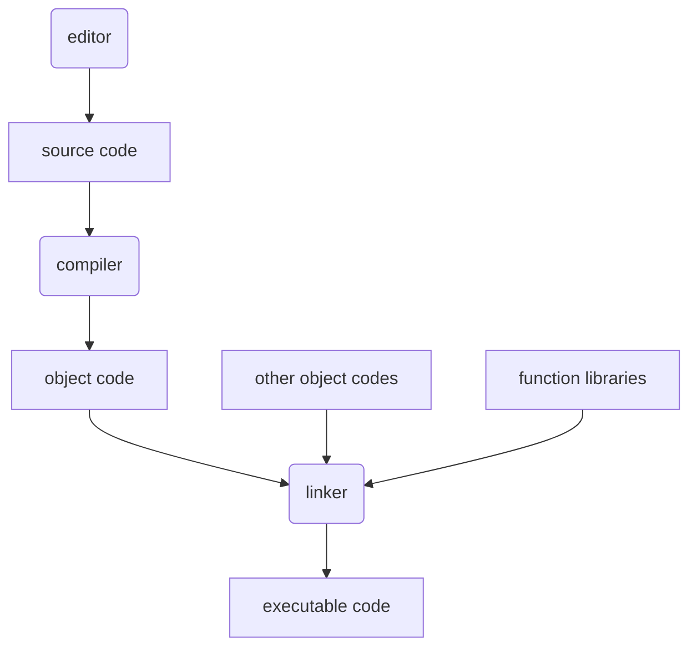
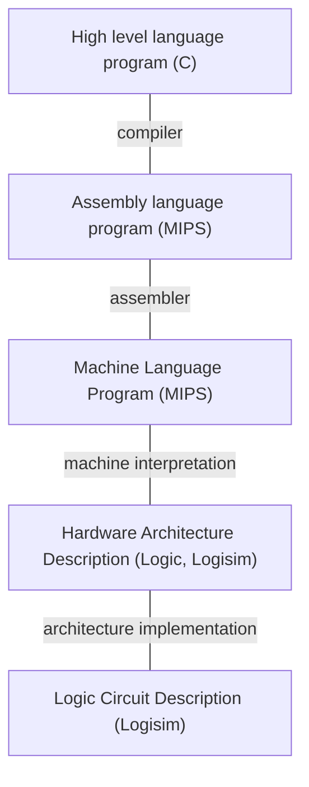

---
tags:
  - c_programming
  - CS2100
title: Overview of C
---
> [!info] C Programming language
> 
> Imperative procedural language.
80
# Process



An example of a compiler is `gcc`.

To display all details: `gcc -v HelloWorld.c`
- Preprocessing
- Compilation
- Assembler
- Linker

# Abstraction



# Computation

> [!info] Function
> 
> A function body has two parts:
> **Declaration statement**: What type of memory cells needed
> **Executable statement**: Describe processing on memory cells

> [!example] Declaration statement
> ``int count``

**User defined identifier** - name of variable of function.
- Must not begin with a digit, but can contain letters, digits and underscores
- Case sensitive
- Guideline: start with lowercase letter

**Reserved words** ``int, void, double, return`` etc
**Standard identifiers** ``printf, scanf`` etc

> [!example] Executable statement
> 
> ``printf, scanf``
> Computational and assignment statements

``lvalue = assigned value``
Stores a value or a computational result in a variable. ``lvalue`` must be assignable.
Assignment can be cascaded, with associativity from right to left: ``b = (c = 3 + 6)``

**Side-effect** An assignment statement also returns the value of the right-hand side.

**Arithmetic operations**

**Precedence rule**
1. Primary expression operators (Left to right)
	- `() expr++ expr --`
2. Unary operators (Right to left)
	- `* & + - ++expr --expr (typecast)`
3. Binary operators
	- `* / %`
	- `+ -`
4. Ternary operator
	- `? :`
5. Assignment operators
	- `= += -= *= /= %=`

Execution: 
- Left to right
- Parenthesis rule
- Precedence rule
- Associative rule
- Truncation (if result can be stored) 
	- ``int n; n = 9 * 0.5`` results in `4` being stored in `n`

> [!example] Typecasting
> 
> Uses a cast operator to change the type of an expression
> `int aa = 10; float pp = (float) aa / 4;`

> [!important] Modulo vs Remainder
> 
> Python `%` is a modulo, while C's `%` is a remainder. This results in a different value for negative values.

In Python:
```python
a = 10 % 4  # a = 2
b = -10 % 4 # b = 2
```

In C:
```C
a = 10 % 4  // a = 2
b = -10 % 4 // b = -2
```

**Selection Structures** 

There are two selection structures:
```c
if () {
	
}
elif () {

}
else {

}
```

```C
switch () {
	case x:
		...
		break;
	case y:
		...
		break;
	default:
		...
		break;
}
```

**Relational Operators** `< <= > >= == !=`
**Truth Values** `true false` - `false` is represented as `0`, and any other value can represent `true`
**Logical Operators** `&& || !`

> [!tip] Short-circuit evaluation
> 
> For AND statements `expr1 && expr2`
> > [!info] Short-circuit evaluation
> > if `expr1` is false, skip evaluating `expr2` and return false immediately
> 
> For OR statements `expr1 || expr2`
> > [!info] Short-circuit evaluation
> > if `expr1` is true, skip evaluating `expr2` and return true immediately

**Repetition**

```C
while ()
{

}
```

```C
do {

} while ()
```

```C
for (initalization; condition; update) {

}
```

**`break`** only breaks out of the inner-most loop containing the statement in a nested loop.
Similarly, **`continue`** skips to the next iteration of the inner-most loop containing the statement in a nested loop