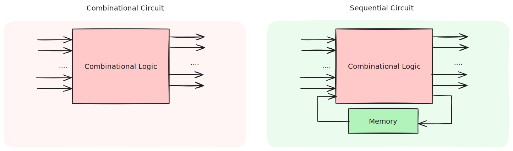
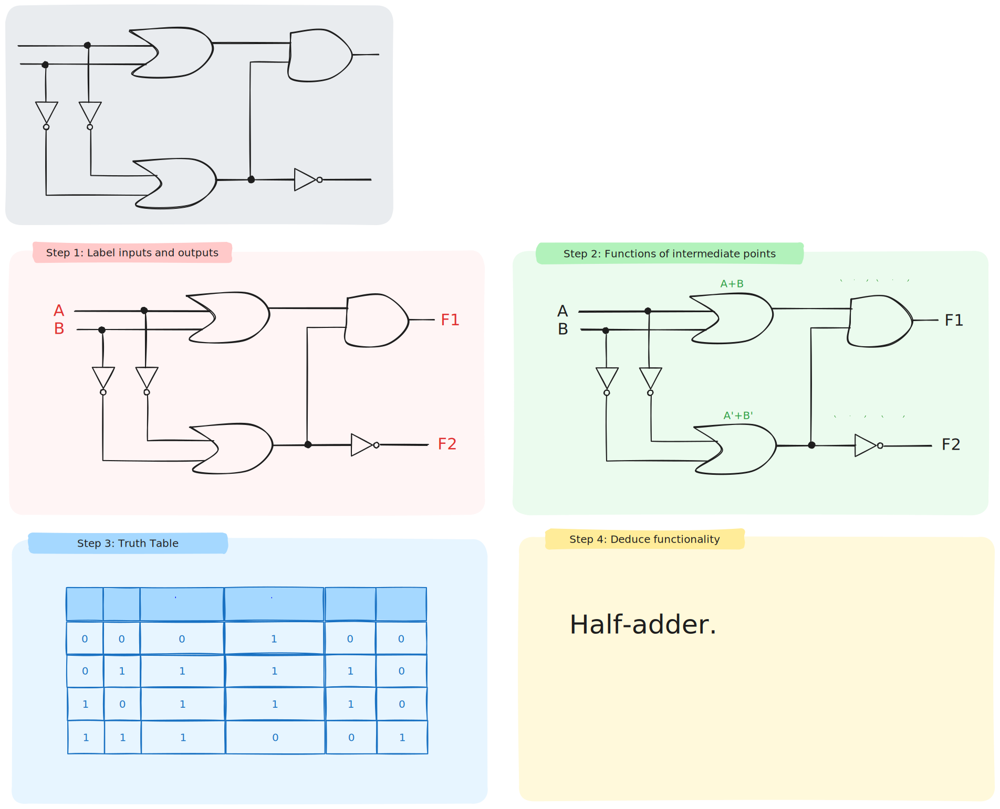
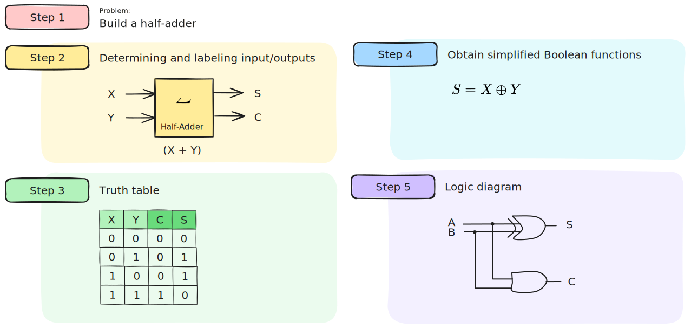
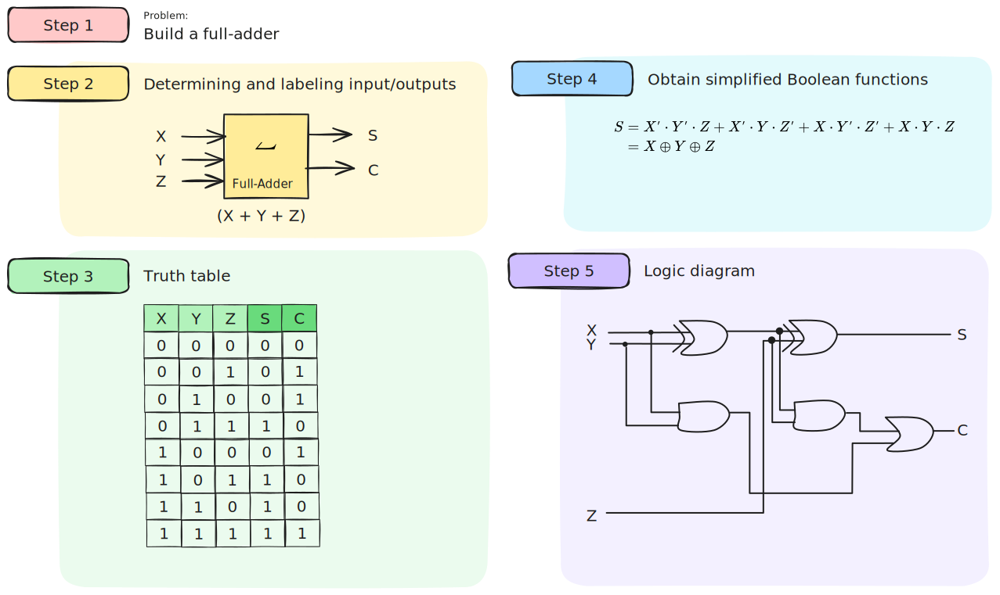
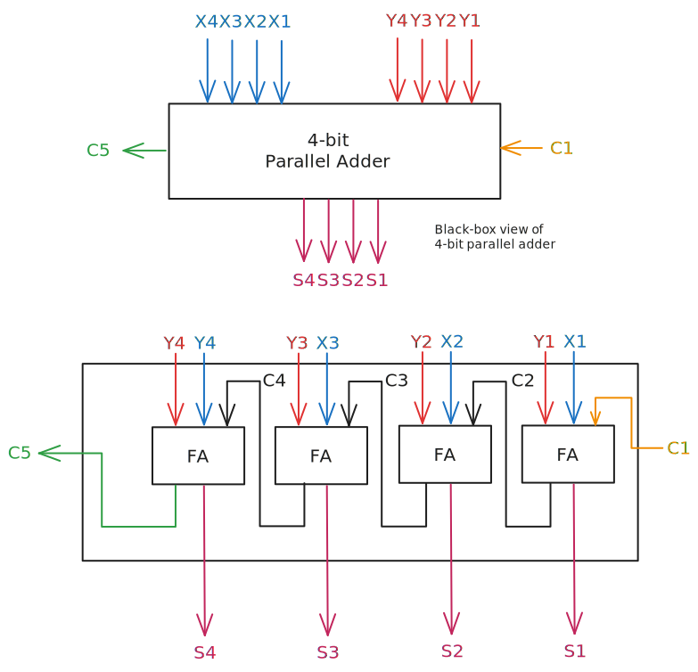
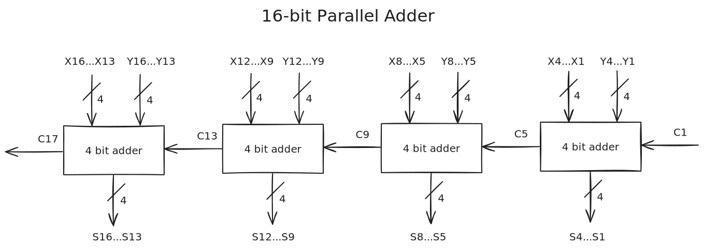
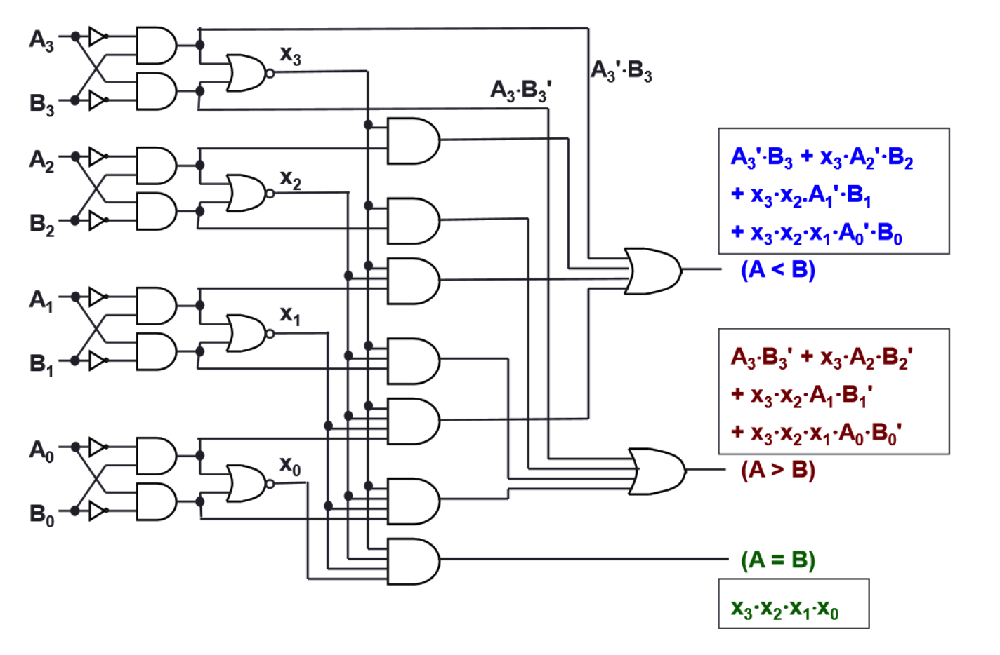
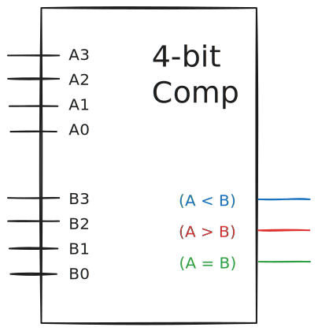

> [!definition] Combinational circuit
> Each output depends entirely on the immediate (present) inputs.

> [!definition] Sequential circuit
> Each output depends on both present inputs and state

# Analysis Procedure

1. Label inputs and outputs
2. Obtain the functions of intermediate points and the outputs
3. Draw the truth table
4. Deduce the functionality of circuit

# Design Methods

Combinational circuit design methods:
- Gate level design method (with logic gates)
- Block level design method (with functional blocks)

Design methods use logic gates and function blocks available as Integrated Circuit (IC) chips. Types of IC chips based on packing density: SSI, MSI, LSI, VLSI, ULSI.

Main objectives:
- Reduce cost (number of gates for small circuits, number of IC packages for complex circuits)
- Increase speed
- Design simplicity (block reuse)

# Gate-level design

1. State problem
2. Determine label inputs and outputs of circuit
3. Draw truth table
4. Obtain simplified Boolean functions
5. Draw logic diagram

# Block-Level Design

More complex circuits are built using block-level methods. We can use **4-bit parallel adders** as building blocks, we can create the following:
1. BCD-to-Excess-3 Code Converter
2. 16-bit Parallel Adder

# Magnitude Comparator

> [!definition] Magnitude Comparator
> Compares 2 unsigned values $A, B$ to check $A > B, A = B, A < B$

$$
\begin{aligned}
\text{if } & A_{n} > B_{n}: A > B \\
\text{if } & A_{n} < B_{n}: A < B \\
\text{if } & A_{n} = B_{n}: \text{check } A_{n-1}, B_{n-1}
\end{aligned}
$$

# Circuit Delays

> [!note] Circuit delay
> Given a logic gate with delay $t$, if inputs are stable at times $t_{1}, ..., t_{n}$, then the earliest time in which the output will be stable is:
> $$
> max(t_{1}, ..., t_{n}) + t
> $$

