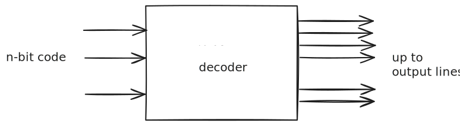
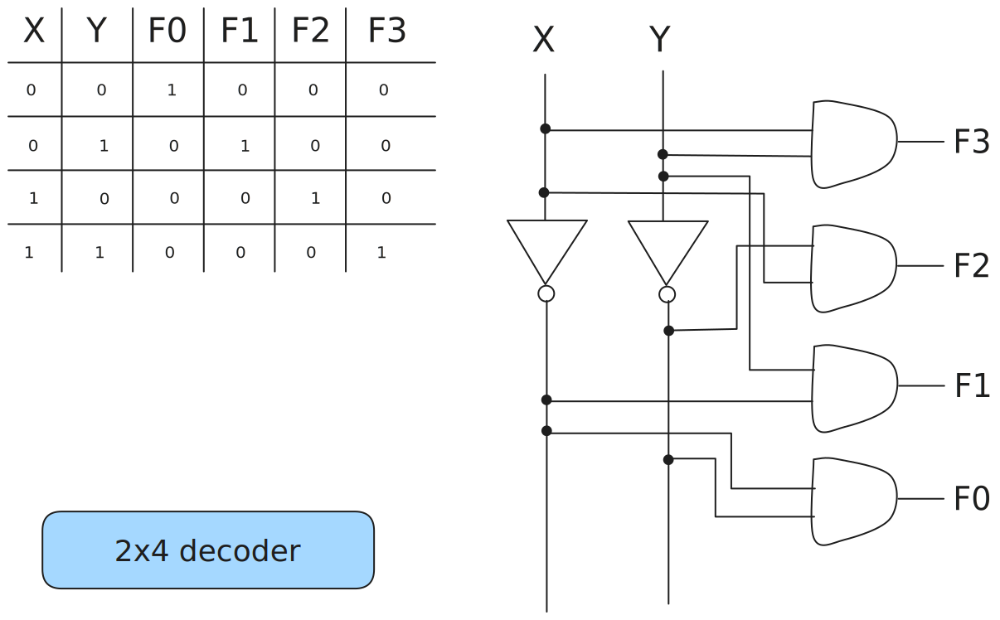
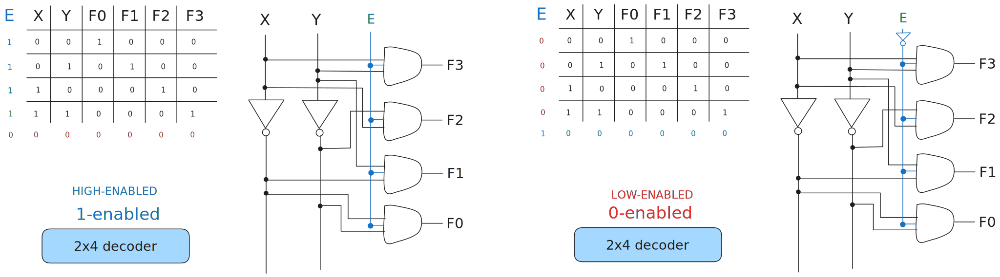
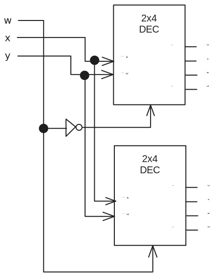
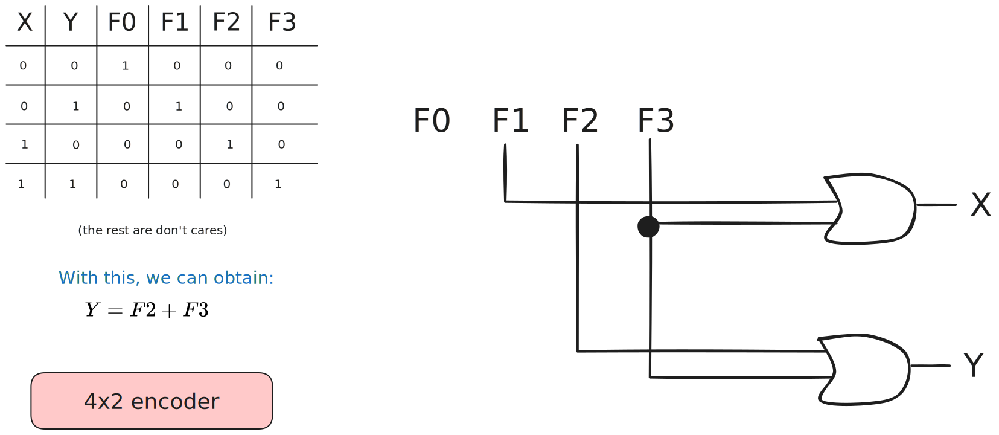
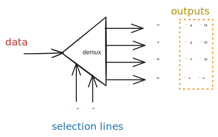

> [!definition] Integrated Circuit
> 
>Also known as IC, chip, or microchip
>
>Set of electronic circuits on one small flat piece of semiconductor material

> [!definition] Scale of integration
> Number of components fitted into standard size IC.

# Decoder

> [!note] Decoder
> Input: a code (from $n$ input lines)
> Output: $2^{n}$ output lines.
> 
> `n-to-m`, `n:m`, `n x m` $(m \leq 2^{n})$

Each output of a $n \times m$ decoder is a minterm of a $n-$ variable function.

## Implementing functions

A Boolean function in sum-of-minterms form can utilise a decoder to generate the minterms, and an OR gate to form the sum.

Any combinational circuit with $n$ inputs and $m$ outputs can be implemented with an $n:2^{n}$ decoder with $m$ OR gates.

> [!note] Good when circuit has many outputs, and each function is expressed with a few minterms.

## Enable

Decoders often come with an enable control signal so that device is only activated when $E = 1$.

## Constructing Larger Decoders

Larger decoders can be constructed from smaller ones.

## MSI Decoder

# Encoding

> [!note] Encoder
> Input: $2^{n}$ input lines
> Output: $n$ bits of code
> 

At any one time, only one input line of an encoder has a value of `1` (high), the rest are `0` (low).

## Priority Encoders

A priority encoder is one with priority
- if two or more inputs, inputs with highest priority takes precedence:

| $D_0$ | $D_1$ | $D_2$ | $D_3$ | $f$   | $g$   | $V$   |
| --- | --- | --- | --- | --- | --- | --- |
| $0$   | $0$   | $0$   | $0$   | $X$   | $X$   | $0$   |
| $1$   | $0$   | $0$   | $0$   | $0$   | $0$   | $1$   |
| $X$   | $1$   | $0$   | $0$   | $0$   | $1$   | $1$   |
| $X$   | $X$   | $1$   | $0$   | $1$   | $0$   | $1$   |
| $X$   | $X$   | $X$   | $1$   | $1$   | $1$   | $1$   |
# Multiplexers

Helps share a single communication line among a number of devices. Only one source and one destination can use the communication line.

## Demultiplexer

> [!definition] Demultiplexer
> Directs data from input to one selected output line.
> 
> Input: Input line, set of selection lines
> Output: Data from input to one selected output line

Demultiplexer circuit is identical to a decoder with enable.

# Multiplexer

> [!definition] Multiplexer
> 
> (Data selector)
> 
> Input: A number of input lines, a number of selection lines
> Output: Data to one output line - sum of (product of data lines and selection lines)

A $2^n$-to-$1$-line multiplexer - $2^n:1$ MUX is made from an $n:2^n$ decoder by adding to it $2^n$ input lines, one to each `AND` gate:

## Larger Multiplexers

Larger multiplexers can be constructed from smaller ones.

## Implementing Functions

A $2^{n}$-to-1 multiplexer can implement a Boolean function of $n$ input variables,
1. Express function in sum-of-minterms form
2. Connect $n$ variables to the $n$ selection lines
3. Put a `1` on a dataline if it is a minterm of the function, and `0` otherwise.
## Using Smaller Multiplexers

1. Express Boolean function in sum-of-minterms-form
2. Reserve one variable for input lines of MUX, and use the rest for selection lines
3. Draw truth table for function, by grouping inputs by selection line values, then determine multiplexer inputs by comparing input line and function for corresponding selection line values.

> [!example] if C is the chosen line, note the F output for C = `0,1` for each input line.

