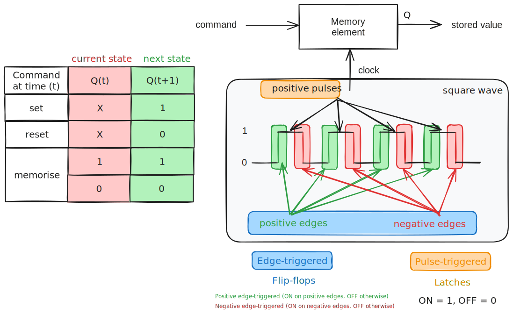
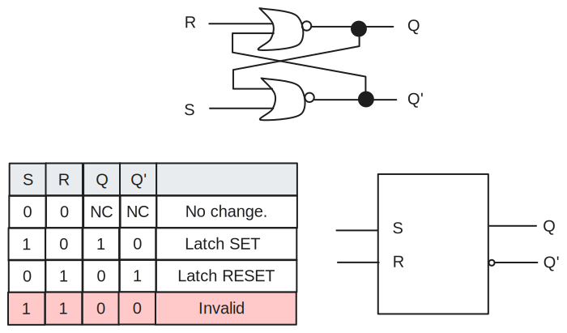
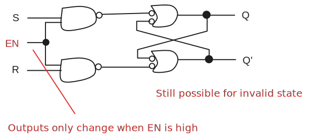
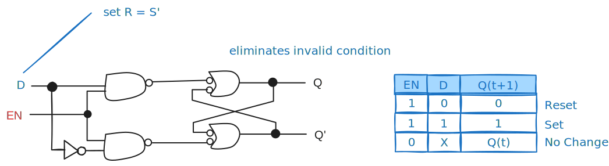
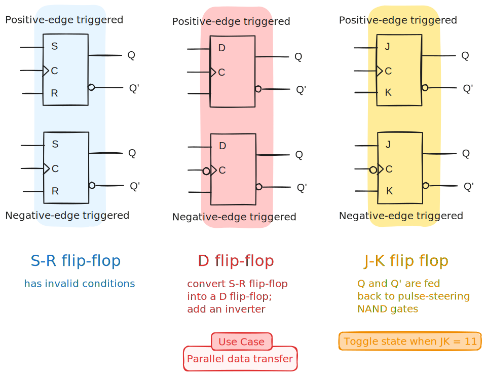
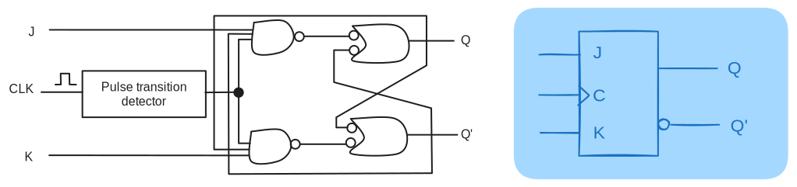
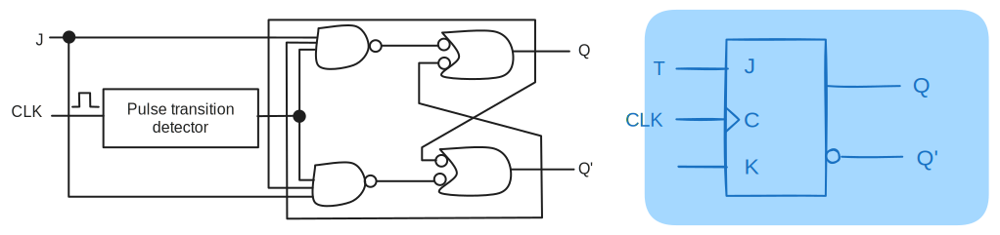
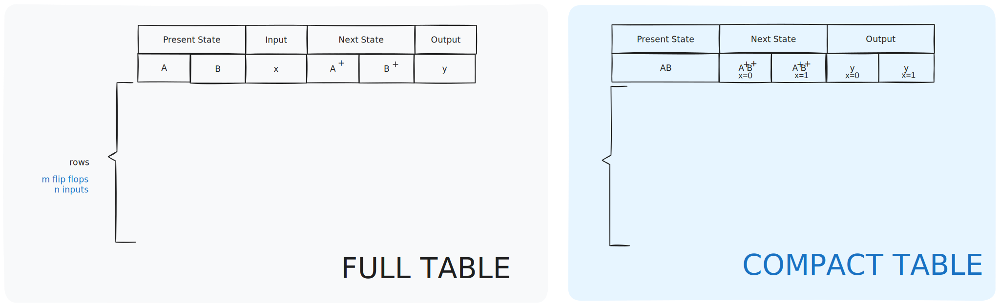
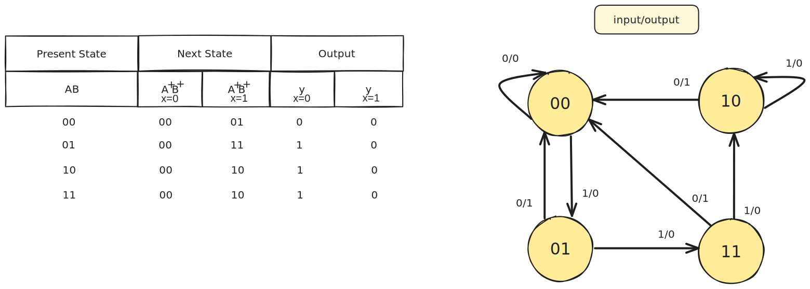

There are 2 types of sequential circuits:
- Synchronous: outputs change at specific time
- Asynchronous: Changes at any time

> [!definition] Multivibrator
> Class of sequential circuits
> 
> - Bistable (2 stable states)
> - Monostable or one-shot (1 stable state)
> - Astable (no stable state)

> [!note] Bistable logic devices
> Latches, and flip flops.

# Memory Elements

> [!definition] Memory element
> A device which can remember value indefinitely, or change value on command from its inputs.

# Latch

## `S-R` Latch
 
> [!note] `S-R` Latch
> Two inputs: `S` and `R`
> Two complementary outputs: `Q` and `Q'`
> 
> > [!note] State
> > `Q` = HIGH: `SET`
> > `Q'` = LOW: `RESET`

| $S$ | $R$ | $Q$ | $Q'$ |         |
| --- | --- | --- | ---- | ------- |
| $1$ | $0$ | $1$ | $0$  | LOW     |
| $0$ | $0$ | $1$ | $0$  | initial |
| $0$ | $1$ | $0$ | $1$  | HIGH    |
| $0$ | $0$ | $0$ | $1$  | HIGH    |
| $1$ | $1$ | $0$ | $0$  | invalid |

> [!note] Active-Low `S-R` Latch
> NAND gates are used instead for this. For these latches, given the input `SR`:
> 
> - `00` becomes an invalid command (no change in Active-High)
> - `11` becomes a nochange command (invalid in Active-High)
> - `01` becomes a set command (reset in Active-High)
> - `10` becomes a reset command (set in Active-High)

## Gated `S-R` Latch

> [!definition] Gated `S-R` Latch
> `S-R` latch + enable input (EN) and 2 NAND gates

## Gated `D` Latch

With the gated `D` latch, the invalid condition is eliminated.

# Flip-Flops

> [!definition] Synchronous bistable devices
> 
> Output changes state as a specified point on a triggering input called the clock:

## `S-R` flip flop

| $S$ | $R$ | $CLK$      | $Q(t+1)$ |           |
| --- | --- | ---------- | -------- | --------- |
| $0$ | $0$ | $X$        | $Q(t)$   | No change |
| $0$ | $1$ | $\uparrow$ | $0$      | Reset     |
| $1$ | $0$ | $\uparrow$ | $1$      | Set       |
| $1$ | $1$ | $\uparrow$ | $?$      | Invalid   |

## `D` flip flop

| $D$ | $CLK$      | $Q(t+1)$ |       |
| --- | ---------- | -------- | ----- |
| $1$ | $\uparrow$ | $1$      | Set   |
| $0$ | $\uparrow$ | $0$      | Reset |
## `J-K` flip flop

| $J$ | $K$ | $CLK$      | $Q(t+1)$ |           |
| --- | --- | ---------- | -------- | --------- |
| $0$ | $0$ | $\uparrow$ | $Q(t)$   | No change |
| $0$ | $1$ | $\uparrow$ | $0$      | Reset     |
| $1$ | $0$ | $\uparrow$ | $1$      | Set       |
| $1$ | $1$ | $\uparrow$ | $Q(t)'$  | Toggle    |
$$
Q(t+1) = J \cdot Q' + K' \cdot Q
$$

## `T` flip flop

| $T$ | $CLK$      | $Q(t+1)$ |           |
| --- | ---------- | -------- | --------- |
| $0$ | $\uparrow$ | $Q(t)$   | No change |
| $1$ | $\uparrow$ | $Q(t)'$  | Toggle    |
$$
Q(t+1) = T \cdot Q' + T' \cdot Q
$$

# Asynchronous Inputs

The `S-R`, `D`, `J-K` inputs are synchronous inputs as data on these inputs are transferred to the flip-flop's output only on the triggered edge of the clock pulse.

> [!note] Asynchronous
> Affect the state of the flip flop independent of the clock
> 
> > [!example] `PRE = HIGH`: Q is immediately set to HIGH
> 
> > [!example] `CLR = HIGH`: Q is immediately cleared to LOW
> 
> Flip-flop in normal operation mode when both PRE and CLR are LOW.

# Synchronous Sequential Circuits

> [!note] 
> Flip flops make up the memory while the gates form one or more combinational sub-circuits. 

| $S$ | $R$ | $CLK$      | $Q(t+1)$ |                       |
| --- | --- | ---------- | -------- | --------------------- |
| $0$ | $0$ | $X$        | $Q(t)$   | No change             |
| $0$ | $1$ | $\uparrow$ | $0$      | Reset                 |
| $1$ | $0$ | $\uparrow$ | $1$      | Set                   |
| $1$ | $1$ | $\uparrow$ | $?$      | Invalid/Unpredictable |

| $D$ | $CLK$      | $Q(t+1)$ |       |
| --- | ---------- | -------- | ----- |
| $1$ | $\uparrow$ | $1$      | Set   |
| $0$ | $\uparrow$ | $0$      | Reset |

| $J$ | $K$ | $CLK$      | $Q(t+1)$ |           |
| --- | --- | ---------- | -------- | --------- |
| $0$ | $0$ | $\uparrow$ | $Q(t)$   | No change |
| $0$ | $1$ | $\uparrow$ | $0$      | Reset     |
| $1$ | $0$ | $\uparrow$ | $1$      | Set       |
| $1$ | $1$ | $\uparrow$ | $Q(t)'$  | Toggle    |

| $T$ | $CLK$      | $Q(t+1)$ |           |
| --- | ---------- | -------- | --------- |
| $0$ | $\uparrow$ | $Q(t)$   | No change |
| $1$ | $\uparrow$ | $Q(t)'$  | Toggle    |

## Analysis of Sequential Circuits

> [!note] Analysing behaviour
> 1. Derive state table
> 2. and hence its state diagram

Requires state equations to be derived for the flip-flop inputs as well as output functions for the circuit outputs other than the flip-flops other than flip flops.

$A(t)$ or $(A)$ and $A(t+1)$ or $A^{+}$ can represent the present state and next state of a flip-flop represented by $A$.

> [!definition] State table
> Similar to a truth table.
> Inputs and present state on left side.
> Outputs and next state on the right side.

$m$ flip-flops and $n$ inputs $\rightarrow 2^{m+n}$ rows

> [!definition] State diagram
> - Each state is denoted by a circle
> - Each arrow denotes a transition of the sequential circuit

> [!definition] Circuit output functions
> 
> The outputs of a sequential circuit are functions of the present states of the flip-flops and the inputs. The algebraic description of these are the circuit output functions.

> [!definition] Flip-flop input functions/equations
> Algebraic descriptions of the part of the circuit that generates inputs to the flip-flops.
> 
> This determines the next state generation - using the functions and the characteristic tables, the next states of flip-flops can be obtained.

