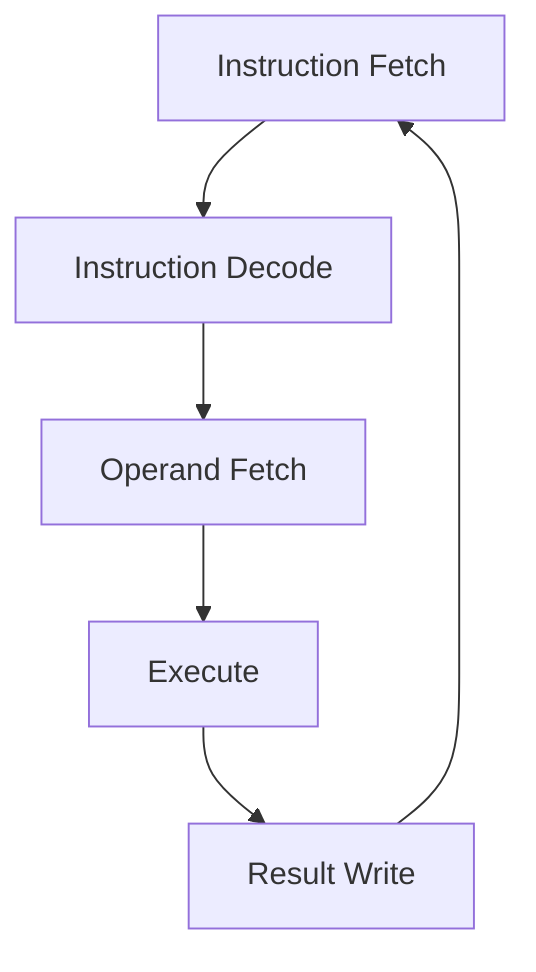
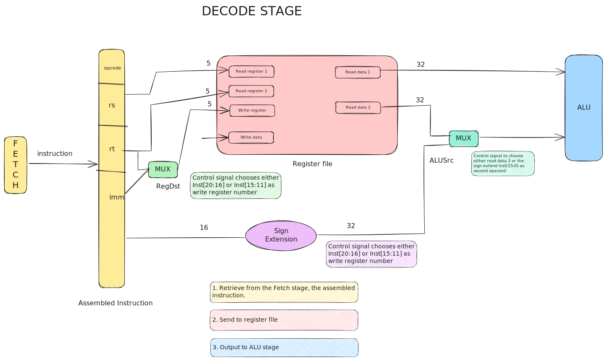

There are two major components for a processor.

> [!note] Datapath
> A collection of components that process data, and performs arithmetic, logical and memory operations.

> [!note] Control
> Tells the datapath, memory and I/O devices what to do according to program instructions.
# MIPS Processor

Simplest possible implementation:
- Arithmetic and logical operations
	- `add`,`sub`
	- `and`, `or`
	- `addi`
	- `slt`
- Data transfer instructions
	- `lw`, `sw`
- Branches
	- `beq`, `bne`
# Instruction Execution Cycle




1. Instruction Fetch
This gets the instruction from memory. The address of this memory instruction is in the PC register.

2. Instruction Decode
This decodes the encoded instruction from the memory instruction

3. Operand Fetch
This retrieves the operand needed for operation.

4. Execute
This performs the required operation.

5. Result Write (Store)
Store result of the performed operation.

> [!note] MIPS Instruction Execution
> 
> For MIPS, some design changes can be seen. Notably:
> 1. Merging decode and operand fetch
> 2. Splitting execute into ALU and memory access.
>    
> The execution flow is then as follows:
> 1. Fetch
> 2. Decode + Operand Fetch
> 3. ALU
> 4. Memory access
> 5. Result Write


## Fetch Stage

![[media/datapath-fetch.svg]]
> [!note] Instruction memory
> The instruction memory acts as a storage element for the instructions. The instruction memory is a sequential circuit that stores information through an internal state. The clock signal is assumed and not shown.
> 
> Effectively, this **supplies instruction, given the address**.

> [!note] Adder
> 
> Combinational logic to implement the addition of two numbers.
> 
> Takes in two 32-bit numbers $A, B$ and outputs the sum $A + B$.

> [!important] Clocking
> 
> Allows the reading and updating of PC at the same time.
> 
> The PC is read during the first half of the clock period, and then is updated with PC + 4 at the next rising clock edge.

```C
function FETCH() {
	inst = IM(PC); // read instruction at address from PC
	PC = Add(PC, 4); // update PC to PC+4
	return inst; // instruction is passed into decode stage
}
```
## Decode Stage



> [!note] Register file
> 
> A collection of 32 registers (32-bit wide) which can be read and written to by specifying register number.
> 
> Per instruction, it can
> - read at most two registers
> - write at most one register

> [!note] `RegWrite`
> This is used as a control signal to indicate whether there is a writing of register.
> `1` = Write, `0` = No Write

> [!definition] Multiplexer
> A multiplexer is a device that selects between several analog or digital input signals and forwards the selected input to a single output line.
> 
> In this context, it selects one input from multiple input lines, has a control with $m$ bits where $n^{2m}$, and selects the $i^{th}$ input line if control = $i$.

> [!note] `RegDst`
> This control signal chooses whether to use the destination register is `Inst[20:16]` or `Inst[15:11]`.
> 
> This allows the use of `Inst[15:11]` as the write register (for R-format) or `Inst[20:16]` as the write register (for 2 registers).

> [!note] `ALUSrc`
> Control signal chooses whether to read data 2 (from the register) or read the sign extended `Inst[15:0]` as the second operand. 
> 
> This allows the use of reading the data from the second register (for R-format) or `Inst[15:0]` when there is an immediate field.
> 
> `0`: `R-format`
> `1`: `I-format` except for branch

``` C
function DECODE(inst) {
	// 1. Read register
	RR1 = inst[21:25]; // $rs 
	RR2 = inst[16:20]; // $rs 
	RD1, RD2 = RegRead(RR1, RR2); // read both registers
	// 2. Store Write register for later use
	WR = Mux(inst[16:20], // $rt
		inst[11:15], $rd
		RegDst) // control signal
	// 3. Choose output
	IMM = SignExtend(inst[0:15]);
	return [RD1, Mux(RD2, IMM, ALUSrc)]; 
	// returns the 1st register, as well as either the 2nd register, or the immediate value
}
```
## ALU Stage

> [!definition] ALU
> Arithmetic-Logic Unit (also known as execution)
> 
> Performs most of the "real work". Takes input from the Decode stage (Operation and Operands) and outputs the calculation result to memory.

![[media/datapath-alu.svg]]

The ALU handles the combinational logic to implement arithmetic and logical operations. It takes in two 32-bit numbers and uses a 4-bit control signal. It outputs a result as well as a 1-bit signal to indicate whether result is zero.

> [!note] Handling branch instruction
> 
> Requires two calculations:
> 1. Branch outcome
> 2. Branch target address

The branch outcome can be found using the ALU - the `isZero? `signal is enough to handle the equal/not equal check.

The multiplexer `PCSrc` effectively chooses between the `PC+4` or the branch target based on the `isZero` result, as well as the `Branch` control signal.

> [!note] `PCSrc`
> `0`: `PC + 4` (next instruction (non-branch))
> `1`: `PC + 4 + immediate x 4` (next instruction (branch))


```C
function ALU(A, B, ALUcontrol) {
	case 0000: return [A & B, A & B == 0]; // AND
	case 0001: return [A | B, A | B == 0]; // OR
	case 0010: return [A + B, A + B == 0]; // ADD
	case 0110: return [A - B, A - B == 0]; // SUB
	case 0111: return [A < B, A < B == 0]; // SLT
	case 1100: return [~(A | B), ~(A | B) == 0]; // NOR
	// returns the value of the operation, as well as ifZero
}
```

## Memory

> [!note] Memory access stage
> For this stage, only the `load` and `store` instructions are needed to perform the operations.
> 
> Other operations are going to be passed through for the Register Write stage.

It takes an input from the ALU and outputs to the next stage (Register Write).

![[media/datapath-memory.svg]]
There are three cases of instructions:

**Load**
For this, the address of the value to be loaded is passed through into the ALU result.

**Store**
For this, `read data 2` will be directed into the `Write Data`, and the address of the value is passed through into the ALU result.

**Non-memory instruction**
The ALU result and the value from `Read Data` goes through a multiplexer, where `MemToReg` will indicate result came from the ALU unit.

```C
function MEM(alu_res, data) {
	mem_res = DataMem(alu_res, data, MemWrite, MemRead);
	return Mux(alu_res, mem_res, MemToReg); 
	// based on MemToReg, gets the value of the Read 2 register
	// or the ALU rsult
}
```
## Register Write

> [!note] Register Write
>  Most instructions write the result of some computation into a register - this stage is responsible for that. Takes in input from the memory (where it is the computation result, either from memory or ALU)

![[media/datapath-registerwrite.svg]]
> [!note] MemToReg
> `0`: no write
> `1`: write

```C
function WRITEBACK(data) {
	RegWrite(data, WR, RegWrite)
}
```