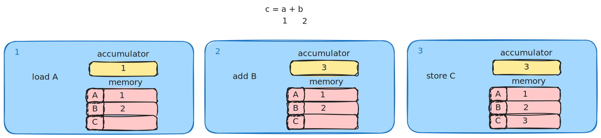
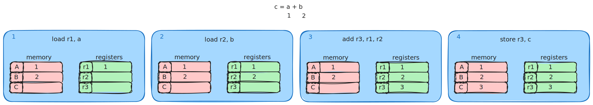
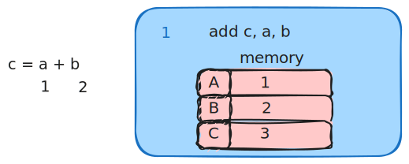
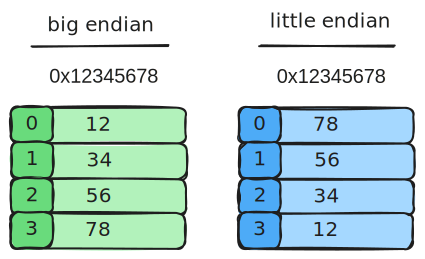

---
tags:
  - computer_architecture
  - CS2100
title: Instruction Set Architecture
---
# Design Philosophies

There is two major design philosophies.

> [!note] Complex Instruction Set Computer (CISC)
> 
> A single instruction can perform complex operations. 
> Program sizes are smaller (memory premium)
> Implementation is complex - not allowing room for hardware optimisation
> 
> > [!example] x86-32 (IA32)

> [!note] Reduced Instruction Set Computer (RISC)
> Keep instruction set small and simple, allowing for hardware optimisation
> Software implements complex operations.
> > [!example] MIPS, ARM

|                         | CISC                                                            | RISC                                          |
| ----------------------- | --------------------------------------------------------------- | --------------------------------------------- |
| Complexity of operation | Single instruction can perform complex                          | Small and simple instruction set              |
| Program size            | Generally smaller                                               | Bigger                                        |
| Hardware optimisation   | Complex implementations leave no room for hardware optimisation | Simple small instruction set for optimisation |

# Data Storage

Based on the von Neumann Architecture, data operands are stored in memory.

Storage architecture is concerned with:
- storage of operands for performing computation
- storage of computation result
- operand specification

> [!note] Stack architecture
> Operands are implicitly on top of the stack

For this architecture, operands are pushed onto the stack, then the operation is run, and the result is popped.

> [!example] Add operation `A + B = C`
> 
> ```
> push A
> push B
> add
> pop C
> ```
> 
> ![[media/stack_architecture.svg]]

> [!note] Accumulator architecture
> One operand is implicitly in a special register (accumulator)

An operand is stored in a special register (the accumulator).

> [!example] Add operation `c = a + b`
> 
> ```
> load A
> add B
> store C
> ```
> 
> 

> [!note] General purpose register architecture
> All operands are explicit.
> 
> > [!example] Register-memory architecture
> 
> > [!example] Register-register (load-store) architecture

In this architecture, all operands are explicity listed.

> [!example] Add operation in load-store `c = a + b`
> 
> ```
> load r1, a
> load r2, b
> add r3, r1, r2
> store r3, c
> ```
> 
> 


> [!note] Memory-memory architecture
> All operands are in memory.

In this architecture, the operations are done directly in the memory, without loading them anywhere.

> [!example] Add operation `c =  a + b`
> 
> ```
> add c, a, b
> ```
> 
> 

Generally, modern processors tend to use **general-purpose register architecture** 
- RISC computers use Load/Store
- CISC computers use a mix of Load/Store and Register-Memory

# Memory Addressing

Given a $k-$bit address, the address space is of size $2^k$ - where each memory transfer consists of one word of $n$ bits.

The memory address register connects the processor to the memory through a $k-$bit address bus, allowing for up to $2^k$ addressable locations.

Similarly, the memory data register connects the processor to the memory through a $n-$ bit data bus.

## Endianness

> [!definition] Endianness
> This refers to the relative ordering of the bytes in a multiple-byte word stored in memory.
> 



For big-endian, the **most-significant-byte (MSB)** is stored in the lowest address, while for little-endian, the **least-significant-byte (LSB)** is stored in the lowest address.

> [!example] 
> **Big-endian** MIPS, IBM 360/370 Motorola 68000, SPARC
> **Little-endian** Intel 80x86, DEC VAX, DEC Alpha

## Addressing mode

> [!definition] Addressing mode
> Ways to specify an operand in an assembly language

| Addressing mode    | Example               | Meaning                                            |
| ------------------ | --------------------- | -------------------------------------------------- |
| Register           | `add r4, r3`          | $r4 \leftarrow r4 + r3$                            |
| Immediate          | `add r4, #3`          | $r4 \leftarrow r4 + 3$                             |
| Displacement       | `add r4, 100(r1)`     | $r4 \leftarrow r4 + Mem[100+r1]$                   |
| Register indirect  | `add r4, r1`          | $r4 \leftarrow r4 + Mem[r1]$                       |
| Indexed/base       | `add r3, (r1 + r2)`   | $r3 \leftarrow Mem[r1 + r2]$                       |
| Direct or absolute | `add r1, (1001)`      | $r1 \leftarrow Mem[1001]$                          |
| Memory indirect    | `add r1, @r3`         | $r1 \leftarrow r1 + Mem[Mem[r3]]$                  |
| Auto-increment     | `add r1, (r2)+`       | $r1 \leftarrow r1 + Mem[r2]; r2 \leftarrow r2 +d$  |
| Auto decrement     | `add r1, -(r2)`       | $r2 \leftarrow r2 + d; r1 \leftarrow r1 + Mem[r2]$ |
| Scaled             | `add r1, 100(r2)[r3]` | $r1 \leftarrow r1 + Mem[100 + R2 + R3 \times d]$   |
# Operations in Instruction Set

There are multiple types of standard operations in an instruction set.

**Data movement**
- load/store (to/from memory)
- memory-to-memory
- register-to-register
- input/output (IO)
- push/pop (to/from stack)

**Arithmetic**
- add
- subtract
- multiply
- divide

**Shift**
- shift left/right
- rotate left/right

**Logical**
- `not
- `and`
- `or`
- `set`
- `clear`

**Control flow**
- unconditional jumps (`jump`)
- conditional jumps (`branch`)

**Subroutine linkage**
- call
- return

**Interrupt**
- trap
- return

**Synchronisation**
- test
- set

**String**
- search
- move
- compare

**Graphics**
- pixel and vertex operations
- compression/decompression

> [!theorem] Amdahl's law
> The overall performance improvement gained by optimizing a single part of a system is limited by the fraction of time that the improved part is actually used.

Based on this law, to improve the performance, make the more frequently used instructions fast (`load`, `branch`, `compare`, `store`)

# Instruction Formats
## Instruction Length

The instruction length can be variable, fixed or a mix of both.

| Variable-length                                                  | Fixed-length                |
| ---------------------------------------------------------------- | --------------------------- |
| Requires multi-step fetch and decode                             | Easy fetch and decode       |
| Allow for more flexible, but complex and compact instruction set | Instruction bits are scarce |
> [!example]
> Variable length: Intel 80x86, Digital VAX
> Fixed length: Most RISC (MIPS, Power PC)

## Instruction Fields

Instructions consist of **opcodes** and **operands**.
The opcode specifies the desired operation, while the operands are zero or more additional information needed for the operations.

Operation designates the type and the size of operands.
# Instruction Encoding

Instructions need to be encoded into binary format for execution by the processor.

> [!question] What are possible issues to consider?
> - code size
> - speed/performance
> - design complexity

With these issues, there are three things to decide:
1. the number of registers
2. number of addressing modes
3. number of operands in an instruction

The compromise to be found is within
- having many registers/addressing modes
- reducing code size
- easy to handle instruction length

There are three encoding choices:
- variable
- fixed
- hybrid

## Fixed-Length Instructions

> [!question] How do we fit multiple sets of instruction types into the same limited number of bits?
> Work with most constrained instruction type first.

**Expanding Opcode Scheme** 
- opcode has variable lengths for different instructions

> [!example] How the Expanding Opcode scheme can maximise the instruction bits.
> 
> Imagine there are 2 types of instructions for 16-bit fixed length instructions:
> Type-A has 2 operands, and Type-B has 1 operand.
> 
> While Type-A can only use 6 bits for the opcode, since Type-B has 5 less bits free, it can use those extra bits for the opcode.

With the Expanding Opcode scheme, if we want more instructions, we can allow more prefixes to go to the instructions of a different type, as it allows for a lot more instructions.

> [!example] Maximum instructions for the example above.
> 
> If Type-A is given $1$ instruction, Type-B then has $2^{6}- 1$ prefixes, with $2^{5}$ patterns, making the instruction set the biggest at $1 + (2^{6}-1)2^{5}$,

> [!example] Minimum instructions for the example above.
> 
> If Type-B is given $1$ prefix, Type-A then has $2^{5}- 1$ instruction, making the instruction set the smallest at $2^{5} -1 + 2^{6} - 1$.


