---
tags:
  - CS2100
  - memory
  - computer_architecture
---

# Summary

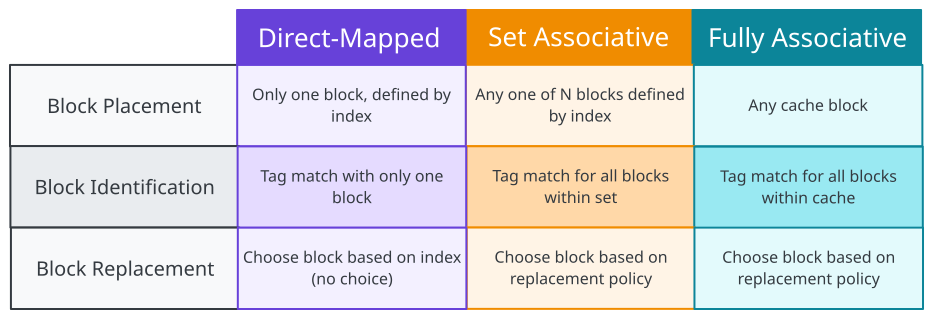
# Context

If operands are in memory, it has to be loaded into the registers of the processor, and then operated, and stored back into memory.
## Memory Technology

> [!definition] DDR SDRAM
> Double Data Rate Synchronous Dynamic Random Access Memory

## Motivation

Requirement: Big and fast memory

> [!note] Key concept
> Hierarchy of memory technologies should be used:
> - Small but fast near CPU
> - Large but slow farther away from CPU (for cost)

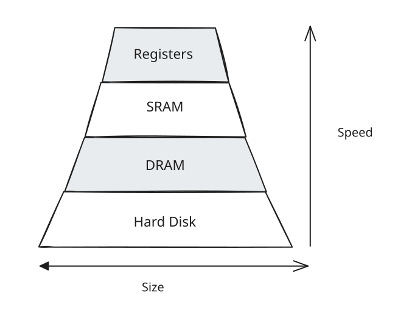
# Cache

> [!note] Keep frequently and recently used data in smaller but faster memory

> [!definition] Principle of locality
> Program accesses only a small portion of the memory address space within a small time interval
> 
> > [!definition] Temporal locality
> > If an item is referenced, it will tend to be referenced again soon
> 
> > [!definition] Spatial locality
> > If an item is referenced, nearby items will tend to be referenced soon.

# Working Set

> [!definition] Working set
> Set of locations accessed during $\Delta t$
> 
> > [!note] Aim
> > Capture working set and keep it in memory closest to CPU

# Memory Access

To make slow main memory appear faster:
- Cache
- Hardware management

To make small main memory appear bigger:
- Virtual memory
- OS managed

## Terminology

> [!definition] Hit
> Data is in cache
> 
> > [!note] Hit rate
> > Fraction of memory that is in cache
> 
> > [!note] Hit time
> > Time to access cache

> [!definition] Miss
> Data is not in cache
> 
> > [!note] Miss rate
> > Fraction of memory not in cache ($1 - Hit rate$)
> 
> > [!note] Miss penalty
> > Time to replace cache block + hit time
> > 
> > By definition $>$ hit time

Average access time:
$$
\text{Hit rate} \times \text{Hit time } + (1 \text{ - Hit rate}) \times \text{ Miss penalty } 
$$

# Memory-Cache Mapping

> [!definition] Cache block/line
> Unit of transfer between memory and cache

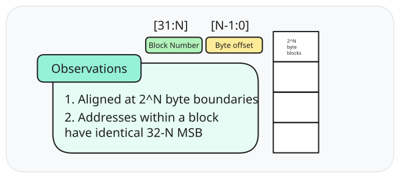
## Direct Mapped Cache

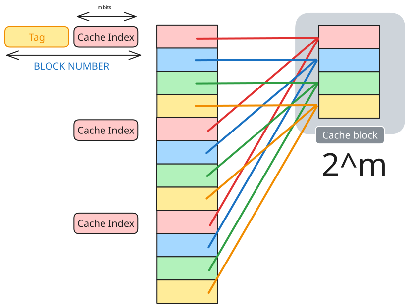
Multiple memory blocks map to the same cache block (and have the same cache index), but have unique tag numbers.

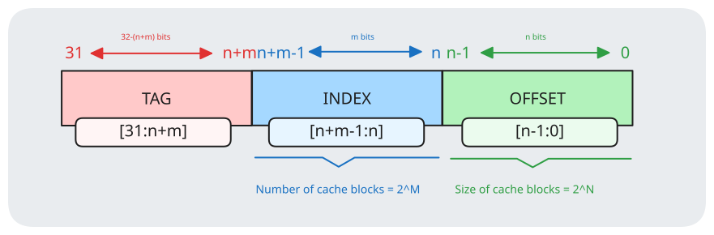

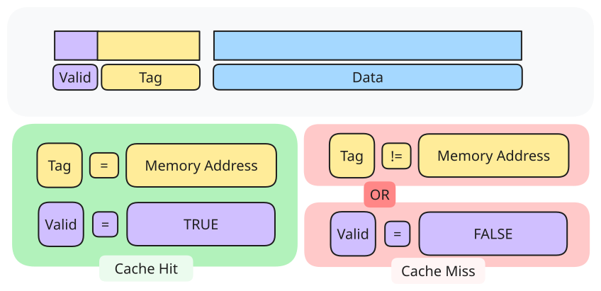

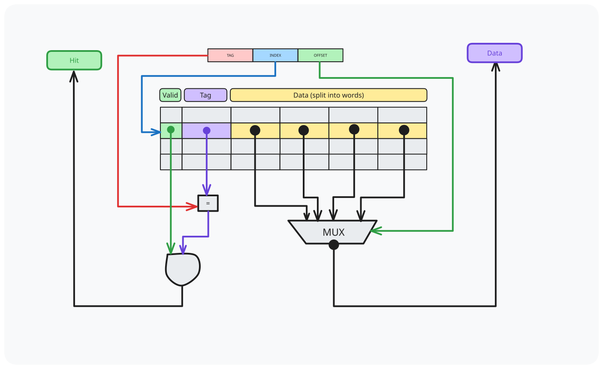

## Reading Data

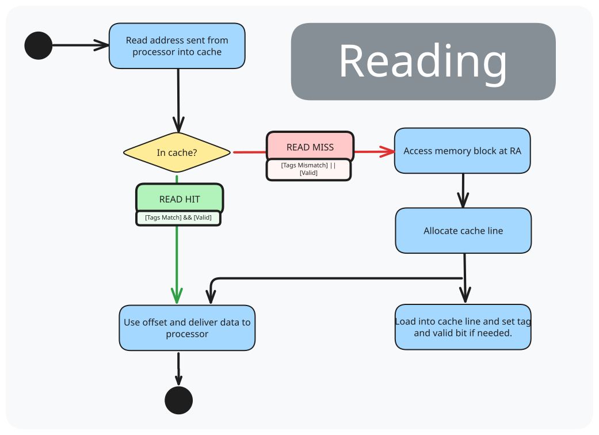

| Cache Misses                                   |                                                                                               |
| ---------------------------------------------- | --------------------------------------------------------------------------------------------- |
| Compulsory misses (cold start/first reference) | Occurs at first access to a block, as block must be brought into cache.                       |
| Conflict misses (collision/interference)       | Occurs in direct mapped/set associative, when several blocks are mapped to the same block/set |
| Capacity misses                                | Occurs when blocks are discarded from cache as cache cannot contain all blocks                |
## Writing Policy

> [!note] Motivation
> When writing data, the modified data is only in cache, but not in memory.

Solutions:
1. Write-through cache
2. Write-back cache

> [!definition] Write-through cache
> Write data both to cache and to main memory

> [!definition] Write-back cache
> Only writes to cache during write operation, and only writes to main memory when cache block is evicted.

### Handling Cache Misses

> [!definition] Write allocate
> - load complete block into cache
> - change only required word in cache
> - write to main memory (based on write policy)

> [!definition] Write around
> - write directly to main memory

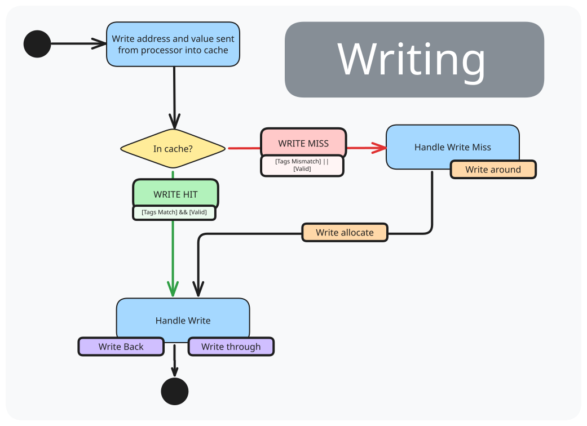

## Block Size Trade-offs

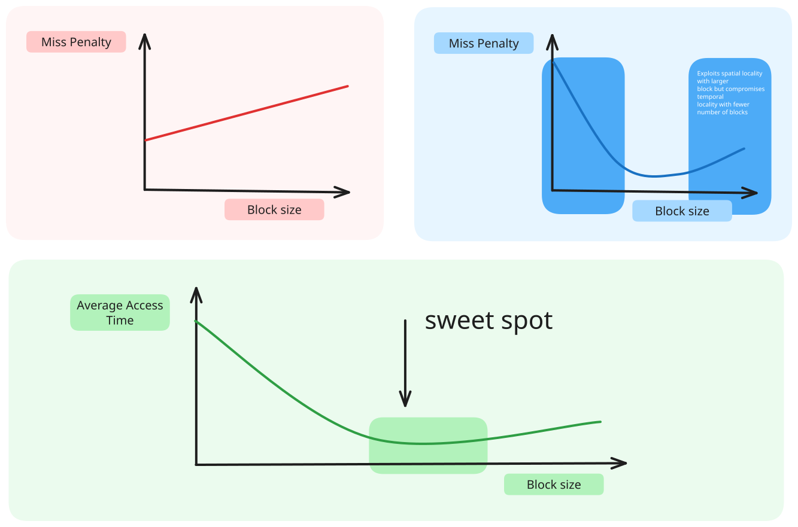

## Set-Associative Cache

> [!note] Motivation
> Address conflict misses.

> [!definition] $N-$way set associative cache
> A memory block can be placed in a fixed number $N$ of locations in the cache, where $N > 1$.

Effective idea:
- instead of mapping to a cache block, it maps to a unique set of cache blocks where it can be placed in any of the $N$ cache blocks in that set.
- requires searching of both to look for memory block

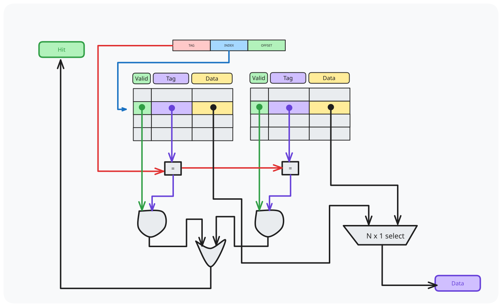

> [!success] Advantage of associativity
> A direct-mapped cache of size $N$ has the same miss rate of a 2-way set associative cache of size $N/2$.

## Fully-Associative Cache

> [!definition] Fully-associative cache
> Can be placed in any location in cache

Block number serves as tag in FA cache.

> [!success] No conflict misses
> No conflict misses happens since data can go anywhere

> [!failure] Capacity misses
> Cache cannot contain all blocks needed

# Cache Performance

1. Cold/compulsory miss remains the same irrespective of cache size/associativity
2. Conflict miss goes down with increasing associativity on the same cache size
3. Conflict miss is 0 for FA caches
4. For same cache size, capacity miss remains the same irrespective of associativity
5. Capacity miss decreases with increasing cache size

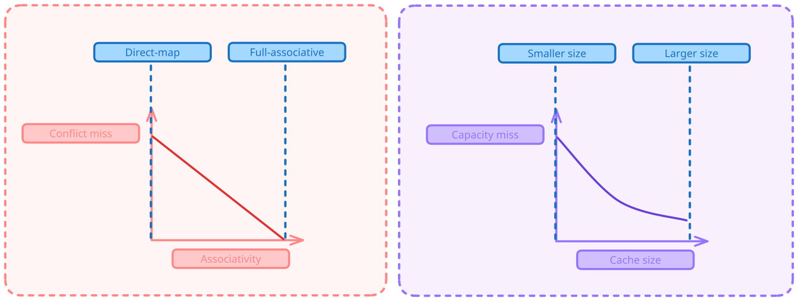

| Cache Misses    |                                                              |
| --------------- | ------------------------------------------------------------ |
| Cold/compulsory | same irrespective of cache size/associativity                |
| Conflict miss   | for same cache size, decreases with increasing associativity |
| Capacity miss   | decreases with increasing cache size                         |
# Block Replacement Policy

> [!note] Motivation
> In set associative and fully associative caches, a memory block can choose where to be placed, potentially replacing another cache block if full.

> [!definition] Least recently used
> When replacing a block, choose one which has not been accessed for the longest time. (Temporal locality)
> 
> > [!caution] Hard to track if there are many choices

- FIFO
- RR
- LFU

