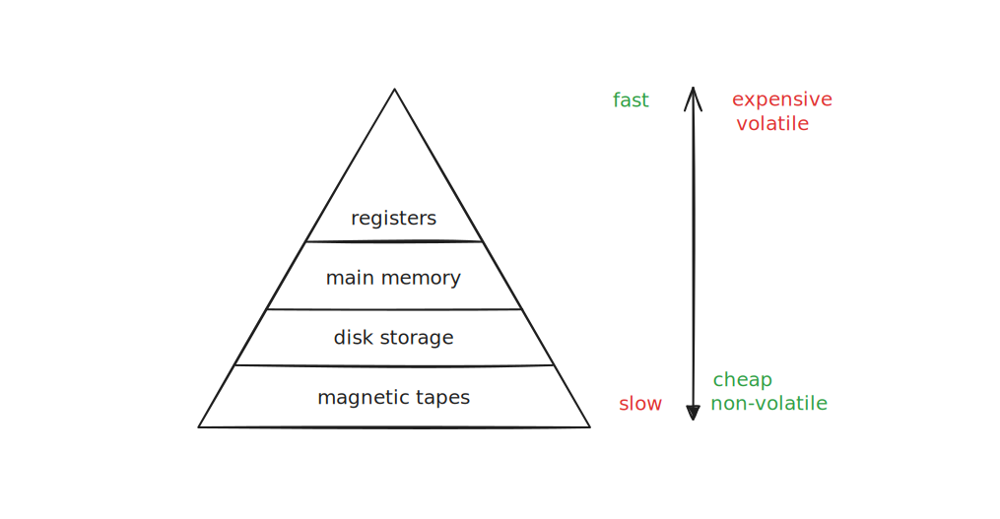
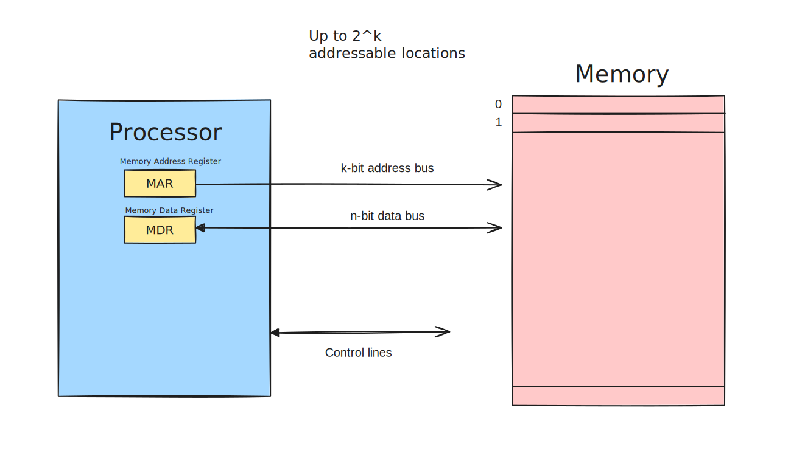
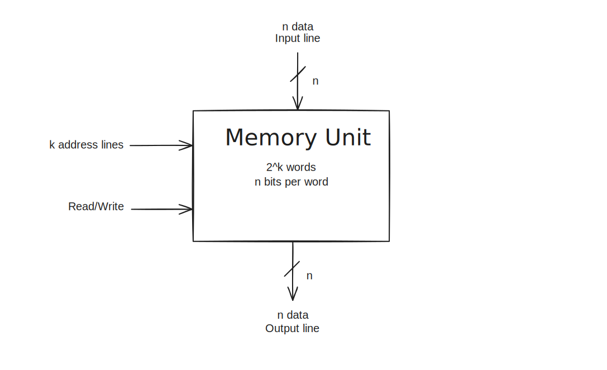
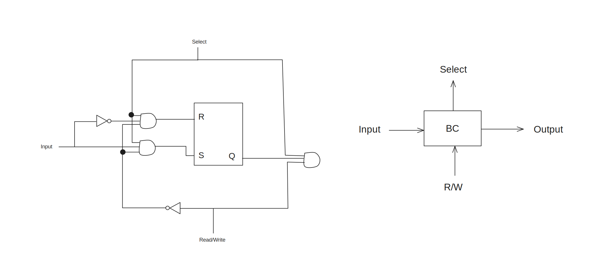

---
tags:
  - computer_architecture
  - memory
  - CS2100
title: Memory
---
> [!definition] Byte
> 8 bits

> [!definition] Word
> A unit of transfer between main memory and registers, usually size of register.

> [!note] Common sizes
> 1 KB = $2^{10}$ bytes
> 1 MB = $2^{20}$ bytes
> 1 GB = $2^{30}$ bytes
> 1 TB = $2^{40}$ bytes
> 

Desirable properties:
- fast access
- large capacity
- economical cost
- non-volatile

Memory unit stores binary information in groups of bits called words.

> [!note] Data
> Consists of $n$ lines, for $n-$bit words.

Data input lines provide information to be stored (written), and data output lines carry information out  (read).

> [!note] Address
> Consists of $k$ lines, specifying which word out of the $2^k$ available to be selected for reading or writing.

> [!definition] Control line
> Specify direction of transfer of data (Read/Write)

# Read/Write Operations

> [!note] `Write`
> Transfers address of desired word to address lines
> Transfers data bits to be stored in memory to the data input line
> Activates `Write` control line (set R/W to 0)

> [!note] `Read`
> Transfers address of desired word to address lines
> Activates `Read` control line (set R/W to 1)

| Memory Enable | Read/Write | Memory Operation        |
| ------------- | ---------- | ----------------------- |
| 0             | X          | None                    |
| 1             | 0          | Write to selected word  |
| 1             | 1          | Read from selected word |
# Memory Cell

RAM
- Static RAM
	- flip-flops
- Dynamic RAM
	- capacitor charges to represent data

> [!note] Difference
> Dynamic RAM is simpler in circuitry but need to be constantly refreshed.

