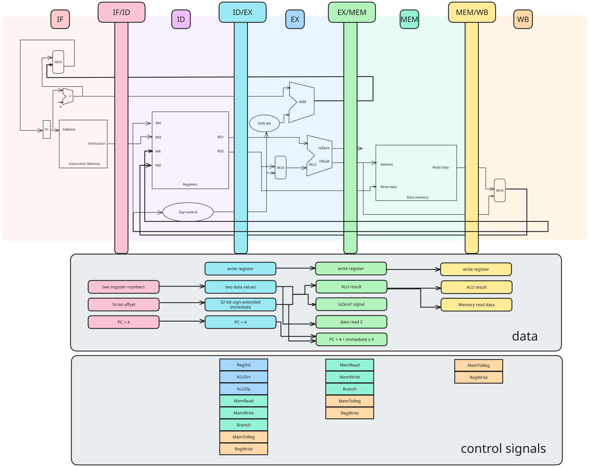
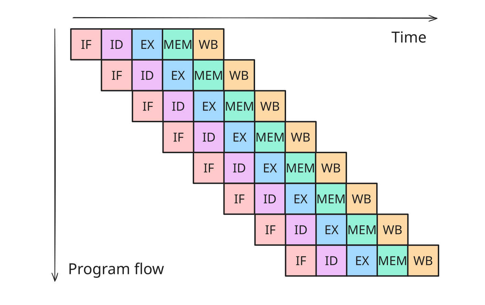
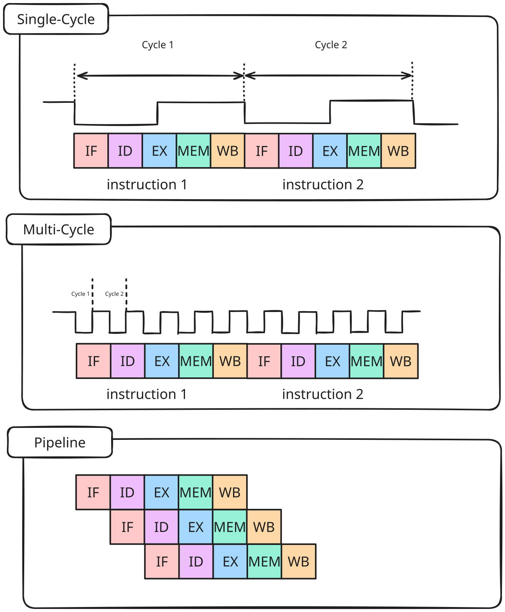
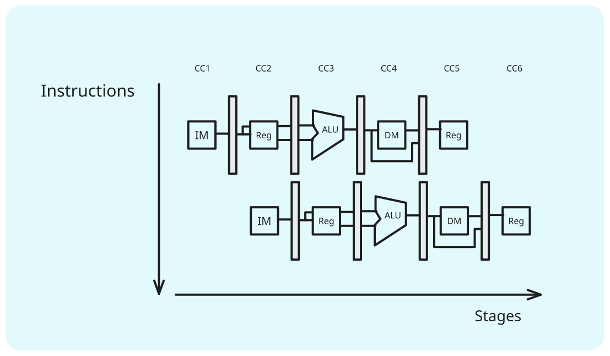
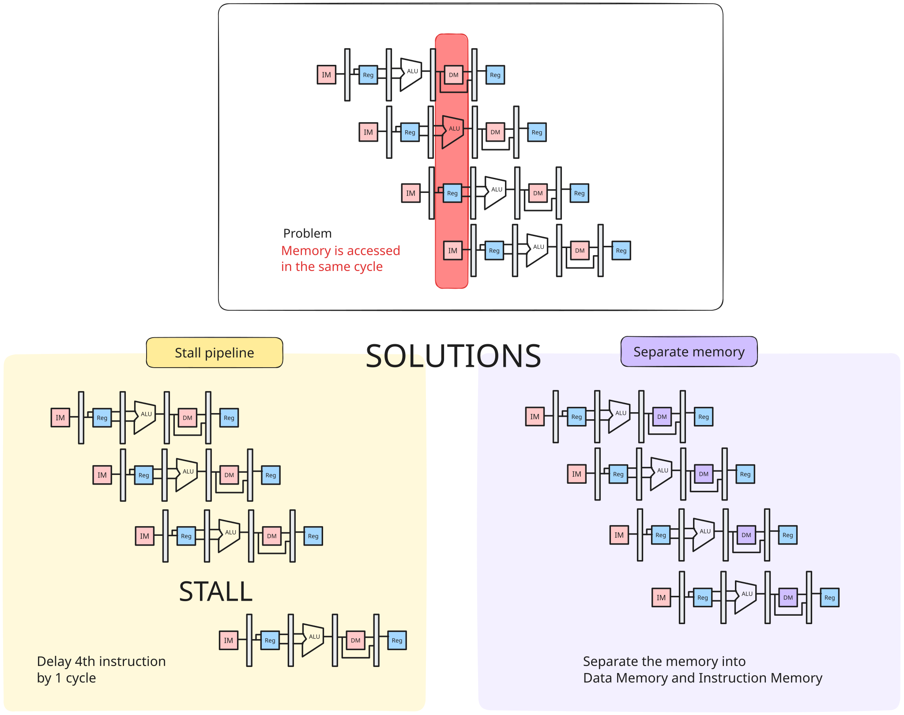
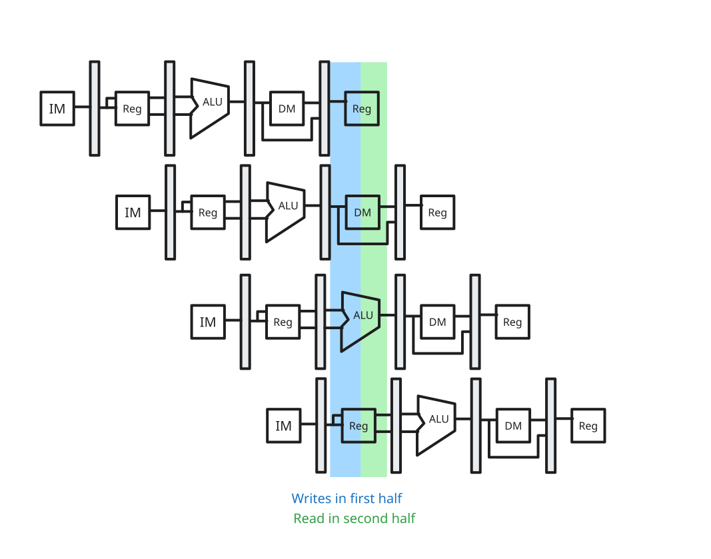
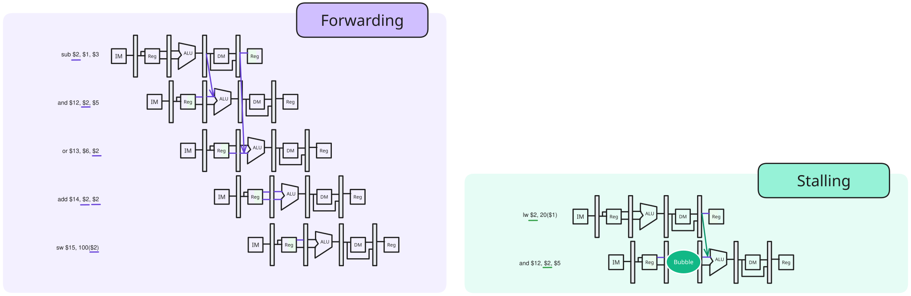
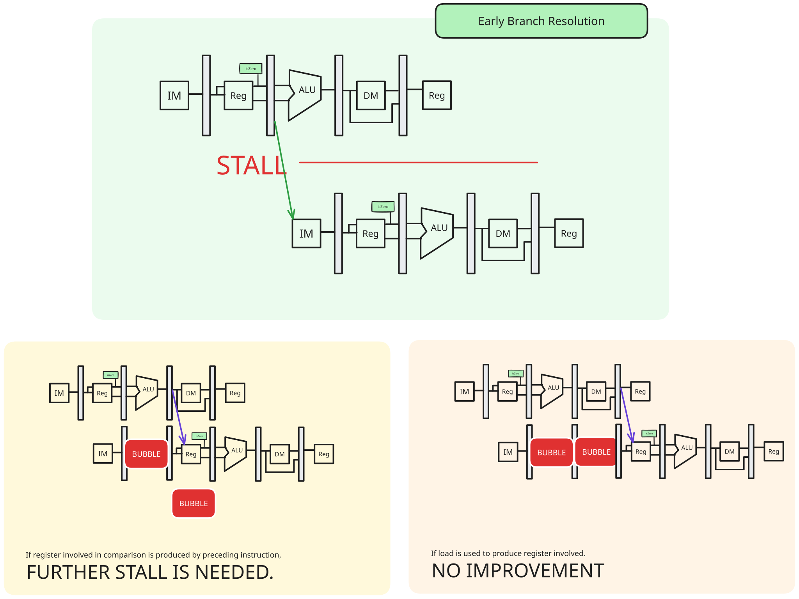
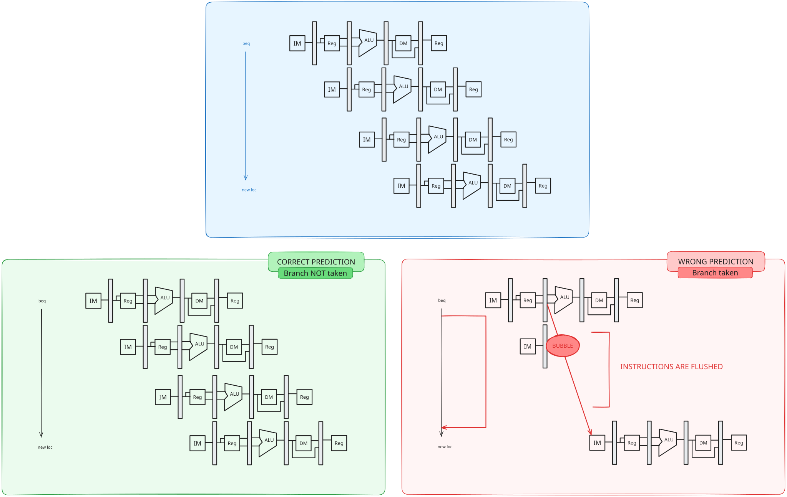

---
tags:
  - CS2100
  - memory
  - computer_architecture
  - "#MIPS"
---
> [!note] Motivation
> Pipelining allows for a higher speedup over pure sequential processing.

Pipelining doesn't help latency for a single task, but helps the **throughput** of the entire workload - by having multiple tasks operate simultaneously using different resources.

> [!warning] Possible delays:
> - Pipeline rate, limited by slowest pipeline stage
> - Stall for dependencies

# MIPS Pipeline Stages

1. `IF` Instruction Fetch
2. `ID` Instruction Decode and Register Read
3. `EX` Execute an operation, or calculate an address
4. `MEM` Access an operand in data memory
5. `WB` Write back the result into a register

(related to the [Datapath](../MIPS/datapath.md) stages)

Each execution stage will take 1 clock cycle.






> [!note] Implementation
> - One cycle per pipeline stage
> - Data required for each stage needs to be stored separately.

There are two types of data that needs to be stored:
- data used by subsequent instructions
	- stored in programmer-visible elements
		- `PC`
		- registers
		- memory
- data used by same instruction in later pipeline stages
	- stored in pipeline registers
		- `IF/ID`
		- `ID/EX`
		- `EX/MEM`
		- `MEM/WB`

## Stages

In the `ID` stage:
- `IF/ID` supplies:
	- register numbers for reading two registers
	- 16-bit offset to be sign-extended
	- `PC + 4`
- `ID/EX` receives:
	- data values read from register file
	- 32-bit immediate value
	- `PC + 4`
	- write register

Here, the signals are generated.

In the `EX` stage:
- `ID/EX` supplies:
	- data values read from register file
	- 32-bit immediate value
	- `PC + 4`
	- write register
	- signals
		- `RegDst`
		- `ALUSrc`
		- `ALUop`
		- `MemRead`
		- `MemWrite`
		- `Branch`
		- `MemToReg`
		- `RegWrite`
- `EX/MEM` receives:
	- `PC+4 + (IMM X 4)`
	- ALU result
	- `isZero?`
	- data read 2
	- write register
	- signals
		- `MemRead`
		- `MemWrite`
		- `Branch`
		- `MemToReg`
		- `RegWrite`

In the `WB` stage:
- `EX/MEM` supplies:
	- `PC+4 + (IMM X 4)`
	- ALU result
	- `isZero?`
	- data read 2
	- write register
	- signals
		- `MemRead`
		- `MemWrite`
		- `Branch`
		- `MemToReg`
		- `RegWrite`
- `MEM/WB` receives:
	- ALU result
	- memory read data
	- write register
	- signals
		- `MemToReg`
		- `RegWrite`


# Performance comparison



**Single-cycle processor**

Cycle time:
$$
CT_{seq} = max(\sum\limits^{N}_{k=1}T_{k})
$$
where $T_{k} =$ time for operation in stage $k$, $N =$ number of stages.

Execution time:
$$
Time_{seq} = I \times CT_{seq}
$$

> [!note] Since all the stages are in one single cycle, the time for operation is the maximum time of an instruction as a bottleneck.

**Multicycle processor**

Cycle time:
$$
CT_{multi} = max(T_{k})
$$
where $T_{k}$ is the time for operation in stage $k$.

> [!note] The cycle time is based on the stage with the most time taken for it.

Execution time:
$$
Time_{multi}=I \times Average CPI \times CT_{multi}
$$
> [!note] Average CPI needed because each instruction takes different number of cycles.

**Pipelining processor**

Cycle time:
$$
CT_{pipeline}=max(T_{k}) + T_{d}
$$
where $T_{k}$ is the time for operation in stage $k$, and $T_{d}$ refers to the overhead for pipelining.

> [!note] Since there is a pipeline register, there is overhead here.

Execution time:
$$
Time_{pipeline}=(I + N - 1) \times CT_{pipeline}
$$
where $(I + N - 1)$ refers to the cycles needed for $I$ instructions.

## Ideal speedup

> [!note] Assumptions for ideal case
> - every stage takes same amount of time
> - no pipeline overhead
> - $I > N$ (number of instructions significantly larger than number of stages)

$$
\begin{aligned}
Speedup_{pipeline} &= \frac{Time_{seq}}{Time_{pipeline}} \\
&= I \times \frac{\sum\limits^{N}_{k=1}T_{k}}{(I+N-1)\times(max(T_{k})+T_{d})} \\
&= \frac{I \times N \times T_{1}}{(I + N - 1) \times T_{1}} \\
&\approx \frac{I \times N \times T_{1}}{I \times T_{1}} \\
&= N
\end{aligned}
$$

> [!success] Pipeline processor can gain $N$ times speedup where $N$ is the number of pipeline stages.

# Hazards

> [!warning] Pipeline hazards
> Hazards that prevent next instruction from immediately following previous instruction

- Structural hazards
	- Simultaneous use of a hardware resource
- Data hazards
	- Data dependencies between instructions
- Control hazards
	- Change in program flow



## Structural Hazards

> [!note] If there is only one single memory module
> There might be a conflict if two instructions access memory in the same cycle.



> [!question] Conflict for registers?
> Registers are very fast memory, allowing for the cycle to be split into half, one for writing and one for reading.



## Instruction Dependencies

> [!note] Instruction Dependencies
> Instructions can have relationships that prevent pipeline execution.

> [!definition] Data dependency
> When different instructions access the same register

> [!definition] Control dependency
> An instruction `j` is control dependent on `i` if `i` controls whether or not `j` executes
> > [!example] `i` is generally a branch instruction

### `RAW`: Read-After-Write

> [!definition] `RAW`
> Occurs when a later instruction reads from destination reigster written by an earlier instruction
> (True data dependency)

```
i1: add $1, $2, $3
i2: sub $4, $1, $5
```

> [!definition] Stale result
> An old result.

If `i2` reads register `$1` before `i1` writes back, `i2` gets a stale result.

There are two possible solutions:
- Forwarding
	- Forward the result to any later instructions before reflecting it in register file and replace the data read from register file.
- Stalling
	- Useful when forwarding does not work (data is not even loaded yet).



### `WAR`: Write-After-Read

> [!info] Does not cause pipeline hazards.
> Only affects processor only when instructions are executed out of program order.
### `WAW`: Write-After-Write

> [!info] Does not cause pipeline hazards
> Only affects processor only when instructions are executed out of program order.

## Control Dependency

> [!question] Why can't we just stall the pipeline?
> Introduces large clock cycle delay - branching being common, a 3-cycle stall penalty is too heavy.

To minimise the control hazard penalty:
- Early branch resolution
	- Move branch decision calculation to earlier pipeline stage
- Branch prediction
	- Guess outcome before produced
- Delayed branching
	- Do something useful while waiting for the outcome

### Early branch resolution

> [!note] Make the decision in `ID` stage instead of `MEM`.
> Move register comparison to ID stage.



> [!warning] Problems
> If instruction producing value into comparison register is before, extra clock cycles are needed
> 	- 1 more if `load` instruction
> 		- results in no performance improvement.

## Branch Prediction

> [!remark] There are other branch prediction schemes. Only one is covered here.

> [!note] Simple prediction: All braNches are assumed to not be taken.

After outcome of branch:
- Not taken
	- No pipeline stall
- Taken
	- Wrong instructions in pipeline
	- Successor instructions are flushed



# Delayed Branch

> [!note] Motivation
> 
> Branch outcome takes $X$ cycles to be known. Thus, these cycles can be used to execute non-control dependent instructions into the $X$ slot following a branch. These instructions are executed regardless of the branch outcome.

```
or $8, $9, $10
add $1, $2, $3
sub $4, $5, $6
beq $1, $4, Exit
xor $10, $1, $11

Exit:
```

Since the `or` instruction does not affect the remaining instructions, and gets executed regardless, it can be moved:

```
add $1, $2, $3
sub $4, $5, $6
beq $1, $4, Exit
or $8, $9, $10
xor $10, $1, $11

Exit:
```

> [!note] Possible scenarios
> 
> > [!success] Best case scenario
> > Instruction preceding branch which can be moved into delayed slot
> 
> > [!failure] Worst case scenario
> > Instruction cannot be found.
> > - Add `nop` instruction

# Multiple Issue Processors

> [!remark] This is optional reading.

> [!definition] Multiple issue processors
> Multiple instructions in every pipeline stage

> [!definition] Static multiple issue
> EPIC or VLIW
> 
> - Compiler specifies the set of instructions that execute together in given clock cycle.
> - Simple hardware, complex compiler.

> [!definition] Dynamic multiple issue
> Superscalar processor - dominant design of modern processes
> 
> - Hardware decides which instructions to execute together.
> - Complex hardware, simpler compiler

> [!example] 2-wide superscalar pipeline
> Fetch and dispatch two instructions at a time, allowing for up to 2 instructions to complete per cycle.

