> [!remark] CS2100 Notes
> for final, AY24-25 Sem 1
> 
> _zaidan sani_

# Quick MIPS Shortcuts

_(calculator needs to be able to handle 32-bit values)_

**Calculating Jump Instructions Encoding** 

Given an address 0xABCDEFGH (where A...H are hexadecimal digits):
- `jump`: 0x08000000 + BCDEFGH/4 in `HEX` mode

**Calculating R Format Encoding**

- `SLL/SRL` (`sll $x, $y, z`)
	- get registers `rt $y`, `rd $x`
	- funct = `0` (SLL) or `2` (SRL)
	- $rt \times 2^{16} + rd \times 2^{11} + z \times 2^{6} + funct$
	- convert to `HEX`
- non-shift (`add $x, $y, $z`)
	- get registers `rs $y`, `rt $z`, `rt $x`
	- funct (look up in datasheet)
	- $rs \times 2^{21} + rt \times 2^{16} + rd \times 2^{11} + funct$
	- convert to `HEX`

**Calculating I-Format Encoding**

- non-branch (`addi $x, $y, z`)
	- get registers `rs = $y`, `rt = $x`
	- $imm$ = value of $z$ in two's complement
		- enter value in decimal, convert to hexadecimal and remove first 4 digits
	- $opc \times 2^{26} + rs \times 2^{21} + rt \times 2^{16} + imm$
	- convert to `HEX`
- branch (`beq $x, $y, z`)
	- get registers `rs = $x`, `rt = $y`
	- $imm$ = value of $z$ in two's complement
		- enter value in decimal, convert to hexadecimal and remove first 4 digits
	- $opc \times 2^{26} + rs \times 2^{21} + rt \times 2^{16} + imm$
	- convert to `HEX`

# Control

| Opcode   | ALUop | Instruction Operation | funct    | ALU action       | ALU control |
| -------- | ----- | --------------------- | -------- | ---------------- | ----------- |
| `lw`     | `00`  | load word             | `xxxxxx` | add              | `0010`      |
| `sw`     | `00`  | store word            | `xxxxxx` | add              | `0010`      |
| `beq`    | `01`  | branch equal          | `xxxxxx` | sub              | `0110`      |
| `R-type` | `10`  | add                   | `100000` | add              | `0010`      |
| `R-type` | `10`  | sub                   | `100010` | sub              | `0110`      |
| `R-type` | `10`  | and                   | `100100` | and              | `0000`      |
| `R-type` | `10`  | or                    | `100101` | or               | `0001`      |
| `R-type` | `10`  | set on less than      | `101010` | set on less than | `0111`      |

| Control | Signal     | `R-format` | `lw` | `sw` | `beq` |
| ------- | ---------- | ---------- | ---- | ---- | ----- |
| 0       | `RegDst`   | 1          | 0    | 0    | 0     |
| 1       | `ALUSrc`   | 0          | 1    | 1    | 0     |
| 2       | `MemToReg` | 0          | 1    | 0    | 0     |
| 3       | `RegWrite` | 1          | 1    | 0    | 0     |
| 4       | `MemRead`  | 0          | 1    | 0    | 0     |
| 5       | `MemWrite` | 0          | 0    | 1    | 0     |
| 6       | `Branch`   | 0          | 0    | 0    | 1     |
| 7       | `ALUop1`   | 1          | 0    | 0    | 0     |
| 8       | `ALUop0`   | 0          | 0    | 0    | 1     |

# Boolean Algebra

## Precedence of Operators

1. Parenthesis
2. `NOT`
3. `AND`
4. `OR`

## Laws of Boolean Algebra

> [!theorem] Identity laws
> $$
> \begin{aligned}
> A + 0  = 0 + A & = A \\
> A \cdot 1  = 1 \cdot A & = A \\
> \end{aligned}
> $$

> [!theorem] Inverse/complement laws
> $$
> \begin{aligned}
> A + A'  = A' + A & = 1 \\
> A \cdot A'  = A' \cdot A & = 0 \\
> \end{aligned}
> $$

> [!theorem] Commutative laws
> $$
> \begin{aligned}
> A + B & =  B + A\\
> A \cdot B  &= B \cdot A \\
> \end{aligned}
> $$

> [!theorem] Associative laws
> $$
> \begin{aligned}
> A + (B + C) & =  (A + B) + C\\
> A \cdot (B \cdot C)  &= (A \cdot B) \cdot C \\
> \end{aligned}
> $$

> [!theorem] Distributive laws
> $$
> \begin{aligned}
> A \cdot (B + C) & =  (A \cdot B) + (A \cdot C)\\
> A + (B \cdot C)  & = (A + B) \cdot (A + C)\\
> \end{aligned}
> $$

> [!important] Duality
> If the `AND/OR` operations and identity elements `0/1` in a Boolean equation are interchanged, the equation remains valid.
> 
> > [!example] $(x + y + z)' = x' \cdot y' \cdot z' \text{ is valid } \implies (x \cdot y \cdot z)' = x' + y'+ z' \text{ is valid }$

> [!theorem] Idempotency
> $$
> \begin{aligned}
> X + X & = X\\
> X \cdot X &= X\\
> \end{aligned}
> $$

> [!theorem] One element/zero element
> $$
> \begin{aligned}
> X + 1 = 1 + X & = X\\
> X \cdot 0 = 0 \cdot X &= X\\
> \end{aligned}
> $$

> [!theorem] Involution
> $$
> (X')' = X
> $$

> [!theorem] Absorption
> $$
> \begin{aligned}
> X + X \cdot Y &= X \\
> X \cdot (X + Y) &= X\\
> \end{aligned}
> $$

> [!theorem] Absorption
> $$
> \begin{aligned}
> X + X' \cdot Y &= X + Y \\
> X \cdot (X' + Y) &= X \cdot Y \\
> \end{aligned}
> $$

> [!theorem] DeMorgan's
> $$
> \begin{aligned}
> (X + Y)' & = X' \cdot Y' \\
> (X \cdot Y)' & = X' + Y'
> \end{aligned}
> $$

> [!theorem] Consensus
> $$
> \begin{aligned}
> X \cdot Y + X' \cdot Z + Y \cdot Z  & = X \cdot Y + X' \cdot Z \\
> (X \cdot Y) + (X' \cdot Z) + (Y \cdot Z)  & = (X + Y) + (X' + Z)
> \end{aligned}
> $$

> [!note] Complement
> Obtained by interchanging 1 with 0 in the function's output values

# Logic Circuits

![[../Logic/media/Logic Circuit 2024-10-02 01.45.16.excalidraw.svg]]

# Simplification

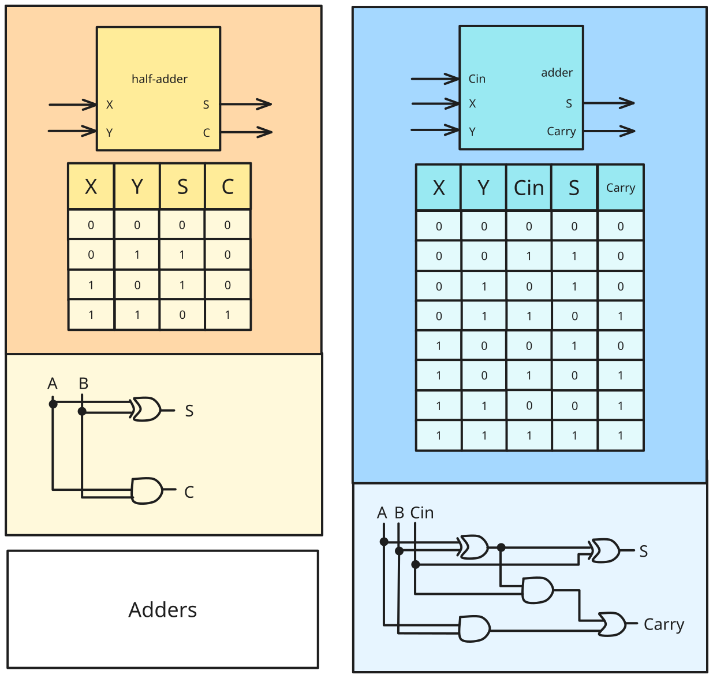

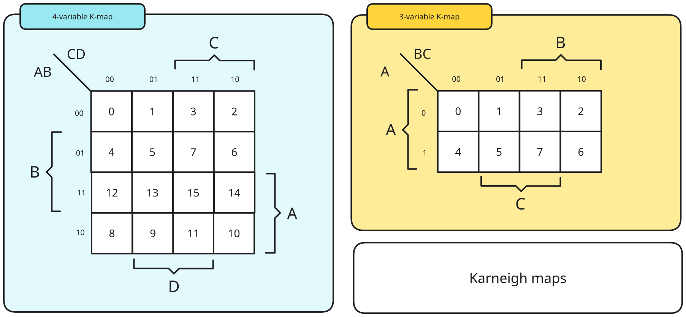

# MSI Components
## Decoder

> [!note] Decoder
> Input: a code (from $n$ input lines)
> Output: $2^{n}$ output lines.
> 
> `n-to-m`, `n:m`, `n x m` $(m \leq 2^{n})$

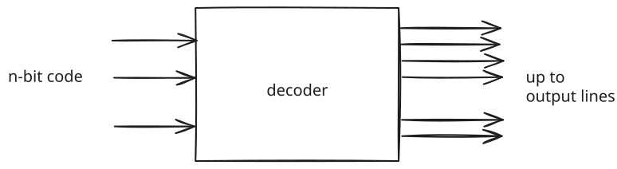
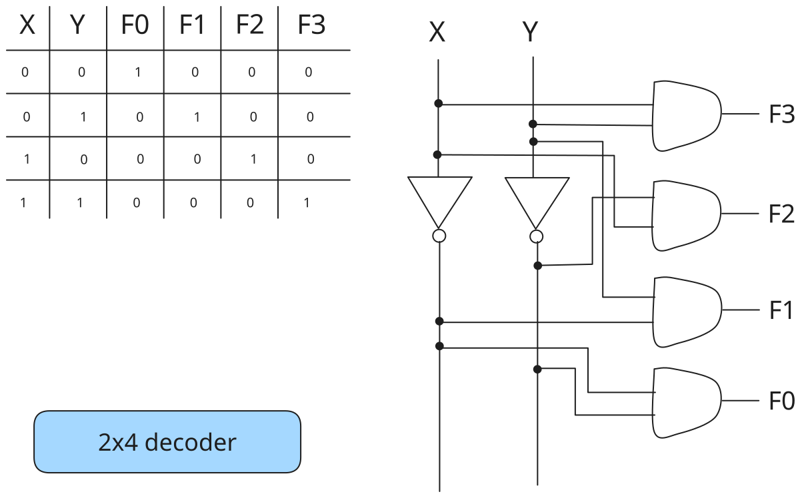

Each output of a $n \times m$ decoder is a minterm of a $n-$ variable function.
### Enable

Decoders often come with an enable control signal so that device is only activated when $E = 1$.

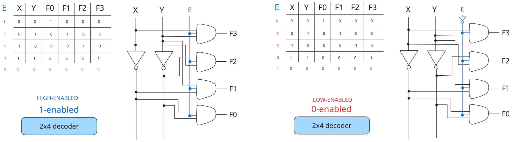

### Constructing Larger Decoders

Larger decoders can be constructed from smaller ones.

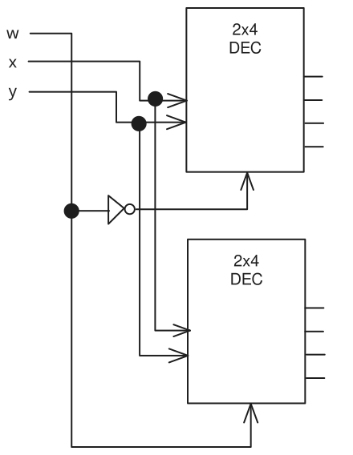

## Encoding

> [!note] Encoder
> Input: $2^{n}$ input lines
> Output: $n$ bits of code
> 

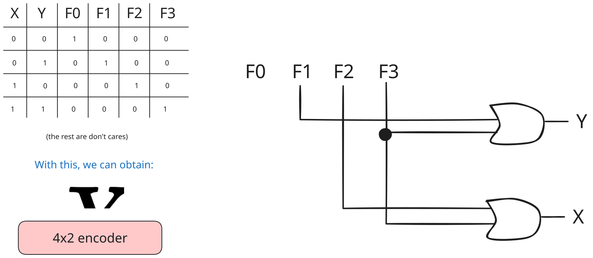

At any one time, only one input line of an encoder has a value of `1` (high), the rest are `0` (low).

### Priority Encoders

A priority encoder is one with priority
- if two or more inputs, inputs with highest priority takes precedence:

| $D_0$ | $D_1$ | $D_2$ | $D_3$ | $f$   | $g$   | $V$   |
| --- | --- | --- | --- | --- | --- | --- |
| $0$   | $0$   | $0$   | $0$   | $X$   | $X$   | $0$   |
| $1$   | $0$   | $0$   | $0$   | $0$   | $0$   | $1$   |
| $X$   | $1$   | $0$   | $0$   | $0$   | $1$   | $1$   |
| $X$   | $X$   | $1$   | $0$   | $1$   | $0$   | $1$   |
| $X$   | $X$   | $X$   | $1$   | $1$   | $1$   | $1$   |
## Multiplexers

Helps share a single communication line among a number of devices. Only one source and one destination can use the communication line.

### Demultiplexer

> [!definition] Demultiplexer
> Directs data from input to one selected output line.
> 
> Input: Input line, set of selection lines
> Output: Data from input to one selected output line

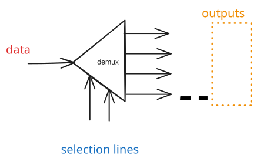

Demultiplexer circuit is identical to a decoder with enable.

### Multiplexer

> [!definition] Multiplexer
> 
> (Data selector)
> 
> Input: A number of input lines, a number of selection lines
> Output: Data to one output line - sum of (product of data lines and selection lines)

A $2^n$-to-$1$-line multiplexer - $2^n:1$ MUX is made from an $n:2^n$ decoder by adding to it $2^n$ input lines, one to each `AND` gate.
# Sequential Logic

| $S$ | $R$ | $CLK$      | $Q(t+1)$ |                       |
| --- | --- | ---------- | -------- | --------------------- |
| $0$ | $0$ | $X$        | $Q(t)$   | No change             |
| $0$ | $1$ | $\uparrow$ | $0$      | Reset                 |
| $1$ | $0$ | $\uparrow$ | $1$      | Set                   |
| $1$ | $1$ | $\uparrow$ | $?$      | Invalid/Unpredictable |

| $D$ | $CLK$      | $Q(t+1)$ |       |
| --- | ---------- | -------- | ----- |
| $1$ | $\uparrow$ | $1$      | Set   |
| $0$ | $\uparrow$ | $0$      | Reset |

| $J$ | $K$ | $CLK$      | $Q(t+1)$ |           |
| --- | --- | ---------- | -------- | --------- |
| $0$ | $0$ | $\uparrow$ | $Q(t)$   | No change |
| $0$ | $1$ | $\uparrow$ | $0$      | Reset     |
| $1$ | $0$ | $\uparrow$ | $1$      | Set       |
| $1$ | $1$ | $\uparrow$ | $Q(t)'$  | Toggle    |

| $T$ | $CLK$      | $Q(t+1)$ |           |
| --- | ---------- | -------- | --------- |
| $0$ | $\uparrow$ | $Q(t)$   | No change |
| $1$ | $\uparrow$ | $Q(t)'$  | Toggle    |

---

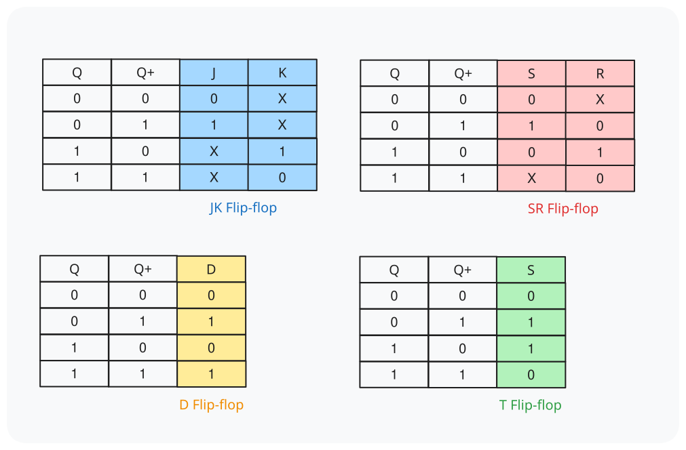

> [!definition] Sink state
> A state that never moved out of itself to other states

# Pipelining

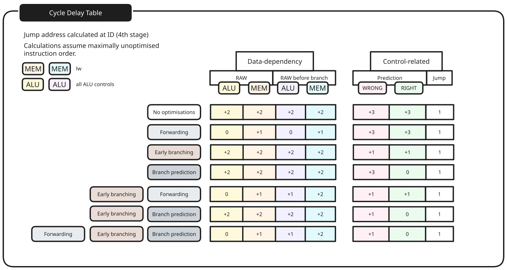

## With forwarding

### Non-load

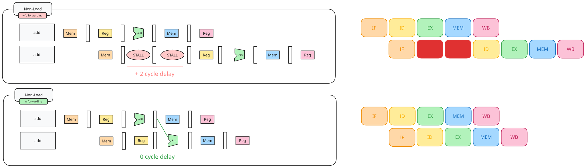

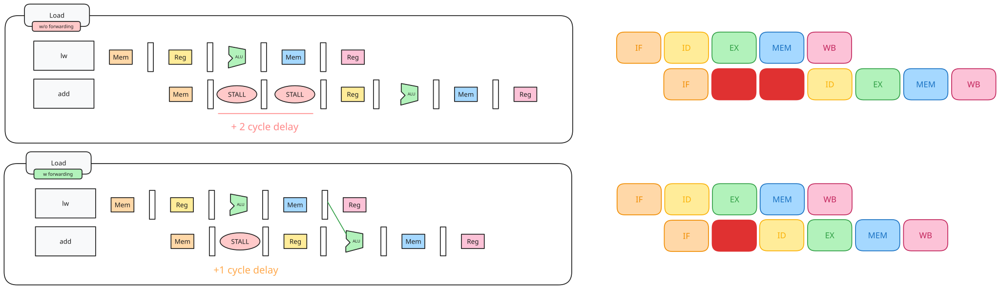

### Before branching

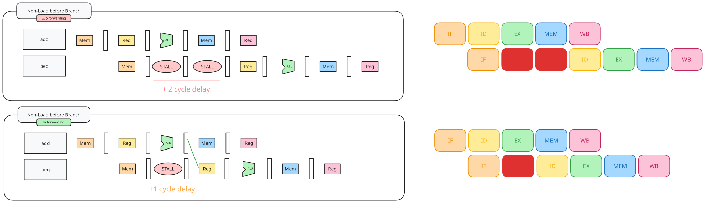

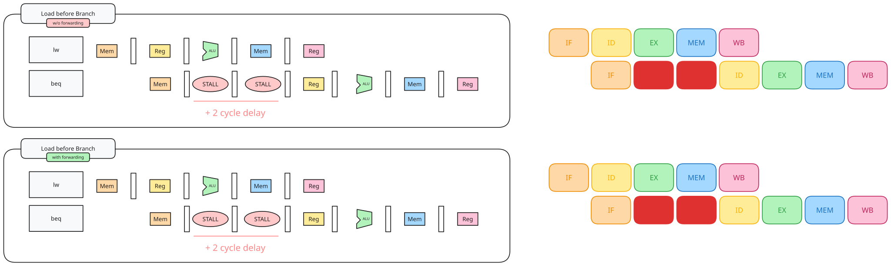

## Early branching

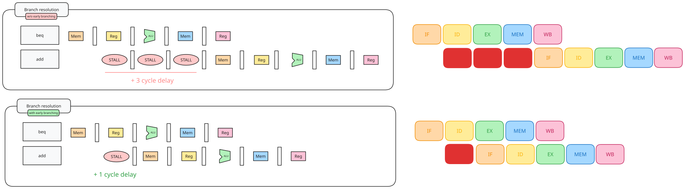

### With branch prediction

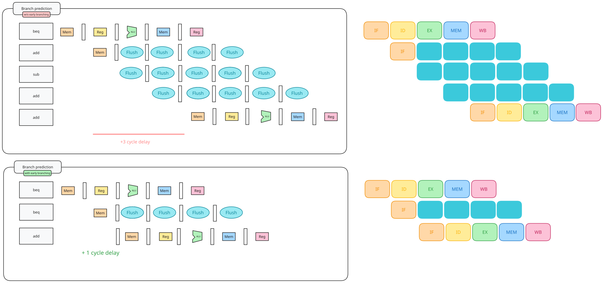

# Cache

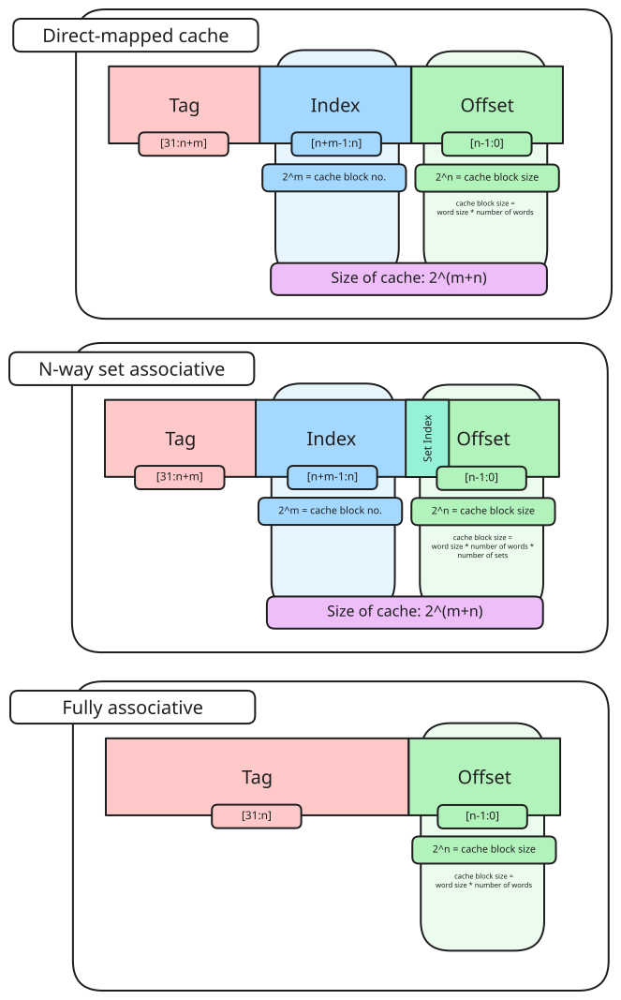

## Cache Performance

> [!definition] Principle of locality
> Program accesses only a small portion of the memory address space within a small time interval
> 
> > [!definition] Temporal locality
> > If an item is referenced, it will tend to be referenced again soon
> 
> > [!definition] Spatial locality
> > If an item is referenced, nearby items will tend to be referenced soon.

1. Cold/compulsory miss remains the same irrespective of cache size/associativity
2. Conflict miss goes down with increasing associativity on the same cache size
3. Conflict miss is 0 for FA caches
4. For same cache size, capacity miss remains the same irrespective of associativity
5. Capacity miss decreases with increasing cache size

| Cache Misses    |                                                              |
| --------------- | ------------------------------------------------------------ |
| Cold/compulsory | same irrespective of cache size/associativity                |
| Conflict miss   | for same cache size, decreases with increasing associativity |
| Capacity miss   | decreases with increasing cache size                         |

