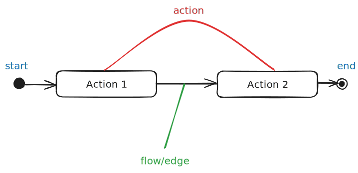
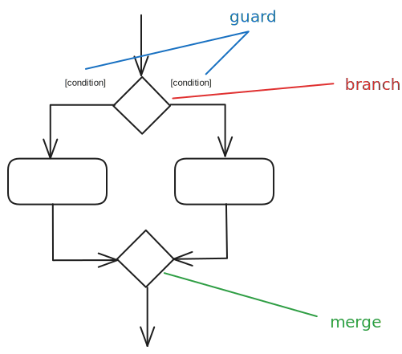
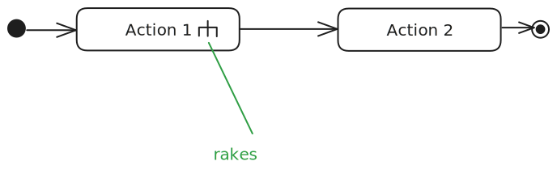
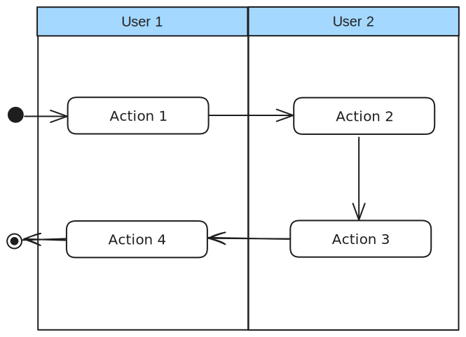

> [!definition] Activity diagrams
> UML diagrams to model workflows.

An activity diagram captures an activity through the actions and control flows that make up the activity.

---

Alternative paths are shown through branch nodes and merge nodes.

Acceptable simplifications:
- Omitting merge node
- Multiple arrows can start from same corner
- Omitting `else` condition

---

To model parallel paths, fork nodes indicate start of concurrent flows of control, and join nodes indicate the end of parallel paths.

---

To indicate a part of the activity is given in a separate diagram, use the rake notation.

Partitions can also be used to indicate who is doing the specific activity.

