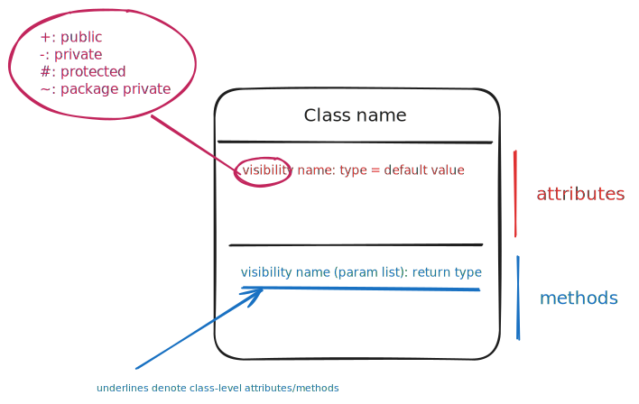
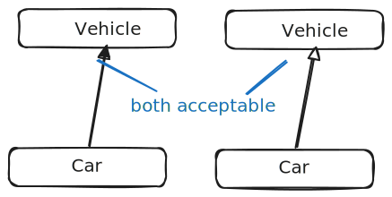

---
tags:
  - software_engineering
title: Class and Object Modelling
---
- # Class Diagrams
### Classes

> [!remark] No default visibility in UML.

### Associations

> [!definition] Association
> Represents connections between objects.

![[media/associations.svg]]

---

Other decorations can be used, such as **labels**, which indicate the meaning of the association.

![[media/associations 1.svg]]

---

Similarly, a **role** can be used. Generally, the variable names will match closely with the association roles. 

![[media/associations 1 1.svg]]

They also help with multiple associations.
![[media/associations 1 1 1.svg]]

---

> [!note] Navigability
> Note that while two classes can be linked, the two objects are not necessarily referenced to each other. 

![[media/annotations 3.svg]]

> [!remark] Two unidirectional associations do not make up a bidirectional association.
> For it to be bidirectional, it should be a "cyclical" relationship (the entity points to the other entity which points back to the **exact** same entity).

---

> [!note] Multiplicity
> Multiplicity dictates the amount of objects in each association.

The notation is as follows:
$$
n..m
$$
where the number of linked objects must be within $n$ to $m$ inclusive.

> [!example] Common examples
> - `0..1` can be linked to 0 or 1 object (optional)  (by allowing an object to be `null`)
> - `1` must be linked to 1 object (compulsory)
> - `*` can be linked to any amount of objects
> - `1..*` must be linked to at least 1 object

![[media/association multiplicity.svg]]

# Object Diagrams

An object diagram is used to complement class diagrams. 

![[media/object.svg]]

Associations are shown with a line.

![[media/object 1.svg]]
> [!remark] An object can be shown as **either** its class, or its super-class (but NOT both).

> [!remark] No multiplicities as a connection is always to only 1 object.
## Notes

UML notes can be used to augment diagrams with more information.

![[media/notes.svg]]

## Constraints

> [!remark] This section was marked as optional.

A summary:

### Modelling inheritance

Inheritance is modelled with either a filled in/empty triangle arrow head.
### Modelling composition

![[media/constraints 1.svg]]

Composition can be modelled with a filled in diamond head.

### Modelling aggregation

Aggregation can be modelled with a empty diamond head.

> [!note] Since the aggregation and composition are similar symbols are similar, it is recommended not to use the aggregation symbol for clarity.

### Modelling dependencies

> [!note] Difference between a dependency and association
> 
> A dependency is a need for one class to depend on another without having a direct association in the same direction.
> 
> > [!example] 
> > An `Item` may require a `Currency` object to calculate its price in a specific currency, but it is a transient interaction with no long-term relationship between the objects.

### Modelling enumerations

Enumerations are displayed similar to a class, but with a `<<enumeration>>` header, and the area below it is the values of enumeration.

![[media/constraints 1 1 1 1.svg]]

### Modelling interfaces

![[media/constraints 1 1 1 1 1.svg]]

The association is marked with a dotted line and an arrowhead similar to the inheritance.
### Modelling abstract classes

An abstract class can be shown by adding a `{abstract}` header, or italicising the `abstract`  methods.

## Association Classes

Association classes are often used to store information about an association between two classes.

![[media/association classes.svg]]
