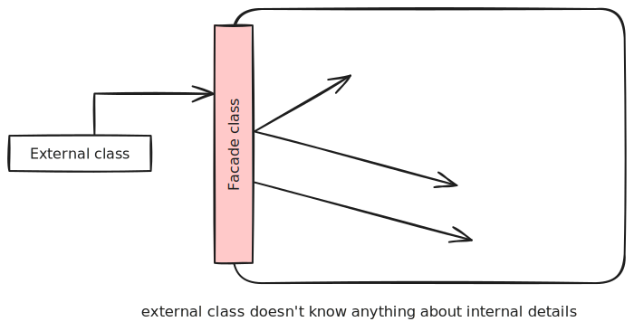

> [!definition] Design pattern
> Elegant reusable solution to a commonly recurring problem within a given context in software design.

> [!example] UI update
> How do we initiate UI update when data changes without coupling backend and UI.

# Format

- Context
	- Situation/scenario where design problem is encountered
- Problem
	- Main difficulty to be resolved
- Solution
	- Core of the solution
- Anti-patterns (optional)
	- Commonly used solutions (usually incorrect/inferior)
- Consequences (optional)
	- Identifying pros and cons
- Other useful information (optional)
	- Code examples, known uses

# Singleton Pattern

> [!note] Context
> Certain classes should have no more than just one instance

> [!note] Problem
> A normal class can be instantiated multiple times by invoking constructor

> [!note] Solution
> Make constructor `private`, to disallow instantiating at will.
> Provide a `public` class-level method to access the singleton.

Implementation:
```java
class Logic {
	private static Logic singleton = null;
	
	private Logic() {
		...
	}

	public static Logic getInstance() {
		if (singleton == null) {
			singleton = new Logic();
		}
		return singleton;
	}
}
```

> [!note] Consequences
> 
> > [!success] Pros
> > - easy to apply
> > - effective in achieving goal with not much work
> > - provides easy way to access singleton object from anywhere in the codebase
> 
> > [!failure] Cons
> > - singleton objects acts like global variable, increases coupling
> > - hard to replace singleton objects with stubs in testing
> > - singleton objects carry data from one test to another

# Facade

> [!note] Context
> Components need to access functionality deep inside other components

> [!note] Problem
> Access should be allowed without exposing its internal details.

> [!note] Solution
> Include Facade class that sits between the component internals, and users of the component, such that all access happens through the class.


# Command Pattern

> [!note] Context
> A system is required to execute a number of commands, where each do a different task.

> [!note] Problem
> It is preferable that some part of the code executes these commands without having to know each command type.

> [!note] Solution
> Essential element is to have a general `<<Command>>` object that can be passed around, stored, executed, without knowing the type of command (via polymorphism).

# Abstraction Occurrence Pattern


> [!note] Context
> There is a group of similar entities that appear to be occurences of the same thing, with a lot of common information, but differ in significant ways.

> [!note] Problem
> Representing objects as a single class would be problematic because it results in duplication of data, which can lead to inconsistencies.

> [!note] Solution
> Let a copy of an entity be represented by two objects instead of one, with common information in one class, and unique information in another.

> [!note] Anti-pattern
> Segregate common and unique information into a class hierarchy, and hard-codes common data in the class. Problematic as if there is an addition of new data, it will have to update the source code.

