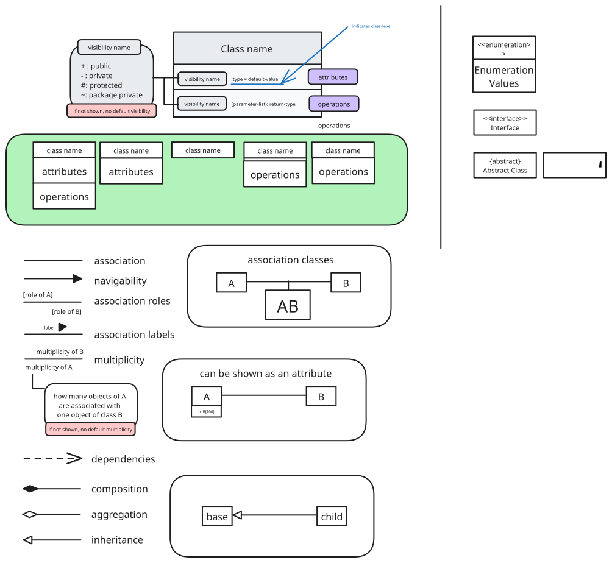
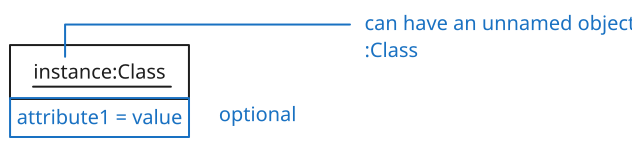
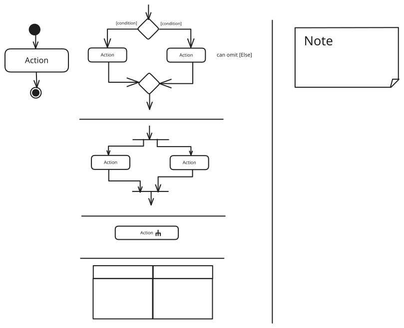

adapted from @woojiahao

---

```
d42a83e331
```
# Checklist

- [ ] Check manual testing
- [ ] Test each command based on allowable inputs in user guide
- [ ] Test command sequences


Template:
```
**Bug Description**

**Steps to Reproduce**

**Expected Behavior**

**Screenshots**

**Additional Context**
```
# Bugs

> [!definition] Functionality bugs
> - Behaviour differs from User Guide
> - Legitimate user behaviour is not handled
> 	- Incorrect commands
> 	- Extra parameters
> - Behaviour is not specified and differs from normal expectations

- Problems caused by extreme user behaviours
- Problems caused by very long input value
- Use of symbols in input values
- Mismatch between the UG and the feature
- Issues with output shown in terminal
- Handling manual edits to the data file

> [!definition] Feature flaws
> - Feature does not solve stated problem of intended user
> - Hard to test features
> - Features don't fit well
> - Features not optimised enough for fast-typists/target users
> - Violations of given project constraints

- Bugs related to the duplicate detection
- Overzealous input validation
- Specificity of error message
- Unnecessarily complicated (or-hard-to-type) command formats
- Case sensitivity
- Feature less useful than it can be

> [!definition] UG Bugs
> - Use of visuals
> 	- Not enough
> 	- Not well integrated
> 	- Unnecessarily repetitive
> - Use of examples
> 	- Not enough/too many examples
> - Explanations
> 	- Target user for product and/or value proposition is not specified clearly
> 	- Explanation is too brief/unnecessarily long
> 	- Information to hard to understand
> - Neatness/correctness
> 	- Looks messy
> 	- Not well-formatted
> 	- Broken links
> 	- Hard to read
> 	- Unnecessary repetitions

> [!definition] DG Bugs
> - Architecture
> 	- Unintuitive symbols
> 	- Indiscriminate use of double-headed arrows
> 	- Architecture-level diagrams contain lower-level details
> 	- Descriptions are not sufficiently high level
> - UML diagrams
> 	- Notation incorrect/non-compliant
> 	- Some other type of diagram used
> 	- Not suitable
> 	- Complicated
> - Code snippets
> 	- Excessive use of code
> - Problems in User Stories
> 	- Incorrect format
> 	- Parts not present
> 	- Do not match
> 	- Missing
> - Problems in Use Cases
> 	- Missing
> 	- Formatting and notation
> 	- Incorrect steps
> 	- Unnecessary UI
> 	- Missing steps
> 	- Missing extensions
> - Problems in NFRs
> 	- Not NFR
> 	- Not scope
> 	- Not reasonably achievable
> 	- Missing
> - Glossary
> 	- Unnecessary terms
> 	- Important terms missing

- Extra white space
- Broken/incorrect links
- Hinder the reader
- UML notation variations
- UML notation errors
- Details missing from diagram
- Nitty-gritty
- Minor typos
- Minor grammar
- Missing requirements
- Unfulfilled NFRs
- Details too small
- Tester misunderstanding
- Undocumented features
## Labels

> [!important] When in doubt, choose lower severity.

| Severity           | Description                                                                                       |
| ------------------ | ------------------------------------------------------------------------------------------------- |
| `severity.veryLow` | Flaw is cosmetic, does not affect usage.                                                          |
| `severity.Low`     | Flaw unlikely to affect normal operations of the product. Causes minor inconvenience only.        |
| `severity.Medium`  | Flaw causes occasional inconvenience, but they can still use the product                          |
| `severity.High`    | Flaw affects most users, and causes major problems. Makes product almost unusable for most users. |

| Type                    | Description                                                                                            |
| ----------------------- | ------------------------------------------------------------------------------------------------------ |
| `type.FunctionalityBug` | Functionality does not work as expected                                                                |
| `type.FeatureFlaw`      | Functionality missing from a feature delivered in a way feature becomes less useful. (Design problems) |
| `type.DocumentationBug` | Flaw in documentation                                                                                  |
## Reporting

- descriptive title
- enough details
	- steps to reproduce, expected, actual, and screenshots
- proper labels (severity/type)
- non-confrontational
- points out problematic behaviour

# Things to look out for

## UI

- Overflow
- Window resizing/scaling
- Real-time changes in UI
## Validation

- Date formatting
- Name formatting
- Special characters, whitespaces
- Integer overflow
- Logical use per context
## Diagrams






# Inputs

## General

- Strings
	- `""`
	- >9999 length
	- Exact minimum length
		- $\pm 1$
	- Exact maximum length
		- $\pm 1$
	- Invalid characters
	- Non-ASCII
	- Emojis
- Integers
	- $\pm$ 2147483647 (INT_MAX/MIN)
	- Exactly minimum/maximum
		- $\pm 1$
	- Negative numbers
	- Zero
	- Overflows
- Doubles
	- Raw string: 4.9E-324 (DOUBLE_MIN)
	- Raw string: 1.7976931348623157E308 (DOUBLE_MAX)
	- INT_MAX + 1
	- INT_MAX * INT_MAX < DOUBLE_MAX
	- LONG_MAX * LONG_MAX* < DOUBLE_MAX
	- 0
	- Negative
- Longs
	- $\pm$ 9223372036754775807
- Float
	- Raw string: 1.4E-45(MIN)
	- 3.4028235E38(MAX)
	- INT_MAX * INT_MAX < FLOAT_MAX
	- LONG_MAX * LONG_MAX < FLOAT_MAX
- Prefix
	- Empty prefix `/`
	- Prefix with different type
	- Invalid prefix
	- Extra prefixes
	- Index errors
	- Using different delimiters
	- Different ordering
	- Duplicate prefixes
	- Missing prefixes
- File storage
	- Verify save
	- Destroy storage and see how it recovers
	- Manually adding entries
	- Close app immediately
	- Change file name
	- Delete file while app is running
- UI charts
	- Blank data handling
	- Handling too much data
	- Delete data while UI charts active
	- Changing while UI charts are active
- Help window

## Limit-testing


Really large number: 
```
9999999999999999999999999999999999999999999999999999999999999999999999999 999999999999999999999999999
```

200 length string: 
```
aaaaaaaaaaaaaaaaaaaaaaaaaaaaaaaaaaaaaaaaaaaaaaaaaaaaaaaaaaaaaaaaaaaaaaaaa aaaaaaaaaaaaaaaaaaaaaaaaaaaaaaaaaaaaaaaaaaaaaaaaaaaaaaaaaaaaaaaaaaaaaaaaa aaaaaaaaaaaaaaaaaaaaaaaaaaaaaaaaaaaaaaaaaaaaaaaaaaaaaa
```


500 length string: 
```
aaaaaaaaaaaaaaaaaaaaaaaaaaaaaaaaaaaaaaaaaaaaaaaaaaaaaaaaaaaaaaaaaaaaaaaaa aaaaaaaaaaaaaaaaaaaaaaaaaaaaaaaaaaaaaaaaaaaaaaaaaaaaaaaaaaaaaaaaaaaaaaaaa aaaaaaaaaaaaaaaaaaaaaaaaaaaaaaaaaaaaaaaaaaaaaaaaaaaaaaaaaaaaaaaaaaaaaaaaa aaaaaaaaaaaaaaaaaaaaaaaaaaaaaaaaaaaaaaaaaaaaaaaaaaaaaaaaaaaaaaaaaaaaaaaaa aaaaaaaaaaaaaaaaaaaaaaaaaaaaaaaaaaaaaaaaaaaaaaaaaaaaaaaaaaaaaaaaaaaaaaaaa aaaaaaaaaaaaaaaaaaaaaaaaaaaaaaaaaaaaaaaaaaaaaaaaaaaaaaaaaaaaaaaaaaaaaaaaa aaaaaaaaaaaaaaaaaaaaaaaaaaaaaaaaaaaaaaaaaaaaaaaaaaaaaaaaaaaaaa
```

1000 length string: 
```
aaaaaaaaaaaaaaaaaaaaaaaaaaaaaaaaaaaaaaaaaaaaaaaaaaaaaaaaaaaaaaaaaaaaaaaaa aaaaaaaaaaaaaaaaaaaaaaaaaaaaaaaaaaaaaaaaaaaaaaaaaaaaaaaaaaaaaaaaaaaaaaaaa aaaaaaaaaaaaaaaaaaaaaaaaaaaaaaaaaaaaaaaaaaaaaaaaaaaaaaaaaaaaaaaaaaaaaaaaa aaaaaaaaaaaaaaaaaaaaaaaaaaaaaaaaaaaaaaaaaaaaaaaaaaaaaaaaaaaaaaaaaaaaaaaaa aaaaaaaaaaaaaaaaaaaaaaaaaaaaaaaaaaaaaaaaaaaaaaaaaaaaaaaaaaaaaaaaaaaaaaaaa aaaaaaaaaaaaaaaaaaaaaaaaaaaaaaaaaaaaaaaaaaaaaaaaaaaaaaaaaaaaaaaaaaaaaaaaa aaaaaaaaaaaaaaaaaaaaaaaaaaaaaaaaaaaaaaaaaaaaaaaaaaaaaaaaaaaaaaaaaaaaaaaaa aaaaaaaaaaaaaaaaaaaaaaaaaaaaaaaaaaaaaaaaaaaaaaaaaaaaaaaaaaaaaaaaaaaaaaaaa aaaaaaaaaaaaaaaaaaaaaaaaaaaaaaaaaaaaaaaaaaaaaaaaaaaaaaaaaaaaaaaaaaaaaaaaa aaaaaaaaaaaaaaaaaaaaaaaaaaaaaaaaaaaaaaaaaaaaaaaaaaaaaaaaaaaaaaaaaaaaaaaaa aaaaaaaaaaaaaaaaaaaaaaaaaaaaaaaaaaaaaaaaaaaaaaaaaaaaaaaaaaaaaaaaaaaaaaaaa aaaaaaaaaaaaaaaaaaaaaaaaaaaaaaaaaaaaaaaaaaaaaaaaaaaaaaaaaaaaaaaaaaaaaaaaa aaaaaaaaaaaaaaaaaaaaaaaaaaaaaaaaaaaaaaaaaaaaaaaaaaaaaaaaaaaaaaaaaaaaaaaaa aaaaaaaaaaaaaaaaaaaaaaaaaaaaaaaaaaaaaaaaaaaaaaaaaaa
```

9999 length string: 
```
aaaaaaaaaaaaaaaaaaaaaaaaaaaaaaaaaaaaaaaaaaaaaaaaaaaaaaaaaaaaaaaaaaaaaaaaa aaaaaaaaaaaaaaaaaaaaaaaaaaaaaaaaaaaaaaaaaaaaaaaaaaaaaaaaaaaaaaaaaaaaaaaaa aaaaaaaaaaaaaaaaaaaaaaaaaaaaaaaaaaaaaaaaaaaaaaaaaaaaaaaaaaaaaaaaaaaaaaaaa aaaaaaaaaaaaaaaaaaaaaaaaaaaaaaaaaaaaaaaaaaaaaaaaaaaaaaaaaaaaaaaaaaaaaaaaa
aaaaaaaaaaaaaaaaaaaaaaaaaaaaaaaaaaaaaaaaaaaaaaaaaaaaaaaaaaaaaaaaaaaaaaaaa aaaaaaaaaaaaaaaaaaaaaaaaaaaaaaaaaaaaaaaaaaaaaaaaaaaaaaaaaaaaaaaaaaaaaaaaa aaaaaaaaaaaaaaaaaaaaaaaaaaaaaaaaaaaaaaaaaaaaaaaaaaaaaaaaaaaaaaaaaaaaaaaaa aaaaaaaaaaaaaaaaaaaaaaaaaaaaaaaaaaaaaaaaaaaaaaaaaaaaaaaaaaaaaaaaaaaaaaaaa aaaaaaaaaaaaaaaaaaaaaaaaaaaaaaaaaaaaaaaaaaaaaaaaaaaaaaaaaaaaaaaaaaaaaaaaa aaaaaaaaaaaaaaaaaaaaaaaaaaaaaaaaaaaaaaaaaaaaaaaaaaaaaaaaaaaaaaaaaaaaaaaaa aaaaaaaaaaaaaaaaaaaaaaaaaaaaaaaaaaaaaaaaaaaaaaaaaaaaaaaaaaaaaaaaaaaaaaaaa aaaaaaaaaaaaaaaaaaaaaaaaaaaaaaaaaaaaaaaaaaaaaaaaaaaaaaaaaaaaaaaaaaaaaaaaa aaaaaaaaaaaaaaaaaaaaaaaaaaaaaaaaaaaaaaaaaaaaaaaaaaaaaaaaaaaaaaaaaaaaaaaaa aaaaaaaaaaaaaaaaaaaaaaaaaaaaaaaaaaaaaaaaaaaaaaaaaaaaaaaaaaaaaaaaaaaaaaaaa aaaaaaaaaaaaaaaaaaaaaaaaaaaaaaaaaaaaaaaaaaaaaaaaaaaaaaaaaaaaaaaaaaaaaaaaa aaaaaaaaaaaaaaaaaaaaaaaaaaaaaaaaaaaaaaaaaaaaaaaaaaaaaaaaaaaaaaaaaaaaaaaaa aaaaaaaaaaaaaaaaaaaaaaaaaaaaaaaaaaaaaaaaaaaaaaaaaaaaaaaaaaaaaaaaaaaaaaaaa aaaaaaaaaaaaaaaaaaaaaaaaaaaaaaaaaaaaaaaaaaaaaaaaaaaaaaaaaaaaaaaaaaaaaaaaa aaaaaaaaaaaaaaaaaaaaaaaaaaaaaaaaaaaaaaaaaaaaaaaaaaaaaaaaaaaaaaaaaaaaaaaaa aaaaaaaaaaaaaaaaaaaaaaaaaaaaaaaaaaaaaaaaaaaaaaaaaaaaaaaaaaaaaaaaaaaaaaaaa aaaaaaaaaaaaaaaaaaaaaaaaaaaaaaaaaaaaaaaaaaaaaaaaaaaaaaaaaaaaaaaaaaaaaaaaa aaaaaaaaaaaaaaaaaaaaaaaaaaaaaaaaaaaaaaaaaaaaaaaaaaaaaaaaaaaaaaaaaaaaaaaaa aaaaaaaaaaaaaaaaaaaaaaaaaaaaaaaaaaaaaaaaaaaaaaaaaaaaaaaaaaaaaaaaaaaaaaaaa aaaaaaaaaaaaaaaaaaaaaaaaaaaaaaaaaaaaaaaaaaaaaaaaaaaaaaaaaaaaaaaaaaaaaaaaa aaaaaaaaaaaaaaaaaaaaaaaaaaaaaaaaaaaaaaaaaaaaaaaaaaaaaaaaaaaaaaaaaaaaaaaaa aaaaaaaaaaaaaaaaaaaaaaaaaaaaaaaaaaaaaaaaaaaaaaaaaaaaaaaaaaaaaaaaaaaaaaaaa aaaaaaaaaaaaaaaaaaaaaaaaaaaaaaaaaaaaaaaaaaaaaaaaaaaaaaaaaaaaaaaaaaaaaaaaa aaaaaaaaaaaaaaaaaaaaaaaaaaaaaaaaaaaaaaaaaaaaaaaaaaaaaaaaaaaaaaaaaaaaaaaaa aaaaaaaaaaaaaaaaaaaaaaaaaaaaaaaaaaaaaaaaaaaaaaaaaaaaaaaaaaaaaaaaaaaaaaaaa aaaaaaaaaaaaaaaaaaaaaaaaaaaaaaaaaaaaaaaaaaaaaaaaaaaaaaaaaaaaaaaaaaaaaaaaa aaaaaaaaaaaaaaaaaaaaaaaaaaaaaaaaaaaaaaaaaaaaaaaaaaaaaaaaaaaaaaaaaaaaaaaaa aaaaaaaaaaaaaaaaaaaaaaaaaaaaaaaaaaaaaaaaaaaaaaaaaaaaaaaaaaaaaaaaaaaaaaaaa aaaaaaaaaaaaaaaaaaaaaaaaaaaaaaaaaaaaaaaaaaaaaaaaaaaaaaaaaaaaaaaaaaaaaaaaa aaaaaaaaaaaaaaaaaaaaaaaaaaaaaaaaaaaaaaaaaaaaaaaaaaaaaaaaaaaaaaaaaaaaaaaaa aaaaaaaaaaaaaaaaaaaaaaaaaaaaaaaaaaaaaaaaaaaaaaaaaaaaaaaaaaaaaaaaaaaaaaaaa aaaaaaaaaaaaaaaaaaaaaaaaaaaaaaaaaaaaaaaaaaaaaaaaaaaaaaaaaaaaaaaaaaaaaaaaa aaaaaaaaaaaaaaaaaaaaaaaaaaaaaaaaaaaaaaaaaaaaaaaaaaaaaaaaaaaaaaaaaaaaaaaaa aaaaaaaaaaaaaaaaaaaaaaaaaaaaaaaaaaaaaaaaaaaaaaaaaaaaaaaaaaaaaaaaaaaaaaaaa aaaaaaaaaaaaaaaaaaaaaaaaaaaaaaaaaaaaaaaaaaaaaaaaaaaaaaaaaaaaaaaaaaaaaaaaa aaaaaaaaaaaaaaaaaaaaaaaaaaaaaaaaaaaaaaaaaaaaaaaaaaaaaaaaaaaaaaaaaaaaaaaaa aaaaaaaaaaaaaaaaaaaaaaaaaaaaaaaaaaaaaaaaaaaaaaaaaaaaaaaaaaaaaaaaaaaaaaaaa
aaaaaaaaaaaaaaaaaaaaaaaaaaaaaaaaaaaaaaaaaaaaaaaaaaaaaaaaaaaaaaaaaaaaaaaaa aaaaaaaaaaaaaaaaaaaaaaaaaaaaaaaaaaaaaaaaaaaaaaaaaaaaaaaaaaaaaaaaaaaaaaaaa aaaaaaaaaaaaaaaaaaaaaaaaaaaaaaaaaaaaaaaaaaaaaaaaaaaaaaaaaaaaaaaaaaaaaaaaa aaaaaaaaaaaaaaaaaaaaaaaaaaaaaaaaaaaaaaaaaaaaaaaaaaaaaaaaaaaaaaaaaaaaaaaaa aaaaaaaaaaaaaaaaaaaaaaaaaaaaaaaaaaaaaaaaaaaaaaaaaaaaaaaaaaaaaaaaaaaaaaaaa aaaaaaaaaaaaaaaaaaaaaaaaaaaaaaaaaaaaaaaaaaaaaaaaaaaaaaaaaaaaaaaaaaaaaaaaa aaaaaaaaaaaaaaaaaaaaaaaaaaaaaaaaaaaaaaaaaaaaaaaaaaaaaaaaaaaaaaaaaaaaaaaaa aaaaaaaaaaaaaaaaaaaaaaaaaaaaaaaaaaaaaaaaaaaaaaaaaaaaaaaaaaaaaaaaaaaaaaaaa aaaaaaaaaaaaaaaaaaaaaaaaaaaaaaaaaaaaaaaaaaaaaaaaaaaaaaaaaaaaaaaaaaaaaaaaa aaaaaaaaaaaaaaaaaaaaaaaaaaaaaaaaaaaaaaaaaaaaaaaaaaaaaaaaaaaaaaaaaaaaaaaaa aaaaaaaaaaaaaaaaaaaaaaaaaaaaaaaaaaaaaaaaaaaaaaaaaaaaaaaaaaaaaaaaaaaaaaaaa aaaaaaaaaaaaaaaaaaaaaaaaaaaaaaaaaaaaaaaaaaaaaaaaaaaaaaaaaaaaaaaaaaaaaaaaa aaaaaaaaaaaaaaaaaaaaaaaaaaaaaaaaaaaaaaaaaaaaaaaaaaaaaaaaaaaaaaaaaaaaaaaaa aaaaaaaaaaaaaaaaaaaaaaaaaaaaaaaaaaaaaaaaaaaaaaaaaaaaaaaaaaaaaaaaaaaaaaaaa aaaaaaaaaaaaaaaaaaaaaaaaaaaaaaaaaaaaaaaaaaaaaaaaaaaaaaaaaaaaaaaaaaaaaaaaa aaaaaaaaaaaaaaaaaaaaaaaaaaaaaaaaaaaaaaaaaaaaaaaaaaaaaaaaaaaaaaaaaaaaaaaaa aaaaaaaaaaaaaaaaaaaaaaaaaaaaaaaaaaaaaaaaaaaaaaaaaaaaaaaaaaaaaaaaaaaaaaaaa aaaaaaaaaaaaaaaaaaaaaaaaaaaaaaaaaaaaaaaaaaaaaaaaaaaaaaaaaaaaaaaaaaaaaaaaa aaaaaaaaaaaaaaaaaaaaaaaaaaaaaaaaaaaaaaaaaaaaaaaaaaaaaaaaaaaaaaaaaaaaaaaaa aaaaaaaaaaaaaaaaaaaaaaaaaaaaaaaaaaaaaaaaaaaaaaaaaaaaaaaaaaaaaaaaaaaaaaaaa aaaaaaaaaaaaaaaaaaaaaaaaaaaaaaaaaaaaaaaaaaaaaaaaaaaaaaaaaaaaaaaaaaaaaaaaa aaaaaaaaaaaaaaaaaaaaaaaaaaaaaaaaaaaaaaaaaaaaaaaaaaaaaaaaaaaaaaaaaaaaaaaaa aaaaaaaaaaaaaaaaaaaaaaaaaaaaaaaaaaaaaaaaaaaaaaaaaaaaaaaaaaaaaaaaaaaaaaaaa aaaaaaaaaaaaaaaaaaaaaaaaaaaaaaaaaaaaaaaaaaaaaaaaaaaaaaaaaaaaaaaaaaaaaaaaa aaaaaaaaaaaaaaaaaaaaaaaaaaaaaaaaaaaaaaaaaaaaaaaaaaaaaaaaaaaaaaaaaaaaaaaaa aaaaaaaaaaaaaaaaaaaaaaaaaaaaaaaaaaaaaaaaaaaaaaaaaaaaaaaaaaaaaaaaaaaaaaaaa aaaaaaaaaaaaaaaaaaaaaaaaaaaaaaaaaaaaaaaaaaaaaaaaaaaaaaaaaaaaaaaaaaaaaaaaa aaaaaaaaaaaaaaaaaaaaaaaaaaaaaaaaaaaaaaaaaaaaaaaaaaaaaaaaaaaaaaaaaaaaaaaaa aaaaaaaaaaaaaaaaaaaaaaaaaaaaaaaaaaaaaaaaaaaaaaaaaaaaaaaaaaaaaaaaaaaaaaaaa aaaaaaaaaaaaaaaaaaaaaaaaaaaaaaaaaaaaaaaaaaaaaaaaaaaaaaaaaaaaaaaaaaaaaaaaa aaaaaaaaaaaaaaaaaaaaaaaaaaaaaaaaaaaaaaaaaaaaaaaaaaaaaaaaaaaaaaaaaaaaaaaaa aaaaaaaaaaaaaaaaaaaaaaaaaaaaaaaaaaaaaaaaaaaaaaaaaaaaaaaaaaaaaaaaaaaaaaaaa aaaaaaaaaaaaaaaaaaaaaaaaaaaaaaaaaaaaaaaaaaaaaaaaaaaaaaaaaaaaaaaaaaaaaaaaa aaaaaaaaaaaaaaaaaaaaaaaaaaaaaaaaaaaaaaaaaaaaaaaaaaaaaaaaaaaaaaaaaaaaaaaaa aaaaaaaaaaaaaaaaaaaaaaaaaaaaaaaaaaaaaaaaaaaaaaaaaaaaaaaaaaaaaaaaaaaaaaaaa aaaaaaaaaaaaaaaaaaaaaaaaaaaaaaaaaaaaaaaaaaaaaaaaaaaaaaaaaaaaaaaaaaaaaaaaa aaaaaaaaaaaaaaaaaaaaaaaaaaaaaaaaaaaaaaaaaaaaaaaaaaaaaaaaaaaaaaaaaaaaaaaaa
aaaaaaaaaaaaaaaaaaaaaaaaaaaaaaaaaaaaaaaaaaaaaaaaaaaaaaaaaaaaaaaaaaaaaaaaa aaaaaaaaaaaaaaaaaaaaaaaaaaaaaaaaaaaaaaaaaaaaaaaaaaaaaaaaaaaaaaaaaaaaaaaaa aaaaaaaaaaaaaaaaaaaaaaaaaaaaaaaaaaaaaaaaaaaaaaaaaaaaaaaaaaaaaaaaaaaaaaaaa aaaaaaaaaaaaaaaaaaaaaaaaaaaaaaaaaaaaaaaaaaaaaaaaaaaaaaaaaaaaaaaaaaaaaaaaa aaaaaaaaaaaaaaaaaaaaaaaaaaaaaaaaaaaaaaaaaaaaaaaaaaaaaaaaaaaaaaaaaaaaaaaaa aaaaaaaaaaaaaaaaaaaaaaaaaaaaaaaaaaaaaaaaaaaaaaaaaaaaaaaaaaaaaaaaaaaaaaaaa aaaaaaaaaaaaaaaaaaaaaaaaaaaaaaaaaaaaaaaaaaaaaaaaaaaaaaaaaaaaaaaaaaaaaaaaa aaaaaaaaaaaaaaaaaaaaaaaaaaaaaaaaaaaaaaaaaaaaaaaaaaaaaaaaaaaaaaaaaaaaaaaaa aaaaaaaaaaaaaaaaaaaaaaaaaaaaaaaaaaaaaaaaaaaaaaaaaaaaaaaaaaaaaaaaaaaaaaaaa aaaaaaaaaaaaaaaaaaaaaaaaaaaaaaaaaaaaaaaaaaaaaaaaaaaaaaaaaaaaaaaaaaaaaaaaa aaaaaaaaaaaaaaaaaaaaaaaaaaaaaaaaaaaaaaaaaaaaaaaaaaaaaaaaaaaaaaaaaaaaaaaaa aaaaaaaaaaaaaaaaaaaaaaaaaaaaaaaaaaaaaaaaaaaaaaaaaaaaaaaaaaaaaaaaaaaaaaaaa aaaaaaaaaaaaaaaaaaaaaaaaaaaaaaaaaaaaaaaaaaaaaaaaaaaaaaaaaaaaaaaaaaaaaaaaa aaaaaaaaaaaaaaaaaaaaaaaaaaaaaaaaaaaaaaaaaaaaaaaaaaaaaaaaaaaaaaaaaaaaaaaaa aaaaaaaaaaaaaaaaaaaaaaaaaaaaaaaaaaaaaaaaaaaaaaaaaaaaaaaaaaaaaaaaaaaaaaaaa aaaaaaaaaaaaaaaaaaaaaaaaaaaaaaaaaaaaaaaaaaaaaaaaaaaaaaaaaaaaaaaaaaaaaaaaa aaaaaaaaaaaaaaaaaaaaaaaaaaaaaaaaaaaaaaaaaaaaaaaaaaaaaaaaaaaaaaaaaaaaaaaaa aaaaaaaaaaaaaaaaaaaaaaaaaaaaaaaaaaaaaaaaaaaaaaaaaaaaaaaaaaaaaaaaaaaaaaaaa aaaaaaaaaaaaaaaaaaaaaaaaaaaaaaaaaaaaaaaaaaaaaaaaaaaaaaaaaaaaaaaaaaaaaaaaa aaaaaaaaaaaaaaaaaaaaaaaaaaaaaaaaaaaaaaaaaaaaaaaaaaaaaaaaaaaaaaaaaaaaaaaaa aaaaaaaaaaaaaaaaaaaaaaaaaaaaaaaaaaaaaaaaaaaaaaaaaaaaaaaaaaaaaaaaaaaaaaaaa aaaaaaaaaaaaaaaaaaaaaaaaaaaaaaaaaaaaaaaaaaaaaaaaaaaaaaaaaaaaaaaaaaaaaaaaa aaaaaaaaaaaaaaaaaaaaaaaaaaaaaaaaaaaaaaaaaaaaaaaaaaaaaaaaaaaaaaaaaaaaaaaaa aaaaaaaaaaaaaaaaaaaaaaaaaaaaaaaaaaaaaaaaaaaaaaaaaaaaaaaaaaaaaaaaaaaaaaaaa aaaaaaaaaaaaaaaaaaaaaaaaaaaaaaaaaaaaaaaaaaaaaaaaaaaaaaaaaaaaaaaaaaaaaaaaa aaaaaaaaaaaaaaaaaaaaaaaaaaaaaaaaaaaaaaaaaaaaaaaaaaaaaaaaaaaaaaaaaaaaaaaaa aaaaaaaaaaaaaaaaaaaaaaaaaaaaaaaaaaaaaaaaaaaaaaaaaaaaaaaaaaaaaaaaaaaaaaaaa aaaaaaaaaaaaaaaaaaaaaaaaaaaaaaaaaaaaaaaaaaaaaaaaaaaaaaaaaaaaaaaaaaaaaaaaa aaaaaaaaaaaaaaaaaaaaaaaaaaaaaaaaaaaaaaaaaaaaaaaaaaaaaaaaaaaaaaaaaaaaaaaaa aaaaaaaaaaaaaaaaaaaaaaaaaaaaaaaaaaaaaaaaaaaaaaaaaaaaaaaaaaaaaaaaaaaaaaaaa aaaaaaaaaaaaaaaaaaaaaaaaaaaaaaaaaaaaaaaaaaaaaaaaaaaaaaaaaaaaaaaaaaaaaaaaa aaaaaaaaaaaaaaaaaaaaaaaaaaaaaaaaaaaaaaaaaaaaaaaaaaaaaaaaaaaaaaaaaaaaaaaaa aaaaaaaaaaaaaaaaaaaaaaaaaaaaaaaaaaaaaaaaaaaaaaaaaaaaaaaaaaaaaaaaaaaaaaaaa aaaaaaaaaaaaaaaaaaaaaaaaaaaaaaaaaaaaaaaaaaaaaaaaaaaaaaaaaaaaaaaaaaaaaaaaa aaaaaaaaaaaaaaaaaaaaaaaaaaaaaaaaaaaaaaaaaaaaaaaaaaaaaaaaaaaaaaaaaaaaaaaaa aaaaaaaaaaaaaaaaaaaaaaaaaaaaaaaaaaaaaaaaaaaaaaaaaaaaaaaaaaaaaaaaaaaaaaaaa aaaaaaaaaaaaaaaaaaaaaaaaaaaaaaaaaaaaaaaaaaaaaaaaaaaaaaaaaaaaaaaaaaaaaaaaa
aaaaaaaaaaaaaaaaaaaaaaaaaaaaaaaaaaaaaaaaaaaaaaaaaaaaaaaaaaaaaaaaaaaaaaaaa aaaaaaaaaaaaaaaaaaaaaaaaaaaaaaaaaaaaaaaaaaaaaaaaaaaaaaaaaaaaaaaaaaaaaaaaa aaaaaaaaaaaaaaaaaaaaaaaaaaaaaaaaaaaaaaaaaaaaaaaaaaaaaaaaaaaaaaaaaaaaaaaaa aaaaaaaaaaaaaaaaaaaaaaaaaaaaaaaaaaaaaaaaaaaaaaaaaaaaaaaaaaaaaaaaaaaaaaaaa aaaaaaaaaaaaaaaaaaaaaaaaaaaaaaaaaaaaaaaaaaaaaaaaaaaaaaaaaaaaaaaaaaaaaaaaa aaaaaaaaaaaaaaaaaaaaaaaaaaaaaaaaaaaaaaaaaaaaaaaaaaaaaaaaaaaaaaaaaaaaaaaaa aaaaaaaaaaaaaaaaaaaaaaaaaaaaaaaaaaaaaaaaaaaaaaaaaaaaaaaaaaaaaaaaaaaaaaaaa aaaaaaaaaaaaaaaaaaaaaaaaaaaaaaaaaaaaaaaaaaaaaaaaaaaaaaaaaaaaaaaaaaaaaaaaa aaaaaaaaaaaaaaaaaaaaaaaaaaaaaaaaaaaaaaaaaaaaaaaaaaaaaaaaaaaaaaaaaaaaaaaaa aaaaaaaaaaaaaaaaaaaaaaaaaaaaaaaaaaaaaaaaaaaaaaaaaaaaaaaaaaaaaaaaaaaaaaaaa aaaaaaaaaaaaaaaaaaaaaaaaaaaaaaaaaaaaaaaaaaaaaaaaaaaaaaaaaaaaaaaaaaaaaaaaa aaaaaaaaaaaaaaaaaaaaaaaaaaaaaaaaaaaaaaaaaaaaaaaaaaaaaaaaaaaaaaaaaaaaaaaaa aaaaaaaaaaaaaaaaaaaaa
```

# Constraints

## Constraint-Brownfield

The final product should be a result of evolving/enhancing/morphing the given codebase. However, you are allowed to replace all existing code with new code, as long as it is done incrementally. e.g. done in small steps, each producing a working product  
**Reason:** To simulate a brownfield project.
## Constraint-Typing-Preferred

The product should be targeting users who can type fast and prefer typing over other means of input.  
**Reason**: by enforcing some similarity among target users of the projects, we hope to make the projects more comparable with each other.
##  Constraint-Single-User

The product should be for a single user i.e. (not a multi-user product).  
Not allowed: Application running in a shared computer and different people using it at different times.  
Not allowed: The data file created by one user being accessed by another user during regular operations (e.g., through a shared file storage mechanism).  
**Reason**: multi-user systems are hard to test, which is unfair for peer testers who will be graded based on the number of bugs they find.
##  Constraint-Incremental

The product needs to be developed in a breadth-first incremental manner over the project duration. While it is fine to do less in some weeks and more in other weeks, a reasonably consistent delivery rate is expected. For example, it is not acceptable to do the entire project over the recess week and do almost nothing for the remainder of the semester.  
**Reasons**:
1. To simulate a real project where you have to work on a codebase over a long period, possibly with breaks in the middle. 
2. To learn how to deliver big features in small increments.
##  Constraint-Human-Editable-File

The data should be stored locally and should be in a human editable text file.  
**Reason:** To allow advanced users to manipulate the data by editing the data file.
## Constraint-No-DBMS

Do not use a  DBMS  to store data.  
**Reason:** Using a DBMS to store data will reduce the room to apply OOP techniques to manage data. It is true that most real world systems use a DBMS, but given the small size of this project, we need to optimize it for CS2103/T course learning outcomes; covering DBMS-related topics will have to be left to database courses or level 3 project courses.
##  Constraint-OO

The software should follow the Object-oriented paradigm primarily (but you are allowed to mix in a bit other styles when justifiable).  
**Reason:** For you to practice using OOP in a non-trivial project.
##  Constraint-Platform-Independent

The software should work on the Windows, Linux, and OS-X platforms. Even if you are unable to manually test the app on all three platforms, deliberately avoid using OS-dependent libraries and OS-specific features.  
**Reason:** Peer testers should be able to use any of these platforms.
##  Constraint-Java-Version

The software should work on a computer that has version 17 of Java i.e., no other Java version installed.
## Constraint-Portable

The software should work without requiring an installer.  
**Reason:** Testers may not want to install your product on their computer.
## Constraint-No-Remote-Server

The software should not depend on your own remote server.  
**Reason:** Anyone should be able to use/test your app any time, even after the semester is over.
## Constraint-External-Software

The use of third-party frameworks/libraries/services is allowed but only if they,

- are free, open-source (this doesn't apply to services), and have permissive license terms (E.g., trial version of libraries that require purchase after N days/uses are not allowed).
- do not require any installation by the user of your software.  
    In case of services, requiring the user to create an account on a third-party service is strongly discouraged as it can result in your product for 'low testability'.
- do not violate other constraints.
and is subjected to prior approval by the teaching team.  
**Reason:** We will not allow third-party software that can interfere with the learning objectives of the course.
**Reason:** The whole class should know which external software are used by others so that they can do the same if they wish to.
## Constraint-Screen-Resolution

The GUI should _work well_ (i.e., should not cause any resolution-related inconveniences to the user) for,

- standard screen resolutions 1920x1080 and higher, and,
- for screen scales 100% and 125%.

In addition, the GUI should be _usable_ (i.e., all functions can be used even if the user experience is not optimal) for,

- resolutions 1280x720 and higher, and,
- for screen scales 150%.
##  Constraint-Single-File

Package everything into a single JAR file.  
**Reason:** Requiring the users to download more files can cause complications in the final peer testing session.

If you are unable to package everything into a JAR file, package the JAR file and other files needed into a single zip file.
##  Constraint-File-Size

The file sizes of the deliverables should be reasonable and not exceed the limits given below.  

**Reason:** It is hard to download big files during the practical exam due to limited WiFi bandwidth at the venue. Plus, there is no reason to use space/bandwidth without a proportional benefit.

- Product (i.e., the JAR/ZIP file): 100MB (Some third-party software -- e.g., Stanford NLP library, certain graphics libraries -- can cause you to exceed this limit)
- Documents (i.e., PDF files): 15MB/file (Not following [the recommended method of converting to PDF format](https://se-education.org/guides/tutorials/savingPdf.html) can cause big PDF files. Another cause is using unnecessarily high resolution images for screenshots).

In addition, do ==ensure that the final JAR/PDF files are not bloated unnecessarily==. Such bloat can be reported as a bug. Some suggestions:

- Check if the the assets (e.g., images, audio, data) included in the JAR files are all strictly necessary and the quality is not unnecessarily high (e.g., images with higher resolution than necessary).
- Check if the third-party libraries in the JAR file are strictly necessary or whether they have lighter versions that are still enough for your purpose.
- Using [JavaFX WebView](http://tutorials.jenkov.com/javafx/webview.html) allows you to display a Web page within your application but it adds about 70MB to your JAR file. If you decide to use that library, ensure the benefit is worth the increase in size.
##  Constraint-PDF-Friendly

The DG and UG should be PDF-friendly. Don't use expandable panels, embedded videos, animated GIFs etc.  
**Reason:** The UG and DG used in the final grading will be in PDF format
##  Recommendation-Minimal-Network

It is OK to use a reliable public API e.g., Google search but we recommend that you have a fallback mechanism (e.g., able to load data using a data file if the network is down). 

**Reason:** During the mass peer-testing session, the network access can be intermittent due to high load. If your feature cannot be tested due to lack of Internet, that will have to be counted as a major bug, to be fair to those whose app is being tested and bugs found being penalized.  
==If you use NUS data== (e.g., scrape data from an NUS website), please work with [NUS IT](https://nusit.nus.edu.sg/contact/) directly to get their approval first. Even well-intentioned use of NUS data without approval can get you into serious trouble (has happened before). The teaching team will not be able to get approval for you as the use of NUS data is not a course requirement.
## Recommendation-Testability

Avoid implementing hard-to-test (both for manual testing as well as automated testing) features or features that make your product hard-to-test.  

**Reason**: ==_testability_ is a grading criterion.== If you choose to implement such a feature, you will need to spend an extra effort to reach an acceptable level of testability. Here are some examples of features that are hard-to-test:

- Features that depend heavily on remote APIs: Those APIs can block your access if they mistake your automated tests as a bot attack. Some remote APIs require setting up accounts, keys, login etc, that will irritate the testers of your product and give a low rating to the testability of your work.
- Audio-related features: The peer testing of your product is done under exam conditions where it is not appropriate to play audio.
- Features that require creating user accounts, login, logout etc.
##  Recommendation-CLI-First

Following from the _Constraint-Typing-Preferred_, if the app is optimized for the target user (graded under the _product design_ criterion), ==a user who can type fast should be able to accomplish most tasks faster via a command line interface (CLI), compared to a hypothetical GUI-only version of the app.== For example, adding a new entity via the CLI should be faster than entering the same data through a GUI form.  
Therefore, the input to the app needs to be primarily CLI. The GUI is used primarily to give visual feedback to the user. This does not mean the app need to have a text UI (CLI is not the same as text UI) or it needs to work in a command console -- it simply means the input to the app should be a text command, which can even be entered using a GUI (similar to how AB3 does it). While we don't prohibit non-CLI inputs (e.g., clicking of a button), note that such inputs will reduce the suitability of the product to target users. Therefore, give CLI alternatives to mouse/GUI inputs, if applicable.  
Also keep in mind:

- Regular typing is usually faster than using key combinations.
- One-shot commands are faster over multi-step commands
	- If you provide a multi-step command to help new users, it is recommended that you also provide a one-shot equivalent for regular/expert users.  
##  Recommendation-Realistic

Keeping the target usage of the application 'realistic' can be helpful when making product design decisions later. For example, _a patient tracking app for a big hospital_ is not realistic usage scenario because a big hospital is unlikely to use a small standalone desktop application for that purpose. However, it is more realistic for an independent home-based healthcare worker (e.g., a physical therapist) to use such an app to keep track of his/her patients.