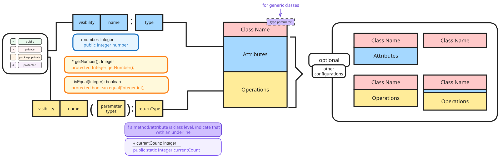
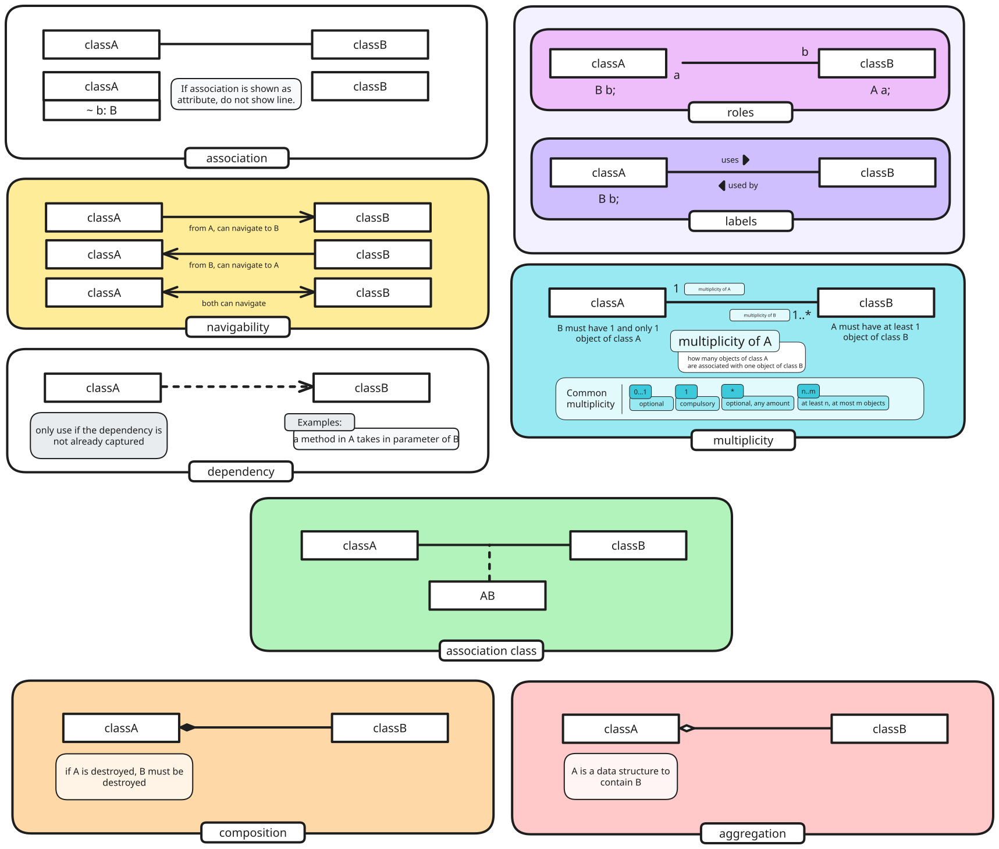
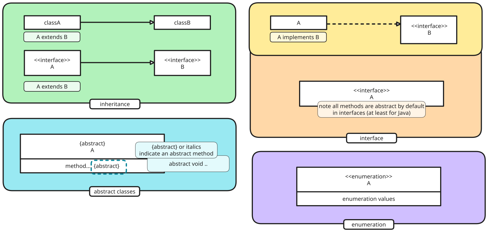
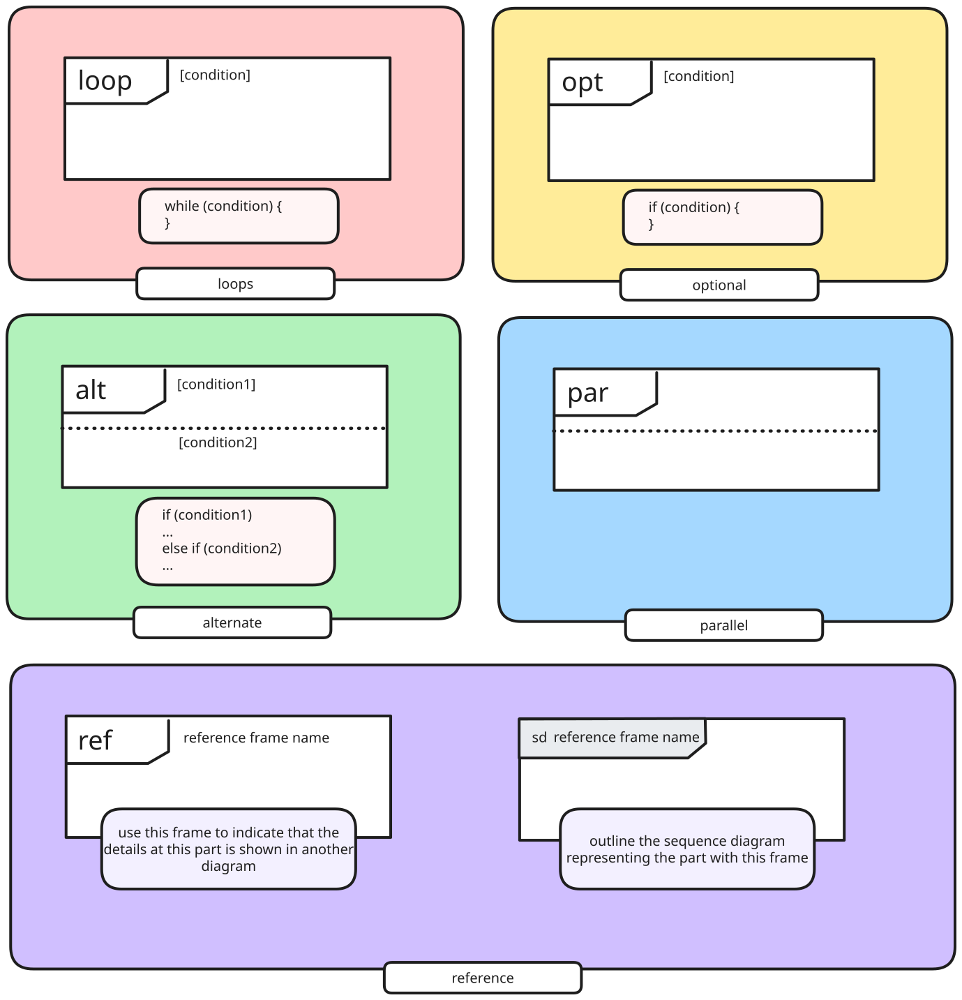
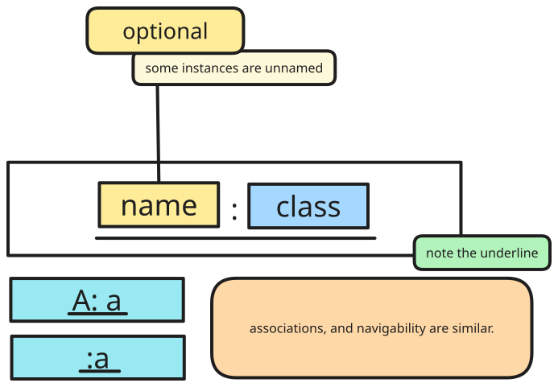
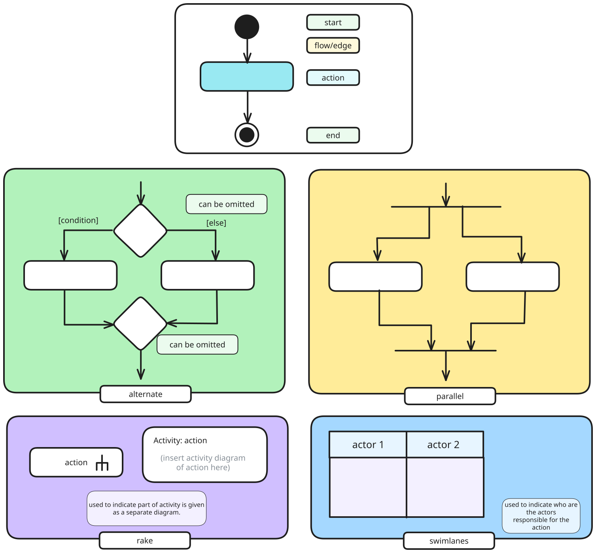
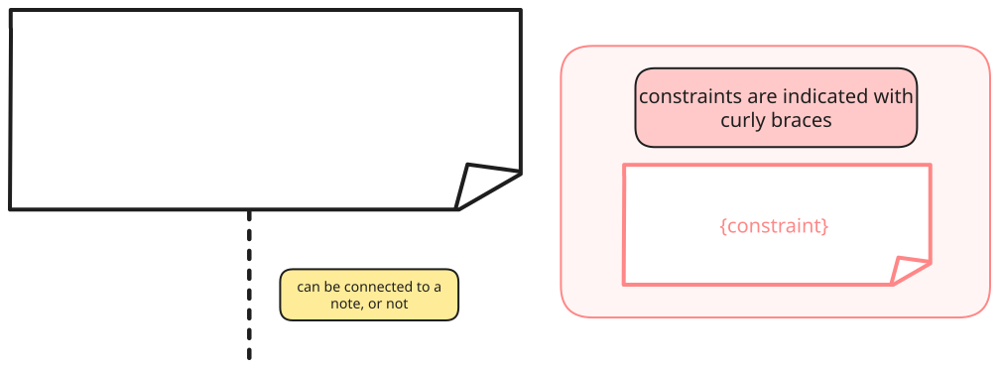

> [!remark] CS2103T UML Diagrams
> _by m.zaidan_
> for AY24/25 S1

# Class Diagram

**Basic class components**

**Types of association**

**Other templates (abstract, interface)**

---

# Sequence Diagrams

---

# Object Diagrams

---

# Activity Diagrams

# Notes

