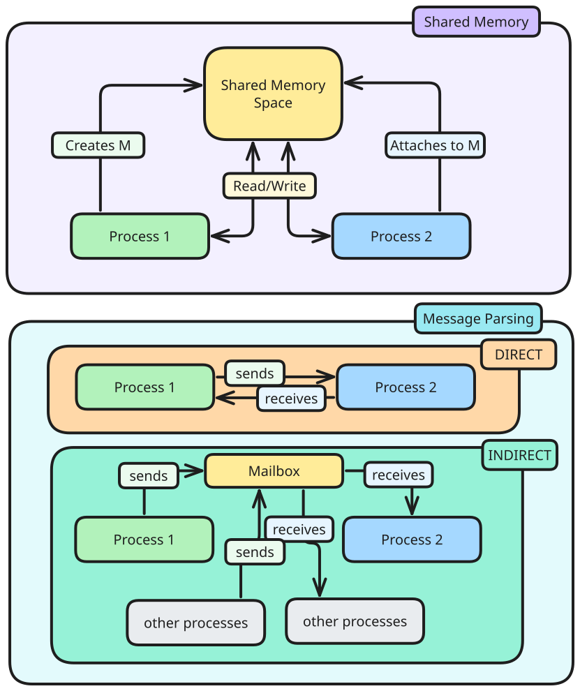

> [!warning] Incomplete.

> [!motivation] 
> It is hard for cooperating processes to share information when memory space is independent.


# Shared Memory

General idea:
1. Process $P_{1}$ creates a shared memory region $M$
2. Process $P_{2}$ attaches memory region $M$ to its own memory space
3. $P_{1}$, $P_{2}$ communicates using memory region $M$

> [!pros]
> - Efficient
> - Ease of use

> [!cons]
> - Synchronisation
> - Harder to implement

In _nix_ systems, POSIX shared memory is done:
1. Create/locate shared memory region $M$
2. Attach $M$ to process memory space
3. Read from/write to $M$, where all values written are visible to all processes sharing $M$.
4. Detach $M$ from memory space.
5. Destroy $M$ - only one process needs to do this, and only allowed if $M$ is not attached to any processes.

# Message Passing

General idea:
1. Process $P_{1}$ prepares a message $M$ and sends it to $P_{2}$
2. Process $P_{2}$ receives the message $M$
- Message sending and receiving are usually provided as system calls.

Message parsing allows for:
- naming - identification of each parties in communication
- synchronisation - behaviour of sending/receiving operation is synchronised

> [!pros]
> - Portable
> - Easier synchronisation

> [!cons]
> - Inefficient
> - Harder to use
## Naming Schemes

> [!abstract]  Direct Communication
> Explicitly name the other party in the messages

```C
send(P2, msg) // send to process p2
receive(P1, msg) // receive from process p1
```


> [!abstract] Indirect Communication
> Send/receive from a common message storage

```C
send(MB, msg);
receive(MB, msg);
```

This allows for one mailbox to be shared among a number of processes.
## Synchronisation

The behaviour can be either
- synchronous (with blocking primitives)
- asynchronous (with non-blocking primitives)

> [!abstract] Blocking primitives (synchronous)
> Cause calling process to wait until certain conditions are met.

Blocking primitives can block
- read: process trying to read will block until message is available
- write: process trying to write will block until space is available

> [!pros]
> - Simplifies programming
> - Ensures synchronisation

> [!cons]
> - Can be inefficient
> - Process may block indefinitely causing deadlock/unresponsiveness

> [!abstract] Non-blocking primitives (asynchronous)
> Allow process to attempt an operation without waiting

Non-blocking primitives can 
- read: process trying to read will return immediately indicating message availability
- write: process trying to write will return immediately if queue is full

> [!pros]
> - Increases responsiveness and efficiency
> - Helps avoid deadlocks/unresponsiveness

> [!cons]
> - Complex if operations cannot be completed immediately
> - Can lead to busy waiting or spinning if not implemented carefully.
# Unix Pipes

> [!abstract] Piping
> The use of `|` to link the input/output channels of one process to another.
> > [!example] `ls | grep file.txt`

Generally: a communication channel is created with 2 ends, the input and output.
- the input is written into a end of the pipe
- the output is read from the other end of pipe

A pipe can then be shared between two processes, as a form of Producer-Consumer relationship.

The Unix pipe functions as circular bounded byte-buffers with implicit synchronisation:
- Writers wait when the buffer is full
- Readers wait when buffer is empty

This allows for variants:
- can have multiple readers/writers
- half-duplex: unidirectional with one write end and one read end
- duplex: bidirectional with both ends being both read/write
## System Calls

```C
#include <unistd.h>

int pipe (int fd [] )
```

where `fd` is an array
- `fd[0]` - reading end
- `fd[1]` - write end

The method returns
- `0` to indicate success
- `!0` to indicate errors

### `dup`

`dup` and `dup2` create copies of a given file descriptor, which acts as an alias of the original copy.

`dup2` is relevant here as it can be used for input/output redirection.


```C
#include <stdio.h>
#include <stdlib.h>
#include <unistd.h>

/* function prototypes */
void die(const char*);
 
int main(int argc, char **argv) {
	int pdes[2];
	pid_t child;
 
	if(pipe(pdes) == -1)
		die("pipe()");
 
	child = fork();
	if(child == (pid_t)(-1))
        	die("fork()"); /* fork failed */
 
	if(child == (pid_t)0) {
        	/* child process */

        	close(1);       /* close stdout */
        	
        	if(dup(pdes[1]) == -1)
        		die("dup()");
        	
        	/* now stdout and pdes[1] are equivalent (dup returns lowest free descriptor) */

        	if((execlp("program1", "program1", "arg1", NULL)) == -1)
        		die("execlp()");

		_exit(EXIT_SUCCESS);
	} else {
        	/* parent process */

        	close(0);       /* close stdin */
        	
        	if(dup(pdes[0]) == -1)
        		die("dup()");

        	/* now stdin and pdes[0] are equivalent (dup returns lowest free descriptor) */

        	if((execlp("program2", "program2", "arg1", NULL)) == -1)
        		die("execlp()");

		exit(EXIT_SUCCESS);
	}
 
	return 0;
}

void die(const char *msg) {
	perror(msg);
	exit(EXIT_FAILURE);
}
```

A systematic understanding of the code here:

**Step 1: Set the pipes up**

```C
int pdes[2];
if (pipe(pdes) == -1)
    die("pipe()");
```

When `pipe` is run on `pdes`, data written into `pdes[1]` will be readable from `pdes[0]`.

> [!note] The `die` method runs when there is error in the function, and prints out an error and exits.

**Step 2: Child process creation**

```C
child = fork();
if (child == (pid_t)(-1))
    die("fork()");
```

The `fork` function creates a child process, meaning there are now two processes: the parent and the child.

**Step 3: Redirecting output in child process**

```C
if (child == (pid_t)0) {
    /* child process */
    close(1); // Close standard output
    if (dup(pdes[1]) == -1)
        die("dup()");
    close(pdes[1]); // Close the original write end
```

In the child process, the output is closed with `close(1)` meaning
- child no longer writes to console.

The `dup(pdes[1])` call duplicates the write end to the pipe to the lowest number unused file descriptor `1`, meaning
- any data child writes goes into pipe instead of console

The original write end of pipe is closed with `pdes[1]`
- no longer needed, as data is already written using the child process.

**Step 4: Redirecting input in parent process**

```C
} else {
    /* parent process */
    close(0); // Close standard input
    if (dup(pdes[0]) == -1)
        die("dup()");
    close(pdes[0]); // Close the original read end
```

In the parent process, the input is closed using `close(0`) meaning
- parent can no longer read from console

The `dup(pdes[0])` call duplicates the read end to the pipe to the lowest number unused file descriptor `0`, meaning
- any data child reads is from pipe instead of console

The original read end of pipe is closed with `pdes[0]`
- no longer needed, as data is already read from the duplicated file descriptor.

**Step 5: Execution of Programs**

```C
if (child == (pid_t)0) {
	....
	if ((execlp("program1", "program1", "arg1", NULL)) == -1) {
	    die("execlp()");
```

The child process executes a program using `execlp` which effectively replaces its image with that of the program.
- any output from this program will be written into pipe

```C
else {
	/* parent process */
    ...
    if((execlp("program2", "program2", "arg1", NULL)) == -1)
        		die("execlp()");
```

The parent process also executes a program using `execlp`
- any input from this program will be read from pipe.

Thus, effectively, all output of `program1` is written into `program2` here.

# Unix Signal

> [!abstract] Asynchronous notification regarding event sent to a process/thread

The recipient of signal must handle signal by:
- default set of handlers
- user supplied handlers (for some signals)

> [!example] Kill, Stop, Continue, Memory Error, Arithmetic Error

