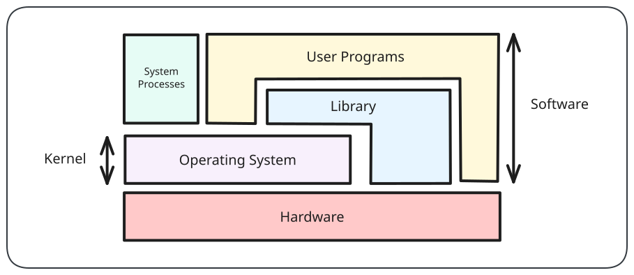
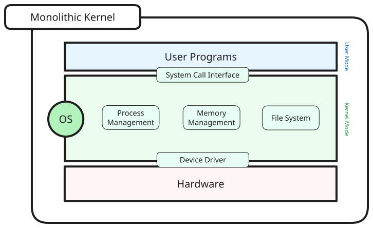
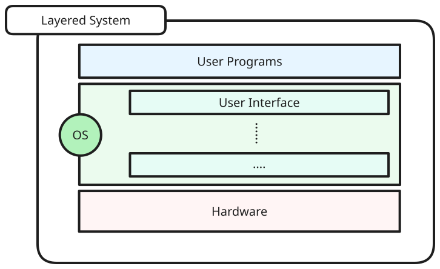
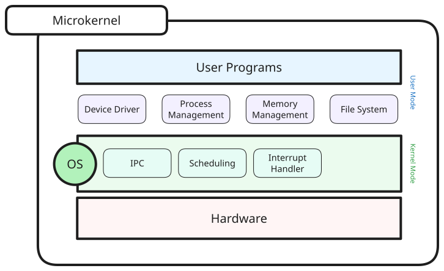

# Motivations

> [!note] Summary
> - Manage resources and coordination through process synchronisation and resource sharing
> - Simplifies programming through the abstraction of hardware, allowing for the creation of convenient services
> - Enforce usage policies 
> - Security and protection
> - User program portability - applications work on the operating system generally regardless of hardware
> - Efficiency through sophisticated implementations optimised for certain usage and hardware

## Abstraction

> [!note] OS as an abstraction
> With the operating system abstracting the lower level details, the user does not need to concern himself with those details to perform the tasks through the operating system. This provides **efficiency** and **portability**.

Due to possible large variations in hardware configurations, the operating system can act as an abstraction on the common functionality between hardware in the same category.

> [!example] Hard disk
> There are multiple different types of hard drives supported by a single OS - for example SSD vs HDD storage differences.

The OS then serves as an abstraction that can **hide the different low level details** and **presents the common high level functionality to user**. 

This simplifies programming, by providing abstractions for lower level details to make higher-level services and applications leveraging on the APIs provided by the operating system.
## Resource Allocation

> [!note] OS as a resource allocator
> The operating system can manage the resources required for program and arbitrate conflicting requests.

A single program execution requires many different resources - CPU, memory and I/O devices. In addition, modern operating systems allow for multiple program execution, and these should be allowed to execute simultaneously.

This allows the management and coordination of resources through process synchronisation and resource sharing.
## Control Program

> [!note] OS as a control program
> The OS controls execution of programs which helps to prevent errors and improper use, while providing security and protection.

Programs can misuse the computer both intentionally (maliciously) and accidentally through viruses, malware, or bugs. In addition, modern operating systems allow sharing of computers through different user profiles. The OS often allows for the creation of usage policies, allowing administrators to control the possible use of devices.

# OS Structure

> [!important] To be able to deliver the benefits above, the operating system should be flexible, robust and maintenable.

## Implementation

> [!definition] HLL
> High-level languages (not assembly/machine code)
> > [!example] C, C++

Programming languages are dependent on the hardware and architecture. Some common code organisations are:
- Machine independent HLLs
- Machine dependent HLLs
- Machine dependent assembly code

> [!warning] Challenges
> - High self-reliance
> - Hard debugging
> - Complexity
> - Enormous codebase

## Possible Structures
### Monolithic

The kernel is a one big program (as one monolith).

> [!example] Most Unix variants, Windows NT/XP

#### Layered System

A layered system is a generalisation of a monolithic system, in which the components are organised into a hierarchy of layers.

As the different components are now in their different layers, it is now more modular and easier to debug. In addition, there are layers between the components and hardware, meaning that most components cannot control the hardware directly.
### Micro-kernel

The kernel is a small program that only provides **basic and essential facilities** through inter-process communication.

#### Client-Server Model

A variation of a microkernel which has two classes of processes
- Client process requests service from a server process
- Server processes built on top of the microkernel
- Client-server processes are on separate machines
# Virtual Machines

> [!definition] Virtual machine (Hypervisor)
> A software emulation of hardware. 
## Motivation

### Running multiple OSes simultaneously

The OS assumes total control of the hardware, which might be a problem if wanting to run multiple OSes for any multitude of reasons. Thus, running a virtual machine allows for the running of multiple OSes (of possible different varieties) at the same time on the same hardware.
### Debugging and monitoring

It might be hard to observe the working of the OS.

In addition, testing the OS with possibly destructive implementations (such as running a malware analysis tool with real malware) is dangerous and extremely not recommended.

Thus, we can use a virtual machine to run these implementations and debug the OS safely.
## Type 1 and Type 2 Hypervisors

| Type 1 Hypervisor                                          | Type 2 Hypervisor                               |
| ---------------------------------------------------------- | ----------------------------------------------- |
| Runs directly on hardware                                  | Runs on the host OS, which runs on the hardware |
| Can directly access hardware                               | Negotiates with host OS for resource allocation |
| Isolated - OSes do not share a layer (through the Host OS) | Not as isolated                                 |
