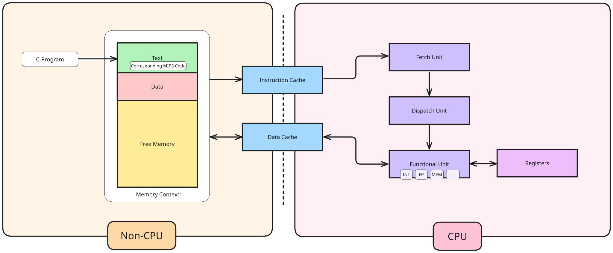
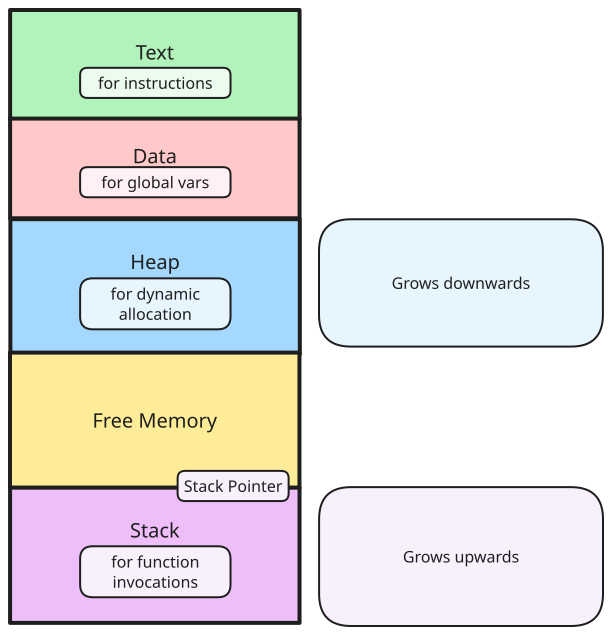
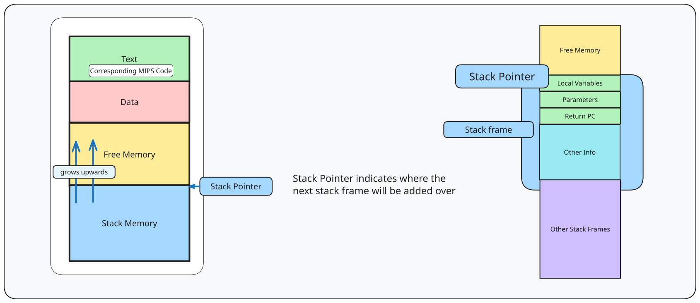
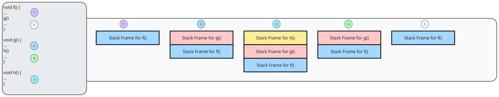
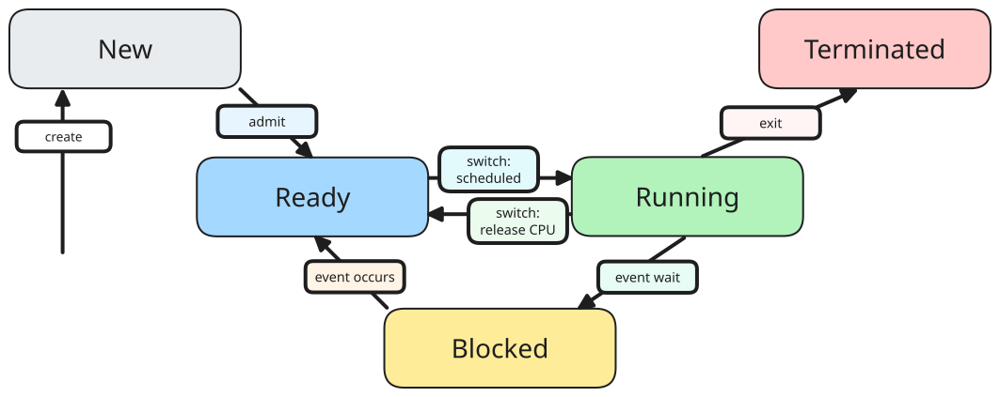
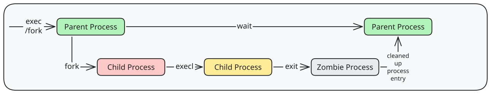
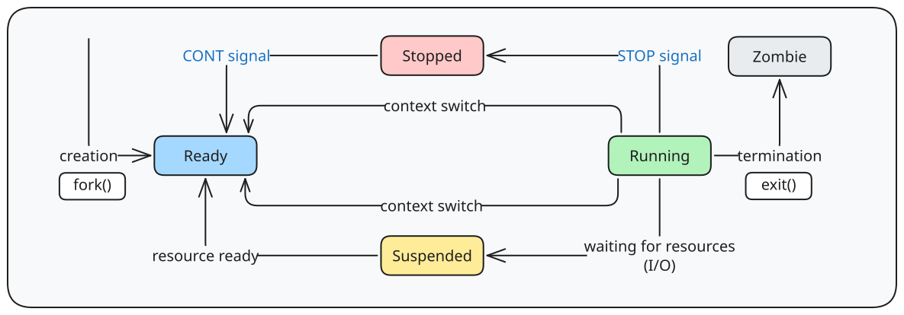

# Abstraction

> [!definition] Process
> A dynamic abstraction for executing program, which contains the information required to describe a running program.

Process abstracts away all the information in the different contexts, such as
- memory (code, data)
- hardware (registers, PC)
- OS (process properties, resources used)



> [!note] Component descriptions
> > [!definition] Memory
> > The storage for the instruction and data
> 
> > [!definition] Cache
> > A duplicated part of the memory for faster access, that resides on the CPU chip, which is usually split into **instruction cache** and **data cache**. 
> 
> > [!definition] Fetch unit
> > Loads instruction from the memory, where the location is indicated by the **PC** (Program Counter).
> 
> > [!definition] Functional unit
> > Carries out instruction execution, with different functional units dedicated to different instruction type.
> 
> > [!definition] Registers
> > Internal storage (with fastest access speed) which can be split into two different types:
> > - General Purpose Registers (GPR), which are accessible by user programs.
> > - Special Registers
> > 	- PC
> > 	- Stack Pointer (SP)
> > 	- Frame Pointer (FP)
> > 	- Program Status Word (PSW)

A basic instruction execution can look like such:
1. Instruction X is fetched, with its memory location indicated by the PC
2. Instruction X is dispatched to the corresponding Functional unit
	1. Operands are read if applicable (from memory or GPR)
	2. Result is computed
	3. Value is written if applicable (to memory or GPR)
3. Instruction is complete
4. PC is updated for next instruction
# Memory Context


## Stack Memory

### Motivation - function call

> [!definition] Effect of a function call
> A function call means that a previous region of code will have to be executed (as functions are declared earlier, and not at the current PC location.)

There are two sets of issues here pertaining to both control flow and data storage.

With regards to **control flow**, there is a need
- to jump to the function body (to execute the function code)
- to resume after the completion of the function call.
Thus, there is a need (minimally) to store the **PC** of the caller.

With regards to data storage, there is a need
- to pass parameters to function
- to capture the return result
- to allow for local variables declaration

> [!important] A new region of memory is needed that can be used dynamically by function invocations.

### Implementation

> [!summary] Stack Memory Region
> Memory region to store information of function invocation.
> 
> > [!note] Stack frame
> > Information of a function invocation is described by a stack frame.
> 
> > [!note] Stack pointer
> > Logically indicates the top of the stack region (the first unusued location),

A **stack frame** contains the relevant information such as:
- return address of the caller
- arguments (parameters) of the function
- storage for local variables
- other information

The top of a stack region is logically indicated by a **Stack Pointer**, which usually is allocated a **SR** (specialised register) for the purpose. 





#### Calling Convention (Setup and Teardown)

The setup is as such:
1. Preparation to make a function call
	- **Caller** passes parameters with registers and/or stack
	- **Caller** saves return PC on stack
2. Transfer of control to **Callee**
	- **Callee** saves registers used by the callee, and saves old FP, SP.
	- **Callee** allocates space for local variables of callee on stack
	- **Callee** adjusts SP to point to the new stack top
3. Execution of call
4. When returning from function call
	- **Callee** restores the saved registers, FP, SP
	- **Callee** places return result on stack (if applicable)
	- **Callee** restores saved stack pointer
6. Transfer of control back to **Caller** (using the saved PC)
	- **Caller** utilises return result (if applicable)
	- **Caller** continues execution in caller
#### Other Information in Stack Frame

##### Frame Pointer (FP)

> [!note] Motivation
> The frame pointer facilitates access of various stack frame items, as the stack pointer can change. 

Processors provide dedicated register frame pointer, which points to a fixed location in a stack frame, from which other items are accessed as a **displacement** from the frame pointer.

> [!remark] Usage of the FP is platform dependent.
##### Saved Registers

> [!note] Motivation
> GPRs on processors are limited. When these are exhausted, memory is used to hold the value, allowing the reuse of the GPR, and then the restoration of the value back to the GPR can be done afterwards (called register splling).
> 
> However, the function can spill the registers it intends to use before function starts, thus the registers need to be restored at the end of the function.
## Heap Memory

### Motivation - dynamically allocated memory

> [!note] Motivation
> Programming languages generally allow dynamically allocated memory, in which the program acquires memory space during execution time.
> 
> > [!example] `malloc`, `new`

These memory blocks have different behaviours to a function call, which means that they cannot be placed in the data or stack region -
- These memory blocks are only allocated at runtime, meaning they cannot be placed in the **Data** region, as that is allocated at the start of the program.
- These memory blockshave no definite deallocation timing, which means they cannot be placed in the **Stack** region, as those have a definite order of which they are deallocated (based on the function invocation).

> [!important] Heap memory is needed for these memory blocks.
### Challenges

Heap memory is trickier to manage than stack memory, as
- the size of the memory is variable
- the timing of allocation/deallocation is variable
# OS Context

## Process Identification

> [!note] Motivation
> Distinguish processes from each other.

A common approach to this is the usage of a **PID** (Process ID), which is unique among processes. However, depending on the OS, this raises issues, such as:
- are PIDs reused?
- is there a limit on the number of processes?
- are there reserved PIDs?
## Process State


> [!definition] Process state
> Indication of the execution status

### 5-stage model



The five stage model contains the following stages:
- New
	- Process is just created
- Ready
	- Process is waiting to run
- Running
	- Process is being executed on CPU
- Blocked
	- Process is waiting for event, and cannot execute until event is available
- Terminated
	- Process has finished execution, and may require OS cleanup

The process state transitions are as such:
- Create `NIL -> New`
	- A new process is created
- Admit `New -> Ready`
	- Process is ready to be scheduled for running
- Switch: Scheduled `Ready -> Running`
	- Process is selected to run
- Switch: Scheduled `Running -> Ready`
	- Process gives up CPU voluntarily or preempted by scheduler
- Event wait `Running -> Blocked`
	- Process requests event/resource/service which is not available/in progress
		- System calls, I/Os
- Event occurs `Blocked -> Ready`
	- Process can continue after event requested occurs
### Global view

Conceptually, there can be possibly parallel transitions, given a non-single amount of CPUs. With $m$ CPUs, there will be up to $m$ processes in running state. 

Different processes may be in different states, with each process being in different parts of their state diagram.

# Process Control Block & Table

To store the entire execution context for a process, a **Process Control Block** or **Process Table Entry** is used. The kernel maintains the PCB for all processes, which is conceptually stored as one table, representing all processes.
## Challenges

> [!definition] Scalability
> Amount of concurrent processes.

> [!definition] Efficiency
> Access should have minimum space wastage.

# Process Interaction with OS

## System Calls

System calls are a way of calling services in kernel, using the **Application Program Interface (API)** in OS.

> [!important] This is not the same as a normal function call, as a system call requires a switch from user mode to kernel mode.

Different OSs have different APIs
- Unix variants (POSIX)
- Windows (WinAPI)
### Unix System Calls

In C/C++, the system calls can be invoked almost directly, using
- library version with the same name/parameters, where the library version acts as a **function wrapper**
- user-friendly-library version, acting as a **function adapter**

> [!example] 
> `getpid()` is a function wrapper, of the system call, while `printf()` is a function adapter of the `write()` system call

### System Call Mechanism

1. User program invokes library call
2. Library call places the system call number in a designated location, like a register
3. Library call executes special instruction to switch from user to kernel mode
	- Commonly known as **TRAP**
4. In kernel mode, appropriate system call handler is determined.
	- Using call number as index
	- Similar to vectored interrupt
	- Usually handled by a dispatcher
5. System call handler is executed to carry out the actual request
6. System call handler is ended
	- Control return to library call
	- Switch back from kernel mode to user mode
7. Library call returns to user program

## Exception and Interrupt

### Exception

An exception can happen when executing a machine level instruction. Examples of these errors include
- arithmetic errors (overflow, underflow, division by 0)
- memory errors (illegal memory address, mis-alignment memory access)

Exceptions are **synchronous** as they occur due to program execution.

When an exception happens, an **exception handler** is executed automatically (similar to a forced function call).

### Interrupt

External events can interrupt the execution of a program, which is usually hardware related.

An interrupt is **asynchronous** - and occur independent of program execution.

When an interrupt happens, program execution is suspended, and an **interrupt handler** is executed automatically.
# In Unix

Each process is **identified** by a **PID** - a Process ID, an integer value.  The information stored per process include the
- process state: running/sleeping/stopped/zombie
- parent PID: PID of the parent process
- cumulative CPU time: total CPU time

To get process information, use the command `ps`.

## Process Creation

To create a new process:
```
#include <unistd.h>
int fork();
```

which returns
- the PID of the newly created process (for parent process)
- 0 for the child process

Header files are system dependent - use `man fork` to find the right files.

`fork()` creates a new process (known as a **child process**).

> [!definition] Child process
> A duplicate of the current executable image

The child differs in:
- process ID (PID)
- parent (PPID)
- `fork()` return value

> [!note] Common usage for `fork`
> Use the parent/child processes differently - the parent can spawn off a child to carry out some work, and then the parent takes another order.

Note that the parent and child processes share independent memory space. This means that while there might be a global variable that is accessible by both memory processes, each process (the parent and child) has a copy of that variable, instead of directly accessing it.

```C
#include <stdio.h>
#include <unistd.h>

int var = 1;  // Global variable

int main() {
    int result = fork();  // Creates a child process

    if (result != 0) {
        var++;  // Parent process increments var
    } else {
        var--;  // Child process decrements var
    }

    printf("Process %d (parent: %d) -> var = %d\n", getpid(), getppid(), var);
    return 0;
}

```

For example, given this example of code: the following output can be seen.

```C
Process 1234 (parent: 5678) -> var = 2  // Parent process
Process 1235 (parent: 1234) -> var = 0  // Child process
```

As noted, the`var` variable is different for both, and does not affect each other as it is done oon a copy. Thus, it can be said that they have a separate, independent memory space for the parent and child processes.

## Executing A New Program

> [!abstract] Motivation
> `fork()` by itself is not useful as there still needs to be the full code provided for the child process. What if another existing program needs to be executed instead?

The `exec` system calls family have many variants, notably
- `execv`, `execl`, `execle`, `execlv`, `execlp`

To replace current executing process image with a new one:
```
#include <unistd.h>
int execl(const char *path, const char *arg0,... constchar *argN, NULL);
```

For example, to execute the `ls` shell command in Unix, the following call can be done:
```C
execl("/bin/ls", "ls", "-l", NULL);
```

which executes the `ls -l` using the `ls` executable in `bin`.

## Combining `fork` and `exec`

The two mechanisms can be combined to
- spawn off a child process and let it perform a task using `exec`
- the parent process is allowed to accept another request

## Master Process

> [!question] If every process has a parent, then which process is the commonest ancestor?

The `init` process is the special initial process that is created in the kernel at boot up time, with a `PID = 1`. This process watches for other processes and respawns where needed.

`fork()` creates a process tree, with `init` as the root process.
## Process Termination

```C
#include <stdlib.h>
void exit(int status);
```

The status is returned to the parent process, with the Unix convention
- `0` for normal termination
- `!0` to indicate problematic execution

The parent process can also wait for the child process to terminate:
```C
#include <sys/types.h>
#include <sys/wait.h>
int wait(int* status);
```

The returned value is the PID of the terminated child process, and the status, which is passed in by **address** stores the exit status of the terminated child process. Since it is a pointer, a `NULL` can be passed in if this info is not wanted.

This call blocks until at least one child terminates, and cleans up remainder of child system resources, which are not removed on `exit()`. This kills zombie processes.

Other variants include `waitpid()`, and `waitid()`, which waits for a specific child process or any child process to change status respectively.

## Process Interaction



Note that on process `exit`, the process becomes a zombie.

This means that all process info cannot be deleted, which causes a problem if parent asks for info in a `wait()` call. Remainder of the process data structure can be cleaned up only when `wait()` happens.

The zombie process cannot be killed, as it is already dead.

There are two cases where a zombie process happens:
1. Parent process terminates before child process
	- The `init` process becomes the pseudo-parent of child processes
	- Child termination sends signal to `init`, which utilises`wait()` to cleanup
2. Child process terminates before parent, and parent did not call `wait()`
	- Child process becomes a zombie process, which can fill up process table
	- Could cause issues and need a reboot on older Unix implementations

