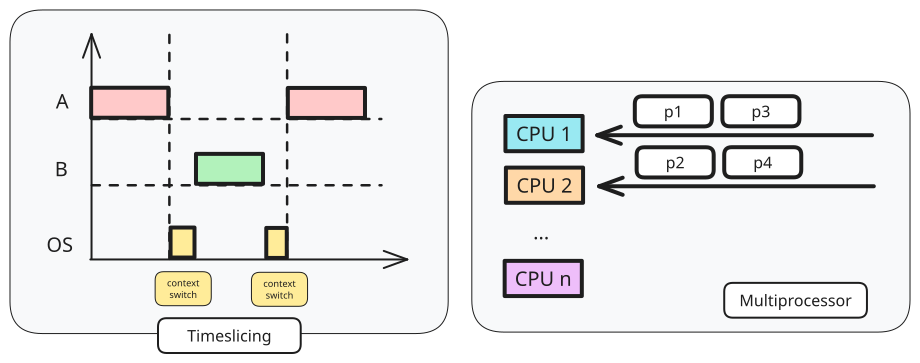
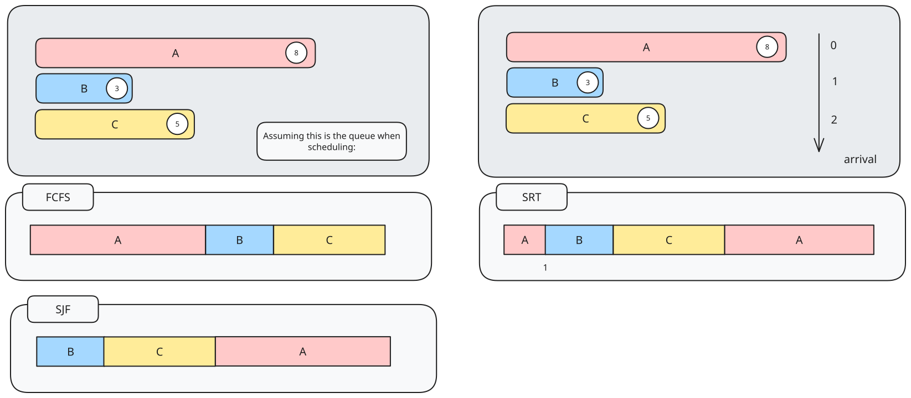
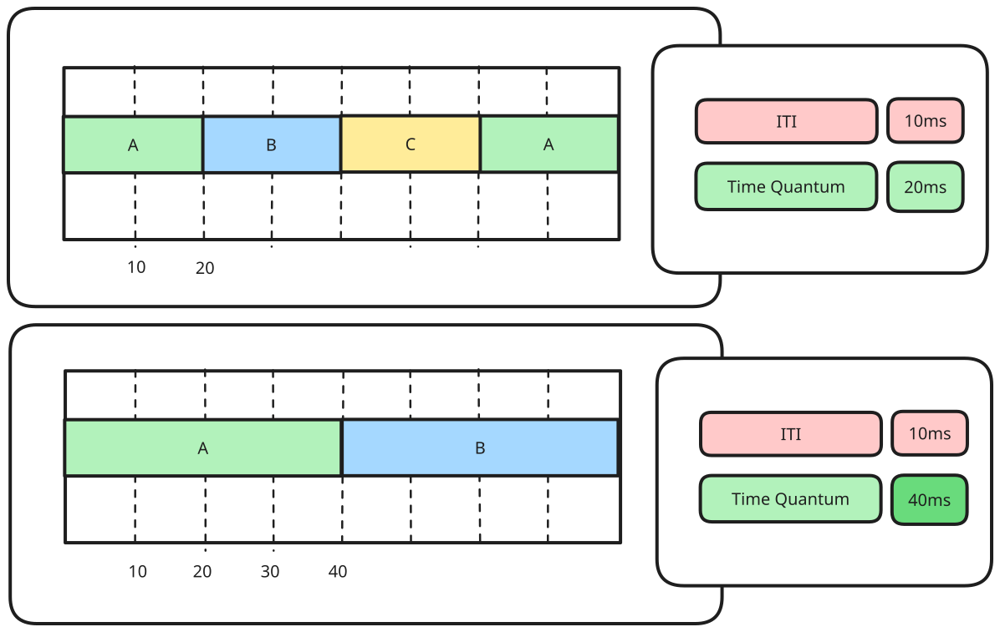
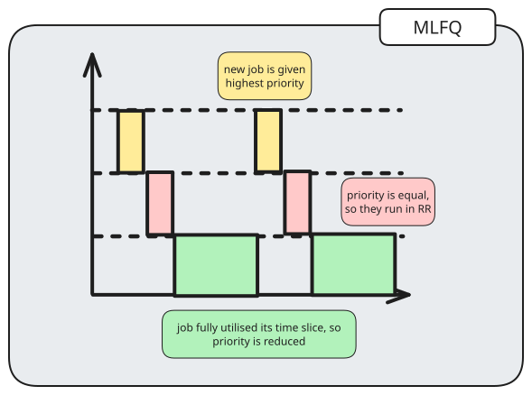

> [!definition] Concurrent processes
> Logical concept to cover multitasked processes.

Concurrent processes can be done using both virtual or physical parallelism.

> [!definition] The scheduling problem
> If there are more ready-to-run-processes than CPUs, which process should be chosen?

Important terminologies
- **Scheduler** refers to the part of the OS that makes scheduling decisions
- **Scheduling algorithm** is the algorithm used by scheduler
	- influenced by **process environment**
- **Process behaviour** refers to the requirement of CPU time

There are three types of processing environments:
1. Batch processing
	- No interaction is required, meaning there is **no need to be responsive**
2. Interactive
	- With active user interacting with system
	- Should **be responsive** and consistent in **response time**
3. Real-time processing
	- Have deadline to meet

The **criterias** for all processing environments are:
- fairness
	- everytime should get a fair share of CPU time
- balance
	- all parts of the computing system should be utilised

There are two types of scheduling policies
- Non-preemptive
	- A process stays scheduled until it blocks OR gives up the CPU voluntarily
- Preemptive
	- A process is given a fixed time quota to run

Thus, a process scheduler follows this step:

1. Scheduler is triggered
2. If context switch is needed, context of current running process is saved, and placed on blocked queue/ready queue
3. Select a suitable process `P` to run
4. Setup context for `P`
5. Let process `P` run
# Scheduling for Batch Processing

Criterias:
- Turnaround time $finish - start$
- Throughput: number of tasks finished per unit time
- CPU utilisation: percentage of time when CPU is working on a task

## First-Come-First-Served (FCFS)

> [!abstract] First-In-First-Out (FIFO)

Guaranteed to have **no starvation** as the number of tasks in front of task X in FIFO is always decreasing.

Simple reordering can reduce average waiting time.

> [!definition] Convoy effect
> First task $A$ is CPU-bound and followed by a number of IO-Bound tasks $X$. 
> When task $A$ is running, all tasks $X$ are waiting in the ready queue (IO idling)
> When task $A$ is blocked on I/O, all tasks $X$ execute quickly and are blocked on I/O (CPU idling)

## Shortest Job First (SJF)

> [!abstract] Select task with smallest total CPU time

This requires the knowledge of total CPU time for a task in advance. However, given a fixed set of tasks, this minimises average waiting time.

However, since this requires the prediction of CPU time, it needs to guess the future CPU time by the previous CPU-bound phases.
### Predicting CPU time

A common approach to predicting CPU time is the **exponential average**:

$$
Predicted_{n+1} = \alpha Actual_{n} + (1-\alpha)Predicted_{n}
$$
where 
- $Actual_{n}$ refers to the most recent CPU time consumed
- $Predicted_{n}$ refers to the past history of CPU time consumed
- $\alpha$ refers to weight placed on recent event or past history
- $Predicted_{n+1}$ refers to the current prediction
## Shortest Remaining Time (SRF)

> [!abstract] Variation of SJF, using the remaining time.

SRF is preemptive, and selects the job with the shortest remaining (or expected) time.

A new job with shorter remaining time can preempt currently running job, which provides good service for short jobs even if they arrive later in the queue.
# Scheduling for Interactive Systems

**Criterias**:
- Response time: time between request and response by system
- Predictability: Variation in response time, lesser variation

> [!note] Preemptive scheduling algorithms are used to ensure good response time

> [!question] How can the scheduler take over the CPU periodically, and how can we ensure the user program can never stop the scheduler from executing?

**Timer interrupt** refers to interrupt that goes off periodically (based on hardware clock). The OS ensures the timer interrupt cannot be intercepted by any other program. The interrupt handler **invokes the scheduler**.

The interval of the timer interrupt depends, typically ranging between $1-10$ms.

> [!definition] Time quantum
> Execution duration given to a process.

The time quantum can be constant or variable amongs the processes, and must be a **multiple** of the interval of timer interrupt, and generally has a larger range of values ($5-100$ms).

## Round-Robin (RR)

> [!definition] Preemptive version of FCFS

Generally, the tasks are stored in a **FIFO queue**, and the first task from the queue is chosen to run until
- a fixed time slice (quantum) elapsed
- the task gives up the CPU voluntary
- the task blocks

After that, tasks are placed at the end of queue to wait for another turn. A blocked task will be moved to other queue to wait for its request.

The response time is guaranteed - given $n$ tasks and quantum $q$, the time before a task gets CPU is bounded by 
$$(n-1)q$$
The timer interrupt is needed for the scheduler to check on quantum expiry.

The choice of time quantum is important as:
- the bigger the quantum, the better the CPU utilisation, but with a longer waiting time
- the smaller the quantum, the bigger overhead, but shorter waiting time
## Priority Scheduling

There are both preemptive versions
- preemptive: higher priority process can preempt running process with lower priority
- non-preemptive: late coming high priority process **has to wait** for next round of scheduling

However, a low-priority process can **starve** if a high priority process keeps hogging the CPU (worse in preeemptive variant). This can be solved by
- decreasing the priority of currently running processes after every time quantums
- give the current running process a time quantum
Note that it is hard to guarantee or control the exact amount of CPU time given to a process using priority.
## Multi-Level Feedback Queue (MLFQ) 

> [!question] How to schedule without perfect knowledge?

MLFQ is adaptive, meaning it learns the process behaviour automatically, and minimises both
- **response time** for IO bound processes
- **turnaround time** for CPU bound processes

It follows basic rules such as:
- $priority(A) > priority(B) \rightarrow \text{A runs}$
- $priority(A) == priority(B) \implies \text{A,B in RR}$

Priority setting/changing rules
1. New job is given the highest priority
2. If a job has fully utilised its time slice, its priority is **reduced**
3. If a job gives up/blocks before it finishes the time slice, priority is **retained**.

## Lottery Scheduling

> [!abstract] Gives out lottery tickets to processes for various system resources.

When a scheduling decision is needed, a lottery ticket is chosen randomly among eligible tickets to be granted the resource.

In the long run, a process holding $X\%$ of tickets can then win $X\%$ of the lottery held, and thus use the resource $X\%$ of a time.

Lottery scheduling is
- responsive, as a newly created process can participate in the next lottery
- good level of control, as a process can be given $Y$ lottery tickets
	- to distribute to its child process
	- to control the proportion of usage, more important processes can be given more lottery tickets
	- each resource has its own set of tickets