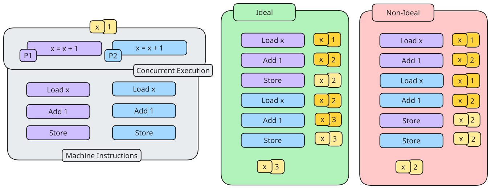
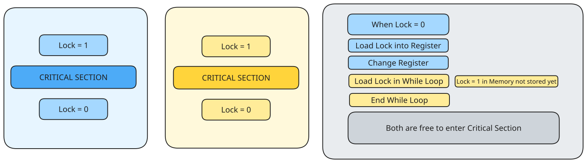
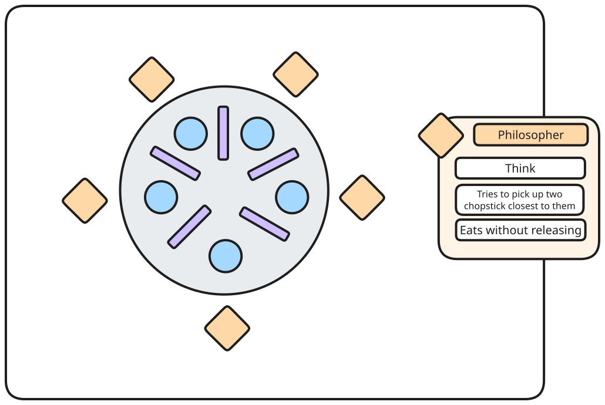

---
tags:
  - process_management
  - operating_systems
  - CS2106
---
Concurrent execution may have a couple of problems. These problems happen when two or more processes execute concurrently in interleaving fashion and share modifiable resources, which can cause [**Synchronisation Problems**](#Synchronisation%20Problems).

While execution of a single sequential process is deterministic, meaning that repeated execution gives the same result, executing concurrent processes may be non-deterministic, as the execution outcome **depends on the order in which the shared resource is accessed/modified**.

> [!definition] Race conditions
> A situation where the order of events is important, but the system doesn't enforce that order



Incorrect execution happens due to the unsynchronised access to shared modifiable resources.
# Incorrect Synchronisation

If incorrect synchronisation is done, it can cause
- **deadlock** - all processes are blocked
- **livelock** - processes keep changing states to avoid deadlock, causing no progress
- **starvation** - some processes are blocked forever
# Critical Section

To solve this, the code segment with a race condition can be designated as a critical section, where
- only one process can execute in the critical section
- preventing other processes from entering the same critical section

The properties of a correct CS implementation are:
- **Mutual exclusion**: No two processes may be simultaneously inside their critical sections.
	- if process $P_i$ is executing in a critical section, all other processes are prevented from entering the critical section
- **Progress**: No assumptions may be made about speeds or the number of CPUs.
- **Bounded Wait**:  No process should have to wait forever to enter its critical section.
	- after $P_{i}$ requests to enter a critical section, there exists an upperbound of number of times other processes can enter the critical section before $P_{i}$
- **Independence**:  No process running outside its critical section may block other processes.

# Implementations of Critical Section
## Assembly Level Implementations

`TestAndSet` is a common machine instruction provided by the processor to aid synchronisation, with the syntax:

```
TestAndSet Register, MemoryLocation
```

which
- loads the current content at `MemoryLocation` into `Register`
- stores a `1` in `MemoryLocation`

> [!important] The above operations are performed atomically - as a single machine operation

Hypothetically, it would work:

```C
void EnterCS( int *Lock )
	while ( TestAndSet( Lock ) == 1 );

void ExitCS( int *Lock )
	*Lock = 0;
```

When the Critical Section is entered, it takes the memory address and sets the content of it to `1`, until it exits, setting the content of the memory address to `0`.

This works by employing **busy waiting**, which means the processor will keep checking the condition until it is safe to enter critical section, which is a wasteful use of processing power.

> [!example] Variants
> - Compare and exchange
> - Atomic swap
> - Load link/Store conditional

## Higher-Level Language Implementations

> [!note] The four conditions of Mutual Exclusion, Progress, Bounded Wait, Independence need to be held.

A naive solution would be to simply put the critical section within the setter values:

```C
while ( Lock != 0 );
Lock = 1;
// CRITICAL SECTION
Lock = 0
```

This violates the **Mutual Exclusion** requirement as the process can enter the critical section at the same time.




---

To solve this, we prevent the context switch (preventing the process from swapping when checking and changing the lock). No clock interrupts can occur, meaning that a process can examine and update the shared memory without fear that any process will intervene.

```C
// DISABLE INTERRUPTS
while ( Lock != 0 );
Lock = 1;
// CRITICAL SECTION
Lock = 0
// ENABLE INTERRUPTS
```

However, this can cause other issues
- buggy critical section may stall the whole system
- busy waiting
- requires permission to disable/enable interrupts - user processors should generally not have the power to turn off interrupts

---

Another solution could be

```C
[PROCESS1]
while ( Turn != 0);
// CRITICAL SECTION
Turn = 1;

[PROCESS2]
while ( Turn != 1);
// CRITICAL SECTION
Turn = 0;
```

where the lock is a `Turn` single, shared variable, that alternates, meaning that one process runs when it is its turn.

This assumes that the $P_{0}, P_{1}$ processes executes the above in loop and takes turns to enter critical section.
However, this solution can cause **starvation** if $P_{0}$ never enters the critical section - as $P_{1}$ will starve. Since $P_{0}$ never enters its critical section, it is not in its critical section and should not block other processes, but it ends up blocking $P_{1}$, violating the **independence property**

---

Another solution could be

```C
Want = [0, 0]

[PROCESS1]
Want[0] = 1;
while ( Want[1] );
// CRITICAL SECTION
Want[0] = 0;

[PROCESS2]
Want[1] = 1;
while ( Want[0] );
// CRITICAL SECTION
Want[1] = 0;
```

This uses an array of `want` where the values refer to whether each process wants to run the process, at that time period. It sets the value to `1` right before it goes into the critical section, and checks if the other process wants to run.

However, this causes a **deadlock** - with concurrency, if both `Want[0] = 1` and `Want[1] = 0`, the while loops will not ends for both processes, causing a deadlock, with both not entering critical sections.

### Peterson's Algorithm

```C
Turn = 0
Want = [0, 0]

[PROCESS1]
Want[0] = 1;
Turn = 1;
while ( Want[1] && Turn == 1 );
// CRITICAL SECTION
Want[0] = 0;

[PROCESS2]
Want[1] = 1;
Turn = 0;
while ( Want[0] && Turn == 0 );
// CRITICAL SECTION
Want[1] = 0;
```

Assuming that writing to `Turn` is an atomic operation,  the deadlock from the previous solution is addressed, as the check for `Turn` checks even if both processes want to enter the critical section, who's turn it is at that point of time to enter the critical section.

> [!cons]
> - Busy waiting
> - Low level - higher level programming construct is desirable
> - Not general as it only addresses mutual exclusion
## High Level Synchronisation Mechanism

### Semaphore

> [!definition] Semaphore
> A generalised synchronisation mechanism in which only behaviours are specified, allowing it to have different implementations.

A semaphore provides a way to block a nujmber of processes, and a way to unblock/wake up one or more sleeping processes.

A semaphore`S` contains an integer value initialised to any non-negative values, and two atomic semaphore operations `Wait` and `Signal`.

```C
S = any non negative integer

Wait( S ) {
	if (*S <= 0)
		block;
	decrement S;
}

Signal( S ) {
	increment S;
	wakes up one sleeping process;
	never blocks;
}
```

A semaphore can be seen as
- protected integers
- list to keep track of waiting processes

The semaphore follows the invariant:

$$
S_{initial} \geq 0 \implies S_{current} =  S_{initial} + \#signal(S) - \#wait(S)
$$

where 
- `#signal(S)`  number of `signal` operations executed
- `#wait(S)` number of `wait` operations completed

#### General vs Binary Semaphores

General semaphores are where $S \geq 0$, while binary semaphores are where $S \in [0,1]$.

General semaphores are provided for convenience - binary semaphores are sufficient and general semaphores can be mimicked by binary semaphores. This can be seen in the example for critical sections:

```
Wait( s );
// CRITICAL SECTION
Signal( s )
```

In this case, $S$ can only be the values `0` or `1` as `Wait` can only decrement when `S = 1` and Signal can only increment when `S = 0`.

#### Proofs of Properties

##### Mutual Exclusion

Letting $N_{CS}$ be the number of processes in Critical Section:

$$
\begin{aligned}
N_{CS} &= \text{Process that completed Wait() but not Signal()} & \\
&= \text{\#Wait(S)} - \text{\#Signal(S)} & \\
S_{initial} &= 1 & \\
S_{current} &= 1 + \text{\#Signal(S)} - \text{\#Wait(S)} & \\
S_{current} + N_{CS} &= 1 & \\
S_{current} & \geq 0  & (\text{by definition of semaphore}) \\
\therefore N_{CS}& \leq 1
\end{aligned}
$$

Hence, **mutual exclusion** holds.

##### Deadlock

If there is a deadlock, all processes must be stuck at `Wait(S)`, meaning the current semaphore $S_{current}= 0$ and $N_{CS}= 0$ since all processes cannot enter critical section.

However, from the above proof, $S_{current} + N_{CS} = 1$, which does not hold. Thus, by contradiction, there cannot be a deadlock.

##### Starvation

If `P1` is blocked at `Wait(S)`, it means that `P2` is in CS.
- When `P2` exits CS, `Signal(S)` is called
- `P1` wakes up if no other sleeping processes, and eventually wakes up regardless even if other processes are sleeping, but will have to wait for its turn assuming fair scheduling.

### Alternatives

Conditional variables can also be used, allowing a task to wait for certain even to happen, having the ability to broadcast (wake up all waiting tasks) and is related to monitoring.

# Synchronisation Problems

## Producer-Consumer

> [!abstract] 
> Producers share a bounded buffer of size $K$, and producers produce items to insert in the buffer only when the buffer is not full ($<K$ items), and consumers remove items from buffer when it is not empty ($>0$ items).

A naive solution: 
```
count = in = out = 0
mutex = S(1)
canProduce = true
canConsume = false

[Producer Process]
while (true) {
	Produce Item;
	while (!canProduce); // Wait for until canProduce is true
	wait(mutex);

	if (count < K) {
		buffer[in] = item;
		in = (in + 1) % K;
		count ++;
		canConsume = true;
	} else 
		canProduce = false;
	signal(mutex);
}

[Consumer Process]
while (true) {
	while (!canConsume); // Wait for until canConsume is true
	wait(mutex);

	if (count < K) {
		buffer[in] = item;
		in = (in - 1) % K;
		count --;
		canProduce = true;
	} else 
		canConsume = false;
	signal(mutex);
	ConsumeItem;
}
```

The `wait` and `signal` calls here creates a Critical Secttion where the buffer is either pushed to or pulled from.

While this code correctly solves the problem, busy waiting is used in the constant checking of the conditional count.

Using the blocking solution, we can instead:

```
count = in = out = 0
mutex = S(1)
notFull = S(K)
notEmpty = S(0)
canProduce = true
canConsume = false

[Producer Process]
while (true) {
	Produce Item;
	wait(notFull);
	wait(mutex);
	
	buffer[in] = item;
	in = (in + 1) % K;
	count ++;
	
	signal(mutex);
	signal(notFull);
}

[Consumer Process]
while (true) {
	wait(notEmpty);
	wait(mutex);
	
	buffer[in] = item;
	in = (in + 1) % K;
	count ++;
	
	signal(mutex);
	signal(notEmpty);
	Consume Item;
}
```

In this scenario, there will be no busy waiting - instead the producer/consumer that has to wait is sent to sleep until the signal is called.
## Readers-Writers

> [!abstract]
> Processes share a data structure $D$ where readers retrieve information from $D$ and writer modifies information in $D$. Writers must write alone to avoid overwriting content.

There are many multiple variations of the Readers-Writers problem - some being:
- **The first** No reader should be kept waiting until a writer has already obtained permission to use the shared object
- **The second** Once a writer is ready, that writer perform its write as soon as possible.

The solutions to the first problem can cause writer starvation, while solutions to the second can cause reader starvation.

```C

roomEmpty = S(1)
mutex = S(1)
nReader = 0

[WriterProcess]
while (TRUE) {
	wait ( roomEmpty )
	MODIFY DATA
	signal( roomEmpty)
}

[ReaderProcess]
while (TRUE) {
	wait ( mutex )
	nReader++
	if (nReader == 1)
		wait ( roomEmpty )
	signal( mutex )

	READ DATA

	wait ( mutex )
	nReader--;
	if (nReader == 0)
		signal ( roomEmpty )
	signal ( mutex )
}
```

A naive solution (to the first problem) can look like the above, which is an implementation of a reader-writer lock. However, note than in the situation where multiple readers continuously arrive, the writer process might be permanently prevented from accessing the resource, causing **starvation** for the writer.

To fix this, the reader processes can then use a new semaphore to reach a fair scheduling approach - see:

```C
writeMutex = S(1)
waitingWriters = 0

[WriterProcess]
while (TRUE) {
	wait ( writeMutex )
	waitingWriters++
	....
	....
	signal( writeMutex)
}

[ReaderProcess]
while ( TRUE ) {
	...
	if ( waitingWriters > 0 ) {
		signal( mutex )
		wait( writeMutex )
		wait( mutex )
	}
	...
}
```

The `writeMutex` is then responsible to ensure exclusive access for writers.  Now, if there are waiting writers, writers get a fair chance to write once they request access, using the `waitingWriters` variable.

## Dining Philosophers

The problem can be illustrated with the following illustration:



There are 5 philosophers, with 5 chopsticks near them. The philosopher only thinks, and eats. When the philosopher is hungry, it tries to pick up two chopsticks closest to them (and cannot take chopsticks from their neighbours) and eats without releasing. The goal of the solution is to let the philosophers eat freely.

This problem is an analogy for the problem of allocating several resources among several processes in a deadlock free and starvation free manner.
### Semaphore

Using a **semaphore** solution, effectively, the structure of the philosopher can be seen:

```C
while ( true ) {
	wait(chopstick[i])
	wait(chopstick[i + 1] % 5)

	EAT

	signal(chopstick[i])
	signal(chopstick[i + 1] % 5)

	THINK
}
```

The naive solution can just be this, which prevents no two neighbours from eating simultaneously, it must be rejected, as it can create a deadlock. If all five philosophers are hungry at the same time, if each grabs their left chopstick, all the semaphores will be `0`, which will delay everyone forever.

Some remedies to this could be:
- **Limited Eater** allow at most four philosophers to sit simultaneously
- **Mutex** allow philosophers to pick up only if both chopsticks are available
- **Assymmetric** solution - odd pick up left than right, even pick up right than left

The mutex solution alllows philosophers to only pick up when both chopsticks are available:
```C
```C
while ( true ) {
	wait( mutex )
	take( chopstick[i] )
	take( chopstick[i + 1] % 5 )

	EAT

	put( chopstick[i] )
	put( chopstick[i + 1] % 5 )
	signal( mutex )

	THINK
```

However, **deadlock-free** solutions do not guarantee **starvation-free** solutions.

### Monitor

We can also monitor the states of the philosopher, `THINKING, HUNGRY, EATING` and let the philosopher only switch states to `EATING` when their neighbours are not `EATING`.  We also have a `self[5]` variable to delay the philosophers if they are hungry but do not have the chopstick they need.

Each philosopher needs to invoke the operation `pickup`, and only after the completion of that operation can they `eat`, and then `pickdown`.

While this is a deadlock-free solution, there is no guarantee that it is starvation-free.

# Implementations in UNIX

## POSIX Semaphore

```C
#include <semaphore.h>
```

The compilation flag is `gcc *.c -lrt`, where `lrt` stands for real time library.
It can be used by
- initialising the semaphore
- performing `wait()` or `signal()` operations

## `pthread` Mutex and Conditional Variables

The `pthread_mutex` Mutex mechanism is a synchronisation mechanism for pthreads, which are binary semaphores. The mechanism works with `pthread_mutex_lock` and `pthread_mutex_unlock`.

The conditional variables `pthread_cond` have the following methods
- `pthread_cond_wait`
- `pthread_cond_signal`
- `pthread_cond_broadcast`