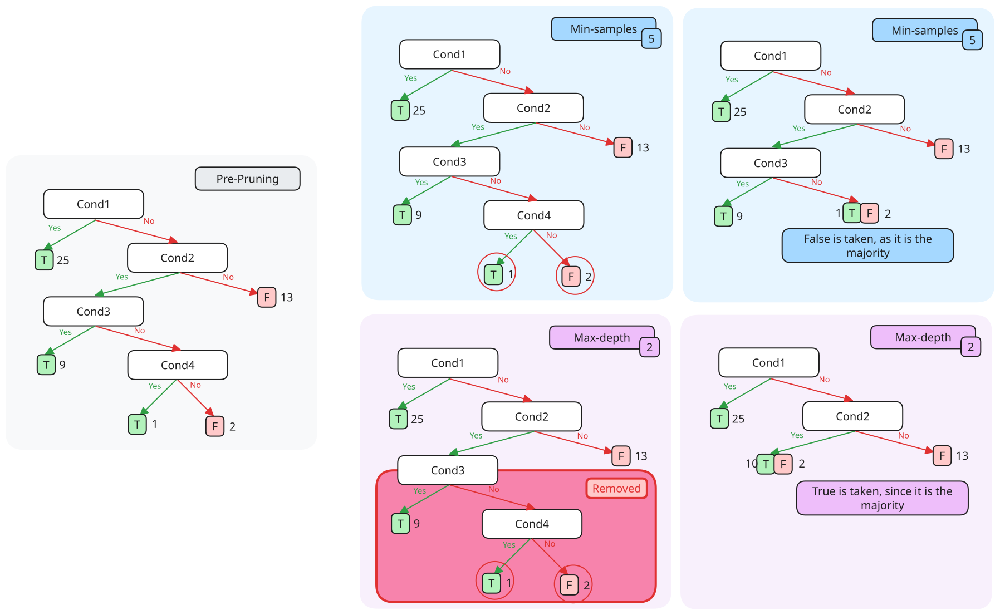

---
tags:
  - CS2109S
  - artificial_intelligence
  - machine_learning
  - supervised_learning
  - decision_tree
---
A decision tree represents a function that
- takes in an input vector of attribute values
- returns a single output value

```python
def DTL(examples, attributes, default):
	if examples is empty:
		return default
	if examples have same classification:
		return classification
	if attributes is empty:
		return mode(examples)
	best = choose_attribute(attributes, examples)
	tree = a new decision tree with root best
	for v in best:
		examples = {rows in examples with best = v}
		st = DTL(examples, attributes - best, {best})
		add branch to tree with label v and subtree st
		
```
# Expressiveness

> [!definition] Expressiveness
> Roughly speaking, a more expressive representation can capture, at least as concisely, everything a less expressive one can capture, plus some more. _(from textbook)_

 A decision trees can express any function of the input attributes. Effectively, this means that the hypothesis class contains all the possible hypothesis that can be gathered from the input attributes.

> [!note] 
> There is a consistent decision tree for any consistent training set, but probably won't generalise to new examples.

The size of the hypothesis class can then be generalised to, given $n$ Boolean attributes
$$2^{2^{n}}$$
as the number of boolean functions refers to the number of distinct truth tables with $2^{n}$ rows.

# Finding a Decision Tree

> [!abstract] Recursively select the most informative attribute.

## Informativeness

> [!note] The following is adapted from the textbook. The slides use different notation, specifically $I(v_{1}, ....)$ for entropy.

**Entropy** is a measure of randomness defined as

$$
\begin{aligned}
H(V) &= \sum\limits^{k}_{i=1}P(v_{k})log_{2}\frac{1}{{P(v_{k})}} \\
&= -\sum\limits^{k}_{i=1}P(v_{k})log_{2}P(v_{k})
\end{aligned}
$$
where every item $v_{i}\in V$ is a value possible. 

> [!example] 
> Fair coin flip = {heads, tails}
> Four-sided die = {1, 2, 3, 4}


We can define $B(q)$ as the entropy of a random Boolean variable true with probability $q$:

$$
B(q) = -(qlog_{2}q + (1-q)log_{2}(1-q))
$$

Thus, we want to keep the most Information Gain $IG$, where

$$
IG(A) = H(output) - remainder(A)
$$

where the remainder refers to the entropy of the dataset without a specific feature. 

> [!note] Information gain effectively refers to how much information is gained with a feature by checking the amount of information lost when removing the feature from the set. Mathematically, it is understood as the expected reduction in entropy.

To work out what is the best decision tree, we can choose the tree branch based on the highest information gain.

> [!important] How to calculate information gain: step by step

Since information gain is the expected reduction in entropy, we can calculate the entropy of the dataset by first calculating the expected entropy remaining after testing the attribute.

$$
Remainder(A) = \sum\limits^{d}_{k=1} \frac{p_{k}+n_{k}}{p+n} B(\frac{p_{k}}{p_{k}+n_{k}})
$$

The information gain can then be calculated simply by

$$
\begin{aligned}
IG(A) &= H(output) - Remainder(A) \\
&= B\left(\frac{p}{p+n}\right)- Remainder(A)
\end{aligned}
$$
# Pruning

Pruning is the process of reducing the size of a decision by removing parts of the tree.

There are two types of pruning:
- **min-sample leaf**: set a minimum threshold for number of samples required to be in a leaf node
- **max-depth**: set a maximum threshold for depth of decision tree

> [!pros] Pruning results in a smaller tree, which may have higher accuracy


# Data Preprocessing

For continuous values to be used in decision trees, they need to be binned (partitioned into a discrete set of intervals).

Similarly, if there are missing values, approaches could be to
- assign the most common value of attribute
- assign most common value of attribute with same output
- assign probability
- drop attribute
- drop rows