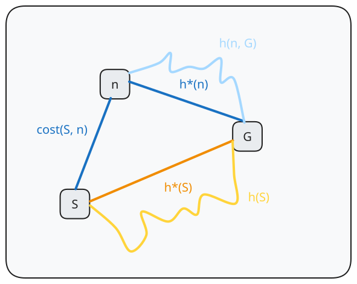

```
create frontier

insert Node(initial_state) to frontier:

while frontier is not empty:
	node = frontier.pop()
	if node.state is goal:
		return solution

	for action in actions(node.state):
		next_state = transition(node.state, action)
		frontier.add(Node(next_state))

return failure
```
# Motivations

These algorithms are used when there are extra information - such as a heuristic function describing the cost.
# Heuristics

> [!definition] Heuristic
> An estimate of the optimal path cost from any state to the goal state.
> > [!example] Straight-line distance $h_{SLD}$, Manhattan distance $h_{MD}$.

## Admissibility

> [!definition] Admissible
> An admissible heuristic is one that never overestimates the cost to reach a goal (therefore an optimistic heuristic)

A heuristic $h(n)$ is **admissible** if for every node $n$, $$h(n) \leq h^{*}(n)$$ where $h^*(n)$ is the optimal path cost to reach the goal state from $n$.

Given $n$ heuristics $h_i(n)$ which are all admissible,

$$
\frac{\sum\limits^{n}_{i=1}h_{i}(n)}{n}
$$

is also admissible by definition. This can be seen by the proof:

$$
\begin{aligned}
h_{i}(n) & \leq h^{*}(n) \forall i \\
\sum\limits^{n}_{i=1}h_{i}(n) & \leq n(h^{*}(n)) \\
\frac{\sum\limits^{n}_{i=1}h_{i}(n)}{n} & \leq h^{*}(n) \\
\end{aligned}
$$

### Inventing Admissible Heuristics

A problem with **fewer restrictions** on the actions is called a **relaxed problem**. The cost of an optimal solution to a relaxed problem is an **admissible heuristic** for the original problem.

> [!example] Relaxing a navigation problem
> Original problem: Agent can only move on roqads
> Relaxations: Agents can move off road - use $h_{SLD}$, or can teleport - use $1$
 
## Consistency


A heuristic is **consistent**, if for every node $n$, every successor $n'$ of $n$ generated by any action $a$, 

$$h(n) \leq c(n, a, n') + h(n')$$ 

and 

$$h(G) = 0$$

> [!remark] Triangle inequality
> This is a form of the triangle inequality, stipulating that a side of a triangle cannot be longer than the sum of other two sides.

> [!note] Stronger property of admissibility
> Every consistent heuristic is admissible, but not vice versa.

Given $n$ heuristics $h_i(n)$ which are all consistent,

$$
\frac{\sum\limits^{n}_{i=1}h_{i}(n)}{n}
$$

is also consistent by definition.  Proof is trivial and similar to proving that average of all admissible heuristics is also admissible.


## Dominance

If $h_{1}(n) \geq h_{2}(n)$ for all $n$, then $h_{1}$ dominates $h_{2}$,
- $h_{1}$ is better for search if admissible.

> [!note] 
> If a heuristic is dominant over the other, and admissible, it means that the heuristic function returns results closer to the actual cost since it does not overestimate the cost at all time.
# Best-first Search

```
create frontier: PriorityQueue(f(n))

insert Node(initial_state) to frontier:

while frontier is not empty:
	node = frontier.pop()
	if node.state is goal:
		return solution

	for action in actions(node.state):
		next_state = transition(node.state, action)
		frontier.add(Node(next_state))

return failure
```

## Greedy best-first search

$$
f(n) = h(n)
$$

## A-Star search

$$
f(n) = g(n) + h(n)
$$

where $g(n)$ refers to the cost to reach $n$, and $h(n)$ is the estimated cost from $n$.

> [!tldr] Analysis
> 
> **Time complexity** (number of nodes generated): Exponential
> **Space complexity** (size of frontier): Exponential with regards to the depth of the optimal solution
> **Completeness**: Complete, if edge cost is the same
> **Optimality**: Optimal, if step cost is the same.

> [!theorem] If $h(n)$ is admissable, A* search using search (with visited memory) is optimal.

> [!theorem] If $h(n)$ is consistent, A* search using search (with/without visited memory) is optimal.
> Note that consistency implies admissability, so the first property holds.

However, inadmissibility of a heuristic does not automatically disqualify A* from being cost-optimal. There are two cases in which this does not hold:
- If there is a cost-optimal path on which $h(n)$ is admissible on all nodes $n$, regardless of whether $h$ is admissible on all the other states off the path, that path will be found regardless.
- If the optimal solution has cost $C^{*}$ and second best has cost $C_{2}$, if $h(n)$ overestimates costs, but never by more than $C_{2}-C^{*}$, $A^{*}$ is still guaranteed to return cost-optimal solutions (without visited memory)