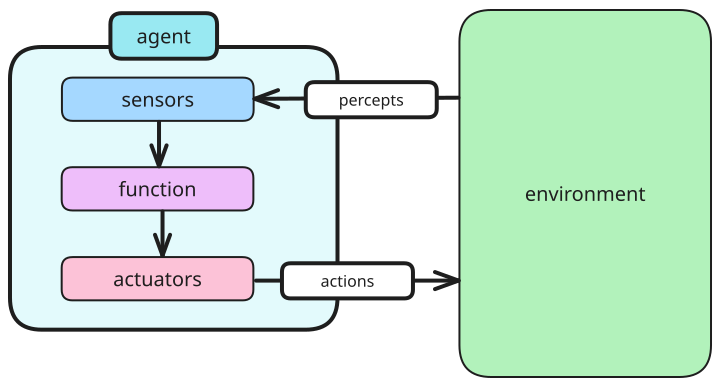
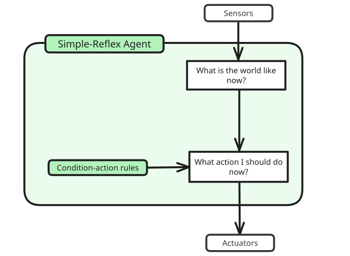
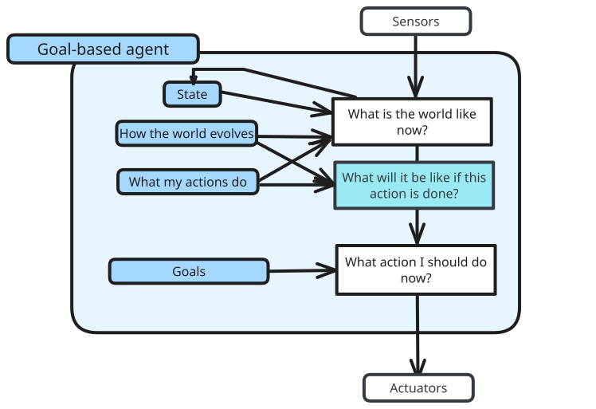
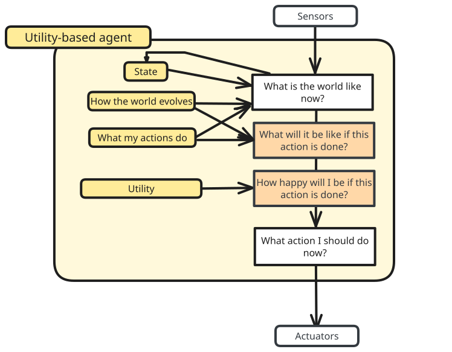
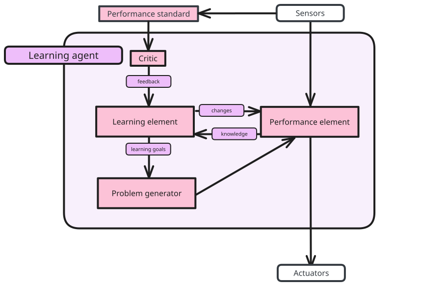

# PEAS Framework

> [!important] PEAS Framework
> - Performance measure
> - Environment
> - Actuators
> - Sensors

> [!example] Taxi driver
> **P**: Safety, speed, legal regulations, comfort, profit, impact on other road users
> **E**: Roads, other traffic, police, pedestrians, customers, weather
> **A**: Steering, accelerator, brake, signal, horn, display
> **S**: Cameras, radar, speedometer, GPS, engine sensors, accelerometer, microphones, touchscreen
## Performance Measure

Performance measures are things to consider for the agent, such as:
- fit (Who is the agent best for?)
- purpose (What is being optimised)?
- information available
- side-effects (What, if there are, are unintended effects)
- costs

> [!definition] Rational agents
> Agents that choose actions that maximise performance measure.
## Environment

> [!summary] Properties of the task environment
> - Fully vs partially observable
> - Episodic vs sequential

### Observability

A **fully observable** environment allow its' agents' sensors to give it access to the complete state of the environment at each point in time.

> [!example] A chessbot's environment is fully observable
> The agent is able to see the whole state of the environment, which is all the pieces on the chessboard, and their positions at one time.

> [!example] A smart driving system's environment is partially observable
> The agent is only able to see the state of the environment around them, and not the state of the environment further away from them (limited information)

### Episodic (vs sequential)

An **episodic** agent's experience is divided in different atomic episodes, consisting of a perception and an action, and the choice of action depends only on the episode itself.

If this is not followed, the agent is thus **sequential**.

> [!example] A chessbot's environment is sequential
> The choice of move made depends on the state and the moves made on the board before.

> [!example] A TicTacToe bot's environment is episodic
> The choice of move only depends on the current state of the game.
### Static (vs dynamic)

A **static** environment is unchanged while deliberating.

If it changes, then it is considered **dynamic**. If the environment itself does not chnage with the passage of time, but the agent's performance score does, then it is **semi-dynamic**.

> [!example] A chessbot's environment can be static, or semi-dynamic
> The chessboard does not change while the agent deliberates over the action. However, it can be considered semi-dynamic, in cases where there is a time element to the game, causing there to be a drop in performance score.

> [!example] A self-driving system 's environment is dynamic
> The self-driving system's environment will change as it moves across the roads.

### Discrete (vs continuous)

A **discrete** environment has a limited number of distinct, clearly defined percepts and actions, while a **continuous** environment does not.

> [!example] A chessbot's environment is discrete
> There are a limited number of moves that a piece can take and there is a limited number of states of the board.

> [!example] A self-driving system's environment is continuous
> There is an infinite amount of actions that can be taken by the system, and an infinite amount of states at any point of time.

### Single-agent (vs multi-agent)

A **single-agent** environment dictates that the agent is operating by itself, while a **multi-agent** environment dictates otherwise.

> [!example] A Solitaire agent is single-agent
> There is only one decision maker choosing the cards.

> [!example] A chessbot is multi-agent
> There are two agents - as there are two sides to the game.

# Agent Function

> [!definition] Agent function
> The agent function maps from percept histories $\mathcal{P}$ to actions $\mathcal{A}$:
> $$
> f: \mathcal{P} \rightarrow \mathcal{A}
> $$
> > [!note] Agent program
> > The agent program is then an implementation on the physical architecture of the agent to produce the function $f$, given an input.

Thus, the agent itself is completely specified by the agent function. These agent function can follow (a combination of) common agent structures.
## Agent Structures

### Simple reflex agents

The simple-reflex agent structure is a simple structure that takes the precepts, passes it through some condition-action rules to decide the action taken.

> [!example] 
> A condition-action rule that can be seen is:
> - if the front is movable, move
> - else, move downwards

### Goal-based agent structure

The goal-based agent structure evaluates the agent based on what happens if the action is done, and if it matches the goal taken.
### Utility-based agent

The utility-based agent structure evaluates the agent based on how "happy" the agent is if the action is done. This utility usually has a measure of its own, which also has to be determined.

### Learning agent

# Exploration vs Exploitation

Agents can choose to explore or exploit based on their current knowledge.

> [!definition] Exploration
> Learning more about the environment around it

> [!definition] Exploitation
> Maximising gain based on the current knowledge of the environment around it.

> [!example] 
> An agent can choose to go through a route it has already known (exploitation) or navigate through unknown routes to find a better route (exploration)