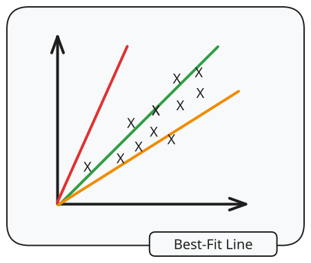
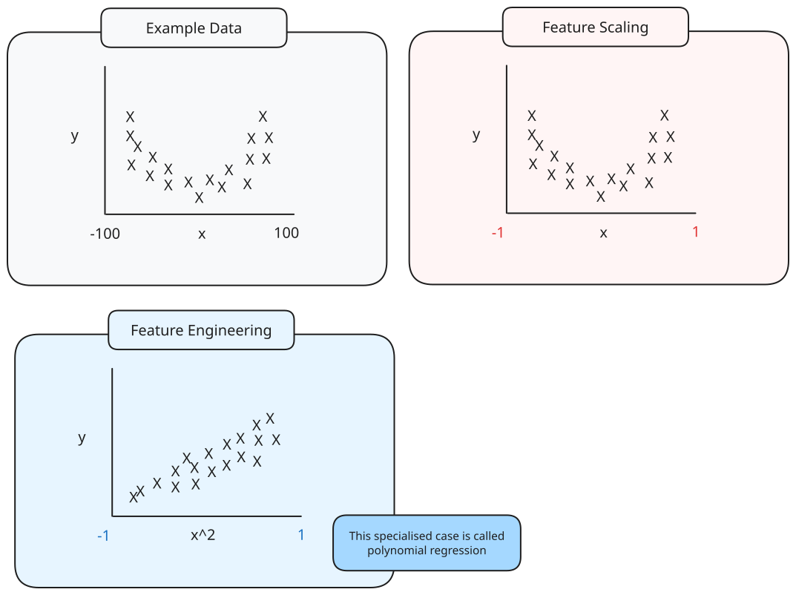
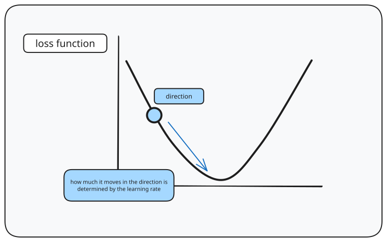

---
tags:
  - CS2109S
  - artificial_intelligence
  - supervised_learning
  - machine_learning
---
Linear regression is used for the hypothesis space for linear functions of continuous-valued inputs.

# Univariate linear regression

The function with input $x$ and output $y$,

$$
y = w_{1}x + w_{0}x
$$

where $w_{0}, w_{1}$ are real-valued coefficients to be learned is a univariate linear function.

This function aims to create the best fit line, finding $w_{0}, w_{1}$ that fits the data well.

To measure the fit of this best fit line, for a set of $m$ examples, 

$$
\{ ((x^{1},y^{1}), ..., (x^{m}, y^{m})) \}
$$

we can compute the **loss function** as follows:

$$
J_{MSE}(w) = \frac{1}{2m} \sum\limits^{m}_{i=1} (h_{w}(x^{i}) -y^{i})^{2}
$$

Note that:
- $\hat{y}^{i} = h_{w}(x^{i})$ - the prediction of $y$ is the result of the linear function

In matrix form, let $X$ be the input vector, $w$ be the function matrix, $Y$ be the output vector. Then, the error matrix can be seen as:

$$
\begin{aligned}
\hat{Y} & = Xw \\
E & = Xw - Y
\end{aligned}
$$

Thus, using the dot product, we can get the scalar value $e^2$, the sum of squared error, by doing the dot product $E \cdot E$.

To minimise the loss, we can
- naively enumerate all possible lines and find the one with the lowest mean squared error
- find the minimum mean squared error by considering loss landscape

To find the minimum mean squared error, we can differentiate the loss function, with regard to the weight $w_{1}$:

$$
\begin{aligned}
\frac{\delta}{\delta{w_{1}}}J_{MSE}(w) & = \frac{1}{2m} \frac{\delta}{\delta w_{1}} \sum\limits^{m}_{i=1}(w_{i}x^{i}-y^{i})^{2} \\
&  = \frac{1}{2m} \sum\limits^{m}_{i={1}} \frac{\delta}{\delta w_{1}} (w_{1}x^{i}-y^{i})^{2} \\
&= \frac{1}{2m} \sum\limits^{m}_{i={1}} 2 (w_{1}x^{i}-y^{i})^{2}\frac{\delta}{\delta w_{1}} (w_{1}x^{i}) \\
& = \frac{1}{m} \sum\limits^{m}_{i=1} (w_{1}x^{i}-y^{i})x^{i}
\end{aligned}
$$
> [!note] The $\frac{1}{2}$ is for mathematical convenience.

In matrix form, this can then be seen as 

$$
\frac{\delta}{\delta w}J_{MSE}(w) = \frac{1}{m}X^{T}(XW - y)
$$
# Multivariate linear regression

The hypothesis becomes:

$$
\begin{aligned}
h_{w}(x) & = w_{0}x_{0} + ... + w_{i}x_{i} \\
& = \begin{bmatrix} w_{0} \\ .. \\ w_{i} \end{bmatrix}^{T} \begin{bmatrix} x_{0} \\ .. \\ x_{i} \end{bmatrix} \\
& = w^{T}x
\end{aligned}
$$

# Normal Equation

The cost function - the mean squared error - can be rewritten into matrix form:

$$
J(w) = \frac{1}{m}(Xw-Y)^{T}(Xw-Y)
$$

Note that
- $Xw$ refers to the predictions
- $Y$ refers to the actual values
- $\therefore$ $X{w}-Y$ refers to the matrix of errors $e$ $E$

To get the sum of squared errors, we can get the dot product of $E$ and its transpose $E^{T}E$.

We can then expand this to get

$$
\begin{aligned}
J(w) & = \frac{1}{m}(w^{T}X^{T} - Y^{T})(Xw-Y) \\
& = \frac{1}{m}(w^{T}X^{T}Xw-Y^{T}Xw - w^Tx^TY+Y^{T}Y)
\end{aligned}
$$

Note that these are dot products, so $w^{T}w = w^{2}$, and similarly $Y^{T}Xw = w^Tx^TY$.

Minimising $J(w)$, compute the derivative of $J(w)$ with respect to $w$, $\frac{\delta{J(w)}}{\delta{w}}$ and find the value when it is $0$ (at minimum):

$$
\begin{aligned}
\frac{\delta{J(w)}}{\delta{w}} & = \frac{1}{m}(2X^{T}Xw - 2X^{T}Y) \\
X^{T}Xw & = X^{T}Y
\end{aligned}
$$

Assuming that $X^{T}X$ is invertible, we can get $w$:

$$
w = (X^{T}X)^{-1}X^TY
$$

> [!pros] 
>  - Feature scaling is unnecessary
>  - Single iteration
>  - No need to find learning rate $\upgamma$

> [!cons]
> - Slower as calculating the inverse of $X^{T}X$ can be a problem of $O(n^{3})$
> - $X^{T}X$ needs to be an invertible matrix

# Feature Transformations

## Feature engineering

> [!note] Feature engineering
> Based on existing features, new features are created.

- Polynomial features: creation of new features $z = x^{k}$, where $k$ is the polynomial degree.
- Log features: creation of new features $z = log(x)$
- Exponential features; creation of new features $z = e^x$

## Feature scaling

> [!note] Feature scaling
> The features are scaled to be represent the relative distance between each feature.

- mean normalisation (standardisation) $x_{j} \leftarrow \frac{x_{j}-\mu_{j}}{\sigma_{j}}$ 
- min-max scaling $x_{j} \leftarrow \frac{x_{j}-minx_{j}}{max(x_{j})-min(x_{j})}$
- robust scaling

> [!note] An alternative to feature scaling would be to use separate learning rate $\upgamma$ for different features.
# Gradient descent

## Basic concepts

Vectors:
- column vector $w = \begin{bmatrix} w_{0} \\ w_{1} \\ .. \\ w_{n} \end{bmatrix}$ and row vector $w^{T}$ = $\begin{bmatrix} w_{0} & w_{1} & ... & w_{n} \end{bmatrix}$
- dot product $u^{T}v =\begin{bmatrix} w_{0} & w_{1} & ... & w_{n} \end{bmatrix} \begin{bmatrix} w_{0} \\ w_{1} \\ .. \\ w_{n} \end{bmatrix} = \sum\limits^{n}_{j=0}u_{j}v_{j}$
- the partial derivative of a loss function by $w_{i}$ $\frac{\delta}{\delta{w_{i}}}J(w)$ 
- the gradient: the vector of all the partial derivatives $\begin{bmatrix} \frac{\delta}{\delta{w_{0}}}J(w) \\ \frac{\delta}{\delta{w_{1}}}J(w) \\ ... \\ \frac{\delta}{\delta{w_{n}}}J(w) \end{bmatrix}$

> [!theorem] MSE loss function is convex for linear regression
> There is only one minimum, which acts as the global maximum
## Idea

- Start at a weight $w$
- Pick a nearby $w$ that reduces the loss $J(w)$

$$
w_{j} \leftarrow w_{j} - \upgamma \frac{\delta}{\delta{w_{j}}}J(w_{0}, w_{1}, ...)
$$

- $\upgamma$ is the learning rate - the parameter that controls how much a model adjusts its parameter during training
- Repeat until the minimum is found

> [!important] When calculating gradient descent for multiple variables, make sure not to update the variables before calculating the step size for all the variables.

## Convexity

> [!theorem] A convex function has a single global minimum

> [!theorem] MSE loss function is convex for linear regression.

MSE loss function is convex for polynomial regression, as feature transformations do not modify the linear regression model, but just the features themselves. Hence, convexity is unaffected.
## Variants

> [!note] Stochastic gradient descent
> Randomly selects one training example at each step and updates according to the gradient descent equation.

> [!note] Mini-batch gradient descent
> Chooses a mini-batch of size $m$ from $n$ examples.

As $J(w_{i})$ is proportional to $\sqrt{n}$, the standard error increases by a factor of $\sqrt{\frac{m}{n}}$, meaning even if there are more steps, it can still be faster than full batch stochastic gradient descent.

> [!important] As the amount of datapoints decreases, the cost of gradient descent is cheaper per iteration

> [!important] As the amount of datapoint decreases, the randomness increases, causing a possibility of escaping local minima.
