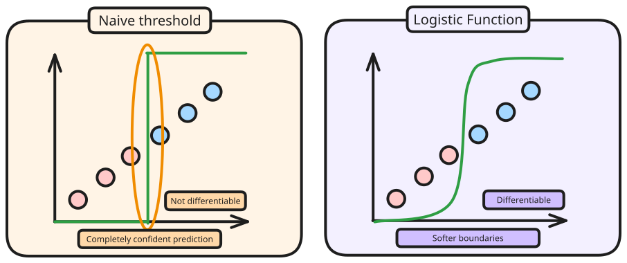
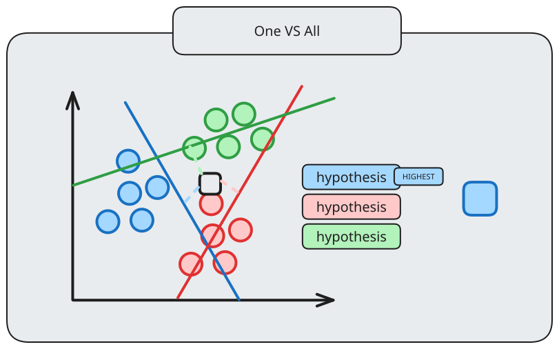
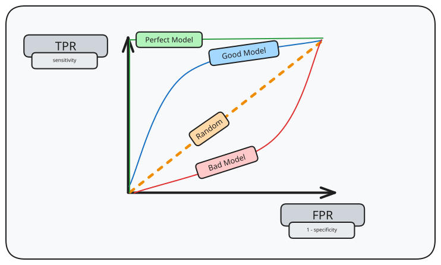
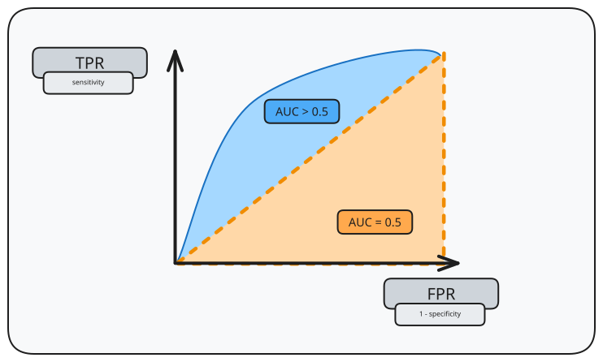
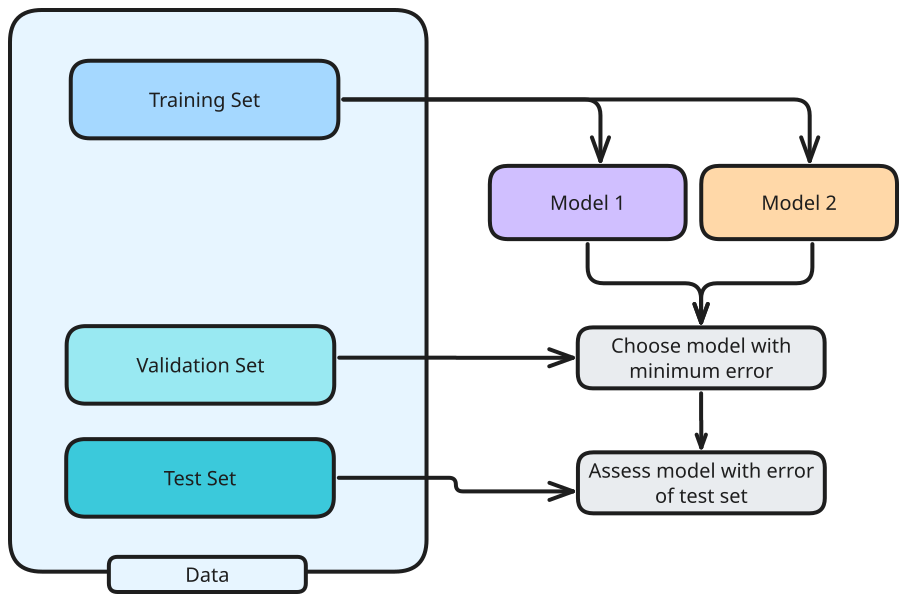
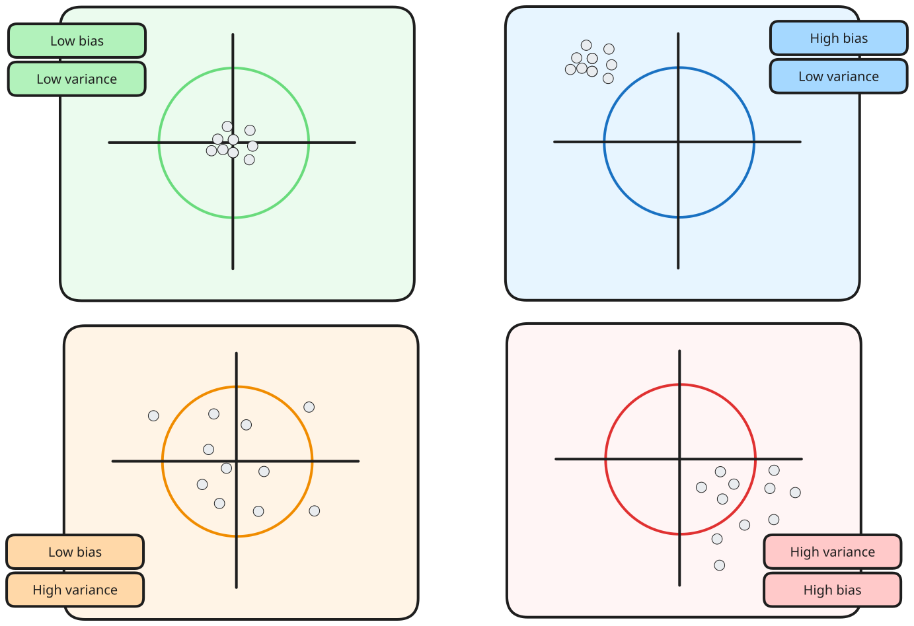
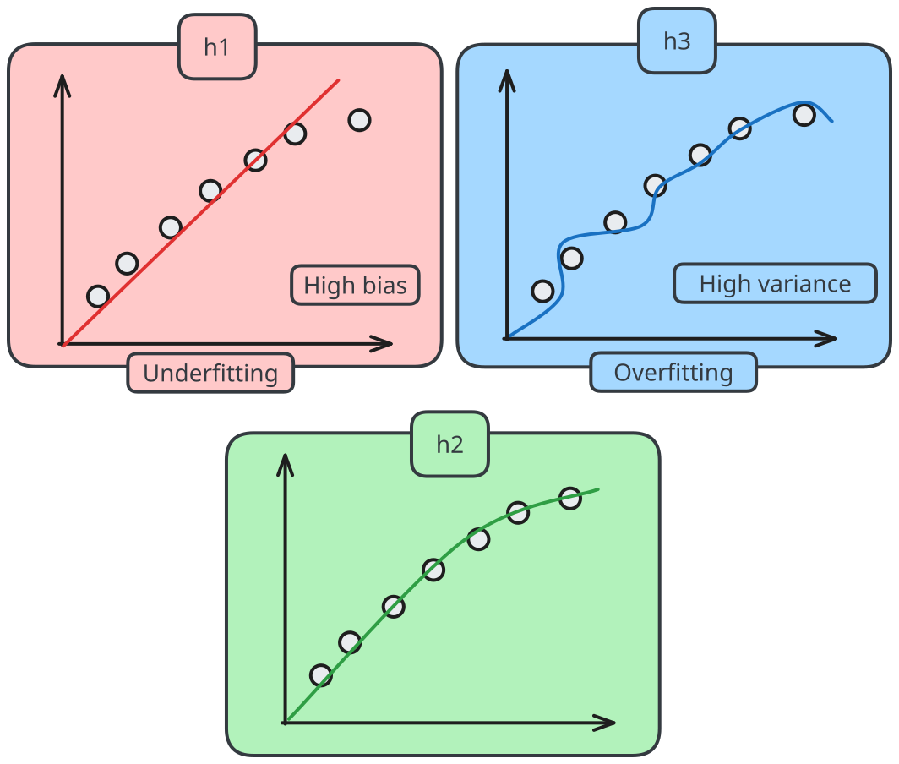

---
tags:
  - CS2109S
  - artificial_intelligence
  - machine_learning
  - supervised_learning
---
> [!motivation] 
> Decision trees work well with discrete/categorical inputs with low options. However, it does not work well if there are a lot of continuous inputs.
> 

Logistic regression aims to use the continuous value output probability for classification.

Thus, to utilise logistic regression as the classifier, we have to determine the step function to identify which points should be given which classification, i.e. a function $h(x)$ which returns the value $1$ or $0$ for a binary classifier.



However, there are multiple issues related to the naive threshold.
- Hypothesis $h_w$ is not differentiable, and is a discontinuous function, making it unpredictable
- The classifier always announces a completely confident value, even for examples close to the boundary.

Softening the threshold function, we can then approximate the hard threshold with a continuous, differentiable function, that is similar in shape. The logistic function, also known as the sigmoid function can be seen as:

$$
\sigma(z) = \frac{1}{1+e^{-z}}
$$

which effectively makes the hypothesis function 

$$
h_{w}(z) = \frac{1}{1+e^{-z \cdot w}}
$$

The sigmoid function is differentiable, with derivative:

$$
\sigma'(x) = \sigma(x)(1-\sigma(x))
$$
# Measuring Fit

For linear regression, the loss function $J_{MSE}(w)$ was used.

Using the MSE loss function for logistic regression, 
$$
\begin{aligned}
J_{MSE}(w) &= \frac{1}{2m}\sum\limits^{m}_{i=1}(h_{w}(x^{i}) - y^{i})^{2}\\
&= \frac{1}{2m}\sum\limits^{m}_{i=1}(\frac{1}{1+e^{-w_{0}+w_{1}x_{1}+...}} - y^{i})^{2}
\end{aligned}
$$

Note that the exponential function causes the function to be **non-linear**, which makes it **non-convex**. Thus, if we use the same gradient descent function to find it, we can stumble towards a local minima.

## Cross-Entropy

The cross-entropy for $C$ classes gives the value:

$$
CE(y, \hat{y}) = \sum\limits^{C}_{i=1}-y_{i}log(\hat{y}_{i})
$$

where $y$ refers to the true value, and $\hat{y}$ refers to the predicted value.

Building on from that, the **binary** cross-entropy $BCE$ ($CE$ on 2 classes) can be then calculated:

$$
BCE(y, \hat{y}) = -ylog(\hat{y}) - (1-y)log(1-\hat{y})
$$

Thus, the binary cross entropy loss can be computed:

$$
\begin{aligned}
J_{BCE}(w) &= \frac{1}{m}\sum\limits^{m}_{i=1} BCE(y^{(i)}, h_{w}(x^{(i)})) \\
\frac{\delta}{\delta{w_{j}}}J_{BCE}(w) &= \frac{\delta}{\delta{w_{j}}} \frac{1}{m} \sum\limits^{m}_{i=1} BCE(y^{(i)}, h_{w}(x^{(i)})) \\
\frac{\delta}{\delta{w_{j}}}J_{BCE}(w) &= \frac{1}{m} \sum\limits^{m}_{i=1} BCE(y^{(i)}, h_{w}(x^{(i)}))w_{j}
\end{aligned}
$$

In matrix form, this can be seen:

$$
\frac{\delta}{\delta{w}}J_{BCE}(w) = \frac{1}{m}X^{T}(\sigma(XW) -y)
$$

# Logistic Regression with Many Attributes

Given $n$ features, the hypothesis becomes:

$$
\begin{aligned}
h_{w}(x) &= \sigma(w_{0}x_{0}+...w_{n}x_{n}) \\
&= \sigma\left(\sum\limits^{n}_{j=0}w_{j}x_{j}\right)\\
&= \sigma(w^{T}x)
\end{aligned}
$$

where $\sigma(z) = \frac{1}{1+e^{-z}}$, and with the weight update:

$$
w_{j} \leftarrow w_{j} - \upgamma \frac{\delta}{\delta{w_{j}}}J_{BCE}(w_{0}, w_{1}, ...)
$$

When dealing with non-linear decision boundaries, first consider the general form of a linear regression, 

$$
h_{w(x)}= w_{0}+w_{1}f_{1}+...w_{n}f_{n}
$$

where $f_{n}$ refers to a transformed feature - perhaps $x_{n}^{2}$.

Thus, the decision boundary then becomes for logistic regression, 

$$
h_{w(x)}= \sigma(w_{0}+w_{1}f_{1}+...w_{n}f_{n})
$$
# Multi-class Classification

This section refers to how classification is done when there are multiple classes. 
## One vs All

In this method, the probability returned by the $h_{w}$ is tested with all of the classes, and the highest probability is the class that is assigned to the prediction.



## One vs One

Alternatively, the classifier is fit for every pair, and the one with the most wins is chosen as the class.


# Performance Measure

## TPR/FPR

Referring back to the confusion matrix:

|                                   |                                   |
| --------------------------------- | --------------------------------- |
| True Positive                     | False Positive **(Type I error)** |
| False Negative **(Type 2 error)** | True Negative                     |

The True Positive Rate, and the False Positive Rate is calculated simply as,

$$
TPR=\frac{TP}{TP+FN}, FPR=\frac{FP}{FP+TN}
$$

## Receiver Operator Characteristic (ROC) Curve



The ROC curve is the curve plotted by plotting the True Positive Rate against the False Positive Rate. The model is considered more accurate than random chance if its ROC curve is above the diagonal random line.

For a more concise metric, consider the Area Under Curve (AUC) of ROC:



The AUC is a concise metric, enabling clearer comparisons.

> [!important] Interpretation
> $AUC > 0.5$ means model is better than chance.
> $AUC \approx 1$ means model is very accurate.

# Model Evaluation

To determine how good a model is, there are multiple questions to address: 
- which hyperparameters are picked
- which features are picked
- how is hypothesis picked

The goodness of a model/hypothesis $h$ is measured as follows:

$$
J_{D}=\frac{1}{N}\sum\limits^{N}_{i=1}error(h(x^{(i)},y^{(i)}), (x^{i},y^{i}) \in D
$$

where $error$ refers to any error functions such as $MSE$, $1-accuracy$, cross-entropy.



> [!note] We cannot just use two sets of data, and assess the model fully based on the error of the test set, as this can cause bias.

## Bias and Variance



> [!definition] Bias
> The difference between the estimator's expected value and the true value of the parameter being estimated.

High bias can cause algorithms to miss relevant relations between features and target outputs, resulting in **underfitting**.


> [!definition] Variance
> Error from sensitivity to small fluctuations in training set

High variance can happen from algorithm modelling random noise in the training data, resulting in **overfitting**.

Consider three models:

$$
\begin{aligned}
h_{1}(x) &= w_{0}+w_{1}x \\
h_{2}(x) &= w_{0}+w_{1}x+w_{2}x^{2} \\
h_{3}(x) &= w_{0}+w_{1}x+w_{2}x^{2}+w_{3}x^{3} \\
\end{aligned}
$$

This might result in the following:



# Hyperparameter Tuning

To find the best model:

```
hyperparameters = pick_hyperparameters
model = train(hyperparameters, data)
evaluate(model)
```

The methods for hyperparameter tuning are:
- grid search (exhaustively try all possible hyperparameters)
- random search (randomly search hyperparameters)
- successive halving (use all possible hyperparameters, with reduced resources, and successively increase them with smaller set of hyperparameters)
- Bayesian optimisation
- evolutionary algorithms