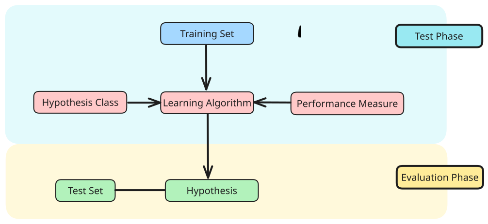

Supervised learning learns to map **inputs** to **outputs** by minimising the difference between its predictions and the provided correct outputs/answers (**ground truth**). 
- the learning phase is called the **training phase**
- the dataset used is the **training set**
- the trained agent function is called a **model/hypothesis**

When learning is done, the model can predict the output for new/unseen data
- this phase is called **testing/evaluation** phase
- the **test set** can be used to measure the **perfomance** of the model
- performance on unseen data measures **generalisation** of the model

> [!abstract] Summary
> Given a training set $d_{train}$ generated by an unknown function $y = f^{*}(x)$, find a function $h$ that approximates closely $f^{*}$.

# Tasks

**Classification**: A type of supervised learning where the goal is to predict a **discrete label or category** based on input features
- output: **categorical value**

> [!example] Tumour classification
> A tumour can be classified by benign, or malign

**Regression**: A type of supervised learning where the goal is to predict a **continuous numerical value** based on input features
- output: **real number**

> [!example] Housing price prediction
> Given a set of housing prices historically, future prices can be projected.

# Dataset

The dataset is represented as a set of $n$ pairs
$$
(x^{(i)}, y^{(i)}) \; for \; i= 0,..,n
$$

where
- $x^{(i)}$ is the input to the output $y^{(i)}$

There is an assumed **underlying true relationship** between input features $x$ and labels $y$:
$$
y = f^{*}(x) + \epsilon
$$
where 
- $f^{*}(x)$ is the true but unknown function to generate label from input features
- $\epsilon$ is the error term which accounts for randomness or imperfections in data generations process
# Hypothesis Class

A hypothesis class $\mathcal{H}$ refers to the set of all possible models or functions (hypothesis/model) that maps from inputs $h: X \rightarrow Y$ that can be learned by a learning alogrithm.

> [!note] Goal
> Find a hypothesis/model $h \in \mathcal{H}$ that best approximates $f^{*}(x)$.

# Learning Algorithm

A learning algorithm $A$ takes in a training set $D_{train}$, consisting of pairs $(x^{(i)},y^{(i)})$ and seeks to find a model/hypothesis $h \in \mathcal{H}$ to approximate the true relationship between inputs and outputs.

$$
f^{*}(x) \approx h(x)
$$
# Performance Measure

Generally done using a **test set**

## Regression: Error

The performance measure can be computed using its **error**:
$$
\text{Absolute Error} = |\hat{y} - y|
$$
$$
\text{Squared Error} = (\hat{y} - y)^{2}
$$
where $y = h(x)$

It also can be computed using its **mean absolute error (MAE)**:
$$
MAE = \frac{1}{n}\sum\limits^{N}_{i=1}(|\hat{y} - y|)
$$

## Classification: Correctness

The **accuracy** can be used as a performance measure, which checks the amount of correct predictions, over the total amount of data.

$$Accuracy = \frac{1}{N}\sum\limits^{N}_{i=1}(\hat{y}^{i}=y^{i})$$

A confusion matrix can also be used:

|                                   |                                   |
| --------------------------------- | --------------------------------- |
| True Positive                     | False Positive **(Type I error)** |
| False Negative **(Type 2 error)** | True Negative                     |

The precision $\mathcal{P}$ refers to the preciseness of the positive predicted instances. This should be maximised if **false positives** are very costly (Type I chart).
$$
\mathcal{P} = \frac{TP}{TP+FP}
$$

The recall $\mathcal{R}$ refers to the percentage of how much actual positive instances are recalled. This should be maximised if **false negative** are very costly (Type II error).
$$
\mathcal{R} = \frac{TP}{TP+FN}
$$

The $F1$ score is a combination of the two metrics:
$$F1 = \frac{2}{\frac{1}{\mathcal{P}} + \frac{1}{\mathcal{R}}}$$
# Types

- [Decision Tree](Decision%20Tree.md)
- [Linear Regression](Linear%20Regression.md)