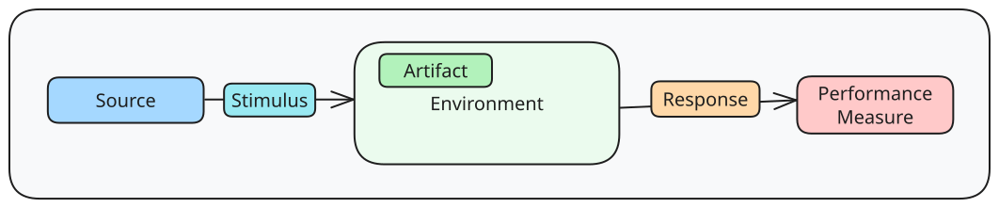
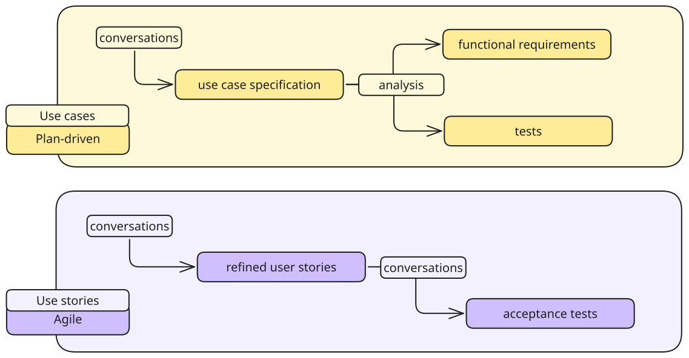
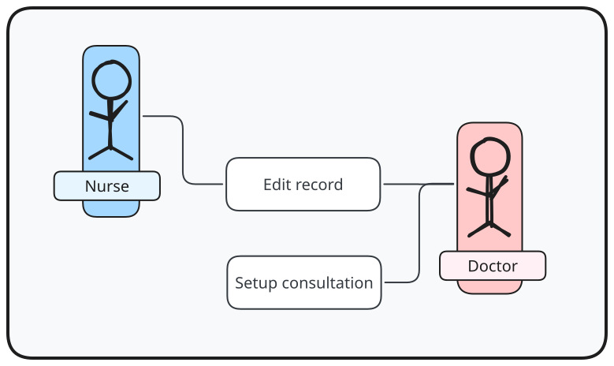
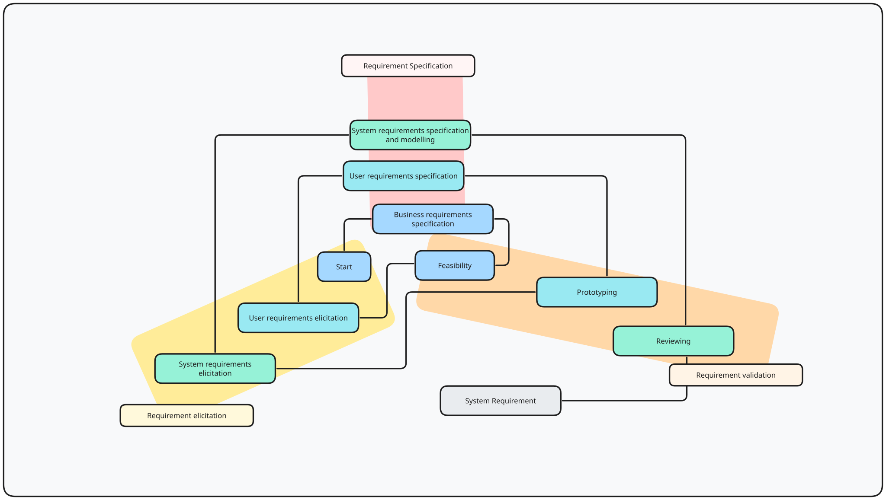
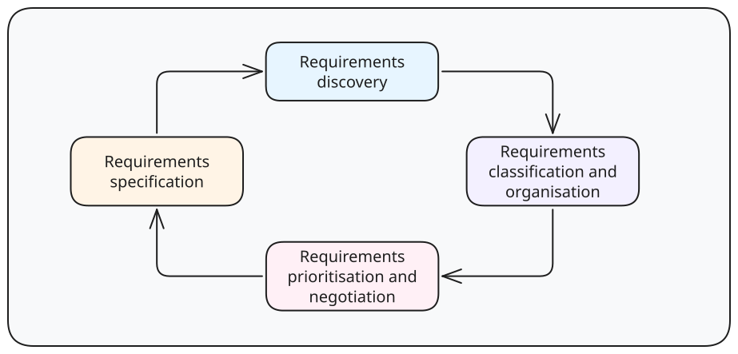

---
tags:
  - CS3213
  - software_engineering
---
> [!definition] Requirements
> Descriptions of services that a system should provide and constraints on its operation.

Requirements are a wicked problem.

Wicked problems are problems where
- there is no definitive formulation
- no stopping rule
- no true/false solutions, just better/worse
- no immediate/ultimate test of a solution
- every solution is a one-shot operation
- essentially unique
- no enumerable set of potential solutions
- a symptom of another problem
- social planner has no right to be wrong

> [!note] Challenges
> - Users' incomplete understanding of needs
> - Conflicting views of different users
> - Users' poor understanding of computer capabilities and limitations
> - Analysts' poor knowledge of problem domain
> - Easy to omit obvious information
> - Language barrier (+ technical jargon barrier)
> - Evolving requirements
> - Ill-defined boundary
> - Unnecessary design information
> - Vague and untestable

There is scientific and anecdotal evidence for high cost of errors during requirements. Requirements dictate the basis for many software engineering activities.

# Functional vs Non-Functional Requirements

> [!definition] Functional
> What system should do

Functionality does not determine architecture.

> [!definition] Non-functional
> Requirements not directly concerned with specific services delivered by system to its users.

Non-functional requirements (NFRs) can conflict with each other, for example
- adding security might cost performance benefits
- adding stability might increase complexity of the product

NFRs should be written **quantitatively** to make them measurable (and objectively tested.

> [!example]
> > [!failure] Not measurable
> > The throughput should be sufficiently high.
> 
> > [!success] Measurable
> > The throughput should exceed 60,000 queries per minute.

## Quality Attribute Scenarios



- Source
	- source of stimulus
- Stimulus
	- event arriving at system/project
- Artifact
	- where stimulus arrives
- Environment
	- set of circumstances in which scenario takes place
- Response
	- activity that occurs as a result of the arrival of the stimulus
- Performance measure
	- response should be measurable in some aspect
## NFRs

Usability: how easy it is for user to accomplish desired task, and kind of user support that system provides
- learning system features
- using system efficiently
- minimising user error
- adapting system for user needs


> [!example] Usability
> - Source: user
> - Stimulus: downloads a new application
> - Artifact: existing platform
> - Runtime: environment
> - Response: using it productively
> - Response measure: within 2 minutes of experimentation


Availability: if system is there and ready for task
- related to security and performance
- availability percentage (Service Level Agreement)
- possible metrics:
	- time interval when system must be available
	- time to detect fault
	- time to repair fault
	- time which system can be in degraded mode
	- proportion of certain class of faults prevented/handled without failing


> [!example] Availability
> - Source: server
> - Stimulus: crashes
> - Artifact: server software
> - Environment: any operational state
> - Response: detects abnormal state and re-routes traffic to another server
> - Response measure: within 5 seconds of server becoming unresponsive


Performance:
- possible metrics:
	- latency
	- number/percentage of satisfied requests (throughput)
	- number/percentage of unsatisfied requests
	- variance in response time jitter

Modifiability: about the cost of performing a degree
- possible metrics:
	- cost in terms of affected artifacts
	- effort
	- elapsed time
	- money
	- new defects
	- adaptation time


> [!example] Modifiability
> - Source: developer
> - Stimulus: change user interface
> - Artifact: user interface
> - Environment: design time
> - Response: change made
> - Response measure: within 3 hours to make and test change with no side effects

Deployability: about whether product is allocated to an environment for execution within a predictable and acceptable amount of time and effort
- possible metrics:
	- cost of deploying
	- percentage of failed deployments
	- repeatability of the process
	- traceability of the process
	- cycle time of the process

Energy efficiency
- possible metrics:
	- maximum/average killowatt load on system
	- average/total amount of energy saved
	- time period during which system must stay powered on

Security: ability to protect data from unauthorised attacks
- confidentiality, integrity, availability
- example of metrics:
	- size of compromise
	- accuracy of attack detection
	- amount of vulnerable data

Safety: ability to avoid straying into states that cause or lead to damage
- possible metrics:
	- amount/percentage of entries into unsafe states that are avoided
	- amount/percentage of unsafe states from which system can automatically recover
	- amount/percentage of shut down time

# Stakeholders

To identify stakeholders, identify the baseline stakeholders, such as the users and decision makers, and then explore their network.

Key activities involving the stakeholders include:
- **Elicitation and analysis**: discovering requirements by stakeholder interactions
- **Specification**: converting requirements into standard form
- **Validation**: checking that requirements define system wanted by custome

Plan-driven approaches put more emphasis into specification and validation.

## Elicitation and Analysis

Working with stakeholders to find out about the application domain, work activities, the services and system features that stakeholders want, the required performance of the system, hardware constraints and so on.

### Interviewing

- **Closed**: stakeholder answers predefined set of questions
- **Open**: no predefined agenda

Consider how questions are asked
- no leading questions
- no questions with a bias
- no true/false questions
### Document Analysis

Refers to examining any existing documentation available.

> [!pros]
> - might reduce time needed interacting with stakeholders
> - get corporate/industry or existing specification/standards

> [!cons]
> - documents may be out of date

### Questionnaires

> [!pros]
> - work well for large group of stakeholders
> - useful for prioritisation

> [!cons]
> - no follow-up
> - closed-ended questions

### Workshops

Facilitated sessions with multiple stakeholders from users to developers to testers.

> [!pros]
> - more effective for resolving disagreements
> - helpful when quick elicitation turnaround is needed

> [!cons]
> - resource intensive

A user story workshop includes everyone who can contribute to writing stories, to which the prioritisations can happen later by customer.

### Focus Groups

Facilitated sessions with a group of users, to explore different needs, impressions and preferences.

> [!pros]
> - useful for commercial products without access to end-users

### Prototyping

Developing a simplified model of the system - like a simple model (low-fidelity) or an executable model and simple implementation of the system (high-fidelity).

### Observation

Observing and analysing how people work.

> [!pros]
> - discover implicit system requirements

> [!cons]
> - cannot be used to identify new features

### Personas

Personas are an archetype of a user group, which can be used in meetings.

## Specification



### User Stories/Use Cases

> [!note] Used generally for agile systems

Focus on what users need to accomplish (user-centric view)

A user story describes functionality that is valuable.

```
As a <user>, I want <goal> so that <benefit>
```

> [!example]
> - As a customer, I want to be able to change my flight so that I can go at another time
> - As a customer, I want to purchase an upgrade ...

User stories generally contain three aspsects:
- Card: a written description of story used for planning and as a reminder
- Conversation: verbal exchange with customer to flesh details
- Confirmation: acceptance tests specified by customer can be used to determine when story is complete

### Epics

User stories that are large, and thus split into multiple stories during development later.

### Use Cases

> [!note] Used generally for plan-driven systems

Describes interaction between actor and system

```
<Verb> .. <Object>
```

> [!example]
> - change seats
> - purchase upgrade

Use-case diagrams in UML relates actors and use cases.



A use case can be structured as:
- Actors
- Description
- Data
- Stimulus
- Response
- Comments

> [!note] Scenario
> Description of a single instance of usage of the system.

Refines general use cases.

> [!note] Using natural language
> - invent standard format, ensure all requirement definitions adhere
> - use consistent language to distinguish mandatory and desirable
> 	- mandatory: shall, desirable: should
> - use text highlighting
> - avoid jargon/abbreviations/acronyms
> - associate rationale

## Validation

### Informal Reviews

- Peer review: someone else than author reviews
- Informal review: unstructured feedback
	- peer deskcheck
	- passaround
	- walkthrough
- Formal requirement reviews
- Inspection
	- involves multiple stakeholders
	- formal roles
	- defect checklist

### Requirements Document Checks

- Validity checks: reflect real needs of users
- Consistency checks: should not conflict
- Completeness checks: define all functions and the constraints intended by system user
- Realism checks: should be implementable within proposed budget
- Verifiability: written so that they are verifiable

### Feasability

- Does system contribute to overall objectives?
- Can system be implemented within schedule and budget using current technology
- Can system be integrated with other systems?

### Prototyping

- Version of system or part of system is developed quickly to check customer's requirements

### Testing

Test-case generation: Requirements should be testable and used to derive test cases

# RE Process Models

## Software Requirements Document

> [!definition] User requirements
> What services system is expected to provide to system users, and constraints under which it must operate.

> [!definition] System requirements
> More detailed descriptions of software system functions, services, and operational constraints.

User requirements are meant for client managers, system end-users, client engineers, contractor managers, and system architects, while system requirements are for system end-users, client engineers, system architects, and software developers.

## Spiral Model





- Discovery
	- discover requirements by interacting with stakeholders
	- domain requirements discovery
- Classification and Organisation
	- group related requirements
	- consider each stakeholder group as a viewpoint
- Prioritisation and Negotiation
	- resolve requirement conflict
- Specification
	- requirements are documented and input into the next round of spiral

User requirements specifications:
- always written in natural language
- understandable by system users who do not have detailed technical knowledge
- only external behaviour

System requirements specifications:
- may be written in natural language or other models
- expanded versions of user requirements that software engineers use as starting point for system design
- complete and detailed specification of whole system

# Requirements Management Planning

Concerned with establishing how a set of evolving requirements will be managed.

- Requirement identification: each requirement must be uniquely identified to be cross-referenced and used in traceability assessments
- Change management process: assess impact and cost of changes
- Traceability policies: define relationships between each requirement and between the requirements and system design
- Tool support