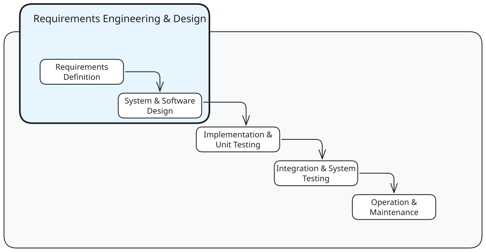
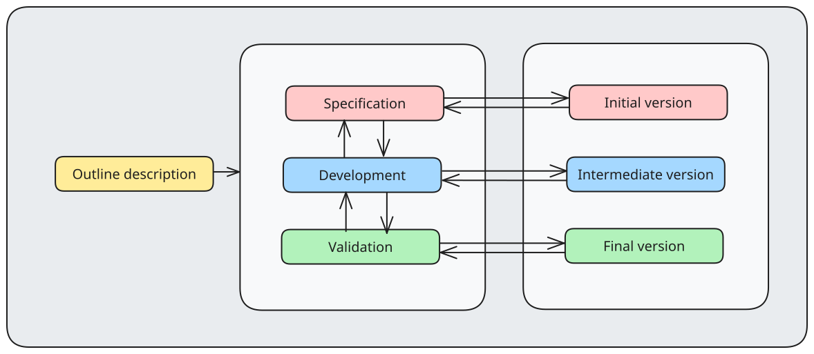
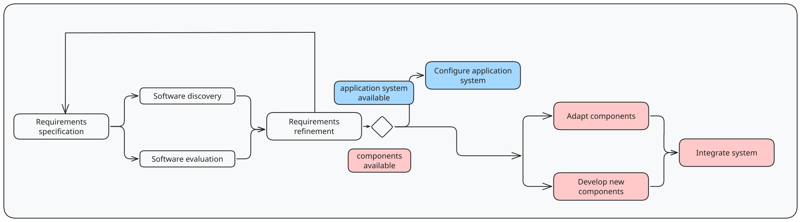
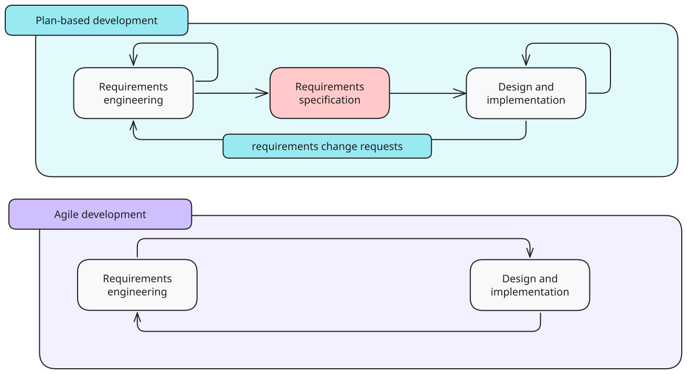
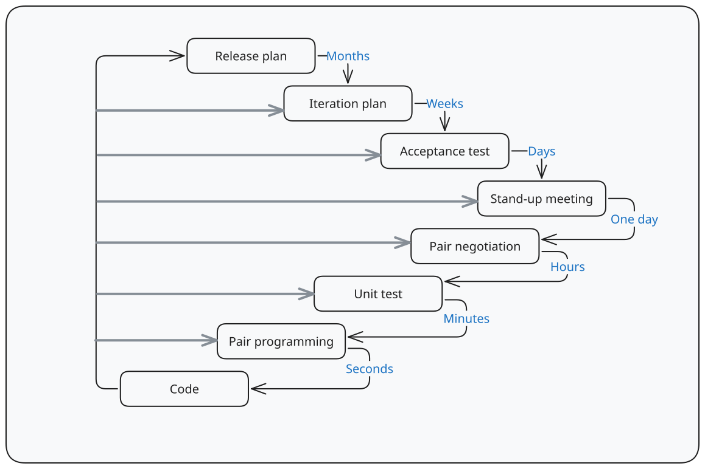
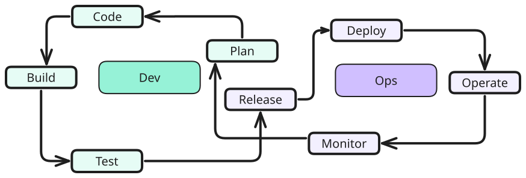

---
tags:
  - CS3213
  - software_engineering
---
> [!definition] Software processes
> A set of related activities that leads to the production of the software system

> [!definition] Software process model
> A simplified representation of a software process.

# Waterfall model

Waterfall model is a plan-driven **linear** software model.

> [!pros]
> - inflexible to change
> - errors in previous phase might require workarounds
> - issues discovered late

> [!example] Use cases
> - Embedded systems where software has to interface with hardware
> - Critical systems where there is a need for extensive safety and security analysis
> - Larger software systems

# Incremental development

In this process mdoel, the activities of specification, development and validation are interleaved, and the system is developed as a series of versions, with each version adding functionality to the previous version.

> [!pros]
> - Lower cost of change/responding to changing customer requirements
> - More rapid delivery of software

> [!cons]
> - Process is less measurable
> - Degrading system structure

# Reuse-based development

> [!pros]
> - Reduces the amount of software to be developed, which has advantage in terms of cost
> - Faster delivery of software

> [!cons]
> - Requirement compromises
> - Control over system evolution is lost

# Agile

Agile development focuses on
- delivering value in increments
- avoiding waste
- feedback loops and customer involvement
- adaptiveness to changing requirements

Manifesto:
- individuals and interactions over processes and tools
- working software over comprehensive documentation
- customer collaboration over contract negotiation
- responding to change over following a plan

Priorities:
- satisfy customer through early and continuous delivery of valuable software
- welcome changing requirements
- deliver working software frequently
- build projects around motivated individuals
- face-to-face conversation
- working software as measure of progress
- sustainable development
- technical excellence and good design
- simplicity
- self-organising teams
- constant reflections

## TPS

The Toyota Production System tackled the problem of overproduction and overcapacity with a **lean manufacturing system** or **JIT (just-in-time)**.

> [!definition] Lean
> Creating value and avoiding waste

Key concepts:
- Just-in-time process: Kanban
	- each process produces only what is needed for the next process in a continuous flow
- Jidoka: automation with human touch
	- when a problem occurs, equipment stops preventing defective products from being introduced
- Kaizen: continuous improvement
	- simpler and less expensive machinery, over time

## Waste

- Hardship in daily work
- Partially done work
- Extra processes
- Extra features
- Task switching
- Waiting
- Motion
- Defects

# Methods

## Scrum

General lightweight framework for project management that does not specify how to do requirements engineering and architecture. It focuses on delivering value via increments in sprints by proposing specific rules that have to be followed.

The pillars of Scrum are:
- transparency (process and work is visible)
- inspection (artifact and process is inspected frequently)
- adaptation (adjustments if unacceptable product)

The team is usually made of 
- a Scrum Master responsible for the Scrum process
- a Product Owner accountable for maximising the value of the product
- developers
### Sprint

A Sprint includes
- Sprint Planning
- Daily Scrums
- Sprint Review
	- present results to stakeholders and collaborate on what to do
- Sprint Retrospective
	- plan ways to increase quality and effectiveness
- Product Backlog
	- ordered list of what is needed to improve the product
	- long term goal
- Sprint Backlog
	- plan by and for developers to achieve Sprint Goal
with the goal to create a useful increment every sprint.

Important topics:
- Why is Sprint valuable?
- What can be done this Sprint?
- How will the chosen work be done?

Timeboxing:
- Sprint (1 month)
- Sprint planning (up to 8h)
- Daily scrum (15min)
- Sprint review (up to 4h)
- Sprint retrospective (up to 3h)

### Adoption

Problems with adopting Agile:
- business side is often slow to embrace Agile
	- lack of understanding
- general resistance
- mixed systems
- siloed systems causing delays
- scalability

## Kanban

Visual system based on Kanban boards where cards represent wokr items, and columns represent each stage of the process.

> [!definition] Flow
> Movement of potential value through a system

> [!note] Definition of Workflow (DoW):
> Explicit shared understanding of flow, whcih requires a definition of various concepts.

## Xtreme Programming

Pair programming refers to code produced by two developers working together
- one developer programmes
- other reviews and focuses on big picture
- programmers switch roles after a time period, and switch partners frequently
- collective ownership
	- any programmer can change any code in the project

Unit tests
- write unit test before code is written
- test for all potential cases where code can fail

Continuous integration
- development team always works on latest version of software

## DevOps

> [!motivation]
> Addresses conflicting interests between developers and operations.

Combines Development and Operations - getting the whole organisation to work together to deliver value and make production deployments routine and predictable.

The DevOps Research and Assessment (DORA) does research and advocation of DevOps, measuring performance by
- change lead time
- deployment frequency
- change fail rate
- failed deployment recovery time

Value stream mapping helps to identify and analyse value streams aiming to reduce or eliminate inefficiencies. This helps to identify inefficiencies in project activities such as regression testing, code review.

> [!definition] Blameless postmortems
> Investigating incident and discussing how to prevent related incidents in the future.

