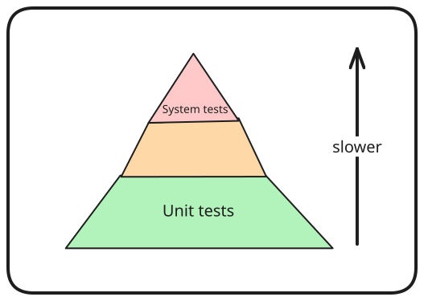
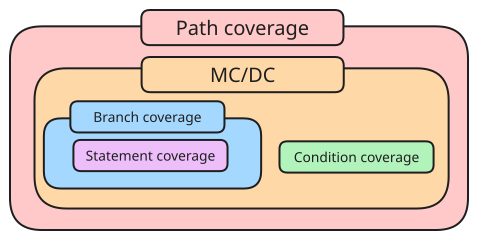

---
tags:
  - CS3213
  - software_engineering
  - software_testing
---
> [!warning] In progress.

> [!motivation]
> Defect testing: find bugs
> Validation testing: demonstrate system corresponds to the requirements,

> [!important] Verification vs validation
> Verification refers to whether the software conforms to its specification, and validation refers to whether the software does what the user requires.

Verification can refer to formal verification approaches, and validation can refer to testing, depending on the context.

The idea of **shifting left** means that there is a priority in discovering bugs early in the software development lifecycle to minimise the cost of bugs and repair in the future.

# Test Case

A test case is made of a test oracle and test inputs.

> [!definition] Test oracle
> A mechanism for determining whether a test has passed or failed.

> [!definition] Test inputs
>- Arguments to a function
>- System and environment state
>- Sequence of actions
>- Argument passed on the command line
>- Button on a graphical user interface

# Manual vs Automated Testing

Note that the view of the class is that test automation is part of testing by itself.

> [!definition] Automated testing
> Testing tool automatically generates a test input, and applies a test oracle.

> [!definition] Manual or exploratory testing
> Manually testing for defects with manual generation of test input

> [!note] Pesticide paradox
> Every method used to prevent or find bugs leavs a residue of subtler bugs against which those methods are ineffectual.

An example of the pesticide paradox is that in the use of fuzzers, there won't be a fuzzer that finds all the issues, and thus, we need to find a more comprehensive solution for a more complete set of testing.

# Testing Levels

Testing can be split into
- unit tests: individual components
- integration tests: multiple components
- system tests: whole system

## Unit Tests

> [!definition] Unit test
> Focus on testing a single unit

> [!pros]
> - Fast
> - Easy to control: typically check expected result values when passed a certain input value
> - Easy to write: require no additional setup

> [!cons]
> - Does not represent real execution of problem
> - Might not catch bugs that only happen while integrating with different components
> - Require mocks to simulate real object

## Integration Testing

> [!definition] Integration testing
> Tests multiple components of a system together

Integration testing focuses on two components: the current component, and an external component for which the integration is to be tested for.

> [!example]
> Check that query plan returned by current version of database system is converted correctly to the internal representation - integration test between the database and the internal component.

## System Testing

> [!definition] System testing
> Run system in entirety

> [!pros]
> - Realistic

> [!cons]
> - Slow
> - Harder to write
> - Prone to flakiness

It requires effort to determine whether a failing system test is due to non-determinisim, a regression in the application, or a bug in the external system.

# Test Flakiness

> [!definition] Test flakiness
> Tests that might non-deterministically pass or fail

Test flakiness lowers confidence in the test, causes the failures to be harder to debug, and can lower overall developer productivity.

Reasons:
- **concurrency** causing synchronisation issues
- **async wait**: asynchronous calls do not wait
- test order dependencies
- test case timeouts/time-related issues
- resource leaks

# Test Pyramid

Write tests with different granularity, with fewer high level tests, and many small and fast unit tests.

# Testing and Processes

## V-Model

As an extension to the waterfall model, the testing happens after the requirements engineering phases
## User Acceptance Testing (Plan-Driven Approaches)

This focuses on **validation**
- involves the customer
- contrasts system testing

It is an explicit phase in plan-driven development after system has been implemented and tested.
## TDD

1. Write test
2. Check that newly written test fails
3. Write simplest code that passes the new test
4. All tests should now pass
5. Refactor as needed

> [!pros]
> - Quick feedback
> - Focuses on requirements
> - Testable code
> - Pace is up to developer

# Black-box Testing

> [!definition] Black-box testing
> No internal information is used to determine the test.

Effectively, **specification-based testing** derives tests based on the requirements or documentation.
- Agile user stories
- Plan-driven use cases

Can be used to both test functional, and non functional requirements.
## Testing Workflow

1. Understand requirements
2. Explore program
3. Identify partitions
	- consider individual inputs
	- consider input combinations 
	- consider output combinations
4. Analyze boundaries
	- input as boundaries are more likely to trigger bugs
	- on point and off point tests: on point on the boundary, off point on point closest to boundary belonging to the partition on point does not belong to
5. Devise test cases
	- covering all cases might not be worthwhile in practice
	- need to decide which test cases should be implemented
6. Automate test cases
7. Augment
# White-box Testing

> [!definition] White-box
> Use source code to guide testing

Also known as **structural testing**, using coverage criteria.

## Structural Testing

- Apply specification-based testing
- Run code-coverage tool
- Add tests to cover gaps

## Coverage Criteria

- Line coverage  $\frac{\text{lines covered}}{\text{total lines}} \times 100$
- Branch coverage  $\frac{\text{branches covered}}{\text{total branches}} \times 100$
- Condition + branch coverage   $\frac{\text{branches covered} + \text{conditions covered}}{\text{total branches} + \text{total conditions}} \times 100$
-  Path coverage   $\frac{\text{paths covered}}{\text{total paths}} \times 100$
	- expensive/impossible (10 conditions = $2^{10}$)
	- complicated with loops 
- MC/DC Coverage $\frac{\text{conditions evaluated to all possible outcomes affecting outcome of decision}}{\text{total number of conditions within decision}} \times 100$
	- each decision takes every possible outcome
	- each decision is shown to independently affect the outcome of the decision

Line and branch coverage is commonly used and supported by tools. MC/DC is often used for condition.

# Mutation Testing

> [!goal]
> Evaluate quality of existing tests to derive new test.

Effectively, the idea is to mutate code in the program assuming that a test case will kill the mutant code.

1. Select statement
2. Apply mutation
3. Execute test suite
4. Proceed depending on outcome
5. Undo change and continue until a threshold
6. Return mutation score $\frac{killed mutants}{mutants} \times 100$

> [!pros] 
> Effective in discovering undertested parts

> [!cons] 
> - Computationally expensive
> - Equivalent mutants