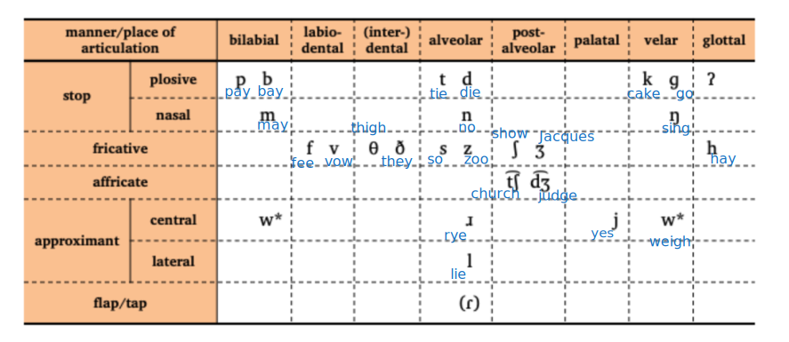

---
tags:
  - linguistics
  - EL1101E
title: Articulatory Phonetics
---
Speech sounds can be split into 
- consonants
	- involves obstruction/construction of airflow in some way
- vowels
	- does not involve obstruction/construction of airflow

# Consonants

> [!info] Consonant sounds
> Amount of consonants in the spelling does not equate to the amount of consonant **sounds** in the word. For example: in _box_, there are 3 consonant sounds.

Production of consonants involves different way of combining articulators (lips, tongue).

> [!important] Phonetic transcription
> Phonetic transcription is a transcription of speech sounds.
> 
> If the word is pronounced differently, it is transcribed differently. Thus, the same word may have multiple IPA transcriptions, depending on who is transcribing it.
> > [!example] Example
> > The word "tomato"

Different configurations of articulators can be used to make different consonants. There are no two consonants in English that have the exact same set of articulators - (use of IPA)
1. Place of articulation
2. Manner of articulation
3. Voicing.

## Place of Articulation

> [!definition] Definition
> Described as **where** the airflow is obstructed/constricted - the location

There are multiple types of sound:
- bilabial (close lips)
	- `b` in `beef`
	- `w` in `swish` (combined with one at the velum
- labio-dental (lower lip to upper teeth)
	- `f` in `beef`
- (inter)dental (tongue between teeth)
	- `th` in `tooth`
- alveolar  (touches the alveolar ridge)
	- `t` in `tooth`
	- `s` in `swish`
- post-alveolar (tongue touches tip of the mouth) 
	- `sh` in `swish`
- palatal (hard boney surface at the back)
	- `y` in `young`
- velar (soft tissue at the back)
	- `g` in `hog`
	- `w` in `swish` (combined with one at the bilabial)
	- `k` and `ng` in `king`
- glottal (vocal folds)
	- `h` in `hog`

> [!info] Categorisation of other sounds like whistling/tongue click
> In English, they are not part of speech sounds, thus they are not transcribed in English words. These sounds, however, are found in certain African languages.

## Manner of Articulation

> [!definition] Definition
> Described as **how** the airflow is obstructed/constricted

There are different ways to block the airflow
- stops (airflow is completely blocked)
	- plosives (oral stops) `t, p, k, b, d, g`
	  There is a complete closure in the oral cavity, velum ==raised==. Air cannot escape from vocal tract, causing build up of pressure.
	- nasal stops `n, m`
	  There is a complete closure in the oral cavity, velum ==lowered==. Air cannot escape from the oral cavity, but escapes from the **nasal cavity**
	- glottal stops
- fricatives `f, v, s, z`
  narrow constriction creating friction in the airflow
- affricates `ch` in `church`
  single sounds beginning as plosive ending as fricative
- approximants
  articulators approximate each other, not closely enough to create turbulence in airflow - air flows through center of the sound 
  - central approximants `w`
	air flows through center of mouth
  - lateral approximants `l`
	tongue tip touches alveolar ridge, but tongue is lowered at the sides, so air can flow through the sides without turbulence
- flap
  tongue briefly taps roof of the mouth, not long enough for pressure to build up closure (wa`t`er in American English).

## Voicing

To tell if a sound is voiced - feel for vibration at larynx/throat as vocal folds are encased within the larynx, and the vocal fold vibration creates voicing.

Configurations of vocal fold
- held far apart to allow air to pass through freely (creates a ==voiceless== sound)
- adjusted so they are gently touching (creates a ==voiced== sound)
- held tightly together to create a complete closure (glottal stop)

> [!tip]
> Glottal stops are generally voiceless.
## Convention

> [!important]
> Voicing + place + manner

# Vowels

Vowels can be described in terms of three core dimensions:
1. _tongue_ backness 
2. _jaw_ height
3. tenseness
4. _lip_ rounding.
## Backness

Backness refers to the position of the tongue. The levels of backness refers to:
1. front
2. central
3. back
## Height

1. high
2. medium
3. low
## Lip Rounding

1. unrounded/spread
2. rounded

> [!remark]
> In English, all the round vowels are found in the back. Generally, most round vowels are found in the back.

## Tenseness

1. tense
2. lax
## Combinations

There are also combinations of vowels that function as a single unit in the sound system.

> [!definition] Diphthongs and monophthongs
> A diphthong is a combination of multiple vowels, unlike a monophthong which is produced with a single articulatory configuration.
> 
> > [!example]
> > A diphthong could be [ai] while a monophthong could be [a].

A diphthong is defined as a vowel that includes a movement of the tongue body from one position to another. It can be noted as a "vowel-glide" sequence or "vowel-vowel"
- for this course, it is transcribed as a vowel, to better show that they are made in one sound.

A diphthongized vowel is when a vowel is sometimes transcribed as a diphthong to reflect that there is some movement in the tongue for some people when pronouncing the aforementioned vowel. 
Note that these are not **real diphthongs** - the movement in a diphtongized vowel is ==optional==.

## Variation

There can be variation of vowel pronounciation between dialects of English. This is as the vocal space is ==continuous== and ==crowded==.

### Vowel Charts

> [!remark]
> Notable differences are that US English is rhotic while UK english are non-rhotic (r-dropping).
> > [!example]
> > Consider the pronounciation of the word "cure".

Mostly _rhotic_, but increasingly the younger generation are more **non-rhotic**.