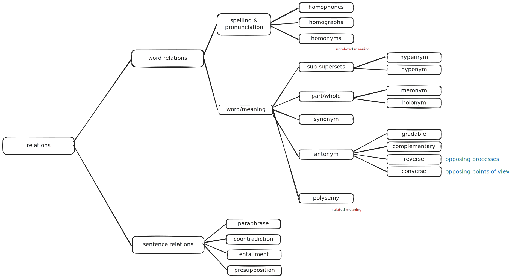

# Word Relations

> [!important] Word
> As words are Saussurean signs  - the linguistic form of the word is known as the signifier while the meaning encoded is the signified.

---

## Associations between the signified

### Hyponym and hypernym

> [!definition] Hypernym
> Superset/collection
> 
> > [!example]
> > Great ape (as a hypernym of human)

> [!definition] Hyponym
> Subset/member within the collection
> 
> > [!example]
>  Human (as a hyponym of great ape)

> [!note] Hyponym and hypernym relation
> $X = hyponym \implies X = hypernym$, but $X = hypernym ] \not\implies X = hyponym$

### Holonym and meronym

> [!note] Holonym and meronym refers to a 'part of' relation

> [!definition] Holonym
> Entire unit

> [!definition] Meronym
> Part of the unit

---

## Associations between signifiers

> [!definition] Polyseme
> Word with multiple related meanings

> [!definition] Homonym
> Word with separate unrelated meaning

> [!note] Polysemes and homonyms require the understanding of the word's etymology
> > [!definition] Etymology
> > Origin and historical development

> [!definition] Homophones
> Words pronounced the same way, with unrelated meanings

> [!definition] Homographs
> Words spelt the same way, with unrelated meanings, irrespective of pronounciation.

> [!definition] Synonym
> Words with approximately the same meaning

> [!definition] Antonym
> Words with the opposite meaning

> [!note] Complementary antonym
> There is
> - nothing in the world that is part of what both X and Y refer to
> - if something is not X, it must be Y.

> [!note] Gradable antonyms
> There is
> - nothing in the world that is a part of what both X and Y refer to
> - if something is not X, it may or may not be Y.
> 
> Generally, it is possible to ask about the extent of a gradeable antonym.

> [!note] Reverses
> Pair of words that denote opposing processes
> 
> > [!example] ascend/descend, expand/contract

> [!note] Converses
> Pairs of words that represent two opposing points of view.
> > [!example] left/right, employer/employee

## Relations between sentences/phrases

> [!definition] Paraphrase
> Phrases/sentences that have approximately the same meaning
> 
> $A = B$

> [!definition] Contradiction
> Phrases/sentences that mean the opposite and cannot be true at the same time.
> 
> $A = B'$

> [!definition] Entailment
> If sentence A is true, then sentence B must be true. However, makes no claim about what happens when sentence B is true. 
> $A \implies B$
> 
> Entailment relations disappears after negation

> [!definition] Presupposition
> Sentence B is an implicit assumption of sentence A.
> 
> $B$ is always true regardless of $A$.
> 

## Layers of meaning

> [!note] Denotation vs connotation
> Denotation refers to the literal meaning, while connotation refers to the association evoked by the said word.

What begins as a connotation may eventually be encoded as part of the denotation.

> [!note] Extension (aka reference) vs intension (aka sense)
> Extension is what the expression refers to (the object itself) while intension is the intrinsic meaning of the expression

> [!example] Demonstratives
> 
> Intension is fixed, but extension depends on speaker

