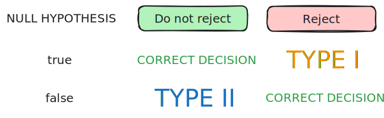

> [!note] The five main steps
> 1. Set hypotheses: null $H_{0}$ and alternative $H_{1}$
> 2. Set level of significance
> 3. Identify test statistic, distribution, and rejection criteria
> 4. Compute observed test statistic value
> 5. Conclude

# Step 1: Set hypothesis

In general, the position of null hypothesis is adopted - it is typically the default assumption.

We usually let hypothesis that we want to prove be the alternative hypothesis.

> [!note] Possible outcomes
> Reject $H_{0}$ or fail to reject $H_{0}$

Type of test:
- one-sided
- two-sided

# Step 2: Level of significance

Outcomes:
- Reject $H_{0}$, conclude $H_{1}$
- Do not reject $H_{0}$, conclude $H_{1}$

> [!definition] Type I error
> Rejecting the null hypothesis $H_{0}$ when it is true
> 
> > [!definition] Level of significance
> > $$
> > \alpha = P(\text{type 1 error}) = P(\text{reject } H_{0} | H_{0} \text{ is true})
> > $$

> [!definition] Type II error
> Not rejecting null hypothesis $H_{0}$ when it is false
> 
> > [!definition] Power
> > Power of the test refers to the value $1 - \beta$, where
> > $$
> > \beta = P(\text{type 2 error}) = P(\text{do not reject } H_{0} | H_{0} \text{ is false})
> > $$

> [!note] Type I error is considered a serious error.

# Step 3: Test statistic, distribution, rejection

Select a suitable test statistic - it quantifies the likeliness of observing the sample, assuming null hypothesis holds. 

The $\alpha$ allows to find a decision rule such that it divides the set of all possible values of the test statistic into two regions, one being the rejection region (or critical region), and the other the acceptance region.

# Step 4 & 5: Calculation and Conclusion

Once sample is taken, we check whether the obtained value of the test statistic is within rejection region:
- if it is, sample too improbable assuming $H_0$ holds, hence $H_0$ rejected.
- if it is not, we failed to reject $H_{0}$

> [!important] We cannot prove $H_{0}$ is true: use the term "fail to reject $H_{0}$"

# $p-$Value approach to testing

> [!definition] p-value
> The p-value is the probability of obtaining a test statistic at least as extreme ($\leq$ or $\geq$) than the observed sample value, given $H_{0}$ is true.
> Also known as the observed level of significance.

For hypothesis tests, the $p-$value can be described as the probability that the test statistic falls into the the rejection region. If the probability is smaller than the significance level $\alpha$, we then can reject $H_0$.
# Hypothesis Test for the Mean

## Known Variance

> [!note] Conditions
> - Population variance $\sigma^{2}$ is known
> - either
> 	- underlying distribution is normal
> 	- $n$ is sufficiently large ($\geq 30$)

For the null hypothesis $H_{0}: \mu = \mu_0$:
$$
Z = \frac{\bar{X}-\mu_{0}}{\frac{\sigma}{\sqrt{n}}} \sim N(0,1)
$$
- $H_{1}: \mu \neq \mu_{0}$
	- Rejection regions for test statistic: $z < -z_\frac{\alpha}{2}$ or $z > z_\frac{\alpha}{2}$
	- $p-$value: $2P(Z>|z|) = 2P(Z<|-z|)$
- $H_{1}: \mu < \mu_0$
	- Rejection regions for test statistic: $z < -z_{\alpha}$
	- $p-$value: $P(Z < -|z|)$
- $H_{1}: \mu > \mu_0$
	- Rejection regions for test statistic: $z > z_{\alpha}$
	- $p-$value: $P(Z > |z|) = P(Z < -|z|)$

## Unknown Variance

> [!note] Conditions
> - Population variance $\sigma^{2}$ is known
> - underlying distribution is normal
>

For the null hypothesis $H_{0}: \mu = \mu_{0}$:
$$
Z = \frac{\bar{X}-\mu_{0}}{\frac{S}{\sqrt{n}}} \sim t_{n-1}
$$

- $H_{1}: \mu \neq \mu_{0}$
	- Rejection regions for test statistic: $t < -t_{n-1, \frac{\alpha}{2}}$ or $t > t_{n-1, \frac{\alpha}{2}}$
	- $p-$value: $2P(T >|t|) = 2P(T<|-t|)$
- $H_{1}: \mu < \mu_0$
	- Rejection regions for test statistic: $t < -t_{n-1, \alpha}$
	- $p-$value: $P(T < -|t|)$
- $H_{1}: \mu > \mu_0$
	- Rejection regions for test statistic: $t > t_{n-1,\alpha}$
	- $p-$value: $P(T > |t|) = P(T < -|t|)$

# Confidence intervals for two-sided tests

> [!important] The two-sided hypothesis test procedure is equivalent to finding a $100(1-\alpha)$ confidence interval for $\mu$.

Consider the hypothesis $H_{0}: \mu = \mu_{0}$, with the test statistic $z$.

The $100(1-\alpha)\%$ confidence interval for $\mu$ in this case is given by
$$
(\bar{x} - z, \bar{x} + z)
$$
If it contains $\mu_{0}$,
$$
\bar{x} - z \leq \mu_{0} \leq \bar{x} + z
$$

Based on the above inequality, $\mu_{0}$ falls out of the rejection region defined by the test statistic. 

> [!important] This means that when the confidence interval contains $\mu_0$, $H_{0}$ will not be rejected at level $\alpha$.

Similarly, this also means that if it does not contain $\mu_{0}$, $H_{0}$ will be rejected at level $\alpha$.

# Hypothesis Tests for Comparing Means

## Independent Samples with Known Different Variances

> [!note] Condition
> - population variances $\sigma^{2}_{1}, \sigma^{2}_{2}$ are known
> - either
> 	- distributions are normal
> 	- $n_1,n_2$ are sufficiently large

$$
\delta = \mu_{1}-\mu_{2}
$$

For the null hypothesis $H_{0}: \delta = \delta_{0}$:
$$
Z = \frac{(\bar{X}-\bar{Y})-\delta_{0}}{\sqrt{\frac{S^2_1}{n_{1}}+\frac{S^2_2}{n_2}}} \sim N(0,1)
$$

- $H_{1}: \delta \neq \delta_{0}$
	- Rejection regions for test statistic: $z < -z_\frac{\alpha}{2}$ or $z > z_\frac{\alpha}{2}$
	- $p-$value: $2P(Z>|z|) = 2P(Z<|-z|)$
- $H_{1}: \delta < \delta_0$
	- Rejection regions for test statistic: $z < -z_{\alpha}$
	- $p-$value: $P(Z < -|z|)$
- $H_{1}: \delta > \delta_0$
	- Rejection regions for test statistic: $z > z_{\alpha}$
	- $p-$value: $P(Z > |z|) = P(Z < -|z|)$

## Independent Samples with Unknown Different Variances

> [!note] Condition
> - population variances $\sigma^{2}_{1}, \sigma^{2}_{2}$ are unknown
> -  $n_1,n_2$ are sufficiently large

$$
\delta = \mu_{1}-\mu_{2}
$$

For the null hypothesis $H_{0}: \delta = \delta_{0}$:
$$
Z = \frac{(\bar{X}-\bar{Y})-\delta_{0}}{\sqrt{\frac{S^2_1}{n_{1}}+\frac{S^2_2}{n_2}}} \sim N(0,1)
$$

- $H_{1}: \delta \neq \delta_{0}$
	- Rejection regions for test statistic: $z < -z_\frac{\alpha}{2}$ or $z > z_\frac{\alpha}{2}$
	- $p-$value: $2P(Z>|z|) = 2P(Z<|-z|)$
- $H_{1}: \delta < \delta_0$
	- Rejection regions for test statistic: $z < -z_{\alpha}$
	- $p-$value: $P(Z < -|z|)$
- $H_{1}: \delta > \delta_0$
	- Rejection regions for test statistic: $z > z_{\alpha}$
	- $p-$value: $P(Z > |z|) = P(Z < -|z|)$

## Independent Samples with Equal Variances

> [!note] Condition
> - population variances $\sigma^{2}_{1}, \sigma^{2}_{2}$ are unknown but equal
> - distributions are normal
> - $n_1,n_2$ are small

$$
\delta = \mu_{1}-\mu_{2}
$$

For the null hypothesis $H_{0}: \delta = \delta_{0}$:
$$
Z = \frac{(\bar{X}-\bar{Y})-\delta_{0}}{S_p\sqrt{\frac{1}{n_{1}}+\frac{1}{n_2}}} \sim t_{n_1+n_2-2}
$$

- $H_{1}: \delta \neq \delta_{0}$
	- Rejection regions for test statistic: $t < -t_{n_1+n_2-2}$ or $t > t_{n_1+n_2-2}$
	- $p-$value: $2P(T > |t|) = 2P(T < -|t|)$
- $H_{1}: \delta < \delta_0$
	- Rejection regions for test statistic: $t > -t_{n_1+n_2-2}$
	- $p-$value: $P(T < -|t|)$
- $H_{1}: \delta > \delta_0$
	- Rejection regions for test statistic: $t > t_{n_1+n_2-2}$
	- $p-$value: $P(T > |t|) = P(T < -|t|)$

## Dependent Samples

For paired data, define $D_{i}=X_{i}-Y_{i}$

For the null hypothesis $H_{0}: \mu_{D} = \mu_{D_{0}}$,
$$
T = \frac{\bar{D}-\mu_{D_{0}}}{\frac{S_{D}}{\sqrt{n}}}
$$

Depending on the sample size, the test statistic follows:
- small: $T \sim t_{n-1}$
- large: $T \sim N(0,1)$

